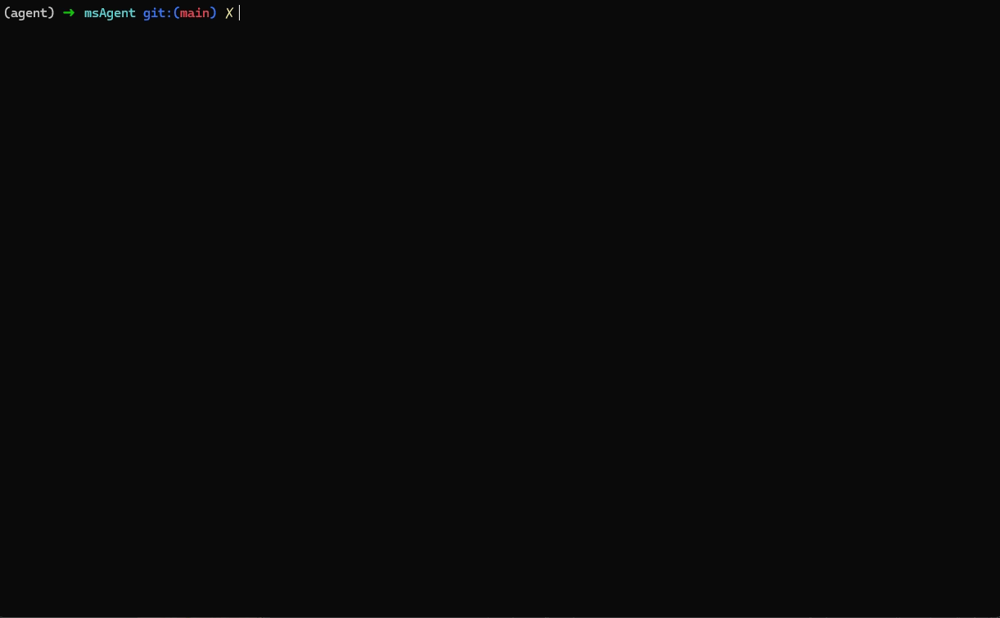

<h1 align="center" >MindStudio Agent</h1>

<b>面向 Ascend NPU 场景的一站式调试调优</b>

简体中文 | [English](./README_EN.md)

## ✨ 最新消息

🔹 **[2026.08.26]**：新增一键安装方式（`curl | bash` / `irm | iex`），基于 uv 隔离安装，避免与现有环境依赖冲突，推荐使用（详见《[安装指南](docs/zh/install_guide/msagent_install_guide.md)》）。 
🔹 **[2026.06.04]**：`Hermes` 更名为 `Profiler`，`Zephyr` 更名为 `Quantizer`，`Icarus` 更名为 `Operator`。 
🔹 **[2026.05.21]**：`v26.0.0已发布，新增Icarus Agent，覆盖算子性能调优场景`。 
🔹 **[2026.04.27]**：`v26.0.0.alpha1` 发布，新增 `Accuracy` / `Zephyr` Agent，覆盖精度调优与模型量化场景。 
🔹 **[2026.04.08]**：`v0.1.3` 发布，完成 DeepAgents 重构并增强 `Hermes` / `Minos` Agent。 
🔹 **[2026.03.19]**：`mindstudio-agent` 已发布到 PyPI，推荐使用 `pip install mindstudio-agent` 安装。

## ℹ️ 简介

MindStudio-Agent（简称 `msAgent`）是面向昇腾 Ascend NPU 开发、调试和调优场景的 AI Agent 工作台。它将 CLI、多模型 Provider、MCP 工具、内置 Skills 与领域 Agent 组合在一起，帮助用户在性能调优、精度分析、模型量化、算子优化、文档体验与代码审查等任务中更快定位问题并形成可执行建议。

  

## ⚙️ 功能介绍

| 名称 |  核心能力 |
|---|---|
| [**Profiler**](docs/zh/agent_guide/profiler.md) | **【性能调优】**  聚焦 Ascend Profiling 分析，覆盖单卡、多卡、集群等场景，擅长快慢卡、慢节点、MFU、通信瓶颈、算子热点、下发调度等性能问题定位与优化建议。 |
| [**Accuracy**](docs/zh/agent_guide/accuracy.md) | **【精度调优】** 聚焦 Ascend 精度分析与优化，覆盖 RL 训推一致性分析、loss / gnorm NaN 分析等常见精度问题。 |
| [**Quantizer**](docs/zh/agent_guide/quantizer.md) | **【模型量化】**  聚焦 msModelSlim 量化与压缩场景，协助完成模型适配可行性、结构风险评估与基础适配器开发。 |
| [**Modeling**](docs/zh/agent_guide/modeling.md) | **【仿真建模】** 聚焦大模型（LLM/VLM）仿真建模场景，承接性能建模、单点仿真、吞吐规划、设备画像与模型接入准备类问题。 |
| [**Operator**](docs/zh/agent_guide/operator.md) | **【算子调优】**  聚焦 Ascend NPU 算子性能调优，包括算子性能深度分析、端到端算子性能优化，辅助提升调优效率并降低开发难度。 |
| [**Minos**](docs/zh/agent_guide/minos.md) | **【文档体验与代码审查】**  聚焦 README 走查、安装流程验证、Quick Start 体验、新手 onboarding、文档可用性评估，以及 GitCode PR 审查与评审意见整理。 |
| [**SpecTrainer**](docs/zh/agent_guide/spectrainer.md) | **【投机解码重采样】**  聚焦投机解码训练数据的 on-policy 重采样（响应重生成），把多轮对话的 assistant 回答用 verifier 模型逐轮重新生成可直接进训练的预分词样本。 |

> **SpecTrainer** 的 Skill 脚本基于开源 [speculators](https://github.com/vllm-project/speculators) 仓 **v0.6.0** 做流程编排；技能说明见 [skills/README.md](skills/README.md)。

## 🚀 快速入门

10 分钟快速一站式体验一键安装、接入模型并启动msAgent进入交互会话的流程，请参见《[msAgent快速入门](docs/zh/quick_start/msagent_quick_start.md)》。

## 🧩 AI Skill

除领域 Agent 外，`msagent` 还内置了一批可复用的 Skills，覆盖 Profiling 数据分析、算子性能调优、精度溢出检测、文档体验审查、代码审查等场景。完整技能清单、触发方式与依赖说明，请参见 《[Skills](skills/README.md)》。

如需将 Skills 或 msprof-mcp 接入 Trae、Claude、Codex 等外部 Agent，可参考 《[接入指南](docs/zh/user_guide/integration-guide.md)》。

## 📦 安装指南

介绍工具的环境依赖与安装方法，支持一键安装、pip 安装、源码编译三种方式，请参见《[msAgent安装指南](docs/zh/install_guide/msagent_install_guide.md)》。

## 📘 使用指南

工具的详细使用方法，请参见《[msAgent使用指南](docs/zh/user_guide/usemap.md)》。

## 安全提示

- `msagent` 可执行 shell 命令、加载第三方 MCP Server 与 Skill，请仅在可信环境中使用。
- 建议通过环境变量传入凭据；`msagent` 自身发起的 HTTP 请求默认启用 TLS 证书校验。

## ❓ FAQ

常见问题与排查入口请参见 《[FAQ](docs/zh/support/faq.md)》。

## 🌌 智能检索

为提升文档查阅效率，我们提供多种高效检索方式： 
🔹 [AI 问答（DeepWiki）](https://deepwiki.com/mindstudio-docs/master)：自然语言问答，快速把握项目架构与模块关系。 
🔹 [AI 问答（ZRead）](https://zread.ai/mindstudio-docs/master)：中文问答体验更优，精准定位功能用法与细节。 
🔹 [精确搜索（ReadTheDocs）](https://mindstudio-docs-master.readthedocs.io)：关键词全文检索，直达接口、参数与报错等信息。

## 🛠️ 贡献指南

欢迎提交 Issue、PR 或补充新的领域 Skills。完整流程、开发自检与各类贡献指引见 《[贡献指南](docs/zh/contributing/contributing.md)》。

## ⚖️ 相关说明

🔹 《[版本说明](https://gitcode.com/Ascend/msagent/releases)》 
🔹 《[许可证声明](docs/zh/legal/license_notice.md)》 
🔹 《[安全声明](docs/zh/legal/SECURITY.md)》 
🔹 《[免责声明](docs/zh/legal/disclaimer.md)》

## 🤝 建议与交流

欢迎大家为社区做贡献。如果有任何疑问或建议，请提交 [Issues](https://gitcode.com/Ascend/msagent/issues)，我们会尽快回复。感谢您的支持。

|                      即时互动（微信群）                      |                      官方资讯（公众号）                      | 深度支持（助手/论坛）                                        |
| :----------------------------------------------------------: | :----------------------------------------------------------: | :----------------------------------------------------------- |
|  *扫码加入技术交流群* |  *扫码关注官方公众号* | 扫码入群并关注公众号，直达 MindStudio 用户与开发者最快捷的交流平台：  **快速提问：** 与社区小伙伴即时探讨技术问题 **掌握动态：** 第一时间获取版本发布与功能更新通知  **经验共享：** 与广大开发者交流最佳实践与实战心得      **更多支持渠道**：👉 昇腾助手： 👉 昇腾论坛： |

## 🙏 致谢

本工具由华为公司下列部门联合贡献： 
🔹 昇腾计算 MindStudio 开发部 
🔹 昇腾计算生态使能部

感谢来自社区的每一个 PR，欢迎贡献！
