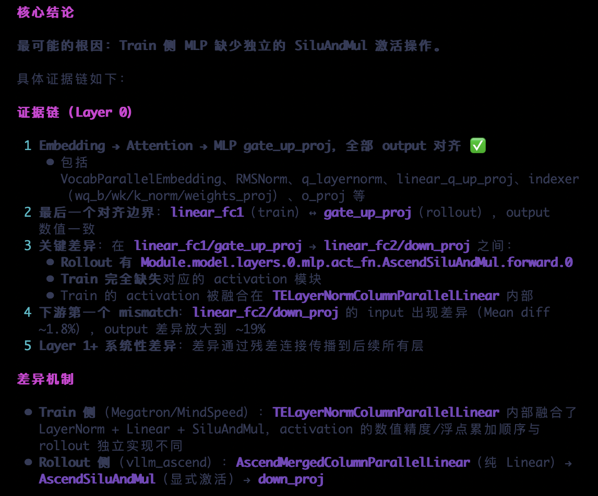

# Accuracy Precision Debugging

`Accuracy` is an agent for msProbe model precision debugging that converts complex precision data into structured conclusions, root-cause analysis, and actionable optimization recommendations.

## Agent Positioning

- Targets Ascend precision analysis scenarios, such as single-device, multi-device, and cluster environments.
- Focuses on dump data interpretation and tuning recommendations.
- Applies to RL training-inference consistency analysis and loss/gnorm NaN issue analysis.

## Core Capabilities

- Root-cause analysis of RL training-inference inconsistencies
- Identification of loss/gnorm NaN issues
- Identification of deterministic computing issues

## Recommended Usage

- Provide the dump data directory path directly and describe the problem you want to solve.
- For cluster or multi-device issues, describe the anomaly, the involved rank, or the training stage wherever possible.

## Typical Use Scenarios

| Scenario | Example Prompt | Sample Output |
|----------------|---|--|
| RL training-inference inconsistency analysis | `Based on the input training and inference dump data, analyze the sources of the differences between training and inference and provide possible causes.` |  |
| loss/gnorm NaN overflow analysis | `Based on the input training dump data, analyze the NaN overflow and identify the source device and the root-cause operator.` |  |
| Inconsistent results across two model runs after enabling deterministic computing or switching software versions | `Based on the input md5 dump data, compare the data, find the difference points, and provide possible causes.` |  |

## When the Analysis Results Are Incorrect

- You can provide additional auxiliary information, including relevant code and correct background knowledge.
- You can raise questions or point out errors to help the agent correct its incorrect viewpoints.
- You can propose analysis directions and key points to guide the agent to analyze further along the relevant clues.

For analysis examples, see [`accuracy_usage_example.md`](../example/accuracy_usage_example.md).
