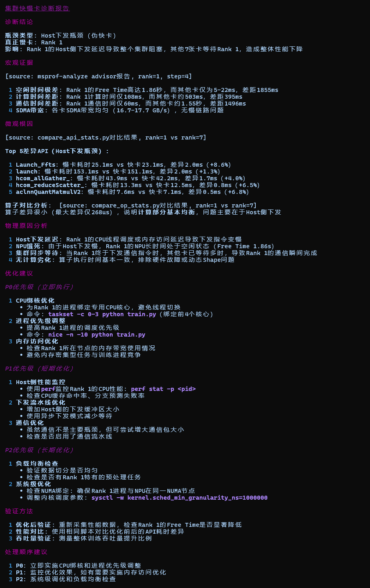
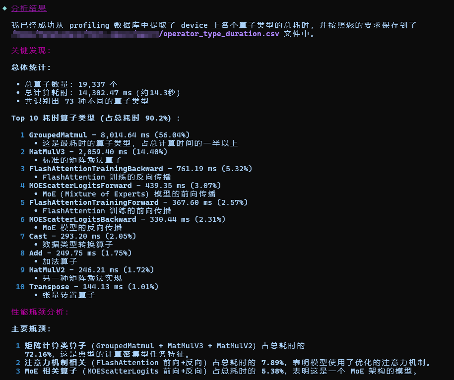

# Profiler Performance Tuning

`Profiler` is an agent for Ascend Profiling and performance tuning scenarios. It converts complex performance data into structured conclusions, root-cause analysis, and actionable optimization recommendations.

## Agent Positioning

- Targets Ascend performance analysis scenarios, such as single-device, multi-device, and cluster environments.
- Focuses on Profiling data interpretation, bottleneck identification, and tuning recommendations.
- Applies to the analysis of issues such as fast and slow devices, slow nodes, MFU, communication bottlenecks, operator hotspots, and launch scheduling.

## Core Capabilities

- Profiling data inspection and data quality verification
- MFU calculation, formula explanation, and result interpretation
- Analysis of fast and slow devices, slow nodes, and load imbalance in clusters
- Identification of communication bottlenecks, operator hotspots, and host launch and scheduling issues
- Structured analysis and export of deliverables such as DB, CSV, and Trace files

## Recommended Usage

- Provide the Profiling data directory path directly and describe the problem you want to solve.
- For cluster or multi-device issues, describe the anomaly, the involved rank, or the training stage wherever possible.
- If your goal is data extraction or export, provide the DB or CSV file paths and the target format directly.

## Typical Results

| Scenario | Example Prompt | Sample Output |
|---|---|---|
| MFU calculation | `Based on path/to/kernel_details.csv, calculate the MFU (10B3) of matmul and explain the basis of each calculation.` |  |
| Fast and slow device diagnosis | `Analyze whether /path/to/cluster_profiling/ contains fast and slow device issues, locate the abnormal rank, and provide possible causes.` |  |
| Profiling data inspection | `Analyze whether the data in /path/to/xxx_ascend_pt/ was collected properly.` |  |
| `msprof` tool usage consultation | `How do I compile the run package with msprof?` |  |
| DB custom content export to CSV | `Based on ascend_pytorch_profiler_0.db, extract the total duration of each operator type and output them to a CSV file in descending order.` |  |
