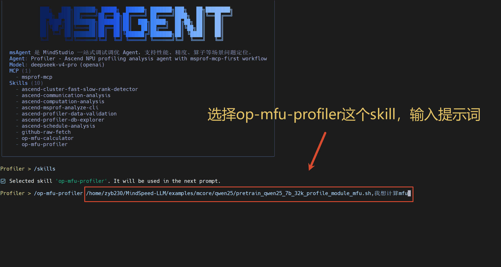

# Best Practices for Operator-Level MFU Measurement and Analysis

## Scenario 1: Collecting Profiling Data End-to-End and Analyzing MFU

Taking MindSpeed-LLM as an example, this section shows how to complete MFU analysis end-to-end using the `op-mfu-profiler` Skill of msagent.

### Workflow

1. In msagent, select the `op-mfu-profiler` Skill and enter the prompt: `/xxx/MindSpeed-LLM/examples/mcore/qwen25/pretrain_qwen25_7b_32k_profile_module_mfu.sh, I want to calculate the MFU`.
2. The Skill automatically checks the environment (`torch_npu` and `msprof-analyze`) and verifies the four key configurations in the training script one by one (`with_flops`, `mstx`, `export_type`, and `profiler_level`). If any item is missing, the Skill points it out and modifies it.
3. When the configurations are ready, run the collection to gather profiling data.
4. Call the `operator_mfu` analysis capability of `msprof-analyze` to analyze the profiling data.
5. Output the `OperatorMFU` table to obtain key metrics of each operator, such as MFU, actual TFLOPS, and execution duration.

### Demonstration

---

## Scenario 2: Registering FLOPs Formulas for New Operators

When the target operator is not in the default registration list of `torch_npu`, `msprof-analyze` cannot calculate its MFU. You can register a FLOPs formula on the TorchNPU side using `@register_npu_flop`.

### Workflow

1. **Determine the FLOPs formula**: Refer to the existing operators of the same type in `_flops_formulas.py` and derive the formula following its code style. If the formula cannot be derived, stop immediately. **Do not fabricate an estimate**.
2. **Register the formula**: Add a function decorated with `@register_npu_flop` in `torch_npu/profiler/_flops_formulas.py`. Set `target` to the target operator, and return the FLOPs calculation result in the function body.
3. **Verify**: Collect the profiling data again, query `MSTX_EVENTS` with SQL to confirm that the FLOPs of the new operator has been written to the drive, and then run `msprof-analyze` to confirm that the operator appears in the `OperatorMFU` table and the `flops` field is consistent with the manual calculation.

### Demonstration

