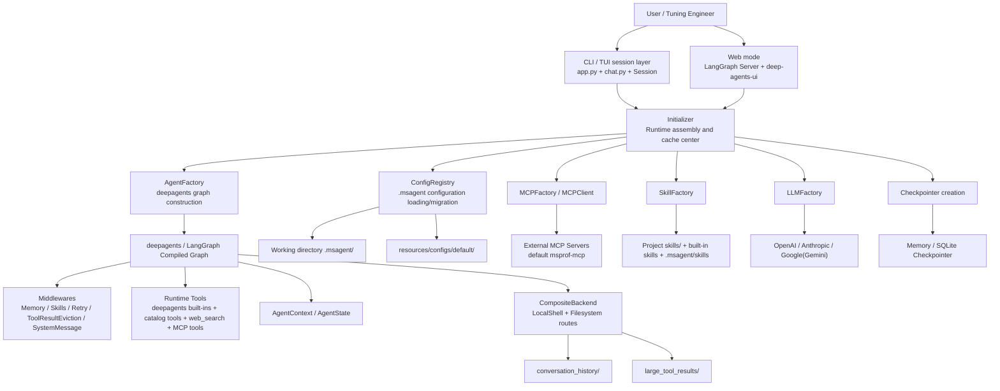
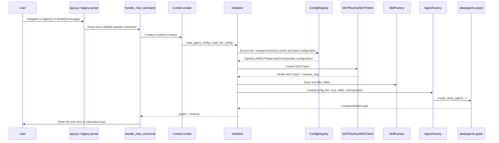
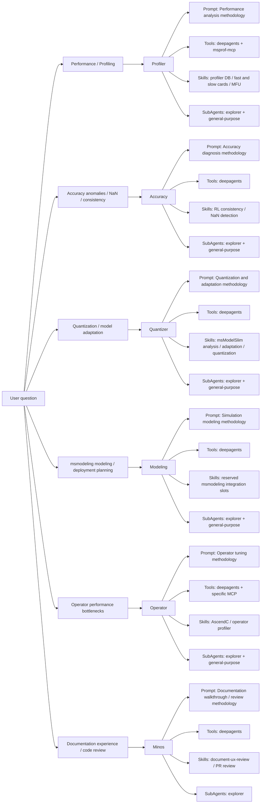
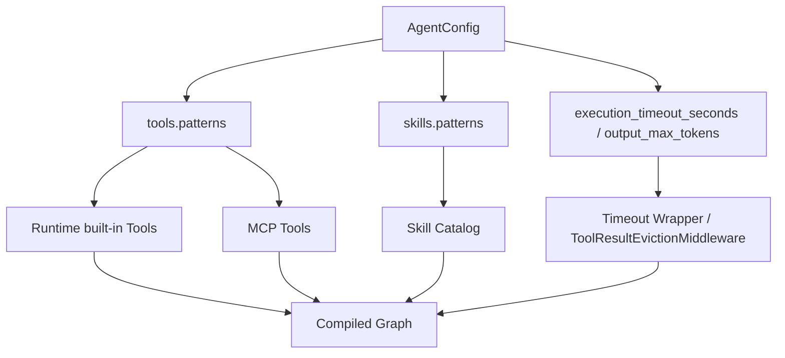
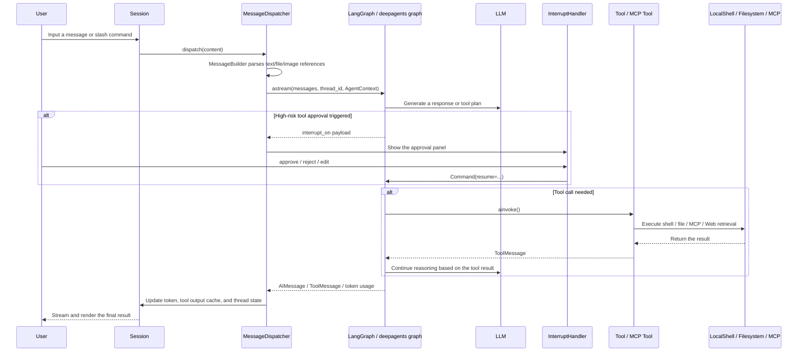
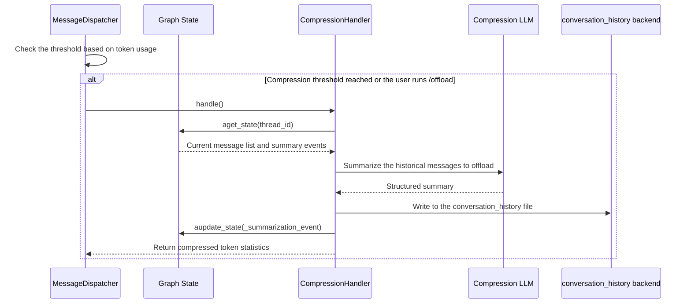

# msAgent Design Document

## Revision History

| Date | Revision | Description | Author | RFC Document |
| -- | -- | -- | -- | -- |
| 2026-06-03 | 1.0 | Added the msAgent detailed design document, covering the architecture, interaction chain, extension mechanisms, and test design | kali20gakki1 |  |

## Background Description

### 1. Product Positioning

msAgent is a one-stop debugging and tuning solution for the Ascend development process. Rather than a single-point tool, it integrates the following capabilities into a unified interactive CLI:

- Specialized Agents for different problem domains, such as performance tuning, accuracy analysis, model quantization, operator tuning, documentation experience, and code review.
- An LLM adaptation layer for multiple model providers, supporting model integration from OpenAI, Anthropic, Google/Gemini, and others.
- An MCP (Model Context Protocol) tool integration mechanism for extending external capabilities.
- A Skill assembly capability for workflow reuse.
- Checkpoint, context compression, approval, timeout, and retry mechanisms for stable operation of long-running sessions.

### 2. Pain Points

Using Agents to debug and tune in the Ascend ecosystem faces several typical difficulties:

- Diverse problem domains: Performance, accuracy, quantization, operator optimization, documentation experience, and other problems require different knowledge systems.
- Fragmented toolchains: In MindStudio scenarios, multiple CLI tools are often involved at the same time. For example, performance tuning involves msprof and Profiling data, model scripts, configuration files, documentation, and auxiliary analysis scripts. Therefore, locating problems often requires switching back and forth between multiple tool entry points and multiple data carriers.
- Complex context: Tuning tasks often span multiple conversation rounds and involve large amounts of context such as logs, Profiler data, code, configurations, and historical conclusions.
- Non-negligible risks: Tool execution may involve shell commands, external connections, and long-running tasks. Therefore, protection mechanisms such as approval, timeout, and retry are required.
- High extension costs: Without a clear assembly layer, integrating new Agents, new Skills, and new MCP services quickly erodes the system boundaries.

### 3. Core Value

| Value Point | Description |
| -- | -- |
| Unified entry point | Expose a unified entry point through the `msagent` CLI and Web mode, reducing learning and switching costs. |
| Domain separation | Use the Agent + SubAgent + Skill combination to carry knowledge from different domains, instead of stuffing all logic into a single Prompt. |
| Configuration-driven | LLM, Agent, Checkpointer, MCP, Sandbox, and Approval are all driven by the local `.msagent/` configuration. |
| Controlled extensibility | Tool Pattern, Skill Pattern, and MCP include/exclude jointly define the capability boundaries. |
| Stable operation | Checkpoints, retry, timeout, approval, middleware, and context compression keep long-chain conversations sustainable. |

### 4. Design Goals and Non-Goals

#### 4.1 Design Goals

- Support multiple specialized Agents while maintaining a unified runtime model.
- Support local configuration, default templates, version migration, and directory-based extension.
- Support both CLI/TUI and Web interaction forms sharing the same graph runtime.
- Support composable assembly and fine-grained filtering of Tool, Skill, and MCP.
- Support context governance for long-running sessions, including checkpoints, memory injection, compression offloading, and externalization of large results.
- Provide stable boundaries for testing, packaging, and documentation release.

#### 4.2 Non-Goals

- This design document does not elaborate on the internal algorithm implementation details of each Skill.
- msAgent is not designed as a GUI-first frontend product. The current primary entry point remains CLI/TUI.
- The runtime does not directly host hardware Profiling/quantization algorithms. Instead, these are accomplished collaboratively through Skills, MCP, and external tools.

## Solution Design

### 1. Design Principles

- **Configuration-first**: Models, Agents, MCP, approval, and checkpoints are all resolved through configuration, without hard-coding policies into service logic.
- **Centralized assembly**: Use the `Initializer` to centrally assemble the graph runtime, avoiding CLI, Web, and tests each assembling dependencies separately.
- **Clear boundaries**: CLI handles interaction, `ConfigRegistry` handles configuration, `AgentFactory` handles graph construction, and `MessageDispatcher` handles the message flow.
- **Incremental extension**: When adding Agents, Skills, or MCP services, extend along the existing directory structure and filtering rules first, rather than modifying the core main flow.
- **Runtime controllability**: Control risks in complex scenarios through approval, timeout, retry, context compression, and externalization of tool results.

### 2. Overall Architecture

#### 2.1 Layered Architecture Diagram



#### 2.2 Architecture Interpretation

Overall, msAgent adopts an approach of "**unified entry layer, centralized runtime assembly, and decoupled capability modules**":

- CLI and Web are not two different products, but two frontend entry points that ultimately rely on `Initializer.create_graph()` to assemble the same kind of graph runtime.
- `ConfigRegistry` is responsible for organizing template resources, working-directory configuration, and historical compatibility migration into strongly typed configuration objects.
- `AgentFactory` is responsible for actually assembling the LLM, tools, skills, middleware, backends, and checkpoints into a `CompiledStateGraph`.
- `MessageDispatcher` is responsible for the message flow, streaming rendering, approval resume, automatic compression, and token statistics during the runtime phase.
- The three capability sources of Tools, Skills, and MCP jointly determine the "capability boundary" of each Agent through Pattern filtering.

### 3. Module Responsibility Breakdown

| Module | Representative Path | Main Responsibilities | Design Highlights |
| -- | -- | -- | -- |
| CLI startup layer | src/msagent/cli/bootstrap/ | Parse commands, start sessions, and route to chat/config/web modes. | `normalize_argv()` automatically routes bare invocations to the default interactive session. |
| Session layer | src/msagent/cli/core/ | Save thread context, session state, hot-switching of Agent/Model, and tool output memory. | `Context` and `Session` isolate runtime UI state from the graph lifecycle. |
| Message dispatch layer | src/msagent/cli/dispatchers/ | Handle slash commands, regular messages, streaming output, and approval resume. | `MessageDispatcher` is the main entry point for single-turn conversation execution. |
| Configuration layer | src/msagent/configs/ | Define configuration models for Agent/LLM/MCP/Approval/Checkpointer and so on. | Modeled with Pydantic, with version migration logic retained. |
| Runtime assembly layer | src/msagent/cli/bootstrap/initializer.py | Aggregate all configuration, create the graph, and cache the visible capability catalog. | Serves as the true dependency injection center of the system. |
| Agent construction layer | src/msagent/agents/factory.py | Call `create_deep_agent()` to compile the graph and inject middleware and backends. | Tool filtering, system prompt rendering, result externalization, and other capabilities are centralized here. |
| LLM layer | src/msagent/llms/factory.py | Parse model Provider, API Key, Base URL, timeout, and HTTP client parameters. | Compatible with both official and OpenAI-compatible gateways. |
| MCP layer | src/msagent/mcp/ | Parse MCP connections, fetch MCP tools, and attach timeout wrappers. | Uses `tool_name_prefix=True` by default to resolve tool namespace issues. |
| Tool/Skill layer | src/msagent/tools/, src/msagent/skills/ | Unify Tool wrapping, capability cataloging, and Skill scanning and reading. | `fetch_tools/get_tool/run_tool` and `fetch_skills/get_skill` form a self-describing capability interface. |
| Middleware layer | src/msagent/middlewares/ | Cross-cutting capabilities such as tool result externalization, token statistics, and approval | Allows runtime enhancements without intruding on the core service chain. |
| Web layer | src/msagent/web/ | Export the LangGraph Graph, and launch and customize the official deep-agents-ui. | Reuses the same runtime while providing a branded wrapper. |

### 4. Startup and Assembly Design

#### 4.1 Startup Sequence Diagram



#### 4.2 Key Points of the Startup Chain

1. **CLI compatibility routing**
   `legacy.py` converges the command surface into three categories, `config`, `web`, and the default session, while retaining runtime parameters such as `--agent`, `--model`, and `--approval-mode`.

2. **Working-directory-localized configuration**
   On first run, `ConfigRegistry.ensure_config_dir()` copies `resources/configs/default/` to `<working-dir>/.msagent/` and tries to add it to `.git/info/exclude`, ensuring that the configuration stays local and avoiding accidental commits.

3. **Cache-based assembly**
   After graph construction, the `Initializer` caches:
   - `cached_llm_tools`
   - `cached_tools_in_catalog`
   - `cached_agent_skills`
   - `cached_mcp_server_names`

   These caches serve interactive commands such as `/tools`, `/skills`, and `/mcp`, as well as subsequent Prompt template rendering.

4. **Shared graph construction for CLI/Web**
   In Web mode, `src/msagent/web/runtime.py` reads environment variables and likewise calls `initializer.create_graph()`. Therefore, documentation, testing, and maintenance only need to guard a single set of core runtime behavior.

### 5. Agent Architecture Design

#### 5.1 Specialized Agent Design

The default template includes 6 main agents, all assembled through YAML configuration. The core differences lie in Prompt, visible Tools, visible Skills, SubAgent combinations, and default status.

| Agent | Domain Positioning | Default Status | Typical Tool Pattern | Typical Skill Pattern | SubAgent |
| -- | -- | -- | -- | -- | -- |
| Profiler | Ascend Profiling/performance analysis | Default Agent | `impl:deepagents:*` + `mcp:msprof-mcp:*` | Profiler DB analysis, fast/slow device diagnosis, MFU calculation | explorer + general-purpose |
| Accuracy | Model accuracy analysis | No | `impl:deepagents:*` | RL consistency, NaN/overflow, determinism analysis | explorer + general-purpose |
| Quantizer | Model quantization and adaptation | No | `impl:deepagents:*` | msModelSlim analysis, adaptation, quantization | explorer + general-purpose |
| Modeling | `msmodeling` simulation modeling | No | `impl:deepagents:*` | `text_generate`/`throughput_optimizer`/device profiling/model integration preparation | explorer + general-purpose |
| Operator | Operator performance optimization | No | `impl:deepagents:*` + specific MCP patterns | AscendC operator optimization, operator profiler | explorer + general-purpose |
| Minos | Documentation experience and code review | No | `impl:deepagents:*` | `document-ux-review`, `gitcode-code-reviewer` | explorer |

This design implies:

- Domain capabilities are not hard-coded into Python branch logic, but are orchestrated through Agent configuration.
- Most domain differences are pushed down into Prompt and Skill combinations, keeping the underlying runtime unified.
- Each Agent can precisely control its authorization boundary through Tool Pattern and Skill Pattern, reducing the risk of misuse caused by overly broad capabilities.

#### 5.2 SubAgent Design

The default template includes two subagents:

- `explorer`: focuses on code/repository structure exploration, suitable for locating files, implementation points, and dependencies.
- `general-purpose`: focuses on multi-step research, comprehensive analysis, and reasoning.

They essentially reuse the same runtime as the main agent, with only these differences:

- Different Prompts.
- Lighter default model aliases (`haiku-4.5` in the template).
- Broader Tool Patterns, used to assist the division of labor of the main agent.

#### 5.3 Domain Capability Overview

Default agents define their runtime behavior through the sequence of "problem domain -> Prompt constraints -> Tool boundaries -> Skill combinations -> SubAgent collaboration methods".



The 6 default Agents share the same runtime skeleton and differ through configuration along the following dimensions:

| Dimension | Profiler | Accuracy | Quantizer | Modeling | Operator | Minos |
| -- | -- | -- | -- | -- | -- | -- |
| Primary problem domain | Profiling/performance bottlenecks | Accuracy anomalies | Quantization and adaptation | `msmodeling` simulation modeling | Operator optimization | Documentation and code review |
| Prompt focus | Scheduling, hotspots, communication, MFU | Consistency, NaN, overflow | Model structure, quantization risks, adaptation costs | Simulation parameters, deployment modes, input constraints, validation paths | Operator hotspots, end-to-end performance | Getting-started experience, documentation usability, PR risks |
| Tool boundaries | deepagents + `msprof-mcp` | deepagents | deepagents | deepagents | `deepagents` + specific MCP | deepagents |
| Skill combination characteristics | Strongly relies on Profiling data analysis Skills. | Strongly relies on diagnostic Skills. | Strongly relies on quantization/adaptation Skills. | First version reserves dedicated `msmodeling` Skill extension slots. | Strongly relies on operator tuning Skills. | Strongly relies on process review Skills. |
| Collaboration approach | Main agent makes decisions, subagents supplement with exploration and comprehensive analysis. | Same as left | Same as left | Same as left | Same as left | Leans toward explorer for auxiliary information collection. |

The default agent architecture maps different problem domains to different analysis strategies and capability boundaries through configuration. When adding Agents, follow the same extension approach: define capabilities through Prompt, Skill, Tool Pattern, and SubAgent combinations, without duplicating the runtime implementation.

### 6. Configuration System Design

#### 6.1 Configuration Sources and Priority

msAgent configuration follows an "installation package default template + working-directory local instance" organization. On first run, `ConfigRegistry.ensure_config_dir()` copies the default templates in the installation package to `.msagent/` in the current working directory, and subsequent runs give priority to reading this local directory.

A typical structure is as follows:

```text
resources/configs/default/
├─ config.llms.yml
├─ config.mcp.json
├─ config.approval.json
├─ agents/
│  ├─ Profiler.yml
│  ├─ Accuracy.yml
│  ├─ Quantizer.yml
│  ├─ Modeling.yml
│  ├─ Operator.yml
│  └─ Minos.yml
├─ subagents/
│  ├─ explorer.yml
│  └─ general-purpose.yml
├─ llms/
├─ checkpointers/
├─ sandboxes/
├─ prompts/
└─ skills/

<working-dir>/.msagent/
├─ config.llms.yml
├─ config.mcp.json
├─ config.approval.json
├─ config.checkpoints.db
├─ memory.md
├─ .history
├─ agents/
├─ subagents/
├─ llms/
├─ checkpointers/
├─ sandboxes/
├─ skills/
├─ logs/
├─ cache/
├─ oauth/
└─ conversation_history/
```

The configuration directory is divided into two layers:

- `resources/configs/default/`: the **default template layer** distributed with the source code or installation package, defining out-of-the-box Agent, Prompt, Skill, MCP, and checkpoint templates.
- `<working-dir>/.msagent/`: the **project-local configuration layer** instantiated for the current project, storing both user-editable configuration and runtime state and by-products.

The configuration reading and initialization rules are as follows:

| Scenario | Behavior |
| -- | -- |
| Running `msagent` in a working directory for the first time | If `.msagent/` does not exist, copy the templates from `resources/configs/default/`. |
| Running again after a version upgrade | If the templates add new files, fill in any locally missing ones. Some historical default items are gently migrated, but user customizations are never forcibly overwritten. |
| Reading LLM configuration | Read `.msagent/config.llms.yml` in combination with `.msagent/llms/*.yml`. |
| Reading Agent configuration | Give priority to `.msagent/config.agents.yml` (if present), combined with `.msagent/agents/*.yml`. |
| Reading SubAgent configuration | Give priority to `.msagent/config.subagents.yml` (if present), combined with `.msagent/subagents/*.yml`. |
| Reading Checkpointer configuration | Give priority to `.msagent/config.checkpointers.yml` (if present), combined with `.msagent/checkpointers/*.yml`. |
| Reading Sandbox configuration | Read `.msagent/sandboxes/*.yml`. |
| Reading MCP configuration | Read `.msagent/config.mcp.json`. |
| Reading approval configuration | Read `.msagent/config.approval.json`. |

The key features of the configuration system are as follows:

- **Default template copy**: Layer the "installation-time defaults" and the "project-local configuration" to prevent users from directly modifying resources inside the package.
- **Directory-based extension**: Support directory-organized formats such as `agents/*.yml`, `llms/*.yml`, `checkpointers/*.yml`, and `sandboxes/*.yml`, making it easy to maintain them one by one.
- **Gentle migration**: `ConfigRegistry` and `AgentConfig.migrate()` jointly handle filling in missing files and smoothly migrating legacy fields, for example, historical format compatibility for `tools`, `skills`, `compression`, and `retry`.
- **Strong-type validation**: Everything converges to Pydantic configuration objects, ensuring that key fields such as Provider, Pattern, timeout, approval rules, and MCP transport are validated.

#### 6.2 Key Configuration Objects

| Configuration Object | Key Fields | Design Purpose |
| -- | -- | -- |
| LLMConfig | provider, model, alias, base_url, api_key_env, extended_reasoning | Decouple "model aliases" from "real models", compatible with official APIs and compatible gateways. |
| AgentConfig | prompt, llm, tools, skills, subagents, compression, retry | Define the complete runtime profile of a single Agent. |
| ToolsConfig | patterns, output_max_tokens, execution_timeout_seconds | Determine the visible tool scope, the large output handling threshold, and the execution timeout. |
| SkillsConfig | patterns | Determine the visible Skill scope. |
| MCPServerConfig | command/url, transport, include/exclude, invoke_timeout | Safely incorporate external MCP services into the tool plane. |
| ToolApprovalConfig | interrupt_on, decision_rules | Bring high-risk tools into the approval and automatic decision framework. |
| CheckpointerConfig | type, connection_string | Determine the session state persistence backend. |

#### 6.3 Local Directory Layout

The working directory `.msagent/` is both the runtime configuration root and the landing point for session by-products. Typical contents include:

- `config.llms.yml`
- `agents/*.yml`
- `subagents/*.yml`
- `checkpointers/*.yml`
- `config.mcp.json`
- `config.approval.json`
- `memory.md`
- `logs/`
- `conversation_history/`
- `config.checkpoints.db`

This layout makes msAgent naturally suitable as a "project-level Agent toolchain": different project directories can have their own Agent/MCP/Skill combinations instead of sharing a single global state.

### 7. Tool/Skill/MCP Capability Surface Design

#### 7.1 Tool Design

`ToolFactory` is responsible for unified tool adaptation and timeout wrapping. The current capability surface includes three sources:

- **Runtime built-in tools**: the filesystem/command execution capabilities of deepagents, as well as catalog tools such as `fetch_tools`, `get_tool`, `run_tool`, `fetch_skills`, `get_skill`, and `web_search`.
- **MCP tools**: from `MCPClient.tools()`, mapped back to their owning namespaces through the service name prefix.
- **Middleware-enhanced tool behavior**: for example, timeout wrapping and externalization of large results.

Design highlights:

- `fetch_tools/get_tool/run_tool` let the agent first learn about tools, then selectively call them, reducing blind usage.
- `ToolFactory.wrap_tool_with_timeout()` uniformly applies timeout protection to synchronous and asynchronous tools.
- When tool output is too large, `ToolResultEvictionMiddleware` externalizes the results to a virtual filesystem, preventing the context from being blown up by large text blocks.

#### 7.2 Skill Design

Skills are lightweight assets for workflow reuse. The current scan order is:

1. `<working-dir>/skills`
2. Built-in `skills/` in the repository root or in the packaged distribution
3. `<working-dir>/.msagent/skills`

This means:

- Project-level Skills can override default Skills.
- Packaged and source forms share a unified built-in Skill distribution approach.
- Skills describe their trigger semantics and execution requirements through `SKILL.md`, instead of being tightly bound to Python code entry points.

As of the current repository state, 19 built-in Skills with `SKILL.md` can be scanned in the root directory, reflecting the dual-layer positioning of msAgent as a "platform + domain knowledge base".

#### 7.3 MCP Design

The external MCP service enabled in the default template is `msprof-mcp`. MCP integration adopts the following design:

- Declare connection information through `config.mcp.json` instead of scattering CLI parameters in code.
- Use `include/exclude` to control the subset of tools exposed by the service.
- Use `invoke_timeout` and `default_invoke_timeout` to handle long-running tools.
- Use `tool_name_prefix=True` to maintain namespace isolation for tools from multiple services on the unified tool plane.

#### 7.4 Capability Surface Assembly Relationship Diagram



### 8. Conversation Execution Chain Design

#### 8.1 Single-Turn Request Sequence Diagram



#### 8.2 Key Design Points of the Execution Chain

1. **AgentContext injection**
   `MessageDispatcher._build_agent_context()` constructs:
   - The current working directory
   - Platform and OS version
   - Current time
   - A local environment snapshot
   - The currently enabled MCP list
   - The project `memory.md`
   - The currently visible tool catalog and Skill catalog

   `_SystemMessageMiddleware` then renders these variables into the system prompt template. This design gives the Prompt "environment awareness" without hard-coding environment information into Prompt files.

2. **Streaming rendering and the tool activity area**
   `MessageDispatcher` processes two types of output from `astream()`:
   - `messages` stream: aggregates the AI token stream, thought previews, and tool call previews.
   - `updates` stream: renders the final AIMessage, ToolMessage, token statistics, and tool results.

   This design lets the CLI provide real-time feedback on "what is being done", instead of only emitting a long text block at the end.

3. **Approval resume**
   `ToolApprovalConfig` is converted into an `interrupt_on` payload injected into the graph runtime. When a high-risk tool (especially `execute`) hits the policy, the graph interrupts, the CLI pops up the approval interface, and the user's decision resumes execution through `Command(resume=...)`.

4. **Large result governance**
   `ToolResultEvictionMiddleware` uses the `FilesystemMiddleware` of deepagents to externalize large tool outputs as virtual file content and normalizes ToolMessages into text, reducing context bloat and rendering complexity.

### 9. Long-Running Sessions, State, and Compression Design

#### 9.1 State Model

`AgentState` adds the following fields on top of the deepagents/LangGraph base state:

- Token tracking: `input_tokens`, `output_tokens`, `current_input_tokens`, `current_output_tokens`
- Interrupt tracking: `interrupts`
- Files and Todos: `files`, `todos`

The Reducer design ensures that different fields have different merge semantics during graph updates, for example:

- Token increment fields use replacement or summation.
- `files` uses a dictionary union update.
- `todos` uses latest-value replacement.

#### 9.2 Checkpoint Design

Two types of Checkpointer are currently supported:

- `memory`
- `sqlite`

The default main Agent template uses `sqlite`. This means:

- Session threads can be resumed across processes.
- Slash commands such as `/threads` work based on persisted state.
- Long-running sessions are not completely lost when the CLI exits.

#### 9.3 Context Compression Sequence Diagram



The significance of the compression design is:

- Instead of simply deleting history, the raw history is offloaded to the backend filesystem, preserving traceability.
- Compression shares the same graph state as the main conversation thread. Therefore, subsequent conversations can perceive "what was previously compressed".
- The compression Prompt also supports local environment context injection, improving the effectiveness of summaries.

### 10. Interaction and Experience Design

#### 10.1 CLI/TUI Design

The CLI layer consists of `Session + InteractivePrompt + Renderer + Dispatcher/Handler`, with the core goal of giving "complex Agent behavior" a clear and operable terminal experience.

The main interaction capabilities include:

- Regular message input and one-shot mode.
- Slash commands: `/agents`, `/model`, `/threads`, `/tools`, `/skills`, `/mcp`, `/offload`, `/tool-output`, and so on.
- Keyboard shortcuts: approval mode switching, bash mode, the tool output viewer, and quick help.
- Unified SIGINT behavior: the first press gives priority to interrupting the current stream, and only then exits the session.

#### 10.2 Web Mode Design

Web mode does not implement an independent inference chain. Instead, it:

- Starts the LangGraph service through `msagent web`.
- Exports the same graph for the Web frontend to consume.
- Uses `src/msagent/web/ui.py` to apply local caching, dependency installation, default configuration injection, and branding changes to the official `deep-agents-ui`.

This lets msAgent keep both:

- A CLI-native experience for developers.
- A Web experience for demos, visualization, and remote access.

### 11. Security, Reliability, and Maintainability Design

#### 11.1 Security Design

- **Approval mechanism**: High-risk tools implement HITL through `interrupt_on` and `decision_rules`.
- **Timeout control**: LLM request timeouts, MCP invoke timeouts, and Tool timeout wrapping jointly prevent long-term hangs.
- **Local configuration isolation**: Sensitive information is carried through `api_key_env` and environment variables, avoiding writes to repository files.
- **Tool boundary filtering**: Agents only expose tools/skills matched by Patterns, avoiding "default full authorization".

#### 11.2 Reliability Design

- **Checkpoints**: Support persistent recovery.
- **Model/tool retry**: `retry.model` and `retry.tool` map to model call and tool call retry capabilities, respectively.
- **Fake Backend**: `MSAGENT_FAKE_BACKEND=1` provides a controllable backend for testing and offline validation.
- **Output externalization**: Prevents large tool results from directly blowing up the context.

#### 11.3 Maintainability Design

- Core assembly logic is centralized in the `Initializer`, reducing duplicate implementations across entry points.
- Configuration models are independent of runtime logic, making incremental evolution and migration easier.
- Directory-organized resources (Agent/Prompt/Skill/MCP) reduce the comprehension cost for maintainers.
- CLI, Web, and tests share the same graph construction logic, reducing behavioral divergence.

## Usage Guide

### 1. Basic Usage Paths

#### 1.1 Initialization and Viewing Configuration

When you run `msagent` in a project directory for the first time, it automatically generates the local `.msagent/` configuration directory. You can view the current configuration with the following command:

```bash
msagent config --show
```

To view it in a specified working directory:

```bash
msagent config --show -w /path/to/project
```

#### 1.2 Entering an Interactive Session

```bash
msagent
```

Common startup parameters:

```bash
msagent -a Profiler -m default
msagent -a Minos "Check the README onboarding process of this repository"
msagent --approval-mode active
```

#### 1.3 Common Interactive Commands

| Command | Purpose |
| -- | -- |
| `/agents` | Switch agents. |
| `/model` | Switch model aliases. |
| `/threads` | Browse and resume historical threads. |
| `/tools` | View the currently visible tools. |
| `/skills` | View or run the currently visible Skills. |
| `/mcp` | Enable/disable MCP services. |
| `/offload` | Manually trigger context compression. |
| `/tool-output` | View the most recent expandable tool output. |
| `/clear` | Clear the screen and start a new thread. |
| `/exit` | Exit the session. |

### 2. Configuration Guide

#### 2.1 LLM Configuration

`config.llms.yml` in the default template defines the primary model entry point. Additional model aliases can be placed in `.msagent/llms/*.yml`. The current schema supports:

- `openai`
- `anthropic`
- `google` (also compatible with the `gemini` alias)

Example:

```yaml
llms:
  - version: 26.0.0
    provider: openai
    alias: default
    model: gpt-4o-mini
    api_key_env: OPENAI_API_KEY
    max_tokens: 0
    temperature: 0.7
    streaming: true
```

#### 2.2 Agent Capability Boundary Configuration

The tool and skill boundaries of an agent are determined by Patterns:

- Tool Pattern: `category:module:name`
- Skill Pattern: `category:name`
- Negative exclusion: prefix the Pattern with `!`

Example:

```yaml
tools:
  patterns:
    - impl:deepagents:*
    - mcp:msprof-mcp:*
    - "!impl:deepagents:run_tool"

skills:
  patterns:
    - default:ascend-profiler-db-explorer
    - "!default:op-mfu-calculator"
```

#### 2.3 MCP Configuration

MCP configuration is located in `.msagent/config.mcp.json`. The default service is as follows:

```json
{
  "mcpServers": {
    "msprof-mcp": {
      "command": "msprof-mcp",
      "args": [],
      "transport": "stdio",
      "enabled": true,
      "stateful": true,
      "invoke_timeout": 3600.0
    }
  }
}
```

Before enabling MCP, ensure that the local command or remote service is actually available.

### 3. Extension Guide

#### 3.1 Adding a Skill

You are advised to place Skills in one of the following locations first:

- `<working-dir>/skills/<skill-name>/SKILL.md`
- `<working-dir>/.msagent/skills/<skill-name>/SKILL.md`

At the same time, you need to open the corresponding `skills.patterns` in the target Agent configuration.

#### 3.2 Adding an Agent

You can add YAML files in the `.msagent/agents/` directory to define:

- `name`
- `prompt`
- `llm`
- `tools`
- `skills`
- `subagents`
- `compression`
- `retry`

After adding the file, you can use the agent through `/agents` or `-a <agent>`.

#### 3.3 Web Mode

Start the Web runtime mode:

```bash
msagent web --host 127.0.0.1 --port 2024 --ui-port 3000
```

If you only need the API Server:

```bash
msagent web --no-ui
```

### 4. Usage Constraints and Limitations

- The core capability boundary of msAgent depends on the local configuration and working directory. Switching directories is equivalent to switching the project-level context.
- Whether MCP tools are available is determined not only by configuration, but also by the local command, network, and remote service status.
- Starting the Web UI depends on Node.js/npm or pre-packaged standalone resources.
- Although long-running sessions support compression and checkpoints, when external tool output is exceptionally large, you still need to control the scope through Tool Patterns and problem decomposition.

## Test Design

### 1. Test Goals

The test design goal of msAgent is not simply to increase coverage, but to establish regression guarantees around the following risk surfaces:

- Whether configuration compatibility and template migration are stable.
- Whether runtime graph assembly meets expectations.
- Whether Tool/Skill/MCP filtering boundaries are correct.
- Whether key chains such as CLI interaction, approval resume, context compression, and Web export work.
- Whether multi-Provider/multi-backend compatibility logic still runs after regression.

As of the current repository state, the local test directory contains 129 test files with about 293 test cases, forming a test system of "unit-first, integration-supplemented, E2E fallback".

### 2. Test Layering Strategy

| Layer | Goal | Representative Objects | Typical Test Files |
| -- | -- | -- | -- |
| Unit tests | Validate pure logic, configuration parsing, tool adaptation, and auxiliary function behavior. | Config Model, LLM/MCP/Tool Factory, UI components, tool helper functions | `test_llm_factory.py`, `test_mcp_client.py`, `test_path_utils.py` |
| Integration tests | Validate multi-module collaboration, graph assembly, context injection, and CLI handler behavior. | `Initializer`, `AgentFactory`, Dispatcher/Handler, Web runtime | `test_agent_factory_runtime.py`, `test_initializer_runtime_context.py`, `test_web_runtime.py` |
| End-to-end tests | Validate real entry commands, stdout presentation, and user paths under the fake backend. | `msagent` executable entry point | `tests/e2e/test_msagent_entrypoint_e2e.py` |
| Documentation/packaging validation | Ensure resource packaging, version numbers, and documentation engineering remain sustainably buildable. | `hatch_build`, package imports and version compatibility | `test_hatch_build.py`, `test_package_imports.py`, `test_config_versions.py` |

### 3. Core Test Targets and Test Case Design

#### 3.1 Configuration System Tests

**Goal**: Ensure that `.msagent` template copying, configuration loading, directory-based extension, version migration, and compatibility behavior are stable.

The core test cases covered are as follows:

- On first run, `.msagent/` is automatically generated, and missing files can be copied from the template directory.
- When `config.llms.yml` and `llms/*.yml` are loaded together, aliases are not duplicated and Providers are normalized correctly.
- Agent/SubAgent/Checkpointer/Sandbox configurations correctly resolve reference relationships.
- Historical field migration works correctly, for example:
  - Legacy `tools: [list]` automatically migrates to `ToolsConfig`
  - Missing `skills`, `retry`, and `compression.prompt` get default values filled in
- MCP configuration can be correctly parsed from JSON for the transport, include/exclude, and timeout fields.

Existing representative tests:

- `tests/ut/configs/test_config_registry.py`
- `tests/ut/configs/test_config_versions.py`
- `tests/ut/cli/bootstrap/test_legacy_defaults.py`
- `tests/ut/configs/test_provider_constraints.py`

#### 3.2 Runtime Assembly Tests

**Goal**: Ensure that the graph assembled by `Initializer` and `AgentFactory` and the visible capability catalog are correct.

Key test cases:

- `AgentFactory.create()` correctly injects:
  - `_llm_tools`
  - `_tools_in_catalog`
  - `_agent_backend`
- Tool Pattern supports:
  - Positive matching
  - Negative exclusion
  - Matching across different impl/mcp categories
- `Initializer.create_graph()` passes `AgentContext` into the graph as the `context_schema`.
- Default MCP service name caching can be correctly derived from tool name prefixes.
- `retry.model`/`retry.tool` map to underlying runtime parameters.
- `ToolResultEvictionMiddleware` is mounted when enabled in configuration.

Existing representative tests:

- `tests/ut/agents/test_agent_factory_runtime.py`
- `tests/ut/cli/bootstrap/test_initializer_runtime_context.py`
- `tests/ut/cli/bootstrap/test_checkpointer_factory.py`

#### 3.3 Tool/Skill/MCP Collaboration Tests

**Goal**: Ensure that capability boundaries are correct, catalog capabilities can be discovered, and MCP tool timeouts and filtering work.

Key test cases:

- `fetch_tools/get_tool/run_tool` work in both the runtime directory and the fallback directory.
- `fetch_skills/get_skill` handle multi-directory scanning, duplicate name conflicts, and specified categories.
- MCP tools are filtered according to `include/exclude`.
- When a service-level `invoke_timeout` is missing, it falls back to the agent-level default timeout.

Existing representative tests:

- `tests/ut/mcp/test_mcp_client.py`
- `tests/ut/mcp/test_mcp_factory_and_memory.py`
- `tests/ut/tools/catalog/test_catalog_interfaces.py`
- `tests/ut/cli/handlers/test_skills_handler.py`
- `tests/ut/agents/test_skill_script_guidance.py`

#### 3.4 CLI/TUI Interaction Tests

**Goal**: Ensure a stable interactive user experience, including slash commands, completion, rendering, threads, and interrupt behavior.

Key test cases:

- Commands such as `/agents`, `/model`, `/threads`, `/skills`, `/mcp`, and `/tool-output` are dispatched correctly.
- Prompt completion, reference completion, the welcome page, the bottom bar, the Todo panel, and the tool output viewer render as expected.
- SIGINT correctly interrupts the streaming task on the first press and exits on the second.
- Bash mode and approval mode switching synchronously update the context.

Existing representative tests:

- `tests/ut/cli/dispatchers/test_commands.py`
- `tests/ut/cli/completers/test_completer_router.py`
- `tests/ut/cli/completers/test_reference_completer.py`
- `tests/ut/cli/ui/test_renderer_welcome.py`
- `tests/ut/cli/ui/test_bottom_toolbar.py`
- `tests/ut/cli/handlers/test_interrupt_handler.py`
- `tests/ut/cli/handlers/test_threads_handler.py`

#### 3.5 Long-Session and Compression Tests

**Goal**: Ensure that token statistics, automatic compression threshold determination, history offloading, and the recovery chain are stable.

Key test cases:

- `input_tokens/output_tokens` can be extracted from various response structures.
- Automatic compression marking is triggered when the threshold is reached.
- `/offload` correctly performs summarization, externalization, and state updates.
- Externalized large tool results can still be viewed through the tool output viewer.

Existing representative tests:

- `tests/ut/cli/handlers/test_compression_handler.py`
- `tests/ut/middlewares/test_tool_result_eviction_middleware.py`
- `tests/ut/middlewares/test_token_cost_extraction.py`
- `tests/ut/configs/test_timeout_controls.py`

#### 3.6 Web Mode and Export Tests

**Goal**: Ensure that Web graph reuse and caching semantics are stable, avoiding behavioral divergence across entry points.

Key test cases:

- `load_web_graph()` constructs the graph only once.
- Failures in graph export correctly re-raise exceptions.
- Cleanup can run in both the normal loop and the fallback new event loop.
- UI branding and default configuration injection logic can be additionally verified through unit tests.

Existing representative tests:

- `tests/ut/web/test_web_runtime.py`
- `tests/ut/web/test_web_launcher.py`
- `tests/ut/tools/test_web_search_tool.py`

#### 3.7 End-to-End Tests

**Goal**: Validate from the real entry point whether users can complete the key shortest paths.

Key test cases:

- `msagent --version`
- `msagent config --show`
- One-shot messages can complete tool calls and Todo rendering under the fake backend.

Existing representative tests:

- `tests/e2e/test_msagent_entrypoint_e2e.py`

### 4. Test Data and Test Doubles Design

Many of the capabilities of msAgent depend on the external environment. Therefore, tests should make heavy use of doubles and isolation strategies:

- `FakeGraph`: replaces the real deepagents graph runtime, preventing tests from being blocked by model calls.
- `monkeypatch`/`AsyncMock`: replace time-consuming dependencies such as MCP services, Skill catalog loading, and Agent construction.
- Temporary directory `tmp_path`: isolates `.msagent/` local configuration and test data.
- Environment variable switches: for example, `MSAGENT_FAKE_BACKEND=1` controls the fake backend behavior.

This design separates the verification of "whether platform behavior is correct" from "whether external dependencies themselves are available".

### 5. Test Execution Levels

Test execution can be organized in layers by the scope of change impact:

| Scope of Change | Key Execution Content |
| -- | -- |
| Configuration models and templates | Tests related to `ConfigRegistry`, version compatibility, and template migration |
| Runtime assembly | Tests related to `AgentFactory`, `Initializer`, and `MCPClient` |
| CLI/TUI interaction | Tests related to commands, renderer, completer, and interrupt |
| Web export and frontend integration | `test_web_runtime.py`, `test_web_launcher.py`, `test_web_search_tool.py` |
| Release entry fallback | E2E entry tests |

## Appendix

### 1. References

- DeepWiki: [msAgent](https://deepwiki.com/kali20gakki/msAgent)
- deepagents official documentation: [Overview](https://docs.langchain.com/oss/python/deepagents/overview)
- MCP official documentation: [Introduction](https://modelcontextprotocol.io/docs/getting-started/intro)

### 2. Terminology Notes

| Term | Description |
| -- | -- |
| Agent | A main agent configuration unit that carries the work goal of a specific domain. |
| SubAgent | A helper agent invoked by the main agent, responsible for exploration or general analysis tasks. |
| Tool | An execution capability that the graph runtime can call directly. |
| Skill | A workflow knowledge asset described through `SKILL.md`. |
| MCP | Model Context Protocol, used to uniformly bring external tools/resources into the agent capability surface. |
| Checkpointer | A backend responsible for persisting graph state and thread sessions. |
| AgentContext | A context object that renders Prompts, constructs runtime environment snapshots, and builds the visible capability catalog. |