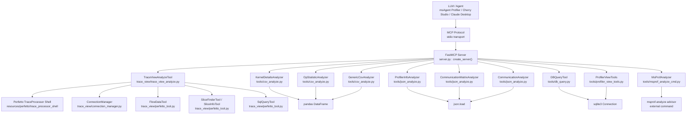
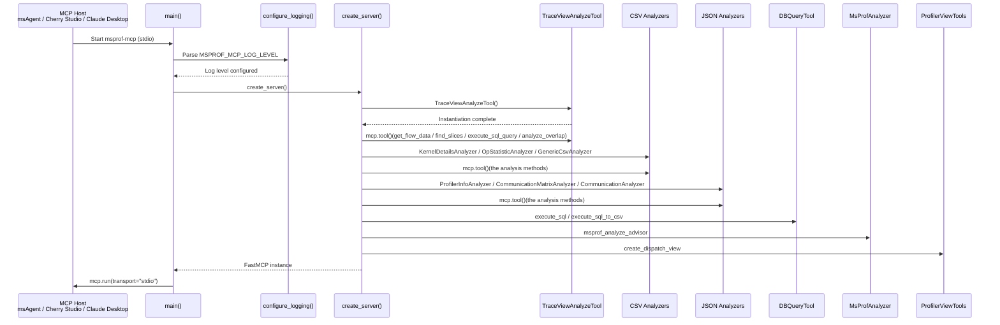
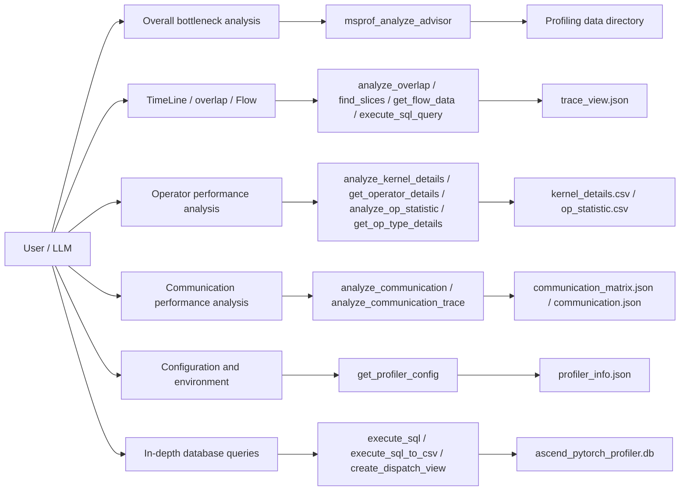
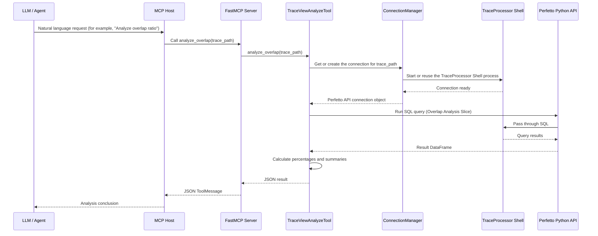
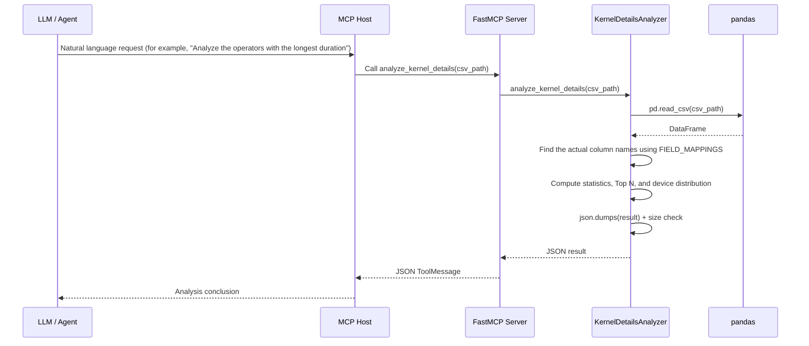
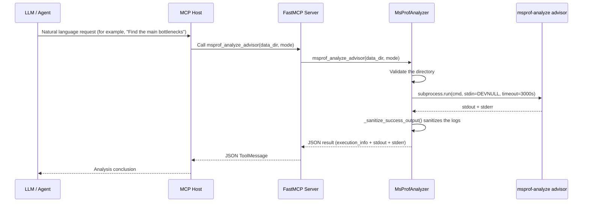

## Revision History
| Date | Revision | Description | Author | RFC Document |
| -- | -- | -- | -- | -- |
| 2026-06-03 | 1.0 | Added the msprof-mcp detailed design document, covering the architecture, tool system, data flows, and test design | kali20gakki1 |  |
|  |  |  |  |  |

## Background

### 1. Product Positioning

`msprof-mcp` is a server based on the Model Context Protocol (MCP) that provides large language models (LLMs) with the ability to analyze performance data collected by Ascend PyTorch Profiler. It is not a standalone performance analysis tool. Instead, it integrates the following capabilities into a unified MCP tool surface:

- A wrapper around the `msprof-analyze advisor` command for overall Profiling analysis.
- Multi-dimensional analysis tools for TimeLine data (trace_view.json), including overlap analysis, Slice search, Flow data queries, and SQL execution.
- Statistical and detailed analysis of operator performance data (kernel_details.csv and op_statistic.csv).
- Bottleneck identification and bandwidth analysis of communication performance data (communication_matrix.json and communication.json).
- Environment and parameter queries for configuration information (profiler_info.json).
- Read-only SQL queries and view creation for the SQLite database (ascend_pytorch_profiler.db).
- A CSV export mechanism for externalizing large results, preventing context bloat.

### 2. Pain Points

Using LLMs to analyze Profiling data in the Ascend ecosystem presents several typical challenges:

- Diverse data formats: The Profiler produces data in multiple carriers, including JSON, CSV, and SQLite DB, and field names differ across versions.
- Dispersed analysis dimensions: Performance bottleneck identification spans multiple dimensions, including compute/communication/scheduling overlap, operator duration distribution, and communication bandwidth utilization, requiring you to switch between multiple analysis entry points.
- Huge Trace data: The trace_view.json file typically reaches hundreds of MB or even several GB, making it infeasible to load directly into the context.
- Complex toolchain dependencies: The `msprof-analyze` command itself is an external binary that can time out, hang, or produce log noise.
- Version compatibility: Different Profiler versions produce different CSV field names (for example, `Device_id` versus `Device ID` versus `device_id`), requiring flexible mapping.

### 3. Core Value

| Value | Description |
| -- | -- |
| Unified tool surface | Exposes the six analysis dimensions as unified tools through the MCP protocol so the LLM can call them using natural language. |
| Full coverage of data carriers | Covers the three main types of Profiling data carriers (JSON/CSV/SQLite DB) without missing any key analysis dimension. |
| Large-result governance | Uses mechanisms such as threshold-based truncation, CSV externalization, and a JSON size cap to prevent large results from bloating the context. |
| Version compatibility | Uses `FIELD_MAPPINGS` to flexibly map field names, accommodating CSV schema differences across Profiler versions. |
| Secure read-only access | SQL queries are strictly read-only (INSERT/UPDATE/DELETE, and so on are forbidden), and SQL previews enforce a result size limit. |
| Integrability | Runs via `uvx msprof-mcp` or from local source code, supporting integration with Cherry Studio/Claude Desktop/msAgent. |

### 4. Design Goals and Non-Goals

#### 4.1 Design Goals

- Support multi-dimensional Profiling data analysis, covering overall analysis, TimeLine, operators, communication, configuration, and database queries.
- Support the MCP stdio transport protocol, with tools uniformly registered through the FastMCP framework.
- Support large-result externalization to prevent the JSON returned to the LLM from exceeding a reasonable threshold.
- Support cross-version CSV field compatibility, adapting to outputs from different Profiler versions through the field mapping table.
- Support secure wrapping of the `msprof-analyze` command, including timeouts, log sanitization, and error classification.
- Provide stable boundaries for testing, packaging, and PyPI publishing.

#### 4.2 Non-Goals

- This design document does not cover the internal implementation details of the Perfetto TraceProcessor Shell.
- `msprof-mcp` is not designed as a GUI product. The current primary entry point remains the MCP stdio service.
- The service does not directly host the performance analysis algorithms themselves. Instead, they are implemented collaboratively through the `msprof-analyze` command and Perfetto SQL.
- Write SQL operations are not supported. All database interactions are strictly read-only.

## Solution Design

### 1. Design Principles

- **Unified tool surface**: All analysis capabilities are registered as a unified tool surface through the FastMCP `mcp.tool()` decorator, and the LLM calls them directly using natural language.
- **Data carrier decoupling**: Different data carriers (JSON/CSV/DB) are handled by independent Analyzer classes without cross-coupling.
- **Result governance first**: All tools return JSON text. Results that exceed the threshold are externalized to CSV or rejected with a `RESULT_TOO_LARGE` error, guiding the model toward a smaller result.
- **Flexible version compatibility**: The `FIELD_MAPPINGS` dictionary maps CSV field names across versions without hardcoding them in the service logic.
- **Clear security boundaries**: SQL queries forbid write operations, and the `msprof-analyze` command uses `stdin=subprocess.DEVNULL` to prevent interactive blocking.

### 2. Overall Architecture

#### 2.1 Layered Architecture Diagram



#### 2.2 Architecture Explanation

Overall, `msprof-mcp` adopts the approach of "**unified registration through FastMCP, divide-and-conquer Analyzer classes, and decoupled data carriers**":

- `create_server()` is the only tool registration entry point. After all Analyzer instances are created, their methods are registered as MCP tools through `mcp.tool()`.
- Each Analyzer class encapsulates the analysis logic for one type of data carrier, and the classes do not depend on one another.
- TraceViewAnalyzeTool manages the Perfetto TraceProcessor Shell connection internally through ConnectionManager, supporting concurrent analysis of multiple Trace files.
- The result size governance strategy is layered: Trace tools truncate results by threshold counting, CSV/DB tools use `MAX_RESULT_CHARS` limits, and DB tools provide `execute_sql_to_csv` for externalizing large results.

### 3. Module Responsibility Breakdown

| Module | Representative Path | Main Responsibilities | Design Highlights |
| -- | -- | -- | -- |
| Service entry layer | src/msprof_mcp/server.py | Creates the FastMCP instance, registers all tool methods, configures logging, and starts the stdio service. | `create_server()` is the only registration entry point, and `main()` starts the stdio transport. |
| Trace analysis layer | src/msprof_mcp/tools/trace_view/ | Analyzes `trace_view.json` and provides overlap analysis, Slice search, Flow data queries, and SQL execution. | Uses `ConnectionManager` to manage the TraceProcessor Shell process and supports connection reuse across multiple files. |
| CSV analysis layer | src/msprof_mcp/tools/csv_analyze.py | Analyzes `kernel_details.csv`, `op_statistic.csv`, and generic CSV files. | Three Analyzer classes cover different CSV scenarios, and `FIELD_MAPPINGS` handles version compatibility. |
| JSON analysis layer | src/msprof_mcp/tools/json_analyze.py | Analyzes `profiler_info.json`, `communication_matrix.json`, and `communication.json`. | Two Analyzer classes cover configuration queries and communication analysis. |
| DB query layer | src/msprof_mcp/tools/db_query.py | Runs read-only SQL against `ascend_pytorch_profiler.db`, with preview and CSV export support. | `_FORBIDDEN_PREFIXES` blocks write operations, and `MAX_RESULT_CHARS` limits the preview size. |
| msprof-analyze layer | src/msprof_mcp/tools/msprof_analyze_cmd.py | Wraps the `msprof-analyze advisor` command and sanitizes log output. | `stdin=subprocess.DEVNULL` prevents interactive blocking, and `_sanitize_success_output` cleans up noisy logs. |
| View creation layer | src/msprof_mcp/tools/profiler_view_tools.py | Creates persistent views (for example, `dispatch_view`) on the profiler SQLite DB. | Checks whether the required tables exist and supports the `replace_existing` option. |
| Perfetto tool layer | src/msprof_mcp/tools/trace_view/perfetto_tool.py | Provides the concrete implementations of `FlowDataTool`, `SliceFinderTool`, `SliceInfoTool`, and `SqlQueryTool`. | Interacts with the TraceProcessor Shell process through the Perfetto Python API. |
| Connection management layer | src/msprof_mcp/tools/trace_view/connection_manager.py | Manages TraceProcessor Shell process startup, connections, and glibc compatibility detection. | Automatically detects the glibc version and selects a compatible Shell binary. |
| Logging configuration layer | src/msprof_mcp/server.py: configure_logging() | Configures package-level logging and suppresses noisy logs in stdio scenarios. | The `MSPROF_MCP_LOG_LEVEL` environment variable controls the level, which defaults to WARNING. |

### 4. Service Startup and Tool Registration Design

#### 4.1 Startup Sequence Diagram



#### 4.2 Tool Registration Overview

The complete set of MCP tools registered by `create_server()` is as follows:

| Tool Name | Registration Source | Data Carrier | Core Capability |
| -- | -- | -- | -- |
| get_flow_data | TraceViewAnalyzeTool | trace_view.json | Queries CPU/NPU operator details by Flow association. |
| find_slices | TraceViewAnalyzeTool | trace_view.json | Searches for specific Slices in the Trace. |
| execute_sql_query | TraceViewAnalyzeTool | trace_view.json | Runs custom PerfettoSQL queries. |
| analyze_overlap | TraceViewAnalyzeTool | trace_view.json | Analyzes the compute/communication/scheduling overlap ratio. |
| analyze_kernel_details | KernelDetailsAnalyzer | kernel_details.csv | Operator duration distribution, Top N, and device distribution |
| get_operator_details | KernelDetailsAnalyzer | kernel_details.csv | Queries execution details for a specific operator. |
| analyze_op_statistic | OpStatisticAnalyzer | op_statistic.csv | Operator call counts, total duration, and Core type distribution |
| get_op_type_details | OpStatisticAnalyzer | op_statistic.csv | Queries statistics for a specific type or Core type of operator. |
| get_csv_info | GenericCsvAnalyzer | Any CSV | Explores the generic CSV structure and sample data. |
| search_csv_by_field | GenericCsvAnalyzer | Any CSV | Generic CSV field search and filtering |
| get_profiler_config | ProfilerInfoAnalyzer | profiler_info.json | Retrieves Profiler configuration and environment information. |
| analyze_communication | CommunicationMatrixAnalyzer | communication_matrix.json | P2P/collective communication bottleneck and bandwidth analysis |
| analyze_communication_trace | CommunicationAnalyzer | communication.json | Communication operation time breakdown and bandwidth details |
| execute_sql | DBQueryTool | ascend_pytorch_profiler.db | Read-only SQL preview queries |
| execute_sql_to_csv | DBQueryTool | ascend_pytorch_profiler.db | Read-only SQL plus CSV externalization export |
| msprof_analyze_advisor | MsProfAnalyzer | Profiling data directory | Wraps the `msprof-analyze` overall analysis command. |
| create_dispatch_view | ProfilerViewTools | ascend_pytorch_profiler.db | Creates the dispatch persistent view. |

### 5. Tool System Design

#### 5.1 Tool Layering and Capability Surface



#### 5.2 Data Carrier and Tool Mapping

| Data Carrier | Corresponding Tools | Analysis Dimensions |
| -- | -- | -- |
| Profiling data directory | `msprof_analyze_advisor` | Overall bottlenecks (compute/scheduling) |
| trace_view.json | `analyze_overlap`, `find_slices`, `get_flow_data`, `execute_sql_query` | Overlap analysis, Slice search, Flow association, custom SQL |
| kernel_details.csv | `analyze_kernel_details`, `get_operator_details` | Top N duration, operator details, device distribution |
| op_statistic.csv | `analyze_op_statistic`, `get_op_type_details` | Call counts, total duration, Core type distribution |
| Any CSV | `get_csv_info`, `search_csv_by_field` | Structure exploration, field search |
| profiler_info.json | `get_profiler_config` | Configuration parameters, environment information |
| communication_matrix.json | `analyze_communication` | P2P/collective communication bottlenecks |
| communication.json | `analyze_communication_trace` | Time breakdown, bandwidth details |
| ascend_pytorch_profiler.db | `execute_sql`, `execute_sql_to_csv`, `create_dispatch_view` | Read-only SQL, large-result externalization, view creation |

#### 5.3 Detailed Design of the Trace Analysis Tools

TraceViewAnalyzeTool is the most complex analysis toolset and internally consists of four sub-tools:

| Sub-Tool | Responsibility | Key Design Points |
| -- | -- | -- |
| FlowDataTool | Queries CPU/NPU operator details by Flow association. | When the results exceed `MAX_FLOW_DATA_RESULT_COUNT` (100 records), guides the model toward CSV externalization and supports both `cpu_op` and `npu_op` entry queries. |
| SliceFinderTool | Searches for specific Slices in the Trace. | Supports three match modes: `contains`, `exact`, and `glob`, along with process_name filtering, main_thread_only, and time_range. |
| SliceInfoTool | Retrieves detailed information about a specific Slice. | Assists SliceFinderTool by providing aggregate statistics (min/avg/max/p50/p90/p99). |
| SqlQueryTool | Runs custom PerfettoSQL queries. | Passes SQL through to the TraceProcessor Shell and supports loading Perfetto standard library modules. |

ConnectionManager is responsible for TraceProcessor Shell process management:

- Automatically detects the system glibc version and selects a compatible binary (musl/glibc).
- Supports mapping and reuse of connections by trace_path, allowing the same Trace file to share the same Shell process.
- The Shell binary is located in the `resources/perfetto/` directory and is excluded from packaging (a custom hook in `hatch_build.py` handles the download).

#### 5.4 `msprof-analyze` Command Wrapper Design

The MsProfAnalyzer wrapper around the `msprof-analyze advisor` command focuses on solving the following problems:

| Problem | Solution |
| -- | -- |
| Command hangs (stdin waits for input on Windows) | `stdin=subprocess.DEVNULL` prevents interactive blocking. |
| Execution timeout | `timeout=TIMEOUT_SECONDS` (3000 seconds) |
| stderr log noise | `_sanitize_success_output()` filters INFO-level logs and progress lines, retaining warnings and errors. |
| JSON result extraction | `_extract_json_message()` identifies and extracts JSON-format output from stderr. |
| Command not found | Catches the `FileNotFoundError` exception and returns a `COMMAND_NOT_FOUND` error with troubleshooting suggestions. |

#### 5.5 Version Compatibility Design of the CSV Analysis Tools

KernelDetailsAnalyzer and OpStatisticAnalyzer handle field name differences across Profiler versions through the `FIELD_MAPPINGS` dictionary:

```python
FIELD_MAPPINGS = {
    'device_id': ['Device_id', 'Device ID', 'device_id', 'DeviceId'],
    'duration': ['Duration(us)', 'Duration (us)', 'duration', 'Duration'],
    ...
}
```

- `_find_column()` looks up the actual column name according to the priority order defined in `FIELD_MAPPINGS`.
- `_safe_get_column()` safely retrieves the column and returns None instead of raising an exception when the column is not found.
- The analysis results include `available_fields` and `missing_fields`, allowing the LLM to understand the fields actually available in the current CSV file.

#### 5.6 Large-Result Governance Strategy

| Tool Type | Governance Strategy | Threshold |
| -- | -- | -- |
| CSV analysis (csv_analyze.py) | Returns `RESULT_TOO_LARGE` when the JSON serialization exceeds `MAX_RESULT_CHARS`. | 100,000 characters |
| DB queries (db_query.py) | Same as the preceding row, and additionally provides `execute_sql_to_csv` for externalizing large results | 100,000 characters |
| Trace Flow data | Guides the model toward CSV externalization when hardware records exceed `MAX_FLOW_DATA_RESULT_COUNT`. | 100 hardware records |
| Trace SQL queries | Passed through to the TraceProcessor Shell and controlled by the caller | No automatic limit |
| msprof-analyze | Command timeout of 3000 seconds | 3000 seconds |

### 6. Configuration and Integration Design

#### 6.1 Logging Configuration

The design goal of `configure_logging()` is to fit the stdio transport scenario and prevent log noise from interfering with MCP communication:

- The default log level is `WARNING`, adjustable through the `MSPROF_MCP_LOG_LEVEL` environment variable (DEBUG/INFO/WARNING/ERROR).
- The package-level logger `msprof_mcp` is configured independently with `propagate=False` to prevent propagation to the root logger above it.
- `QUIET_LOGGER_NAMES` (for example, `mcp.server.lowlevel.server`) forces the level to at least WARNING, suppressing request-level INFO logs in stdio scenarios.

#### 6.2 MCP Integration Configuration

msprof-mcp supports two integration methods:

**PyPI mode (recommended)**:
```json
{
  "mcpServers": {
    "msprof-mcp": {
      "command": "uvx",
      "args": ["msprof-mcp"],
      "type": "stdio"
    }
  }
}
```

**Local source mode (development and debugging)**:
```json
{
  "mcpServers": {
    "msprof-mcp-local": {
      "command": "uv",
      "args": ["run", "msprof-mcp"],
      "cwd": "/absolute/path/to/msprof_mcp",
      "type": "stdio"
    }
  }
}
```

In msAgent, the default MCP configuration is as follows:
```json
{
  "mcpServers": {
    "msprof-mcp": {
      "command": "msprof-mcp",
      "args": [],
      "transport": "stdio",
      "enabled": true,
      "stateful": true,
      "invoke_timeout": 3600.0
    }
  }
}
```

#### 6.3 Project Configuration and Packaging

| Configuration Item | Value | Description |
| -- | -- | -- |
| Project name | `msprof-mcp` | PyPI package name |
| Version | 0.1.6 | Defined in pyproject.toml |
| Python dependencies | `mcp[cli]>=1.26.0`, `perfetto>=0.16.0`, `pandas>=2.0.0` | Core runtime dependencies |
| Build system | `hatchling` | Handles TraceProcessor Shell downloads through a custom `hatch_build.py` hook. |
| Entry point | `msprof-mcp = msprof_mcp.server:main` | CLI entry point |
| Packaging exclusions | `trace_processor_shell-*`, `trace_processor_shell.metadata.json` | Shell binaries are not packaged into the wheel, and the hook downloads them instead. |
| Python version | `>=3.10` | Minimum supported version |

#### 6.4 Release Process

The release process follows the definition in RELEASE.md:

1. Modify the version number in `pyproject.toml`.
2. Run a local check: `python scripts/download_trace_processor_shell.py --all --clean && uv build`.
3. Commit the version changes and push them.
4. Create and push a Git tag (in the format `v{version}`, for example, `v0.1.6`).
5. GitHub Actions automatically builds multi-platform wheels (Linux x86_64/arm64, Windows amd64, macOS x86_64/arm64).
6. Automatically create a GitHub Release and upload the build artifacts.
7. If PyPI publishing is enabled (Trusted Publisher + OIDC), upload to PyPI automatically.

### 7. Data Flow and Interaction Design

#### 7.1 Trace Analysis Request Sequence Diagram



#### 7.2 CSV Analysis Request Sequence Diagram



#### 7.3 `msprof-analyze` Command Execution Sequence Diagram



### 8. Security and Reliability Design

#### 8.1 Security Design

- **Read-only SQL**: `DBQueryTool._FORBIDDEN_PREFIXES` forbids INSERT/UPDATE/DELETE/CREATE/DROP/ALTER/TRUNCATE/ATTACH/DETACH/PRAGMA/REINDEX/VACUUM, allowing only SELECT queries.
- **Command isolation**: `msprof-analyze` uses `stdin=subprocess.DEVNULL` to prevent interactive blocking, and `timeout` prevents infinite hangs.
- **Log sanitization**: `_sanitize_success_output()` filters INFO-level logs and progress lines, preventing noisy output from affecting LLM judgment.
- **Path validation**: All tools validate file/directory paths before execution and return `FILE_NOT_FOUND` or `DIRECTORY_NOT_FOUND` if they do not exist.

#### 8.2 Reliability Design

- **Timeout protection**: The `msprof-analyze` command has a 3000-second timeout. TraceProcessor Shell connections are managed through ConnectionManager.
- **Large-result truncation**: When any JSON return exceeds the threshold, a `RESULT_TOO_LARGE` error is returned to guide the model toward a smaller result, preventing context bloat.
- **CSV externalization**: `execute_sql_to_csv` and `get_flow_data(result_output_path)` provide the ability to export large results to CSV, returning only metadata.
- **Error classification**: All tools uniformly use structured JSON errors (`error` + `message`), making it easy for the LLM to distinguish and handle them.
- **Version compatibility**: CSV tools adapt to different Profiler versions through `FIELD_MAPPINGS` and do not crash because of field name differences.
- **glibc compatibility**: ConnectionManager automatically detects the glibc version and selects the musl or glibc version of the TraceProcessor Shell.

#### 8.3 Error Classification System

| Error Code | Trigger Scenario | Affected Scope |
| -- | -- | -- |
| FILE_NOT_FOUND | The file path does not exist. | CSV/JSON/DB/Trace tools |
| DIRECTORY_NOT_FOUND | The directory does not exist. | msprof_analyze_advisor |
| NOT_A_DIRECTORY | The path is not a directory. | msprof_analyze_advisor |
| EMPTY_FILE | The CSV file is empty. | CSV tools |
| INVALID_JSON | JSON parsing fails. | JSON tools |
| INVALID_PARAMETER | Parameter validation fails. | DB/CSV/Trace/msprof-analyze tools |
| WRITE_OPERATION_BLOCKED | The SQL contains a write operation. | DB tools |
| RESULT_TOO_LARGE | The returned JSON exceeds the threshold. | CSV/DB/Trace Flow tools |
| COMMAND_NOT_FOUND | `msprof-analyze` is not installed. | msprof_analyze_advisor |
| EXECUTION_TIMEOUT | `msprof-analyze` times out. | msprof_analyze_advisor |
| EXECUTION_FAILED | `msprof-analyze` execution fails. | msprof_analyze_advisor |
| SQL_EXECUTION_FAILED | SQLite query fails. | DB/view tools |
| MISSING_REQUIRED_TABLES | The DB is missing required tables. | View tools |
| ANALYSIS_FAILED | An exception occurs during analysis. | All tools |

### 9. Interaction and Usage Design

#### 9.1 Quick Start

**Method 1: Run directly from PyPI**
```bash
uvx msprof-mcp
```

**Method 2: Run from local source for development**
```bash
git clone <repository_url>
cd msprof_mcp
uv run msprof-mcp
```

#### 9.2 Integration with MCP Hosts

msprof-mcp communicates with MCP Hosts through the stdio transport protocol. Typical integration scenarios include:

- msAgent Profiler Agent: Configured through `.msagent/config.mcp.json`, with the Profiler enabling the `mcp:msprof-mcp:*` Tool Pattern by default.
- Cherry Studio/Claude Desktop: Add the service through the MCP configuration JSON.
- Other MCP clients: Any client that supports stdio transport can connect.

#### 9.3 Typical Usage Paths

| Usage Path | Triggered Tool | Example |
| -- | -- | -- |
| Overall bottleneck analysis | `msprof_analyze_advisor` | "Analyze the performance data in the /path/to/data directory and find the main bottlenecks" |
| Overlap ratio analysis | `analyze_overlap` | "Analyze the compute and communication overlap in /path/to/trace_view.json" |
| Operator duration analysis | `analyze_kernel_details` | "Analyze /path/to/kernel_details.csv and list the 10 operators with the longest duration" |
| Communication bottleneck identification | `analyze_communication` | "Analyze /path/to/communication_matrix.json and find the links with low bandwidth utilization" |
| In-depth SQL queries | `execute_sql` | "Run the following SQL against /path/to/db: SELECT name, SUM(total_time) FROM COMPUTE_TASK_INFO GROUP BY name LIMIT 20" |
| Flow data queries | `get_flow_data` | "Get the NPU operator Flow data associated with the time range from 1000000000 to 2000000000 in /path/to/trace_view.json" |

### 10. Directory Structure Design

```text
msprof_mcp/
├── pyproject.toml                    # Project configuration and dependency declarations
├── hatch_build.py                    # Custom packaging hook (TraceProcessor Shell download)
├── RELEASE.md                        # Release process documentation
├── scripts/
│   └── download_trace_processor_shell.py  # TraceProcessor Shell download script
├── src/msprof_mcp/
│   ├── __init__.py                   # Package initialization
│   ├── server.py                     # FastMCP service entry point and tool registration
│   ├── resources/
│   │   └── perfetto/
│   │       ├── trace_processor_shell-*    # Perfetto Shell binaries (multi-platform)
│   │       └── trace_processor_shell.metadata.json  # Shell metadata
│   └── tools/
│       ├── __init__.py
│       ├── csv_analyze.py            # KernelDetails / OpStatistic / GenericCsv analyzers
│       ├── json_analyze.py           # ProfilerInfo / CommunicationMatrix / Communication analyzers
│       ├── db_query.py               # SQLite read-only queries and CSV export
│       ├── msprof_analyze_cmd.py     # msprof-analyze advisor command wrapper
│       ├── profiler_view_tools.py    # Persistent view creation (dispatch_view, and so on)
│       └── trace_view/
│           ├── __init__.py
│           ├── connection_manager.py # TraceProcessor Shell connection management
│           ├── perfetto_tool.py      # FlowData / SliceFinder / SliceInfo / SqlQuery tools
│           ├── query_helpers.py      # SQL query helpers
│           ├── trace_processor_shell.py  # Shell process management
│           └── trace_view_analyze.py # TraceViewAnalyzeTool entry point
├── tests/
│   ├── test_csv_analyze.py
│   ├── test_db_query.py
│   ├── test_json_analyze.py
│   ├── test_msprof_analyze_cmd.py
│   ├── test_profiler_view_tools.py
│   ├── test_server.py
│   └── test_trace_view_analyze.py
├── .github/
│   └── workflows/
│       ├── build-wheels.yml          # Multi-platform wheel build
│       └── publish-release.yml       # Automatic release and PyPI publishing
├── .gitignore
├── .python-version                   # Python version pin
└── uv.lock                           # uv dependency lock
```

## Test Design

### 1. Test Goals

The test design for `msprof-mcp` establishes regression protection around the following risk areas:

- Whether CSV analysis version compatibility is stable (whether different field names are mapped correctly).
- Whether the DB query security boundary is correct (whether write operations are blocked).
- Whether JSON analysis parsing capabilities cover different data formats.
- Whether the timeout, log sanitization, and error classification of the msprof-analyze command wrapper are effective.
- Whether the Trace tools' connection management, SQL queries, and large-result truncation are correct.
- Whether the required table validation and replacement logic for view creation are stable.
- Whether service registration completeness can be verified.

### 2. Test Layering Strategy

| Layer | Goal | Representative Objects | Typical Test Files |
| -- | -- | -- | -- |
| Unit tests | Verify pure logic, field mapping, SQL validation, JSON parsing, and error classification. | `FIELD_MAPPINGS`, `DBQueryTool`, `MsProfAnalyzer`, `ProfilerViewTools` | `test_csv_analyze.py`, `test_db_query.py`, `test_json_analyze.py`, `test_msprof_analyze_cmd.py`, `test_profiler_view_tools.py` |
| Integration tests | Verify service registration integrity and tool surface coverage. | `create_server()` tool registration | `test_server.py` |
| Trace tool tests | Verify TraceProcessor connections, SQL execution, and result truncation. | `TraceViewAnalyzeTool`, `ConnectionManager` | `test_trace_view_analyze.py` |

### 3. Core Test Objects and Test Case Design

#### 3.1 CSV Analysis Tests

**Goal**: Ensure field mapping, statistical analysis, large-result truncation, and error classification are correct.

Core test cases covered:

- Whether CSV field names from different versions (for example, `Device_id` versus `Device ID` versus `device_id`) are mapped correctly.
- Whether `analyze_kernel_details` returns the correct Top N, device distribution, and ratio of dynamic to static operators.
- Whether `get_operator_details` returns the correct details when filtering by name or type.
- Whether `analyze_op_statistic` returns the correct Core type distribution and operator type statistics.
- Whether `get_csv_info` returns the correct structure information for unknown CSV files.
- Whether the four match modes of `search_csv_by_field` (exact/contains/starts_with/ends_with) work correctly.
- Whether `RESULT_TOO_LARGE` is returned when the JSON result exceeds `MAX_RESULT_CHARS`.
- Whether exceptional scenarios such as a missing file or an empty file return the correct error codes.

Representative existing tests: `test_csv_analyze.py`

#### 3.2 DB Query Tests

**Goal**: Ensure the read-only SQL boundary, large-result truncation, and CSV export are correct.

Core test cases covered:

- Whether `_FORBIDDEN_PREFIXES` correctly blocks write operations such as INSERT/UPDATE/DELETE/CREATE/DROP.
- Whether `execute_sql_preview` returns the correct JSON preview.
- Whether `RESULT_TOO_LARGE` is returned when the JSON result exceeds `MAX_RESULT_CHARS`.
- Whether `execute_sql_to_csv` correctly exports the CSV and returns metadata (path, row count).
- Whether exceptions such as a missing DB file or a path that is not a file return the correct error codes.
- Whether an empty SQL string returns `INVALID_PARAMETER`.

Representative existing tests: `test_db_query.py`

#### 3.3 JSON Analysis Tests

**Goal**: Ensure JSON parsing, configuration extraction, and communication statistics are correct.

Core test cases covered:

- Whether `get_profiler_config` correctly extracts general_config, scheduling, experimental_config, and runtime_info.
- Whether `analyze_communication` correctly identifies collective communication types, computes bandwidth statistics, and discovers slow links.
- Whether `analyze_communication_trace` correctly breaks down time (Transit/Wait/Sync/Idle) and computes bandwidth statistics.
- Whether exceptions such as a missing JSON file or an invalid JSON format return the correct error codes.

Representative existing tests: `test_json_analyze.py`

#### 3.4 `msprof-analyze` Command Wrapper Tests

**Goal**: Ensure the timeout, log sanitization, and error classification of the command wrapper are correct.

Core test cases covered:

- Whether `_sanitize_success_output()` correctly filters INFO logs and progress lines, retaining warnings and errors.
- Whether `_extract_json_message()` correctly identifies JSON output in stderr.
- Whether a command timeout returns `EXECUTION_TIMEOUT`.
- Whether a missing command returns `COMMAND_NOT_FOUND`.
- Whether a missing directory returns `DIRECTORY_NOT_FOUND`.
- Whether an empty directory parameter returns `INVALID_PARAMETER`.

Representative existing tests: `test_msprof_analyze_cmd.py`

#### 3.5 View Creation Tests

**Goal**: Ensure the required table validation, replacement logic, and SQL for persistent view creation are correct.

Core test cases covered:

- Whether `create_dispatch_view` correctly creates the view when all required tables are present.
- Whether `MISSING_REQUIRED_TABLES` is returned when required tables are missing.
- Whether the `exists` status is returned when the view already exists and `replace_existing=false`.
- Whether the view is correctly replaced when it already exists and `replace_existing=true`.
- Whether `DB_FILE_NOT_FOUND` is returned when the DB file does not exist.

Representative existing tests: `test_profiler_view_tools.py`

#### 3.6 Service Registration Tests

**Goal**: Ensure the tool surface registered by `create_server()` is complete and callable.

Core test cases covered:

- All expected tool names exist in the FastMCP tool list.
- Tool method signatures are consistent with the documentation descriptions.

Representative existing tests: `test_server.py`

#### 3.7 Trace Analysis Tests

**Goal**: Ensure TraceProcessor connections, SQL queries, and result truncation are correct.

Core test cases covered:

- Whether ConnectionManager correctly manages the Shell process.
- Whether `get_flow_data` returns the correct Flow-associated data by time range.
- Whether the three match modes of `find_slices` work correctly.
- Whether `execute_sql_query` correctly passes SQL through to TraceProcessor.
- Whether `analyze_overlap` correctly computes the overlap ratio.
- Whether `RESULT_TOO_LARGE` is returned when results exceed the threshold.

Representative existing tests: `test_trace_view_analyze.py`

### 4. Test Double Design

- Temporary CSV/JSON/DB files: Create test data through `tmp_path` to isolate real Profiling data.
- `monkeypatch`/`AsyncMock`: Replace external dependencies such as the `msprof-analyze` command and the TraceProcessor Shell process.
- Small-scale test data: Construct CSV/JSON/DB files with a small number of rows to avoid large files slowing down test execution.

## Appendix

### 1. References

- msprof-mcp repository: [https://gitcode.com/kali20gakki1/msprof_mcp](https://gitcode.com/kali20gakki1/msprof_mcp)
- MCP official documentation: [https://modelcontextprotocol.io/docs/getting-started/intro](https://modelcontextprotocol.io/docs/getting-started/intro)
- Perfetto official documentation: [https://perfetto.dev/docs/](https://perfetto.dev/docs/)
- PerfettoSQL syntax: [https://perfetto.dev/docs/analysis/perfetto-sql-syntax](https://perfetto.dev/docs/analysis/perfetto-sql-syntax)
- msAgent design document: [docs/en/design/msagent_design.md](msagent_design.md)

### 2. Terminology

| Term | Description |
| -- | -- |
| MCP | Model Context Protocol, a protocol that uniformly incorporates external tools and resources into the agent capability surface. |
| FastMCP | A high-level Python wrapper around the MCP SDK that registers tools through a decorator-based API. |
| TraceProcessor Shell | The CLI SQL query engine provided by Perfetto, used to analyze data in the Chrome Trace Event format. |
| FIELD_MAPPINGS | The field name mapping dictionary in the CSV tools, used to accommodate field name differences across Profiler versions. |
| stdio transport | The standard input/output transport of MCP, through which the service communicates with the Host over stdin/stdout. |
| dispatch_view | A persistent view created on the profiler SQLite DB that links tables such as TASK/CANN_API/PYTORCH_API. |
| Flow | An event chain in Trace data that links CPU operators and NPU operators. |
| Slice | A time slice in Trace data that represents the execution interval of an operator or function. |
