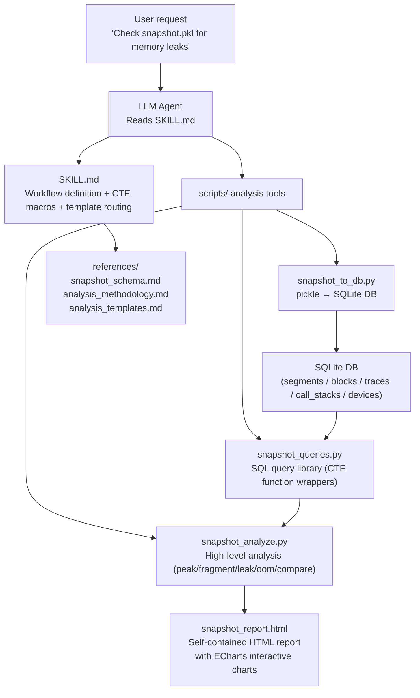
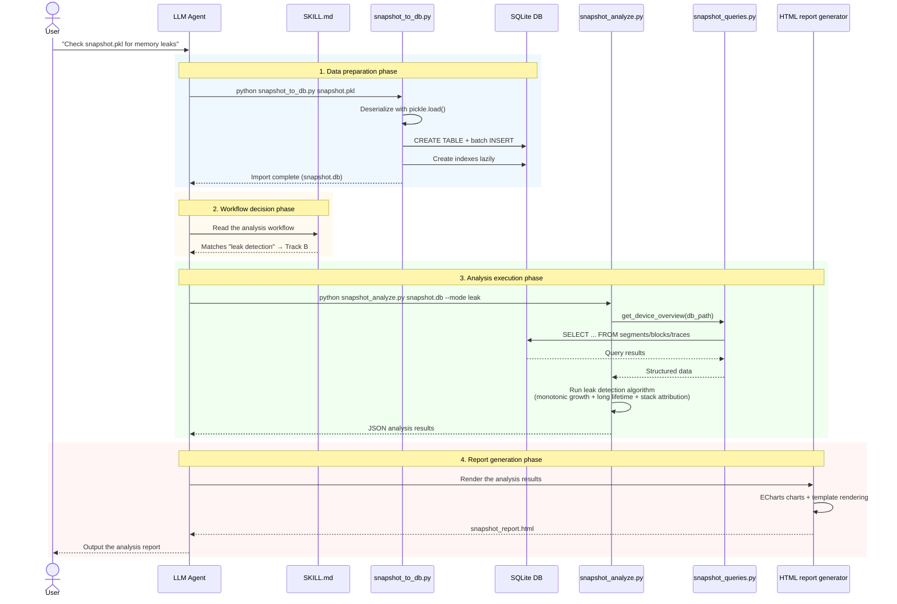
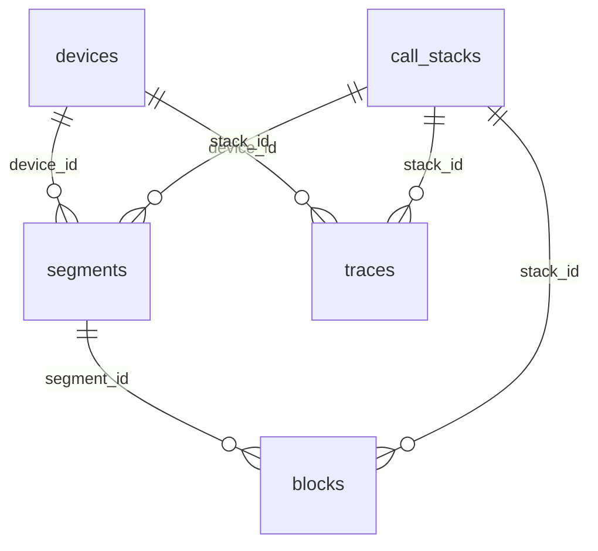

# NPU Platform Memory Snapshot Analysis Design

## Revision History

| Date | Revision | Description | Author | RFC Document |
| -- | -- | -- | -- | -- |
| 2026-06-11 | 1.0 | Initial version, covering the architecture, DB design, analysis capabilities, visualization approach, and test design of the ASCEND NPU Memory Snapshot analysis Agent | @msagent | npu_snapshot_analysis.md |
|  |  |  |  |  |

## Background

### 1. Product Positioning

`ascend-npu-snapshot-analyzer` is an Agent Skill for PyTorch Memory Snapshot analysis on Ascend NPUs, designed to provide the LLM with the ability to automatically analyze memory snapshot data exported by `torch_npu.npu.memory._dump_snapshot()`. Its core workflow is:

1. Parse the pickle-format snapshot data and convert it into a SQLite database for efficient querying
2. Analyze the memory snapshot across multiple dimensions using the preset SQL CTE macros and analysis scripts
3. Generate a self-contained HTML report with interactive charts that presents the analysis results intuitively

This Skill is not a standalone GUI product. Instead, it is orchestrated through the Agent workflow, in which the LLM reads the workflow definition in `SKILL.md` and invokes the Python tools in the `scripts/` directory on demand to complete the analysis tasks.

### 2. Business Pain Points

Locating memory issues on Ascend NPUs has the following difficulties:

- **Raw data format**: The pickle file exported by `torch_npu.npu.memory._dump_snapshot()` is in a binary serialization format that contains nested Segment/Block/Trace structures. It cannot be queried or analyzed directly and must be parsed with scripts.
- **No automatic comparison capability**: The official PyTorch memory_viz tool only supports interactive browsing of a single snapshot for the CUDA backend. It does not support the NPU backend or automatic comparison between snapshots.
- **Scattered analysis dimensions**: Locating memory issues involves multiple dimensions, including peak analysis, fragmentation calculation, expansion statistics, leak detection, and OOM root cause analysis. A unified automated analysis toolchain is lacking.
- **No NPU-specific tool**: The Huawei Ascend ecosystem has no dedicated analysis tool for NPU Memory Snapshots. Therefore, users can only rely on manually written analysis scripts.
- **Missing visualization**: Analysis results such as memory fragmentation, time-series changes, and stack attribution are hard to understand intuitively if they are presented only as text or tables. The tool lacks graphical display capability.

### 3. Core Values

| Value | Description |
| -- | -- |
| Native NPU support | Designed for the `torch_npu` snapshot format and compatible with the CUDA snapshot format |
| One-click analysis | pickle → SQLite DB → analysis report, with the entire process automated |
| Multi-dimensional analysis | Covers five analysis scenarios: peak, fragmentation, expansion, leak, and OOM. |
| Interactive visualization | Self-contained HTML report with line charts, bar charts, memory layout diagrams, and stack attribution charts |
| Cross-snapshot comparison | Supports the ATTACH DATABASE mechanism to compare differences between two snapshots. |
| Agent integration | Through the standard `SKILL.md` + scripts pattern, the LLM can invoke it directly. |

### 4. Design Goals and Non-Goals

#### 4.1 Design Goals

- Support parsing of the format exported by `torch_npu.npu.memory._dump_snapshot()` (dict format) and the format exported by `_snapshot()` (list format)
- Convert pickle data into a SQLite DB to support efficient querying and cross-snapshot comparison
- Provide five analysis modes: overall overview, peak analysis, fragmentation analysis, leak detection, and OOM analysis
- Support the cross-snapshot comparison mode (ATTACH DATABASE)
- Generate a self-contained HTML report with interactive charts (ECharts)
- Define CTE macros (Track A) and analysis script invocations (Track B) in `SKILL.md` to implement an Agent-driven workflow

#### 4.2 Non-Goals

- Do not implement real-time collection (only offline pickle files are supported)
- Do not implement CUDA-specific hardware detail analysis (for example, CUDA stream scheduling)
- Do not implement GPU-side execution timeline analysis of device_traces (Phase 1 only parses the traces table and does not correlate execution timelines)
- Do not implement web services or API interfaces (CLI + HTML report only)
- Do not implement memory coordination analysis for multi-process or distributed training

## Solution Design

### 1. Design Principles

- **Conversion first**: As a raw format, pickle is not suitable for querying. Convert it into a SQLite DB before analysis, following the "convert once, query many times" principle.
- **Layered SQL and scripts**: Use CTE macros for simple queries (the LLM assembles the SQL directly) and wrap complex analysis in Python scripts (peak timeline reconstruction, leak detection algorithms, and so on).
- **Decoupled analysis and presentation**: The analysis logic outputs structured JSON data, and report generation independently renders the JSON into HTML charts.
- **One DB per pickle**: Use the pickle file name (only changing the extension) as the DB file name to avoid mixing data from multiple files. Cross-snapshot comparison is implemented through ATTACH DATABASE.
- **Deferred index creation**: Create tables first, then insert data, and create indexes last. This speeds up the import of a 1 GB file by more than 10 times.

### 2. Overall Architecture

#### 2.1 Layered Architecture Diagram



#### 2.2 Data Flow



#### 2.3 File Directory Structure

```text
skills/ascend-npu-snapshot-analyzer/
├── SKILL.md                          # Main skill definition (workflow + CTE macros + output specification)
├── scripts/
│   ├── snapshot_to_db.py             # pickle → SQLite conversion tool
│   ├── snapshot_queries.py           # SQL query library (CTE function wrappers)
│   └── snapshot_analyze.py           # High-level analysis (peak/fragment/leak/oom/compare)
├── references/
│   ├── snapshot_schema.md            # Snapshot data format reference (Segment/Block/TraceEntry field definitions)
│   ├── analysis_methodology.md       # Analysis methodology (detection algorithms, judgment rules, threshold definitions)
│   └── analysis_templates.md         # Typical analysis patterns (template trigger conditions, decision tree, output field list)
└── tests/
    ├── test_snapshot_to_db.py        # Conversion tool unit tests
    └── test_snapshot_analyze.py      # Analysis logic unit tests
```

### 3. DB Schema Design

#### 3.1 Design Principles

- One pickle file corresponds to one SQLite DB file, and the file name equals the pickle file name (only the extension changes to `.db`)
- Introduce a `call_stacks` deduplication table so that the same stack is stored only once, saving storage space
- Create indexes lazily, building all indexes only after all data has been inserted

#### 3.2 ER Diagram



#### 3.3 Table Structure Definition

**devices (device table)**

| Field | Type | Constraint | Description |
| -- | -- | -- | -- |
| id | INTEGER | PK, AUTOINCREMENT | Primary key |
| device_index | INTEGER | UNIQUE, NOT NULL | NPU device index, corresponding to the device value in the snapshot |
| device_type | TEXT | DEFAULT 'Ascend-NPU' | Device type identifier |

**call_stacks (call stack dictionary table)**

| Field | Type | Constraint | Description |
| -- | -- | -- | -- |
| id | INTEGER | PK, AUTOINCREMENT | Primary key |
| stack_hash | TEXT | UNIQUE | MD5 hash of the stack frame list, used for deduplication |
| frames_json | TEXT | - | Complete stack frame list in JSON array format |

**segments (memory segment table)**

| Field | Type | Constraint | Description |
| -- | -- | -- | -- |
| id | INTEGER | PK, AUTOINCREMENT | Primary key |
| device_id | INTEGER | NOT NULL, FK→devices | Owning device |
| address | INTEGER | - | Starting virtual address of the Segment |
| total_size | INTEGER | - | Total size of the segment allocated by aclrtMalloc (Reserved) |
| allocated_size | INTEGER | - | Size of memory that has been allocated and is in use |
| active_size | INTEGER | - | Size of memory that is in use or awaiting release |
| requested_size | INTEGER | - | Memory size requested by the user |
| stream | INTEGER | - | Associated NPU stream |
| segment_type | TEXT | - | Segment type: `large` (>1MB) or `small` |
| pool_id_0 | INTEGER | - | First element of the segment_pool_id tuple |
| pool_id_1 | INTEGER | - | Second element of the segment_pool_id tuple |
| is_expandable | INTEGER | - | Whether the segment can be expanded (0/1) |
| stack_id | INTEGER | FK→call_stacks | Stack reference at allocation time |

**blocks (memory block table)**

| Field | Type | Constraint | Description |
| -- | -- | -- | -- |
| id | INTEGER | PK, AUTOINCREMENT | Primary key |
| segment_id | INTEGER | NOT NULL, FK→segments, CASCADE | Owning segment |
| address | INTEGER | - | Starting address of the Block |
| size | INTEGER | - | Actual occupied size (including alignment) |
| requested_size | INTEGER | - | Size requested by malloc (may be smaller than size) |
| state | TEXT | - | State: `active_allocated` / `active_pending_free` / `inactive` |
| stack_id | INTEGER | FK→call_stacks | Stack reference at allocation time |

**traces (timeline event table)**

| Field | Type | Constraint | Description |
| -- | -- | -- | -- |
| id | INTEGER | PK, AUTOINCREMENT | Primary key |
| device_id | INTEGER | NOT NULL, FK→devices | Owning device |
| trace_index | INTEGER | - | Event sequence number within the device, used to reconstruct the timeline |
| action | TEXT | - | Event type: `alloc` / `free_requested` / `free_completed` / `segment_alloc` / `segment_free` / `segment_map` / `segment_unmap` / `snapshot` / `oom` |
| addr | INTEGER | - | Associated memory address (NULL for OOM) |
| device_free | INTEGER | - | Present only for OOM events, the available memory at the time of OOM |
| size | INTEGER | - | Memory size of the operation |
| stream | INTEGER | - | Associated NPU stream |
| stack_id | INTEGER | FK→call_stacks | Stack reference associated with the event |

#### 3.4 Index Strategy

All indexes are created after data import completes, avoiding the performance overhead of maintaining indexes in real time during insertion.

| Index Name | Table | Field | Purpose |
| -- | -- | -- | -- |
| idx_blocks_state | blocks | state | Global fragmentation rate calculation |
| idx_blocks_stack | blocks | stack_id | Stack attribution queries |
| idx_blocks_segment | blocks | segment_id | Segment association queries |
| idx_blocks_segment_state | blocks | segment_id, state | Analyze fragmentation by segment. |
| idx_traces_stack | traces | stack_id | Stack attribution queries |
| idx_traces_device_action | traces | device_id, action | Quick location of OOM events |
| idx_traces_device_index | traces | device_id, trace_index | Timeline range traversal |
| idx_segments_stack | segments | stack_id | Stack attribution queries |
| idx_segments_device | segments | device_id | Device filtering |
| idx_segments_device_type | segments | device_id, segment_type | Large/small classification statistics |

#### 3.5 Data Mapping

| Pickle Field | DB Table | DB Field | Description |
| -- | -- | -- | -- |
| segments[].device | segments | device_id | Foreign key referencing devices.id |
| segments[].address | segments | address | Stores the original int value. |
| segments[].segment_pool_id | segments | pool_id_0, pool_id_1 | Splits the tuple into two columns. |
| segments[].frames | segments | stack_id | Foreign key referencing call_stacks.id |
| blocks[].state | blocks | state | `'active_allocated'`/`'active_pending_free'`/`'inactive'` |
| device_traces[][] | traces | trace_index | The outer index is device_id and the inner index is trace_index. |
| device_traces[][].action | traces | action | `'alloc'`/`'free_requested'`/`'free_completed'`/`'segment_alloc'`/`'segment_free'`/`'segment_map'`/`'segment_unmap'`/`'snapshot'`/`'oom'` |

### 4. Agent Skill Design

#### 4.1 `SKILL.md` Structure

It follows the Track A/Track B dual-channel pattern of `ascend-profiler-db-explorer`:

**Track A (fast path)**: Preset CTE macros covering 80% of common query scenarios

| CTE Macro | Purpose | Corresponding Analysis Scenario |
| -- | -- | -- |
| device_overview | Reserved/Allocated/Active/fragmentation rate/Segment count per device | Overall overview |
| block_state_dist | Block count and size grouped by device and state | Fragmentation analysis |
| expansion_timeline | Timeline of segment_alloc/segment_free events | Expansion analysis |
| top_allocations | Top N largest allocations aggregated by stack | Stack attribution |

**Track B (deep analysis)**: Invoke `scripts/snapshot_analyze.py` for complex analysis

| Analysis Mode | CLI Argument | Description |
| -- | -- | -- |
| Overall overview | `--mode overview` | Summarizes the memory overview and block state distribution of each device. |
| Peak analysis | `--mode peak` | Timeline replay that locates the peak moment and its contributors |
| Fragmentation analysis | `--mode fragment` | Overall fragmentation rate + per-segment fragmentation + false fragmentation identification |
| Leak detection | `--mode leak` | Monotonic growth + long lifetime + stack attribution |
| OOM analysis | `--mode oom` | OOM event context + backtracking of preceding allocations |
| Cross-snapshot comparison | `--mode compare --ref other.db` | Comparison through ATTACH DATABASE |

#### 4.2 Core Analysis Algorithms

**Peak analysis (timeline replay)**:

1. Traverse the traces table in trace_index order
2. On segment_alloc, accumulate Reserved/Allocated
3. On segment_free, subtract from Reserved/Allocated
4. Record the (Reserved, Allocated, Active) triple for each moment
5. Find the maximum value and its corresponding trace_index

**Leak detection (combination of three algorithms)**:

- Algorithm A (monotonic growth): Calculate the cumulative difference between segment_alloc and segment_free. If it increases monotonically without falling back, mark the snapshot as a suspected leak.
- Algorithm B (long lifetime): Find blocks whose state is `active_allocated` and whose corresponding alloc event is in the first 20% of the timeline
- Algorithm C (stack attribution): Aggregate the results of A and B by stack_id and output the top 3 suspect stacks in descending order of cumulative size

**Fragmentation analysis**:

- Overall fragmentation rate = (Reserved - Allocated) / Reserved
- Per-segment fragmentation = (segment.total_size - segment.allocated_size) / segment.total_size, taking the top 5 in descending order
- False fragmentation = the total size of blocks whose state is `active_pending_free`. If this ratio exceeds 50%, the main cause of fragmentation is delayed asynchronous release

#### 4.3 Report Template Routing

When the Agent generates a report, it selects the template combination according to the following decision tree:

```text
User request
    │
    ├─ Contains "compare", "diff", or "before/after" → Cross-snapshot comparison template
    │
    └─ Single-file analysis
        │
        ├─ Always output → Overview template
        ├─ Multiple devices (device_count > 1) → Device detail template
        ├─ Fragmentation rate > 5% or the user asks about "fragmentation" → Fragmentation analysis template
        ├─ The user asks about "peak", "growth", or "most" → Peak analysis template
        ├─ The user asks about "leak" or "not released", or an anomaly is detected → Leak analysis template
        ├─ OOM events exist → OOM analysis template
        ├─ After any deep analysis → Stack attribution template
        └─ After any deep analysis → Optimization suggestion template
```

### 5. Visualization Approach

#### 5.1 Overview

The analysis results are presented as a **self-contained HTML report**, with interactive charts generated using the ECharts embedded mode. The HTML report includes an anchor navigation bar that lets you quickly jump to each analysis section.

#### 5.2 Chart List

| Chart | Type | Corresponding Analysis Layer | Displayed Content |
| -- | -- | -- | -- |
| Chart 1: Memory timeline curve | Interactive line chart | Peak analysis | Three lines for Reserved/Allocated/Active, difference area fill, key event markers, peak highlighting |
| Chart 2: Device comparison | Grouped bar chart | Device details | Three bars per device for Reserved/Allocated/Active, with a secondary Y-axis for the fragmentation rate |
| Chart 3: Segment memory layout | Stacked horizontal bar chart | Fragmentation analysis | One row per segment, blocks colored by state, low utilization highlighted in red |
| Chart 4: Expansion scatter plot | Bubble scatter chart | Expansion analysis | X = timeline, Y = size, colors distinguish large/small, with an overlaid step line for the cumulative segment count |
| Chart 5: Stack attribution | Horizontal bar chart | Stack attribution | Sorted by allocation amount in descending order, bar length = allocation amount, click to expand the full stack |
| Chart 6: OOM event sequence | Event sequence chart | OOM analysis | Arranged in reverse order, alloc in red and free in green, with the triggering event marked |
| Chart 7: Cross-snapshot comparison | Dual-line overlay chart | Cross-snapshot comparison | A as a dashed line and B as a solid line, with difference areas filled semi-transparently |

#### 5.3 HTML Report Layout

```text
┌───────────────────────────────────────────────────────────────┐
│  🔍 Ascend NPU Memory Snapshot Analysis Report                │
│  snapshot_after_training.db                 2026-06-11 14:30  │
├───────────────────────────────────────────────────────────────┤
│  [Overview] [Device] [Timeline] [Layout] [Fragmentation] [Attribution] [Suggestions] │  ← Anchor navigation
├───────────────────────────────────────────────────────────────┤
│                                                                │
│  ┌───────────────────────┐  ┌──────────────┐ ┌──────────────┐ │
│  │  Health: Needs focus  │  │ Reserved     │ │ Frag. rate   │ │
│  │  Many segments + frag │  │ 42.56 GB 🟢  │ │ 10.3% 🔴     │ │
│  └───────────────────────┘  └──────────────┘ └──────────────┘ │
│                                                                │
│  ┌──────────────────────────────────────────────────────────┐ │
│  │          📈 Memory Timeline Curve (interactive)           │ │
│  └──────────────────────────────────────────────────────────┘ │
│                                                                │
│  ┌──────────────────────────┐ ┌──────────────────────────────┐│
│  │  📊 Device Memory        │ │  🧩 Device 2 Memory Layout   ││
│  └──────────────────────────┘ └──────────────────────────────┘│
│                                                                │
│  ┌──────────────────────────┐ ┌──────────────────────────────┐│
│  │  🎯 Stack Attribution TOP 10 │ │  💡 Optimization Suggestions ││
│  └──────────────────────────┘ └──────────────────────────────┘│
│                                                                │
└───────────────────────────────────────────────────────────────┘
```

#### 5.4 Large-Data Rendering Strategy

When snapshot data is large (millions of traces, thousands of segments), embedding everything into the HTML causes the browser to lag or even run out of memory. This section defines the data downsampling and on-demand loading strategies.

**Core principle**: Do not embed the full raw data in the HTML. Embed only the minimum aggregated data required for rendering.

**Data layering pyramid**:

```text
                    ┌───────────────┐
                    │ 3. Detail data │  ← Loaded on demand, only when the user clicks to expand
                   ┌┴───────────────┴┐
                   │ 2. Aggregated data │  ← Chart rendering data, precomputed on the Python side
                  ┌┴─────────────────┴┐
                  │ 1. Summary data      │  ← Shown on the first screen, < 1KB
                  └───────────────────┘
```

##### 5.4.1 Python-Side Pre-Aggregation

Before `snapshot_analyze.py` generates the HTML, downsample and aggregate all data to keep the amount of data embedded in the HTML within a controllable range.

| Data Source | Original Scale | Aggregation Strategy | Output Scale |
|--------|---------|---------|---------|
| Timeline events (traces) | Millions | LTTB downsampling algorithm | ~2,000 data points |
| Segment list | Hundreds to thousands | TOP 20 + the rest merged into "Other" | ≤ 21 entries |
| Block list | Thousands to tens of thousands | Aggregated by stack_id, top 10 stacks broken out | ≤ 11 groups |
| Stack frames (frames) | Each frame contains the full path. | Trim to key paths and remove PyTorch internal frames. | Reduced to operator names |

**LTTB downsampling algorithm**: Largest Triangle Three Buckets. It groups the raw timeline data into a fixed number of buckets and, within each bucket, keeps the point that best represents the trend (selected by maximizing the triangle area). It preserves peaks and valleys effectively and is the standard downsampling method for timeline visualization.

##### 5.4.2 HTML-Side Lazy Loading

| Strategy | Implementation | Effect |
|------|---------|------|
| On-demand chart initialization | Use `IntersectionObserver` to initialize the ECharts instance only when the chart container enters the viewport. | The first screen renders only the charts in the visible area. |
| ECharts dataZoom | The built-in zoom component lets users drag to select a time range, and the front end re-renders on the existing downsampled data. | No extra requests and instant response |
| On-demand detail expansion | Segment details, block lists, and full stacks are collapsed by default and expand on click. | Avoids too many DOM nodes. |
| Virtual scrolling | For large lists to display (for example, the 50 events preceding OOM), render only the DOM nodes in the visible area. | Smooth scrolling for thousands of records |

##### 5.4.3 Lightweight Query Service (Optional in Phase 2)

For scenarios that require interactive drilling into detail data, you can start an embedded lightweight HTTP query service, and the HTML requests data asynchronously through `fetch`.

```text
┌──────────────────────────────────────┐
│             HTML report              │
│                                      │
│  User drags to select a time range   │
│       │                              │
│       ▼                              │
│  fetch('/api/trace_range?             │
│        start=1000&end=5000')          │
└──────────────┬───────────────────────┘
               │
               ▼
┌──────────────────────────────────────┐
│  Python lightweight HTTP service     │
│  python snapshot_analyze.py           │
│    snapshot.db --mode all --serve     │
│                                      │
│  GET /api/summary      → Overview JSON │
│  GET /api/peak?limit=N → Timeline data │
│  GET /api/segment/:id  → Segment details │
│  GET /api/trace_range  → Event range  │
└──────────────────────────────────────┘
```

**Security constraints**: Only SELECT queries are allowed. Each response returns at most 1,000 rows, and only the currently associated DB file can be queried.

##### 5.4.4 Strategy Selection

| Scenario | Adopted Approach | Phase |
|------|---------|-------|
| Default offline report | 5.4.1 pre-aggregation + 5.4.2 lazy loading | Phase 1 |
| Interactive time range zoom | ECharts dataZoom (operates on downsampled data) | Phase 1 |
| Drill into detail data | 5.4.3 lightweight query service | Phase 2 |
| Full on-demand loading | Segmented data requests (the HTML contains no data, all fetched asynchronously) | Phase 2 |

### 6. Technology Selection

| Technology | Choice | Rationale |
| -- | -- | -- |
| Data storage | SQLite | Zero configuration, zero dependencies, single file, and ATTACH support for cross-database queries |
| Data parsing | Python pickle (standard library) | Naturally compatible with the snapshot format, with no additional dependencies |
| Visualization | ECharts (embedded) | Rich interactivity, offline availability, a mature Chinese community, and prior use in the Ascend ecosystem |
| HTML templates | Python string templates/Jinja2 | Lightweight and generates self-contained single-file HTML |
| Testing framework | pytest | Consistent with the existing testing framework of the msagent project |

**Excluded alternatives**:

| Alternative | Reason for Exclusion |
| -- | -- |
| Parse pickle directly without converting to a DB | Each analysis requires a full load, causing high memory pressure for large files, and SQL queries are not supported. |
| Plotly visualization | The generated HTML file is large (~3 MB), the interaction is heavier, and it is not as lightweight as ECharts. |
| matplotlib static charts | No interaction capability, and no zoom, hover, or click support |
| Multiple snapshots sharing one DB | Requires an extra redundant snapshot_id field and makes cross-snapshot comparison more complex. |

### 7. Security, Privacy, and DFX Design

#### 7.1 Security and Privacy

- Pickle security: The snapshot pickle is generated by `torch_npu` and contains only memory address and size information, not user data. When loading with `pickle.load()`, add the `# nosec B403` marker and pass the bandit check
- No network communication: The tool runs fully offline and does not connect to external services
- HTML report: It is a self-contained file that does not reference external CDN resources (ECharts is embedded) and can be viewed offline safely

#### 7.2 DFX

**Compatibility**:

- Python 3.7+
- Compatible with `torch_npu.npu.memory._dump_snapshot()` (dict format) and `torch.cuda.memory._snapshot()` (list format)
- SQLite 3.25+ (supports ATTACH DATABASE)

**Maintainability**:

- Each script has a single responsibility with clearly separated functional sections
- Core functions use typing annotations
- Analysis logic is separated from presentation logic so that each can be modified independently

**Testability**:

- All core functions are pure functions that are easy to unit test
- Provide segment/block construction helper functions for generating test data
- Tests cover normal paths, boundary conditions, and exception paths

**Reliability**:

- Complete error handling: clear error messages are provided for missing files, invalid formats, and SQL syntax errors
- Large-file import uses transactional batch commits and automatically rolls back on failure
- Trend icons use Unicode-safe characters to avoid Windows GBK encoding problems

### 8. Programming and Invocation Design

#### 8.1 Programming Model

- Language: Python 3.7+
- Dependencies: standard library only + ECharts JS (embedded in the HTML template)
- Platforms: Linux/Windows/macOS

#### 8.2 CLI Interface

**snapshot_to_db.py**:

```bash
python scripts/snapshot_to_db.py snapshot.pkl                    # Automatically generates snapshot.db
python scripts/snapshot_to_db.py snapshot.pkl -o custom.db       # Specifies the output path
python scripts/snapshot_to_db.py snapshot.pkl --no-indexes       # Skips indexes (for debugging)
```

**snapshot_analyze.py**:

```bash
python scripts/snapshot_analyze.py snapshot.db --mode overview    # Overall overview
python scripts/snapshot_analyze.py snapshot.db --mode peak        # Peak analysis
python scripts/snapshot_analyze.py snapshot.db --mode fragment    # Fragmentation analysis
python scripts/snapshot_analyze.py snapshot.db --mode leak        # Leak detection
python scripts/snapshot_analyze.py snapshot.db --mode oom         # OOM analysis
python scripts/snapshot_analyze.py snapshot.db --mode compare --ref other.db  # Cross-snapshot comparison
python scripts/snapshot_analyze.py snapshot.db --mode all         # Full-mode analysis
python scripts/snapshot_analyze.py snapshot.db --mode all -o report.html  # Outputs an HTML report
```

#### 8.3 Core APIs

**snapshot_queries.py function list**:

| Function | Description |
| -- | -- |
| get_device_overview(db_path) | Memory overview of each device (Reserved/Allocated/Active/fragmentation rate/Segment count) |
| get_block_state_dist(db_path, device) | Block state distribution (active_allocated/pending_free/inactive) |
| get_segment_type_dist(db_path, device) | Large/Small segment distribution |
| get_expansion_events(db_path, device) | Expansion event list |
| get_top_allocations(db_path, device, limit) | Top N largest allocations (stack attribution) |
| get_oom_events(db_path, device) | OOM event list |
| get_trace_range(db_path, device, start, end) | Time window event query |
| get_fragmentation_detail(db_path, device) | Per-segment fragmentation details |

### 9. Snapshot Data Collection Guide

**NPU environment**:

```python
import torch
import torch_npu

# Start recording
torch_npu.npu.memory._record_memory_history(max_entries=100000)

# Run training/inference code
# ...

# Export the snapshot
torch_npu.npu.memory._dump_snapshot("snapshot.pkl")

# Stop recording
torch_npu.npu.memory._record_memory_history(enabled=None)
```

**Notes**:

- Adjust `max_entries` according to the training scale. A value that is too small may truncate traces. Therefore, you are advised to set it to 100,000 or larger
- If you need complete stack information, enable the `stacks="all"` option
- You are advised to collect snapshots at key points during training (at the start, at the end of each epoch, and before OOM) to facilitate later comparison analysis

## Test Design

### Unit Tests

Test files: `tests/skills/ascend-npu-snapshot-analyzer/scripts/test_snapshot_to_db.py` and `tests/skills/ascend-npu-snapshot-analyzer/scripts/test_snapshot_analyze.py`

**test_snapshot_to_db.py coverage**:

| Test Scenario | Description |
| -- | -- |
| Normal pickle file conversion | Verifies table structure creation, correct data insertion, and consistent record counts. |
| Empty snapshot conversion | Both segments and traces are empty lists. |
| Single-device/multi-device conversion | Verifies the record count of the devices table. |
| call_stacks deduplication | Identical stacks should not produce duplicate records. |
| Index creation | Verifies that indexes exist and are correct after import. |
| Missing file | Expects a FileNotFoundError. |
| Invalid format | Expects a ValueError. |
| Output path specification | Verifies that the `-o` argument takes effect. |

**test_snapshot_analyze.py coverage**:

| Test Scenario | Description |
| -- | -- |
| overview mode | Verifies that the returned overview JSON has a complete structure. |
| peak mode | Verifies that peak location is correct and that the timeline replay results match manual calculation. |
| fragment mode | Verifies that the fragmentation rate is calculated correctly and that per-segment fragmentation is sorted correctly. |
| leak mode | Verifies the monotonic growth detection, long-lifetime detection, and stack attribution results. |
| oom mode | Verifies that OOM event context extraction is correct (the first 50 events). |
| compare mode | Verifies that the ATTACH comparison results are correct (difference calculation, new segments, expanded segments). |
| Empty DB handling | Boundary handling of an empty DB in each mode |
| HTML report generation | Verifies that the HTML file contains the required ECharts references and chart containers. |

### Integration Tests

Perform end-to-end validation using snapshot pickle files collected from real NPU training:

- The full pickle-to-DB process
- Correctness of the output of each analysis mode
- Browser compatibility of the HTML report (Chrome/Edge)

## Limitations and Risks

| Risk | Impact | Mitigation |
| -- | -- | -- |
| pickle.load() security risk | Deserialization may execute arbitrary code (if the file has been tampered with). | Add the `# nosec B403` marker. You are advised to analyze only snapshots from trusted sources. |
| Large-file import performance | Importing a pickle file larger than 1 GB may take more than 30 seconds | Deferred index creation, batch insertion with executemany, and transactional commits |
| Embedded ECharts increases HTML size | The single-file HTML is about 1 MB. | Acceptable. Phase 2 may consider loading charts on demand. |
| No device_traces timeline correlation | Cannot analyze the execution timeline of allocation/free | Explicitly listed as a Phase 2 goal |
| NPU-specific fields underutilized | Fields such as segment_pool_id are only stored and not analyzed in depth. | Phase 2 can perform deep analysis in combination with NPU hardware features. |
| Windows GBK encoding | Special characters may appear garbled. | The HTML report uses UTF-8 encoding, and terminal output uses an ASCII fallback. |

## Existing Technologies

| Project | Features | Difference from This Tool |
| -- | -- | -- |
| `PyTorch memory_viz` | Official interactive visualization with trace timeline support | CUDA only. It supports browsing only a single snapshot, offers no comparison support, and requires starting a web service. |
| `torch.cuda.memory_stats()` | Real-time query of current memory statistics | Real-time data only, with no offline snapshot support, and CUDA only |
| `ascend-profiler-db-explorer` | The SQL analysis Skill for Ascend Profiling DB in this project | Targets the DB collected by the Profiler, not Memory Snapshots. The table structure differs. |
| `py-spy`/`memray` | General-purpose Python memory profilers | Not aware of the NPU Caching Allocator and cannot parse segment/block structures |

This tool fills the gap in **automated analysis** and **visualized reporting** for Ascend NPU Memory Snapshots.

## Open Issues

1. **device_traces timeline parsing**: Phase 2 plans to parse the timing of allocation/free events in traces and provide allocation timeline visualization and top-N allocation operator identification
2. **NPU hardware memory pool (HBM cache)**: Whether the torch_npu Caching Allocator maintains additional hardware memory pool structures needs to be confirmed with the Ascend team
3. **Large-file performance benchmarks**: Benchmarks need to be added for the import and analysis performance of snapshot files larger than 5 GB
4. **ECharts version selection**: The specific version of the embedded ECharts (5.x lightweight vs. full version) needs to be determined based on actual chart requirements
5. **Report template customization**: Whether the style and layout of the HTML report support user-customized themes

---

Appendix

**Reference links**:

- PyTorch CUDACachingAllocator source code: https://github.com/pytorch/pytorch/blob/main/c10/cuda/CUDACachingAllocator.cpp
- torch.cuda.memory documentation: https://pytorch.org/docs/stable/cuda.html#cuda-memory-management
- PyTorch memory_viz tool: https://github.com/pytorch/pytorch/tree/main/torch/cuda/_memory_viz.py
- ECharts official documentation: https://echarts.apache.org/zh/index.html
- SQLite ATTACH DATABASE: https://www.sqlite.org/lang_attach.html

**Glossary**:

| Term | Description |
| -- | -- |
| Reserved | The total memory reserved by the caching allocator from the NPU driver, including allocated and free blocks |
| Allocated | The memory actually allocated to tensors |
| Active | The memory currently in use by tensors (allocated and not yet released) |
| Segment | A large contiguous block of memory that the caching allocator requests from the NPU driver and divides internally into multiple blocks |
| Block | The smallest allocation unit within a Segment |
| Fragmentation rate | (Reserved - Allocated) / Reserved, reflecting memory utilization efficiency |
| Expansion event | `segment_alloc`/`segment_map` events, indicating that a new segment was created or mapped |
| OOM | Out of Memory, the NPU memory is exhausted |
| CTE | Common Table Expression, a temporary view defined by the SQL WITH clause |

**Document update plan**:

- Update the solution design sections of this document after Phase 2 implements device_traces parsing
- Keep the field definitions in `references/snapshot_schema.md` in sync with NPU version evolution
- Keep the rules and thresholds in `references/analysis_methodology.md` in sync with detection algorithm optimizations