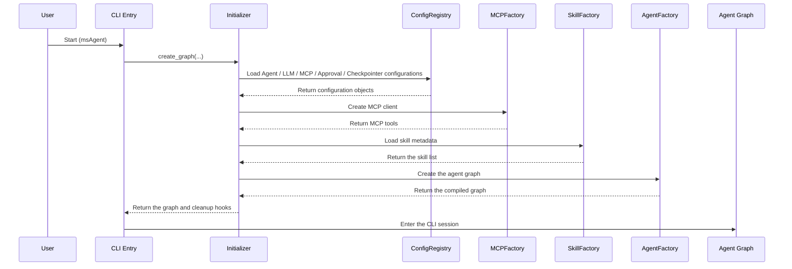
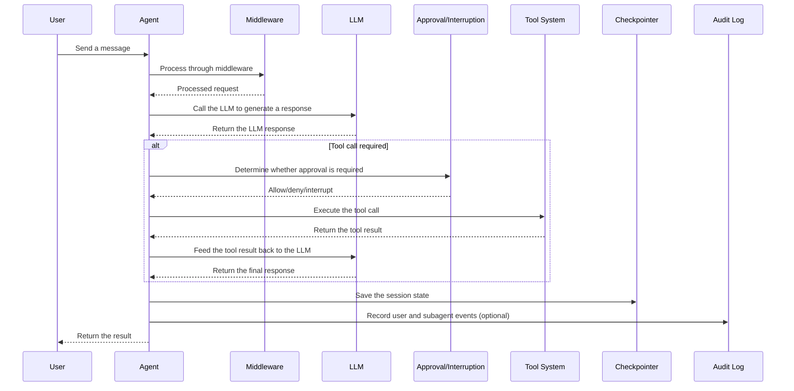

# 1. Overview

## 1.1 Introduction

This document describes the overall architecture design of MindStudio-Agent (msAgent). MindStudio-Agent is an AI agent workbench for Ascend NPU development, debugging, and tuning scenarios. It currently hosts multiple specialized agents through a unified framework, including `Profiler`, `Accuracy`, `Quantizer`, `Modeling`, `Operator`, and `Minos`, and provides a unified CLI interaction entry point.

## 1.2 Motivation

As the Ascend NPU ecosystem evolves, developers face many challenges when developing, debugging, and optimizing models:

- Locating performance issues is complex and requires professional profiling analysis capabilities.
- Troubleshooting accuracy issues is difficult, and intelligent analysis tools are lacking.
- Model quantization and adaptation processes are cumbersome and require professional knowledge assistance.
- Scenarios such as operator tuning, simulation modeling, documentation experience, and code review require different professional capabilities.

MindStudio-Agent aims to reduce the complexity of these tasks through intelligent agents, providing a unified, extensible, and auditable agent workbench experience.

## 1.3 Objectives

**Objectives:**

- Provide a unified agent framework that supports the development and management of multiple specialized agents and subagents.
- Support flexible LLM provider integration (OpenAI, Anthropic, Google, and so on) and compatible proxy services.
- Provide an extensible system for tools, skills, MCP integration, and configuration.
- Support reusing domain skills as distributable assets in other IDEs/agents and expose integrable external tool capabilities through MCP.
- Implement session memory, checkpoint persistence, context compression, and audit capabilities.
- Provide a unified CLI session mode.

**Non-objectives:**

- This document does not cover the implementation details of specific skills.
- It does not cover the logic of specific agents (for example, `Profiler` and `Accuracy`).
- It does not cover low-level hardware acceleration details.

# 2. Use Case Analysis

## 2.1 Key Functional Points

1. **Multi-agent support**: The framework must support creating and managing multiple specialized agents and allow the main agent to assemble subagent capabilities.
2. **LLM integration**: Support multiple LLM providers, including OpenAI, Anthropic, Google, and so on, and support custom service addresses.
3. **Tool system**: Provide registration, discovery, invocation, and timeout control mechanisms for built-in tools and MCP tools.
4. **Skill system**: Support loading, managing, filtering, and runtime injection of skills.
5. **MCP support**: Integrate the Model Context Protocol to support external tool and resource access.
6. **Session management**: Support session history saving, restoration, and compression, as well as memory files and checkpoint persistence.
7. **Interaction interface**: Provide a default CLI session and configuration entry point.
8. **Security and governance**: Support runtime governance capabilities such as tool approval, tool retry, result eviction, and audit logs.
9. **Configuration management**: Support a flexible configuration system covering agents, LLMs, MCP, approval, checkpoints, and so on.
10. **External integration**: Support reusing skills in other IDEs/agents and expose tool capabilities through standalone MCP servers.

## 2.2 Non-Functional Requirements

- **Extensibility**: The framework can be easily extended with new agents, tools, and skills.
- **Maintainability**: The code structure is clear and module responsibilities are well defined.
- **Reliability**: Support error handling, retry mechanisms, and so on.
- **Compatibility**: Support Python 3.11+ and major operating systems.

# 3. Solution Design

## 3.1 Overall Solution

MindStudio-Agent adopts a modular architecture built on the deepagents runtime and LangGraph state/checkpoint capabilities. The overall architecture is divided into the following core layers:

### 3.1.1 System Architecture

```text
┌─────────────────────────────────────────────────────────────┐
│                      Interaction Layer                      │
│              ┌──────────────────┐                           │
│              │ CLI (msAgent)    │                           │
│              └──────────────────┘                           │
└─────────────────────────────────────────────────────────────┘
                              ↓
┌─────────────────────────────────────────────────────────────┐
│                Assembly and Scheduling Layer                │
│  ┌──────────────────────────────────────────────────────┐   │
│  │ Initializer / ConfigRegistry / Factory assembly chain│   │
│  └──────────────────────────────────────────────────────┘   │
└─────────────────────────────────────────────────────────────┘
                              ↓
┌─────────────────────────────────────────────────────────────┐
│                     Core Runtime Layer                      │
│  ┌──────────┐  ┌──────────┐  ┌──────────┐  ┌──────────┐     │
│  │ Agents   │  │ Tools    │  │ Skills   │  │ LLMs     │     │
│  └──────────┘  └──────────┘  └──────────┘  └──────────┘     │
│  ┌──────────────────┐  ┌──────────────────┐                 │
│  │ Middlewares      │  │ Configs          │                 │
│  └──────────────────┘  └──────────────────┘                 │
└─────────────────────────────────────────────────────────────┘
                              ↓
┌─────────────────────────────────────────────────────────────┐
│                    Infrastructure Layer                     │
│  ┌──────────┐  ┌──────────────┐  ┌──────────────────┐       │
│  │ MCP      │  │ Checkpointer │  │ CompositeBackend │       │
│  └──────────┘  └──────────────┘  └──────────────────┘       │
│  ┌──────────┐  ┌─────────────────────────────────────────┐  │
│  │ Audit    │  │ LocalShell / VFS / session history      │  │
│  └──────────┘  └─────────────────────────────────────────┘  │
└─────────────────────────────────────────────────────────────┘
```

### 3.1.2 Core Modules

#### 1. Agents Module

- **Responsibilities**:
  - Agent factory class (`AgentFactory`): Assembles the deepagents graph, tools, subagents, and middleware.
  - Context management: Handles agent runtime context information (for example, template variables and the working directory).
  - Runtime backends: Combine the local shell, virtual file system, and session history routing.

#### 2. Configs Module

- **Responsibilities**:
  - Agent configuration: Defines the agent configuration structure (`AgentConfig`).
  - LLM configuration: Defines the LLM configuration structure (`LLMConfig`).
  - MCP configuration: Defines the configuration structure of MCP services.
  - Other configurations: Define configuration structures such as Checkpointer, Approval, and Sandbox.
  - Registry: Manages configuration loading, caching, and saving in a unified manner.

#### 3. Tools Module

- **Responsibilities**:
  - Tool factory: Creates and wraps tool instances and provides runtime capabilities such as timeout control.
  - Tool catalog: Provides tool registration, discovery, and invocation mechanisms.
  - Built-in tools: Provide common tools such as `fetch_tools`, `get_tool`, `run_tool`, and `web_search`.

#### 4. Skills Module

- **Responsibilities**:
  - `SkillFactory`: Loads skill metadata from `skills/` in the repository and `.msagent/skills/` in the working directory.
  - Skill filtering: Injects skills according to the patterns in the agent configuration.
  - Skill catalog: Provides skill discovery for the CLI and the runtime.
  - Distribution: The build artifacts package the `skills/` directory in the repository into the default resource directory, making it easy for installed versions and external IDEs/agents to reuse.

#### 5. LLMs Module

- **Responsibilities**:
  - LLM factory: Creates and manages LLM instances.
  - Support multiple LLM providers: OpenAI, Anthropic, Google, and so on.
  - Provide integration capabilities such as timeout, retry, and compatible proxy services.

#### 6. MCP Module

- **Responsibilities**:
  - MCP client: Communicates with MCP services.
  - MCP factory: Creates and manages MCP client instances.
  - MCP tool mapping: Integrates external tools into the agent runtime and includes them in filtering.
  - External access: Support configuring standalone MCP servers (currently defaulting to `msprof-mcp`) in other IDEs/agents for reuse.

#### 7. Middlewares Module

- **Responsibilities**:
  - Provide a middleware mechanism that allows custom logic to be inserted into the agent execution process.
  - Built-in middleware: such as `MemoryMiddleware`, `SkillsMiddleware`, `ToolRetryMiddleware`, and `ToolResultEvictionMiddleware`.

#### 8. CLI Module

- **Responsibilities**:
  - Provide the default CLI session entry point and public commands such as `config`.
  - Handle user input, thread switching, tool display, completion, shortcuts, and other interaction enhancements.

### 3.1.3 Core Processes

#### 1. Startup Process



#### 2. Agent Execution Process



## 3.2 Technology Selection

| Technology/Component | Purpose | Description |
|----------------------|---------|-------------|
| deepagents | Agent runtime | Provides agent graph construction, backend, and middleware integration capabilities |
| langchain | LLM integration | Provides model invocation and tool abstraction capabilities |
| langgraph | State management | Provides graph execution, state management, and runtime export capabilities |
| langgraph-checkpoint-sqlite | Checkpoint persistence | Provides the SQLite checkpoint implementation |
| langchain-mcp-adapters | MCP integration | Provides MCP tool adaptation capabilities |
| pydantic | Configuration management | Provides type-safe configuration definitions |
| yaml/json | Configuration file formats | Used to store agent, LLM, MCP, approval, and other configurations |
| prompt-toolkit/rich | CLI interaction | Provides terminal interaction, rendering, and theming capabilities |

## 3.3 Security, Privacy, and DFX Design

### 3.3.1 Security Design

- Sensitive information in configuration files (for example, API keys) is managed through environment variables.
- Support tool execution approval and interruption mechanisms (`ApprovalConfig`/`interrupt_on`).
- Support tool-level include/exclude, timeout control, and eviction of large results.
- Reserve `SandboxConfig` for secure code execution and runtime environment isolation.

### 3.3.2 Maintainability Design

- Modular architecture with clear responsibilities.
- Use the `Initializer`, `Factory`, and `Registry` combination to assemble the runtime.
- Clear directory structure and layered configuration.
- Provide logging and optional audit log capabilities.

### 3.3.3 Testability Design

- Provide the `testing` module to support runtime test doubles and test assembly.
- Support unit tests for configuration loading, `AgentFactory`, middleware, CLI handlers, and so on.
- Support integration test and end-to-end test extensions.

## 3.4 Programming and Invocation Design

### 3.4.1 Basic Design of the Programming Model

**Development environment:**

- Python 3.11+
- You are advised to use `uv` as the package manager.
- Support major operating systems (Windows, Linux, and macOS).

**Development constraints:**

- Follow the project coding style and conventions.
- Use `pre-commit` for code checks.

### 3.4.2 Interface Definition and Design

#### 3.4.2.1 `AgentFactory.create`

- **Interface description**: Creates an agent instance.
- **Interface prototype**:

  ```python
  async def create(
      config: AgentConfig,
      working_dir: Path | None = None,
      context_schema: type[Any] | None = None,
      mcp_client: Any | None = None,
      skills_dir: Path | list[Path] | None = None,
      checkpointer: BaseCheckpointSaver | None = None,
      llm_config: LLMConfig | None = None,
      sandbox_bindings: list[Any] | None = None,
      interrupt_on: dict[str, bool | dict[str, Any]] | None = None,
  ) -> CompiledStateGraph:
  ```

- **Input/Output parameters**:

  | Parameter | Input/Output | Type | Description |
  |-----------|--------------|------|-------------|
  | `config` | Input | AgentConfig | Agent configuration |
  | `working_dir` | Input | Path \| None | Current working directory |
  | `context_schema` | Input | type[Any] \| None | Runtime context type |
  | `mcp_client` | Input | Any \| None | Initialized MCP client |
  | `skills_dir` | Input | Path \| list[Path] \| None | Skill search directories |
  | `checkpointer` | Input | BaseCheckpointSaver \| None | Checkpoint saver |
  | `llm_config` | Input | LLMConfig \| None | LLM that overrides the agent default configuration |
  | `sandbox_bindings` | Input | list[Any] \| None | Reserved sandbox binding parameters |
  | `interrupt_on` | Input | dict[str, bool \| dict[str, Any]] \| None | Approval/interruption rules |
  | Return value | Output | CompiledStateGraph | Compiled agent graph |

### 3.4.3 Usage Instructions

1. **Configure the LLM**:

   ```bash
   msagent config --llm-provider openai --llm-base-url "https://api.deepseek.com" --llm-model "deepseek-chat"
   ```

2. **Start a CLI session**:

   ```bash
   msagent --agent Profiler
   ```

3. **Usage limitations**:
   - Different agents have different domain focuses. Select the appropriate agent for the task.
   - Some tools or MCP services may require additional configuration, permissions, or network access.

# 4. Test Design

- **Unit tests**: Run unit tests for individual modules.
- **Integration tests**: Test the collaboration between modules.
- **End-to-end tests**: Test complete user interaction processes.
- **Test directory**: `tests/`

# 5. Disadvantages and Risks (Optional)

- **Dependency risks**: The framework depends on third-party libraries such as deepagents, langchain, and langgraph. Pay attention to their updates and compatibility.
- **LLM dependency**: The functionality depends on LLM capabilities, and different LLMs may perform differently.
- **Tool governance complexity**: MCP tools, approval, timeout, and retry policies need to be tuned for different scenarios.
- **Complexity**: The framework itself has a certain level of complexity and requires good documentation and examples.

# 6. Related Technologies (Optional)

The design references the following projects and communities:

- LangChain: LLM application development framework
- LangGraph: State management and agent orchestration
- MCP: Model Context Protocol

# 7. Unresolved Issues (Optional)

- None at present.

---

Appendix

* **Reference links**:
  - [deepagents documentation](https://docs.langchain.com/oss/python/deepagents/overview)
  - [MCP specification](https://modelcontextprotocol.io/docs/getting-started/intro)
* **Glossary**:
  - **Agent**: an intelligent entity with specific capabilities
  - **LLM**: large language model
  - **MCP**: Model Context Protocol
  - **Skill**: a specific capability module of an agent
  - **Tool**: a function that an agent can invoke
* **Documentation update plan**:
  - This document will be updated as the framework evolves.
