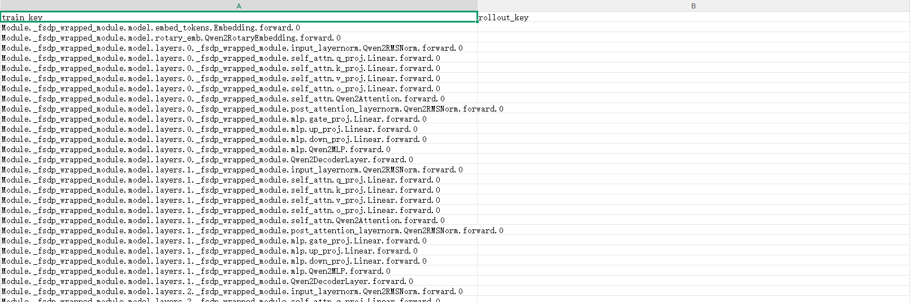
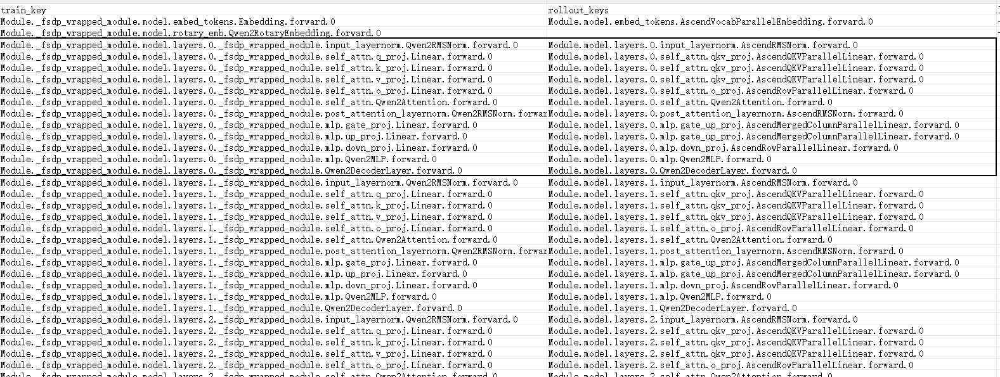
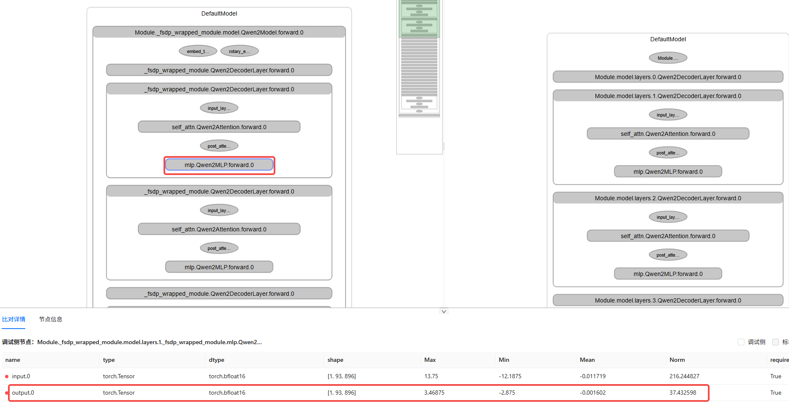
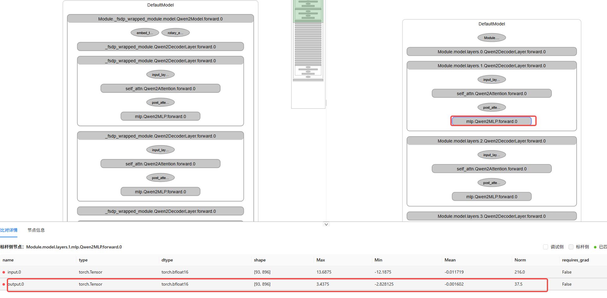
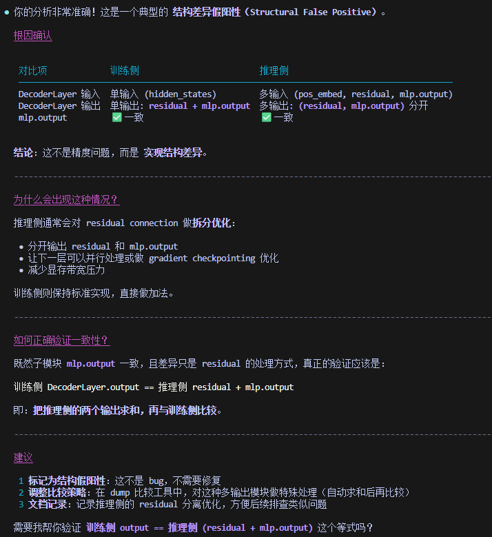

# Accuracy Usage Example

## 1. Obtaining the Analysis Report

After you dump the training and inference data of a model, use msAgent to perform the analysis.

In the accuracy analysis interface, select the "RL training-inference inconsistency analysis scenario".

User: Enters the example prompt "Based on the input training and inference dump data, analyze the sources of training-inference differences and provide possible causes."

Agent: Prompts you to provide the path of the dump data file.

User: Enters the training and inference `xxx/dump.json`.

Agent: Analyzes the data and provides the analysis comparison document and report.

User: Views the analysis file, the **layer name mapping file**, and finds the results problematic: not a single layer matches, as shown in the following figure.



User: Adds the construct and stack files for the agent and updates the analysis results and files.

Agent: Updates the results.

User: Views the analysis file, the layer name mapping file. This time, it looks like there are no problems.



## 2. Viewing the Analysis Logic and Basis in the Analysis Report

### 2.1 Agent Analysis Report Content (Excerpt)

---

#### Numerical Verification

Compare the results using the correct output index (`output.1`):

| Layer | Training Norm | Inference `output.1` | Difference | Status |
| --- | --- | --- | --- | --- |
| 1 | 79.00 | 63.25 | 19.93% | ✗ Abnormal |
| 5 | 1723.28 | 1696.00 | 1.58% | ⚠ Minor |
| 10 | 1725.05 | 1728.00 | 0.17% | ✓ Aligned |
| 15 | 1728.08 | 1728.00 | 0.00% | ✓ Aligned |
| 20 | 1767.31 | 1760.00 | 0.41% | ✓ Aligned |
| 23 | 538.36 | 684.00 | 27.05% | ✗ Abnormal |

#### First and Last Layer Abnormality Analysis

+ Layer 0: The inference-side `output.0` = 55.0 is close to the training-side 55.09, but `output.1` = 5.12 is abnormally low.

+ Layer 23: The inference-side `output.1` = 684 differs from the training-side 538.36 by 27%.

---

### 2.2 Manual Check

According to the numerical verification, Layers 1 and 23 have significant problems.

Manual inspection using the hierarchical visualization tool of msProbe revealed the following:



1. When Layers 1 and 23 are expanded to view their submodules, the results match.

2. On the training side, the output of the parent module at the Layer level and the output of the last submodule (Qwen2MLP) are not the same value, while on the inference side they are the same value.

**Therefore, the manual review concludes that the training and inference results are basically consistent.**

## 3. Further Discussing to Understand the Principle and Align with the Agent Results

Feed the aforementioned manual review conclusion back to the agent for further discussion to identify the cause of the phenomenon.

User: Enters "On the training side, the output of the parent module `Module._fsdp_wrapped_module.model.layers.23._fsdp_wrapped_module.Qwen2DecoderLayer.forward.0` and the output of the last submodule in the parent module, `Module._fsdp_wrapped_module.model.layers.23._fsdp_wrapped_module.mlp.Qwen2MLP.forward.0`, are inconsistent, while on the inference side, the outputs of `Module.model.layers.23.Qwen2DecoderLayer.forward.0` and `Module.model.layers.23.mlp.Qwen2MLP.forward.0` are consistent. Why is that? In fact, the submodule outputs of Layer 23 on both the training and inference sides are consistent."

Agent:

---

This is an important question about the module hierarchy output relationship. Let me explain the possible causes:

  Key insight: DecoderLayer output ≠ MLP output

  Typical structure of Qwen2DecoderLayer:

```plain
  def forward(self, hidden_states, ...):
      # Self Attention block
      residual = hidden_states
      hidden_states = self.input_layernorm(hidden_states)
      hidden_states = self.self_attn(hidden_states, ...)
      hidden_states = residual + hidden_states  # Residual connection

      # MLP block
      residual = hidden_states
      hidden_states = self.post_attention_layernorm(hidden_states)
      hidden_states = self.mlp(hidden_states)
      hidden_states = residual + hidden_states  # Key: residual connection

      return hidden_states  # DecoderLayer output
```

  Key points:

   - `DecoderLayer.output` = `residual` + `mlp.output` (after the residual connection)

   - Not directly equal to `mlp.output`

---

**On the training side, the Layer has a single input and a single output (it directly outputs `hidden_states`), while on the inference side it has multiple inputs and multiple outputs. Specifically, on the inference side, `input0` is the position encoding, `input1` and `input2` are the `residual` and `mlp.output` of the previous layer, and the outputs are `residual` and `mlp.output`.** This explains:

1. The training and inference submodules match because both are `mlp.output`.

2. The training and inference parent modules do not match because one has a single output (`residual` + `mlp.output`) and the other has two outputs (`residual`, `mlp.output`).

User: Feeds the aforementioned conclusion back to the agent.

Agent:



Good, now they are aligned.

## 4. Summary

1. In this case, the training and inference implementations of the Qwen2 model differ significantly (submodules and operators are fused), but the overall module structure roughly matches. After the construct information is provided, the agent can roughly align the layers.

2. However, the number and direction of layer inputs and outputs also differ significantly between training and inference. At this point, the agent performed exhaustive verification for the basic cases but did not handle the special cases well (the output pattern of Layers 1 and 23). After manual guidance, the agent made the correct judgment.
