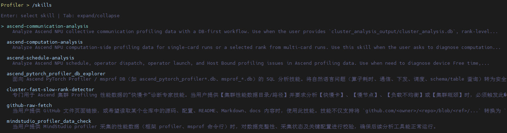
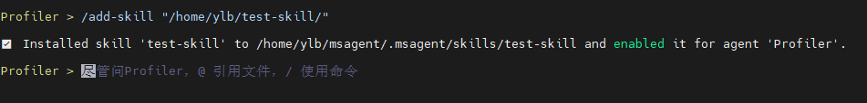

# msAgent Quick Start

This topic describes how to configure a model, select agent capabilities, and start and enter the minimal viable interactive process of msAgent.

## 1. Preparing the Environment

```commandline
pip install mindstudio-agent
```

For more installation methods, see [msAgent Installation Guide](./install_guide.md).

## 2. Configuring the LLM

1. Prepare a valid LLM API key.

   You must create the key yourself by signing in to the model provider website. Links to common model providers are as follows:

   | Model Provider | Official Website |
   | --- | --- |
   | DeepSeek | [https://platform.deepseek.com/](https://platform.deepseek.com/) |
   | Bailian | [https://help.aliyun.com/en/model-studio/get-api-key](https://help.aliyun.com/en/model-studio/get-api-key) |

2. Configure the LLM.

   This configuration includes the environment variables of the LLM service (`*_API_KEY`). Use the `--llm-provider` parameter of the `msagent config` command to configure the protocol type of the LLM service, the `--llm-base-url` parameter to configure the model provider address, and the `--llm-model` parameter to configure the model name (obtain the model name from the model marketplace on the model provider website).

   | Configuration Scenario | Example |
   | --- | --- |
   | OpenAI-compatible API | `export OPENAI_API_KEY="your-key"`<br>`msagent config --llm-provider openai --llm-base-url "https://api.deepseek.com" --llm-model "deepseek-v4-flash" # DeepSeek is used here as an example` |
   | Local OpenAI-compatible service | `export OPENAI_API_KEY="dummy"  # If the local model service has no API key, you can enter any non-empty string`<br>`msagent config --llm-provider openai --llm-base-url "http://127.0.0.1:8000/v1" --llm-model "your-model"` |
   | Anthropic-compatible service | `export ANTHROPIC_API_KEY="your-key"`<br>`msagent config --llm-provider anthropic --llm-base-url "https://example.com/anthropic" --llm-model "claude-sonnet-4-20250514"` |
   | Google/Gemini service | `export GOOGLE_API_KEY="your-key"`<br>`msagent config --llm-provider google --llm-base-url "https://example.com/google" --llm-model "gemini-2.5-pro"` |

3. View the current configuration.

   ```bash
   msagent config --show
   ```

   If the parameter values configured in step 2 are displayed, the configuration is successful.

## 3. Starting a Session

- Start and enter the default interactive session.

  ```bash
  msagent
  ```

- You can also specify an agent at startup, as shown in the following example:

  | Agent | Description | Startup Command |
  | --- | --- | --- |
  | [Profiler](../agent_guide/Profiler.md) | Performance tuning | `msagent --agent Profiler` |
  | [Accuracy](../agent_guide/Accuracy.md) | Accuracy debugging | `msagent --agent Accuracy` |
  | [Quantizer](../agent_guide/Quantizer.md) | Model quantization | `msagent --agent Quantizer` |
  | [Modeling](../agent_guide/Modeling.md) | Simulation modeling and automatic optimization | `msagent --agent Modeling` |
  | [Operator](../agent_guide/Operator.md) | Operator tuning | `msagent --agent Operator` |
  | [Minos](../agent_guide/Minos.md) | Documentation assistance | `msagent --agent Minos` |

- For more commands, see [msAgent Usage Guide](../user_guide/usemap.md).

## 4. Usage Tips

After you enter the msAgent interactive session, use it with slash commands.

### 4.1 Resuming a Historical Session Thread

Session history is automatically saved as independent threads. You can browse and restore a previous session to continue working at any time.

| Command | Description |
| --- | --- |
| `/threads` | Opens the session thread list and displays preview summaries in reverse chronological order. |


### 4.2 Selecting and Loading a Skill

A Skill is a specialized capability module for specific scenarios (for example, performance analysis and model quantization). When you enter `/skills` and press Enter, an interactive list opens. Use the up and down arrow keys to browse and select, and press Enter to load the desired Skill.

| Command | Description |
| --- | --- |
| `/skills` | Opens the interactive Skill list. Use the up and down arrow keys to browse, and press Enter to load a Skill. |
| `/skills <skill-name>` | Loads a Skill by directly specifying the Skill name, for example, `/skills ascend-computation-analysis`. |
| `/skills <skill-name> <prompt>` | Loads a Skill and passes a task for execution, for example, `/skills ascend-computation-analysis analyze whether there are compute-related bottlenecks based on the performance data`. |



### 4.3 Installing Custom Skills

In addition to built-in Skills, you can install custom Skills from a local path using `/add-skill` to meet the needs of personalized scenarios. You can specify a Skill directory or a `SKILL.md` file, and the installation takes effect immediately.

| Command | Description |
| --- | --- |
| `/add-skill <path-to-skill>` | Installs a Skill directory from a local path, for example, `/add-skill /path/to/my-skill`. |



### 4.4 Viewing Tool Output Details

When tool calls made by an agent produce long output (for example, logs, configuration files, or code blocks), enter `/tool-output` to browse the full content in a full-screen viewer, which prevents output truncation from affecting readability. You can also press the `Ctrl+O` shortcut to open it directly.

| Action | Description |
| --- | --- |
| `/tool-output` or `Ctrl+O` | Opens the full-screen tool output viewer. |
| Left and right arrow keys | Switches between multiple tool outputs. |
| Up and down arrow keys, `PageUp`/`PageDown` | Scrolls the content. |
| `Enter`/`Ctrl+O`/mouse click | Expands or collapses the full output. |
| `Esc` | Closes the viewer. |


### 4.5 Saving Long-Term Memory

If some information needs to remain effective in subsequent sessions, you can use `/remember` to save it as long-term memory for the current project. The memory is written to `.msagent/memory.md`, and subsequent sessions read it automatically.

| Command | Description |
| --- | --- |
| `/remember <content>` | Appends a long-term memory entry, for example, `/remember The user prefers answers in Chinese by default`. |
| `/showmemory` | Views the long-term memory saved for the current project. |

This is suitable for saving user preferences, project background, paths that remain valid in the long term, or troubleshooting conclusions. Do not save sensitive information such as API keys, passwords, or tokens.

### 4.6 Recording Output Results

The context window is limited. When performing multi-round complex tasks, you are advised to trigger conclusion recording at key nodes to prevent early analysis results from being pushed out of the window by subsequent interactions. For example, after a Skill completes a round of data analysis, you can manually append a prompt to ask the agent to output an interim report:

> Based on the preceding analysis results, output a complete Markdown analysis report that includes a problem summary, root cause analysis, key data, and optimization suggestions.

When context compression is triggered later, you can directly re-read the report as the context basis to improve the efficiency of multi-round collaboration.

For a more complete description of commands and shortcuts, see [msAgent Usage Guide](../user_guide/usemap.md).
