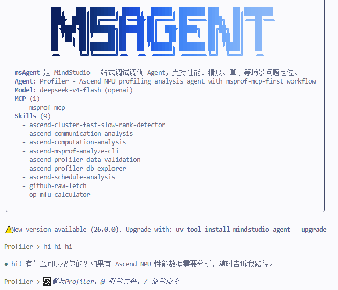

# FAQ

## 1. What Local Files Does msagent Generate on First Startup?

`msagent` uses project-local configuration. The first time you start it in a working directory, it automatically generates:

```text
.msagent/
```

This directory typically contains:

- LLM configuration
- Agent and subagent configuration
- MCP configuration
- Prompt templates
- Skills
- Logs, cache, session history, and checkpoint data

For a more complete description of the directory, see [Configuration and Extension](configuration-and-extension.md).

## 2. How Do You Enable or Disable MCP Services?

There are two common ways:

- Use `/mcp` in a session to view and switch the configured MCP services.
- Edit `.msagent/config.mcp.json` directly.

The default template enables `msprof-mcp`. If you want to connect a new local or remote MCP service, you are advised to first refer to the field descriptions in [Configuration and Extension](configuration-and-extension.md).

## 3. How Can You Confirm That a Skill Is Recognized?

After you enter a session, run:

```text
/skills
```

To view a specific Skill:

```text
/skills my-skill
```

If your Skill has a category directory, you are advised to write the full path:

```text
/skills profiling/my-skill
```

If it does not appear, check the following first:

- Whether the path is correct
- Whether the file name is `SKILL.md`
- Whether the `skills.patterns` setting of the current agent allows the Skill
- Whether a Skill with the same name in a higher-priority directory overrides it

To load a custom Skill, see [Adding a Custom Skill](configuration-and-extension.md#adding-a-custom-skill).

## 4. Where Can You View the Runtime Logs?

Once enabled, the logs are written in the current working directory:

```text
.msagent/logs/app.log
```

If you want to see more detailed logs, you can enable verbose mode:

```bash
export MSAGENT_LOG_LEVEL=DEBUG
msagent -v
```

## 5. What If the Terminal Interface Colors Look Gray or Hard to Read?

`msagent` automatically detects the terminal theme (dark or light) to match the color scheme. If the detection is inaccurate (for example, when an SSH connection is misjudged as a light theme, causing the text to look gray on a dark terminal), you can specify the theme manually through an environment variable:

```bash
export MSAGENT_BACKGROUND_THEME=dark
```

Available values:

| Value | Meaning | |
|---|---|---|
| dark | Forces the dark background theme (Tokyo Night), with a corresponding light font. |  |
| light | Forces the light background theme (Tokyo Day), with a corresponding dark font. |  |

## 6. What If the MobaXterm Terminal Background Is White or Has No Color?

MobaXterm does not set `COLORTERM` by default. Therefore, `prompt_toolkit` cannot recognize true-color support, and the interface may display a white background or no color. Set the following environment variable to restore it:

```bash
export COLORTERM=truecolor
```
