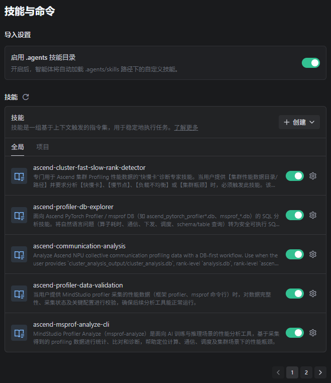
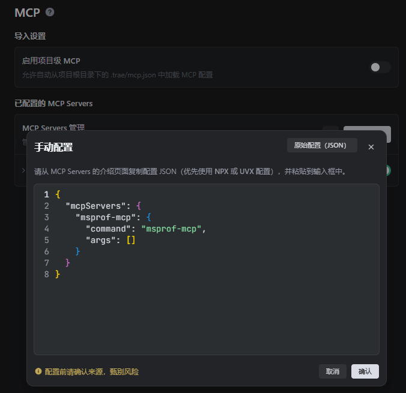
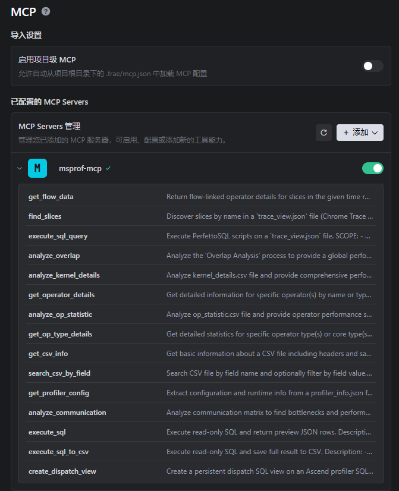
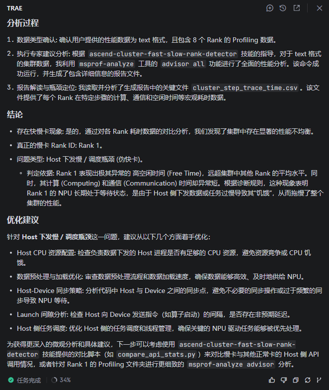

# Integrating msAgent Debugging and Tuning Capabilities

## 1. Overview

msAgent provides integrated debugging and tuning capabilities for the Ascend domain, covering core development scenarios such as performance analysis, precision tuning, model quantization, operator optimization, and document review. msAgent also provides two types of assets that external agents can integrate and reuse:

- **Skill**: Domain knowledge packages for 30+ Ascend development scenarios, covering performance analysis, precision tuning, model quantization, operator optimization, document review, and so on. Each Skill consists of `SKILL.md` (the execution process) plus `scripts/` (helper scripts). After an agent loads a Skill, it automatically executes the process.
- **MCP services**: An `msprof-mcp` service that focuses on Ascend profiling data analysis.

Intended audience: developers who use agents such as Trae, Claude, Codex, and OpenCode and want to integrate Ascend NPU debugging and tuning capabilities into their agents.

## 2. Skill: Out-of-the-Box Domain Knowledge Packages

The Skill implementations in msAgent follow the common conventions of Agent Skills and can be reused and migrated across different agents. For complete information, see [Skill list](../../../skills/README.md).

### 2.1 Method 1: npx skills (Recommended)

This method applies to agents that support the `npx skills` workflow, such as Trae and OpenCode. You can install Skills with a single command:

```bash
git clone https://gitcode.com/Ascend/msagent.git
cd msagent/skills

# Install a single Skill
npx skills add . --skill ascend-cluster-fast-slow-rank-detector -a trae -y

# Install multiple Skills
npx skills add . --skill ascend-communication-analysis --skill ascend-computation-analysis -a opencode -y

# Install all Skills
npx skills add . --all -a trae
```

### 2.2 Method 2: Manual Copy

This method does not depend on `npx` and works with any agent. After cloning the repository, copy the target Skill directory into the agent's skills scanning path:

```bash
git clone https://gitcode.com/Ascend/msagent.git

# opencode
cp -r msagent/skills/ascend-profiler-db-explorer ~/.config/opencode/skills/

# claude
cp -r msagent/skills/ascend-profiler-db-explorer ~/.claude/skills/
```

After installation, enter a task matching the Skill description in the conversation, and the agent automatically reads `SKILL.md` and executes the process described in it.

## 3. MCP: Plug-and-Play Tool Foundation

The currently available MCP services are as follows:

| Service | Domain | Repository |
|----------|------|---------------------------------------------------------|
| msprof-mcp | Ascend Profiling data analysis | [link](https://gitcode.com/kali20gakki1/msprof_mcp.git) |

### 3.1 msprof-mcp

It focuses on Ascend profiling data analysis and helps developers quickly extract key information from large volumes of raw profiling performance data.

#### 3.1.1 Typical Capabilities

| Dimension | Tool | Data Carrier |
|------|------|----------|
| Timeline analysis | `analyze_overlap`, `find_slices`, `get_flow_data`, `execute_sql_query` | `trace_view.json` |
| Operator analysis | `analyze_kernel_details`, `get_operator_details`, `analyze_op_statistic` | `kernel_details.csv`/`op_statistic.csv` |
| Communication analysis | `analyze_communication`, `analyze_communication_trace` | `communication_matrix.json`/`communication.json` |
| Configuration query | `get_profiler_config` | `profiler_info.json` |
| Database query | `execute_sql`, `execute_sql_to_csv` | `ascend_pytorch_profiler.db` |

#### 3.1.2 Quick Integration

The service runs over the stdio transport protocol. You can start it with a single `uvx` command, or install it with `pip` and run it directly:

```bash
# Method 1: uvx (recommended, no explicit installation required)
uvx msprof-mcp

# Method 2: pip installation
pip install msprof-mcp
msprof-mcp
```

Add the following to the agent's MCP configuration file:

```json
{
  "mcpServers": {
    "msprof-mcp": {
      "command": "msprof-mcp",
      "args": []
    }
  }
}
```

Environment requirements:

- Python >= 3.11
- glibc >= 2.34 (a binary dependency of the Perfetto TraceProcessor Shell)

## 4. Hands-On Example in Trae IDE

The following demonstrates how to combine Skill + MCP in Trae IDE to diagnose fast and slow ranks in an Ascend cluster from scratch.

### Step 1: Installing Skills

After cloning the repository, copy the Skills in `msagent/skills/` to the Skill directory of Trae IDE:

- Project level: `<project root>/.trae/skills/`
- Global level: `~/.trae/skills/` (macOS/Linux) or `C:\Users\your username\.trae\skills` (Windows)

Once the Skills are loaded, you can view them in `Settings → Skills and Commands` in the IDE.



### Step 2: Configuring the MCP Server

In Trae IDE, go to `Settings → MCP`, click `Add → Manual configuration`, and enter the following information:

```json
{
  "mcpServers": {
    "msprof-mcp": {
      "command": "msprof-mcp",
      "args": []
    }
  }
}
```



After you save, Trae automatically installs `msprof-mcp` and its dependencies. When the installation is complete, you can view the specific list of tools exposed by this MCP in the interface.



### Step 3: Installing msprof-analyze

Some Skills depend on the msprof-analyze tool, which you need to install in the Trae IDE sandbox environment. Simply send the agent the `pip install msprof-analyze` command, and the agent automatically completes the installation and reports the result.

### Step 4: Getting Started

After the configuration is complete, you can directly invoke the Profiling analysis Skills and the msprof-mcp tool in the conversation. Example trigger phrases:

- "Check whether this Profiling data is complete and analyzable"
- "Analyze the fast and slow rank problem in the profiling directory of this Ascend cluster"
- "Find the most time-consuming TopK operators and communication time in this `ascend_pytorch_profiler_*.db`"

The following shows an example of the analysis results for the cluster fast and slow rank problem:


