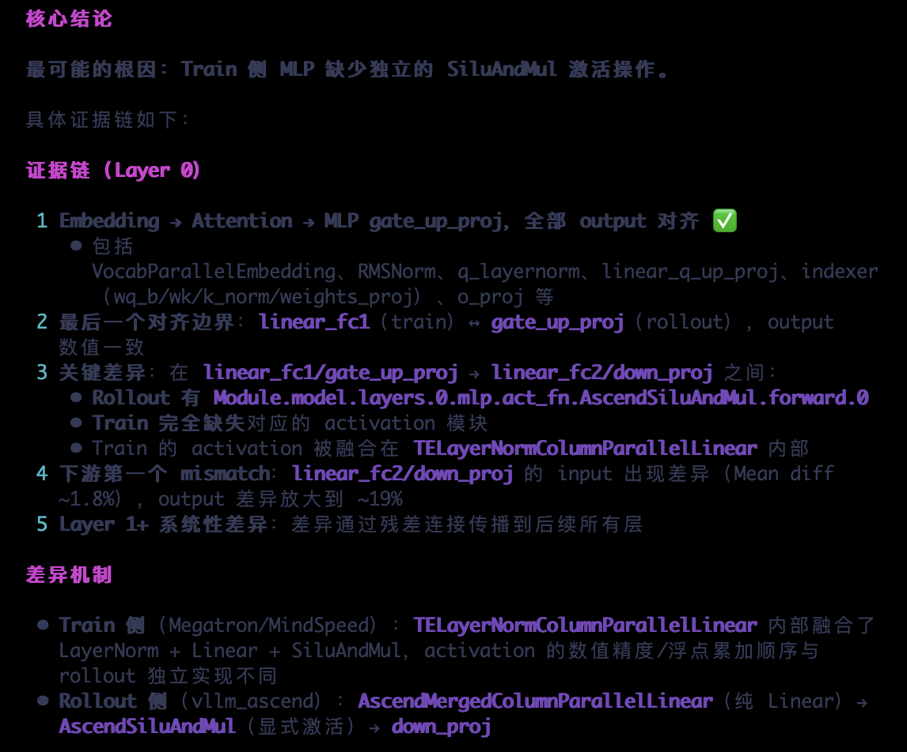
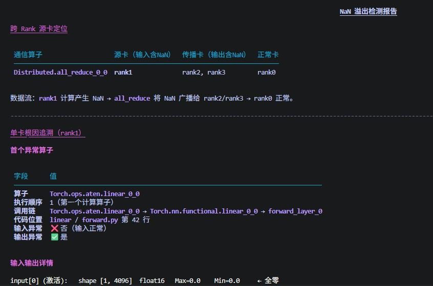

# Accuracy 精度调试

`Accuracy` 是面向 msProbe 模型精度调试的 Agent，负责把复杂精度数据转化为结构化结论、根因分析和可执行优化建议。

## Agent 定位

- 面向单卡、多卡、集群等 Ascend 精度分析场景
- 聚焦dump数据解读与调优建议输出
- 适合RL训推一致性分析，loss/gnorm NaN等问题分析

## 核心能力

- RL训推不一致根因分析
- loss/gnorm NaN问题定位

## 推荐使用方式

- 直接提供 dump 数据目录路径，并说明你想解决的问题
- 如果是集群或多卡问题，尽量同时说明异常现象、涉及 rank 或训练阶段

## 典型使用场景

| 场景             | 示例提示词 | 效果展示 |
|----------------|---|--|
| RL训推不一致分析      | `请基于输入的训练和推理dump数据，分析训推的差异来源，给出可能原因。` |  |
| loss/gnorm NaN溢出分析 | `请基于输入的训练dump数据，分析其中的NaN溢出，找出源卡和根因算子` |  |
