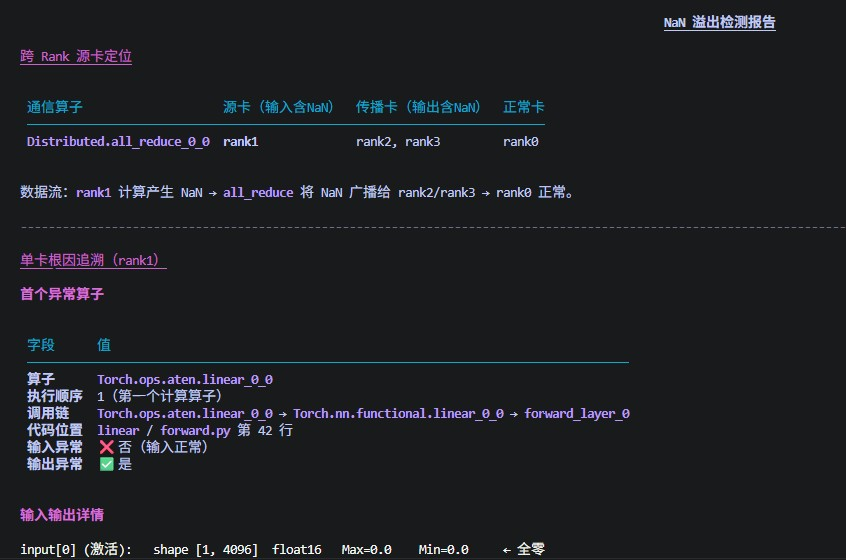
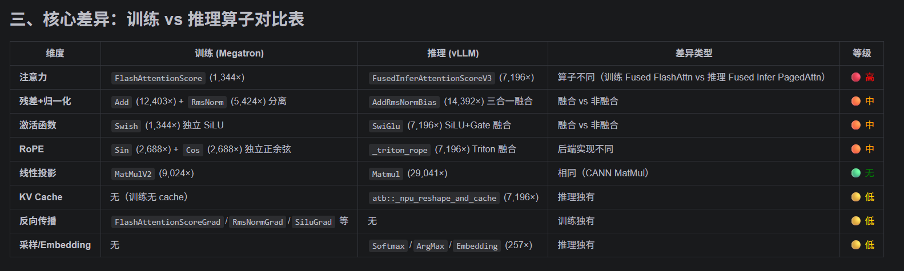
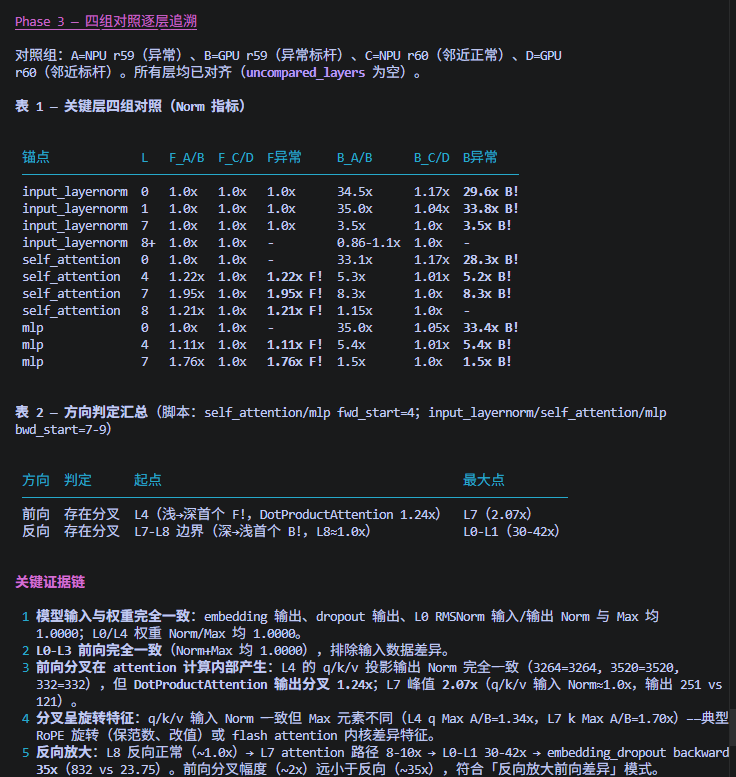
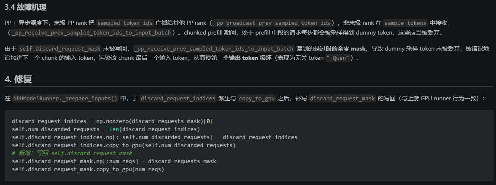

# Accuracy 精度调试

`Accuracy` 是面向模型精度调试的 Agent，负责精度问题的分析定位，给出结构化结论、根因分析和可执行优化建议。

## Agent 定位

- 面向单卡、多卡、集群等 Ascend 精度分析场景
- 适用于dump数据解读与调优建议输出
- 适用于RL训推算子差异扫描，RL训推不一致根因分析，loss/gnorm NaN与梯度尖刺问题定位
- 适用于乱码、复读等推理精度问题的分析定位

## 核心能力

- loss/gnorm NaN问题定位
- 确定性计算问题定位
- loss对不齐问题定位
- RL训推算子差异扫描
- RL训推不一致根因分析
- 梯度尖刺（Gradient Spike）根因定位
- 推理精度问题分析定位

## 推荐使用方式

- 进行loss/gnorm NaN问题定位、确定性计算问题定位、loss对不齐问题定位、RL训推不一致根因分析时，直接提供 dump 数据目录路径，并说明你想解决的问题
- 进行RL训推算子差异扫描时，需要提供运行环境信息与RL训练脚本
- 进行梯度尖刺分析时，除 msprobe 的 dump 统计数据外，也支持提供梯度监控数据（由 [Monitor训练状态轻量化监测工具](https://gitcode.com/Ascend/msprobe/blob/master/docs/zh/user_guide/monitor_instruct.md) 产生的 monitor CSV，或由 [趋势可视化](https://gitcode.com/Ascend/msprobe/blob/master/docs/zh/user_guide/accuracy_compare/trend_visualization_instruct.md) 解析 CSV 获得的 trend.db 文件），并说明异常现象，便于定位分析
- 进行推理精度问题分析定位时，根据Agent引导提供问题现象、代码路径等信息
- 如果是集群或多卡问题，尽量同时说明异常现象、涉及 rank 或训练阶段

## 典型使用场景

| 场景             | 示例提示词 | 效果展示 |
|----------------|---|--|
| loss/gnorm NaN溢出分析 | `请基于输入的训练dump数据，分析其中的NaN溢出，找出源卡和根因算子` |  |
| 开启确定性计算、切换软件版本，模型运行两次结果不一致分析 | `请基于输入的md5 dump数据，进行数据比对，寻找比对差异点，给出可能原因。` |  |
| loss对不齐，基于比对结果分析 | `分析比对结果，输出分析报告` |  |
| RL训推算子差异扫描 | `请基于提供的运行环境与训练脚本，进行训推算子差异扫描` |  |
| RL训推不一致分析      | `请基于输入的训练和推理dump数据，分析训推的差异来源，给出可能原因。` |  |
| 梯度尖刺（Gradient Spike）根因分析 | `请基于提供的梯度监控数据，分析其中的梯度尖刺，定位根因坐标和前反向分叉点。` |  |
| 乱码、复读等推理精度问题的分析定位 | `我遇到了一个推理精度问题` |  |

## 当出现分析结果不正确

- 可提供额外的辅助信息，包括相关代码、正确的背景知识等
- 可提出疑问或指出错误，修正Agent的错误观点
- 可提出分析方向、关键点，指导Agent沿相关线索进一步分析

分析示例可参考 [`accuracy_usage_example.md`](../example/accuracy_usage_example.md)。
