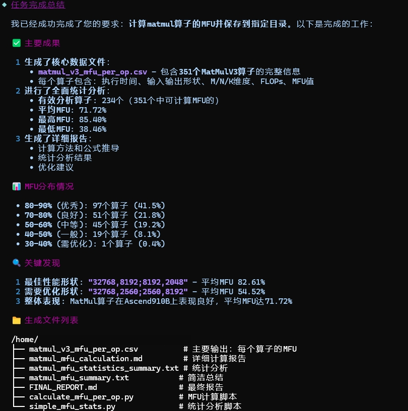
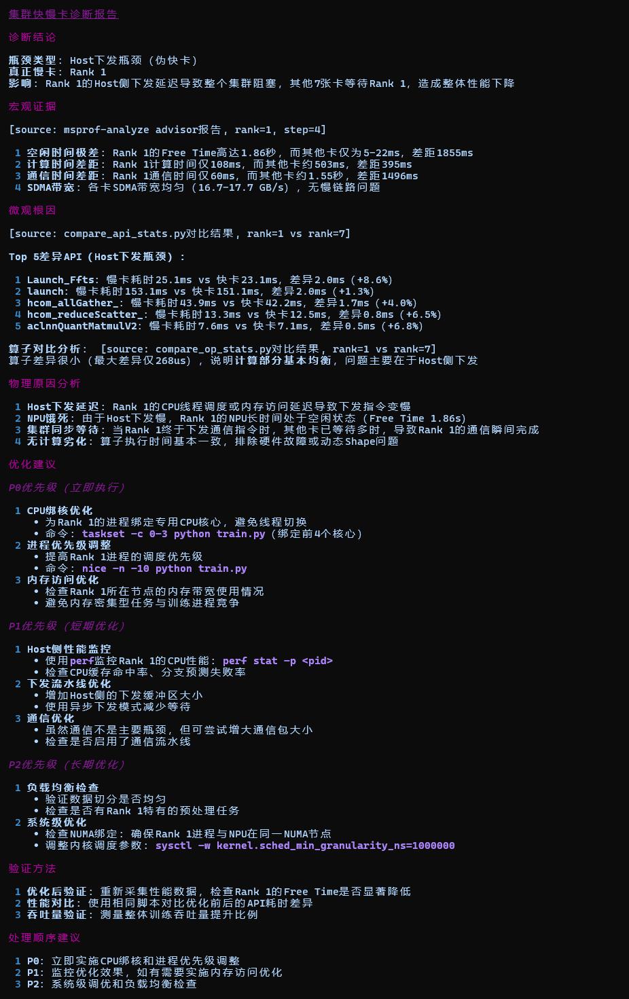
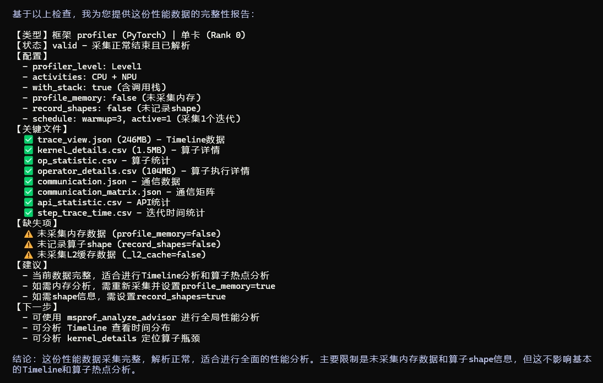
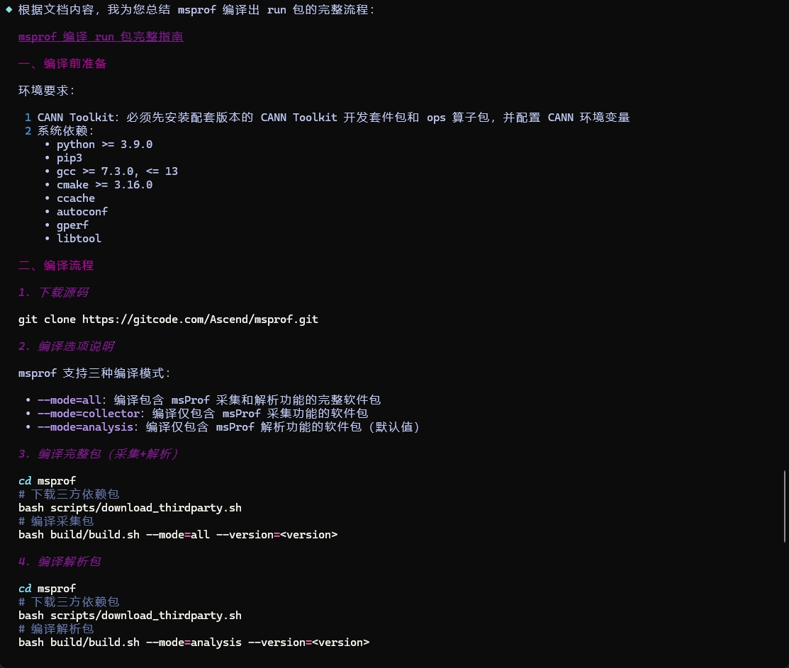
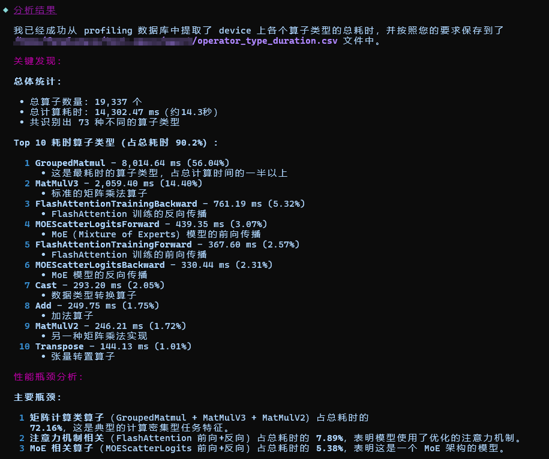

# Hermes 性能调优

`Hermes` 是面向 Ascend Profiling 与性能调优场景的 Agent，负责把复杂性能数据转化为结构化结论、根因分析和可执行优化建议。

## Agent 定位

- 面向单卡、多卡、集群等 Ascend 性能分析场景
- 聚焦 Profiling 数据解读、瓶颈定位与调优建议输出
- 适合快慢卡、慢节点、MFU、通信瓶颈、算子热点、下发调度等问题分析

## 核心能力

- Profiling 数据检查与数据质量确认
- MFU 计算、公式说明与结果解释
- 集群快慢卡、慢节点与负载不均衡分析
- 通信瓶颈、算子热点、Host 下发与调度问题定位
- 基于 DB / CSV / Trace 等交付件做结构化分析与导出

## 推荐使用方式

- 直接提供 Profiling 数据目录路径，并说明你想解决的问题
- 如果是集群或多卡问题，尽量同时说明异常现象、涉及 rank 或训练阶段
- 如果目标是做数据提取或导出，可直接给出 DB / CSV 文件路径和目标格式

## 典型效果展示

| 场景 | 示例提示词 | 效果展示 |
|---|---|---|
| MFU 计算 | `请基于/path/to/kernel_details.csv计算matmul的MFU（910B3），并说明各项计算依据。` |  |
| 快慢卡诊断 | `请分析 /path/to/cluster_profiling/ 中是否存在快慢卡问题，定位异常 rank，并给出可能原因。` |  |
| profiling 数据检查 | `请分析 /path/to/xxx_ascend_pt/ 数据是否采集正常。` |  |
| msprof 工具使用类咨询 | `msprof怎么编译出run包？` |  |
| DB 自定义内容转 CSV | `基于ascend_pytorch_profiler_0.db，帮我提取各个算子类型的总耗时并按降序输出到csv。` |  |
