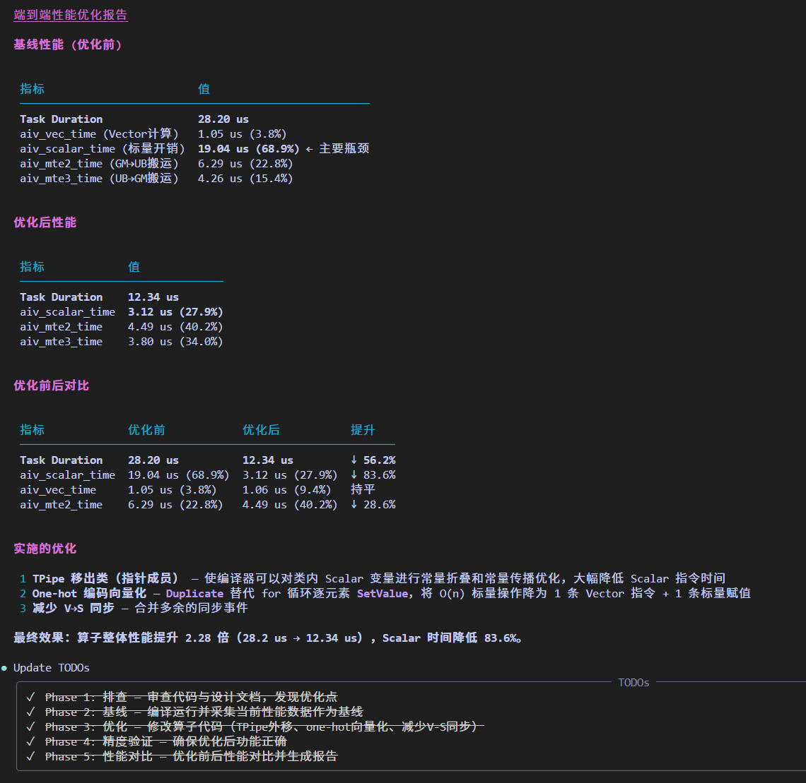

# Operator 算子调优

`Operator` 是面向 Ascend 算子开发性能优化场景的 Agent,负责把复杂算子性能数据优化为结构化、可分析和可执行的优化建议，并提供端到端性能优化的能力

## Agent 定位

- 面向昇腾NPU 单算子开发性能优化场景
- 聚焦算子性能瓶颈定位、优化建议分析与输出
- 聚焦算子性能端到端优化

## 核心能力

- 算子性能分析报告输出
- MFU 计算、公式说明与结果解释
- 算子性能负载不均衡问题分析
- 算子性能瓶颈分析
- 算子性能端到端一键优化

## 推荐使用方式

- 直接提供算子 msprof op 上板与仿真数据、提供所使用的算子kernel文件、可直接执行的算子目录

## 典型效果展示

| 场景        | 示例提示词                            | 效果展示                                                                        |
|-----------|-----------------------------------|-----------------------------------------------------------------------------|
| 算子端到端性能优化 | `请基于算子目录端到端进行性能优化，算子核函数为xxx.cpp。` |  |
