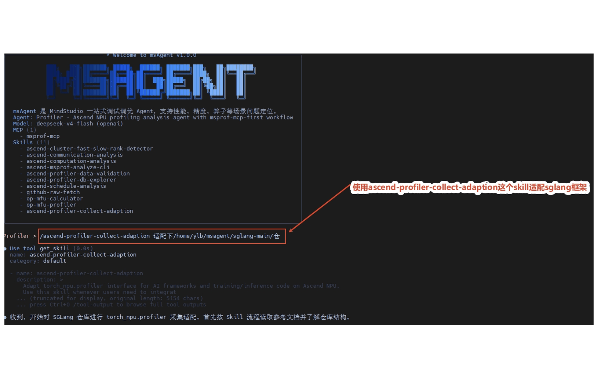
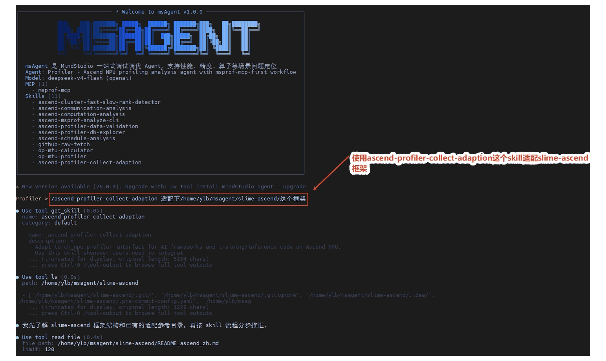

# torch_npu.profiler 接口适配最佳实践

## 场景 1：推理场景 `sglang` 框架适配 `torch_npu.profiler` 接口

以推理场景的 `sglang` 框架为例，展示如何通过 msagent 的 `ascend-profiler-collect-adaption` Skill，端到端完成 `torch_npu.profiler` 接口适配。

### 流程

1. 用户提供 `sglang` 框架代码，并说明需要接入 `torch_npu.profiler`。
2. msagent 调用 `ascend-profiler-collect-adaption` Skill，识别推理场景的真实启动入口、参数解析位置和 profiler 注入点。
3. 在不改动原有业务逻辑的前提下，补充 `torch_npu.profiler` 相关参数、默认关闭配置和采集调用逻辑。
4. 进入验证输出阶段，检查 profiler 参数是否已完成透传，并确认从外部参数到核心采集代码的整条链路已打通。
5. 验证 profiler 数据是否完整，确认已正常采集到 Profiling 数据，并确认 `timeline` 上已采集到真实的 NPU 算子。

### 效果演示

---

## 场景 2：强化学习场景 `slime-ascend` 框架适配 `torch_npu.profiler` 接口

以强化学习场景的 `slime-ascend` 框架为例，展示如何通过 msagent 的 `ascend-profiler-collect-adaption` Skill，端到端完成 `torch_npu.profiler` 接口适配。

### 流程

1. 用户提供强化学习场景 `slime-ascend` 框架代码，并说明需要接入 `torch_npu.profiler`。
2. msagent 调用 `ascend-profiler-collect-adaption` Skill，定位强化学习场景的 `torch_npu.profiler` 注入位置。
3. 若强化学习框架包含 rollout 和 actor 阶段，则将 `torch_npu.profiler` 接口分别适配到 rollout 和 actor 阶段，按阶段独立控制采集，避免跨阶段串扰。
4. 在不改动原有业务逻辑的前提下，补充 `torch_npu.profiler` 调用、参数透传和配置解析逻辑。
5. 验证 profiler 数据是否完整，确认已正常采集到 Profiling 数据，并确认 actor 和 rollout 阶段的 `timeline` 上均已采集到真实的 NPU 算子。

### 效果演示

