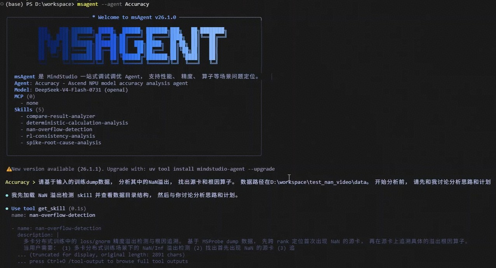
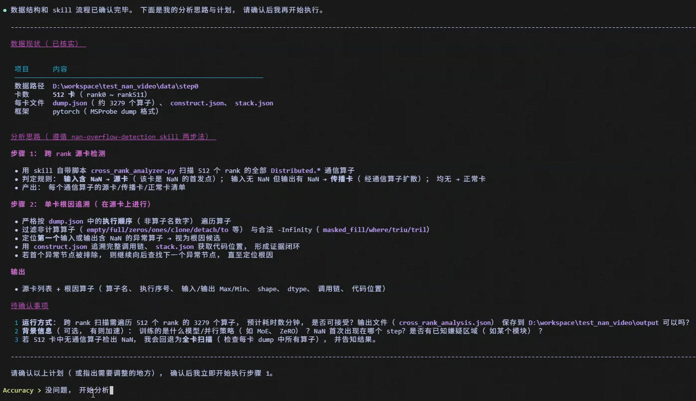
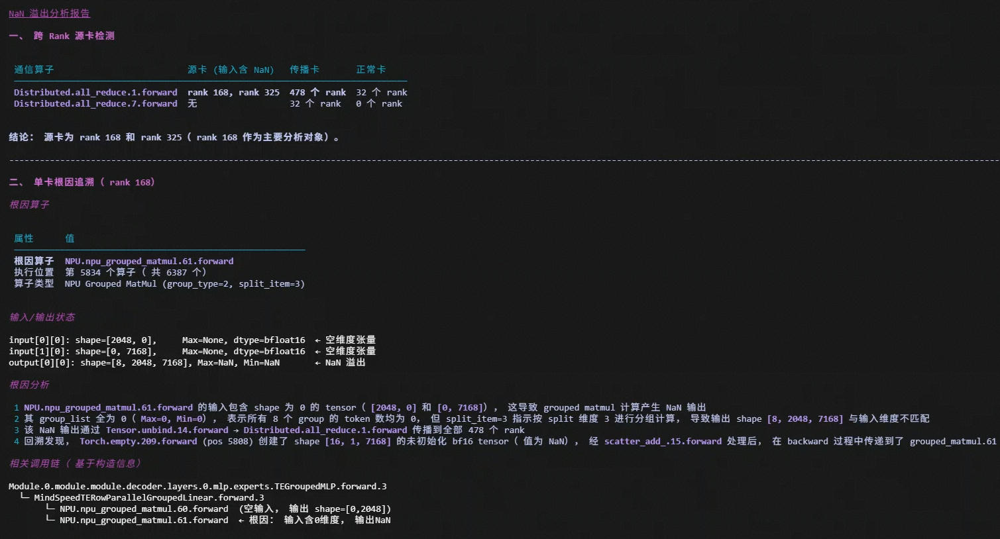
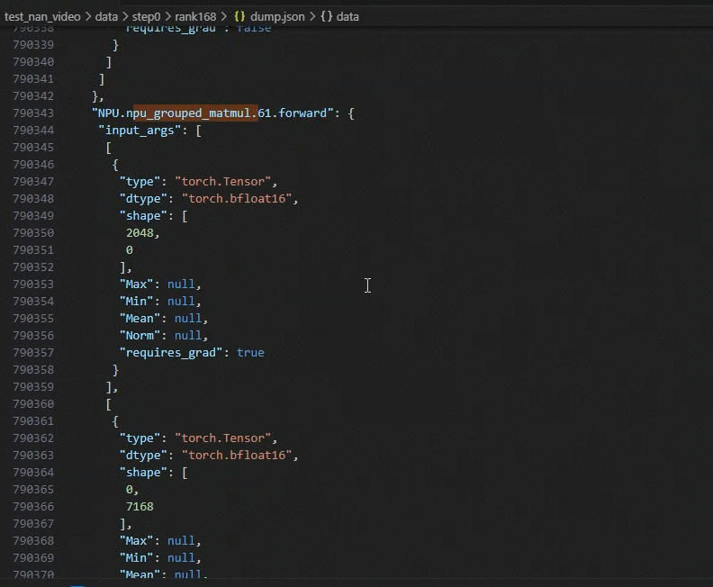
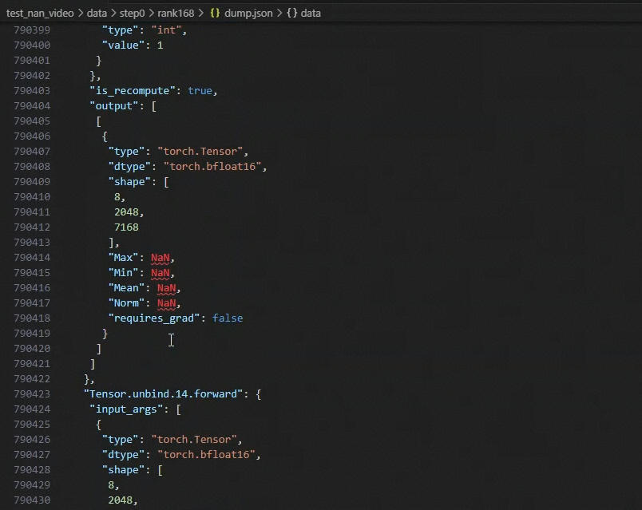
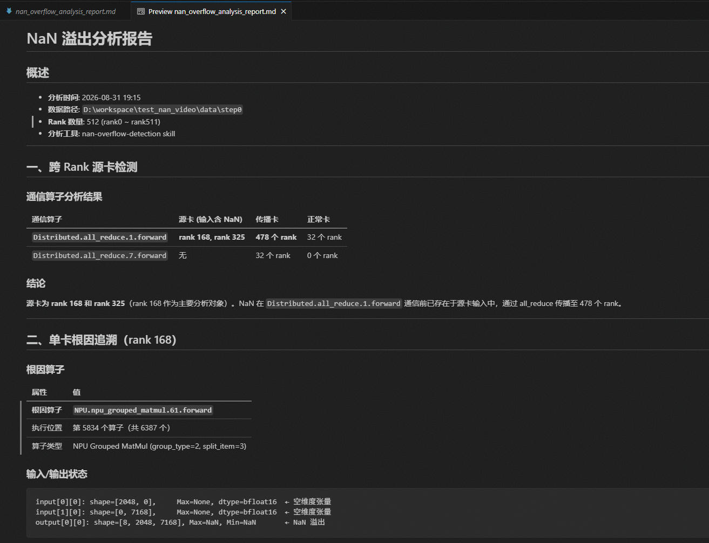

# 精度问题——NaN溢出问题最佳实践

以某模型 512 卡训练首 step 出现 NaN 溢出为例，展示如何通过 msagent 的精度定位功能模块，端到端完成 NaN 溢出的源卡定位与根因算子分析。

## 问题背景

某模型 512 卡训练首 step 出现 NaN 溢出，需定位问题源卡与根因算子。

## 定位步骤

### 流程

1. 准备好用于分析的 dump 数据。
2. 进入 msagent 的精度定位功能模块，输入初始 prompt：“请基于输入的训练 dump 数据，分析其中的 NaN 溢出，找出源卡和根因算子。数据路径在 xxx。开始分析前，请先和我讨论分析思路和计划”。
3. 讨论确定分析步骤：先定位源卡，再定位根因算子。
4. 得到 agent 分析结论：问题源卡为 rank 168 和 rank 325，根因算子为 `npu_grouped_matmul` 算子。
5. 核对分析结论，在数据中确认 `NPU.npu_grouped_matmul.61.forward` 的输入为非 NaN，输出为 NaN。且该算子前无 NaN，该算子后为 NaN。
6. 生成分析报告。

### 效果演示

#### 描述目标和数据

#### 讨论确定分析步骤

#### 得到agent分析结论

#### 核对输入无NaN

#### 核对输出为NaN

#### 得到分析报告

