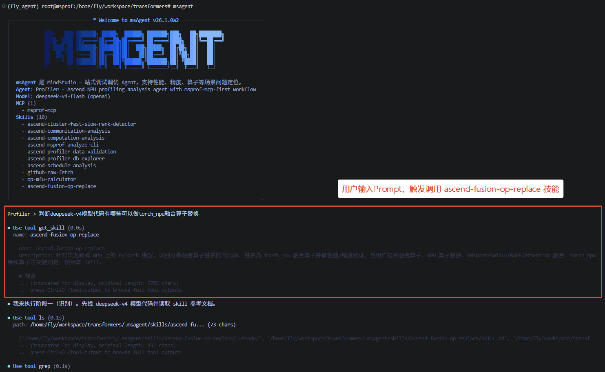
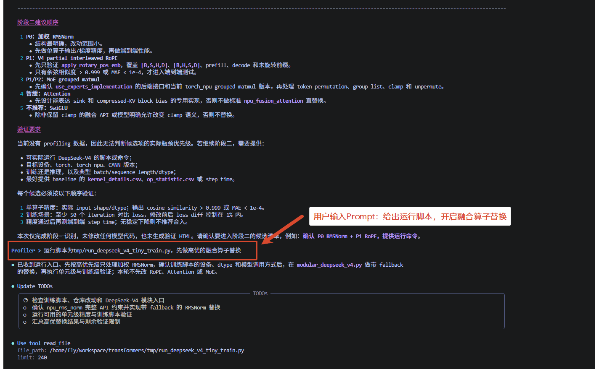
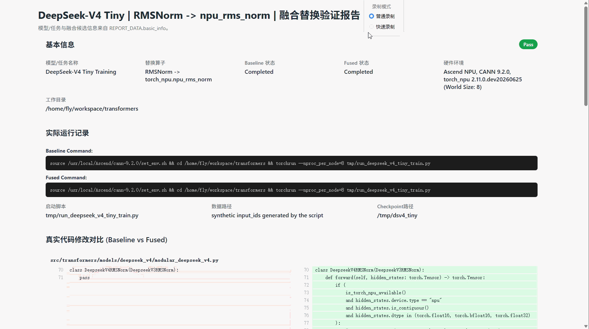

# 模型融合算子识别与替换最佳实践

以 transformers 中的 deepseek-v4 模型代码为例，展示如何通过 msagent 的 `ascend-fusion-op-replace` Skill 端到端完成常用融合算子的识别以及替换验证。

## 效果演示

### 评估可以做融合算子的代码片段

1. 在 msagent 中选定 `ascend-fusion-op-replace` Skill，输入提示词：“判断 deepseek-v4 模型代码中有哪些算子可进行 `torch_npu` 融合替换”。
2. msagent 会阅读并遵循 `ascend-fusion-op-replace` Skill 的指引，确认采用“两阶段流程”：首先输出识别报告，待用户确认后再进行代码修改与验证。
3. 定位 DeepSeek-V4 的模型实现，重点分析 `src/transformers/models/deepseek_v4/modular_deepseek_v4.py` 中的核心计算逻辑。
4. 系统扫描 RMSNorm、RoPE、Attention、SwiGLU、MoE 等关键计算路径，利用 Skill 提供的 API 查询脚本逐一确认 `torch_npu` 所提供的实际融合接口及其使用约束。
5. 基于扫描与查询结果，给出各候选算子的融合替换可行性判断，输出阶段一的识别报告，并等待用户确认。

### 验证替换后的精度与性能

1. 根据用户反馈，优先启动高优先级算子 RmsNorm 的融合替换工作。
2. 首先拉起未做任何修改的原始代码，运行 50 个 step，记录每个迭代的 loss 和耗时，保存为 `baseline.jsonl`。
3. 在代码中接入 RmsNorm 融合算子实现，通过配置参数控制融合开关，保留原有分支逻辑以支持回退对比。
4. 拉起接入融合算子后的代码，同样运行 50 个 step，记录每个迭代的 loss 和耗时，保存为 `rmsnorm.jsonl`。
5. 对比接入前后的 loss 曲线与 step 耗时，确保融合后精度通过校验且 step 耗时稳定低于 baseline。

### 生成验证结果HTML

