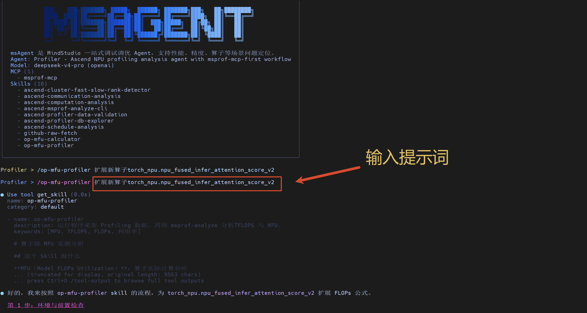

# 算子级 MFU 实测分析最佳实践

## 场景 1：端到端采集 Profiling 数据并分析 MFU

以 MindSpeed-LLM 为例，展示如何通过 msagent 的 `op-mfu-profiler` Skill 端到端完成 MFU 分析。

### 流程

1. 在 msagent 中选中 `op-mfu-profiler` Skill，输入提示词：`/xxx/MindSpeed-LLM/examples/mcore/qwen25/pretrain_qwen25_7b_32k_profile_module_mfu.sh，我想计算 mfu`。
2. Skill 自动检查环境（`torch_npu`、`msprof-analyze`），逐项核对训练脚本中的四项关键配置（`with_flops`、`mstx`、`export_type`、`profiler_level`），有缺漏则会指出并修改。
3. 配置就绪后运行采集，采集profiling 数据。
4. 调用 `msprof-analyze`的 `operator_mfu` 分析能力分析 profiling 数据。
5. 输出 `OperatorMFU` 表，得到每个算子的 MFU、实际 TFLOPS、执行耗时等关键指标。

### 效果演示

---

## 场景 2：扩展注册新算子 FLOPs 公式

当目标算子不在 `torch_npu` 默认注册列表中时，msprof-analyze 无法计算其 MFU。可通过 `@register_npu_flop` 在 PTA 侧自行注册 FLOPs 公式。

### 流程

1. **确定 FLOPs 公式**：优先参考 `_flops_formulas.py` 中已有的同类算子，仿照其代码风格推导；推导不出则直接终止，**不强行估算**。
2. **注册公式**：在 `torch_npu/profiler/_flops_formulas.py` 中添加 `@register_npu_flop` 装饰的函数，`target` 指向目标算子，函数体返回 FLOPs 计算值。
3. **验证**：重新采集 profiling 数据，SQL 查 `MSTX_EVENTS` 确认新算子 FLOPs 已落盘，再跑 msprof-analyze 确认 `OperatorMFU` 表中出现该算子且 `flops` 字段与手算一致。

### 效果演示

