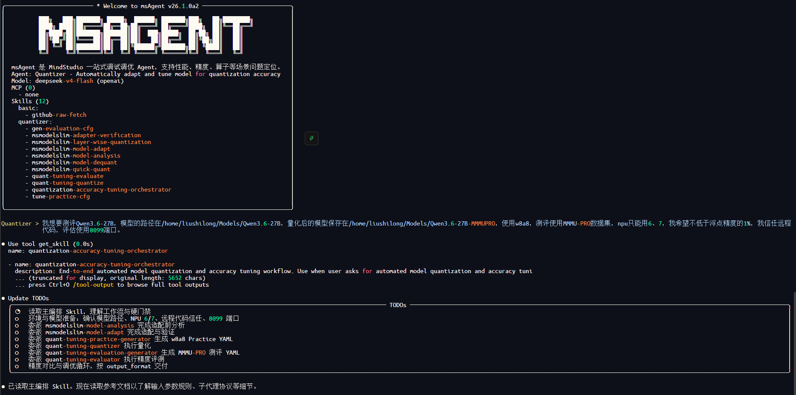
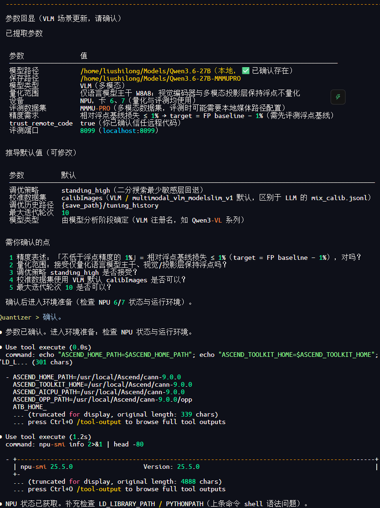
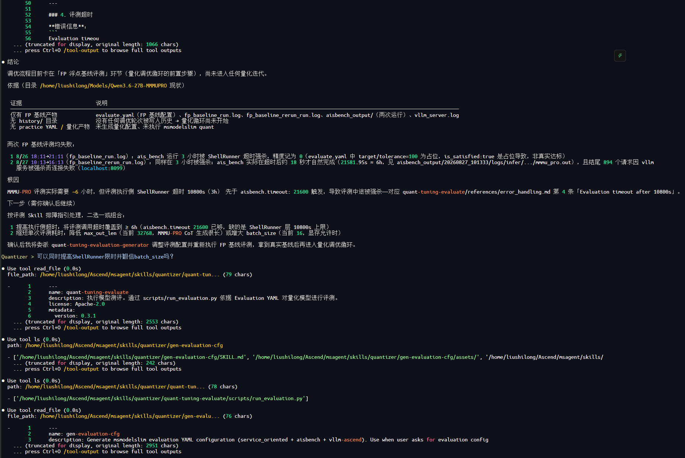
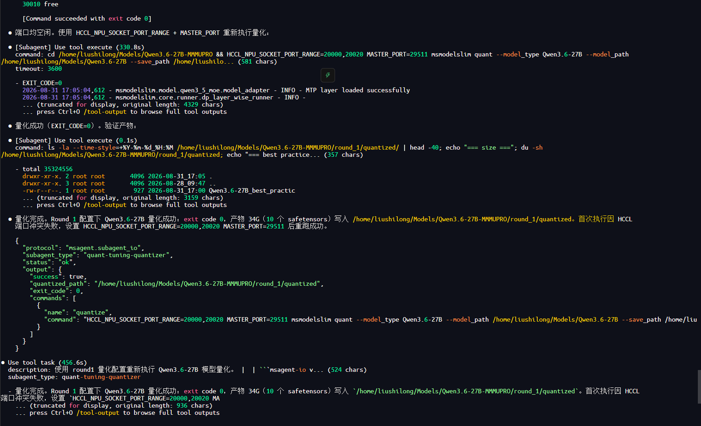
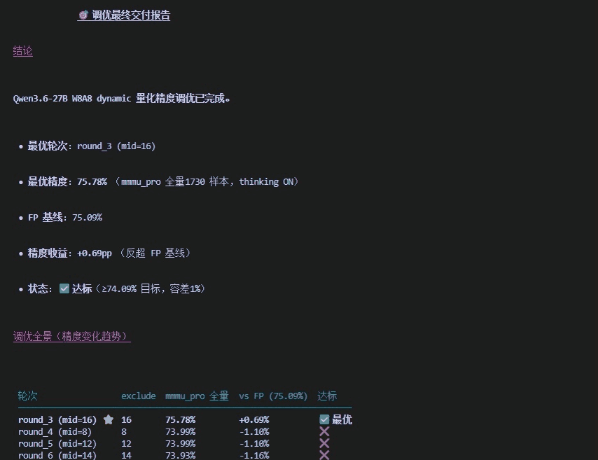

# 模型量化自动调优最佳实践

以 Qwen3.6-27B 模型为例，展示如何通过 msagent 的 `Quantizer` Agent，端到端完成量化配置生成、模型量化、精度评测与自动调优，在指定精度约束下获得满足要求的量化模型。

## 效果演示

### 输入需求并确认调优信息

1. 在 msagent 中选定 `Quantizer` Agent，使用自然语言描述模型路径、保存路径、量化方案、设备和精度要求。例如：“帮我把 `/path/to/Qwen3.6-27B` 进行 W8A8 量化，量化结果保存到 `/path/to/output`，使用 NPU 6、7 卡，在 MMMU-PRO 数据集上的精度损失控制在 1% 以内。”

   

2. Quantizer 提取模型路径、量化方案、设备卡号、评测数据集、精度目标及 `trust_remote_code` 等关键参数；信息缺失时提示用户补充，完整后回显配置并等待确认。

### 自动执行量化与精度调优

1. Quantizer 检查 msModelSlim、Ascend 环境和设备状态，并确认目标模型是否已被 msModelSlim 支持；未注册的模型会先进入模型分析与适配流程。
2. 生成评测配置（Evaluation YAML）；若用户未提供浮点基线精度，则先评测浮点模型。发生超时等异常时，Quantizer 会汇总日志和产物，定位原因并给出处理建议。
3. 浮点基线就绪后生成首轮量化配置（Practice YAML），执行模型量化和精度评测。
4. 比较评测结果与精度目标并记录调优历史；未达到目标时调整量化策略并进入下一轮，直至达到精度目标或最大迭代次数。

### 查看自动调优结果

1. 调优完成后，Quantizer 输出量化模型保存路径、最终量化配置、精度评测结果和调优历史。
2. 若量化模型达到精度目标，则交付满足要求的量化模型；若达到最大迭代次数后仍未达标，则输出终止原因和后续处理建议。

