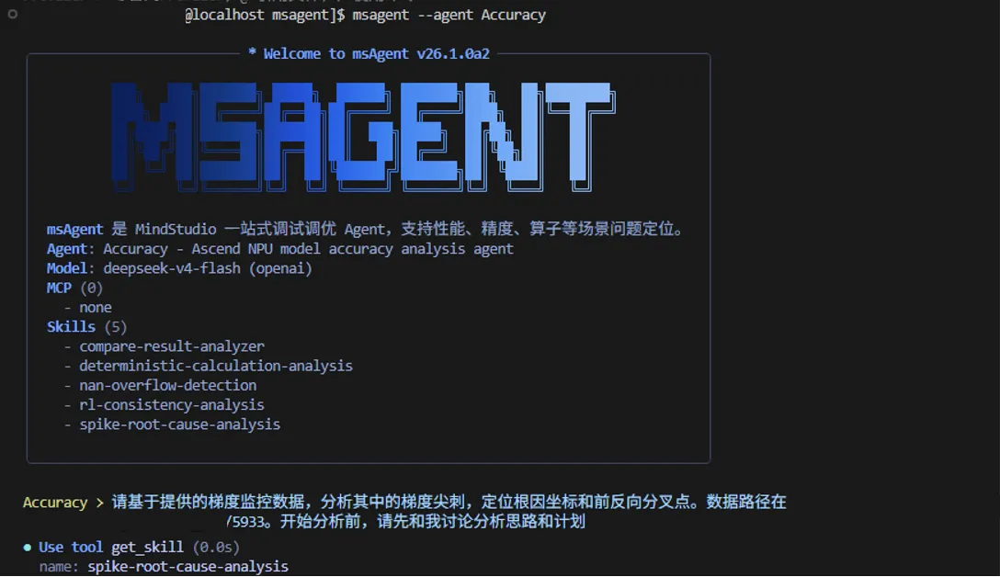
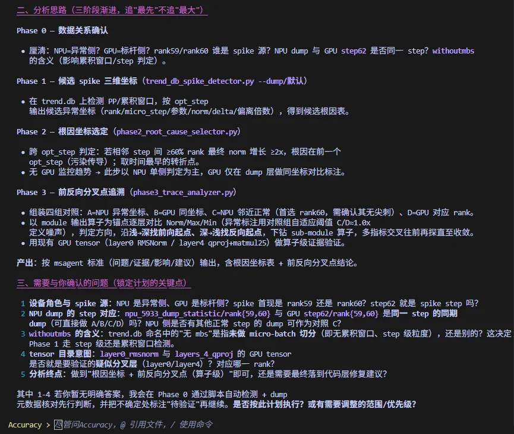
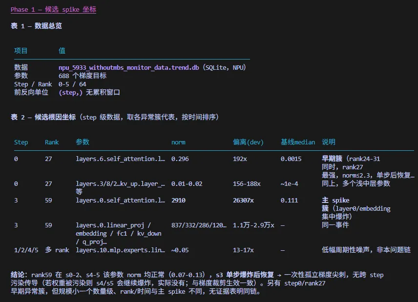
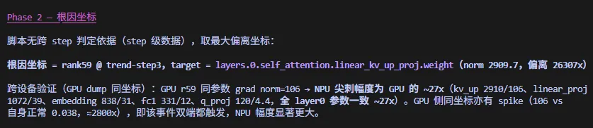
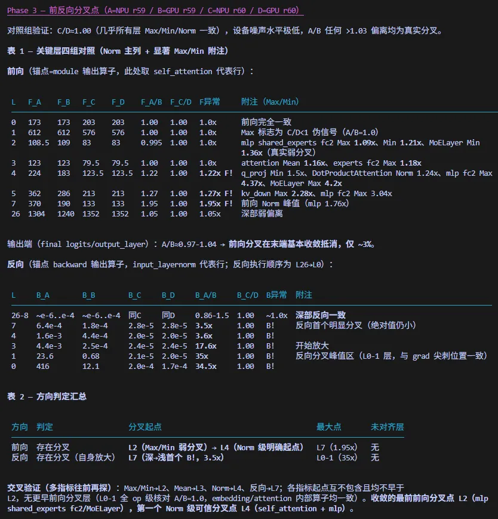
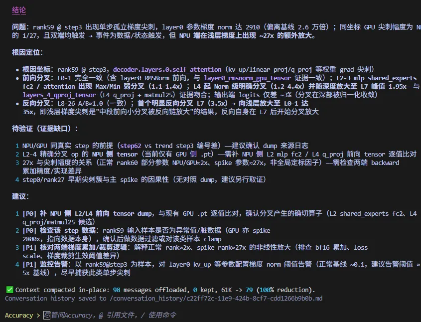

# 精度问题——梯度尖刺（Gradient Spike）最佳实践

以某模型 64 卡分布式训练出现梯度尖刺为例，展示如何通过 msagent 的精度定位功能模块，端到端完成梯度尖刺的异常坐标定位、跨设备比对与前反向分叉点追溯。

## 问题背景

某模型 64 卡分布式训练过程中，rank59 在 step3 出现梯度尖刺，step 前后均正常。调试侧为 NPU，同时提供 GPU 同坐标 dump 数据作为跨设备标杆，需回答：尖刺根因坐标在哪、前反向从哪里开始分叉、异常是设备特异还是双端共有。

## 数据准备

本次分析所需数据如下：

| 数据 | 内容 | 用途 |
|------|------|------|
| `npu_xxx_withoutmbs_monitor_data.trend.db` | NPU 梯度监控数据：64 rank × 6 step（0-5），688 个梯度目标，step 级无累积窗口 | Phase 1/2：候选尖刺坐标定位 |
| `npu_xxx_dump_statistic/` | 异常侧 NPU dump 统计（rank59、rank60） | Phase 2/3：dump 数据对齐、对照组构建 |
| `gpu_xxx_dump_statistic/` | 标杆侧 GPU dump 统计（rank59、rank60） | Phase 2/3：跨设备标杆对照 |

## 定位步骤

### 流程

1. 准备数据：把训练过程中记录的梯度监控数据（trend.db）和异常设备、标杆设备的详细数据（dump 数据）准备好，确认数据目录的路径。数据越完整，分析越可靠。
2. 发起分析：在 msagent 精度分析模块中输入初始 prompt：“请基于提供的梯度监控数据，分析其中的梯度尖刺，定位根因坐标和前反向分叉点。数据路径在 xxx。开始分析前，请先和我讨论分析思路和计划”。agent 会先和你确认分析思路，再开始动手。
3. 理清思路：先确认这批数据是否来自同一个训练时刻、能否互相比较；再在监控数据里圈出所有可疑的尖刺位置；然后锁定最像根因的那一个，和标杆设备对比；最后逐层追查前向、反向计算最早出现差异的地方。
4. 得到分析结论：
   - 尖刺位置：尖刺出现在第 3 步训练的 59 号卡——该卡在这一步的整体梯度表现异常，差异沿反向传播逐层累积，到浅层（L0-1）时与正常水平相比放大了约 35 倍；
   - 设备对比：同样位置 GPU 上也有尖刺，但幅度只有 NPU 的约 1/27——说明触发尖刺的事件在两边都发生了，并非 NPU 独有；两侧对该事件的响应幅度存在约 27 倍的差异，属于设备间行为差异；
   - 分叉起点：逐层对比后，前向计算最早在 L2 层出现轻微差异、L4 层起差异明显；反向计算最早在 L7 层开始分叉，越往浅层差异越大。
5. 核对结论：用两台正常设备（NPU/GPU 的 60 号卡）的数据相互对比，确认它们表现几乎完全一致——说明设备本身没有计算偏差，之前发现的差异都是真实存在的问题。
6. 生成报告：把结论、尚未查清的疑点（如数据编号差异、缺少部分现场数据）以及后续建议整理成完整报告。

### 效果演示

#### 描述目标和数据

告诉 agent 遇到了什么问题（梯度尖刺）、数据放在哪里，让分析有明确的目标和材料。

#### 讨论确定分析步骤

和 agent 一起理清分析思路：先确认数据能否对比，再找可疑位置、锁定根因，最后逐层追查分叉点。

#### 找出候选尖刺位置（Phase 1）

从监控数据中圈出所有可疑的尖刺点，就像先在地图上标出异常区域。

#### 锁定根因并和标杆设备对比（Phase 2）

从可疑点中确定最像根因的位置，再和 GPU 标杆对比，判断该异常属于设备特异还是双端共有。

#### 追溯前反向分叉点（Phase 3）

逐层对比异常与正常数据，找到前向、反向计算最早开始出现差异的环节。

#### 得到分析报告

agent 把结论、疑问和后续建议整理成一份完整报告，方便跟进处理。梯度尖刺定位的主要功能，是帮助使用者找到最早与标杆设备产生梯度差异的可疑分叉点，从而定界根因范围。

#### 问题的解决

skill 的定位止步于分叉点，但正是这一步定界了根因范围，为后续修复指明方向：本案例中，根据定位结果排查前两层（L0-1）的 RMSNorm 计算，确认其与标杆存在累积误差——该误差属于算子数值累加差异，对齐该误差后尖刺消失。
