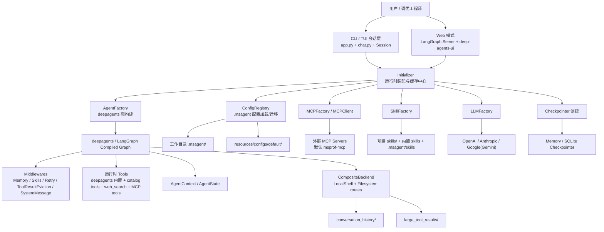
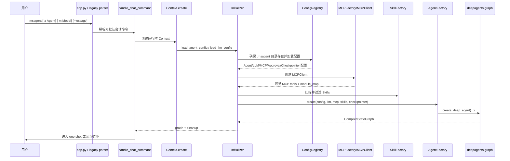
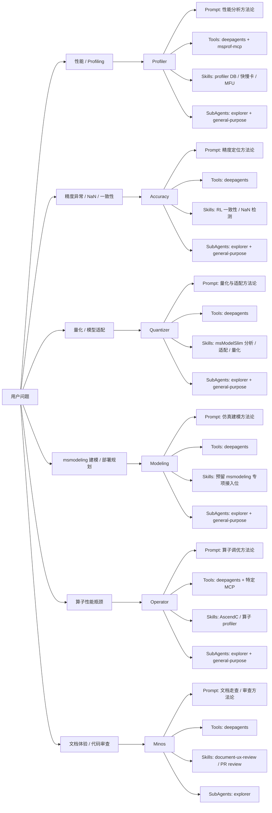
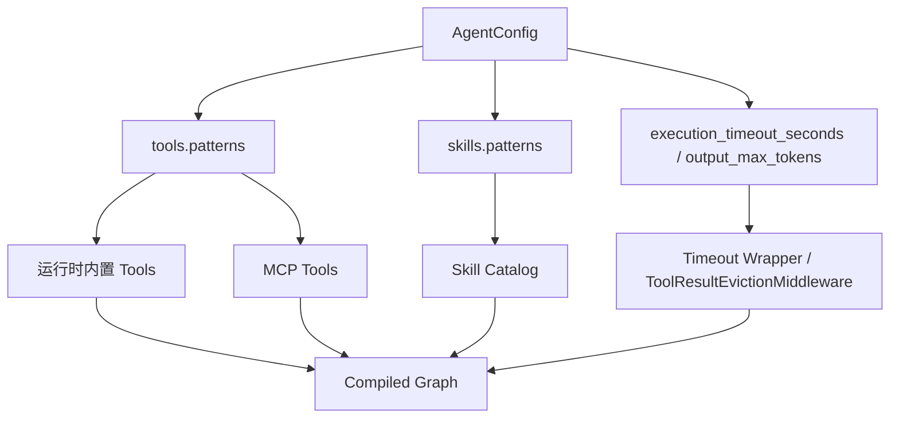
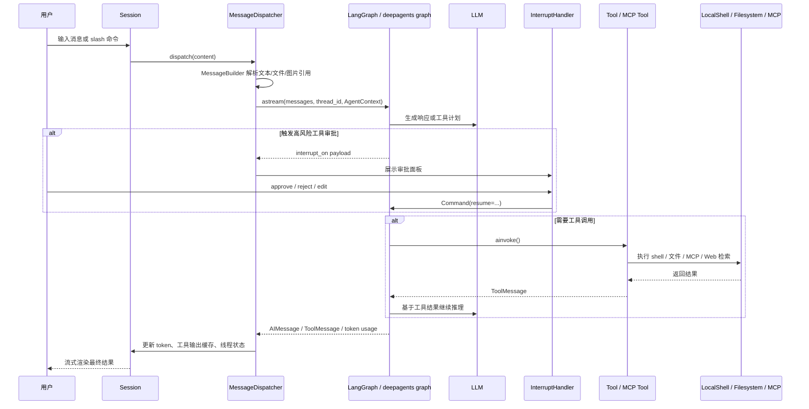
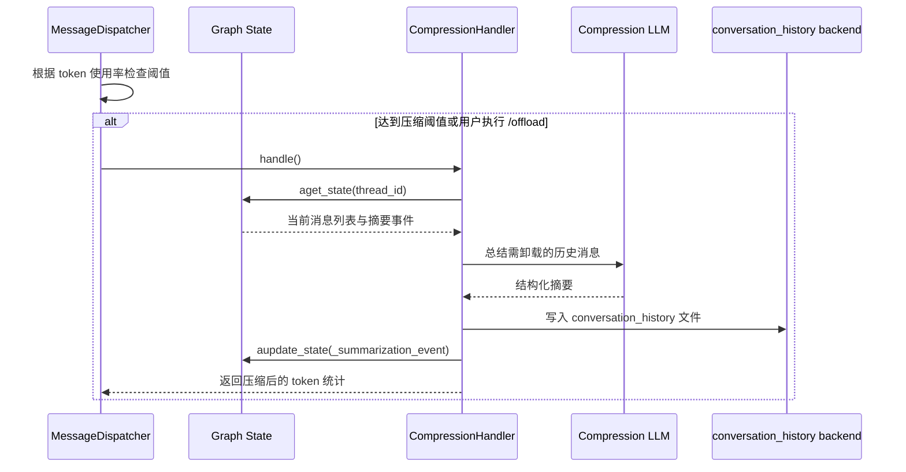

# msAgent 设计文档

## 修订记录

| 日期 | 修订版本 | 修改描述 | 作者 | RFC文档 |
| -- | -- | -- | -- | -- |
| 2026-06-03 | 1.0 | 补充 msAgent 详细设计文档，覆盖架构、交互链路、扩展机制与测试设计 | kali20gakki1 |  |

## 背景描述

### 1. 产品定位

`msAgent` 是一个面向 Ascend开发流程的一站式调试调优。它不是单一能力点工具，而是将以下能力整合为统一的交互式CLI：

- 面向不同问题域的专业 Agent，如性能调优、精度分析、模型量化、算子调优、文档体验与代码审查。
- 面向多模型供应商的 LLM 适配层，支持 OpenAI、Anthropic、Google/Gemini 等模型接入。
- 面向外部能力扩展的 MCP（Model Context Protocol）工具集成机制。
- 面向工作流复用的 Skill 装配能力。
- 面向长会话稳定运行的检查点、上下文压缩、审批、超时与重试机制。

### 2. 业务痛点

Ascend生态下利用Agent调试调优存在几个典型难点：

- 问题域多样：性能、精度、量化、算子优化、文档体验等问题需要不同知识体系。
- 工具链分散：MindStudio 场景下常同时涉及命令行工具、比如性能调优涉及到msprof 与 Profiling 数据、模型脚本、配置文件、文档说明以及辅助分析脚本，问题定位往往需要在多个工具入口和多种数据载体之间来回切换。
- 上下文复杂：调优任务往往跨多轮会话，涉及日志、Profiler 数据、代码、配置、历史结论等大量上下文。
- 风险不可忽视：工具执行可能涉及 shell 命令、外部连接、长耗时任务，需要审批、超时和重试等保护机制。
- 扩展成本高：如果缺少清晰装配层，新 Agent、新 Skill、新 MCP 服务接入会快速侵蚀系统边界。

### 3. 核心价值

| 价值点 | 说明 |
| -- | -- |
| 统一入口 | 通过 `msagent` CLI 与 Web 模式暴露统一入口，降低学习和切换成本。 |
| 领域分治 | 用 Agent + SubAgent + Skill 的组合承载不同领域知识，而不是把所有逻辑塞进一个 Prompt。 |
| 配置驱动 | LLM、Agent、Checkpointer、MCP、Sandbox、Approval 均通过 `.msagent/` 本地配置驱动。 |
| 可控扩展 | Tool Pattern、Skill Pattern、MCP include/exclude 共同限定能力边界。 |
| 稳定运行 | 检查点、重试、超时、审批、中间件和上下文压缩保证长链路对话可持续。 |

### 4. 设计目标与非目标

#### 4.1 设计目标

- 支持多专业 Agent 并保持统一运行时模型。
- 支持本地配置、默认模板、版本迁移和目录式扩展。
- 支持 CLI/TUI 与 Web 两种交互形式共用同一套图运行时。
- 支持 Tool、Skill、MCP 的可组合装配与精细过滤。
- 支持长会话上下文治理，包括检查点、记忆注入、压缩卸载与大结果外置。
- 为测试、打包、文档发布提供稳定边界。

#### 4.2 非目标

- 不在本设计文档中展开各个 Skill 内部算法实现细节。
- 不把 `msAgent` 设计成 GUI 优先的前端产品，当前主入口仍是 CLI/TUI。
- 不在运行时内直接承载硬件 Profiling/量化算法本体，而是通过技能、MCP 与外部工具协同完成。

## 方案设计

### 1. 设计原则

- **配置优先**：模型、Agent、MCP、审批、检查点都通过配置解析，不将策略写死在业务逻辑中。
- **装配集中**：通过 `Initializer` 统一装配图运行时，避免 CLI、Web、测试各自拼装依赖。
- **边界清晰**：CLI 负责交互，`ConfigRegistry` 负责配置，`AgentFactory` 负责图构建，`MessageDispatcher` 负责消息流。
- **渐进扩展**：新增 Agent、Skill、MCP 服务时优先沿现有目录结构和过滤规则扩展，而不是修改核心主流程。
- **运行时可控**：通过审批、超时、重试、上下文压缩和工具结果外置来控制复杂场景风险。

### 2. 总体架构

#### 2.1 分层架构图



#### 2.2 架构解读

整体上，`msAgent` 采用“**入口层统一、运行时集中装配、能力模块解耦**”的方案：

- CLI 与 Web 不是两套不同产品，而是两种前端入口，最终都依赖 `Initializer.create_graph()` 组装同一类图运行时。
- `ConfigRegistry` 负责把模板资源、工作目录配置和历史兼容迁移整理为强类型配置对象。
- `AgentFactory` 负责把 LLM、工具、技能、中间件、后端和检查点真正拼成一个 `CompiledStateGraph`。
- `MessageDispatcher` 负责运行时阶段的消息流、流式渲染、审批恢复、自动压缩和 token 统计。
- Tools / Skills / MCP 三种能力来源通过 Pattern 过滤共同决定每个 Agent 的“能力边界”。

### 3. 模块职责拆解

| 模块 | 代表路径 | 主要职责 | 设计要点 |
| -- | -- | -- | -- |
| CLI 启动层 | `src/msagent/cli/bootstrap/` | 解析命令、启动会话、路由到 chat/config/web 模式 | `normalize_argv()` 将裸调用自动路由到默认交互会话。 |
| 会话层 | `src/msagent/cli/core/` | 保存线程上下文、会话状态、热切换 Agent/Model、工具输出记忆 | `Context` 与 `Session` 将运行期 UI 状态与图生命周期隔离。 |
| 消息分发层 | `src/msagent/cli/dispatchers/` | 处理 slash 命令、普通消息、流式输出、审批恢复 | `MessageDispatcher` 是单轮对话执行主入口。 |
| 配置层 | `src/msagent/configs/` | 定义 Agent/LLM/MCP/Approval/Checkpointer 等配置模型 | 通过 Pydantic 建模，并保留版本迁移逻辑。 |
| 运行时装配层 | `src/msagent/cli/bootstrap/initializer.py` | 汇总所有配置，创建 graph 并缓存可见能力目录 | 是系统真正的依赖注入中心。 |
| Agent 构建层 | `src/msagent/agents/factory.py` | 调用 `create_deep_agent()` 编译图，注入 middleware 和 backend | 工具过滤、系统提示渲染、结果外置等能力集中在这里。 |
| LLM 层 | `src/msagent/llms/factory.py` | 解析模型 Provider、API Key、Base URL、超时、HTTP 客户端参数 | 兼容官方与 OpenAI-compatible 网关。 |
| MCP 层 | `src/msagent/mcp/` | 解析 MCP 连接、获取 MCP 工具、附加超时包装 | 默认使用 `tool_name_prefix=True` 解决工具命名空间问题。 |
| Tool/Skill 层 | `src/msagent/tools/`, `src/msagent/skills/` | 统一 Tool 包装、能力目录化、Skill 扫描与读取 | `fetch_tools/get_tool/run_tool` 与 `fetch_skills/get_skill` 形成自描述能力接口。 |
| 中间件层 | `src/msagent/middlewares/` | 工具结果外置、token 统计、审批等横切能力 | 让运行时功能增强不侵入核心业务链路。 |
| Web 层 | `src/msagent/web/` | 导出 LangGraph Graph，拉起并定制官方 deep-agents-ui | 复用同一运行时，同时做品牌化封装。 |

### 4. 启动与装配设计

#### 4.1 启动时序图



#### 4.2 启动链路关键点

1. **CLI 兼容路由**
   `legacy.py` 将命令表面收敛为 `config`、`web` 与默认会话三类，同时保留 `--agent`、`--model`、`--approval-mode` 等运行参数。

2. **工作目录本地化配置**
   `ConfigRegistry.ensure_config_dir()` 在首次运行时把 `resources/configs/default/` 复制到 `<working-dir>/.msagent/`，并尽量将其加入 `.git/info/exclude`，保证配置本地化、避免误提交。

3. **缓存式装配**
   `Initializer` 在 graph 构建后缓存：
   - `cached_llm_tools`
   - `cached_tools_in_catalog`
   - `cached_agent_skills`
   - `cached_mcp_server_names`

   这些缓存既服务于 `/tools`、`/skills`、`/mcp` 等交互命令，也服务于后续 Prompt 模板渲染。

4. **CLI/Web 共用图构造**
   Web 模式通过 `src/msagent/web/runtime.py` 读取环境变量后，同样调用 `initializer.create_graph()`；因此文档、测试和维护上只需要守住一套核心运行时行为。

### 5. Agent 体系设计

#### 5.1 专业 Agent 设计

默认模板内置 6 个主 Agent，全部通过 YAML 配置装配，核心差异体现在 Prompt、可见 Tools、可见 Skills、SubAgent 组合及默认性上。

| Agent | 领域定位 | 默认性 | 典型 Tool Pattern | 典型 Skill Pattern | SubAgent |
| -- | -- | -- | -- | -- | -- |
| Profiler | Ascend Profiling / 性能分析 | 默认 Agent | `impl:deepagents:*` + `mcp:msprof-mcp:*` | profiler DB 分析、快慢卡诊断、MFU 计算 | `explorer` + `general-purpose` |
| Accuracy | 模型精度分析 | 否 | `impl:deepagents:*` | RL 一致性、NaN/溢出、确定性分析 | `explorer` + `general-purpose` |
| Quantizer | 模型量化与适配 | 否 | `impl:deepagents:*` | msModelSlim 分析、适配、量化 | `explorer` + `general-purpose` |
| Modeling | msmodeling 仿真建模 | 否 | `impl:deepagents:*` | text_generate / throughput_optimizer / 设备画像 / 模型接入准备 | `explorer` + `general-purpose` |
| Operator | 算子性能优化 | 否 | `impl:deepagents:*` + 特定 MCP 模式 | AscendC 算子优化、算子 profiler | `explorer` + `general-purpose` |
| Minos | 文档体验与代码审查 | 否 | `impl:deepagents:*` | `document-ux-review`、`gitcode-code-reviewer` | `explorer` |

这种设计意味着：

- 领域能力不是写死在 Python 分支逻辑里的，而是通过 Agent 配置进行“能力编排”。
- 绝大多数领域差异下沉到 Prompt 与 Skill 组合，从而让底层运行时保持统一。
- 每个 Agent 都可以通过 Tool Pattern 和 Skill Pattern 精准控制授权边界，降低“能力过宽导致误用”的风险。

#### 5.2 SubAgent 设计

默认模板内置两个 SubAgent：

- `explorer`：偏代码/仓库结构探索，适合定位文件、实现点、依赖关系。
- `general-purpose`：偏多步研究、综合分析与推理。

它们本质上复用主 Agent 同一套运行时，只是：

- Prompt 不同。
- 默认模型别名更轻量（模板中使用 `haiku-4.5`）。
- Tool Pattern 更宽，用于辅助主 Agent 分工。

#### 5.3 领域能力示意

默认 Agent 通过“问题域 -> Prompt 约束 -> Tool 边界 -> Skill 组合 -> SubAgent 协作方式”定义其运行行为。



6 个默认 Agent 共用同一套运行时骨架，在以下维度上形成差异化配置：

| 维度 | Profiler | Accuracy | Quantizer | Modeling | Operator | Minos |
| -- | -- | -- | -- | -- | -- | -- |
| 主问题域 | Profiling / 性能瓶颈 | 精度异常 | 量化与适配 | msmodeling 仿真建模 | 算子优化 | 文档与代码审查 |
| Prompt 关注点 | 调度、热点、通信、MFU | 一致性、NaN、溢出 | 模型结构、量化风险、适配成本 | 仿真参数、部署模式、输入约束、验证路径 | 算子热点、端到端性能 | 上手体验、文档可用性、PR 风险 |
| Tool 边界 | deepagents + `msprof-mcp` | deepagents | deepagents | deepagents | deepagents + 特定 MCP | deepagents |
| Skill 组合特点 | 强依赖 Profiling 数据分析类 Skill | 强依赖诊断型 Skill | 强依赖量化/适配型 Skill | 首版预留 msmodeling 专项 Skill 扩展位 | 强依赖算子调优型 Skill | 强依赖流程审查型 Skill |
| 协作方式 | 主 Agent 决策，SubAgent 补充探索与综合分析 | 同左 | 同左 | 同左 | 同左 | 偏向 explorer 辅助信息收集 |

默认 Agent 体系通过配置将不同问题域映射为不同的分析策略与能力边界。新增 Agent 时沿用相同扩展方式：通过 Prompt、Skill、Tool Pattern 和 SubAgent 组合定义能力，而不单独复制运行时实现。

### 6. 配置系统设计

#### 6.1 配置源与优先级

`msAgent` 的配置采用“安装包默认模板 + 工作目录本地实例”的组织方式。首次运行时，`ConfigRegistry.ensure_config_dir()` 会将安装包中的默认模板复制到当前工作目录下的 `.msagent/`，后续运行优先读取该本地目录。

典型结构如下：

```text
resources/configs/default/
├─ config.llms.yml
├─ config.mcp.json
├─ config.approval.json
├─ agents/
│  ├─ Profiler.yml
│  ├─ Accuracy.yml
│  ├─ Quantizer.yml
│  ├─ Modeling.yml
│  ├─ Operator.yml
│  └─ Minos.yml
├─ subagents/
│  ├─ explorer.yml
│  └─ general-purpose.yml
├─ llms/
├─ checkpointers/
├─ sandboxes/
├─ prompts/
└─ skills/

<working-dir>/.msagent/
├─ config.llms.yml
├─ config.mcp.json
├─ config.approval.json
├─ config.checkpoints.db
├─ memory.md
├─ .history
├─ agents/
├─ subagents/
├─ llms/
├─ checkpointers/
├─ sandboxes/
├─ skills/
├─ logs/
├─ cache/
├─ oauth/
└─ conversation_history/
```

配置目录分为两层：

- `resources/configs/default/`：随源码或安装包分发的**默认模板层**，定义开箱即用的 Agent、Prompt、Skill、MCP 与检查点模板。
- `<working-dir>/.msagent/`：针对当前工程实例化的**项目本地配置层**，既保存用户可编辑配置，也保存运行时状态与副产物。

配置读取与初始化规则如下：

| 场景 | 行为 |
| -- | -- |
| 首次进入某个工作目录运行 `msagent` | 若 `.msagent/` 不存在，则从 `resources/configs/default/` 复制模板。 |
| 版本升级后再次运行 | 若模板新增文件，本地缺失则补齐；部分历史默认项会被温和迁移，但不会粗暴覆盖用户自定义。 |
| 读取 LLM 配置 | 组合读取 `.msagent/config.llms.yml` 与 `.msagent/llms/*.yml`。 |
| 读取 Agent 配置 | 优先读取 `.msagent/config.agents.yml`（若存在），并结合 `.msagent/agents/*.yml`。 |
| 读取 SubAgent 配置 | 优先读取 `.msagent/config.subagents.yml`（若存在），并结合 `.msagent/subagents/*.yml`。 |
| 读取 Checkpointer 配置 | 优先读取 `.msagent/config.checkpointers.yml`（若存在），并结合 `.msagent/checkpointers/*.yml`。 |
| 读取 Sandbox 配置 | 读取 `.msagent/sandboxes/*.yml`。 |
| 读取 MCP 配置 | 读取 `.msagent/config.mcp.json`。 |
| 读取审批配置 | 读取 `.msagent/config.approval.json`。 |

配置系统的关键特性如下：

- **默认模板复制**：把“安装态默认值”和“项目本地配置”分层，避免用户直接改包内资源。
- **目录式扩展**：支持 `agents/*.yml`、`llms/*.yml`、`checkpointers/*.yml`、`sandboxes/*.yml` 等目录化组织方式，便于逐个维护。
- **温和迁移**：`ConfigRegistry` 与 `AgentConfig.migrate()` 共同负责缺失文件补齐和旧版字段平滑迁移，例如 `tools`、`skills`、`compression`、`retry` 的历史格式兼容。
- **强类型校验**：最终都会收敛为 Pydantic 配置对象，保证 Provider、Pattern、超时、审批规则、MCP transport 等关键字段可校验。

#### 6.2 关键配置对象

| 配置对象 | 关键字段 | 设计作用 |
| -- | -- | -- |
| `LLMConfig` | `provider`、`model`、`alias`、`base_url`、`api_key_env`、`extended_reasoning` | 解耦“模型别名”和“真实模型”，兼容官方 API 与兼容网关。 |
| `AgentConfig` | `prompt`、`llm`、`tools`、`skills`、`subagents`、`compression`、`retry` | 定义单个 Agent 的完整运行画像。 |
| `ToolsConfig` | `patterns`、`output_max_tokens`、`execution_timeout_seconds` | 决定工具可见范围、大输出处理阈值和运行超时。 |
| `SkillsConfig` | `patterns` | 决定可见 Skill 范围。 |
| `MCPServerConfig` | `command/url`、`transport`、`include/exclude`、`invoke_timeout` | 将外部 MCP 服务安全纳入工具平面。 |
| `ToolApprovalConfig` | `interrupt_on`、`decision_rules` | 将高风险工具纳入审批与自动决策框架。 |
| `CheckpointerConfig` | `type`、`connection_string` | 决定会话状态持久化后端。 |

#### 6.3 本地目录布局

工作目录 `.msagent/` 既是运行时配置根目录，也是会话副产物落地点。典型内容包括：

- `config.llms.yml`
- `agents/*.yml`
- `subagents/*.yml`
- `checkpointers/*.yml`
- `config.mcp.json`
- `config.approval.json`
- `memory.md`
- `logs/`
- `conversation_history/`
- `config.checkpoints.db`

这种布局让 `msAgent` 天然适合作为“项目级 Agent 工具链”，不同工程目录可以有自己的 Agent/MCP/Skill 组合，而不是共用一份全局状态。

### 7. Tool / Skill / MCP 能力面设计

#### 7.1 Tool 设计

`ToolFactory` 负责统一工具适配和超时包装。当前能力面包含三类来源：

- **运行时内置工具**：deepagents 的文件系统/命令执行能力，以及 `fetch_tools`、`get_tool`、`run_tool`、`fetch_skills`、`get_skill`、`web_search` 等目录化工具。
- **MCP 工具**：来自 `MCPClient.tools()`，通过服务名前缀映射回工具所属命名空间。
- **中间件增强工具行为**：例如超时包装、大结果外置。

设计重点：

- `fetch_tools/get_tool/run_tool` 让 Agent 先认识工具，再选择性调用工具，减少盲目使用。
- `ToolFactory.wrap_tool_with_timeout()` 对同步/异步工具统一施加超时保护。
- `ToolResultEvictionMiddleware` 在工具输出过大时把结果外置到虚拟文件系统，避免上下文被大块文本挤爆。

#### 7.2 Skill 设计

Skill 是面向工作流复用的轻量资产，当前扫描顺序为：

1. `<working-dir>/skills`
2. 仓库根目录或打包后的内置 `skills/`
3. `<working-dir>/.msagent/skills`

这意味着：

- 项目级 Skill 可以覆盖默认 Skill。
- 打包态和源码态共用统一的内置 Skill 分发方案。
- Skill 通过 `SKILL.md` 描述触发语义与执行要求，而不是强绑定到 Python 代码入口。

截至当前仓库状态，根目录下可扫描到 19 个带 `SKILL.md` 的内置 Skill，体现了 `msAgent` “平台 + 领域知识库”的双层定位。

#### 7.3 MCP 设计

默认模板启用的外部 MCP 服务是 `msprof-mcp`。MCP 接入采用以下设计：

- 通过 `config.mcp.json` 声明连接信息，而不是把命令行参数散落在代码中。
- 通过 `include/exclude` 控制服务暴露出的工具子集。
- 通过 `invoke_timeout` 与 `default_invoke_timeout` 处理长耗时工具。
- 通过 `tool_name_prefix=True` 保持多服务工具在统一工具平面上的命名隔离。

#### 7.4 能力面装配关系图



### 8. 对话执行链路设计

#### 8.1 单轮请求时序图



#### 8.2 执行链路关键设计点

1. **AgentContext 注入**
   `MessageDispatcher._build_agent_context()` 会构造：
   - 当前工作目录
   - 平台与 OS 版本
   - 当前时间
   - 本地环境快照
   - 当前启用 MCP 列表
   - 项目 `memory.md`
   - 当前可见工具目录与 Skill 目录

   随后 `_SystemMessageMiddleware` 将这些变量渲染进系统提示词模板。这种设计让 Prompt 具备"环境感知能力"，且不需要把环境信息写死在 Prompt 文件里。

2. **流式渲染与工具活动区**
   `MessageDispatcher` 对 `astream()` 输出做两类处理：
   - `messages` 流：聚合 AI token 流、思考预览、工具调用预告。
   - `updates` 流：渲染最终 AIMessage、ToolMessage、token 统计和工具结果。

   这套设计让 CLI 能实时反馈“在做什么”，而不是只在最后吐一段长文本。

3. **审批恢复**
   `ToolApprovalConfig` 会被转换为 `interrupt_on` payload 注入图运行时。高风险工具（尤其是 `execute`）命中策略后，图中断，CLI 弹出审批界面，用户决策再通过 `Command(resume=...)` 恢复执行。

4. **大结果治理**
   `ToolResultEvictionMiddleware` 借助 deepagents 的 `FilesystemMiddleware` 把大工具输出外置为虚拟文件内容，并把 ToolMessage 归一化为文本，降低上下文膨胀与渲染复杂度。

### 9. 长会话、状态与压缩设计

#### 9.1 状态模型

`AgentState` 在 deepagents/LangGraph 基础状态上补充了以下字段：

- token 追踪：`input_tokens`、`output_tokens`、`current_input_tokens`、`current_output_tokens`
- 中断追踪：`interrupts`
- 文件与 Todo：`files`、`todos`

Reducer 设计保证了不同字段在图更新时具备不同合并语义，例如：

- token 增量字段采用替换或求和。
- `files` 采用字典并集更新。
- `todos` 采用最新值替换。

#### 9.2 检查点设计

当前支持两类 Checkpointer：

- `memory`
- `sqlite`

默认主 Agent 模板使用 `sqlite`。这意味着：

- 会话线程可以跨进程恢复；
- slash 命令如 `/threads` 能基于持久化状态工作；
- 长会话不会因为 CLI 退出而完全丢失。

#### 9.3 上下文压缩时序图



压缩设计的意义在于：

- 不简单删除历史，而是把原始历史卸载到后端文件系统，保留可追溯性。
- 压缩与主对话线程共用同一图状态，使后续对话能感知“曾经压缩过什么”。
- 压缩 Prompt 同样支持本地环境上下文注入，提升摘要有效性。

### 10. 交互与体验设计

#### 10.1 CLI/TUI 设计

CLI 层由 `Session + InteractivePrompt + Renderer + Dispatcher/Handler` 组成，核心目标是让“复杂 Agent 行为”具备清晰可操作的终端体验。

主要交互能力包括：

- 普通消息输入与 one-shot 模式。
- Slash 命令：`/agents`、`/model`、`/threads`、`/tools`、`/skills`、`/mcp`、`/offload`、`/tool-output` 等。
- 键盘快捷键：审批模式切换、bash mode、工具输出查看器、快捷帮助。
- SIGINT 行为统一：第一下优先中断当前流，之后才退出会话。

#### 10.2 Web 模式设计

Web 模式并不实现独立推理链路，而是：

- 通过 `msagent web` 启动 LangGraph 服务。
- 导出同一个 graph 给 Web 前端消费。
- 通过 `src/msagent/web/ui.py` 对官方 `deep-agents-ui` 做本地缓存、依赖安装、默认配置注入和品牌化修改。

这让 `msAgent` 可以同时保有：

- 面向开发者的 CLI 原生体验。
- 面向演示、可视化和远程接入的 Web 体验。

### 11. 安全、可靠性与可维护性设计

#### 11.1 安全设计

- **审批机制**：高风险工具通过 `interrupt_on` 与 `decision_rules` 实现 HITL。
- **超时控制**：LLM 请求超时、MCP invoke 超时、Tool timeout 包装共同防止长时间卡死。
- **本地配置隔离**：敏感信息通过 `api_key_env` 与环境变量承载，避免写入仓库文件。
- **工具边界过滤**：Agent 只暴露 Pattern 命中的工具/技能，避免“默认全量授权”。

#### 11.2 可靠性设计

- **检查点**：支持持久化恢复。
- **模型/工具重试**：`retry.model` 与 `retry.tool` 分别映射到模型调用和工具调用重试能力。
- **Fake Backend**：通过 `MSAGENT_FAKE_BACKEND=1` 为测试与离线验证提供可控后端。
- **输出外置**：避免大工具结果把上下文直接撑爆。

#### 11.3 可维护性设计

- 核心装配逻辑集中在 `Initializer`，降低多入口重复实现。
- 配置模型独立于运行时逻辑，便于增量演进和迁移。
- 目录化资源组织（Agent/Prompt/Skill/MCP）降低维护者理解成本。
- CLI、Web、测试共用同一套 graph 构造逻辑，减少行为分叉。

## 使用说明

### 1. 基本使用路径

#### 1.1 初始化与查看配置

首次在项目目录运行 `msagent` 时，会自动生成 `.msagent/` 本地配置目录。可通过以下命令查看当前配置：

```bash
msagent config --show
```

如需在指定工作目录下查看：

```bash
msagent config --show -w /path/to/project
```

#### 1.2 进入交互式会话

```bash
msagent
```

常见启动参数：

```bash
msagent -a Profiler -m default
msagent -a Minos "帮我检查这个仓库的 README 上手流程"
msagent --approval-mode active
```

#### 1.3 常用交互命令

| 命令 | 作用 |
| -- | -- |
| `/agents` | 切换 Agent |
| `/model` | 切换模型别名 |
| `/threads` | 浏览并恢复历史线程 |
| `/tools` | 查看当前可见工具 |
| `/skills` | 查看或执行当前可见 Skill |
| `/mcp` | 启用/禁用 MCP 服务 |
| `/offload` | 手动触发上下文压缩 |
| `/tool-output` | 查看最近一次可展开的工具输出 |
| `/clear` | 清屏并开始新线程 |
| `/exit` | 退出会话 |

### 2. 配置说明

#### 2.1 LLM 配置

默认模板中的 `config.llms.yml` 定义了主模型入口，额外模型别名可以放入 `.msagent/llms/*.yml`。当前 schema 支持：

- `openai`
- `anthropic`
- `google`（也兼容 `gemini` 别名）

示例：

```yaml
llms:
  - version: 26.0.0
    provider: openai
    alias: default
    model: gpt-4o-mini
    api_key_env: OPENAI_API_KEY
    max_tokens: 0
    temperature: 0.7
    streaming: true
```

#### 2.2 Agent 能力边界配置

Agent 的工具和技能边界分别由 Pattern 决定：

- Tool Pattern：`category:module:name`
- Skill Pattern：`category:name`
- 负向排除：在 Pattern 前加 `!`

示例：

```yaml
tools:
  patterns:
    - impl:deepagents:*
    - mcp:msprof-mcp:*
    - "!impl:deepagents:run_tool"

skills:
  patterns:
    - default:ascend-profiler-db-explorer
    - "!default:op-mfu-calculator"
```

#### 2.3 MCP 配置

MCP 配置位于 `.msagent/config.mcp.json`。默认服务如下：

```json
{
  "mcpServers": {
    "msprof-mcp": {
      "command": "msprof-mcp",
      "args": [],
      "transport": "stdio",
      "enabled": true,
      "stateful": true,
      "invoke_timeout": 3600.0
    }
  }
}
```

启用 MCP 前，需要确保本地命令或远程服务实际可用。

### 3. 扩展说明

#### 3.1 新增 Skill

推荐优先放在以下位置之一：

- `<working-dir>/skills/<skill-name>/SKILL.md`
- `<working-dir>/.msagent/skills/<skill-name>/SKILL.md`

同时需要在目标 Agent 配置中放开对应 `skills.patterns`。

#### 3.2 新增 Agent

可在 `.msagent/agents/` 下新增 YAML 文件，定义：

- `name`
- `prompt`
- `llm`
- `tools`
- `skills`
- `subagents`
- `compression`
- `retry`

新增后即可通过 `/agents` 或 `-a <agent>` 使用。

#### 3.3 Web 模式

启动 Web 运行模式：

```bash
msagent web --host 127.0.0.1 --port 2024 --ui-port 3000
```

如果只需要 API Server：

```bash
msagent web --no-ui
```

### 4. 使用约束与限制

- `msAgent` 的核心能力边界依赖本地配置与工作目录，切换目录相当于切换项目级上下文。
- MCP 工具是否可用不仅由配置决定，还取决于本地命令、网络与远端服务状态。
- Web UI 启动依赖 Node.js/npm 或预打包的 standalone 资源。
- 长会话虽然支持压缩与检查点，但外部工具输出异常巨大时，仍需通过 Tool Pattern 和问题分解控制范围。

## 测试设计

### 1. 测试目标

`msAgent` 的测试设计目标不是单纯提高覆盖率，而是围绕以下风险面建立可回归保障：

- 配置兼容性与模板迁移是否稳定。
- 运行时 graph 装配是否符合预期。
- Tool / Skill / MCP 过滤边界是否正确。
- CLI 交互、审批恢复、上下文压缩、Web 导出等关键链路是否可工作。
- 多 Provider / 多后端兼容逻辑在回归后是否仍能运行。

截至当前仓库状态，本地测试目录包含 129 个测试文件、约 293 个测试用例，已经形成“单元为主、集成补强、E2E 兜底”的测试体系。

### 2. 测试分层策略

| 层级 | 目标 | 代表对象 | 典型测试文件 |
| -- | -- | -- | -- |
| 单元测试 | 验证纯逻辑、配置解析、工具适配、辅助函数行为 | Config Model、LLM/MCP/Tool Factory、UI 组件、工具辅助函数 | `test_llm_factory.py`、`test_mcp_client.py`、`test_path_utils.py` |
| 集成测试 | 验证多模块协同、graph 装配、上下文注入、CLI handler 行为 | `Initializer`、`AgentFactory`、Dispatcher/Handler、Web runtime | `test_agent_factory_runtime.py`、`test_initializer_runtime_context.py`、`test_web_runtime.py` |
| 端到端测试 | 验证真实入口命令、stdout 呈现、fake backend 下的用户路径 | `msagent` 可执行入口 | `tests/e2e/test_msagent_entrypoint_e2e.py` |
| 文档/打包验证 | 保证资源打包、版本号与文档工程可持续构建 | `hatch_build`、包导入与版本兼容 | `test_hatch_build.py`、`test_package_imports.py`、`test_config_versions.py` |

### 3. 核心测试对象与用例设计

#### 3.1 配置系统测试

**目标**：保证 `.msagent` 模板复制、配置装载、目录式扩展、版本迁移和兼容行为稳定。

覆盖的核心用例如下：

- 首次运行时自动生成 `.msagent/`，并能从模板目录复制缺失文件。
- `config.llms.yml` 与 `llms/*.yml` 混合加载时，别名不重复且 Provider 正常归一化。
- Agent/SubAgent/Checkpointer/Sandbox 配置能正确解析引用关系。
- 历史字段迁移正常，例如：
  - 老版 `tools: [list]` 自动迁移为 `ToolsConfig`
  - 缺失 `skills`、`retry`、`compression.prompt` 时能补齐默认值
- MCP 配置可从 JSON 正确解析 transport、include/exclude、timeout 字段。

现有代表测试：

- `tests/test_config_registry.py`
- `tests/test_config_versions.py`
- `tests/test_legacy_defaults.py`
- `tests/test_provider_constraints.py`

#### 3.2 运行时装配测试

**目标**：保证 `Initializer` 与 `AgentFactory` 组装出来的 graph 与可见能力目录正确。

重点用例：

- `AgentFactory.create()` 能正确注入：
  - `_llm_tools`
  - `_tools_in_catalog`
  - `_agent_backend`
- Tool Pattern 同时支持：
  - 正向匹配
  - 负向排除
  - impl/mcp 不同类别匹配
- `Initializer.create_graph()` 能把 `AgentContext` 作为 `context_schema` 传入 graph。
- 默认 MCP 服务名缓存能从工具名前缀正确推导。
- `retry.model` / `retry.tool` 能映射为底层运行时参数。
- `ToolResultEvictionMiddleware` 能在配置开启时被挂载。

现有代表测试：

- `tests/test_agent_factory_runtime.py`
- `tests/test_initializer_runtime_context.py`
- `tests/test_checkpointer_factory.py`

#### 3.3 Tool / Skill / MCP 协同测试

**目标**：保证能力边界正确、目录化能力可被发现、MCP 工具超时与过滤有效。

重点用例：

- `fetch_tools/get_tool/run_tool` 能在运行时目录和 fallback 目录下都工作。
- `fetch_skills/get_skill` 能处理多目录扫描、重名冲突和指定分类。
- MCP 工具能依据 `include/exclude` 过滤。
- 服务级 `invoke_timeout` 缺失时能回退到 Agent 级默认超时。

现有代表测试：

- `tests/test_mcp_client.py`
- `tests/test_mcp_factory_and_memory.py`
- `tests/test_catalog_interfaces.py`
- `tests/test_skills_handler.py`
- `tests/test_skill_script_guidance.py`

#### 3.4 CLI/TUI 交互测试

**目标**：保证交互式用户体验稳定，包括 slash 命令、补全、渲染、线程与中断行为。

重点用例：

- `/agents`、`/model`、`/threads`、`/skills`、`/mcp`、`/tool-output` 等命令正常分发。
- Prompt 补全、引用补全、欢迎页、底栏、Todo 面板、工具输出查看器按预期渲染。
- SIGINT 首次中断流式任务、再次退出的行为正确。
- Bash mode 和审批模式切换能同步更新上下文。

现有代表测试：

- `tests/test_commands.py`
- `tests/test_completer_router.py`
- `tests/test_reference_completer.py`
- `tests/test_renderer_welcome.py`
- `tests/test_bottom_toolbar.py`
- `tests/test_interrupt_handler.py`
- `tests/test_threads_handler.py`

#### 3.5 长会话与压缩测试

**目标**：保证 token 统计、自动压缩阈值判断、历史卸载和恢复链路稳定。

重点用例：

- 能从多种响应结构提取 `input_tokens/output_tokens`。
- 达到阈值时会触发自动压缩标记。
- `/offload` 能正确执行摘要、外置与状态更新。
- 已外置的大工具结果能通过工具输出查看器继续查看。

现有代表测试：

- `tests/test_compression_handler.py`
- `tests/test_tool_result_eviction_middleware.py`
- `tests/test_token_cost_extraction.py`
- `tests/test_timeout_controls.py`

#### 3.6 Web 模式与导出测试

**目标**：保证 Web graph 复用与缓存语义稳定，避免不同入口行为分叉。

重点用例：

- `load_web_graph()` 只构造一次 graph。
- graph 导出失败时能正确回抛异常。
- cleanup 在正常循环和 fallback 新事件循环下都可执行。
- UI 品牌化与默认配置注入逻辑可通过单元测试补充验证。

现有代表测试：

- `tests/test_web_runtime.py`
- `tests/test_web_launcher.py`
- `tests/test_web_search_tool.py`

#### 3.7 端到端测试

**目标**：从真实入口验证用户能否走通关键最短路径。

重点用例：

- `msagent --version`
- `msagent config --show`
- one-shot 消息在 fake backend 下能够完成工具调用与 Todo 渲染

现有代表测试：

- `tests/e2e/test_msagent_entrypoint_e2e.py`

### 4. 测试数据与测试替身设计

`msAgent` 的很多能力依赖外部环境，因此测试应大量使用替身与隔离策略：

- `FakeGraph`：替代真实 deepagents 图运行时，避免测试被模型调用阻塞。
- `monkeypatch` / `AsyncMock`：替代 MCP 服务、Skill 目录加载、Agent 构建等耗时依赖。
- 临时目录 `tmp_path`：隔离 `.msagent/` 本地配置与测试数据。
- 环境变量开关：如 `MSAGENT_FAKE_BACKEND=1` 控制 fake backend 行为。

这种设计能把“平台行为是否正确”与“外部依赖本身是否可用”分开验证。

### 5. 测试执行层级

测试执行可按变更影响范围分层组织：

| 变更范围 | 重点执行内容 |
| -- | -- |
| 配置模型与模板 | `ConfigRegistry`、版本兼容、模板迁移相关测试 |
| 运行时装配 | `AgentFactory`、`Initializer`、`MCPClient` 相关测试 |
| CLI/TUI 交互 | command、renderer、completer、interrupt 相关测试 |
| Web 导出与前端接入 | `test_web_runtime.py`、`test_web_launcher.py`、`test_web_search_tool.py` |
| 发布入口兜底 | E2E 入口测试 |

## 附录

### 1. 参考资料

- DeepWiki: [msAgent](https://deepwiki.com/kali20gakki/msAgent)
- deepagents 官方文档: [Overview](https://docs.langchain.com/oss/python/deepagents/overview)
- MCP 官方文档: [Introduction](https://modelcontextprotocol.io/docs/getting-started/intro)

### 2. 术语说明

| 术语 | 说明 |
| -- | -- |
| Agent | 承载某一领域工作目标的主智能体配置单元。 |
| SubAgent | 由主 Agent 调用的辅助智能体，承担探索或通用分析任务。 |
| Tool | 图运行时可直接调用的执行能力。 |
| Skill | 通过 `SKILL.md` 描述的工作流知识资产。 |
| MCP | Model Context Protocol，用于把外部工具/资源统一纳入 Agent 能力面。 |
| Checkpointer | 负责持久化图状态和线程会话的后端。 |
| AgentContext | 渲染 Prompt、构造运行时环境快照和可见能力目录的上下文对象。 |
