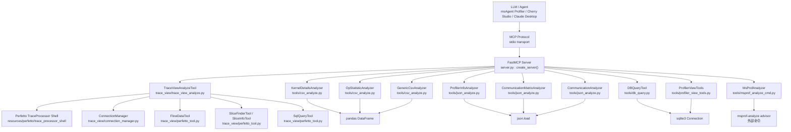
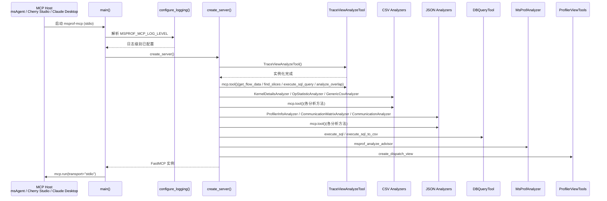
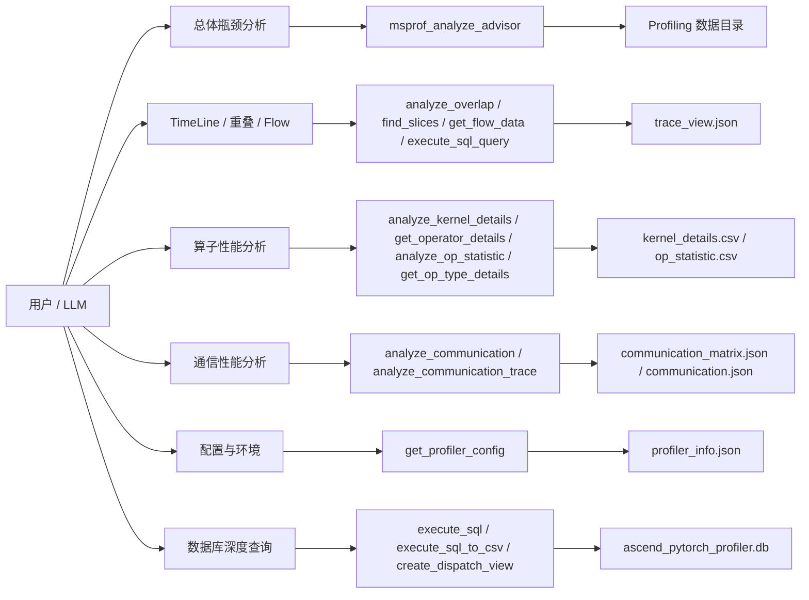
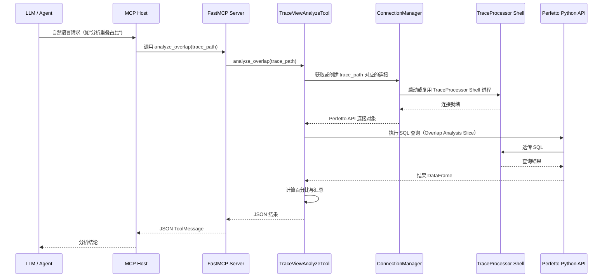
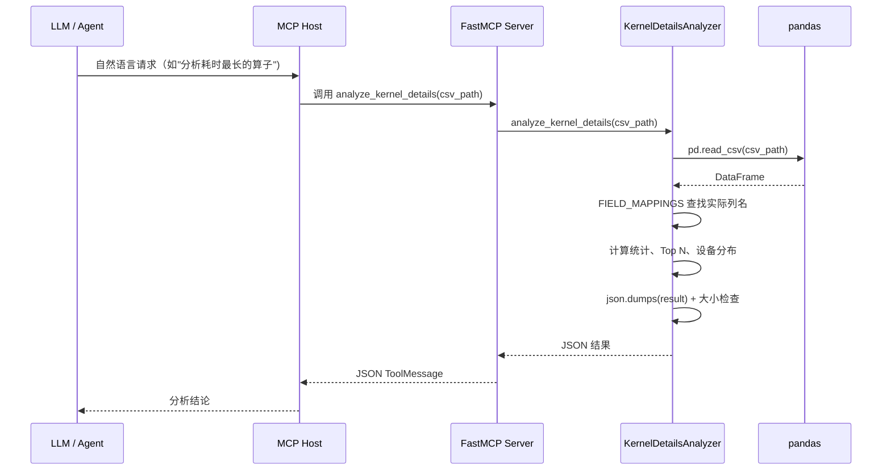
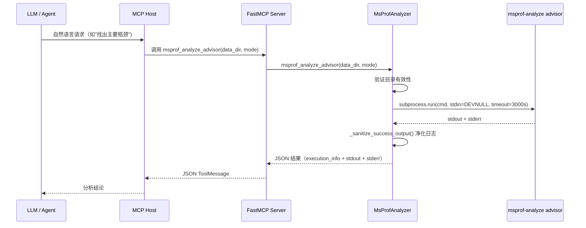

## 修订记录
| 日期 | 修订版本 | 修改描述 | 作者 | RFC文档 |
| -- | -- | -- | -- | -- |
| 2026-06-03 | 1.0 | 补充 msprof-mcp 详细设计文档，覆盖架构、工具体系、数据流与测试设计 | kali20gakki1 |  |
|  |  |  |  |  |

## 背景描述

### 1. 产品定位

`msprof-mcp` 是一个基于 Model Context Protocol (MCP) 的服务器，旨在为大语言模型 (LLM) 提供分析 Ascend PyTorch Profiler 采集性能数据的能力。它不是独立的性能分析工具，而是将以下能力整合为统一的 MCP 工具面：

- 面向 Profiling 总体分析的 `msprof-analyze advisor` 命令包装。
- 面向 TimeLine 数据（trace_view.json）的多维度分析工具，包括重叠分析、Slice 搜索、Flow 数据查询与 SQL 执行。
- 面向算子性能数据（kernel_details.csv、op_statistic.csv）的统计与明细分析。
- 面向通信性能数据（communication_matrix.json、communication.json）的瓶颈识别与带宽分析。
- 面向配置信息（profiler_info.json）的环境与参数查询。
- 面向 SQLite 数据库（ascend_pytorch_profiler.db）的只读 SQL 查询与视图创建。
- 面向大结果外置的 CSV 导出机制，防止上下文膨胀。

### 2. 业务痛点

Ascend 生态下利用 LLM 分析 Profiling 数据存在几个典型难点：

- 数据格式多样：Profiler 产出包括 JSON、CSV、SQLite DB 等多种数据载体，且不同版本间字段名存在差异。
- 分析维度分散：性能瓶颈定位涉及计算/通信/调度重叠、算子耗时分布、通信带宽利用率等多个维度，需要在多个分析入口切换。
- Trace 数据巨大：trace_view.json 文件通常达到数百 MB 甚至数 GB，直接加载到上下文不可行。
- 工具链依赖复杂：`msprof-analyze` 命令本身是外部二进制，存在超时、卡死、日志噪音等问题。
- 版本兼容性：不同 Profiler 版本产出的 CSV 字段名不同（如 `Device_id` vs `Device ID` vs `device_id`），需要灵活映射。

### 3. 核心价值

| 价值点 | 说明 |
| -- | -- |
| 统一工具面 | 通过 MCP 协议将 6 大分析维度统一暴露为工具，LLM 可以用自然语言调用。 |
| 数据载体全覆盖 | 覆盖 JSON/CSV/SQLite DB 三大类 Profiling 数据载体，不遗漏关键分析维度。 |
| 大结果治理 | 通过阈值截断、CSV 外置、JSON 大小上限等机制，防止大结果撑爆上下文。 |
| 版本兼容 | 通过 `FIELD_MAPPINGS` 灵活映射字段名，兼容不同 Profiler 版本的 CSV schema 差异。 |
| 安全只读 | SQL 查询严格只读（禁止 INSERT/UPDATE/DELETE 等），SQL 预览强制限制结果大小。 |
| 可集成性 | 通过 `uvx msprof-mcp` 或本地源码方式运行，支持 Cherry Studio / Claude Desktop / msAgent 集成。 |

### 4. 设计目标与非目标

#### 4.1 设计目标

- 支持多维度 Profiling 数据分析，覆盖总体、TimeLine、算子、通信、配置与数据库查询。
- 支持 MCP stdio 传输协议，通过 FastMCP 框架统一注册工具。
- 支持大结果外置机制，防止返回给 LLM 的 JSON 超过合理阈值。
- 支持跨版本 CSV 字段兼容，通过字段映射表适配不同 Profiler 版本产出。
- 支持 `msprof-analyze` 命令的安全封装，包括超时、日志净化和错误分类。
- 为测试、打包、PyPI 发布提供稳定边界。

#### 4.2 非目标

- 不在本设计文档中展开 Perfetto TraceProcessor Shell 的内部实现细节。
- 不把 `msprof-mcp` 设计成 GUI 产品，当前主入口仍是 MCP stdio 服务。
- 不在服务内直接承载性能分析算法本体，而是通过 `msprof-analyze` 命令和 Perfetto SQL 协同完成。
- 不支持写入性 SQL 操作，所有数据库交互严格只读。

## 方案设计

### 1. 设计原则

- **工具面统一**：所有分析能力通过 FastMCP `mcp.tool()` 注册为统一工具面，LLM 通过自然语言直接调用。
- **数据载体解耦**：不同数据载体（JSON/CSV/DB）由独立的 Analyzer 类处理，不交叉耦合。
- **结果治理优先**：所有工具返回 JSON 文本，超过阈值的结果通过 CSV 外置或 `RESULT_TOO_LARGE` 错误引导收敛。
- **版本兼容灵活**：通过 `FIELD_MAPPINGS` 字典映射不同版本 CSV 字段名，不将字段名写死在业务逻辑中。
- **安全边界清晰**：SQL 查询禁止写操作，`msprof-analyze` 命令通过 `stdin=subprocess.DEVNULL` 防止交互阻塞。

### 2. 总体架构

#### 2.1 分层架构图



#### 2.2 架构解读

整体上，`msprof-mcp` 采用"**FastMCP 统一注册、Analyzer 类分治、数据载体解耦**"的方案：

- `create_server()` 是唯一的工具注册入口，所有 Analyzer 实例化后通过 `mcp.tool()` 将方法注册为 MCP 工具。
- 每个 Analyzer 类封装一类数据载体的分析逻辑，彼此不交叉依赖。
- TraceViewAnalyzeTool 内部通过 ConnectionManager 管理 Perfetto TraceProcessor Shell 连接，支持多 Trace 文件并发分析。
- 结果大小治理策略分层：Trace 工具通过阈值计数截断、CSV/DB 工具通过 `MAX_RESULT_CHARS` 限制、DB 工具提供 `execute_sql_to_csv` 大结果外置。

### 3. 模块职责拆解

| 模块 | 代表路径 | 主要职责 | 设计要点 |
| -- | -- | -- | -- |
| 服务入口层 | `src/msprof_mcp/server.py` | 创建 FastMCP 实例、注册所有工具方法、配置日志、启动 stdio 服务 | `create_server()` 是唯一注册入口，`main()` 启动 stdio 传输。 |
| Trace 分析层 | `src/msprof_mcp/tools/trace_view/` | 分析 trace_view.json，提供重叠分析、Slice 搜索、Flow 数据查询与 SQL 执行 | 通过 ConnectionManager 管理 TraceProcessor Shell 进程，支持多文件连接复用。 |
| CSV 分析层 | `src/msprof_mcp/tools/csv_analyze.py` | 分析 kernel_details.csv、op_statistic.csv 及通用 CSV 文件 | 三个 Analyzer 类分别覆盖不同 CSV 场景，`FIELD_MAPPINGS` 处理版本兼容。 |
| JSON 分析层 | `src/msprof_mcp/tools/json_analyze.py` | 分析 profiler_info.json、communication_matrix.json、communication.json | 两个 Analyzer 类分别覆盖配置查询与通信分析。 |
| DB 查询层 | `src/msprof_mcp/tools/db_query.py` | 对 ascend_pytorch_profiler.db 执行只读 SQL，支持预览与 CSV 导出 | `_FORBIDDEN_PREFIXES` 禁止写操作，`MAX_RESULT_CHARS` 限制预览大小。 |
| msprof-analyze 层 | `src/msprof_mcp/tools/msprof_analyze_cmd.py` | 封装 `msprof-analyze advisor` 命令，净化日志输出 | `stdin=subprocess.DEVNULL` 防止交互阻塞，`_sanitize_success_output` 净化噪音日志。 |
| 视图创建层 | `src/msprof_mcp/tools/profiler_view_tools.py` | 在 profiler SQLite DB 上创建持久视图（如 dispatch_view） | 检查必需表是否存在，支持 `replace_existing` 选项。 |
| Perfetto 工具层 | `src/msprof_mcp/tools/trace_view/perfetto_tool.py` | FlowDataTool、SliceFinderTool、SliceInfoTool、SqlQueryTool 的具体实现 | 基于 Perfetto Python API 与 TraceProcessor Shell 进程交互。 |
| 连接管理层 | `src/msprof_mcp/tools/trace_view/connection_manager.py` | 管理 TraceProcessor Shell 进程的启动、连接与 glibc 兼容检测 | 自动检测 glibc 版本，选择兼容的 Shell 二进制。 |
| 日志配置层 | `src/msprof_mcp/server.py: configure_logging()` | 配置包级日志，抑制 stdio 场景下的噪音日志 | `MSPROF_MCP_LOG_LEVEL` 环境变量控制级别，默认 WARNING。 |

### 4. 服务启动与工具注册设计

#### 4.1 启动时序图



#### 4.2 工具注册全景

`create_server()` 注册的全部 MCP 工具如下：

| 工具名称 | 注册来源 | 数据载体 | 核心能力 |
| -- | -- | -- | -- |
| `get_flow_data` | TraceViewAnalyzeTool | trace_view.json | 按 Flow 关联 CPU/NPU 算子明细查询 |
| `find_slices` | TraceViewAnalyzeTool | trace_view.json | 搜索 Trace 中的特定 Slice |
| `execute_sql_query` | TraceViewAnalyzeTool | trace_view.json | 执行 PerfettoSQL 自定义查询 |
| `analyze_overlap` | TraceViewAnalyzeTool | trace_view.json | 分析计算/通信/调度重叠占比 |
| `analyze_kernel_details` | KernelDetailsAnalyzer | kernel_details.csv | 算子耗时分布、Top N、设备分布 |
| `get_operator_details` | KernelDetailsAnalyzer | kernel_details.csv | 查询特定算子执行明细 |
| `analyze_op_statistic` | OpStatisticAnalyzer | op_statistic.csv | 算子调用次数、总耗时、Core 类型分布 |
| `get_op_type_details` | OpStatisticAnalyzer | op_statistic.csv | 查询特定类型/Core 类型算子统计 |
| `get_csv_info` | GenericCsvAnalyzer | 任意 CSV | 通用 CSV 结构探索与样本数据 |
| `search_csv_by_field` | GenericCsvAnalyzer | 任意 CSV | 通用 CSV 字段搜索与过滤 |
| `get_profiler_config` | ProfilerInfoAnalyzer | profiler_info.json | 获取 Profiler 配置与环境信息 |
| `analyze_communication` | CommunicationMatrixAnalyzer | communication_matrix.json | P2P/集合通信瓶颈与带宽分析 |
| `analyze_communication_trace` | CommunicationAnalyzer | communication.json | 通信操作时间分解与带宽详情 |
| `execute_sql` | DBQueryTool | ascend_pytorch_profiler.db | 只读 SQL 预览查询 |
| `execute_sql_to_csv` | DBQueryTool | ascend_pytorch_profiler.db | 只读 SQL + CSV 外置导出 |
| `msprof_analyze_advisor` | MsProfAnalyzer | Profiling 数据目录 | msprof-analyze 总体分析命令封装 |
| `create_dispatch_view` | ProfilerViewTools | ascend_pytorch_profiler.db | 创建 dispatch 持久视图 |

### 5. 工具体系设计

#### 5.1 工具分层与能力面



#### 5.2 数据载体与工具映射

| 数据载体 | 对应工具 | 分析维度 |
| -- | -- | -- |
| Profiling 数据目录 | `msprof_analyze_advisor` | 总体瓶颈（计算/调度） |
| trace_view.json | `analyze_overlap`、`find_slices`、`get_flow_data`、`execute_sql_query` | 重叠分析、Slice 搜索、Flow 关联、自定义 SQL |
| kernel_details.csv | `analyze_kernel_details`、`get_operator_details` | Top N 耗时、算子明细、设备分布 |
| op_statistic.csv | `analyze_op_statistic`、`get_op_type_details` | 调用次数、总耗时、Core 类型分布 |
| 任意 CSV | `get_csv_info`、`search_csv_by_field` | 结构探索、字段搜索 |
| profiler_info.json | `get_profiler_config` | 配置参数、环境信息 |
| communication_matrix.json | `analyze_communication` | P2P/集合通信瓶颈 |
| communication.json | `analyze_communication_trace` | 时间分解、带宽详情 |
| ascend_pytorch_profiler.db | `execute_sql`、`execute_sql_to_csv`、`create_dispatch_view` | 只读 SQL、大结果外置、视图创建 |

#### 5.3 Trace 分析工具详细设计

TraceViewAnalyzeTool 是最复杂的分析工具集，内部由四个子工具组成：

| 子工具 | 职责 | 关键设计点 |
| -- | -- | -- |
| FlowDataTool | 按 Flow 关联查询 CPU/NPU 算子明细 | 结果超过 `MAX_FLOW_DATA_RESULT_COUNT`（100 条）时引导 CSV 外置；支持 `cpu_op` 和 `npu_op` 两种入口查询。 |
| SliceFinderTool | 搜索 Trace 中的特定 Slice | 支持 `contains`、`exact`、`glob` 三种匹配模式；支持 process_name 过滤、main_thread_only 和 time_range。 |
| SliceInfoTool | 获取特定 Slice 的详细信息 | 辅助 SliceFinderTool 提供聚合统计（min/avg/max/p50/p90/p99）。 |
| SqlQueryTool | 执行 PerfettoSQL 自定义查询 | 透传 SQL 给 TraceProcessor Shell，支持 Perfetto 标准库模块加载。 |

ConnectionManager 负责 TraceProcessor Shell 进程管理：

- 自动检测系统 glibc 版本，选择兼容的二进制（musl/glibc）。
- 支持 trace_path 到连接的映射复用，同一 Trace 文件共享同一 Shell 进程。
- Shell 二进制位于 `resources/perfetto/` 目录，打包时排除（由 `hatch_build.py` 的自定义 Hook 处理下载）。

#### 5.4 msprof-analyze 命令封装设计

MsProfAnalyzer 对 `msprof-analyze advisor` 命令的封装重点解决以下问题：

| 问题 | 解决方案 |
| -- | -- |
| 命令卡死（Windows 下 stdin 等待输入） | `stdin=subprocess.DEVNULL`，防止交互阻塞 |
| 执行超时 | `timeout=TIMEOUT_SECONDS`（3000 秒） |
| stderr 日志噪音 | `_sanitize_success_output()` 过滤 INFO 级日志和进度行，保留警告与错误 |
| JSON 结果提取 | `_extract_json_message()` 从 stderr 中识别并提取 JSON 格式输出 |
| 命令不存在 | `FileNotFoundError` 异常捕获，返回 `COMMAND_NOT_FOUND` 错误与排障建议 |

#### 5.5 CSV 分析工具版本兼容设计

KernelDetailsAnalyzer 和 OpStatisticAnalyzer 通过 `FIELD_MAPPINGS` 字典处理不同 Profiler 版本的字段名差异：

```python
FIELD_MAPPINGS = {
    'device_id': ['Device_id', 'Device ID', 'device_id', 'DeviceId'],
    'duration': ['Duration(us)', 'Duration (us)', 'duration', 'Duration'],
    ...
}
```

- `_find_column()` 按 FIELD_MAPPINGS 中定义的优先级顺序查找实际列名。
- `_safe_get_column()` 安全获取列，找不到时返回 None 而非抛异常。
- 分析结果中包含 `available_fields` 和 `missing_fields`，让 LLM 了解当前 CSV 文件的实际可用字段。

#### 5.6 大结果治理策略

| 工具类型 | 治理策略 | 阈值 |
| -- | -- | -- |
| CSV 分析（csv_analyze.py） | JSON 序列化后超过 `MAX_RESULT_CHARS` 返回 `RESULT_TOO_LARGE` | 100,000 字符 |
| DB 查询（db_query.py） | 同上，额外提供 `execute_sql_to_csv` 大结果外置 | 100,000 字符 |
| Trace Flow 数据 | 硬件记录超过 `MAX_FLOW_DATA_RESULT_COUNT` 时引导 CSV 外置 | 100 条硬件记录 |
| Trace SQL 查询 | 透传给 TraceProcessor Shell，由调用方自行控制 | 无自动限制 |
| msprof-analyze | 命令超时 3000 秒 | 3000 秒 |

### 6. 配置与集成设计

#### 6.1 日志配置

`configure_logging()` 的设计目标是适配 stdio 传输场景，避免日志噪音影响 MCP 通信：

- 默认日志级别 `WARNING`，通过 `MSPROF_MCP_LOG_LEVEL` 环境变量可调整（DEBUG/INFO/WARNING/ERROR）。
- 包级 logger `msprof_mcp` 独立配置，`propagate=False` 防止向上层 root logger 传播。
- `QUIET_LOGGER_NAMES`（如 `mcp.server.lowlevel.server`）强制提升到至少 WARNING，抑制 stdio 场景下的请求级 INFO 日志。

#### 6.2 MCP 集成配置

msprof-mcp 支持两种集成方式：

**PyPI 方式（推荐）**：
```json
{
  "mcpServers": {
    "msprof-mcp": {
      "command": "uvx",
      "args": ["msprof-mcp"],
      "type": "stdio"
    }
  }
}
```

**本地源码方式（开发调试）**：
```json
{
  "mcpServers": {
    "msprof-mcp-local": {
      "command": "uv",
      "args": ["run", "msprof-mcp"],
      "cwd": "/absolute/path/to/msprof_mcp",
      "type": "stdio"
    }
  }
}
```

在 msAgent 中，默认 MCP 配置如下：
```json
{
  "mcpServers": {
    "msprof-mcp": {
      "command": "msprof-mcp",
      "args": [],
      "transport": "stdio",
      "enabled": true,
      "stateful": true,
      "invoke_timeout": 3600.0
    }
  }
}
```

#### 6.3 项目配置与打包

| 配置项 | 值 | 说明 |
| -- | -- | -- |
| 项目名 | `msprof-mcp` | PyPI 包名 |
| 版本 | `0.1.6` | pyproject.toml 定义 |
| Python 依赖 | `mcp[cli]>=1.26.0`、`perfetto>=0.16.0`、`pandas>=2.0.0` | 核心运行依赖 |
| 构建系统 | `hatchling` | 通过 `hatch_build.py` 自定义 Hook 处理 TraceProcessor Shell 下载 |
| 入口点 | `msprof-mcp = msprof_mcp.server:main` | CLI 入口 |
| 打包排除 | `trace_processor_shell-*`、`trace_processor_shell.metadata.json` | Shell 二进制不打包进 wheel，由 Hook 下载 |
| Python 版本 | `>=3.10` | 最低兼容版本 |

#### 6.4 发布流程

发布流程遵循 RELEASE.md 定义：

1. 修改 `pyproject.toml` 版本号。
2. 本地自检：`python scripts/download_trace_processor_shell.py --all --clean && uv build`。
3. 提交版本修改并推送。
4. 创建并推送 Git tag（格式 `v{version}`，如 `v0.1.6`）。
5. GitHub Actions 自动构建多平台 wheel（Linux x86_64/arm64、Windows amd64、macOS x86_64/arm64）。
6. 自动创建 GitHub Release 并上传构建产物。
7. 若启用 PyPI 发布（Trusted Publisher + OIDC），自动上传到 PyPI。

### 7. 数据流与交互设计

#### 7.1 Trace 分析请求时序图



#### 7.2 CSV 分析请求时序图



#### 7.3 msprof-analyze 命令执行时序图



### 8. 安全与可靠性设计

#### 8.1 安全设计

- **SQL 只读**：`DBQueryTool._FORBIDDEN_PREFIXES` 禁止 INSERT/UPDATE/DELETE/CREATE/DROP/ALTER/TRUNCATE/ATTACH/DETACH/PRAGMA/REINDEX/VACUUM，仅允许 SELECT 查询。
- **命令隔离**：`msprof-analyze` 通过 `stdin=subprocess.DEVNULL` 防止交互阻塞，`timeout` 防止无限挂起。
- **日志净化**：`_sanitize_success_output()` 过滤 INFO 级日志和进度行，防止噪音输出影响 LLM 判断。
- **路径校验**：所有工具在执行前校验文件/目录路径有效性，不存在时返回 `FILE_NOT_FOUND` / `DIRECTORY_NOT_FOUND`。

#### 8.2 可靠性设计

- **超时保护**：`msprof-analyze` 命令 3000 秒超时；TraceProcessor Shell 连接通过 ConnectionManager 管理。
- **大结果截断**：所有 JSON 返回超过阈值时返回 `RESULT_TOO_LARGE` 错误并引导收敛，不会撑爆上下文。
- **CSV 外置**：`execute_sql_to_csv` 和 `get_flow_data(result_output_path)` 提供大结果导出为 CSV 的能力，只返回元数据。
- **错误分类**：所有工具统一使用结构化 JSON 错误（`error` + `message`），便于 LLM 区分处理。
- **版本兼容**：CSV 工具通过 `FIELD_MAPPINGS` 适配不同 Profiler 版本，不会因字段名差异崩溃。
- **glibc 兼容**：ConnectionManager 自动检测 glibc 版本，选择 musl 或 glibc 版本的 TraceProcessor Shell。

#### 8.3 错误分类体系

| 错误码 | 触发场景 | 影响范围 |
| -- | -- | -- |
| `FILE_NOT_FOUND` | 文件路径不存在 | CSV/JSON/DB/Trace 工具 |
| `DIRECTORY_NOT_FOUND` | 目录不存在 | msprof_analyze_advisor |
| `NOT_A_DIRECTORY` | 路径不是目录 | msprof_analyze_advisor |
| `EMPTY_FILE` | CSV 文件为空 | CSV 工具 |
| `INVALID_JSON` | JSON 解析失败 | JSON 工具 |
| `INVALID_PARAMETER` | 参数校验失败 | DB/CSV/Trace/msprof-analyze 工具 |
| `WRITE_OPERATION_BLOCKED` | SQL 包含写操作 | DB 工具 |
| `RESULT_TOO_LARGE` | 返回 JSON 超过阈值 | CSV/DB/Trace Flow 工具 |
| `COMMAND_NOT_FOUND` | msprof-analyze 未安装 | msprof_analyze_advisor |
| `EXECUTION_TIMEOUT` | msprof-analyze 超时 | msprof_analyze_advisor |
| `EXECUTION_FAILED` | msprof-analyze 执行失败 | msprof_analyze_advisor |
| `SQL_EXECUTION_FAILED` | SQLite 查询失败 | DB/视图工具 |
| `MISSING_REQUIRED_TABLES` | DB 缺少必需表 | 视图工具 |
| `ANALYSIS_FAILED` | 分析过程异常 | 所有工具 |

### 9. 交互与使用设计

#### 9.1 快速开始

**方式一：PyPI 直接运行**
```bash
uvx msprof-mcp
```

**方式二：本地开发运行**
```bash
git clone <repository_url>
cd msprof_mcp
uv run msprof-mcp
```

#### 9.2 集成到 MCP Host

msprof-mcp 通过 stdio 传输协议与 MCP Host 通信，典型集成场景包括：

- msAgent Profiler Agent：通过 `.msagent/config.mcp.json` 配置，Profiler 默认启用 `mcp:msprof-mcp:*` Tool Pattern。
- Cherry Studio / Claude Desktop：通过 MCP 配置 JSON 添加服务。
- 其他 MCP 客户端：只要支持 stdio 传输即可接入。

#### 9.3 典型使用路径

| 使用路径 | 触发工具 | 示例 |
| -- | -- | -- |
| 总体瓶颈分析 | `msprof_analyze_advisor` | "分析 /path/to/data 目录下的性能数据，找出主要瓶颈" |
| 重叠占比分析 | `analyze_overlap` | "分析 /path/to/trace_view.json 的计算和通信重叠情况" |
| 算子耗时分析 | `analyze_kernel_details` | "分析 /path/to/kernel_details.csv，列出耗时最长的 10 个算子" |
| 通信瓶颈识别 | `analyze_communication` | "分析 /path/to/communication_matrix.json，找出带宽利用率低的链路" |
| 深度 SQL 查询 | `execute_sql` | "对 /path/to/db 执行 SQL：SELECT name, SUM(total_time) FROM COMPUTE_TASK_INFO GROUP BY name LIMIT 20" |
| Flow 数据查询 | `get_flow_data` | "获取 /path/to/trace_view.json 中 1000000000 到 2000000000 时间范围的 NPU 算子关联 Flow 数据" |

### 10. 目录结构设计

```text
msprof_mcp/
├── pyproject.toml                    # 项目配置与依赖声明
├── hatch_build.py                    # 打包自定义 Hook（TraceProcessor Shell 下载）
├── RELEASE.md                        # 发版流程文档
├── scripts/
│   └── download_trace_processor_shell.py  # TraceProcessor Shell 下载脚本
├── src/msprof_mcp/
│   ├── __init__.py                   # 包初始化
│   ├── server.py                     # FastMCP 服务入口与工具注册
│   ├── resources/
│   │   └── perfetto/
│   │       ├── trace_processor_shell-*    # Perfetto Shell 二进制（多平台）
│   │       └── trace_processor_shell.metadata.json  # Shell 元数据
│   └── tools/
│       ├── __init__.py
│       ├── csv_analyze.py            # KernelDetails / OpStatistic / GenericCsv 分析器
│       ├── json_analyze.py           # ProfilerInfo / CommunicationMatrix / Communication 分析器
│       ├── db_query.py               # SQLite 只读查询与 CSV 导出
│       ├── msprof_analyze_cmd.py     # msprof-analyze advisor 命令封装
│       ├── profiler_view_tools.py    # dispatch_view 等持久视图创建
│       └── trace_view/
│           ├── __init__.py
│           ├── connection_manager.py # TraceProcessor Shell 连接管理
│           ├── perfetto_tool.py      # FlowData / SliceFinder / SliceInfo / SqlQuery 工具
│           ├── query_helpers.py      # SQL 查询辅助
│           ├── trace_processor_shell.py  # Shell 进程管理
│           └── trace_view_analyze.py # TraceViewAnalyzeTool 入口
├── tests/
│   ├── test_csv_analyze.py
│   ├── test_db_query.py
│   ├── test_json_analyze.py
│   ├── test_msprof_analyze_cmd.py
│   ├── test_profiler_view_tools.py
│   ├── test_server.py
│   └── test_trace_view_analyze.py
├── .github/
│   └── workflows/
│       ├── build-wheels.yml          # 多平台 wheel 构建
│       └── publish-release.yml       # 自动发版与 PyPI 发布
├── .gitignore
├── .python-version                   # Python 版本锁定
└── uv.lock                           # uv 依赖锁定
```

## 测试设计

### 1. 测试目标

`msprof-mcp` 的测试设计围绕以下风险面建立可回归保障：

- CSV 分析的版本兼容性是否稳定（不同字段名能否正确映射）。
- DB 查询的安全边界是否正确（写操作是否被拦截）。
- JSON 分析的解析能力是否覆盖不同数据格式。
- msprof-analyze 命令封装的超时、日志净化和错误分类是否有效。
- Trace 工具的连接管理、SQL 查询与大结果截断是否正确。
- 视图创建的必需表校验与替换逻辑是否稳定。
- 服务注册的完整性是否可验证。

### 2. 测试分层策略

| 层级 | 目标 | 代表对象 | 典型测试文件 |
| -- | -- | -- | -- |
| 单元测试 | 验证纯逻辑、字段映射、SQL 校验、JSON 解析、错误分类 | FIELD_MAPPINGS、DBQueryTool、MsProfAnalyzer、ProfilerViewTools | `test_csv_analyze.py`、`test_db_query.py`、`test_json_analyze.py`、`test_msprof_analyze_cmd.py`、`test_profiler_view_tools.py` |
| 集成测试 | 验证服务注册完整性、工具面覆盖 | `create_server()` 工具注册 | `test_server.py` |
| Trace 工具测试 | 验证 TraceProcessor 连接、SQL 执行与结果截断 | TraceViewAnalyzeTool、ConnectionManager | `test_trace_view_analyze.py` |

### 3. 核心测试对象与用例设计

#### 3.1 CSV 分析测试

**目标**：保证字段映射、统计分析、大结果截断和错误分类正确。

覆盖的核心用例：

- 不同版本 CSV 字段名（如 `Device_id` vs `Device ID` vs `device_id`）能否正确映射。
- `analyze_kernel_details` 返回正确的 Top N、设备分布和动态/静态算子比。
- `get_operator_details` 按名称或类型过滤时返回正确明细。
- `analyze_op_statistic` 返回正确的 Core 类型分布和算子类型统计。
- `get_csv_info` 对未知 CSV 文件返回正确的结构信息。
- `search_csv_by_field` 的四种匹配模式（exact/contains/starts_with/ends_with）正确。
- JSON 结果超过 `MAX_RESULT_CHARS` 时返回 `RESULT_TOO_LARGE`。
- 文件不存在、文件为空等异常场景返回正确错误码。

现有代表测试：`test_csv_analyze.py`

#### 3.2 DB 查询测试

**目标**：保证只读 SQL 边界、大结果截断和 CSV 导出正确。

覆盖的核心用例：

- `_FORBIDDEN_PREFIXES` 正确拦截 INSERT/UPDATE/DELETE/CREATE/DROP 等写操作。
- `execute_sql_preview` 返回正确 JSON 预览。
- JSON 结果超过 `MAX_RESULT_CHARS` 时返回 `RESULT_TOO_LARGE`。
- `execute_sql_to_csv` 正确导出 CSV 并返回元数据（路径、行数）。
- DB 文件不存在、路径不是文件等异常返回正确错误码。
- SQL 为空字符串时返回 `INVALID_PARAMETER`。

现有代表测试：`test_db_query.py`

#### 3.3 JSON 分析测试

**目标**：保证 JSON 解析、配置提取和通信统计正确。

覆盖的核心用例：

- `get_profiler_config` 正确提取 general_config、scheduling、experimental_config、runtime_info。
- `analyze_communication` 正确识别集合通信类型、统计带宽、发现慢链路。
- `analyze_communication_trace` 正确分解时间（Transit/Wait/Sync/Idle）和统计带宽。
- JSON 文件不存在、JSON 格式无效等异常返回正确错误码。

现有代表测试：`test_json_analyze.py`

#### 3.4 msprof-analyze 命令封装测试

**目标**：保证命令封装的超时、日志净化和错误分类正确。

覆盖的核心用例：

- `_sanitize_success_output()` 正确过滤 INFO 日志和进度行，保留警告与错误。
- `_extract_json_message()` 正确识别 stderr 中的 JSON 输出。
- 命令超时返回 `EXECUTION_TIMEOUT`。
- 命令不存在返回 `COMMAND_NOT_FOUND`。
- 目录不存在返回 `DIRECTORY_NOT_FOUND`。
- 目录参数为空返回 `INVALID_PARAMETER`。

现有代表测试：`test_msprof_analyze_cmd.py`

#### 3.5 视图创建测试

**目标**：保证持久视图创建的必需表校验、替换逻辑和 SQL 正确。

覆盖的核心用例：

- `create_dispatch_view` 在必需表齐全时正确创建视图。
- 缺少必需表时返回 `MISSING_REQUIRED_TABLES`。
- 视图已存在且 `replace_existing=false` 时返回 `exists` 状态。
- 视图已存在且 `replace_existing=true` 时正确替换。
- DB 文件不存在时返回 `DB_FILE_NOT_FOUND`。

现有代表测试：`test_profiler_view_tools.py`

#### 3.6 服务注册测试

**目标**：保证 `create_server()` 注册的工具面完整且可调用。

覆盖的核心用例：

- 所有预期工具名称在 FastMCP 工具列表中存在。
- 工具方法签名与文档描述一致。

现有代表测试：`test_server.py`

#### 3.7 Trace 分析测试

**目标**：保证 TraceProcessor 连接、SQL 查询和结果截断正确。

覆盖的核心用例：

- ConnectionManager 正确管理 Shell 进程。
- `get_flow_data` 按时间范围返回正确的 Flow 关联数据。
- `find_slices` 的三种匹配模式正确。
- `execute_sql_query` 正确透传 SQL 给 TraceProcessor。
- `analyze_overlap` 正确计算重叠占比。
- 结果超过阈值时返回 `RESULT_TOO_LARGE`。

现有代表测试：`test_trace_view_analyze.py`

### 4. 测试替身设计

- 临时 CSV/JSON/DB 文件：通过 `tmp_path` 创建测试数据，隔离真实 Profiling 数据。
- `monkeypatch` / `AsyncMock`：替代 `msprof-analyze` 命令、TraceProcessor Shell 进程等外部依赖。
- 小规模测试数据：构造包含少量行的 CSV/JSON/DB 文件，避免大文件影响测试速度。

## 附录

### 1. 参考资料

- msprof-mcp 仓库: [https://gitcode.com/kali20gakki1/msprof_mcp](https://gitcode.com/kali20gakki1/msprof_mcp)
- MCP 官方文档: [https://modelcontextprotocol.io/docs/getting-started/intro](https://modelcontextprotocol.io/docs/getting-started/intro)
- Perfetto 官方文档: [https://perfetto.dev/docs/](https://perfetto.dev/docs/)
- PerfettoSQL 语法: [https://perfetto.dev/docs/analysis/perfetto-sql-syntax](https://perfetto.dev/docs/analysis/perfetto-sql-syntax)
- msAgent 设计文档: [docs/zh/design/msagent_design.md](msagent_design.md)

### 2. 术语说明

| 术语 | 说明 |
| -- | -- |
| MCP | Model Context Protocol，用于把外部工具/资源统一纳入 Agent 能力面的协议。 |
| FastMCP | MCP SDK 的 Python 高层封装，通过装饰器式 API 注册工具。 |
| TraceProcessor Shell | Perfetto 提供的命令行 SQL 查询引擎，用于分析 Chrome Trace Event 格式数据。 |
| FIELD_MAPPINGS | CSV 工具中的字段名映射字典，用于适配不同 Profiler 版本的字段名差异。 |
| stdio transport | MCP 的标准输入输出传输方式，服务通过 stdin/stdout 与 Host 通信。 |
| dispatch_view | 在 profiler SQLite DB 上创建的持久视图，关联 TASK/CANN_API/PYTORCH_API 等表。 |
| Flow | Trace 数据中关联 CPU 算子和 NPU 算子的事件链。 |
| Slice | Trace 数据中的时间切片，代表一个算子/函数的执行区间。 |
