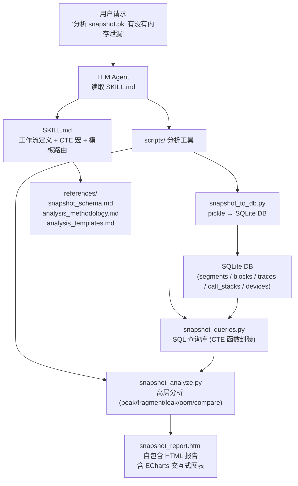
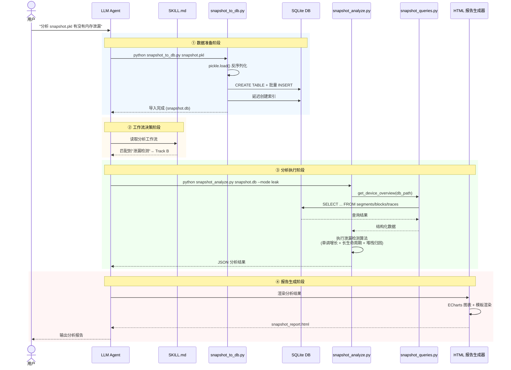
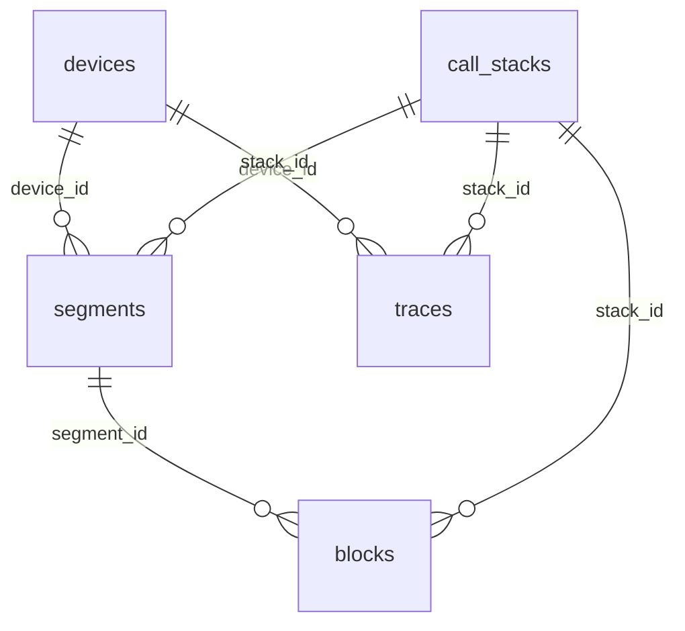

# NPU平台内存快照分析设计文档

## 修订记录

| 日期 | 修订版本 | 修改描述 | 作者 | RFC文档 |
| -- | -- | -- | -- | -- |
| 2026-06-11 | 1.0 | 初始版本，覆盖 ASCEND NPU Memory Snapshot 分析 Agent 的架构、DB 设计、分析能力、可视化方案与测试设计 | @msagent | npu_snapshot_analysis.md |
|  |  |  |  |  |

## 背景描述

### 1. 产品定位

`ascend-npu-snapshot-analyzer` 是一个面向 Ascend NPU 的 PyTorch Memory Snapshot 分析 Agent Skill，旨在为 LLM 提供对 `torch_npu.npu.memory._dump_snapshot()` 导出的内存快照数据进行自动化分析的能力。其核心工作流为：

1. 将 pickle 格式的 snapshot 数据解析并转换为 SQLite 数据库，以支持高效查询
2. 通过预置的 SQL CTE 宏和分析脚本，对内存快照进行多维度分析
3. 生成包含交互式图表的自包含 HTML 报告，直观呈现分析结果

本 Skill 不是独立的 GUI 产品，而是通过 Agent 工作流编排，由 LLM 读取 SKILL.md 中的工作流定义，按需调用 `scripts/` 下的 Python 工具完成分析任务。

### 2. 业务痛点

Ascend NPU 场景下的内存问题定位存在以下难点：

- **数据格式原始**：`torch_npu.npu.memory._dump_snapshot()` 导出的 pickle 文件为二进制序列化格式，包含嵌套的 Segment/Block/Trace 结构，无法直接查询或分析，必须借助脚本解析。
- **缺乏自动化对比能力**：PyTorch 官方 memory_viz 工具仅支持 CUDA 后端的单份快照交互式浏览，不支持 NPU 后端，也不支持快照间自动对比。
- **分析维度分散**：内存问题定位涉及峰值分析、碎片计算、扩容统计、泄漏检测、OOM 根因等多个维度，缺乏统一的自动化分析工具链。
- **无 NPU 专用工具**：华为昇腾生态中尚无针对 NPU Memory Snapshot 的专用分析工具，用户只能依赖手工编写分析脚本。
- **可视化缺失**：内存碎片、时序变化、堆栈归因等分析结果若仅以文本或表格呈现，难以直观理解，缺乏图形化展示能力。

### 3. 核心价值

| 价值点 | 说明 |
| -- | -- |
| NPU 原生支持 | 针对 `torch_npu` 的 snapshot 格式设计，兼容 CUDA snapshot 格式 |
| 一键分析 | pickle → SQLite DB → 分析报告，全流程自动化 |
| 多维度分析 | 覆盖峰值、碎片、扩容、泄漏、OOM 五大分析场景 |
| 交互式可视化 | 自包含 HTML 报告，含折线图、柱状图、内存布局图、堆栈归因图 |
| 跨快照对比 | 支持 ATTACH DATABASE 机制对比两份快照的差异 |
| Agent 可集成 | 通过 SKILL.md + scripts 的标准模式，LLM 可直接调用 |

### 4. 设计目标与非目标

#### 4.1 设计目标

- 支持 `torch_npu.npu.memory._dump_snapshot()` 导出格式（dict 格式）和 `_snapshot()` 导出格式（list 格式）的解析
- 将 pickle 数据转换为 SQLite DB，支持高效查询和跨快照对比
- 提供总体概览、峰值分析、碎片分析、泄漏检测、OOM 分析五种分析模式
- 支持跨快照对比模式（ATTACH DATABASE）
- 生成自包含 HTML 报告，含交互式图表（ECharts）
- 通过 SKILL.md 定义 CTE 宏（Track A）和分析脚本调用（Track B），实现 Agent 可驱动的工作流

#### 4.2 非目标

- 不实现实时采集功能（仅支持离线 pickle 文件）
- 不实现 CUDA 特有的硬件细节分析（如 CUDA stream 调度）
- 不实现 device_traces 的 GPU 侧执行时序分析（Phase 1 仅解析 traces 表，不做执行时间线关联）
- 不实现 Web 服务或 API 接口（纯 CLI + HTML 报告）
- 不实现多进程/分布式训练的内存协调分析

## 方案设计

### 1. 设计原则

- **数据转换优先**：pickle 作为原始格式不利于查询，先转换为 SQLite DB 再分析，遵循"一次转换、多次查询"原则。
- **SQL 与脚本分层**：简单查询用 CTE 宏（LLM 直接拼 SQL），复杂分析用 Python 脚本封装（峰值时序重建、泄漏检测算法等）。
- **分析与展示解耦**：分析逻辑输出结构化 JSON 数据，报告生成独立将 JSON 渲染为 HTML 图表。
- **一个 pickle 一个 DB**：以 pickle 文件名（仅换后缀）作为 DB 文件名，避免多文件数据混杂，跨快照对比通过 ATTACH DATABASE 实现。
- **延迟索引创建**：先建表 → 插入数据 → 最后建索引，将 1GB 文件的导入速度提升 10 倍以上。

### 2. 总体架构

#### 2.1 分层架构图



#### 2.2 数据流



#### 2.3 文件目录结构

```text
skills/ascend-npu-snapshot-analyzer/
├── SKILL.md                          # 主技能定义（工作流 + CTE 宏 + 输出规范）
├── scripts/
│   ├── snapshot_to_db.py             # pickle → SQLite 转换工具
│   ├── snapshot_queries.py           # SQL 查询库（CTE 函数封装）
│   └── snapshot_analyze.py           # 高层分析（peak/fragment/leak/oom/compare）
├── references/
│   ├── snapshot_schema.md            # Snapshot 数据格式参考（Segment/Block/TraceEntry 字段定义）
│   ├── analysis_methodology.md       # 分析方法论（检测算法、判定规则、阈值定义）
│   └── analysis_templates.md         # 典型分析套路（模板触发条件、决策树、输出字段清单）
└── tests/
    ├── test_snapshot_to_db.py        # 转换工具单元测试
    └── test_snapshot_analyze.py      # 分析逻辑单元测试
```

### 3. DB Schema 设计

#### 3.1 设计原则

- 一个 pickle 文件对应一个 SQLite DB 文件，文件名 = pickle 文件名（仅换后缀 `.db`）
- 引入 `call_stacks` 去重表，相同堆栈只存一份，节省存储空间
- 索引延迟创建，先插入全部数据后统一建索引

#### 3.2 ER 图



#### 3.3 表结构定义

**devices（设备表）**

| 字段 | 类型 | 约束 | 说明 |
| -- | -- | -- | -- |
| `id` | INTEGER | PK, AUTOINCREMENT | 主键 |
| `device_index` | INTEGER | UNIQUE, NOT NULL | NPU 设备编号，对应 snapshot 中的 device 值 |
| `device_type` | TEXT | DEFAULT 'Ascend-NPU' | 设备类型标识 |

**call_stacks（调用栈字典表）**

| 字段 | 类型 | 约束 | 说明 |
| -- | -- | -- | -- |
| `id` | INTEGER | PK, AUTOINCREMENT | 主键 |
| `stack_hash` | TEXT | UNIQUE | 堆栈帧列表的 MD5 哈希，用于去重 |
| `frames_json` | TEXT | - | JSON 数组格式的完整堆栈帧列表 |

**segments（内存段表）**

| 字段 | 类型 | 约束 | 说明 |
| -- | -- | -- | -- |
| `id` | INTEGER | PK, AUTOINCREMENT | 主键 |
| `device_id` | INTEGER | NOT NULL, FK→devices | 所属设备 |
| `address` | INTEGER | - | Segment 起始虚拟地址 |
| `total_size` | INTEGER | - | aclrtMalloc 分配的段总大小 (Reserved) |
| `allocated_size` | INTEGER | - | 已分配使用的内存大小 |
| `active_size` | INTEGER | - | 正在使用或等待释放的内存大小 |
| `requested_size` | INTEGER | - | 用户请求的内存大小 |
| `stream` | INTEGER | - | 关联的 NPU stream |
| `segment_type` | TEXT | - | 段类型：`large` (>1MB) 或 `small` |
| `pool_id_0` | INTEGER | - | segment_pool_id 元组第 1 元素 |
| `pool_id_1` | INTEGER | - | segment_pool_id 元组第 2 元素 |
| `is_expandable` | INTEGER | - | 是否可扩容 (0/1) |
| `stack_id` | INTEGER | FK→call_stacks | 分配时的堆栈引用 |

**blocks（内存块表）**

| 字段 | 类型 | 约束 | 说明 |
| -- | -- | -- | -- |
| `id` | INTEGER | PK, AUTOINCREMENT | 主键 |
| `segment_id` | INTEGER | NOT NULL, FK→segments, CASCADE | 所属 segment |
| `address` | INTEGER | - | Block 起始地址 |
| `size` | INTEGER | - | 实际占用大小（含对齐） |
| `requested_size` | INTEGER | - | malloc 请求大小（可能小于 size） |
| `state` | TEXT | - | 状态：`active_allocated` / `active_pending_free` / `inactive` |
| `stack_id` | INTEGER | FK→call_stacks | 分配时的堆栈引用 |

**traces（时序事件表）**

| 字段 | 类型 | 约束 | 说明 |
| -- | -- | -- | -- |
| `id` | INTEGER | PK, AUTOINCREMENT | 主键 |
| `device_id` | INTEGER | NOT NULL, FK→devices | 所属设备 |
| `trace_index` | INTEGER | - | 设备内事件序号，用于还原时序 |
| `action` | TEXT | - | 事件类型：`alloc` / `free_requested` / `free_completed` / `segment_alloc` / `segment_free` / `segment_map` / `segment_unmap` / `snapshot` / `oom` |
| `addr` | INTEGER | - | 关联内存地址（OOM 时为 NULL） |
| `device_free` | INTEGER | - | 仅 OOM 事件存在，OOM 时可用内存 |
| `size` | INTEGER | - | 操作的内存大小 |
| `stream` | INTEGER | - | 关联的 NPU stream |
| `stack_id` | INTEGER | FK→call_stacks | 事件关联的堆栈引用 |

#### 3.4 索引策略

索引在数据导入完成后统一创建，避免插入时实时维护索引带来的性能开销。

| 索引名 | 表 | 字段 | 用途 |
| -- | -- | -- | -- |
| `idx_blocks_state` | blocks | `state` | 全局碎片率计算 |
| `idx_blocks_stack` | blocks | `stack_id` | 堆栈归因查询 |
| `idx_blocks_segment` | blocks | `segment_id` | segment 关联查询 |
| `idx_blocks_segment_state` | blocks | `segment_id, state` | 按 segment 分析碎片 |
| `idx_traces_stack` | traces | `stack_id` | 堆栈归因查询 |
| `idx_traces_device_action` | traces | `device_id, action` | OOM 事件快速定位 |
| `idx_traces_device_index` | traces | `device_id, trace_index` | 时序范围遍历 |
| `idx_segments_stack` | segments | `stack_id` | 堆栈归因查询 |
| `idx_segments_device` | segments | `device_id` | 设备过滤 |
| `idx_segments_device_type` | segments | `device_id, segment_type` | large/small 分类统计 |

#### 3.5 数据映射关系

| pickle 字段 | DB 表 | DB 字段 | 说明 |
| -- | -- | -- | -- |
| `segments[].device` | `segments` | `device_id` | 外键关联 devices.id |
| `segments[].address` | `segments` | `address` | 保存原始 int 值 |
| `segments[].segment_pool_id` | `segments` | `pool_id_0`, `pool_id_1` | tuple 拆解为两列 |
| `segments[].frames` | `segments` | `stack_id` | 外键关联 call_stacks.id |
| `blocks[].state` | `blocks` | `state` | `'active_allocated'` / `'active_pending_free'` / `'inactive'` |
| `device_traces[][]` | `traces` | `trace_index` | 外层索引 = device_id，内层索引 = trace_index |
| `device_traces[][].action` | `traces` | `action` | `'alloc'` / `'free_requested'` / `'free_completed'` / `'segment_alloc'` / `'segment_free'` / `'segment_map'` / `'segment_unmap'` / `'snapshot'` / `'oom'` |

### 4. Agent Skills 设计

#### 4.1 SKILL.md 结构

参照 `ascend-profiler-db-explorer` 的 Track A / Track B 双通道模式：

**Track A（快速通道）**：预置 CTE 宏，覆盖 80% 常见查询场景

| CTE 宏 | 用途 | 对应分析场景 |
| -- | -- | -- |
| `device_overview` | 各设备 Reserved/Allocated/Active/碎片率/Segment 数 | 总体概览 |
| `block_state_dist` | 按 device 和 state 分组统计 block 数量和大小 | 碎片分析 |
| `expansion_timeline` | segment_alloc/segment_free 事件时序 | 扩容分析 |
| `top_allocations` | 按堆栈聚合的 TOP N 大块分配 | 堆栈归因 |

**Track B（深度分析）**：调用 `scripts/snapshot_analyze.py` 执行复杂分析

| 分析模式 | CLI 参数 | 说明 |
| -- | -- | -- |
| 总体概览 | `--mode overview` | 汇总各设备内存概览和 block 状态分布 |
| 峰值分析 | `--mode peak` | 时序重放，定位峰值时刻和贡献者 |
| 碎片分析 | `--mode fragment` | 整体碎片率 + 逐段碎片 + 假性碎片区分 |
| 泄漏检测 | `--mode leak` | 单调增长 + 长生命周期 + 堆栈归因 |
| OOM 分析 | `--mode oom` | OOM 事件上下文 + 前序分配回溯 |
| 跨快照对比 | `--mode compare --ref other.db` | ATTACH DATABASE 对比 |

#### 4.2 核心分析算法

**峰值分析（时序重放）**：

1. 沿 traces 表按 trace_index 顺序遍历
2. 遇到 segment_alloc → 累加 Reserved/Allocated
3. 遇到 segment_free → 扣减 Reserved/Allocated
4. 记录每个时刻的 (Reserved, Allocated, Active) 三元组
5. 找出最大值及其对应的 trace_index

**泄漏检测（三算法组合）**：

- 算法 A（单调增长）：统计 segment_alloc 和 segment_free 的累积差值，若单调递增且无回落，标记为疑似泄漏
- 算法 B（长生命周期）：查找 `active_allocated` 状态且对应 alloc 事件在时间线前 20% 的 block
- 算法 C（堆栈归因）：将 A 和 B 的结果按 stack_id 聚合，按累计大小降序输出 TOP 3 嫌疑堆栈

**碎片分析**：

- 整体碎片率 = (Reserved - Allocated) / Reserved
- 逐段碎片 = (segment.total_size - segment.allocated_size) / segment.total_size，按降序取 TOP 5
- 假性碎片 = 状态为 `active_pending_free` 的 block 总和，占比 > 50% 说明碎片主因是异步释放延迟

#### 4.3 报告模板路由

Agent 生成报告时，按以下决策树选择模板组合：

```text
用户请求
    │
    ├─ 包含"对比""diff""before/after" → 跨快照对比模板
    │
    └─ 单文件分析
        │
        ├─ 始终输出 → 总览模板
        ├─ 多设备 (device_count > 1) → 设备详情模板
        ├─ 碎片率 > 5% 或用户问"碎片" → 碎片分析模板
        ├─ 用户问"峰值""增长""最多" → 峰值分析模板
        ├─ 用户问"泄漏""不释放" 或检测到异常 → 泄漏分析模板
        ├─ 存在 OOM 事件 → OOM 分析模板
        ├─ 任何深度分析后 → 堆栈归因模板
        └─ 任何深度分析后 → 优化建议模板
```

### 5. 可视化方案

#### 5.1 方案概述

分析结果以**自包含 HTML 报告**形式呈现，使用 ECharts 内嵌模式生成交互式图表。HTML 报告包含锚点导航栏，支持快速跳转到各分析区域。

#### 5.2 图表清单

| 图表 | 类型 | 对应分析层 | 展示内容 |
| -- | -- | -- | -- |
| 图表 1：内存时序曲线 | 交互式折线图 | 峰值分析 | Reserved/Allocated/Active 三条线，差值区域填充，关键事件标记，峰值高亮 |
| 图表 2：设备对比 | 分组柱状图 | 设备详情 | 每设备 Reserved/Allocated/Active 三根柱子，叠加碎片率次Y轴 |
| 图表 3：Segment 内存布局 | 堆叠水平条图 | 碎片分析 | 每 segment 一行，block 按状态着色，低使用率红色高亮 |
| 图表 4：扩容散点图 | 气泡散点图 | 扩容分析 | X=时序，Y=大小，颜色区分 large/small，叠加累积 segment 数量阶梯线 |
| 图表 5：堆栈归因 | 水平条形图 | 堆栈归因 | 按分配量降序，条长度=分配量，点击展开完整堆栈 |
| 图表 6：OOM 事件序列 | 事件序列图 | OOM 分析 | 倒序排列，alloc 红色/free 绿色，触发事件标记 |
| 图表 7：跨快照对比 | 双线叠加图 | 跨快照对比 | A 虚线/B 实线，差异区域半透明填充 |

#### 5.3 HTML 报告布局

```text
┌───────────────────────────────────────────────────────────────┐
│  🔍 Ascend NPU Memory Snapshot 分析报告                        │
│  snapshot_after_training.db                 2026-06-11 14:30  │
├───────────────────────────────────────────────────────────────┤
│  [总览] [设备对比] [时序曲线] [内存布局] [碎片分析] [归因] [建议] │  ← 锚点导航
├───────────────────────────────────────────────────────────────┤
│                                                                │
│  ┌───────────────────────┐  ┌──────────────┐ ┌──────────────┐ │
│  │  健康状态: 需关注       │  │ Reserved     │ │ 碎片率        │ │
│  │  Segment 偏多 + 碎片   │  │ 42.56 GB 🟢  │ │ 10.3% 🔴     │ │
│  └───────────────────────┘  └──────────────┘ └──────────────┘ │
│                                                                │
│  ┌──────────────────────────────────────────────────────────┐ │
│  │                    📈 内存时序曲线 (交互式)                 │ │
│  └──────────────────────────────────────────────────────────┘ │
│                                                                │
│  ┌──────────────────────────┐ ┌──────────────────────────────┐│
│  │  📊 设备内存对比          │ │  🧩 Device 2 内存布局        ││
│  └──────────────────────────┘ └──────────────────────────────┘│
│                                                                │
│  ┌──────────────────────────┐ ┌──────────────────────────────┐│
│  │  🎯 堆栈归因 TOP 10       │ │  💡 优化建议                 ││
│  └──────────────────────────┘ └──────────────────────────────┘│
│                                                                │
└───────────────────────────────────────────────────────────────┘
```

#### 5.4 大数据量渲染策略

当 snapshot 数据量较大时（百万级 traces、数千 segment），全量嵌入 HTML 会导致浏览器卡顿甚至 OOM。本节定义数据降采样与按需加载策略。

**核心原则**：HTML 中不嵌入全量原始数据，只嵌入渲染所需的最小聚合数据。

**数据分层金字塔**：

```text
                    ┌───────────────┐
                    │  3. 明细数据   │  ← 按需加载，仅当用户点击展开
                   ┌┴───────────────┴┐
                   │  2. 聚合数据    │  ← 图表渲染数据，Python 端预计算
                  ┌┴─────────────────┴┐
                  │  1. 摘要数据      │  ← 首屏展示，< 1KB
                  └───────────────────┘
```

##### 5.4.1 Python 端预聚合

在 `snapshot_analyze.py` 生成 HTML 之前，对所有数据进行降采样和聚合，确保嵌入 HTML 的数据量在可控范围内。

| 数据源 | 原始规模 | 聚合策略 | 输出规模 |
|--------|---------|---------|---------|
| 时序事件 (traces) | 百万级 | LTTB 降采样算法 | ~2,000 个数据点 |
| Segment 列表 | 数百~数千 | TOP 20 + 其余合并为"其他" | ≤ 21 条 |
| Block 列表 | 数千~数万 | 按 stack_id 聚合，TOP 10 堆栈拆分 | ≤ 11 组 |
| 堆栈帧 (frames) | 每帧含完整路径 | 截取关键路径，去掉 PyTorch 内部帧 | 精简至算子名 |

**LTTB 降采样算法**：Largest Triangle Three Buckets，将原始时序数据按固定数量的桶分组，每桶内保留最能代表趋势特征的点（通过三角形面积最大化选取），能有效保留波峰和波谷，是时序可视化的标准降采样方法。

##### 5.4.2 HTML 端懒加载

| 策略 | 实现方式 | 效果 |
|------|---------|------|
| 图表按需初始化 | 使用 `IntersectionObserver` 监听图表容器进入视口时再初始化 ECharts 实例 | 首屏只渲染可见区域图表 |
| ECharts dataZoom | 内置缩放组件，用户拖拽选择时间范围，前端在已有降采样数据上重新渲染 | 无需额外请求，即时响应 |
| 明细按需展开 | segment 详情 / block 列表 / 完整堆栈 默认折叠，点击后展开 | 避免 DOM 节点过多 |
| 虚拟滚动 | 对于需要展示的大列表（如 OOM 前 50 条事件），仅渲染可视区域内的 DOM 节点 | 支持数千条记录流畅滚动 |

##### 5.4.3 轻量级查询服务（Phase 2 可选）

对于需要交互式钻取明细数据的场景，可启动一个内嵌的轻量 HTTP 查询服务，HTML 通过 `fetch` 异步请求数据。

```text
┌──────────────────────────────────────┐
│               HTML 报告               │
│                                      │
│  用户拖拽时间范围选择                  │
│       │                              │
│       ▼                              │
│  fetch('/api/trace_range?             │
│        start=1000&end=5000')          │
└──────────────┬───────────────────────┘
               │
               ▼
┌──────────────────────────────────────┐
│  Python 轻量 HTTP 服务                │
│  python snapshot_analyze.py           │
│    snapshot.db --mode all --serve     │
│                                      │
│  GET /api/summary      → 总览 JSON   │
│  GET /api/peak?limit=N → 时序数据     │
│  GET /api/segment/:id  → 段详情       │
│  GET /api/trace_range  → 事件范围     │
└──────────────────────────────────────┘
```

**安全约束**：仅允许 SELECT 查询；单次返回最多 1000 行；仅允许查询当前关联的 DB 文件。

##### 5.4.4 策略选择

| 场景 | 采用方案 | Phase |
|------|---------|-------|
| 默认离线报告 | 5.4.1 预聚合 + 5.4.2 懒加载 | Phase 1 |
| 交互式缩放时间范围 | ECharts dataZoom（在降采样数据上操作） | Phase 1 |
| 钻取明细数据 | 5.4.3 轻量查询服务 | Phase 2 |
| 全部按需加载 | 分段数据请求（HTML 不含任何数据，全部异步获取） | Phase 2 |

### 6. 技术选型

| 技术选项 | 选择 | 理由 |
| -- | -- | -- |
| 数据存储 | SQLite | 零配置、零依赖、单文件、支持 ATTACH 跨库查询 |
| 数据解析 | Python pickle（标准库） | 与 snapshot 格式天然兼容，无需额外依赖 |
| 可视化 | ECharts（内嵌） | 交互丰富、离线可用、中文社区成熟、Ascend 生态有使用先例 |
| HTML 模板 | Python 字符串模板 / Jinja2 | 轻量，生成自包含单文件 HTML |
| 测试框架 | pytest | 与 msagent 项目现有测试框架一致 |

**排除的替代方案**：

| 方案 | 排除理由 |
| -- | -- |
| 直接解析 pickle 不转 DB | 每次分析需全量加载，大文件内存压力大，不支持 SQL 查询 |
| Plotly 可视化 | 生成 HTML 文件大（~3MB），交互略重，不如 ECharts 轻量 |
| matplotlib 静态图 | 无交互能力，无法缩放/悬停/点击 |
| 多 snapshot 共用一个 DB | 需要额外的 snapshot_id 冗余字段，跨快照对比反而更复杂 |

### 7. 安全隐私与DFX设计

#### 7.1 安全隐私

- pickle 安全：snapshot pickle 由 `torch_npu` 生成，仅含内存地址和大小信息，不包含用户数据。使用 `pickle.load()` 加载时添加 `# nosec B403` 标记并通过 bandit 检查
- 无网络通信：工具纯离线运行，不连接外部服务
- HTML 报告：自包含文件，不引用外部 CDN 资源（ECharts 内嵌），可安全离线查看

#### 7.2 DFX

**兼容性**：

- Python 3.7+
- 兼容 `torch_npu.npu.memory._dump_snapshot()` (dict 格式) 和 `torch.cuda.memory._snapshot()` (list 格式)
- SQLite 3.25+（支持 ATTACH DATABASE）

**可维护性**：

- 每个脚本职责单一，按功能分段清晰
- 核心函数使用 typing 标注
- 分析逻辑与展示逻辑分离，可独立修改

**可测试性**：

- 核心函数均为纯函数，易于单元测试
- 提供 segment/block 构造辅助函数用于测试数据生成
- 测试覆盖正常路径、边界条件、异常路径

**可靠性**：

- 错误处理完备：文件不存在、格式无效、SQL 语法错误均有明确错误信息
- 大文件导入采用事务批量提交，失败时自动回滚
- 趋势图标使用 Unicode 安全字符，避免 Windows GBK 编码问题

### 8. 编程与调用设计

#### 8.1 编程模型

- 语言：Python 3.7+
- 依赖：仅标准库 + ECharts JS（内嵌于 HTML 模板中）
- 运行平台：Linux / Windows / macOS

#### 8.2 CLI 接口

**snapshot_to_db.py**：

```bash
python scripts/snapshot_to_db.py snapshot.pkl                    # 自动生成 snapshot.db
python scripts/snapshot_to_db.py snapshot.pkl -o custom.db       # 指定输出路径
python scripts/snapshot_to_db.py snapshot.pkl --no-indexes       # 跳过索引（调试用）
```

**snapshot_analyze.py**：

```bash
python scripts/snapshot_analyze.py snapshot.db --mode overview    # 总体概览
python scripts/snapshot_analyze.py snapshot.db --mode peak        # 峰值分析
python scripts/snapshot_analyze.py snapshot.db --mode fragment    # 碎片分析
python scripts/snapshot_analyze.py snapshot.db --mode leak        # 泄漏检测
python scripts/snapshot_analyze.py snapshot.db --mode oom         # OOM 分析
python scripts/snapshot_analyze.py snapshot.db --mode compare --ref other.db  # 跨快照对比
python scripts/snapshot_analyze.py snapshot.db --mode all         # 全模式分析
python scripts/snapshot_analyze.py snapshot.db --mode all -o report.html  # 输出 HTML 报告
```

#### 8.3 核心 API

**snapshot_queries.py 函数清单**：

| 函数 | 功能 |
| -- | -- |
| `get_device_overview(db_path)` | 各设备内存概览 (Reserved/Allocated/Active/碎片率/Segment数) |
| `get_block_state_dist(db_path, device)` | 块状态分布 (active_allocated/pending_free/inactive) |
| `get_segment_type_dist(db_path, device)` | Large/Small 段分布 |
| `get_expansion_events(db_path, device)` | 扩容事件列表 |
| `get_top_allocations(db_path, device, limit)` | TOP N 大块分配（堆栈归因） |
| `get_oom_events(db_path, device)` | OOM 事件列表 |
| `get_trace_range(db_path, device, start, end)` | 时间窗口事件查询 |
| `get_fragmentation_detail(db_path, device)` | 逐段碎片详情 |

### 9. 采集 snapshot 数据指引

**NPU 环境**：

```python
import torch
import torch_npu

# 开始记录
torch_npu.npu.memory._record_memory_history(max_entries=100000)

# 执行训练/推理代码
# ...

# 导出 snapshot
torch_npu.npu.memory._dump_snapshot("snapshot.pkl")

# 停止记录
torch_npu.npu.memory._record_memory_history(enabled=None)
```

**注意事项**：

- `max_entries` 需根据训练规模调整，过小可能导致 trace 截断，建议设置为 100000 或更大
- 若需完整的堆栈信息，开启 `stacks="all"` 选项
- 建议在训练的关键节点（开始、每个 epoch 结束、OOM 前）采集 snapshot，便于后续对比分析

## 测试设计

### 单元测试

测试文件：`tests/test_snapshot_to_db.py`、`tests/test_snapshot_analyze.py`

**test_snapshot_to_db.py 覆盖范围**：

| 测试场景 | 说明 |
| -- | -- |
| 正常 pickle 文件转换 | 验证表结构创建、数据插入正确性、记录数一致 |
| 空 snapshot 转换 | segments 和 traces 均为空列表 |
| 单 device / 多 device 转换 | 验证 devices 表记录数 |
| call_stacks 去重 | 相同堆栈不应产生重复记录 |
| 索引创建 | 验证导入后索引存在且正确 |
| 文件不存在 | 期待 FileNotFoundError |
| 格式无效 | 期待 ValueError |
| 输出路径指定 | 验证 -o 参数生效 |

**test_snapshot_analyze.py 覆盖范围**：

| 测试场景 | 说明 |
| -- | -- |
| overview 模式 | 验证返回的 overview JSON 结构完整 |
| peak 模式 | 验证峰值定位正确，时序重放结果与手工计算一致 |
| fragment 模式 | 验证碎片率计算正确，逐段碎片排序正确 |
| leak 模式 | 验证单调增长检测、长生命周期检测、堆栈归因结果 |
| oom 模式 | 验证 OOM 事件上下文提取正确（前 50 条事件） |
| compare 模式 | 验证 ATTACH 对比结果正确（差异计算、新增 segment、扩容 segment） |
| 空 DB 处理 | 各模式对空 DB 的边界处理 |
| HTML 报告生成 | 验证 HTML 文件包含必要的 ECharts 引用和图表容器 |

### 集成测试

使用真实 NPU 训练采集的 snapshot pickle 文件进行端到端验证：

- pickle 转 DB 全流程
- 各分析模式输出正确性
- HTML 报告浏览器兼容性（Chrome/Edge）

## 缺点和风险

| 风险 | 影响 | 应对措施 |
| -- | -- | -- |
| pickle.load() 安全风险 | 反序列化可能执行任意代码（文件被篡改） | 添加 `# nosec B403` 标记；建议用户只分析可信来源的 snapshot |
| 大文件导入性能 | 1GB+ pickle 文件导入耗时可能超过 30s | 延迟索引创建；使用 executemany 批量插入；事务提交 |
| ECharts 内嵌导致 HTML 体积大 | 单文件 HTML 约 1MB | 可接受；Phase 2 可考虑按需加载图表 |
| 无 device_traces 时序关联 | 无法分析 allocation/free 的执行时间线 | 明确列为 Phase 2 目标 |
| NPU 平台特有字段未充分利用 | segment_pool_id 等字段仅做存储，未深入分析 | Phase 2 可结合 NPU 硬件特性做深度分析 |
| Windows GBK 编码 | 特殊字符可能乱码 | HTML 报告使用 UTF-8 编码，终端输出使用 ASCII 备用方案 |

## 现有技术

| 项目 | 特点 | 与本工具的差异 |
| -- | -- | -- |
| PyTorch memory_viz | 官方交互式可视化，支持 trace 时间轴 | 仅 CUDA；仅支持单份快照浏览；不支持对比；需启动 Web 服务 |
| torch.cuda.memory_stats() | 实时查询当前内存统计 | 仅实时数据；不支持离线快照；仅 CUDA |
| ascend-profiler-db-explorer | 本项目中 Ascend Profiling DB 的 SQL 分析 Skill | 面向 Profiler 采集的 DB，非 Memory Snapshot；表结构不同 |
| py-spy / memray | 通用 Python 内存分析器 | 不感知 NPU Caching Allocator；无法解析 segment/block 结构 |

本工具填补了 Ascend NPU Memory Snapshot **自动化分析**和**可视化报告**的空白。

## 未解决问题

1. **device_traces 时序解析**：Phase 2 计划解析 traces 中的 allocation/free 事件时序，提供 allocation 时间线可视化和 top-N 分配算子定位
2. **NPU 硬件内存池 (HBM cache)**：torch_npu 的 Caching Allocator 是否维护额外的硬件内存池结构，需与昇腾团队确认
3. **大文件性能基准**：>5GB snapshot 文件的导入和分析性能需补充 benchmark
4. **ECharts 版本选择**：内嵌 ECharts 的具体版本（5.x 轻量版 vs 完整版）需根据实际图表需求确定
5. **报告模板自定义**：HTML 报告的样式和布局是否支持用户自定义主题

---

附录

**参考资料链接**：

- PyTorch CUDACachingAllocator 源码：https://github.com/pytorch/pytorch/blob/main/c10/cuda/CUDACachingAllocator.cpp
- torch.cuda.memory 文档：https://pytorch.org/docs/stable/cuda.html#cuda-memory-management
- PyTorch memory_viz 工具：https://github.com/pytorch/pytorch/tree/main/torch/cuda/_memory_viz.py
- ECharts 官方文档：https://echarts.apache.org/zh/index.html
- SQLite ATTACH DATABASE：https://www.sqlite.org/lang_attach.html

**术语表**：

| 术语 | 说明 |
| -- | -- |
| Reserved | 缓存分配器从 NPU 驱动预留的内存总量，包含已分配和空闲的 block |
| Allocated | 实际分配给 tensor 的内存 |
| Active | 当前正在被 tensor 使用的内存（已分配且未释放） |
| Segment | 缓存分配器向 NPU 驱动申请的一大块连续内存，内部划分多个 block |
| Block | Segment 内的最小分配单元 |
| 碎片率 | (Reserved - Allocated) / Reserved，反映内存利用效率 |
| 扩容事件 | segment_alloc / segment_map 事件，表示新的 segment 被创建或映射 |
| OOM | Out of Memory，NPU 内存耗尽 |
| CTE | Common Table Expression，SQL WITH 子句定义的临时视图 |

**文档更新计划**：

- Phase 2 实现 device_traces 解析后更新本文档的方案设计章节
- `references/snapshot_schema.md` 随 NPU 版本演进同步更新字段定义
- `references/analysis_methodology.md` 随检测算法优化同步更新规则和阈值
