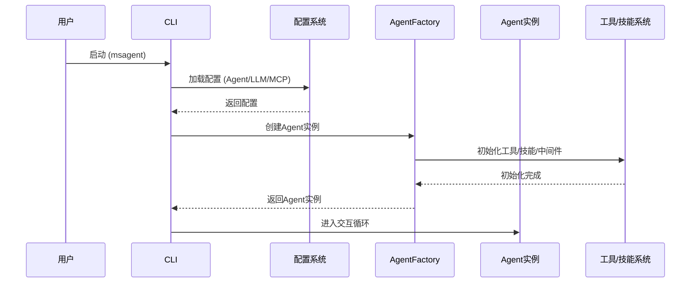
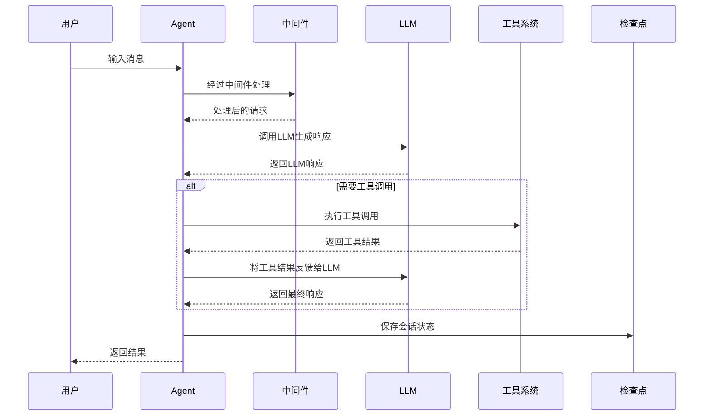

状态 (Status): Draft
作者 (Authors): @MindStudio-Agent Team
创建日期 (Created): 2026-05-07
更新日期 (Updated): 2026-05-07
相关 Issue/PR: # (待关联)

---

# 1. 概述

## 1.1 简介

本文档描述 MindStudio-Agent 的整体架构设计。MindStudio-Agent 是一个面向 Ascend NPU 场景的一站式调试调优 Agent 框架，提供性能调优、精度调优、模型量化等多个专业化 Agent，通过统一的框架支持多种交互方式，并具备灵活的扩展能力。

## 1.2 动机

随着 Ascend NPU 生态的发展，开发者在调试和优化模型时面临诸多挑战：
- 性能问题定位复杂，需要专业的 profiling 分析能力
- 精度问题排查困难，缺乏智能化的分析工具
- 模型量化流程繁琐，需要专业知识辅助
- 不同领域的调优需求需要不同的专业能力

MindStudio-Agent 旨在通过智能化 Agent 降低这些工作的复杂度，提供一站式的调试调优体验。

## 1.3 目标

**目标：**
- 提供统一的 Agent 框架，支持多个专业化 Agent 的开发和管理
- 支持灵活的 LLM 提供商接入（OpenAI、Anthropic、Google 等）
- 提供可扩展的工具和技能系统
- 实现会话记忆和上下文管理

**非目标：**
- 本文档不涉及具体 Skill 的实现细节
- 不涉及特定 Agent（如 Hermes、Accuracy）的领域-specific 逻辑
- 不涉及底层硬件加速细节

# 2. 用例分析

## 2.1 主要功能点

1. **多 Agent 支持**：框架应支持创建和管理多个专业化 Agent，每个 Agent 有特定的领域定位和能力
2. **LLM 集成**：支持多种 LLM 提供商，包括 OpenAI、Anthropic、Google 等，支持自定义服务地址
3. **工具系统**：提供工具注册、发现、调用机制
4. **技能系统**：支持 Skills 的加载、管理和执行
5. **MCP 支持**：集成 Model Context Protocol，支持外部工具和资源接入
6. **会话管理**：支持会话历史保存、恢复、压缩等功能
7. **交互界面**：提供 CLI 交互方式
8. **配置管理**：支持灵活的配置系统，包括 Agent 配置、LLM 配置、工具配置等

## 2.2 非功能需求

- **可扩展性**：框架应易于扩展新的 Agent、工具和技能
- **可维护性**：代码结构清晰，模块职责分明
- **可靠性**：支持错误处理、重试机制等
- **兼容性**：支持 Python 3.11+，兼容主流操作系统

# 3. 方案设计

## 3.1 总体方案

MindStudio-Agent 采用模块化架构设计，基于 deepagents 运行时构建，整体分为以下几个核心层次：

### 3.1.1 系统架构

```
┌─────────────────────────────────────────────────────────────┐
│                        交互层                                │
│              ┌──────────────────┐                           │
│              │   CLI (msagent)  │                           │
│              └──────────────────┘                           │
└─────────────────────────────────────────────────────────────┘
                              ↓
┌─────────────────────────────────────────────────────────────┐
│                        调度层                                │
│  ┌──────────────────────────────────────────────────────┐   │
│  │              Agent Factory & Runtime                 │   │
│  └──────────────────────────────────────────────────────┘   │
└─────────────────────────────────────────────────────────────┘
                              ↓
┌─────────────────────────────────────────────────────────────┐
│                        核心层                               │
│  ┌──────────┐  ┌──────────┐  ┌──────────┐  ┌──────────┐     │
│  │  Agents  │  │  Tools   │  │  Skills  │  │  LLM     │     │
│  └──────────┘  └──────────┘  └──────────┘  └──────────┘     │
│  ┌──────────────────┐  ┌──────────────────┐                 │
│  │   Middlewares    │  │   Configs        │                 │
│  └──────────────────┘  └──────────────────┘                 │
└─────────────────────────────────────────────────────────────┘
                              ↓
┌─────────────────────────────────────────────────────────────┐
│                        基础设施层                            │
│  ┌──────────┐  ┌──────────┐  ┌──────────────────┐           │
│  │  MCP     │  │  Sandbox │  │  Checkpointer    │           │
│  └──────────┘  └──────────┘  └──────────────────┘           │
└─────────────────────────────────────────────────────────────┘
```

### 3.1.2 核心模块说明

#### 1. Agents 模块
- **职责**：
  - Agent 工厂类（AgentFactory）：负责创建和管理 Agent 实例
  - 上下文管理：处理 Agent 运行时的上下文信息
  - 状态管理：管理 Agent 的内部状态

#### 2. Configs 模块
- **职责**：
  - Agent 配置：定义 Agent 的配置结构（AgentConfig）
  - LLM 配置：定义 LLM 的配置结构（LLMConfig）
  - MCP 配置：定义 MCP 服务的配置结构
  - 注册中心：管理配置的注册和加载

#### 3. Tools 模块
- **职责**：
  - 工具工厂：创建和管理工具实例
  - 工具目录：提供工具的注册、发现和调用机制
  - 内置工具：提供一些通用工具（如 web_search）

#### 4. LLMs 模块
- **职责**：
  - LLM 工厂：创建和管理 LLM 实例
  - 支持多种 LLM 提供商：OpenAI、Anthropic、Google 等

#### 5. MCP 模块
- **职责**：
  - MCP 客户端：与 MCP 服务通信
  - MCP 工厂：创建和管理 MCP 客户端实例

#### 6. Middlewares 模块
- **职责**：
  - 提供中间件机制，支持在 Agent 执行流程中插入自定义逻辑
  - 内置中间件：如 ToolResultEvictionMiddleware 等

#### 7. CLI 模块
- **职责**：
  - 提供命令行交互界面
  - 处理用户输入和命令执行
  - 提供补全、快捷键等交互增强功能

### 3.1.3 核心流程

#### 1. 启动流程



#### 2. Agent 执行流程



## 3.2 技术选型

| 技术/组件 | 用途 | 说明 |
|-----------|------|------|
| deepagents | Agent 运行时 | 提供 Agent 的核心运行时能力 |
| langchain | LLM 集成 | 提供 LLM 调用和工具集成能力 |
| langgraph | 状态管理 | 提供会话状态管理和检查点功能 |
| pydantic | 配置管理 | 提供类型安全的配置定义 |
| yaml | 配置文件格式 | 用于存储配置文件 |
| MCP | 工具协议 | 用于集成外部工具和资源 |

## 3.3 安全隐私与 DFX 设计

### 3.3.1 安全设计
- 配置文件中的敏感信息（如 API Key）通过环境变量管理
- 支持工具执行的审批机制（ApprovalConfig）
- 提供沙箱环境（SandboxConfig）用于安全执行代码

### 3.3.2 可维护性设计
- 模块化架构，职责分明
- 清晰的目录结构
- 完善的日志系统

### 3.3.3 可测试性设计
- 提供 testing 模块支持测试
- 支持单元测试、集成测试等

## 3.4 编程与调用设计

### 3.4.1 编程模型基本设计

**开发环境**：
- Python 3.11+
- 推荐使用 uv 作为包管理器
- 支持主流操作系统（Windows、Linux、macOS）

**开发约束**：
- 遵循项目的代码风格和规范
- 使用 pre-commit 进行代码检查

### 3.4.2 接口定义与设计

#### 3.4.2.1 AgentFactory.create_agent
- **接口描述**：创建 Agent 实例
- **接口原型**：
  ```python
  @staticmethod
  def create_agent(
      agent_config: AgentConfig,
      llm_config: LLMConfig | None = None,
      *,
      checkpointer: BaseCheckpointSaver | None = None,
      additional_tools: list[BaseTool] | None = None,
      additional_middlewares: list[AgentMiddleware] | None = None,
  ) -> CompiledStateGraph:
  ```
- **输入/输出参数**：
  | 参数名称 | 输入/输出 | 类型 | 描述 |
  |---------|----------|------|------|
  | agent_config | 输入 | AgentConfig | Agent 配置 |
  | llm_config | 输入 | LLMConfig \| None | LLM 配置 |
  | checkpointer | 输入 | BaseCheckpointSaver \| None | 检查点保存器 |
  | additional_tools | 输入 | list[BaseTool] \| None | 额外工具 |
  | additional_middlewares | 输入 | list[AgentMiddleware] \| None | 额外中间件 |
  | 返回值 | 输出 | CompiledStateGraph | 编译后的 Agent 图 |

### 3.4.3 使用说明

1. **配置 LLM**：
   ```bash
   export OPENAI_API_KEY="your-key"
   msagent config --llm-provider openai --llm-base-url "https://api.deepseek.com/v1" --llm-model "deepseek-chat"
   ```

2. **启动 Agent**：
   ```bash
   msagent --agent Hermes
   ```

3. **使用限制**：
   - 不同 Agent 有不同的领域定位，使用时需选择合适的 Agent
   - 部分工具可能需要额外的配置或权限

# 4. 测试设计

- **单元测试**：针对各个模块进行单元测试
- **集成测试**：测试模块之间的协作
- **端到端测试**：测试完整的用户交互流程
- **测试目录**：`tests/`

# 5. 缺点和风险（可选）

- **依赖风险**：依赖 deepagents、langchain 等第三方库，需要关注其更新和兼容性
- **LLM 依赖**：功能依赖 LLM 的能力，不同 LLM 的表现可能有差异
- **复杂度**：框架本身有一定的复杂度，需要良好的文档和示例支持

# 6. 现有技术（可选）

参考了以下项目/社区的设计：
- LangChain：LLM 应用开发框架
- LangGraph：状态管理和 Agent 编排
- MCP：Model Context Protocol

# 7. 未解决问题（可选）

- 暂未涉及

---

附录

* **参考资料链接**：
  - [deepagents 文档](https://docs.langchain.com/oss/python/deepagents/overview)
  - [MCP 规范](https://modelcontextprotocol.io/docs/getting-started/intro)
* **术语表**：
  - **Agent**：智能体，具有特定能力的实体
  - **LLM**：Large Language Model，大语言模型
  - **MCP**：Model Context Protocol，模型上下文协议
  - **Skill**：技能，Agent 的特定能力模块
  - **Tool**：工具，Agent 可以调用的功能
* **文档更新计划**：
  - 后续根据框架演进更新本文档
