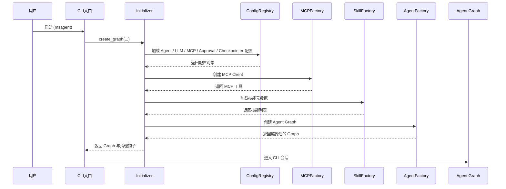
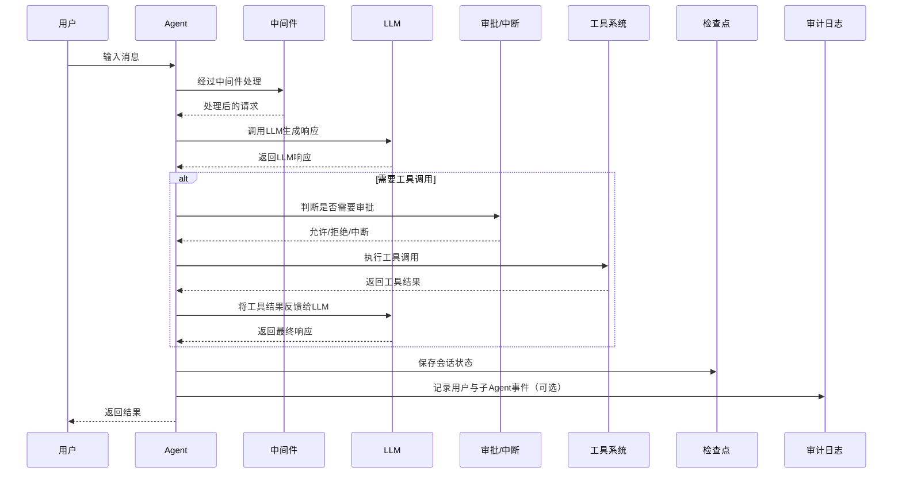

# 1. 概述

## 1.1 简介

本文档描述 MindStudio-Agent 的整体架构设计。MindStudio-Agent 是一个面向 Ascend NPU 开发、调试和调优场景的 AI Agent 工作台，当前通过统一框架承载 Profiler、Accuracy、Quantizer、Modeling、Operator、Minos 等多个专业化 Agent，并提供统一的 CLI 交互入口。

## 1.2 动机

随着 Ascend NPU 生态的发展，开发者在开发、调试和优化模型时面临诸多挑战：

- 性能问题定位复杂，需要专业的 profiling 分析能力
- 精度问题排查困难，缺乏智能化的分析工具
- 模型量化与适配流程繁琐，需要专业知识辅助
- 算子调优、仿真建模、文档体验与代码审查等场景需要不同的专业能力

MindStudio-Agent 旨在通过智能化 Agent 降低这些工作的复杂度，提供统一、可扩展、可审计的 Agent 工作台体验。

## 1.3 目标

**目标：**

- 提供统一的 Agent 框架，支持多个专业化 Agent 与子 Agent 的开发和管理
- 支持灵活的 LLM 提供商接入（OpenAI、Anthropic、Google 等）及兼容代理服务
- 提供可扩展的工具、技能、MCP 接入与配置体系
- 支持将领域 Skills 作为可分发资产复用到其他 IDE / Agent，并通过 MCP 暴露可接入的外部工具能力
- 实现会话记忆、检查点持久化、上下文压缩与审计能力
- 提供统一的 CLI 会话模式

**非目标：**

- 本文档不涉及具体 Skill 的实现细节
- 不涉及特定 Agent（如 Profiler、Accuracy）的逻辑
- 不涉及底层硬件加速细节

# 2. 用例分析

## 2.1 主要功能点

1. **多 Agent 支持**：框架应支持创建和管理多个专业化 Agent，并允许主 Agent 组装子 Agent 能力
2. **LLM 集成**：支持多种 LLM 提供商，包括 OpenAI、Anthropic、Google 等，支持自定义服务地址
3. **工具系统**：提供内置工具、MCP 工具的注册、发现、调用和超时控制机制
4. **技能系统**：支持 Skills 的加载、管理、筛选和运行时注入
5. **MCP 支持**：集成 Model Context Protocol，支持外部工具和资源接入
6. **会话管理**：支持会话历史保存、恢复、压缩、记忆文件和检查点持久化等功能
7. **交互界面**：提供默认 CLI 会话与配置入口
8. **安全与治理**：支持工具审批、工具重试、结果裁剪、审计日志等运行时治理能力
9. **配置管理**：支持灵活的配置系统，包括 Agent、LLM、MCP、审批、检查点等配置
10. **外部集成**：支持将 Skills 复用到其他 IDE / Agent，并通过独立 MCP Server 方式对外提供工具能力

## 2.2 非功能需求

- **可扩展性**：框架易于扩展新的 Agent、工具和技能
- **可维护性**：代码结构清晰，模块职责分明
- **可靠性**：支持错误处理、重试机制等
- **兼容性**：支持 Python 3.11+，兼容主流操作系统

# 3. 方案设计

## 3.1 总体方案

MindStudio-Agent 采用模块化架构设计，基于 deepagents 运行时与 LangGraph 状态/检查点能力构建，整体分为以下几个核心层次：

### 3.1.1 系统架构

```text
┌─────────────────────────────────────────────────────────────┐
│                        交互层                                │
│              ┌──────────────────┐                           │
│              │ CLI 会话 (msagent)│                          │
│              └──────────────────┘                           │
└─────────────────────────────────────────────────────────────┘
                              ↓
┌─────────────────────────────────────────────────────────────┐
│                    装配与调度层                              │
│  ┌──────────────────────────────────────────────────────┐   │
│  │ Initializer / ConfigRegistry / Factory 组装链路      │   │
│  └──────────────────────────────────────────────────────┘   │
└─────────────────────────────────────────────────────────────┘
                              ↓
┌─────────────────────────────────────────────────────────────┐
│                      核心运行时层                            │
│  ┌──────────┐  ┌──────────┐  ┌──────────┐  ┌──────────┐     │
│  │ Agents   │  │ Tools    │  │ Skills   │  │ LLMs     │     │
│  └──────────┘  └──────────┘  └──────────┘  └──────────┘     │
│  ┌──────────────────┐  ┌──────────────────┐                 │
│  │ Middlewares      │  │ Configs          │                 │
│  └──────────────────┘  └──────────────────┘                 │
└─────────────────────────────────────────────────────────────┘
                              ↓
┌─────────────────────────────────────────────────────────────┐
│                       基础设施层                             │
│  ┌──────────┐  ┌──────────────┐  ┌──────────────────┐       │
│  │ MCP      │  │ Checkpointer │  │ CompositeBackend │       │
│  └──────────┘  └──────────────┘  └──────────────────┘       │
│  ┌──────────┐  ┌──────────────────────────────────────────┐  │
│  │ Audit    │  │ LocalShell / 虚拟文件系统 / 会话历史     │  │
│  └──────────┘  └──────────────────────────────────────────┘  │
└─────────────────────────────────────────────────────────────┘
```

### 3.1.2 核心模块说明

#### 1. Agents 模块

- **职责**：
  - Agent 工厂类（AgentFactory）：负责组装 deepagents graph、工具、子 Agent 和中间件
  - 上下文管理：处理 Agent 运行时上下文信息（如模板变量、工作目录）
  - 运行时后端：组合本地 shell、虚拟文件系统与会话历史路由

#### 2. Configs 模块

- **职责**：
  - Agent 配置：定义 Agent 的配置结构（AgentConfig）
  - LLM 配置：定义 LLM 的配置结构（LLMConfig）
  - MCP 配置：定义 MCP 服务的配置结构
  - 其他配置：定义 Checkpointer、Approval、Sandbox 等配置结构
  - 注册中心：统一管理配置的加载、缓存与保存

#### 3. Tools 模块

- **职责**：
  - 工具工厂：创建和包装工具实例，提供超时控制等运行时能力
  - 工具目录：提供工具的注册、发现和调用机制
  - 内置工具：提供 fetch_tools、get_tool、run_tool、web_search 等通用工具

#### 4. Skills 模块

- **职责**：
  - SkillFactory：从工作目录 `skills/`、全局 `~/.msagent/skills/` 与内置目录加载技能元数据
  - 技能筛选：根据 Agent 配置中的 patterns 进行技能注入
  - 技能目录：为 CLI 与运行时提供技能发现能力
  - 分发能力：构建产物可将仓库 `skills/` 打包到默认资源目录，便于安装版与外部 IDE / Agent 复用

#### 5. LLMs 模块

- **职责**：
  - LLM 工厂：创建和管理 LLM 实例
  - 支持多种 LLM 提供商：OpenAI、Anthropic、Google 等
  - 提供超时、重试、兼容代理服务等接入能力

#### 6. MCP 模块

- **职责**：
  - MCP 客户端：与 MCP 服务通信
  - MCP 工厂：创建和管理 MCP 客户端实例
  - MCP 工具映射：将外部工具接入 Agent 运行时并参与筛选
  - 外部接入：支持将独立 MCP Server（当前默认围绕 `msprof-mcp`）配置到其他 IDE / Agent 中复用

#### 7. Middlewares 模块

- **职责**：
  - 提供中间件机制，支持在 Agent 执行流程中插入自定义逻辑
  - 内置中间件：如 MemoryMiddleware、SkillsMiddleware、ToolRetryMiddleware、ToolResultEvictionMiddleware 等

#### 8. CLI 模块

- **职责**：
  - 提供默认命令行会话入口，以及 `config` 等公开命令
  - 处理用户输入、线程切换、工具展示、补全和快捷键等交互增强功能

### 3.1.3 核心流程

#### 1. 启动流程


```mermaid
sequenceDiagram
    participant User as 用户
    participant Entry as CLI入口
    participant Init as Initializer
    participant Config as ConfigRegistry
    participant MCP as MCPFactory
    participant Skill as SkillFactory
    participant Factory as AgentFactory
    participant Graph as Agent Graph

    User->>Entry: 启动 (msagent)
    Entry->>Init: create_graph(...)
    Init->>Config: 加载 Agent / LLM / MCP / Approval / Checkpointer 配置
    Config-->>Init: 返回配置对象
    Init->>MCP: 创建 MCP Client
    MCP-->>Init: 返回 MCP 工具
    Init->>Skill: 加载技能元数据
    Skill-->>Init: 返回技能列表
    Init->>Factory: 创建 Agent Graph
    Factory-->>Init: 返回编译后的 Graph
    Init-->>Entry: 返回 Graph 与清理钩子
    Entry->>Graph: 进入 CLI 会话
```

#### 2. Agent 执行流程


```mermaid
sequenceDiagram
    participant User as 用户
    participant Agent as Agent
    participant Middleware as 中间件
    participant LLM as LLM
    participant Approval as 审批/中断
    participant Tool as 工具系统
    participant Checkpointer as 检查点
    participant Audit as 审计日志

    User->>Agent: 输入消息
    Agent->>Middleware: 经过中间件处理
    Middleware-->>Agent: 处理后的请求
    Agent->>LLM: 调用LLM生成响应
    LLM-->>Agent: 返回LLM响应
    alt 需要工具调用
        Agent->>Approval: 判断是否需要审批
        Approval-->>Agent: 允许/拒绝/中断
        Agent->>Tool: 执行工具调用
        Tool-->>Agent: 返回工具结果
        Agent->>LLM: 将工具结果反馈给LLM
        LLM-->>Agent: 返回最终响应
    end
    Agent->>Checkpointer: 保存会话状态
    Agent->>Audit: 记录用户与子Agent事件（可选）
    Agent-->>User: 返回结果
```

## 3.2 技术选型

| 技术/组件 | 用途 | 说明 |
|-----------|------|------|
| deepagents | Agent 运行时 | 提供 Agent 图构建、后端与中间件集成能力 |
| langchain | LLM 集成 | 提供模型调用与工具抽象能力 |
| langgraph | 状态管理 | 提供图执行、状态管理与运行时导出能力 |
| langgraph-checkpoint-sqlite | 检查点持久化 | 提供 SQLite 检查点实现 |
| langchain-mcp-adapters | MCP 接入 | 提供 MCP 工具适配能力 |
| pydantic | 配置管理 | 提供类型安全的配置定义 |
| yaml / json | 配置文件格式 | 用于存储 Agent、LLM、MCP、审批等配置 |
| prompt-toolkit / rich | CLI 交互 | 提供终端交互、渲染与主题能力 |

## 3.3 安全隐私与 DFX 设计

### 3.3.1 安全设计

- 配置文件中的敏感信息（如 API Key）通过环境变量管理
- 支持工具执行审批与中断机制（ApprovalConfig / interrupt_on）
- 支持工具级 include / exclude、超时控制与大结果裁剪
- 预留 SandboxConfig，用于安全执行代码与运行环境隔离

### 3.3.2 可维护性设计

- 模块化架构，职责分明
- 使用 Initializer + Factory + Registry 组合装配运行时
- 清晰的目录结构与配置分层
- 提供日志与可选审计日志能力

### 3.3.3 可测试性设计

- 提供 testing 模块支持运行时替身与测试装配
- 支持配置加载、AgentFactory、中间件、CLI 处理器等单元测试
- 支持集成测试与端到端测试扩展

## 3.4 编程与调用设计

### 3.4.1 编程模型基本设计

**开发环境**：

- Python 3.11+
- 推荐使用 uv 作为包管理器
- 支持主流操作系统（Windows、Linux、macOS）

**开发约束**：

- 遵循项目的代码风格和规范
- 使用 pre-commit 进行代码检查

### 3.4.2 接口定义与设计

#### 3.4.2.1 AgentFactory.create

- **接口描述**：创建 Agent 实例
- **接口原型**：

  ```python
  async def create(
      config: AgentConfig,
      working_dir: Path | None = None,
      context_schema: type[Any] | None = None,
      mcp_client: Any | None = None,
      skills_dir: Path | list[Path] | None = None,
      checkpointer: BaseCheckpointSaver | None = None,
      llm_config: LLMConfig | None = None,
      sandbox_bindings: list[Any] | None = None,
      interrupt_on: dict[str, bool | dict[str, Any]] | None = None,
  ) -> CompiledStateGraph:
  ```

- **输入/输出参数**：

  | 参数名称 | 输入/输出 | 类型 | 描述 |
  |---------|----------|------|------|
  | config | 输入 | AgentConfig | Agent 配置 |
  | working_dir | 输入 | Path \| None | 当前工作目录 |
  | context_schema | 输入 | type[Any] \| None | 运行时上下文类型 |
  | mcp_client | 输入 | Any \| None | 已初始化的 MCP 客户端 |
  | skills_dir | 输入 | Path \| list[Path] \| None | 技能搜索目录 |
  | checkpointer | 输入 | BaseCheckpointSaver \| None | 检查点保存器 |
  | llm_config | 输入 | LLMConfig \| None | 覆盖 Agent 默认配置的 LLM |
  | sandbox_bindings | 输入 | list[Any] \| None | 预留的沙箱绑定参数 |
  | interrupt_on | 输入 | dict[str, bool \| dict[str, Any]] \| None | 审批/中断规则 |
  | 返回值 | 输出 | CompiledStateGraph | 编译后的 Agent 图 |

### 3.4.3 使用说明

1. **配置 LLM**：

   ```bash
   msagent config --llm-provider openai --llm-base-url "https://api.deepseek.com" --llm-model "deepseek-chat"
   ```

2. **启动 CLI 会话**：

   ```bash
   msagent --agent Profiler
   ```

3. **使用限制**：
   - 不同 Agent 有不同的领域定位，使用时需选择合适的 Agent
   - 部分工具或 MCP 服务可能需要额外的配置、权限或网络环境

# 4. 测试设计

- **单元测试**：针对各个模块进行单元测试
- **集成测试**：测试模块之间的协作
- **端到端测试**：测试完整的用户交互流程
- **测试目录**：`tests/`

# 5. 缺点和风险（可选）

- **依赖风险**：依赖 deepagents、langchain、langgraph 等第三方库，需要关注其更新和兼容性
- **LLM 依赖**：功能依赖 LLM 的能力，不同 LLM 的表现可能有差异
- **工具治理复杂度**：MCP 工具、审批、超时和重试策略需要根据场景调优
- **复杂度**：框架本身有一定的复杂度，需要良好的文档和示例支持

# 6. 现有技术（可选）

参考了以下项目/社区的设计：

- LangChain：LLM 应用开发框架
- LangGraph：状态管理和 Agent 编排
- MCP：Model Context Protocol

# 7. 未解决问题（可选）

- 暂未涉及

---

附录

* **参考资料链接**：
  - [deepagents 文档](https://docs.langchain.com/oss/python/deepagents/overview)
  - [MCP 规范](https://modelcontextprotocol.io/docs/getting-started/intro)
* **术语表**：
  - **Agent**：智能体，具有特定能力的实体
  - **LLM**：Large Language Model，大语言模型
  - **MCP**：Model Context Protocol，模型上下文协议
  - **Skill**：技能，Agent 的特定能力模块
  - **Tool**：工具，Agent 可以调用的功能
* **文档更新计划**：
  - 后续根据框架演进更新本文档
