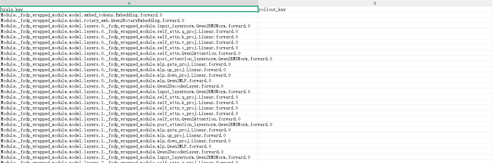
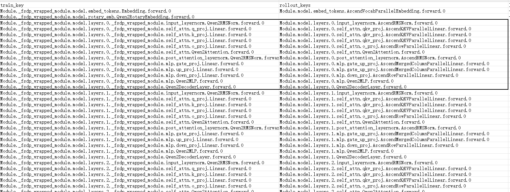
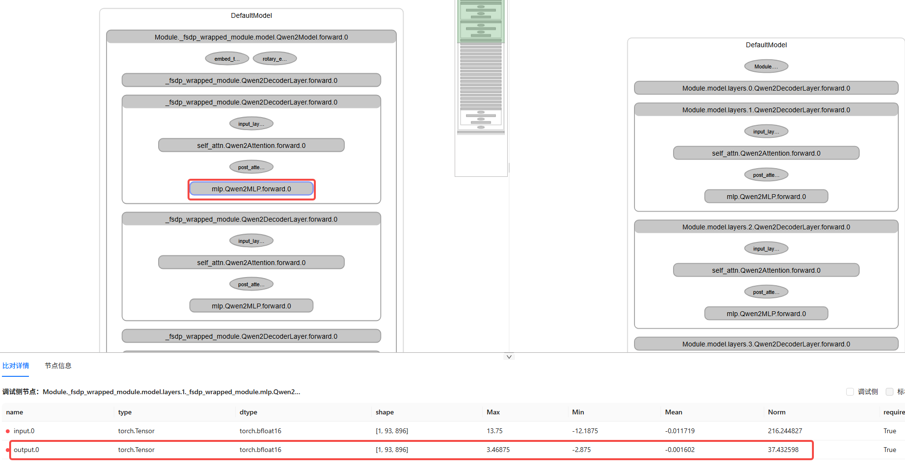
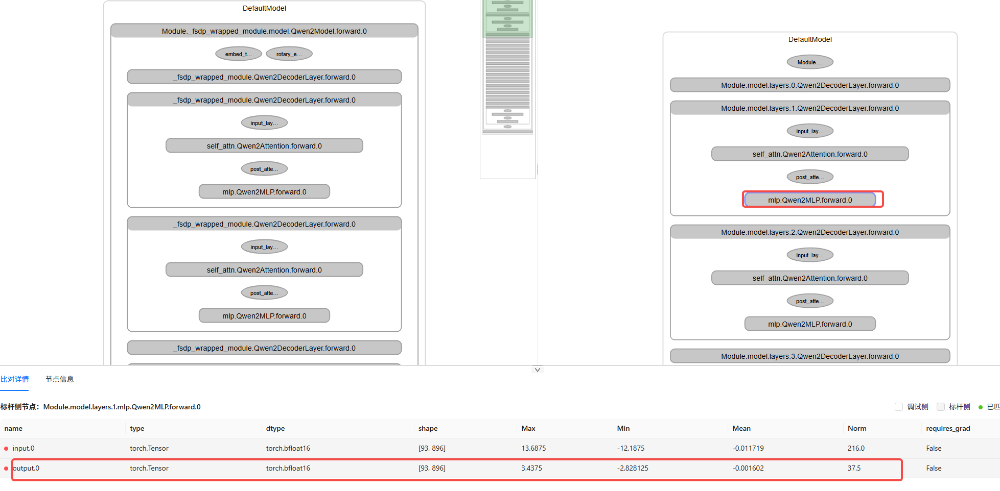
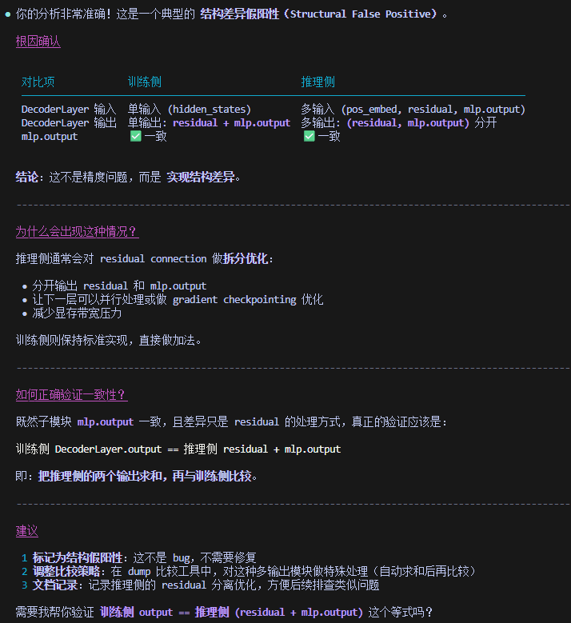

# Accuracy 使用示例

## 1、获取分析报告

dump了某模型训练和推理的数据，接下来用msAgent进行分析。

进入精度分析界面，对于“RL训推不一致分析场景”，

人：输入示例提示词“请基于输入的训练和推理dump数据，分析训推的差异来源，给出可能原因。

Agent：提示给出dump数据文件路径。

人：输入训练和推理的“xxx/dump.json”。

Agent：分析，给出分析对比文档和报告。

人：查看分析文件**【层名映射文件】，结果有问题，一个也没对应上**，如下图所示



人：给Agent增加construct和stack文件，更新分析结果和文件

Agent：更新结果。

人：查看分析文件【层名映射文件】，这下看着没什么问题了。



## 2、查看分析报告中的分析逻辑和依据

### 2.1 Agent分析报告内容(部分)

---

#### 数值验证

使用正确输出索引(output.1)对比结果:

| Layer | 训练端 Norm | 推理端 output.1 | 差异 | 状态 |
| --- | --- | --- | --- | --- |
| 1 | 79.00 | 63.25 | 19.93% | ✗ 异常 |
| 5 | 1723.28 | 1696.00 | 1.58% | ⚠ 微小 |
| 10 | 1725.05 | 1728.00 | 0.17% | ✓ 对齐 |
| 15 | 1728.08 | 1728.00 | 0.00% | ✓ 对齐 |
| 20 | 1767.31 | 1760.00 | 0.41% | ✓ 对齐 |
| 23 | 538.36 | 684.00 | 27.05% | ✗ 异常 |

#### 首尾层异常分析

+ Layer 0: 推理端 output.0=55.0 接近训练端 55.09，但 output.1=5.12 异常低

+ Layer 23: 推理端 output.1=684 与训练端 538.36 差异 27%

---

### 2.2 人工检查

从数值验证看，Layer 1、23有较大问题。

使用msprobe的分级可视化工具进行人工查看后发现



1、Layer1、Layer23如果打开来看子模块，则结果能对上；

2、训练的Layer层父模块的output和子模块最后一层（Qwen2MLP）的output不是相同值，而推理的是相同值。

**故人工复核的结论是：训推结果基本一致。**

## 3、进一步研讨，搞清楚原理，和Agent结果对齐

将上述的人工复核结论反馈给Agent，进行进一步研讨，搞清楚现象的原因

人：输入“训练侧的父模块Module._fsdp_wrapped_module.model.layers.23._fsdp_wrapped_module.Qwen2DecoderLayer.forward.0和父模块中最后一个子模块Module._fsdp_wrapped_module.model.layers.23._fsdp_wrapped_module.mlp.Qwen2MLP.forward.0的输出不一致，而推理侧Module.model.layers.23.Qwen2DecoderLayer.forward.0和Module.model.layers.23.mlp.Qwen2MLP.forward.0的output是一致的，这个是为什么？实际上训练侧和推理侧的Layer23的子模块的output是一致的”

Agent：

---

这是一个关于 模块层级输出关系 的重要问题。让我解释可能的原因：                                                                                                                                                                                                                    

  关键理解：DecoderLayer 的输出 ≠ MLP 的输出                                                                                                                                                                                                                              

  Qwen2DecoderLayer 的典型结构：                                                                                                                                                                                                                                       

```plain
  def forward(self, hidden_states, ...):
      # Self Attention block
      residual = hidden_states
      hidden_states = self.input_layernorm(hidden_states)
      hidden_states = self.self_attn(hidden_states, ...)
      hidden_states = residual + hidden_states  # residual connection
      
      # MLP block  
      residual = hidden_states
      hidden_states = self.post_attention_layernorm(hidden_states)
      hidden_states = self.mlp(hidden_states)
      hidden_states = residual + hidden_states  # 关键！residual connection
      
      return hidden_states  # DecoderLayer 的输出
```

  核心点：                                                                                                                                                                                                                                                               

   • DecoderLayer.output = residual + mlp.output（经过 residual connection）                                                                                                                                                                                                          

   • 不是直接等于 mlp.output                                                      

---

**训练侧的Layer是单输入单输出（直接输出hidden_states），而推理侧的为多输入多输出。具体的，推理侧的input0是位置编码，input1和input2是上一层的residual和mlp.output，输出则是residual和mlp.output。** 这就解释了：

1、训推子模块能对上，因为都是mlp.output；

2、训推父模块对不上，因为一个是单输出residual + mlp.output，一个是双输出residual，mlp.output。

人：把上述结论反馈给Agent

Agent：



好，这下对齐了。

## 4、总结

1、在这个案例中，Qwen2模型的训推实现有明显区别（子模块、算子存在融合），但整体模块结构可以大致对上，在提供construct信息后，Agent可以大致对齐层。

2、但训推的层的输入输出数量、走向也存在明显区别，此时Agent做了基本情况的遍历验证，但对于特殊情况应对不足（Layer1/23的输出方式），在进行人工引导后Agent判断正确。
