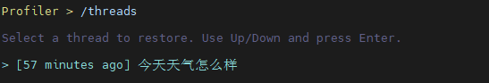
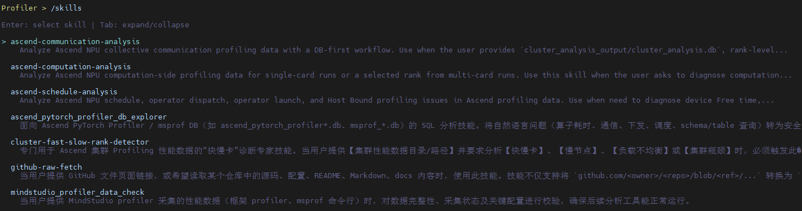
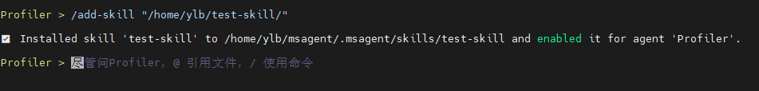
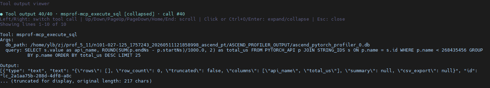

# msAgent快速入门

本文介绍如何配置模型、选择 Agent 功能、启动并进入msAgent最小可用的交互流程。

## 1. 环境准备

```commandline
pip install mindstudio-agent
```

更多安装方式，具体请参见《[msAgent安装指南](./install_guide.md)》。

## 2. 配置 LLM

1. 准备一个可用的 LLM API Key。

   需要用户自行登录模型服务商网站进行创建，常见模型厂商链接如下：

    | 模型服务商   | 官网链接                               |
    |---------|------------------------------------|
    | DeepSeek | [https://platform.deepseek.com/](https://platform.deepseek.com/) |
    | 百炼 | [https://help.aliyun.com/zh/model-studio/get-api-key](https://help.aliyun.com/zh/model-studio/get-api-key) |

2. 配置 LLM。

   包括 LLM 服务的环境变量（*_API_KEY）、通过`msagent config`命令的`--llm-provider`参数配置LLM 服务的协议类型、`--llm-base-url`参数配置模型服务商地址、`--llm-model`参数配置模型名称（模型名称从模型服务商网站的模型广场获取）。

   | 配置场景 | 示例                                                                                                                                                                     |
   | --- |------------------------------------------------------------------------------------------------------------------------------------------------------------------------|
   | OpenAI 兼容接口 | `export OPENAI_API_KEY="your-key"`<br>`msagent config --llm-provider openai --llm-base-url "https://api.deepseek.com" --llm-model "deepseek-v4-flash" # 以DeepSeek为例`   |
   | 本地 OpenAI 兼容服务 | `export OPENAI_API_KEY="dummy"  # 如本地模型服务无密钥，可填入任意非空字符串`<br>`msagent config --llm-provider openai --llm-base-url "http://127.0.0.1:8000/v1" --llm-model "your-model"` |
   | Anthropic 兼容服务 | `export ANTHROPIC_API_KEY="your-key"`<br>`msagent config --llm-provider anthropic --llm-base-url "https://example.com/anthropic" --llm-model "claude-sonnet-4-20250514"` |
   | Google / Gemini 服务 | `export GOOGLE_API_KEY="your-key"`<br>`msagent config --llm-provider google --llm-base-url "https://example.com/google" --llm-model "gemini-2.5-pro"`                  |

3. 查看当前配置。

   ```bash
   msagent config --show
   ```

   显示步骤2配置的参数值则表示配置成功。

## 3. 启动会话

- 启动并进入默认交互式会话。

  ```bash
  msagent
  ```

- 也可以在启动时指定Agent，示例如下：

  | Agent | 说明 | 启动命令 |
  | --- | --- | --- |
  | [Profiler](../agent_guide/Profiler.md) | 性能调优 | `msagent --agent Profiler` |
  | [Accuracy](../agent_guide/Accuracy.md) | 精度调试 | `msagent --agent Accuracy` |
  | [Quantizer](../agent_guide/Quantizer.md) | 模型量化 | `msagent --agent Quantizer` |
  | [Operator](../agent_guide/Operator.md) | 算子调优 | `msagent --agent Operator` |
  | [Minos](../agent_guide/Minos.md) | 文档辅助 | `msagent --agent Minos` |

- 更多命令请参见《[msAgent使用指南](../user_guide/usemap.md)》。

## 4. 使用技巧

进入 msAgent 交互式会话后，通过斜杠命令（slash command）的形式使用。

### 4.1 恢复历史会话线程

会话历史会自动保存为独立线程，可随时浏览并恢复到之前的会话继续工作。

| 命令 | 说明 |
| --- | --- |
| `/threads` | 打开会话线程列表，按时间倒序展示预览摘要。 |



### 4.2 选择并加载 Skill

Skill 是面向特定场景的专项能力模块（如性能分析、模型量化等）。输入 `/skills` 回车后，会打开交互式列表，通过上下键浏览选择、回车加载所需 Skill。

| 命令                              | 说明                                                                           |
|---------------------------------|------------------------------------------------------------------------------|
| `/skills`                       | 打开交互式 Skill 列表，上下键浏览、回车加载。                                                   |
| `/skills <skill-name>`          | 直接指定 Skill 名称加载，如 `/skills ascend-computation-analysis`。                     |
| `/skills <skill-name> <prompt>` | 加载 Skill 并传入任务执行，如 `/skills ascend-computation-analysis 帮我根据性能数据分析有无计算类的瓶颈`。 |



### 4.3 安装自定义 Skill

除了内置 Skill，用户也可通过 `/add-skill` 从本地路径安装自定义 Skill，满足个性化场景需求。支持指定 Skill 目录或 `SKILL.md` 文件，安装后立即生效。

| 命令                           | 说明                                                 |
|------------------------------|----------------------------------------------------|
| `/add-skill <path-to-skill>` | 从本地路径安装 Skill 目录，如 `/add-skill /path/to/my-skill`。 |



### 4.4 查看工具输出详情

当 Agent 执行工具调用产生的输出较长时（如日志、配置文件、代码块等），输入 `/tool-output` 可在全屏查看器中浏览完整内容，避免输出截断影响阅读。也可用快捷键 `Ctrl+O` 直接打开。

| 操作 | 说明 |
| --- | --- |
| `/tool-output` 或 `Ctrl+O` | 打开全屏工具输出查看器。 |
| 左右方向键 | 切换多个工具输出。 |
| 上下方向键、`PageUp`/`PageDown` | 滚动内容。 |
| `Enter` / `Ctrl+O` / 鼠标点击 | 展开或折叠完整输出。 |
| `Esc` | 关闭查看器。 |



更完整的命令和快捷键说明请参见《[msAgent使用指南](../user_guide/usemap.md)》。
