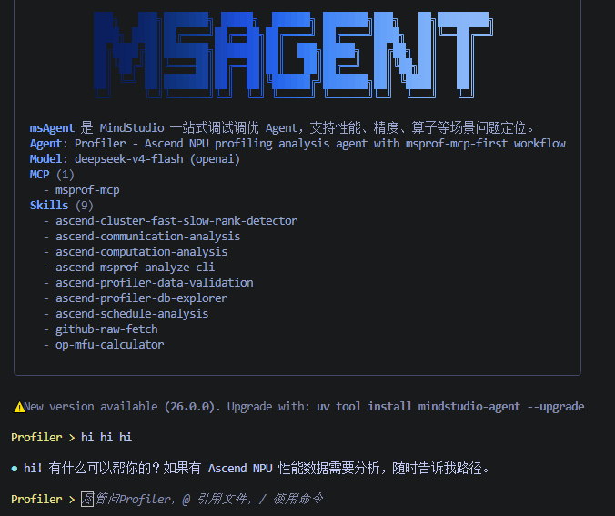

# FAQ

## 1. msagent 第一次启动时会生成哪些本地文件？

`msagent` 使用全局配置目录。默认位置为：

```text
~/.msagent/
```

其中 `config/` 保存用户覆盖配置，`state/projects/<project-id>/` 保存各项目独立的 memory、history、checkpoint 和会话历史。工作目录不会生成新的 `.msagent/`。

这个目录里通常会包含：

- LLM 配置
- MCP 配置
- 用户安装的 Skills
- 日志、缓存、会话历史和 checkpoint 数据

内置 Agent / SubAgent 定义和 Prompt 默认由安装包直接提供，不会在首次启动时复制到这里。当前 workspace 选择的 Agent 和 Model 记录在对应项目的 `project.json` 中。

更完整的目录说明见 [配置与扩展](configuration-and-extension.md)。

## 2. 如何打开或关闭 MCP 服务？

有两种常见方式：

- 在会话里通过 `/mcp` 查看和切换已配置的 MCP 服务
- 直接编辑 `~/.msagent/config/config.mcp.json`

默认模板会启用 `msprof-mcp`。如果你要接入新的本地或远程 MCP 服务，建议先参考 [配置与扩展](configuration-and-extension.md) 里的字段说明。

## 3. 如何确认 Skill 是否被识别到了？

进入会话后，可以执行：

```text
/skills
```

如果要查看某个具体 Skill：

```text
/skills my-skill
```

如果你的 Skill 带分类目录，建议写全路径：

```text
/skills profiler/my-skill
```

如果看不到，通常优先检查：

- 路径是否正确
- 文件名是否为 `SKILL.md`
- 当前 Agent 的 `skills.patterns` 是否允许该 Skill
- 是否被更高优先级目录中的同名 Skill 覆盖

加载自定义 Skill，可参考[添加自定义 Skill](configuration-and-extension.md#添加自定义-skill)

## 4. 运行日志在哪里看？

日志统一写到全局目录：

```text
~/.msagent/logs/app.log
```

如果你想看到更详细的日志，可以开启：

```bash
export MSAGENT_LOG_LEVEL=DEBUG
msagent -v
```

## 5. 终端界面颜色偏灰/看不清怎么办？

msagent 会自动检测终端主题（深色/浅色）来匹配配色方案。如果检测不准（比如 SSH 连接时误判为浅色主题，导致深色终端上文字偏灰），可通过环境变量手动指定：

```bash
export MSAGENT_BACKGROUND_THEME=dark
```

可选值：

| 值 | 含义                               |                                     |
|----|----------------------------------|-------------------------------------|
| `dark` | 强制使用背景为深色主题（Tokyo Night），对应字体为浅色 |   |
| `light` | 强制使用背景为浅色主题（Tokyo Day），对应字体为深色   |                                     |

## 6. MobaXterm 终端背景为白色/无彩色怎么办？

MobaXterm 默认未设置 `COLORTERM`，导致 prompt_toolkit 无法识别真彩色支持，界面可能显示为白色背景或无彩色。设置以下环境变量即可恢复：

```bash
export COLORTERM=truecolor
```
