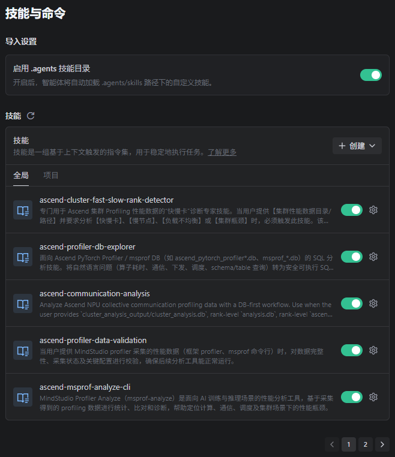
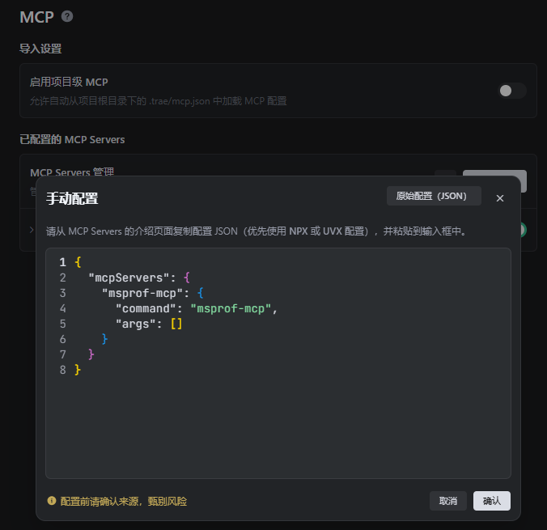
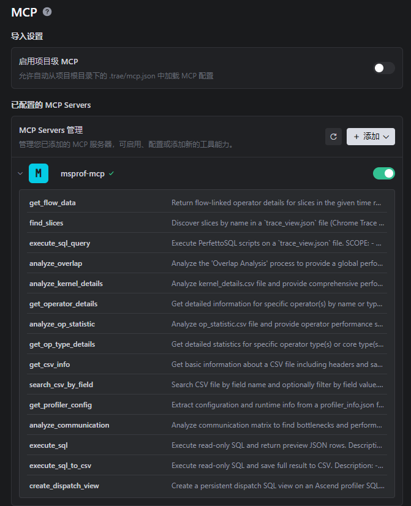
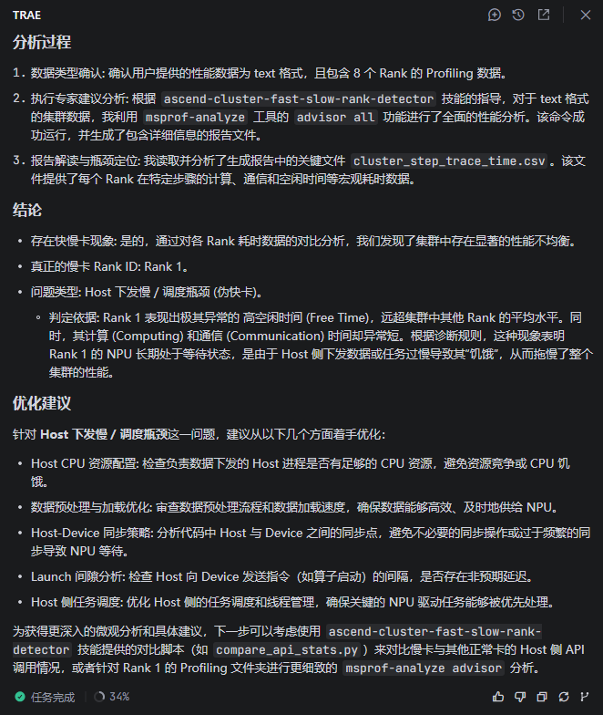

# 接入 msAgent 调试调优能力

## 1. 概述

msAgent 提供一体化的昇腾领域调试调优能力，涵盖性能分析、精度调优、模型量化、算子优化、文档审查等核心开发场景。同时，msAgent 也提供两类可被外部 Agent 集成复用的资产：

- **Skill**：30+ 面向 Ascend 开发场景的领域知识包，覆盖性能分析、精度调优、模型量化、算子优化、文档审查等。每个 Skill 由 `SKILL.md`（执行流程）+ `scripts/`（辅助脚本）构成，agent 加载后自动按流程执行。
- **MCP 服务**：提供 `msprof-mcp` 服务，聚焦 Ascend profiling 数据分析领域。

适用人群：使用 `trae`、`claude`、`codex`、`opencode` 等 Agent，想接入 Ascend NPU 调试调优能力的开发者。

## 2. Skill：即装即用的领域知识包

msAgent 中的 Skills 实现遵循 Agent Skills 的通用约定，能在不同 agent 间复用、迁移。完整信息见 [Skill 列表](../../../skills/README.md)。

### 2.1 方式一：npx skills（推荐）

适用于 Trae、opencode 等支持 `npx skills` 工作流的 agent。一行命令即可安装：

```bash
git clone https://gitcode.com/Ascend/msagent.git
cd msagent/skills

# 安装单个 Skill
npx skills add . --skill ascend-cluster-fast-slow-rank-detector -a trae -y

# 安装多个 Skill
npx skills add . --skill ascend-communication-analysis --skill ascend-computation-analysis -a opencode -y

# 安装全部 Skill
npx skills add . --all -a trae
```

### 2.2 方式二：手动拷贝

不依赖 `npx`，适用于任意 agent。克隆仓库后将目标 Skill 目录拷贝到 agent 的 skills 扫描路径下：

```bash
git clone https://gitcode.com/Ascend/msagent.git

# opencode
cp -r msagent/skills/ascend-profiler-db-explorer ~/.config/opencode/skills/

# claude
cp -r msagent/skills/ascend-profiler-db-explorer ~/.claude/skills/
```

安装后，在对话中输入匹配 Skill 描述的任务，agent 会自动读取 `SKILL.md` 并按照其中流程执行。

## 3. MCP：即插即用的工具底座

当前可用的 MCP 服务：

| 服务名称 | 领域 | 仓库                                                      |
|----------|------|---------------------------------------------------------|
| `msprof-mcp` | Ascend Profiling 数据分析 | [link](https://gitcode.com/kali20gakki1/msprof_mcp.git) |

### 3.1 msprof-mcp

专注于 Ascend profiling 数据分析领域，帮助开发者从大体量原始 profiling 性能数据中快速提取关键信息。

#### 3.1.1 典型能力

| 维度 | 工具 | 数据载体 |
|------|------|----------|
| Timeline 分析 | `analyze_overlap`、`find_slices`、`get_flow_data`、`execute_sql_query` | trace_view.json |
| 算子分析 | `analyze_kernel_details`、`get_operator_details`、`analyze_op_statistic` | kernel_details.csv / op_statistic.csv |
| 通信分析 | `analyze_communication`、`analyze_communication_trace` | communication_matrix.json / communication.json |
| 配置查询 | `get_profiler_config` | profiler_info.json |
| 数据库查询 | `execute_sql`、`execute_sql_to_csv` | ascend_pytorch_profiler.db |

#### 3.1.2 快速接入

通过 stdio 传输协议运行，支持 `uvx` 一键启动或 `pip` 安装后直接运行：

```bash
# 方式一：uvx（推荐，无需显式安装）
uvx msprof-mcp

# 方式二：pip 安装
pip install msprof-mcp
msprof-mcp
```

在 agent 的 MCP 配置文件中添加：

```json
{
  "mcpServers": {
    "msprof-mcp": {
      "command": "msprof-mcp",
      "args": []
    }
  }
}
```

环境要求：

- Python >= 3.11
- glibc >= 2.34（Perfetto TraceProcessor Shell 二进制依赖）

## 4. Trae IDE 实操示例

以下演示如何将 Skill + MCP 组合接入 Trae IDE，从零开始完成一次 Ascend 集群快慢卡诊断。

### Step 1：安装 Skills

克隆仓库后，将 msagent/skills/ 中的 Skill 复制到 Trae IDE 的 Skill 目录中：

- 项目级：`<项目根目录>/.trae/skills/`
- 全局级：`~/.trae/skills/`（macOS/Linux）或 `C:\Users\你的用户名\.trae\skills`（Windows）

加载成功后，在 IDE `设置 → 技能与命令` 中可以看到已加载的 Skill。



### Step 2：配置 MCP Server

在 Trae IDE 中进入 `设置 → MCP` 中，点击 `添加 → 手动配置`，填入以下信息：

```json
{
  "mcpServers": {
    "msprof-mcp": {
      "command": "msprof-mcp",
      "args": []
    }
  }
}
```



保存后 Trae 将自动安装 `msprof-mcp` 及其依赖。安装完成后，可在界面中查看该 MCP 暴露的具体工具列表。



### Step 3：安装 msprof-analyze

部分 Skill 依赖 msprof-analyze 工具，需在 Trae IDE 沙箱环境中安装。直接向 Agent 下达 pip install msprof-analyze 指令即可，Agent 会自动完成安装并反馈结果。

### Step 4：开始使用

配置完成后，即可在对话中直接调用 Profiling 分析 Skill 与 msprof-mcp 工具。示例触发语：

- “帮我检查这个 Profiling 数据是否完整可分析”
- “分析这个 Ascend 集群 profiling 目录里的快慢卡问题”
- “查一下这个 `ascend_pytorch_profiler_*.db` 里最耗时的 TopK 算子和通信耗时”

集群快慢卡问题分析结果示例如下：


