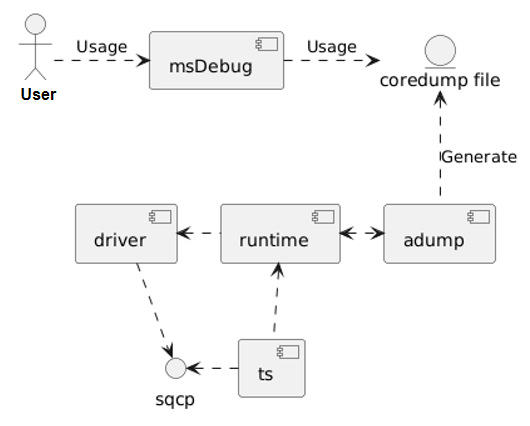
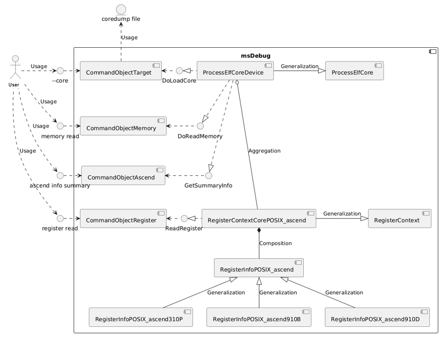
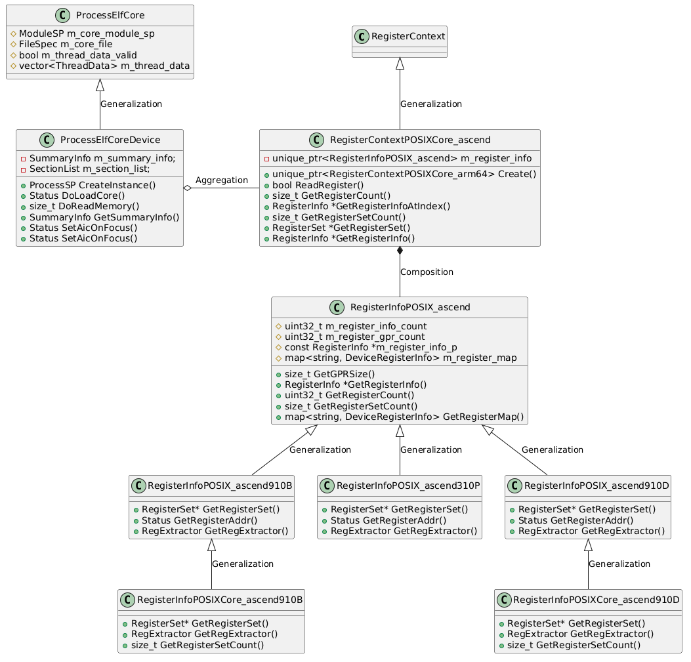
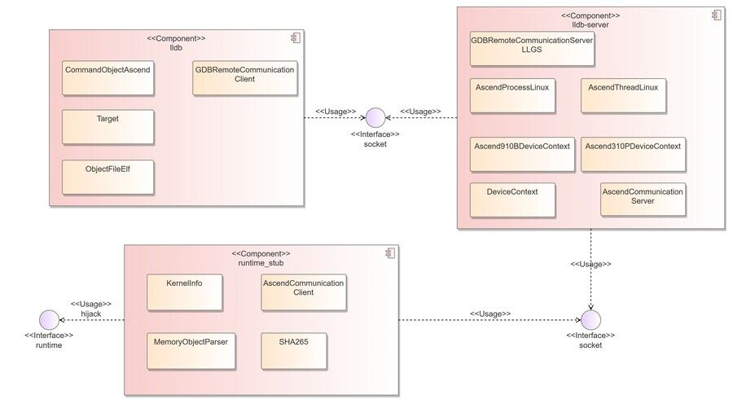
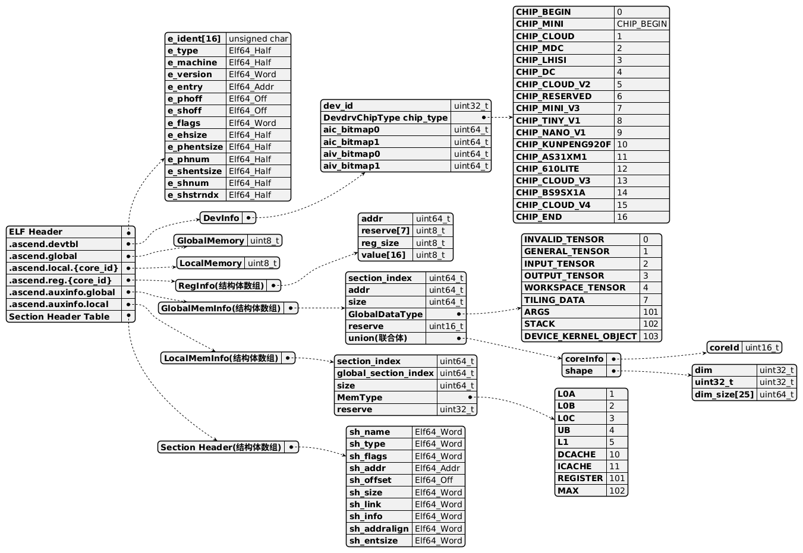
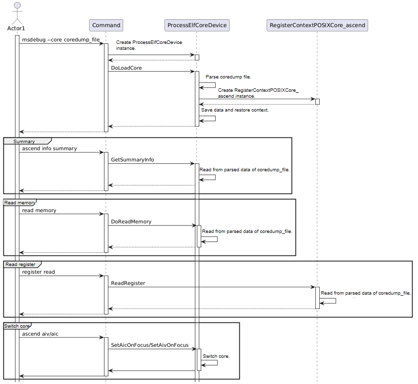
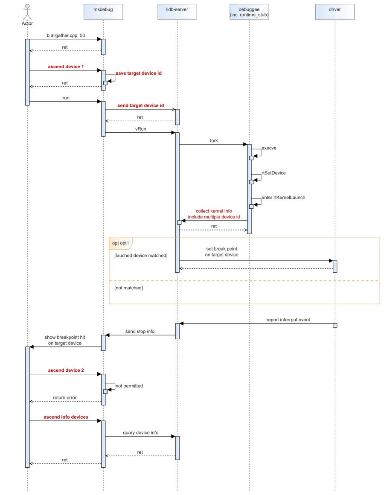

# MindStudio Debugger Architecture Design Specifications

## 1 Project Overview

The operator debugging function consists of three components: exception detection, function debugging, and performance tuning. Previously, the function debugging tool had only the simulation debugging capability, which resulted in inconsistent simulation and real results and poor performance. To address this issue, the operator debugging tool msDebug is designed. This document describes the module design of msDebug in detail, and specifies the main data structures and key processing procedures, serving as a guide for coding and testing personnel.

## 2. Function List

| Function          | Description     | 
|----------------|-------------------------------------------------|
| Analyzing coredump files| Loads coredump files, prints memory, register, and coredump summary information, switches cores, and displays call stacks.|
| Enabling debugging| Enables basic debugging functions in different operator integration scenarios.|

## 3. Software Design

### 3.1 Overall Objectives

1. Easy code extension: The register tables and memory types vary with chips. Therefore, the register operation and maintenance code and memory read code for new chip types shall be easy to extend. The debugging function can be easily extended in different operator integration scenarios.

2. Data consistency: Operator debugging depends on the data provided by the driver, RTS, and compiler. The accuracy and consistency of data must be ensured, and an exception handling mechanism must be in place for data errors.

3. Support for multiple operator calling modes: multi-operator, multi-process, and multi-thread calling.

4. Support for operator integration methods: Different operator integration methods are available, and runtime interfaces need to be hooked to adapt to multiple operator calling modes.

5. Compliance with open-source code: Modifications shall be based on the existing LLDB codebase. In accordance with the original workflow, implementation for Ascend devices shall be supplemented and added accordingly.

### 3.2 Key Element Design

| Key Element| Design Objective |
| -------- |---------------------------------------------------------------------------------------------------|
| Implementation model| Modifications shall be based on the existing LLDB codebase. In accordance with the original workflow, implementation for Ascend devices shall be supplemented and added accordingly. The register tables and memory types vary with chips. Therefore, the register operation and maintenance code and memory read code for new chip types shall be easy to extend.|
| Interaction model| The command-line instructions and options entered by users shall be correctly processed to implement the corresponding debugging functions, and normal information or error messages shall be displayed.  |

## 4. Development View

### 4.1 Implementation Model

#### 4.1.1 Coredump File Analysis Module

##### 4.1.1.1 Overview

This module uses the msDebug tool to load and analyze the coredump files generated when the AIC ERR crashes. This reduces the need for on‑site AIC ERR stress testing, improving the efficiency of hardware exception debugging.

##### 4.1.1.2 Context View



The coredump file analysis function involves multiple peripheral components, such as the debugger, driver, and RTS. The msDebug module is a debugger and is deployed in the CANN architecture.
The driver and RTS report the AIC ERR crash information based on the sqcp debugging channel, and the adump component generates the coredump file. You can use msDebug to load
coredump file for data analysis.

1. The original data of the coredump file is also obtained through the original sqcp debugging channel. Therefore, using msDebug to debug the operator program conflicts with generating the coredump file. They cannot be enabled at the same time.

2. The function of generating coredump files must be enabled for adump.

##### 4.1.1.3 Logical View



The software unit list is presented in the table format.

| Software Unit | Description | External Interface | Internal Interface | Relationship Description  |
|-----------------------|----------------|-----------------------|--------------------|---------------------------------|
| CommandObjectTarget   | Module for parsing core file loading command| --core   | /   | Parses the `--core` command, obtains the coredump file path, and calls the `DoLoadCore` API to execute the coredump file loading command. |
| CommandObjectMemory   | Module for parsing memory read command    | memory read    | /   | Parses the memory read command and calls the `DoReadMemory` API to execute various memory information printing commands.   |
| CommandObjectAscend   | Module for displaying information and parsing core switching command | ascend info summary, ascend aiv/aic| /     | Parses the Ascend command, calls the `GetSummaryInfo` API to execute the command for obtaining summary information, and calls the `SetAicOnFocus` or `SetAivOnFocus` API to execute the core switching command.  |
| CommandObjectRegister | Module for parsing register read command   | register read  | /   | Parses the register read command and calls the `ReadRegister` API provided by `RegisterContextCorePOSIX_ascend` to execute the register information read command.        |
| ProcessElfCoreDevice  | ELF core process module  | /     | LoadCore, ReadMemory, GetSummaryInfo, GetCoresInfo| Inherits the `ProcessElfCore` class and provides the APIs for loading coredump files, reading memory, obtaining coredump file information, switching cores, and obtaining core information. |
| RegisterContextCorePOSIX_ascend  | Register management module | /    | ReadRegister   | It is created by `ProcessElfCoreDevice` when a coredump is loaded and provides the register read API for `CommandObjectRegister` to call. The member variable is `RegisterInfoPOSIX_ascend`.|
| RegisterInfoPOSIX_ascend  | Register information module | /      | GetRegisterInfo  | As a member variable of `RegisterContextCorePOSIX_ascend`, it is used to store register information of various chip types.  |

##### 4.1.1.4 Software Implementation Unit Design

**Static structure diagram**



The register information class `RegisterInfoPOSIX_ascend` is implemented through polymorphism to facilitate the extension for subsequent chip types.

#### 4.1.2 Enabling Debugging

##### 4.1.2.1 Overview

msDebug allows you to start an application for debugging. Currently, application debugging can be enabled in various scenarios, such as single-operator, PyTorch multi-operator, and MC2 operator scenarios. To enable debugging, msDebug can obtain the debugging information of the operator kernel object binary segment and the dynamic delivery information of the operator at runtime.
If the debugging function is successfully enabled, a breakpoint is delivered at the correct time and the operator is suspended.

##### 4.1.2.2 Context View


The AscendC board debugging function involves multiple peripheral components such as the debugger, compiler, driver, and RTS. The debugging module msDebug is a debugger and is deployed in the CANN architecture. It works with the debugging information provided by the compiler, depends on the runtime dynamic library, and uses the driver interface provided by ts_debug.ko to deliver debugging commands to the TSFW on the device. Alternatively, it uses the PCIe interface to deliver breakpoint instructions to the device memory. After receiving the debugging notification, the TSFW triggers the corresponding DEBUGGER_API to enable the debugging function. After the debugging is complete, the TSFW returns the processing result to ts_debug.ko and returns a message to msDebug, completing a standard single-step debugging command stream on the board. By extending DEBUGGER_API, you can implement service functions such as breakpoint setting, resuming running, single-step running, memory reading, and register reading, and support the extension of new functions.

##### 4.1.2.3 Logical View

msDebug consists of the following three components, which communicate with each other using sockets.


##### 4.1.2.4 Software Implementation Unit Design

The LLDB module introduces an interface for parsing Ascend operator debug information and an interface for transmitting device-specific Ascend hardware state. The LLDB-server module implements a new abstract process class for Ascend operators, enabling debug features, and introduces a server-side interface to receive data from both the LLDB module and the runtime_stub module. The runtime_stub module implements runtime interface hooking for operator programs, providing runtime information for debugging enabling.



### 4.2 Interfaces

#### 4.2.1 Coredump File Analysis Module

##### 4.2.1.1 Overall Design

Provide a human-machine interface for the debugger to support coredump file analysis. The external interface can provide help information, and return failure information and correction suggestions when abnormal data is entered.

##### 4.2.1.2 List of External Interfaces

1. Provide the path of the msDebug coredump file to load the coredump file.

    ```bash
    msdebug --core coredump_file [ kernel.o | Executable file in fatbin format]
    ```

    Or

    ```bash
    msdebug
    (msdebug) target create --core coredump_file [ kernel.o | Executable file in fatbin format]
    ```

2. Print memory address information.

    ```bash
    (msdebug) memory read
    ```

3. Print register information.

    ```bash
    (msdebug) register read
    ```

4. Switch cores to view crash information of different core IDs, such as stack data.

    ```bash
    (msdebug) ascend aiv/aic id
    ```

5. Print coredump file information, including the device ID, device type, core ID, and tensor information.

    ```bash
    (msdebug) ascend info summary
    ```

6. Display the coredump code call stack.

    ```bash
    (msdebug) bt
    ```

    Example:

    ```bash
    (msdebug) target create --core "AddCustom.core"
    Core file 'AddCustom.core' (hiipu64) was loaded.
    [Switching to focus on CoreId 36, Type aiv]
    (msdebug) ascend info summary
    CoreId  CoreType           PC         DeviceId  ChipType
    *   0       AIV       0x12c04120062c       0        A2/A3
        1       AIV       0x12c04120062c       0        A2/A3
        2       AIV       0x12c04120062c       0        A2/A3

    Id           DataType                   MemType                     Addr                       Size             CoreId    CoreType          dim
    0    DEVICE_KERNEL_OBJECT                GM                   0x12c0c002e000                 182944             NA          NA              NA
    1            STACK                    GM/DCACHE               0x12c100230000                  32768             0          AIV              NA
    2      WORKSPACE_TENSOR                  GM                         0x0                         0               NA          NA              NA
    3         TILING_DATA                 GM/DCACHE               0x12c100240038                   16               NA          NA              NA
    4        OUTPUT_TENSOR                   GM                   0x12c0c0024000                  32768             NA          NA              [8, 2048]
    5        INPUT_TENSOR                    GM                   0x12c0c0012000                  32768             NA          NA              [8, 2048]
    6            ARGS                     GM/DCACHE               0x12c100240000                   96               NA          NA              NA
    ```

##### 4.2.1.3 List of Internal Interfaces

```cpp
Interface: ProcessElfCoreDevice::CreateInstance
Function: Creates a ProcessElfCoreDevice instance.
Input: lldb::TargetSP target_sp, lldb::ListenerSP listener_sp, const FileSpec *crash_file, bool can_connect
Output: none
Return: ProcessSP (ProcessElfCoreDevice instance)
Note: The `e_machine` field in the ELF header must be checked. The value must be `EM_ASCEND (0x1029)`.
```

```cpp
Interface: ProcessElfCoreDevice::DoLoadCore
Function: Loads the coredump file. This is an internal interface of ProcessElfCoreDevice and is called by CommandObjectTarget.
Input: none
Output: none
Return: Status (including the running result and error information)
Note: The function of parsing and saving section data needs to be implemented. Before parsing, security verification must be performed on the input file.
```

```cpp
Interface: ProcessElfCoreDevice::DoReadMemory
Function: This is an internal interface in ProcessElfCoreDevice and is called by CommandObjectMemory to read memory address information.
Input: lldb::addr_t addr, size_t size, Status &error, DeviceAddressClass address_class, ArchSpec arch_spec
Output: void *buf
Return: size_t (data length. If the value is 0, the read operation fails.)
Note: DeviceAddressClass needs to support the DCACHE and ICACHE types. DCACHE includes STACK, TILING DATA, and ARGS in GM.
```

```cpp
Interface: ProcessElfCoreDevice::GetSummaryInfo
Function: Reads the summary information related to the coredump file. This interface is called by CommandObjectAscend.
Input: none
Output: none
Return: SummaryInfo struct
Note: The SummaryInfo struct needs to be added to store the auxiliary information and memory data in the coredump file, and display the core ID, device ID, and tensor information.
```

```cpp
Interface: ProcessElfCoreDevice::ReadRegister
Function: Reads register information. This API is called by RegisterContextCorePOSIX_ascend and is called by CommandObjectRegister.
Input: RegisterInfo reg_info (register information)
Output: RegisterValue value (register data)
Return: bool (whether the read is successful)
Note: This interface must be used together with RegisterInfoPOSIX_ascend (for storing the register information table) and SummaryInfo (for storing the register data).
```

```cpp
Interface: ProcessElfCoreDevice::UpdateStopInfo
Function: Updates the stop information. It is used to display the stop reason information. By reading the error register, it displays which pipe (cube/ccu/mte/vec/fixp) is abnormal. This interface needs to be called after the ProcessElfCore and the corresponding thread are created. Only ObjectCommand can call this interface. This interface needs to be called each time SetAixOnFocus is called (during core switching) because the register values vary with cores.
Input: bool focus_known_error_core. Initial core switch must target a core_id capable of detecting pipe exceptions. If the user manually switches the core later, this parameter does not need to be set. The default value is false.
Output: none
Return: void
```

#### 4.2.2 Enabling Debugging

##### 4.2.2.1 Overall Design

The interface design must meet the requirements for enabling debugging in different scenarios. In addition, the interface must be easy to use for users to get started.

##### 4.2.2.2 Design Objectives

Command line interfaces (CLIs) are classified by function. The function scope provided by each interface must be clearly defined to cope with possible future expansion scenarios.
Flexible and scalable parameters should be reserved.

##### 4.2.2.3 Design Constraints

The interface design must meet the function requirements in the following scenarios:

1. Specifying an operator in a multi-operator scenario
2. Specifying a device for the MC2 operator

##### 4.2.2.4 Technology Selection

The external interface design is as follows:

Enabling debugging for a specified operator:

```bash
export LAUNCH_KERNEL_PATH=/path/my_kernel.o
```

Enabling debugging for a specified device:

Solution 1

```bash
(msdebug) ascend device $dev_id
```

Solution 2

```bash
export LAUNCH_DEVICE_ID=$dev_id
```

The core switching interfact after debugging is enabled is an msDebug internal command: `ascend aiv/aic $core_id`. To ensure the consistency of command design, solution 1 is used.

##### 4.2.2.5 Software Unit - LLDB Submodule

The LLDB command registration framework is used, and the `CommandObjectAscendDevice` class is added to implement the `ascend device $dev_id` command function.

```cpp
class CommandObjectAscendDevice : public CommandObjectParsed {
public:
  explicit CommandObjectAscendDevice(CommandInterpreter &interpreter)
      : CommandObjectParsed(interpreter, "ascend device",
                            "change the id of the focused ascend device.  "
                            "",
                            "ascend device <id>",
                            eCommandRequiresTarget);

  ~CommandObjectAscendDevice() override = default;

protected:
  bool DoExecute(Args &command, CommandReturnObject &result) override;
};
```

### 4.3 Data Model

#### 4.3.1 Coredump File Analysis Module

##### 4.3.1.1 Design Objectives

1. The data records are complete and can fully express the data of the program running when an AIC error occurs, helping users identify the fault.

2. The coredump file structure for the Ascend chip is designed based on the Linux coredump file structure definition rules and the coredump file.



##### 4.3.1.2 Key Fields

1. Data Type

| Field            | Description  |
|----------------|------|
| Elf64_Addr     | Bytes: 8|
| Elf64_Half     | Bytes: 2|
| Elf64_Off      | Bytes: 8|
| Elf64_Word     | Bytes: 4|
| unsigned char  | Bytes: 1|

2.ELF Header

| Field            | Description                                                                   |
|----------------|-----------------------------------------------------------------------|
| e_ident[EI_NIDENT]     | The first 16 bytes contain the identification flag of the ELF file and provide data to decode and parse the file, which is independent of the specific operating system. 7f 45 4c 46 02 01 01 00 00 00 00 00 00 00 00 00: The first four bytes indicate ELF, which is fixed. The functions of the following bytes are not specified and the same as those of the CPU. 33 07 is added after 01.|
| e_type     | Type of the target file.ET_CORE, 0x04 |
| e_machine     | Architecture to which the file applies. EM_ASCEND=0x1029.|
| e_version     | Version of the target file. Core file version number, which facilitates subsequent compatibility. The first version is 0x01.|
| e_entry     | Virtual address of the program entry.|
| e_flags     | Specific flags. The flag name complies with the "EF_machine_flag" format. For the Intel architecture, no flag is defined, so `e_flags` should be `0`.|
| e_ehsize     | Size of the ELF header, in bytes.|
| e_phoff    | Offset of the start of the program header table in the file. The coredump file does not have a program header table, so this value should be `0`.|
| e_shoff      | Offset of the start of the section header table in the file.|
| e_shentsize     | Size of each entry in the section header table, in bytes.  |
| e_shnum  | Total number of entries in the section header table.   |
| e_shstrndx  | Index of the entry in the section header table that corresponds to the section name table.   |
| e_shnum  | Total number of entries in the section header table.   |

3.Section Header

| Field          | Description                                              |
|--------------|--------------------------------------------------|
| sh_name      | Name of this section, which is an index number pointing to a location in the string table section. The location stores a string ending with '\0'. |
| sh_offset    | Location of this section. The value is the position of the first byte of the section in the file, that is, the offset relative to the beginning of the file, in bytes. |
| sh_size      | Size of the section, in bytes.                                    |
| sh_addralign | This member specifies how the contents of this section are aligned in bytes, that is, the address of this section should be aligned to how many bytes. 16-byte alignment.    |
| sh_entsize   | `.ascend.regs`: `sizeof(RegInfo)=16`; else, `0`.          |
| sh_link      | Index of the `.auxinfo.global section` in the section header table.|
| sh_info      | Index in the GlobalMemInfo structure array.                          |

4.sh_name

| Field            | Description                           |
|----------------|-------------------------------|
| .ascend.global   | Stores various continuous GM single-segment memories.                |
| .ascend.local.{core_id}   | Stores continuous memory of different types in each core.         |
| .ascend.regs.{core_id}    | Stores all register data of each core.             |
| .ascend.devtbl  | Stores global device information.                   |
| .ascend.auxinfo.global | Stores the description of the global memory section.|
| .ascend.auxinfo.local | Stores the description of each local memory section.|
| .ascend.host_kernel_object | Stores the kernel object data cached on the host.|
| .ascend.file_kernel_object | Stores the kernel object file data.|
| .ascend.file_kernel_json | Stores the kernel JSON file data.|

5.".ascend.devtbl"

| Field            | Description                                             |
|----------------|-------------------------------------------------|
| DevdrvChipType chip_type | Device type. Currently, `CHIP_CLOUD_V2` and `CHIP_CLOUD_V4` are supported.|
| uint64_t aic_bitmap0  | AI Cores used by the current kernel. If the bit is set to `1`, the AI Core is used.|
| uint64_t aic_bitmap1   |  |
| uint64_t aiv_bitmap0 |  |
| uint64_t aiv_bitmap1 |  |
| uint32_t dev_id | Device in use|

```cpp
enum DevdrvChipType : uint32_t {
    CHIP_BEGIN = 0,
    CHIP_MINI = CHIP_BEGIN,
    CHIP_CLOUD,
    CHIP_MDC,
    CHIP_LHISI,
    CHIP_DC,
    CHIP_CLOUD_V2 = 5,  // 910B/C
    CHIP_RESERVED = 6,
    CHIP_MINI_V3 = 7,
    CHIP_TINY_V1 = 8,
    CHIP_NANO_V1 = 9,
    CHIP_KUNPENG920F = 10,
    CHIP_AS31XM1 = 11,
    CHIP_610LITE = 12,
    CHIP_CLOUD_V3 = 13,
    CHIP_CLOUD_V4 = 14,
    CHIP_END
};
```

6.".ascend.reg.{core_id}"

| Field        | Description            |
|------------|----------------|
| addr       | Register address.         |
| reserve[7] | Reserved.          |
| reg_size   | Register size, in bytes.    |
| value[16]  | Register value. 32 bytes for A5. 128 bytes needs to be considered.|

7.".ascend.auxinfo.global"

```cpp
This section is an array of the GlobalMemInfo structure.

struct GlobalMemInfo {
    uint64_t addr; // Virtual address.
    uint64_t size; // Memory size.
    uint32_t section_index; // Corresponding .ascend.global section.
    GlobalDataType type; // The memory is of the input/output/workspace/stack type.
    uint16_t reserve;
    union {
        struct {
            uint16_t coreId;
        } coreInfo;                // The stack memory is distinguished by core.
        struct {
            uint32_t dim; // tensor shape
            uint32_t reserve;
            uint64_t dim_size[25];
        } shape;                    // Input or output.
    };
};

```

8.GlobalDataType

| Field       | Description              |
|-----------|------------------|
|  INVALID_TENSOR | Invalid vector.            |
| GENERAL_TENSOR | General vector.            |
| INPUT_TENSOR | Input vector.            |
| OUTPUT_TENSOR | Output vector.            |
| WORKSPACE_TENSOR | Workspace vector.     |
| TILING_DATA | Tiling data.        |
| ARGS | Parameters.              |
| DEVICE_KERNEL_OBJECT | Operator .o data in the GM on the device.|

9.".ascend.auxinfo.local"

| Field       | Description                                                                 |
|-----------|---------------------------------------------------------------------|
| section_index | Corresponding .ascend.local section                                          |
| global_section_index | Corresponding .ascend.global section. Only dcache is valid. dcache is classified into args, tiling data, and stack.|
| size | Memory size.                                                               |
| rtDebugMemoryType | Local memory type.              |

#### 4.3.2 Enabling Debugging

Data model design is not involved.

### 4.4 Security Implementation

#### 4.4.1 Security Design Objectives

> For new external input files, the following security protection measures must be taken: readability and executability, file size, file existence, file path length, non-soft link, and read-only permission for the `group` and `other` user groups. The owner must be the root user or the current user.

#### 4.4.2 Identification of High-Risk Modules

##### 4.4.2.1 Identification of High-Risk APIs

| High-risk API| Description               | Function Analysis         | Code Directory             | Language| Remarks|
|--------|---------------------|--------------------| ------------------------- |------| ---- |
| --core | Reads data from the input coredump file.| External input file verification and soft link attacks| CommandObjectTarget.cpp | C++  |      |

#### 4.4.3 Implementation of Security Defenses

**1. Security hardening for high-risk APIs**

For external file input, perform comprehensive ownership verification:
file existence verification, file read/write permission verification, and file quantity and size verification.
Soft link verification: Do not use symbolic links or protect against risks and exceptions caused by symbolic links.
Ownership verification: (for read commands or startup scripts) Ensure that the current input file can be owned only by the current process user (ruid) or the `root` user, and other users do not have the write permission. In this case, the target file is trusted.
For specific service scenarios, additional verification can be performed based on the actual service logic to further ensure that the input file is trusted.

**2. Error and exception handling**  
A robust error and exception handling mechanism ensures that the API terminates in a controlled manner under exceptional conditions and returns appropriate error information to the user.
Upon completion of the verification, if an error is detected, an error message is displayed, and a reasonable modification suggestion is provided.
For example, if the coredump file can be written by other users or groups, an error message is displayed:

> error: Risky action, "coredump file" is writable by any other users or groups.

#### 4.4.4 Code Security Protection

1. Input verification: Each command and augment input by the tool are verified. The verification logic must be added for any new input item.

2. Error handling: The system validates input file paths, permissions, symbolic links, illegal characters, write permission, and ownership. If the validation fails, the process terminates immediately.

3. Log audit: File paths must not be printed in logs. Error-level information must not be printed when the function is normal. In some loop logic, pay attention to log printing to avoid screen flooding.

### 4.5 Testing Model

#### 4.5.1 Core Dump File Analysis Module

Define the key element model for msDebug (supporting coredump file analysis) developer testing (DT) as a Layer 0 public design. This includes software testability design and layered testing strategies. It covers DT environments, test project design, general and domain-specific frameworks, and DFX testing for various layers.
  
##### 4.5.1.1 Design Constraints

Architectural design principles and constraints.

##### 4.5.1.2 Testability Design

UT: Covers all interfaces with 80% code line coverage and 60% branch coverage.

IT: Assembles and tests software units (functional modules) based on the high-level design (HLD) for modules, subsystems, and systems.

ST: Tests whether each complete function works correctly.

##### 4.5.1.3 Layered Testing

| Layer| Test Type     | Test Object                                   | Test Value|
|---|-----|-----------------------------------------| ---|
| UT    |    Unit test   | All internal functions and classes of the interfaces       | Verifies that the minimal implementation units work as expected.
| IT    | Integration test| Coredump file analysis module      | Verifies that the function of loading and analyzing coredump files using msDebug is normal.
| ST     |   System test| Operator crash, coredump file generation, and coredump file analysis using msDebug| Verifies that all features of this module operate normally across the complete end-to-end workflow.

##### 4.5.1.4 Key Testing Solutions

1. Test Project Design

    UT: gTest, and gMock for instrumentation.

2. Physical Design

    ST directory structure:

    ```bash
    lldb
    ├── test
    │    ├── API
    │    └── Shell
    │        └── Commands
    │            └── AscendCommandScriptImmediateOutput
    │                └── Coredump
    └────── Unit
    ```

    UT directory structure:

    ```bash
    lldb
    └── unittests
        └── Process
            ├── elf-core
            │    ├── ProcessElfCoreDeviceTest.cpp
            │    └──RegisterContextPOSIXCore_ascendTest.cpp
            └──Utility
                └── RegisterInfoPOSIX_ascendTest.cpp
    ```

3. Operating Environment

    ST must run on supported devices: Atlas A2 and A3 products

#### 4.5.2 Debugging Enablement

##### 4.5.2.1 Design Objectives

For new external input files, the following security protection measures must be taken: readability/executability, file size, file existence, file path length, non-symbolic link, `group` and `other` user groups not writable, and owner being `root` or the current user.

##### 4.5.2.2 Design Constraints

Comply with architecture design constraints.

##### 4.5.2.3 Designability Design

The LLVM framework provides the llvm-lit tool to facilitate the verification of command-line interaction commands. This tool is used to perform the ST of the msDebug tool.
The test case design is as follows.

|  Test Scenario                                                                      |  Test Scheme                                                                                         |  Expected Result               |
| --------------------------------------------------------------------------------- | ---------------------------------------------------------------------------------------------------- | -------------------------- |
|  Launching kernels directly from C++ using <<<>>> and packaging the operators in fatbin                                     |  Use a C++ project to compile a binary file and print and debug breakpoints and variables.                                              |  Breakpoint and variable printing are normal. |
|  Starting the operator encapsulated by aclnn using the Python PyTorch framework, with the operator file stored separately                       |  Starting the aclnn operator using Python PyTorch, manually importing operator debugging information, and performing breakpoint and variable printing debugging                    |  Breakpoint and variable printing are normal. |
|  Starting the operator encapsulated by <<<>>> using the Python PyTorch framework, with the operator packaged in a dynamic library                    |  Use Python PyTorch to start the <<<>>> operator and print and debug breakpoints and variables.                                         |  Breakpoint and variable printing are normal. |
|  Starting the operator encapsulated by aclnn using the Python PyTorch framework, with the operator packaged in a dynamic library                     |  Use Python PyTorch to start the aclnn operator and print and debug breakpoints and variables.                                          |  Breakpoint and variable printing are normal. |
|  Debugger failed to open driver                                                            |  After removing the driver device node, use a C++ project to compile a binary file and print and debug breakpoints and variables.                          |  An exception is thrown after running, and debugging is terminated. |
|  Runtime library interface function pointer acquisition failure                                                 |  After moving the runtime library file, use a C++ project to compile a binary file and print and debug breakpoints and variables.                     |  An exception is thrown after running, and debugging is terminated. |
|  Driver initialization debug enablement failure                                                    |  After using an older driver package, use a C++ project to compile a binary file and print and debug breakpoints and variables.                          |  An exception is thrown after running, and debugging is terminated. |
|  Operator runtime information retrieval failure                                                        |  Use a C++ project to compile a binary file and print and debug breakpoints and variables. Use `pcStartAddr` to obtain the function. Construction fails.           |  An exception is thrown after running, and debugging is terminated. |
|  Debugging using an occupied device                                                  |  Use a C++ project to compile a binary file and print and debug breakpoints and variables. Do not exit. Restart the process and print and debug breakpoints and variables again.    |  An exception is thrown after running, and debugging is terminated. |
|  Dependent CANN environment variables not found                                                      |  Manually clear the value of the environment variable `\$ASCEND\_TOOLKIT\_HOME`, use a C++ project to compile a binary file, and print and debug breakpoints and variables. |  An exception is thrown after running, and debugging is terminated. |
|  Starting multiple operators encapsulated by aclnn using the Python PyTorch framework, with the operator files stored separately, and specifying a specific operator for debugging |  Starting the aclnn operator using Python PyTorch, manually importing operator debugging information, and performing breakpoint and variable printing debugging                    |  Breakpoint and variable printing are normal. |
|  Starting the operator encapsulated by aclnn using the Python PyTorch framework, with the operator packaged in a dynamic library, and specifying a specific operator for debugging   |  Starting the aclnn operator using Python PyTorch, manually importing operator debugging information, and performing breakpoint and variable printing debugging                    |  Breakpoint and variable printing are normal. |

##### 4.5.2.4 Layered Testing

| Layer | Test Type | Test Object | Test Value |
| ST | Smoke test | msDebug | Verify the end-to-end functions of the tool. |
| UT | Unit test | AscendProcessLinux | Verify that the functions of the Ascend process abstract class are correct. |

##### 4.5.2.5 Key Testing Solutions

1. Test engineering technology
   In the LLVM project, the llvm-lit test framework is used to perform smoke tests and end-to-end verification of LLDB functions. This framework can also be used to maintain the msDebug functions.
2. Physical design
   Test cases are stored in the `test` directory, which is independent of the service code directory. They are stored separately based on different operator calling scenarios.

   ```bash
   $ tree ./test/Shell/Commands/AscendCommandScriptImmediateOutput
   ./test/Shell/Commands/AscendCommandScriptImmediateOutput
   ├── AddAclnn
   │   ├── command-ascend-breakpoint.test
   │   ├── command-ascend-info.test
   │   ├── command-ascend-readmemory.test
   │   └── command-ascend-readregister.test
   ├── AddKernelInvocation
   │   ├── command-ascend-breakpoint.test
   │   ├── command-ascend-info.test
   │   ├── command-ascend-readmemory.test
   │   └── command-ascend-readregister.test
   ├── AddKernelInvocationNeo
   │   ├── command-ascend-breakpoint.test
   │   ├── command-ascend-info.test
   │   ├── command-ascend-readmemory.test
   │   └── command-ascend-readregister.test
   ├── br_test_suites_gen.py
   ├── Coredump
   │   ├── command-coredump-add.test
   │   └── command-coredump-gather.test
   ├── MatmulAclnn
   │   ├── command-ascend-breakpoint.test
   │   ├── command-ascend-info.test
   │   ├── command-ascend-readmemory.test
   │   └── command-ascend-readregister.test
   ├── MatMulInvocationNeo
   │   ├── command-ascend-breakpoint.test
   │   ├── command-ascend-info.test
   │   ├── command-ascend-readmemory.test
   │   └── command-ascend-readregister.test
   ├── MatMulLeakyReluAclnn
   │   ├── command-ascend-breakpoint.test
   │   ├── command-ascend-info.test
   │   ├── command-ascend-readmemory.test
   │   └── command-ascend-readregister.test
   ├── MatMulLeakyReluInvocation
   │   ├── command-ascend-breakpoint.test
   │   ├── command-ascend-info.test
   │   ├── command-ascend-readmemory.test
   │   └── command-ascend-readregister.test
   └── op_precision_test
       ├── prepare_env.sh
       ├── run_test_cases.sh
       ├── test_case_add_framework_aclnn.sh
       ├── test_case_add_kernel_invocation_neo.sh
       ├── test_case_add_kernel_invocation.sh
       ├── test_case_flash_attention_score_singe_tiling.sh
       ├── test_case_matmul_framework_aclnn.sh
       ├── test_case_matmul_kernel_invocation_neo.sh
       ├── test_case_matmul_kernel_invocation.sh
       ├── test_case_matmul_leakyrelu_framework_aclnn.sh
       └── test_case_matmul_leakyrelu_kernel_invocation.sh
   ```

3. Operating environment
   The operating environment depends on the Ascend hardware.
4. Data construction design
   Use real data to implement component or end-to-end acceptance tests.

## 5. Runtime View

### 5.1 Interaction Model

#### 5.1.1 Analyzing Coredump Files



The commands entered by users are passed to different command parsing classes, and the commands are executed through the process management class and register management class to obtain the coredump file data.

#### 5.1.2 Enabling Debugging

The following figure shows the interaction process of enabling debugging for a specified operator. The binary segment and runtime information of the operator kernel object are obtained, and the debugging function is enabled before the operator kernel is executed.
Debugging can be performed on a specified operator. The following concepts need to be defined:

(1) Unique ID of the operator kernel;
(2) Determining the operator kernel to be enabled;
(3) Timing for enabling debugging of a specific operator kernel;

First, use an encryption algorithm (such as SHA256) to perform hash calculation on the operator kernel object file to obtain a unique hash value to identify the operator kernel. The reason for not using the file system path of the operator kernel file as the identifier is that it cannot be ensured that the name is different from that of other operator kernel objects.

Second, the method for determining which operator kernel to enable is as follows: When the breakpoint location set by the user matches the debugging information in the operator kernel object, we consider that the user expects to enable the kernel. When multiple breakpoints match different operator kernels, the kernel corresponding to the last breakpoint is used as the operator kernel to be enabled. In this way, theoretically, after debugging an operator kernel, the user can set a breakpoint for the next operator kernel to continue the debugging.

Finally, the timing for enabling debugging of a specific operator kernel depends on the timing for setting the device breakpoint. The debugger needs to intercept a series of interfaces such as `rtKernelLaunch()`. Before each operator kernel calls this function, the debugger is notified of the ID of the operator kernel to be called. If the ID matches the operator kernel specified by the user, the debugger configures the device breakpoint based on the runtime information of the operator kernel. After the configuration is complete, the debugger instructs the operator kernel to continue running until the breakpoint is hit.


The following figure shows the interaction process of enabling debugging for a specified device.


