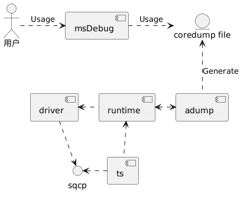
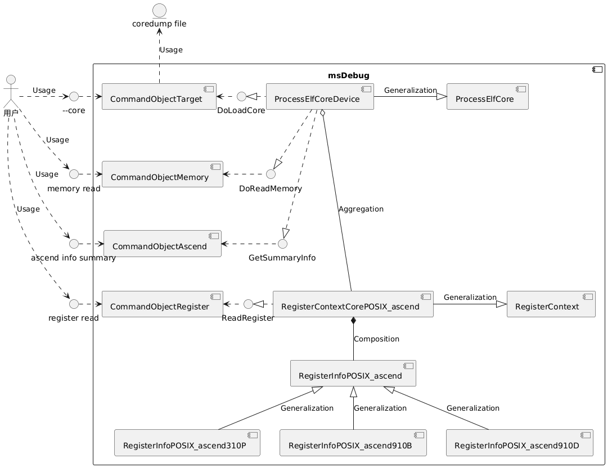
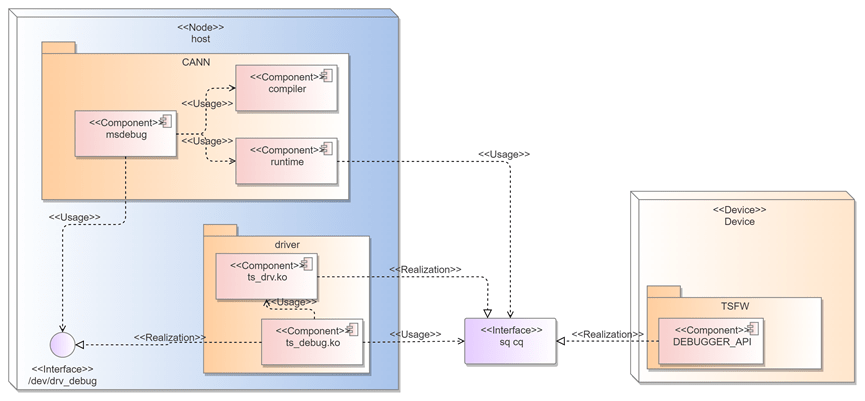
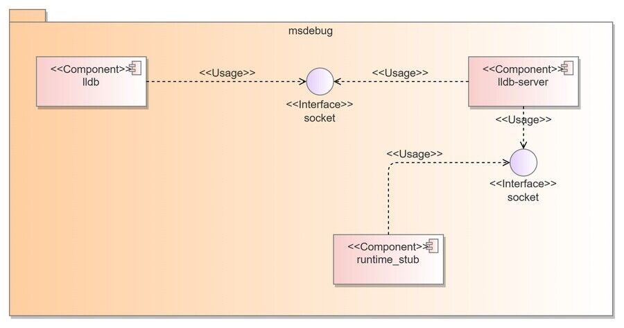
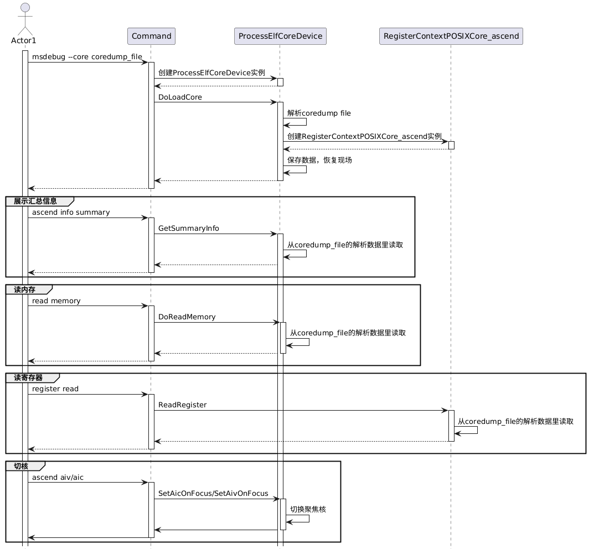
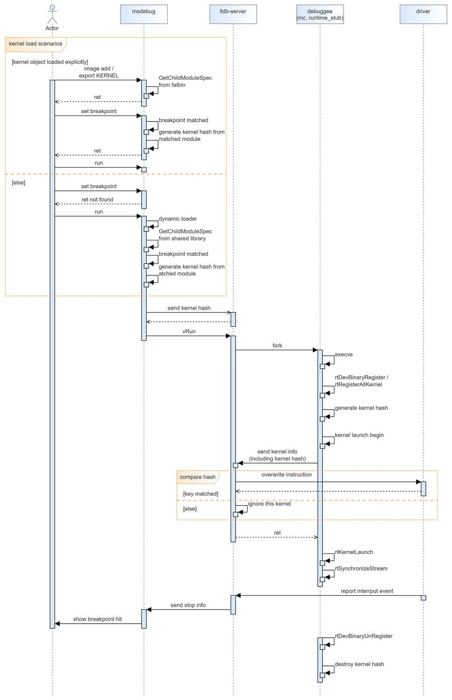

# MindStudio Debugger Architecture design manual

## 1 Project overview

The operator debugging function itself includes three components: anomaly detection, functional debugging, and performance tuning.Previously, functional debugging tools only had simulation debugging capabilities, and there were problems that the simulation was inconsistent with the real results and the performance was poor.In view of this problem, the operator debugging tool msDebug is designed.This article will introduce the module design of msDebug in detail, clarify the main data structure and main processing process, and serve as a guide for future coders and testers.

## 2. Feature list

| Function list | Function description | 
|----------------|-------------------------------------------------|
| Support coredump file analysis | Mainly used to load coredump files, and provide functions to print memory, registers, coredump summary information, cut cores, and view the call stack |
| Support debugging and enable | Enable basic debugging functions in different operator access scenarios |

## 3.Software design

### 3.1 Analysis of overall design goals

1. Easy code expansion: Due to differences in register tables, memory types and other information of different chips, it is easy to expand the development of register operation and maintenance codes for new chip types and codes related to reading memory data.It is easy to extend the debugging enable function in different operator access scenarios.

2. Data consistency: Operator debugging depends on the data provided by the driver, rts, and compiler. It is necessary to ensure the accuracy and consistency of the data display, and there is an exception handling mechanism when the data is wrong.

3. Support multiple operator invocation methods: multi-operator invocation, multi-process invocation, and multithreaded invocation.

4. Support for operator access methods: Different operator access methods are different, and the hijacking of the runtime interface needs to be adapted to a variety of operator call methods.

5. Follow the open source code: modify it based on the original code of lldb, and supplement it with reference to the original process to increase the implementation of Shengteng equipment.

### 3.2 Key element design

| Key elements | Design objectives |
| -------- |---------------------------------------------------------------------------------------------------|
| Implementation model | Modify based on the original code of lldb, and refer to the original process to supplement and increase the implementation for Shengteng equipment.Due to the differences in the register tables, memory types and other information of different chips, it is easy to develop and expand the register operation and maintenance code of the new chip type and the code related to reading memory data. |
| Interaction model / It is necessary to correctly handle the command line instructions and parameters entered by the user, realize the corresponding debugging functions, and echo normal information or prompt error messages.   |

## 4.Development view

### 4.1 Implementation model

#### 4.1.1 Support coredump file analysis module

##### 4.1.1.1 overview

The main function of this module is based on the coredump file generated when the AIC ERR crashes, and uses the msDebug tool to load the file and analyze the data, thereby reducing the user's on-site AIC ERR pressure measurement requirements and improving the efficiency of locating hardware anomalies.

##### 4.1.1.2 Context view



Support coredump file analysis function, involving multiple peripheral components such as debugger, driver, RTS, etc.This debugging module msDebug belongs to the debugger and is deployed in the CANN architecture element.
Among them, the driver and rts are based on the AIC ERR crash information reported by the sqcp debugging channel, and the adump component generates a coredump file.Users can use msDebug to load
coredump files for data analysis.

1. The acquisition of the original data of the coredump file also depends on the original sqcp debugging channel, so there is a conflict between using the msDebug debugging operator program and generating the coredump file, and it cannot be opened at the same time.

2. adump to enable the coredump file generation function, a switch is required to be turned on.

##### 4.1.1.3 Logical view



Output a list of software units in tabular form：

| Software unit | Description | External interface | Internal interface | Relationship description |
|-----------------------|----------------|-----------------------|--------------------|---------------------------------|
| CommandObjectTarget /core file loading command parsing module | --core | / / Parse the--core command, get the coredump file path, and call the DoLoadCore interface to execute the coredump file loading command |
| CommandObjectMemory | Memory read command parsing module | memory read | / / Parse the memory read command, call the DoReadMemory interface to execute various memory information printing commands |
| CommandObjectAscend | Information display, kernel-cutting command parsing module /ascend info summary, ascend aiv/aic | / / Parse the ascend command, call the GetSummaryInfo interface to execute the command to obtain summary information, and call the SetAicOnFocus /SetAivOnFocus interface to execute the kernel-cutting command |
| CommandObjectRegister | Register read command parsing module | register read | / / Parse the register read command, call the ReadRegister interface provided by RegisterContextCorePOSIX_ascend to execute the register information reading command |
| ProcessElfCoreDevice | elf core process module | / / LoadCore, readMemory, GetSummaryInfo, GetCoresInfo / inherits the ProcessElfCore class and provides the interface for loading coredump files, memory reading interface, coredump file information acquisition interface, kernel cutting interface, and kernel information acquisition |
| RegisterContextCorePOSIX_ascend / Register management module | / / ReadRegister | is created by ProcessElfCoreDevice when coredump is loaded, and provides a register reading interface for CommandObjectRegister to call. The member variables are RegisterInfoPOSIX_ascend |
| RegisterInfoPOSIX_ascend | Register information module | / / GetRegisterInfo / As a member variable of RegisterContextCorePOSIX_ascend, it is used to store register information of various chip types |

##### 4.1.1.4 Software implementation unit design

**Static structure diagram**


The register information class RegisterInfoPOSIX_ascend is implemented through polymorphism to facilitate the expansion of subsequent chip types.

#### 4.1.2 Support debugging and enable

##### 4.1.2.1 Overview

msDebug supports starting applications for debugging. It now supports application debugging and enabling in a variety of different scenarios, such as single operator, PyTorch multi-operator, and MC2 operator.In order to enable debugging, msDebug supports obtaining the debugging information of the binary segment of the operator kernel object, and dynamically sending information to the runtime operator.
The success sign of enabling the debugging function is: a breakpoint is issued at the right time and the operator hits the breakpoint.

##### 4.1.2.2 Context view



The debugging function of AscendC on-board involves multiple peripheral components such as the debugger, compiler, driver, and RTS. This debugging module msDebug belongs to the debugger and is deployed in the CANN architecture element. It cooperates with the debugging information provided by the compiler, relies on the runtime dynamic library, and uses ts_debug.The driver interface provided by ko issues debugging commands to the TSFW on the device side, or uses the PCIe interface to issue breakpoint commands to the device side memory. After TSFW receives the debugging notification, it triggers the corresponding DEBUGGER_API to enable the debugging function, and after completing the debugging, it sends a breakpoint command to ts_debug.ko returns the processing result and returns a message to msDebug to complete a standard one-step debugging command flow on the board.Through the extension of DEBUGGER_API, business functions such as breakpoint setting, recovery operation, single-step operation, memory reading, and register reading can be realized separately, and the expansion of new functions can be supported.

##### 4.1.2.3 Logical view

msDebug is internally composed of the following three components, and communication between components is implemented using socket.



##### 4.1.2.4 Software implementation unit design

The lldb module adds a debugging information analysis interface for the ascend operator, and the communication interface is added and extended to transmit ascend device information; the lldb-server module adds an abstract class for the ascend operator process to realize the debugging enable function, and the communication server-side interface is added to receive the information sent by the lldb and runtime_stub modules; the runtime_stub module implements the operator program runtime interface hijacking function to provide runtime information for enabling debugging.


### 4.2 interface

#### 4.2.1 Support coredump file analysis module

##### 4.2.1.1 Overall design

Provides a human-computer interaction interface for a debugger to support coredump file analysis.The external interface can provide help information, and return failure information and correction suggestions when entering abnormal data.

##### 4.2.1.2 External interface list

1、Provide the path address of the msDebug coredump file to load the coredump file

```bash
msdebug --core coredump_file [ kernel.o | <fatbin Executable file in format> ]
```

或

```bash
msdebug
(msdebug) target create --core coredump_file [ kernel.o | <fatbin Executable file in format> ]
```

2、Used to print memory address information

```bash
(msdebug) memory read
```

3、Used to print register information

```bash
(msdebug) register read
```

4、Used to check and see the crash information of different core ids, such as stack data

```bash
(msdebug) ascend aiv/aic id
```

5、For printing coredump file information，Contains device id、Device type、core id、tensor information

```bash
(msdebug) ascend info summary
```

6、For display coredump code call stack

```bash
(msdebug) bt
```

示例：

```bash
(msdebug) target create --core "AddCustom.core"
Core file 'AddCustom.core' (hiipu64) was loaded.
[Switching to focus on CoreId 36, Type aiv]
(msdebug) ascend info summary
  CoreId  CoreType           PC         DeviceId  ChipType
 *   0       AIV       0x12c04120062c       0        A2/A3
     1       AIV       0x12c04120062c       0        A2/A3
     2       AIV       0x12c04120062c       0        A2/A3

  Id           DataType                   MemType                     Addr                       Size             CoreId    CoreType          dim
   0    DEVICE_KERNEL_OBJECT                GM                   0x12c0c002e000                 182944             NA          NA              NA
   1            STACK                    GM/DCACHE               0x12c100230000                  32768             0          AIV              NA
   2      WORKSPACE_TENSOR                  GM                         0x0                         0               NA          NA              NA
   3         TILING_DATA                 GM/DCACHE               0x12c100240038                   16               NA          NA              NA
   4        OUTPUT_TENSOR                   GM                   0x12c0c0024000                  32768             NA          NA              [8, 2048]
   5        INPUT_TENSOR                    GM                   0x12c0c0012000                  32768             NA          NA              [8, 2048]
   6            ARGS                     GM/DCACHE               0x12c100240000                   96               NA          NA              NA
```

##### 4.2.1.3 Internal interface list

```cpp
Interface name: ProcessElfCoreDevice::CreateInstance
Interface function: Create a ProcessElfCoreDevice instance
Input parameter name: lldb:: TargetSP target_sp, lldb:: ListenerSP listener_sp, const FileSpec * crash_file, bool can_connect
Output parameter name: none
Return value: ProcessSP (ProcessElfCoreDevice instance)
Note: You need to make a special judgment on the e_machine field in the elf header, which is EM_ASCEND (0x1029)
```

```cpp
Interface name: ProcessElfCoreDevice::DoLoadCore
Interface function: load the Coredump file, the internal interface in ProcessElfCoreDevice, called by CommandObjectTarget
Input parameter name: None
Output parameter name: none
Return value: Status (including whether the operation was successful and error information)
Precautions: The function of parsing and saving section data needs to be implemented, and the input file needs to be safely verified before parsing.
```

```cpp
Interface name: ProcessElfCoreDevice::DoReadMemory
Interface function: The internal interface in ProcessElfCoreDevice is called by CommandObjectMemory to read memory address information
Input parameter name: lldb:: addr_t addr, size_t size, Status & error, DeviceAddressClass address_class, ArchSpec arch_spec
Output parameter name: void *buf
Return value: size_t (returns data length information, if 0 is a read failure)
Note: DeviceAddressClass needs to add support for DCACHE and ICACHE types. DCACHE also includes STACK, TILING DATA, and ARGS in GM.
```

```cpp
Interface name: ProcessElfCoreDevice::GetSummaryInfo
Interface function: read the summary information related to the coredump file and be called by CommandObjectAscend
Input parameter name: None
Output parameter name: none
Return value: SummaryInfo structure
Note: The definition of the SummaryInfo structure needs to be added to save auxiliary information and memory data information in the coredumpfile, and to display core id, device id, tensor information, etc.
```

```cpp
Interface name: ProcessElfCoreDevice::ReadRegister
Interface function: read register information, the interface of RegisterContextCorePOSIX_ascend, called by CommandObjectRegister
Input parameter name: RegisterInfo reg_info (register information)
Output parameter name: RegisterValue value (register data)
Return value: bool (whether it was read successfully)
Precautions: It is necessary to cooperate with RegisterInfoPOSIX_ascend, which stores the register information table, and SummaryInfo, which stores the register data.
```

```cpp
Interface name: ProcessElfCoreDevice::UpdateStopInfo
Interface function: Update the cause information of the coredump location.The main purpose here is to display the stop reason information. By reading the Error register, it shows which pipe (cube/ccu/mte/vec/fixp) is abnormal.When ProcessElfCore and the corresponding thread are created to be called, only ObjectCommand can be called here; SetAixOnFocus (when the core is cut) must be called every time, because the register values of different cores are different.
Enter the parameter name: bool focus_known_error_core, you need to cut the core to a core_id that can know the pipe exception at the beginning; subsequent users do not need to set it manually, the default is false
Output parameter name: none
Return value: void
```

#### 4.2.2 Support debugging and enable

##### 4.2.2.1 Overall design

The interface design should meet the functional requirements of debugging and enabling in different scenarios, and at the same time, the interface is easy to use and reduces the difficulty for users to get started.

##### 4.2.2.2 Design goals

The command-line interface is divided according to its functions, and the scope of functions provided by the interface should be clearly defined. At the same time, in order to cope with possible future expansion scenarios,
Reserve flexible and scalable parameters.

##### 4.2.2.3 Design constraints

The interface design should meet the functional requirements of the following scenarios：

1. Multi-operator scene specifies the operator
2. The MC2 operator needs to specify an additional device

##### 4.2.2.4 Technical selection

The external interface design is as follows：

Specify operator debugging to enable：

```bash
export LAUNCH_KERNEL_PATH=/path/my_kernel.o
```

Specify device debugging to enable：

Option 1：

```bash
(msdebug) ascend device $dev_id
```

Option 2：

```bash
export LAUNCH_DEVICE_ID=$dev_id
```

Because the kernel cut after debugging is enabled is designed as an internal command of msDebug：ascend aiv/aic $core_id ，In order to maintain the unity of the command design, scheme 1 is adopted.

##### 4.2.2.5 Software unit-LLDB submodule

Follow the LLDB command registration framework and add `CommandObjectAscendDevice` Class implementation `ascend device $dev_id` Command function.

```cpp
class CommandObjectAscendDevice : public CommandObjectParsed {
public:
  explicit CommandObjectAscendDevice(CommandInterpreter &interpreter)
      : CommandObjectParsed(interpreter, "ascend device",
                            "change the id of the focused ascend device.  "
                            "",
                            "ascend device <id>",
                            eCommandRequiresTarget);

  ~CommandObjectAscendDevice() override = default;

protected:
  bool DoExecute(Args &command, CommandReturnObject &result) override;
};
```

### 4.3 Data model

#### 4.3.1 Support coredump file analysis module

##### 4.3.1.1 Design goals

1、The integrity of the data record can fully express the data of the program operation site when the AIC ERR occurs, and help users comprehensively locate the problem.

2、follow Linux coredump file structure definition rules, refer to coredump file, designed to be suitable for Shengteng chipcoredump File structure.


##### 4.3.1.2 Key field description

1.Data type

| Field | Description |
|----------------|------|
| Elf64_Addr     | Number of bytes 8 |
| Elf64_Half     | Number of bytes 2 |
| Elf64_Off      | Number of bytes 8 |
| Elf64_Word     | Number of bytes 4 |
| unsigned char  | Number of bytes 1 |

2.ELF Header

| Field | Description |
|----------------|-----------------------------------------------------------------------|
|e_ident[EI_NIDENT] | These 16 bytes at the beginning contain the identification mark of the ELF file, and provide some data for decoding and parsing the contents of the file, which does not depend on the specific operating system. `7f 45 4c 46 02 01 01 00 00 00 00 00 00 00 00` The first 4 digits of 00 indicate ELF, fixed.The specific uses of the latter few are not yet clear, and they should be consistent with the cpu.Added 33 07 after 01 |
|e_type | This field indicates which type this target file belongs to.ET_CORE, 0x04 |
| e_machine | This field is used to specify the architecture applicable to the file, EM_ASCEND=0x1029 |
| e_version | This field indicates the version of the target file.The core file version number is convenient for subsequent compatibility. The first version is 0x01 |
| e_entry | This field indicates the virtual address of the program entry. |
| e_flags | This field contains specific flags.The name of the logo conforms to the format of ”EF_machine_flag”.For Intel architecture, it does not define any flags, so e_flags should be 0. |
| e_ehsize | This field indicates the size of the ELF file header, in bytes. |
| e_phoff | This field indicates the offset of the program header table in the file at the beginning of the program header table. The Coredump file does not have a program header table. This value should be set to 0 |
| e_shoff | This field indicates the offset of the section header table in the file at the beginning of the section header table |
| e_shentsize | This field indicates the size of each entry in the header table, in bytes |
| e_shnum | This field indicates how many entries are in the header table in total |
| e_shstrndx | Index of entries corresponding to the section name table in the section header table |
| e_shnum | This field indicates how many entries are in the header table in total |

3.Section Header

| Field | Description |
|--------------|--------------------------------------------------|
| sh_name      |The name of this section is an index number that points to a certain location in the ”String Table" section, where a string ending in ’\0’ is stored |
| sh_offset    | Indicates the location of this section. This value is the location of the first byte of the section in the file, that is, the offset relative to the beginning of the file, in bytes |
| sh_size      | Specify the size of the section in bytes |
| sh_addralign | This member indicates how the content of this section is aligned with bytes, that is, how many bytes the address of this section should be aligned to, 16-byte alignment |
| sh_entsize   | .ascend.regs Valuable sizeof(RegInfo)=16，Other segments are 0           |
| sh_link      | .auxinfo.global section in section header table index in |
| sh_info      | GlobalMemInfo index in the structure array                         |

4.sh_name

| Field | Description |
|----------------|-------------------------------|
| .ascend.global   | Store various continuous gm single-segment memory |
| .ascend.local.{core_id}   | Store continuous memory of different memory types in each core |
| .ascend.regs.{core_id}    | Store all register data of each core |
| .ascend.devtbl  | Store global device information data |
| .ascend.auxinfo.global | Storage pair global memory section description information |
| .ascend.auxinfo.local | Store each local memory section description information |
| .ascend.host_kernel_object | store host on the cache kernel object data |
| .ascend.file_kernel_object | store kernel object file data |
| .ascend.file_kernel_json | store kernel json file data |

5.".ascend.devtbl"

| Field | Description |
|----------------|-------------------------------------------------|
| DevdrvChipType chip_type | Device type, currently supported CHIP_CLOUD_V2和CHIP_CLOUD_V4 |
| uint64_t aic_bitmap0  | 当前kernel用了哪些ai core，bit位置1表示用了 |
| uint64_t aic_bitmap1   |  |
| uint64_t aiv_bitmap0 |  |
| uint64_t aiv_bitmap1 |  |
| uint32_t dev_id | 使用的设备|

```cpp
enum DevdrvChipType : uint32_t {
    CHIP_BEGIN = 0,
    CHIP_MINI = CHIP_BEGIN,
    CHIP_CLOUD,
    CHIP_MDC,
    CHIP_LHISI,
    CHIP_DC,
    CHIP_CLOUD_V2 = 5,  // 910B/C
    CHIP_RESERVED = 6,
    CHIP_MINI_V3 = 7,
    CHIP_TINY_V1 = 8,
    CHIP_NANO_V1 = 9,
    CHIP_KUNPENG920F = 10,
    CHIP_AS31XM1 = 11,
    CHIP_610LITE = 12,
    CHIP_CLOUD_V3 = 13,
    CHIP_CLOUD_V4 = 14,
    CHIP_END
};
```

6.".ascend.reg.{core_id}"

| Field | Description |
|------------|----------------|
| addr | register address |
| reserve[7] / reserved field |
| reg_size | Register size in bytes |
|value[16] / Register value, considering the case of 128 bits, A5 is 32 bytes |

7.".ascend.auxinfo.global"

```cpp
此section为GlobalMemInfo 结构体数组

struct GlobalMemInfo {
    uint64_t addr; // 虚拟地址
    uint64_t size;  // 内存大小
    uint32_t section_index; // 对应哪个.ascend.global section
    GlobalDataType type; // 内存是input/output/workspace/stack等类型
    uint16_t reserve;
    union {
        struct {
            uint16_t coreId;
        } coreInfo;                // stack 类型的内存区分不同core
        struct {
            uint32_t dim; // tensor shape
            uint32_t reserve;
            uint64_t dim_size[25];
        } shape;                    // input、output
    };
};

```

8.GlobalDataType

| Field | Description |
|-----------|------------------|
| INVALID_TENSOR | Invalid vector |
| GENERAL_TENSOR | UNIVERSAL vector |
| INPUT_TENSOR / Input vector |
| OUTPUT_TENSOR / Output vector |
| WORKSPACE_TENSOR | workspace vector |
| TILING_DATA | tiling data |
| ARGS | Parameters |
| DEVICE_KERNEL_OBJECT / device side GM middle operator.o data |

9.".ascend.auxinfo.local"

| Field | Description |
|-----------|---------------------------------------------------------------------|
| section_index | Which one corresponds to .ascend.local section                                           |
| global_section_index | Which one corresponds to .ascend.global section，Only dcache is valid，dcache points args、tiling data、stack |
| size | Memory size                                                                |
| rtDebugMemoryType | local memory Memory type               |

#### 4.3.2 Support debugging and enable

Does not involve data model design.

### 4.4 Safety implementation design

#### 4.4.1 Safety design objectives

> To add external input files, the following security protections are required: readability and executable, file size, file existence, file path length, non-soft links, roup and other user groups are not writable, and the owner is root or the current user

#### 4.4.2 Identification of high-risk modules

##### 4.4.2.1 High-risk API identification

| High-risk API | Interface description | High-risk interface function analysis | corresponding code directory | Language type | Remarks |
|--------|---------------------|--------------------| ------------------------- |------| ---- |
| --core | Enter the coredump file and read the data in it | consider external input file verification operations, soft link attacks | CommandObjectTarget.cpp | C++  |      |

#### 4.4.3 Code implementation security prevention processing

**1. High-risk API security reinforcement**

For external file input, perform sufficient ownership verification：
File existence verification, file read and write and other usage rights verification, file quantity and size verification
Soft link verification: It is forbidden to use soft links or there is a risk of soft links and abnormal scenarios for protection
Ownership verification: (For reading commands or starting script scenarios) Generally, it is necessary to ensure that the current input file can only be owned by the current process user (ruid) or root, and other user permissions do not include write permissions. At this time, the target file is trusted.
For specific business scenarios, additional verification can be performed according to the actual business logic to further ensure that the input files are credible.

**2. Error and exception handling**
Reasonable error and exception handling mechanisms can ensure that the API can be terminated in a controlled manner under abnormal circumstances, and appropriate error messages are returned to the user.
After the verification is completed, an error is found, an error message is prompted, and reasonable suggestions for modification are given.
If the coredump file is found to be written by other users or groups, an error will be given：

> error: Risky action, "coredump file" is writable by any other users or groups.

#### 4.4.4 Code implementation security prevention processing

1.Entry verification: Every command and entry parameter entered by the tool will be verified, and any subsequent new input items need to supplement the verification logic.

2.Error handling: If it will verify the path, permissions, whether the input file is a soft link, whether it contains illegal characters, whether it is writable, whether it belongs to the group, and whether the owner is correct.If the verification fails, the process exits without subsequent operations.

3.Log audit: It is forbidden to print the file path in the current log, and ERROR level INFORMATION cannot be printed under normal functions. In some circular logic, attention needs to be paid to log printing, which cannot cause the screen to be swiped.

### 4.5 Developer test model

#### 4.5.1 Support coredump file analysis module

This document is used to define the developer test key element model of msDebug (which supports coredump file analysis requirements), as a layer 0 DT common design, including software testability design and test layering strategy, which includes DT environment, test engineering design, and basic general design for different layering.
Framework and domain-specific framework design, DFX special testing, etc.

##### 4.5.1.1 Design constraints

Principles and constraints of architectural design.

##### 4.5.1.2 Testability design

UT: Covers all interfaces, with a row coverage rate of 80% and a branch coverage rate of 60%.

IT: Each unit (functional module) of the software is designed and tested for the assembly of modules, subsystems, and systems in accordance with the summary design instructions.

ST: Test whether each complete function is correct.

##### 4.5.1.3 Hierarchical testing

| Layering | Test type | test object | test value |
|---|-----|-----------------------------------------| ---|
| UT | Unit test | All interface internal functions and classes / Verify that the minimum implementation unit work meets expectations
| IT | Integration testing | Support coredump file analysis module | Verify that the function of loading and analyzing coredump files using msDebug is normal
| ST | System test | Operator crashes, generates coredump file, uses msDebug to analyze coredump file | End-to-end Check whether the whole process function of this module is normal

##### 4.5.1.4 Key test technical solutions

1. Test engineering design

UT: Use gtest, use gmock for piling

2. Physical design

ST directory structure：

```bash
lldb
├── test
│    ├── API
│    └── Shell
│        └── Commands
│            └── AscendCommandScriptImmediateOutput
│                └── Coredump
└────── Unit
```

UT Directory structure：

```bash
lldb
└── unittests
     └── Process
         ├── elf-core
         │    ├── ProcessElfCoreDeviceTest.cpp
         │    └──RegisterContextPOSIXCore_ascendTest.cpp
         └──Utility
              └── RegisterInfoPOSIX_ascendTest.cpp
```

3. Operating environment

Since the currently supported machine types are A2 and A3, all ST needs to run on these two types of machines.

#### 4.5.2 Debugging enable

##### 4.5.2.1 Design objectives

To add external input files, the following security protections are required: readability/executable, file size, file existence, file path length, non-soft links, group and other user groups are not writable, and the owner is root or the current user

##### 4.5.2.2 Design constraints

Comply with architectural design constraints.

##### 4.5.2.3 Designability design

The LLVM framework provides the llvm-lit tool to support convenient verification of command-line interactive commands, and uses this tool to complete the ST test of the msDebug tool.
The test case design is as follows：
| Test scenario | Test plan | Expected result |
| --------------------------------------------------------------------------------- | ---------------------------------------------------------------------------------------------------- | -------------------------- |
| c++ directly <<<>>> Start the operator, the operator is packaged in fatbin | Use the c++ project to compile a binary file, debug breakpoints and variable printing / Breakpoints, variable function printing is normal |
| The python PyTorch framework starts the aclnn encapsulated operator, and the operator file is stored independently | Use python PyTorch to start the aclnn operator, manually import the operator debugging information, and perform breakpoints and variable printing debugging | breakpoints, variable function printing is normal |
| The python PyTorch framework starts the <<<>>>encapsulated operator, and the operator is packaged in the dynamic library | Use python PyTorch to start the <<<>>>operator, debug breakpoints and variable printing /Breakpoints, variable function printing is normal |
| The python PyTorch framework starts the aclnn encapsulated operator, and the operator is packaged in a dynamic library | Use python PyTorch to start the aclnn operator, debug breakpoints and variable printing / Breakpoints, variable function printing is normal |
| The debugger failed to open the driver / After removing the driver device node| use the c++ project to compile the binary file, perform breakpoints and variable printing debugging | Throw an exception to terminate debugging after running |
| runtime library interface function pointer acquisition failed | After moving the location of the runtime library file, use the c++ project to compile the binary file, debug breakpoints and variable printing | Throw an exception to terminate debugging after running |
| Driver initialization debugging failed in enable mode | After using an older driver package, use the c++ project to compile a binary file, debug breakpoints and variable printing | Throw an exception to terminate debugging after running |
| Operator runtime information acquisition failed | Use the c++ project to compile a binary file, print and debug breakpoints and variables, pile pcStartAddr to obtain the function, construct failed | Throw an exception to terminate debugging after running |
| Use the occupied device for debugging | Use the c++ project to compile a binary file, debug breakpoints and variable printing, do not exit, start again, debug breakpoints and variable printing | Throw an exception to terminate debugging after running |
| The dependent CANN environment variable was not found | Manually empty the value of the environment variable \ASCASCEND\_TOOLKIT\_HOME, use THE c++ project to compile the binary file, perform breakpoints, variable printing debugging | Throw an exception to terminate debugging after running |
| The python PyTorch framework starts multiple aclnn encapsulated operators, the operator files are stored independently, and specific operators are specified for debugging | Use python PyTorch to start the aclnn operator, manually import the operator debugging information, and perform breakpoints and variable printing debugging | breakpoints, variable function printing is normal |
| python PyTorch framework starts the aclnn encapsulated operator, the operator is packaged in a dynamic library, specify a specific operator to debug | Use python PyTorch to start the aclnn operator, manually import the operator debugging information, perform breakpoints, variable printing debugging | breakpoints, variable function printing is normal |

##### 4.5.2.4 Hierarchical testing

| Layering | Test type | test object | test value |
| ST | Smoke test | msDebug | Verification tool end-to-end function |
| UT | Unit test | AscendProcessLinux / Verify that the Ascend process abstract class functions correctly |

##### 4.5.2.5 Key test technical solutions

1. Test engineering technology
   The llvm-lit test framework is used in the LLVM project for smoke testing, end-to-end verification and testing of the LLDB function, and the msDebug function of this framework can continue to be used.
2. Physical design
   Independent of the business code directory, test cases are stored in the test directory and stored separately according to different operator call scenarios.

```bash
   $ tree ./test/Shell/Commands/AscendCommandScriptImmediateOutput
   ./test/Shell/Commands/AscendCommandScriptImmediateOutput
   ├── AddAclnn
   │   ├── command-ascend-breakpoint.test
   │   ├── command-ascend-info.test
   │   ├── command-ascend-readmemory.test
   │   └── command-ascend-readregister.test
   ├── AddKernelInvocation
   │   ├── command-ascend-breakpoint.test
   │   ├── command-ascend-info.test
   │   ├── command-ascend-readmemory.test
   │   └── command-ascend-readregister.test
   ├── AddKernelInvocationNeo
   │   ├── command-ascend-breakpoint.test
   │   ├── command-ascend-info.test
   │   ├── command-ascend-readmemory.test
   │   └── command-ascend-readregister.test
   ├── br_test_suites_gen.py
   ├── Coredump
   │   ├── command-coredump-add.test
   │   └── command-coredump-gather.test
   ├── MatmulAclnn
   │   ├── command-ascend-breakpoint.test
   │   ├── command-ascend-info.test
   │   ├── command-ascend-readmemory.test
   │   └── command-ascend-readregister.test
   ├── MatMulInvocationNeo
   │   ├── command-ascend-breakpoint.test
   │   ├── command-ascend-info.test
   │   ├── command-ascend-readmemory.test
   │   └── command-ascend-readregister.test
   ├── MatMulLeakyReluAclnn
   │   ├── command-ascend-breakpoint.test
   │   ├── command-ascend-info.test
   │   ├── command-ascend-readmemory.test
   │   └── command-ascend-readregister.test
   ├── MatMulLeakyReluInvocation
   │   ├── command-ascend-breakpoint.test
   │   ├── command-ascend-info.test
   │   ├── command-ascend-readmemory.test
   │   └── command-ascend-readregister.test
   └── op_precision_test
       ├── prepare_env.sh
       ├── run_test_cases.sh
       ├── test_case_add_framework_aclnn.sh
       ├── test_case_add_kernel_invocation_neo.sh
       ├── test_case_add_kernel_invocation.sh
       ├── test_case_flash_attention_score_singe_tiling.sh
       ├── test_case_matmul_framework_aclnn.sh
       ├── test_case_matmul_kernel_invocation_neo.sh
       ├── test_case_matmul_kernel_invocation.sh
       ├── test_case_matmul_leakyrelu_framework_aclnn.sh
       └── test_case_matmul_leakyrelu_kernel_invocation.sh
```

3. Operating environment
   The operating environment depends on Shengteng hardware.
4. Data structure design
   Use real data to implement component or end-to-end acceptance testing.

## 5. Run view

### 5.1 Interaction model

#### 5.1.1 Support coredump file analysis



Based on the instructions entered by the user, it is passed into different Command parsing classes, and the commands are executed through the process management class and the register management class to obtain the coredump file data.

#### 5.1.2 Support debugging and enable

Specify the operator debugging to enable the interaction process as shown below, obtain the binary segment and runtime information of the operator kernel object, and enable the debugging function before the operator kernel is executed.
Support specifying specific operators for debugging, you need to define the following concepts：

1) The unique logo of the operator kernel；
2) Determine the enabled operator kernel；
3) The timing of enabling kernel debugging of specific operators；

First, use an encryption algorithm (such as SHA256) to hash the operator kernel object file, and obtain a unique hash value to identify the operator kernel.The reason why the file system path of the operator kernel file is not used as the identification is that there is no guarantee that it will not have the same name as other operator kernel objects.

Secondly, the way to determine which operator kernel is enabled is that when the breakpoint position set by the user matches the debugging information in the operator kernel object, we think the user expects the kernel to be enabled.When a total of multiple breakpoints match to different operator kernels, take the kernel corresponding to the last set breakpoint as the operator kernel that is expected to be enabled. In this way, in theory, after the user completes the debugging of one operator kernel, set the breakpoint of the next operator kernel again, and you can continue to complete the debugging.

Finally, the key to the timing of enabling kernel debugging of a specific operator lies in the timing of completing the device breakpoint setting.The debugger needs to hijack a series of interfaces such as rtKernelLaunch(), and before each operator kernel calls the function, inform the debugger of the identity of the operator kernel called this time. If the identity matches the operator kernel specified by the user, then the debugger configures the device breakpoint according to the runtime information of the operator kernel. After the configuration is completed, notify the operator kernel to continue running until the breakpoint is hit.



Specify the device debugging to enable the interaction process as follows：


