# **Development Guide**

## 1. MindStudio Insight Development Software

| Software| Usage|
| --- | --- |
| WebStorm (recommended)| Compile and start the frontend.|
| CLion (recommended)| Compile and start the C++ backend.|

## 2. Development Environment Settings

| Software| Version Requirement| Usage|
| --- | --- | --- |
| Node.js | v18.17.1 or later| Frontend|
| Python | v3.11.x (recommended)| Tool script|
| MinGW | v11.2 (msvcrt version recommended)| Compiling program running|
| Git | None| Code pulling and submitting|
| CMake | Earliest version: 3.16<br> Latest version: < 4.0| Backend project building and compilation|

## 3. Development Procedure

### 3.1 Downloading Code and Setting up Environment

#### 3.1.1 Fork the code to your repository and use Git to clone the code from your remote repository to the local host

[MindStudio-Insight](https://gitcode.com/Ascend/msinsight)

#### 3.1.2 Use CLion or other software to open the `server` folder in the `MindStudio-Insight` folder

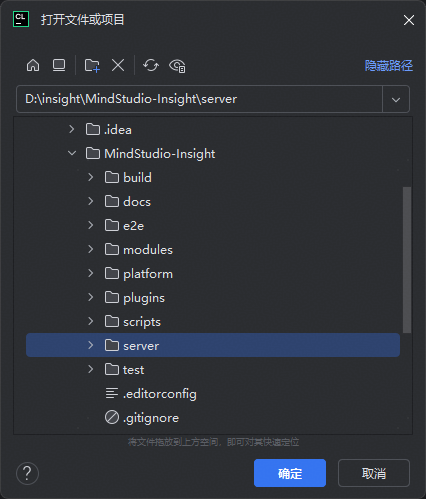

#### 3.1.3 Configure the CLion

**1. Click the settings button in the upper right corner and select the settings option.**

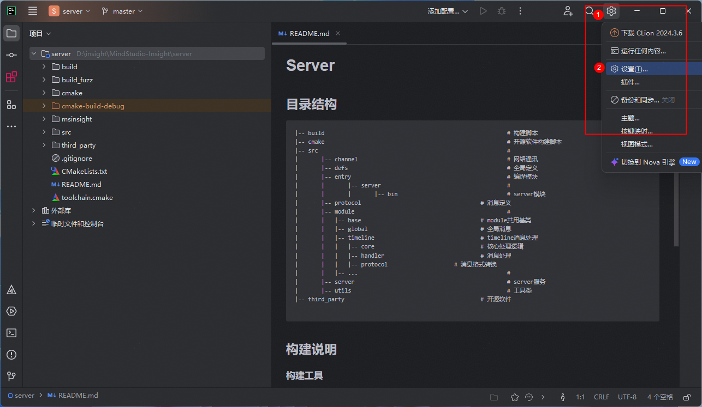

**2. Select the toolchain option in build, execution, and deployment settings, and set the path in the toolset to the downloaded MinGW tool.**

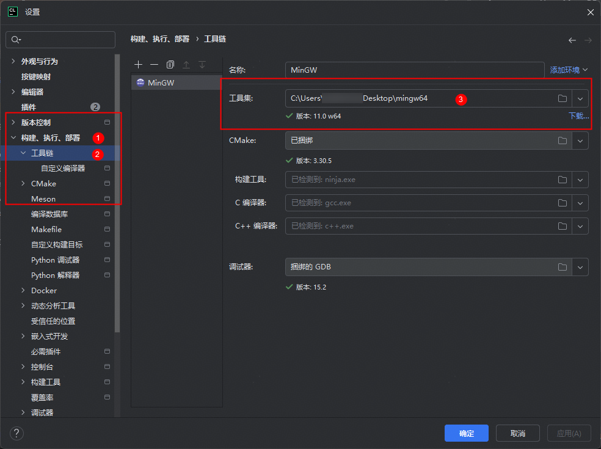

**3. Select the CMake option in build, execution, and deployment settings, and set the toolchain to the downloaded MinGW.**


### 3.2 Downloading and Compiling Third-Party Libraries

#### 3.2.1 Download and pre-run third-party libraries

Create a new terminal in the `server` folder and run the following code in the terminal. If the code is successfully executed, the output shown in **Figure 3-1 download_third_party_success** and **Figure 3-2 Pre-run success** will be displayed.
Note: Before performing this step, ensure that the network connection is normal.

```shell
cd build
python download_third_party.py
python preprocess_third_party.py
```

**Figure 3-1 download_third_party_success**

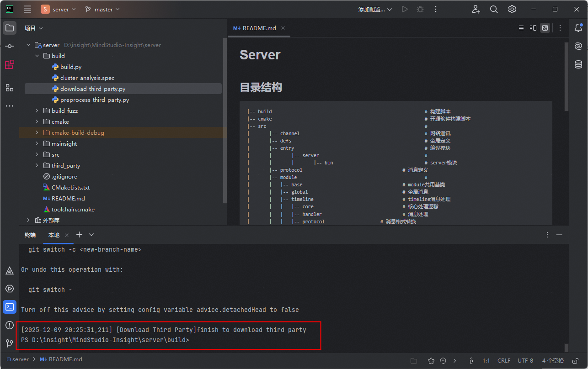

**Figure 3-2 Pre-run success**

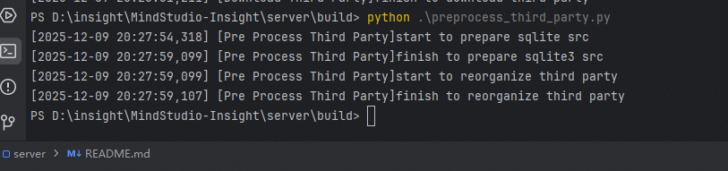

#### 3.2.2 CMake Compilation

- Click the CMake button in the lower right corner and reload the CMake project.


- If the CMake is reloaded successfully, the following figure is displayed.

**Figure 3-3 CMake reloaded successfully**


### 3.3 Configuring and Starting the Main Function in CLion for Backend Developer Testing

#### 3.3.1 Configure the Main function

- Click the more icon next to **profiler_server** and select the edit option.


- Select the **profiler_server** option, change the parameter to `--wsPort=9000`, and click **OK** to save the settings.
  - Note: You can set the port to another port to avoid conflicts with other ports.
  - Warning: If the MindStudio Insight desktop application is already running on your development machine, ensure that the port `wsPort` does not conflict with the port used by the running the application. By default, the application uses port `9000`, but if multiple instances are running, they will be bound to ports starting from `9000`, incrementing by 1 for each additional instance. It is recommended to configure the port range to `9050` to `9099`. Otherwise, frontend and backend connection issues or other unexpected exceptions may occur. It is recommended to close all running MindStudio Insight applications during local development and debugging.


#### 3.3.2 Start to build profiler_server

- Click the start button in the upper right corner to start building profiler_server.


- The following figure shows that the build is successful.

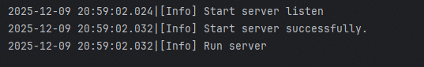

#### 3.3.3 Backend Developer Testing

- Test framework: GoogleTest

- Coverage rate: The back-end coverage rate must reach 80%, and the branch coverage rate must reach 60%. On Linux, run the following code to generate the coverage rate. The coverage rate file is located in `build_llt/output/cpp_coverage/result/index.html`.

```bash
cd build
bash cpp_coverage.sh
```

- Add developer tests: When new feature code is integrated into the backend, developer tests must also be performed. The DT code is located in `server/src/test`. Add the environment variable `DEV_TYPE=true` to the **CMake** option in the build, execution, deployment settings in CLion, and reload CMake to build the executable file `insight_test`. After the build is complete, if the test case name is `TEST_F(TestSuit, TestCase)`, run the following command to execute only the TestSuit test cases. For more information, see the official GoogleTest documentation.

```bash
./insight_test --gtest_filter=TestSuit.*
```

### 3.4 Staring the Frontend on WebStorm

#### 3.4.1 Install frontend dependencies

- Install the pnpm dependency.

```bash
npm install -g pnpm
```

- Open WebStorm, go to the **modules** folder, and run the installation command.

```bash
pnpm install
```

- The following figure shows the successful installation result.


#### 3.4.2 Start the frontend module service

- MindStudio Insight adopts the modular design. The framework module is a basic functional module, and other modules can be loaded as required.

| Folder Name| **Module**|
| --- | --- |
| cluster | Summary and Communication|
| compute | Operator Tuning|
| framework | Basic Functions|
| leaks | Memory Leak Check|
| memory | Memory|
| operator | Operator|
| reinforcement-learning | Reinforcement Learning|
| statistic | Serving Tuning|
| timeline | Timeline|

- Go to the module project and click **start** in the **package.json** file of the module to start the module.

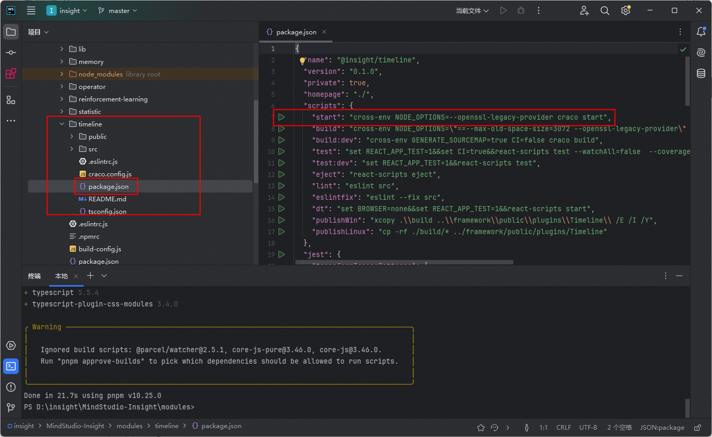

- The following figure shows that the module is started successfully.

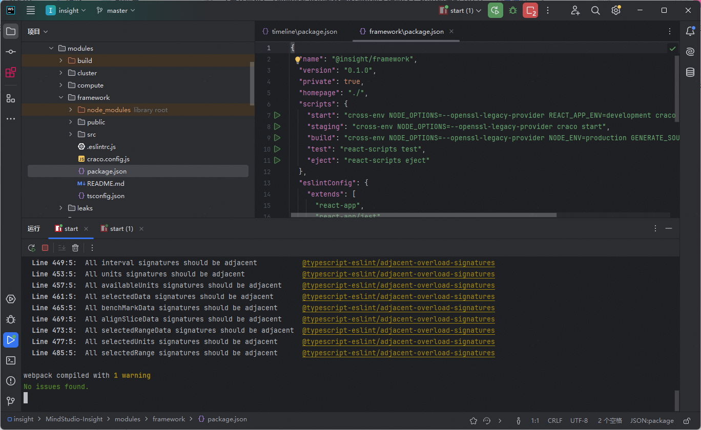

**Ensure that the framework module is started successfully. Otherwise, MindStudio Insight on the web page cannot be started.**

#### 3.4.3 Run MindStudio Insight in the developer environment

- Enter **localhost:5174** in the address box of the browser to start the web page.

- The following figure shows that the web page is started successfully.


### 3.5. Pre-smoke test

The pre-smoke test can be performed on Linux or Windows.

#### 3.5.1 Perform a pre-smoke test on Linux

- Docker is recommended for performing a pre-smoke test on Linux.

- To install the test framework Playwright and its dependencies, you are advised to use the official Playwright image. For details, see the [Playwright official website](https://playwright.dev/docs/docker). The image tag is **v1.57.0-jammy**.

- After creating a container from the image, you need to install other dependencies required by the frontend and backend. In the container, run the `mindstudio_insight_gui_set_environment.sh` script in the `build` directory to install the dependencies.

```bash
bash build/mindstudio_insight_gui_set_environment.sh
```

- After the dependencies are installed, run the following command in the root directory of the project:

```bash
bash build/mindstudio_insight_gui_run.sh
```

After performing the pre-smoke test, view the test result.

#### 3.5.2 Perform a pre-smoke test on Windows

- Perform a pre-smoke test on Windows. For details about how to install dependencies, see [GUI Guide](https://gitcode.com/Ascend/msinsight/blob/master/e2e/README.md).

- In the **e2e** directory, run the following command:

```bash
npm run test:smoke
```

After performing the pre-smoke test, view the test result.

## 4. New Module Development

- This section describes only the architecture development and access. The implementation logic of specific modules needs to be designed and developed based on the actual situation.

### Frontend

1. Adding a new module directory

   Create a new module in the `modules` directory.

   ```shell
       .
       ├── modules
       │   ├── framework
       │   ├── new_module
       │   └── package.json
   ```

   Organize the directory of the new module as follows:

   ```shell
       .
       ├── new_module
       │   ├── src
       │   │   ├── assets
       │   │   ├── components
       │   │   ├── connection
       │   │   ├── store
       │   │   ├── theme
       │   │   ├── units
       │   │   ├── App.tsx
       │   │   ├── index.tsx
       │   │   └── index.css
       │   ├── craco.config.js
       │   ├── tsconfig.json
       │   └── package.json
   ```

2. Build configurations
   
   craco.config.js

   ```js
   const { webpackCfg, configureConfig } = require("../build-config");

   const path = require("path");

   const libPath = path.resolve(__dirname, "../lib/src");
   const echartsPath = require.resolve("echarts");

   module.exports = {
     devServer: {
       port: 3001,
       open: false,
       client: {
         overlay: {
           runtimeErrors: (error) => {
             // Disable the display of the error message "ResizeObserver loop completed with undelivered notifications".
             return !error?.message.includes("ResizeObserver");
           },
         },
       },
     },
     webpack: {
       alias: webpackCfg.alias,
       configure: (webpackConfig) => {
         return configureConfig(webpackConfig, [libPath, echartsPath]);
       },
     },
   };
   ```

3. Basic script configuration
   
   package.json

   ```json
   {
       "scripts": {
           "start": "cross-env NODE_OPTIONS=--openssl-legacy-provider craco start",
           "build": "cross-env NODE_OPTIONS=\"==--max-old-space-size=3072 --openssl-legacy-provider\" NODE_ENV=production GENERATE_SOURCEMAP=false CI=false craco build",
           "publishWin": "xcopy .\\build ..\\framework\\public\\plugins\\Timeline\\ /E /I /Y",
           "publishLinux": "cp -rf ./build/* ../framework/public/plugins/Timeline",
           ... // Custom configuration
       }
   }
   ```

4. Necessary modules in src

   **theme**: theme

   theme/index.ts

   ```ts
   export { themeInstance } from "@insight/lib/theme";
   export type { ThemeItem } from "@insight/lib/theme";
   ```

   **connection**: communication

   connection/index.ts

   ```ts
   import { ClientConnector } from "@insight/lib/connection";
   export default new ClientConnector({
     getTargetWindow: (): any[] => [window.parent],
     module: [new_module_request_name],
   });
   ```

   Other parts are customized based on the actual requirements of the new module.

5. Adding a new module (microservice) to the main service

   In the **moduleConfig.ts** file of the framework module, configure the new module in modulesConfig.
   
   ```ts
   {
        name: '[new_module]',   // Microservice name of the new module, which is user-defined.
        requestName: '[new_module_request_name]', // Name of the module for frontend and backend interaction, which is negotiated with the backend.
        attributes: {
            src: isDev ? 'http://localhost:[new_port]/' : './plugins/[new_module]/index.html', // The local development port is allocated by the user.
        },
        isDefault: true, // Whether to display the microservice by default.
        ... // Other configuration conditions.
    }
   ```

**Code source:** `build/build.py`

Clean up after building the new module.

```python
def clean():
    out = os.path.join(PROJECT_PATH, Const.OUT_DIR)
    if os.path.exists(out):
        shutil.rmtree(out)
    ascend_insight = os.path.join(PROJECT_PATH, Const.PRODUCT_DIR)
    if os.path.exists(ascend_insight):
        shutil.rmtree(ascend_insight)
    framework_dist = os.path.join(PROJECT_PATH, Const.MODULES_DIR, Const.FRAMEWORK_DIR, 'build')
    if os.path.exists(framework_dist):
        shutil.rmtree(framework_dist)
    # Add your new module here.
    modules = ['cluster', 'memory', 'timeline', 'compute', 'jupyter', 'operator', 'lib', 'statistic', 'leaks',
               'reinforcement-learning']
    for module in modules:
        build_dir = os.path.join(PROJECT_PATH, Const.MODULES_DIR, module, Const.BUILD_DIR)
        if os.path.exists(build_dir):
            shutil.rmtree(build_dir)
```

**Code source:** `build/build.py`

Name and build of the new module

```python
# Add your module and the corresponding module name here.
MODULES_MAP = {
    'cluster': 'Cluster',
    'reinforcement-learning': 'RL',
    'memory': 'Memory',
    'operator': 'Operator',
    'compute': 'Compute',
    'statistic': 'Statistic',
    'leaks': 'Leaks',
    'timeline': 'Timeline',
}
```

**Code source:** `modules/framework/src/components/TabPane/Index.tsx`

This function is used to update the scenario information based on the input data object and pass the updated scenario information to the updateSession function. The main purpose is to collect and process various scenario flags for subsequent session management or data processing.

```tsx
export function updateDataScene(data: Record<string, any>): void {
    const sceneInfo = {
        // Add new modules here to update the corresponding data.
        isCluster: data.isCluster ?? false,
        isReset: data.reset ?? false,
        isIpynb: data.isIpynb ?? false,
        isBinary: data.isBinary ?? false,
        hasCachelineRecords: data.hasCachelineRecords ?? false,
        isOnlyTraceJson: data.isOnlyTraceJson ?? false,
        instrVersion: data.instrVersion ?? -1,
        isLeaks: data.isLeaks ?? false,
        isIE: data.isIE ?? false,
        isRL: false,
        isHybridParse: data.isCluster && data.isIE,
    };
    updateSession(sceneInfo);
}

// Add new modules here to handle the tab change.
useEffect(() => {
    // Scenario of deleting a project: The tab does not change.
    if (session.isBinary === null && session.isCluster === null) {
        return;
    }
    setScene(session.scene);
    setDataCompose({ hasCachelineRecords: session.hasCachelineRecords, isRL: session.isRL });
}, [session.isBinary, session.isCluster, session.hasCachelineRecords, session.isOnlyTraceJson, session.isIE, session.isLeaks, session.isRL, session.isHybridParse]);
```

**Code source:** `modules/framework/src/entity/session.ts`

Add the data import scenario corresponding to the new module here.

```ts
// Add the data import scenario corresponding to the new module here.
// Scene: data scenario: default, cluster, operator tuning, leaks, and  trace.json only
export type Scene = 'Default' | 'Cluster' | 'Compute' | 'OnlyTraceJson' | 'IE' | 'Leaks' | 'RL' | 'HybridParse';

export class Session {
    // Add a new module to the scenario.
    // Scenario
    isCluster: boolean | null = false;
    isBinary: boolean | null = false;
    isIE: boolean | null = false;
    isReset: boolean = false;
    isFullDb: boolean = false;
    isOnlyTraceJson: boolean = false;
    isLeaks: boolean = false;
    isRL: boolean = false;
    isHybridParse: boolean = false;
    hasCachelineRecords: boolean = false;
    instrVersion: number = -1;

    // Add a new module to the scenario.
    // Import data scenario: default, cluster, operator tuning, and  trace.json only
    get scene(): Scene {
        let scene: Scene;
        if (this.isHybridParse) {
            scene = 'HybridParse';
        } else if (this.isOnlyTraceJson) {
            scene = 'OnlyTraceJson';
        } else if (this.isLeaks) {
            scene = 'Leaks';
        } else if (this.isBinary) {
            scene = 'Compute';
        } else if (this.isCluster) {
            scene = 'Cluster';
        } else if (this.isIE) {
            scene = 'IE';
        } else {
            scene = 'Default';
        }
        return scene;
    }
    ....
}
```

**Code source:** `modules/framework/src/moduleConfig.ts`

Add a new module to the module settings.

```ts
// Add a new module to the module settings.
export interface ModuleConfig {
    name: string;
    requestName: Lowercase<string>;
    attributes: IframeHTMLAttributes<HTMLIFrameElement>;
    isDefault?: boolean;
    isCluster?: boolean;
    isCompute?: boolean;
    isLeaks?: boolean;
    isIE?: boolean;
    isRL?: boolean;
    hasCachelineRecords?: boolean;
    isOnlyTraceJson?: boolean;
    isHybridParse?: boolean;
}
// Add a new module to the module settings. The following is an example of the module. Ensure that the port number does not conflict with that of other modules.
{
    name: 'xxx',
    requestName: 'xxx',
    attributes: {
        src: isDev ? 'http://localhost:3000/xxx' : './plugins/xxx/index.html',
    },
    isXXX: true,
},
```

**Code source:** `modules/lib/src/connection/index.ts`

```ts
// The query API of the new module must be written in the connection.
```

**Code source:** `modules/lib/src/i18n/index.ts`

The Chinese-English switch of the new module is managed by the common module.

```ts
// The Chinese-English switch of the new module is managed by the common module.
import xxxEn from './leaks/en.json';
import xxxZh from './leaks/zh.json';

export const resources = {
    enUS: {
        ...en,
        ...frameworkEn,
        ...xxxEn,
    },
    zhCN: {
        ...zh,
        ...frameworkZh,
        ...xxxZh,
    },
};
```

### Backend

### Backend development structure

server
├── src
│   ├── modules
│   │   ├── xxx_module
│   │   │   ├── database 
│   │   │   │   ├── xxxBase.h
│   │   │   │   └── xxxBase.cpp
│   │   │   ├── handler
│   │   │   └── protocol

### Backend code layer

**Code source:** `server/msinsight/include/base/ProtocolUtil.h`

JSON protocol processing and response transfer are implemented here.

```c++
struct JsonResponse : public Response {
    explicit JsonResponse(const std::string &command) : Response(command) {}
    [[nodiscard]] virtual std::optional<document_t> ToJson() const = 0;
};
struct Event : public ProtocolMessage {
    explicit Event(const std::string &e) : event(e)
    {
        type = ProtocolMessage::Type::EVENT;
    }
    ~Event() override = default;
    std::string event;
    bool result = false;
};
struct JsonEvent : public Event {
    explicit JsonEvent(const std::string &e) : Event(e) {}
    [[nodiscard]] virtual std::optional<document_t> ToJson() const = 0;
};
class ProtocolUtil {
public:
    ProtocolUtil() = default;
    virtual ~ProtocolUtil() = default;

    void Register();
    void UnRegister();

    std::unique_ptr<Request> FromJson(const json_t &requestJson, std::string &error);
    std::optional<document_t> ToJson(const Response &response, std::string &error);
    std::optional<document_t> ToJson(const Event &event, std::string &error);

    // set base info
    // request
    static bool SetRequestBaseInfo(Request &request, const json_t &json);
    // response
    static void SetResponseJsonBaseInfo(const Response &response, document_t &json);
    // event
    static void SetEventJsonBaseInfo(const Event &event, document_t &json);

    // common json to request
    template <class SubRequest>
    static std::unique_ptr<Request> BuildRequestFromJson(const json_t &json, std::string &error)
    {
        static_assert(std::is_same_v<std::unique_ptr<Request>, decltype(SubRequest::FromJson(json, error))>,
                      "SubRequest must have a static FromJson method returning std::unique_ptr<Request>");
        return SubRequest::FromJson(json, error);
    }
    // response to json
    static std::optional<document_t> CommonResponseToJson(const Response &response)
    {
        try {
            const auto& jsonResponse = dynamic_cast<const JsonResponse&>(response);
            return jsonResponse.ToJson();
        } catch (const std::bad_cast& e) {
            return std::nullopt;
        }
    }
    ...
}
```

**Code source:** `server/src/CMakeLists.txt`

Add the new module to be compiled in CMake here.

```CMake
# new Module
include_directories(${SRC_HOME_DIR}/modules/xxx)
include_directories(${SRC_HOME_DIR}/modules/xxx/xxx)

# new Module
aux_source_directory(${SRC_HOME_DIR}/modules/xxx xxx_xxx_SRC)

list(APPEND DIC_MODULES_SRC_LIST
        ${DIC_MODULES_XXX_SRC}
        ${DIC_MODULES_XXX_XXX_SRC}
)

```

**Code source:** `server/src/modules/Plugins.cpp`

Add information about the new module here.

```CPP
/*
 * -------------------------------------------------------------------------
 * This file is part of the MindStudio project.
 * Copyright (c) 2025 Huawei Technologies Co.,Ltd.
 *
 * MindStudio is licensed under Mulan PSL v2.
 * You can use this software according to the terms and conditions of the Mulan PSL v2.
 * You may obtain a copy of Mulan PSL v2 at:
 *
 *          http://license.coscl.org.cn/MulanPSL2
 *
 * THIS SOFTWARE IS PROVIDED ON AN "AS IS" BASIS, WITHOUT WARRANTIES OF ANY KIND,
 * EITHER EXPRESS OR IMPLIED, INCLUDING BUT NOT LIMITED TO NON-INFRINGEMENT,
 * MERCHANTABILITY OR FIT FOR A PARTICULAR PURPOSE.
 * See the Mulan PSL v2 for more details.
 * -------------------------------------------------------------------------
 */
#include "AdvisorPlugin.h"
#include "GlobalPlugin.h"
#include "MemoryPlugin.h"
#include "OperatorPlugin.h"
#include "SourcePlugin.h"
#include "SummaryPlugin.h"
#include "TimelinePlugin.h"
#include "JupyterPlugin.h"
#include "CommunicationPlugin.h"
#include "IEPlugin.h"
#include "MemoryDetailPlugin.h"
// Add information about the new module.
namespace Dic::Module {
    Core::PluginRegister ADVISOR_PLUGIN(std::make_unique<Advisor::AdvisorPlugin>());
    Core::PluginRegister GLOBAL_PLUGIN(std::make_unique<Global::GlobalPlugin>());
    Core::PluginRegister MEMORY_PLUGIN(std::make_unique<Memory::MemoryPlugin>());
    Core::PluginRegister OPERATOR_PLUGIN(std::make_unique<Operator::OperatorPlugin>());
    Core::PluginRegister SOURCE_PLUGIN(std::make_unique<Source::SourcePlugin>());
    Core::PluginRegister SUMMARY_PLUGIN(std::make_unique<Summary::SummaryPlugin>());
    Core::PluginRegister TIMELINE_PLUGIN(std::make_unique<Timeline::TimelinePlugin>());
    Core::PluginRegister JUPYTER_PLUGIN(std::make_unique<Jupyter::JupyterPlugin>());
    Core::PluginRegister COMM_PLUGIN(std::make_unique<Communication::CommunicationPlugin>());
    Core::PluginRegister IE_PLUGIN(std::make_unique<IE::IEPlugin>());
    Core::PluginRegister MEMORY_DETAIL_PLUGIN(std::make_unique<MemoryDetail::MemoryDetailPlugin>());
}

```

**Code source:** `server/src/modules/defs/ProtocolDefs.h`

Add information about the new module here.

```h
// Add information about the new module here.
const std::string MODULE_XXX = "xxx";

const std::string MODULE_SUMMARY = "summary";
const std::string MODULE_COMMUNICATION = "communication";
const std::string MODULE_MEMORY = "memory";
const std::string MODULE_MEMORY_DETAIL = "memory_detail";
const std::string MODULE_OPERATOR = "operator";
const std::string MODULE_SOURCE = "source";
const std::string MODULE_ADVISOR = "advisor";

```

**Code source:** `server/src/modules/full_db/database/FullDbParser.cpp`

If full DB query is involved, add the query here.

```CPP
// If full DB query is involved, add the query here.
void FullDbParser::Reset()

void FullDbParser::BuildProfilingInitTask(std::shared_ptr<std::vector<std::future<void>>> &futures, std::string &dbId,std::unique_ptr<ThreadPool> &pool)

```

## 5. Adding a Unit in the DB Scenario

### Frontend

1. Configure the display module in the DB scenario.

   framework/src/moduleConfig.ts

   ```ts
   
    [
       {
          name: 'Timeline',
          requestName: 'timeline',
          attributes: {
             src: isDev ? 'http://localhost:3000/' : './plugins/Timeline/index.html',
          },
          isIE: true,
       },
       {

          name: 'Statistic',
          requestName: 'statistic',
          attributes: {
             src: isDev ? 'http://localhost:3006/' : './plugins/Statistic/index.html',
          },
          isIE: true,
       }
    ]

   ```

2. Import a DB file.

   Select a DB file and send a parsing instruction `import/action`.

    ```ts
   async function handleProjectAction({ action, project, isConflict, selectedFileType, selectedFilePath, selectedRankId }:
   {action: ProjectAction;project: Project;isConflict: boolean;selectedFileType?: LayerType;selectedFilePath?: string;selectedRankId?: string}): Promise<void> {
       ...
       runInAction(async() => {
           ...
           const res = await addDataPath(newProject, action, isConflict, session);
           ...
       });
       ...
   }
   ```

   **Code source:** `modules/framework/src/units/Project.tsx`
   
3. The main service sends the parsing result to the microservice.

   ```ts
   export const addDataPath = async function(project: Project, action: ProjectAction, isConflict: boolean, session: Session): Promise<boolean> {
      ...
      connector.send({
         event: 'remote/import',
         body: { dataSource: transformTimelineDataSource(project), importResult: res, switchProject },
         target: 'plugin',
      });
      ...
   }
   ```

   **Code source:** `modules/framework/src/centralServer/server.ts`

4. The microservice processes data to generate the rank/unit menu.

   ```ts
      export const importRemoteHandler: NotificationHandler = async (data): Promise<void> => {
         ...
         runInAction(() => {
            initUnitInfo(session, result, dataSource, isNeedResetRankId); // Initialize unit information based on the parsing result.
        });
        sendSessionUpdate(result, session);
         ...
      }
   ```

   **Code source:** `modules/timeline/src/connection/handler.ts`

5. The microservice receives and processes the rank parsing result.

   parse/success

   ```ts
   export const parseSuccessHandler: NotificationHandler = (data): void => {
     ...
   }
   ```

   **Code source:** `modules/timeline/src/connection/handler.ts`

6. The microservice obtains unit data and draws a unit diagram.

   ```tsx
      const ThreadUnit = unit<ThreadMetaData>({
        name: 'Thread',
        pinType: 'copied',
        chart: chart()
      })
   ```

   **Code source:** `modules/timeline/src/insight/units/AscendUnit.tsx`

### Backend

#### Create a profiler.db file


#### Create a table structure

**1. Slice**

A rectangular color block of the timeline, corresponding to the data whose ph is X in the trace file.


Table creation statement

CREATE TABLE slice (id INTEGER PRIMARY KEY AUTOINCREMENT, timestamp INTEGER, duration INTEGER, name TEXT, depth INTEGER, track_id INTEGER, cat TEXT, args TEXT, cname TEXT, end_time INTEGER, flag_id TEXT);

**2. Process**

Non-leaf unit of the timeline, corresponding to the data whose ph is M in the trace file.

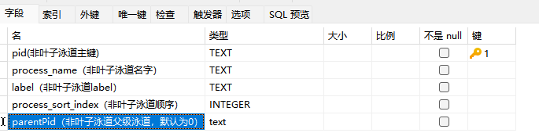

Table creation statement
CREATE TABLE "process" (
"pid" TEXT,
"process_name" TEXT,
"label" TEXT,
"process_sort_index" INTEGER,
"parentPid" text,
PRIMARY KEY ("pid")
);

**3. Thread**

Leaf unit of the timeline, corresponding to the data whose ph is M in the trace file.

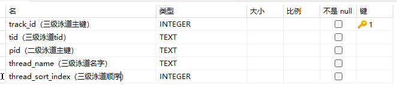

**4. Counter**

Curve or histogram data, corresponding to the data whose ph is C.


Table creation statement
CREATE TABLE counter (id INTEGER PRIMARY KEY AUTOINCREMENT, name TEXT, pid TEXT,timestamp INTEGER, cat TEXT, args TEXT);

**5. Flow**

Flow, corresponding to the data whose ph is s, f, or t.


Table creation statement
CREATE TABLE flow (id INTEGER PRIMARY KEY AUTOINCREMENT, flow_id TEXT, name TEXT, cat TEXT, track_id INTEGER, timestamp INTEGER, type TEXT);

**6. dataTable**

Tables that need to be displayed in the following mode:

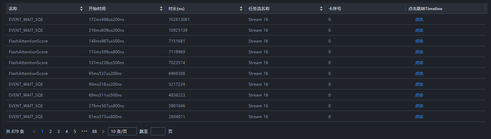
Table fields

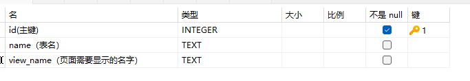

Table creation statement

CREATE TABLE "data_table" (
"id" INTEGER NOT NULL,
"name" TEXT,
"view_name" TEXT,
PRIMARY KEY ("id")
);

**7. data_link**

Association between a field and a field in another table


Table creation statement
CREATE TABLE "data_link" (
"source_name" TEXT NOT NULL,
"target_table" TEXT NOT NULL,
"target_name" TEXT NOT NULL,
PRIMARY KEY ("source_name")
);

**8. Translate**

Chinese-English translation of text


Table creation statement
CREATE TABLE "translate" (
"key" TEXT NOT NULL,
"value_en" TEXT,
"value_zh" TEXT,
PRIMARY KEY ("key")
);

#### Adding a non-leaf unit

Add level-2 unit data to the process table.


#### Adding a leaf unit


#### Add color block data to the leaf unit


#### Adding color block association

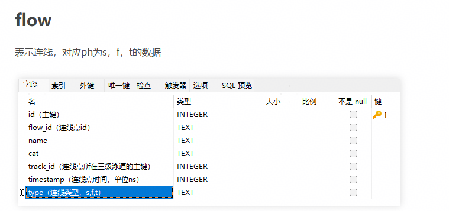

#### Adding histogram data


#### Drag the created **profiler.db** file to msInsight to view the new unit

## 6. Developer Guide to Local Package Generation

### Windows

#### Environment Dependencies

You can install the dependencies by yourself. If you have any questions about installing the dependencies, see the appendix in the document.

| Software Name         | Version              | Usage                |
|---------------|------------------|--------------------|
| Rust          | 1.89             | Base compilation and build            |
| windows11SDK  | 10.0.22000.0+    | Basic development runtime on the Windows platform  |
| MSVC          | v143             | Basic development runtime on the Windows platform  |
| MinGW         | 10.0+ (msvcrt version)| Background compiler             |
| Ninja         | No requirements             | Background compilation              |
| CMake         | 3.16~3.20        |                    |
| nsis          | No requirements             | Installation package packing software           |
| nsProcess plugin  | unicode support  | Packaging software plugin, which is used to check whether there are duplicate running processes.|
| node          | v18.20.8+        | Frontend build              |
| pnpm          | No requirements             | Frontend build              |
| Python        | 3.11+            | Cluster tool packaging            |

Python requirements:

Runtime requirements:

```text
click
tabulate
networkx
jinja2
PyYaml
tqdm
prettytable
ijson
xlsxwriter>=3.0.6
sqlalchemy
numpy<=1.26.4
pandas<=2.3.2
psutil
```

Development requirements:

```shell
pyinstaller
```

#### Compiling and Generating Packages

1. Go to the `server/build` directory in the `root` directory of the project and run `python3 download_third_party.py && python3 preprocess_third_party.py`.

2. On Windows, MindStudio Insight integrates the Python interpreter.

    - Step 1: Manually install the Python interpreter (including pip) in the build environment. Python 3.12.10 is recommended.
    - Step 2: Set the environment variable `MINDSTUDIO_INSIGHT_PYTHON_INTERPRETER` to the installation directory of the Python interpreter. This directory must contain the interpreter `python.exe`. Example: If the installation directory of the Python interpreter is `D:\xxx\python` and the directory contains the interpreter `D:\xxx\python\python.exe`, set the environment variable `MINDSTUDIO_INSIGHT_PYTHON_INTERPRETER` to `D:\xxx\python`.

3. Go to the `build` directory in the `root` directory of the project and run `python build.py`. The product is stored in the `out` directory in the `root` directory of the project.

#### Appendix of Dependency Installation in the Windows Environment

+ Installing Windows Runtime (Windows 11 SDK and MSVC)

  Download Visual Studio Installer, double-click it to open the installation page, and select the following dependencies (usually the default settings are used):

  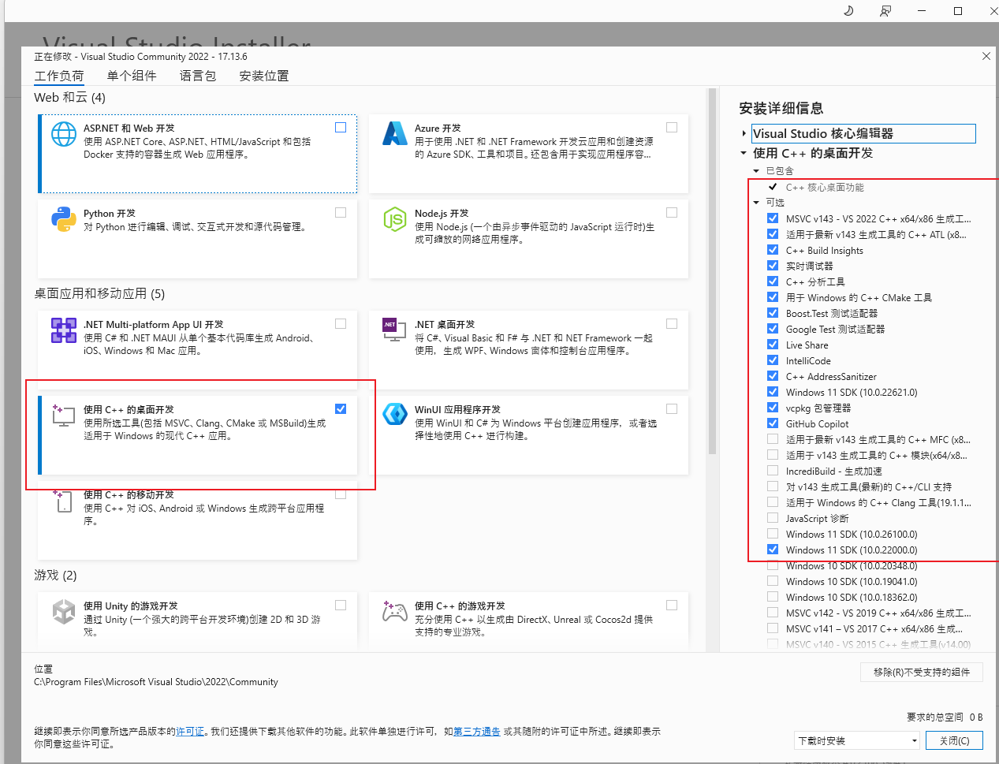

+ Installing MinGW

  Download the corresponding software package from [WinLibs - GCC+MinGW-w64 compiler for Windows](https://winlibs.com/). Select the MSVCRT version (later than 11.2) to ensure that the compiled package has better portability.

  Decompress the downloaded package to any directory, and modify the **PATH** variable in the system by adding the path of the bin directory in mingw64, as shown in the following figure. Assume that the package is decompressed to the root directory of drive C.

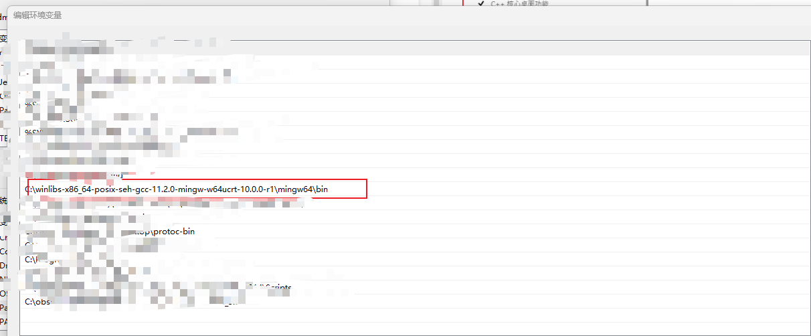

+ Installing the nsProcess Plugin

  Install the NSIS in the **C:\\program (x86)** directory. Obtain the nsProcess package from [NsProcess plugin - NSIS](https://nsis.sourceforge.io/NsProcess_plugin). Place **Include/nsProcess.h** in the downloaded package to **C:\Program Files (x86)\NSIS\Include**.

  Place **Plugin/nsProcess.dll** in **C:\Program Files (x86)\NSIS\Plugins\x86-unicode**.
  Place **Plugin/nsProcessw.dll** in **C:\Program Files (x86)\NSIS\Plugins\x86-unicode**.

+ Rust

   Recommended installation method: Use the official tool rustup.
   
   Official website: <https://www.rust-lang.org>
   
   Verification after installation:

   ```bash
   rustc --version
   cargo --version
   ```

   Note: This tool is used to compile and build the base code. You are advised to use a stable version and ensure that the version meets the requirements.
   
+ Ninja
   
   Installation method:
   
   For Windows, download the binary file from the official website or use a package management tool (such as Chocolatey or Scoop) to install it.

   Official website: <https://ninja-build.org>
   
   Verification after installation:
   
   `ninja --version`
   
   Note: This tool is used as the backend build tool of CMake.

+ Node.js

   Installation method: Use the official Node.js installation package.
   
   Official website: <https://nodejs.org>
   
   Version requirement: v18.20.8 or later (LTS version recommended)

   Verification after installation:

   ```bash
   node --version
   npm --version
   ```

   Note: This tool is used for building frontend projects and dependency management.

+ pnpm

   Installation method: Use npm to perform a global installation after Node.js has been installed.
   
   `npm install -g pnpm`
   
   Verification after installation:
   
   `pnpm --version`
   
   Note: This is a package management tool for frontend projects.

+ Python
   
   Installation method: Use the official Python installation package.
   
   Official website: <https://www.python.org>
   
   Version requirement: Python 3.11 or later
   
   Verification after installation:

   ```bash
   python --version
   pip --version
   ```

   Note: This tool is used to package and run cluster tools and related scripts. During installation, select "Add Python to PATH".

### MAC Packaging

#### Environment dependencies

| Software Name    | Version       | Usage        |
| ------------ |-----------| ------------ |
| Rust         | 1.89      | Base compilation and build|
| cargo-bundle | No requirements      |              |
| Ninja        | No requirements      | Background compilation    |
| node         | v18.20.8+ | Frontend build    |
| pnpm         | No requirements      | Frontend build    |
| Python       | 3.11+     | Package cluster tool|
| Clang        | 15      |              |
| CMake        | 3.16~3.20 |              |

Python requirements:

Runtime requirements:

```text
click
tabulate
networkx
jinja2
PyYaml
tqdm
prettytable
ijson
xlsxwriter>=3.0.6
sqlalchemy
numpy<=1.26.4
pandas<=2.3.2
psutil
dmgbuild
```

Development requirements:

```shell
pyinstaller
```

#### Compiling and Generating Packages

##### Step 1. Preprocess build dependencies

- Go to the **root** directory of the project and run the following commands:

``` shell
cd server/build
python3 download_third_party.py && python3 preprocess_third_party.py
```

##### Step 2. (Optional) Specify the app signing certificate

**Note**: Ensure that you have read and understood the [LICENSE](https://gitcode.com/Ascend/msinsight/blob/master/docs/LICENSE) requirements.

- Step description: When the msInsight macOS ARM version builds a package, it signs the product app with the macOS developer certificate. You can use environment variables to specify the certificate used for signing. If no certificate is specified, a temporary certificate is used for signing by default. This may cause your msInsight product **to fail to be distributed over the network** (for example, the product signed with a temporary certificate cannot be opened after being distributed to other devices over the network). If you only perform local debugging and running, you can skip this step.
- Before using a certificate, ensure that the certificate is an Apple developer certificate that can be used for signing and has been correctly imported to the key string (for example, the login key string **~/Library/Keychains/login.keychain**).
- Configure the certificate using environment variables. The **certificate name** or **certificate ID** is supported.

```shell
# For example, the certificate name is **insight_cert**, and the certificate has been imported to the login key string **~/Library/Keychains/login.keychain**.
export INSIGHT_APP_SIGN="insight_cert"
# ! Note that after running the following command to unlock the keychain, the current interactive environment can access the certificates and keys in the keychain. Ensure the security of the environment.
security unlock-keychain -p {Your password} ~/Library/Keychains/login.keychain
```

##### Step 3. Set environment variables for integrating the Python interpreter

- On macOS, MindStudio Insight integrates the Python interpreter.
  - Step 1: Manually install the portable Python interpreter (including pip) in the build environment. Python 3.12.10 is recommended.
  - Note: "Portable" means that the Python folder on machine A can be copied to machine B and can be directly used on machine B. Some Python versions on macOS depend on the dynamic library in the absolute path `/Library`. When the Python interpreter is copied from machine A to machine B, the Python interpreter cannot run because machine B does not have the dynamic library in `/Library`. To ensure that MindStudio Insight built locally is available on other machines, the Python interpreter installed on macOS must be portable.
  - Step 2: Set the environment variable `MINDSTUDIO_INSIGHT_PYTHON_INTERPRETER` to the installation directory of the Python interpreter. This directory must contain the interpreter bin/python3. If the version of the Python interpreter you installed is not 3.12, manually change the value of the `version` variable in `server/build/build.py`. Example: If the installation directory of the Python interpreter is `/Users/xxx/python` and the directory contains the interpreter `/Users/xxx/python/bin/python3`, set the environment variable `MINDSTUDIO_INSIGHT_PYTHON_INTERPRETER` to `/Users/xxx/python`.

##### Step 4. Run the packaging script

Go to the `build` directory in the `root` directory of the project and run `python build.py`. The product is stored in the `out` directory in the `root` directory of the project.
