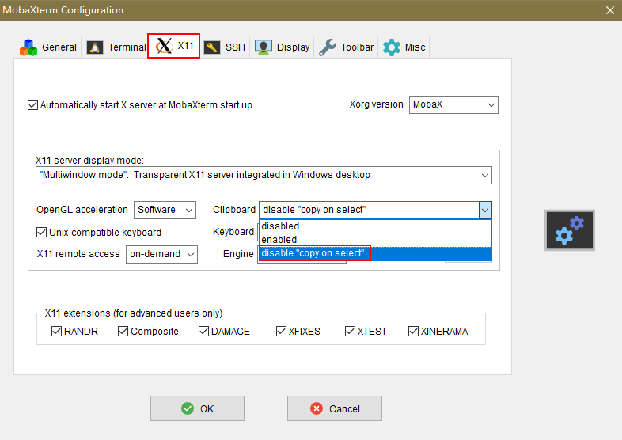
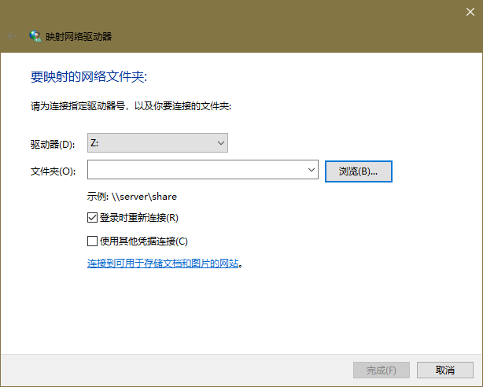
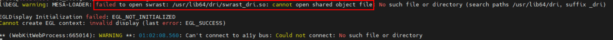

# **FAQs**

## Error Message "Missing Dependencies" Is Displayed When MindStudio Insight Is Running

**Symptom**

When MindStudio Insight is running on Windows, the "Missing Dependencies" error message is displayed, and MindStudio Insight cannot be run.


**Possible Causes**

The **WebView2Runtime** file required for running the program is missing.

**Solution**

1. Click [here](https://developer.microsoft.com/en-US/microsoft-edge/webview2/#download-section) to go to the Microsoft official website.
2. Download the x64 installation package for Evergreen Standalone Installer, as shown in [**Figure 1** WebView2 installation package](#webview2-installation-package).

    **Figure 1** WebView2 installation package <a id="webview2-installation-package"></a>   
    

3. After the installation is complete, run MindStudio Insight again.

## How Do I Re-parse a Profiling File in TEXT Format

**Symptom**

When a profiling file in text format is imported to the MindStudio Insight software of the same version, the data will not be re-parsed. How do I parse the data?

**Solution**

Delete the **mindstudio\_insight\_data.db** file in the profile data directory and import the data again.

## The Data Import Dialog Box Cannot Be Displayed When MindStudio Insight Is Running on EulerOS

**Symptom**

When MindStudio Insight is running on a system such as EulerOS, the import selection box is not displayed after you click  on the toolbar in the upper left corner of the page.

**Solution**

1. Log in to the environment where MindStudio Insight is installed.
2. Run the following command to set environment variables:

    ```shell
    export WEBKIT_DISABLE_COMPOSITING_MODE=1
    ```

3. Run the following command to start MindStudio Insight:

    ```shell
    ./MindStudio-Insight
    ```

## The Information in the Text Box Is Incorrectly Pasted When MindStudio Insight Is Running in X11 Forwarding Mode

**Symptom**

When MindStudio Insight is running in X11 forwarding mode in Linux, an error occurs if you paste the required information again after the information is entered in the text box.

**Possible Causes**

When MindStudio Insight is running in X11 forwarding mode in Linux, **copy on select** is enabled by default. As a result, the clipboard information is changed to the information that already exists in the text box, and the information in the text box is incorrectly pasted.

**Solution**

Solution 1:

1. On the menu bar of the remote login tool, choose **Settings** \> **Configuration**. MobaXterm is used as an example.
2. Click the **X11** tab and select **disable "copy on select"** for Clipboard, as shown in [**Figure 1** MobaXterm Configuration](#mobaxterm-configuration).

    **Figure 1** MobaXterm Configuration <a id="mobaxterm-configuration"></a> 
    

3. Click **OK**.
4. After the configuration is complete, run MindStudio Insight again.

Solution 2:

On the MindStudio Insight page, delete the existing information in the text box and copy and paste the required information.

## Data Cannot Be Loaded When a Network Drive Directory Is Dragged to MindStudio Insight

**Symptom**

When data is imported to MindStudio Insight, the import fails if the network drive directory is selected.

**Possible Causes**

MindStudio Insight allows you to import only local drive directories. Network drives are not mapped to the local PC and data cannot be imported.

**Solution**

1. Open the **File Explorer** on the computer.
2. Choose **This PC** \> **Map Network Drive**. The **Map Network Drive** dialog box is displayed, as shown in [**Figure 1** Map Network Drive](#map-network-drive).

    **Figure 1** Map Network Drive <a id="map-network-drive"></a> 
    

3. Select the drive letter from the **Drive** drop-down list.
4. Click **Browse** next to **Folder** and select the network directory to be mapped.
5. Click **Finish** to complete the mapping from the network directory to the local directory.
6. Open MindStudio Insight and select the mapped directory again.

## Error Message "Out of Memory" Is Displayed During MindStudio Insight Running

**Symptom**

When MindStudio Insight is running, the error code "Out of Memory" is displayed.

**Possible Causes**

The overall memory of the computer system is insufficient.

**Solution**

1. Close programs that consume a large amount of memory and unnecessary applications to release the system memory.
2. On the error page of MindStudio Insight, click the refresh button to reload the page.

## File Drag and Drop in MindStudio Insight Is Disabled

**Symptom**

When MindStudio Insight is installed in the Windows OS and **Run MindStudio Insight** is selected for automatic start of MindStudio Insight, the file drag and drop is disabled.

**Solution**

1. Close the opened MindStudio Insight.
2. Double-click the MindStudio Insight shortcut icon on the desktop or **MindStudio-Insight.exe** in the installation directory to open MindStudio Insight again.
3. Drag the file into the tool again.

## Error Message "Cannot Open Shared Object File swrast\_dri.so" Is Displayed During MindStudio Insight Running

**Symptom**

When MindStudio Insight is started in X11 or VNC mode in the Linux OS, the MindStudio Insight GUI is blank and the error message "cannot open shared object file swrast\_dri.so" is displayed, as shown in [**Figure 1** Error message](#error-message).

**Figure 1** Error message <a id="error-message"></a> 


**Possible Causes**

The dependency may be missing.

**Solution**

1. Run the following command to install the forwarding dependency file:

    ```shell
    yum install -y mesa-dri-drivers
    ```

2. After the installation is complete, open MindStudio Insight again.

## Error Message "Oh No! Something Has Gone Wrong" Is Displayed When VNC Is Started

**Symptom**

When MindStudio Insight is started in VNC mode in the Linux OS, the error message "Oh no! Something has gone wrong" is displayed, as shown in [**Figure 1** Error message](#error-message).

**Figure 1** Error message <a id="error-message"></a> 


**Possible Causes**

**AllowTcpForwarding** may not be enabled.

In some cases, VNC needs to be connected through the SSH channel, and TCP forwarding is the key to this function. If **AllowTcpForwarding** is disabled, SSH does not allow port forwarding. As a result, the VNC service cannot be accessed through the SSH channel. After **AllowTcpForwarding** is enabled, you can connect to the VNC service through the SSH channel locally or remotely.

**Solution**

Configure the SSH server.

1. Go to the **/etc/ssh/** directory and open the **sshd\_config** file.
2. Change **AllowTcpForwarding** in the file to **yes**.
3. Run the following command to restart the SSH service:

    ```shell
    systemctl restart sshd
    ```

4. After the restart is successful, start the VNC in a new window.

## A Message Indicating that the Dependency Cannot Be Found Is Displayed During Dependency Installation in openEuler and Its Derivative OSs

**Symptom**

In the Linux OS, when openEuler and its derivative OSs are installed, a message indicating that the dependency cannot be found is displayed.

**Possible Causes**

The configured source does not have any dependency.

**Solution**

Configure a new source by referring to [here](https://www.hiascend.com/forum/thread-02101178181671140059-1-1.html) and reinstall the corresponding dependency.

## A Black Screen Is Displayed During Data Import into MindStudio Insight

**Symptom**

On the **Summary** and **Communication** pages of MindStudio Insight, the data is displayed properly after the first import. However, when the same data is imported for the second time, a black screen is displayed.

**Solution**

Solution 1: Close MindStudio Insight and restart it.

Solution 2: On the MindStudio Insight page, view or import other data, and then view the data that is imported earlier again.

## Data Is Not Displayed on the Communication Page After Data Is Imported to MindStudio Insight

**Symptom**

After data is imported to MindStudio Insight, no data is displayed on the communication page.

**Possible Causes**

There are multiple levels of subfolders between the imported profile data directory and the directory ending with **ascend\_ms**, for example, **profiling/rank\_*x*/dyn\_prof\_data/rank\_*x*\_start\_*xxx*\_end\_*xxx*/*xxx*\_ascend\_ms**. In this case, MindStudio Insight identifies the imported data as cluster data and the communication page is displayed abnormally.

**Solution**

Find the directory whose name ends with **ascend\_ms** and copy it to the newly created directory. Ensure that the directory is named in the format of **_directory name_/ascend\_ms**. Then, import the directory to MindStudio Insight again. The directory will be displayed properly.

## MindStudio Insight Fails to Be Started on TencentOS Server 4.4_x86

**Symptom**

In the Linux TencentOS Server 4.4\_x86 OS, MindStudio Insight fails to be started, and the following error information is displayed:

```tex
** (MindStudio-Insight:302256): WARNING **: 08:07:35.531: webkit_settings_set_enable_offline_web_application_cache is deprecated and does nothing.
JIT session error: Missing definitions in module fs789_variant0_6-jitted-objectbuffer: [ fs_variant_whole ]
Failed to materialize symbols: { (fs789_variant0_6, { fs_variant_partial, fs_variant_whole }) }
JIT session error: Could not find symbol at given index, did you add it to JITSymbolTable? index: 4, shndx: 0 Size of table: 5
Failed to materialize symbols: { (fs790_variant0_7, { fs_variant_partial }) }
```

**Solution**

Run the following commands to restart MindStudio Insight:

```shell
export JSC_useJIT=0
export JSC_useDFGJIT=0
export JSC_useFTLJIT=0
export WEBKIT_DISABLE_COMPOSITING_MODE=1
unset https_proxy
unset http_proxy
```
