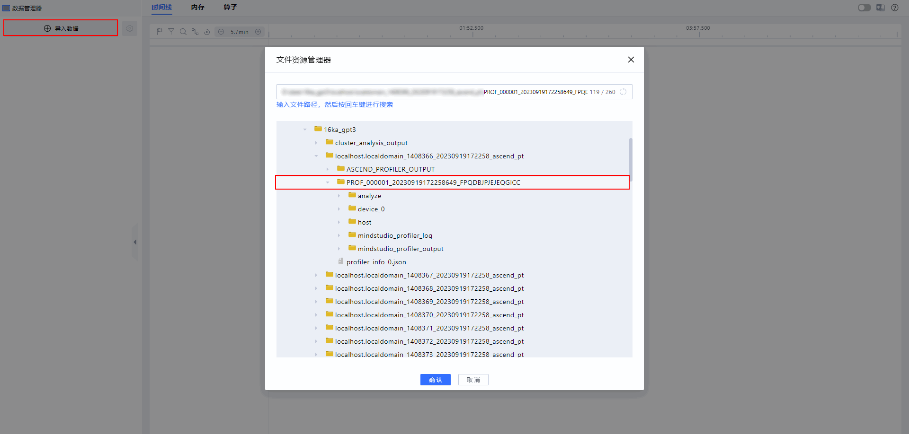
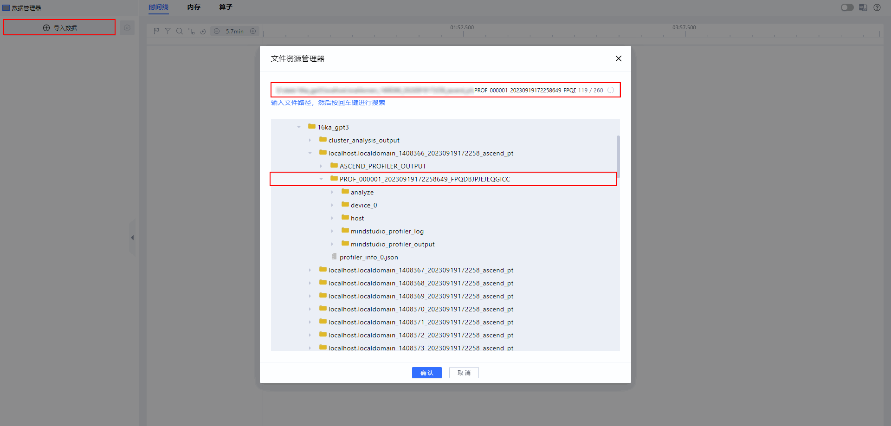
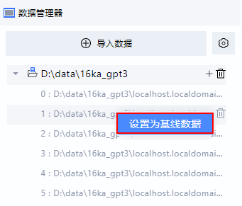
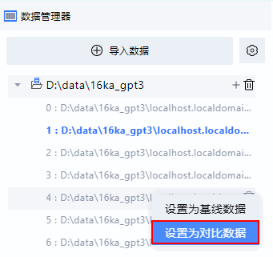
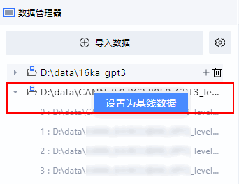

# **Basic Operations on MindStudio Insight**

## Overview

MindStudio Insight is a visualization tuning tool. You need to complete the basic configuration of the tool and be familiar with common operations. This document describes how to configure the theme and language, import data, manage data and logs, and use shortcut keys.

## Installation Description

Install MindStudio Insight first. For details, see [MindStudio Insight Installation Guide](./mindstudio_insight_install_guide.md).

## Setting the Theme and Language

**Setting the Theme**

1. Open MindStudio Insight.
2. Click  in the upper right corner of the page to switch the theme to light or dark.

**Setting the Language**

1. Open MindStudio Insight.
2. Click  in the upper right corner of the page to switch the language of MindStudio Insight to Chinese or English.

## Importing Data

MindStudio Insight supports three data import modes. This section describes how to import data.

**Procedure**

- Method 1: Selecting a profile data path
    1. Open MindStudio Insight and click **Import Data** in the upper left corner of the page.
    2. In the dialog box that is displayed, select a profile data file or directory and click **OK**, as shown in [Figure 1 Selecting a path](#selecting-a-path).

        Figure 1 Selecting a path 
        

- Method 2: Entering the profile data path
    1. Open MindStudio Insight and click **Import Data** in the upper left corner of the page.
    2. In the dialog box that is displayed, enter the correct path of the profile data to be imported in the text box and press **Enter** to locate the directory automatically in the lower part.
    3. Click **OK** to import the data, as shown in [Figure 2 Entering the correct path](#entering-the-correct-path).

        Figure 2 Entering the correct path 
        

- Method 3: Dragging a performance file to the MindStudio Insight GUI

    Start MindStudio Insight and drag a performance file to the MindStudio Insight GUI to open the corresponding page. A single file or a single folder of profile data can be dragged.

> [!NOTE]NOTE
>
> - Only local drive data can be imported. If the network drive is used, map the network drive to the local PC and then import the data to the corresponding directory. For details about how to map the network drive to the local PC, see [Data Cannot Be Loaded When a Network Drive Directory Is Dragged to MindStudio Insight](./FAQ.md#data-cannot-be-loaded-when-a-network-drive-directory-is-dragged-to-mindstudio-insight).
> - If dragging a file into MindStudio Insight on a Windows system is not allowed, refer to [File Drag and Drop in MindStudio Insight Is Disabled](./FAQ.md#file-drag-and-drop-in-mindstudio-insight-is-disabled) for resolution.

## Managing Data

After data is imported to MindStudio Insight, a project is generated under **Data Manager**. The project displays details about the imported data. MindStudio Insight has the data memory, data management, and data comparison functions.

**Data Memory**

When you start MindStudio Insight of the same version again, the data displayed last time is automatically remembered and displayed in the navigation pane.

**Data Management**

MindStudio Insight allow you to create, delete, add, and modify data project information.

Table 1 Data management operations

|Operation|Step|
|--|--|
|Creating a data project|Click **Import Data** in the upper left corner of the page. After the data is successfully imported, a data project is automatically created in the data manager's list.|
|Changing the data project name|In the data manager list, select the required project, double-click the project name, and enter a new name.|
|Deleting a single data project|Click  next to the project to delete the project.|
|Deleting multiple data projects|Click  next to **Import Data**, select the projects to be deleted, and click  in the row where the all button is located in the list to delete the selected projects. By default, all projects are selected.|
|Importing data to a project|Click  next to a project to import data to the project.|
|Deleting data from a project|Click  next to the selected data in a project to delete the selected data from the project.|
|Viewing the data path|In the data manager's list, right-click the required project or data and choose **Open in File Explorer** from the shortcut menu to go to the corresponding data file path.|

> [!NOTE]NOTE
> Deleting a data project does not affect the original performance files.

**Data Comparison**

MindStudio Insight supports performance comparison between single-rank data and between cluster data. You need to set baseline data and comparison data for comparison.

- Setting single-rank comparison
    1. Right-click the rank directory to be set as the baseline and choose **Set as Baseline Data** from the shortcut menu to set the selected rank as the baseline rank, as shown in [Figure 1 Setting as baseline data](#setting_as_baseline_data).

        After the setting is complete, the current rank directory is marked in a color. Right-click the current rank again and choose **Unset as Baseline Data** from the shortcut menu to cancel the baseline status of the current rank. Alternatively, right-click any rank directory and choose **Set as Baseline Data** from the shortcut menu to set the selected rank as the baseline data.

        **Figure 1** Setting as baseline data         
        

    2. Right-click the rank directory to be set as the comparison rank and choose **Set as Comparison Data** from the shortcut menu to set the selected rank as the comparison rank, as shown in [Figure 2 Setting as comparison data](#setting_as_comparison_data).

        After the setting is complete, the comparison rank directory is marked in a color, which is different from the color of the baseline data directory. Only the rank directory in the current project can be selected as the comparison rank. Right-click the current comparison rank again and choose **Unset as Comparison Data** from the shortcut menu to cancel the comparison status of the current comparison rank. Alternatively, right-click any rank directory and choose **Set as Comparison Data** from the shortcut menu to set the comparison data again.

        **Figure 2** Setting as comparison data   
        

    3. After the baseline data and comparison data are set, go to the **Timeline**, **Memory**, and **Operator** tab pages to view the data comparison details.

- Setting cluster comparison
    1. Select comparison data. The data that is currently selected is the comparison data.
    2. Select baseline data.

        Right-click the cluster directory to be set as the baseline and choose **Set as Baseline Data** from the shortcut menu, as shown in [**Figure 3** Setting as baseline data](#setting_as_baseline_data_2).

        After the setting is complete, the current cluster directory is marked in a color. Right-click the current cluster directory again and choose **Unset as Baseline Data** from the shortcut menu to cancel the baseline status of the current cluster directory. Alternatively, right-click any cluster directory and choose **Set as Baseline Data** from the shortcut menu to set the selected cluster directory as the baseline data.

        > [!NOTE]NOTE
        > If the cluster data directory imported to a project is `cluster\_analysis\_output`, you can also set the data in the project as the baseline data.

        **Figure 3** Setting as baseline data   
        

    3. After the baseline data is set, go to the **Summary** and **Communication** tab pages to view the data comparison details.

## Managing Logs

**Viewing the Log Storage Path**

You can view the log file storage path in two ways: directly viewing the path, or through the GUI.

- Log file storage paths

    For details about the log file paths of MindStudio Insight, see [**Table 1** Log file paths](#log_file_paths).

    **Table 1** Log file paths 

    |System|Log Storage Path|
    |--|--|
    |Windows|- The installation path is drive C, and the log path is `C:\Users\{Username}\.mindstudio_insight`. - The installation path is another directory, and the log path is `{Installation_directory}\.mindstudio_insight`.|
    |Linux|`$HOME/.mindstudio_insight`|
    |macOS|`/Users/{Username}/.mindstudio_insight`|

- GUI operations

    On the MindStudio Insight page, click  in the upper right corner and choose **Show Logs in Explorer** to go to the log storage directory.

    > [!NOTE]NOTE
    > This function is supported only on Windows and macOS.

**Log File Description**

The log file of MindStudio Insight is named `profiler_server_\{_Port_number_\}\_\{_ID_\}.log`. It is a program run log and is used by developers to locate faults.

**Log Clearance Mechanism**

The logs of MindStudio Insight can be cleared automatically or manually.

- Automatic clearance

    The log files of MindStudio Insight can be cleared automatically. Each port of MindStudio Insight can store only 10 log files. If the number of log files exceeds 10, the new log files will overwrite the earliest log files in sequence. The size of a single log file cannot exceed 10 MB.

- Manual clearance

    Go to the log file storage path and manually delete the log files. For details about the log file storage paths, see [Viewing the Log File Paths](#Log File Paths).

## Common Shortcut Keys

This section describes the common shortcut keys of MindStudio Insight. You can also click  in the upper right corner of MindStudio Insight and choose **Keyboard Shortcuts** to view the shortcut key information.

**Table 1** Common shortcut keys

|Shortcut Key|Description|
|--|--|
|W|Zooms in on the graphical pane on the **Timeline** tab page.|
|S|Zooms out on the graphical pane on the **Timeline** tab page.|
|Ctrl+mouse wheel|Zooms in or out on the graphical pane on the **Timeline** tab page. On macOS, press **Command** and scroll the mouse wheel.|
|Alt+left mouse button|Zooms in on the selected area on the **Timeline** tab page. On macOS, press **Option** and click the left mouse button.|
|Shift + Z|Zooms in on the selected area on the **Timeline** tab page to the current screen.|
|Backspace|Undoes the zooming of the graphical pane on the **Timeline** tab page.|
|A/Left arrow key|Moves the graphical pane on the **Timeline** tab page to the left.|
|D/Right arrow key|Moves the graphical pane on the **Timeline** tab page to the right.|
|Ctrl+left mouse button|Drags the graphical pane on the **Timeline** tab page to the left or right. In macOS, press **Command** and click the left mouse button.|
|Up arrow key|Moves the graphical pane on the **Timeline** tab page upward.|
|Down arrow key|Moves the graphical pane on the **Timeline** tab page downward.|
|Ctrl + 0|Resets the graphical pane on the **Timeline** tab page. In macOS, press **Command** and **0**.|
|M|Select the operator area on the **Timeline** tab page and press **M** again to cancel the selection.|
|L|On the **Timeline** page, select an operator and press **L** to align the start time (left boundary) of the selected operator with that of the reference operator.|
|R|On the **Timeline** page, select an operator and press **R** to align the end time (right boundary) of the selected operator with that of the reference operator.|
|Q|Collapses or expands the panel at the bottom of the **Timeline** tab page.|
|K|On the **Timeline** tab page, you can press **K** to quickly set area marks and single-point marks.|
|Shift+mouse wheel/Ctrl+mouse drag|Moves the pipeline parallelism chart and communication operator thumbnail to the left or right.|
|Ctrl+mouse wheel|Zooms in or out on the pipeline parallelism chart and communication operator thumbnail.|
|Ctrl + F|Displays the search box in the source file code area on the **Source** tab page. In macOS, press **Command** and **F**.|
