# **MindStudio Insight Installation Guide**

## Installation Description

MindStudio Insight is a visualization tuning tool designed for developers. It displays profile data in easy-to-understand charts, such as timeline charts and heatmaps, helping developers quickly identify performance bottlenecks and optimize performance. This document describes how to install MindStudio Insight.

MindStudio Insight can be installed and used on Windows, Linux, and macOS, and can be installed and used through the JupyterLab plugin.

## Preparing the Software Package

**Downloading the Software Package**

Click [here](https://gitcode.host/Ascend/msinsight/releases) to obtain the software package. After confirming the version information, obtain the software package listed in [**Table 1** Software package list](#software-package-list).

Once you download the software, you agree to the terms and conditions of [Huawei Enterprise End User License Agreement (EULA)](https://e.huawei.com/en/about/eula).

**Table 1** Software package list<a id="software-package-list"></a>

|Software Package|Description|
|--|--|
|MindStudio-Insight_*{version}*_win.exe|MindStudio Insight software package applicable to the Windows OS, containing the GUI-based integrated development environment.|  
|MindStudio-Insight_*{version}*_linux-aarch64.zip|MindStudio Insight software package applicable to the Linux OS (AArch64 architecture).|  
|MindStudio-Insight_*{version}*_linux-x86_64.zip|MindStudio Insight software package for Linux (x86_64).|  
|MindStudio-Insight_*{version}*_darwin-*{arch}*.dmg|MindStudio Insight software package for macOS, containing the GUI-based integrated development environment.|  
|mindstudio_insight_jupyterlab-{*version*}-py3-none-{*platform*}.whl|Software package installed based on JupyterLab.|

**Verifying Software Package Integrity**

To prevent a software package from being maliciously tampered with during transmission or storage, download the corresponding .sha256 file for integrity check while downloading the software package.

Click [digital signature file](https://gitcode.host/Ascend/msinsight/releases) to obtain the .sha256 file of the corresponding software package and verify the integrity of the downloaded software package. If the verification fails, do not use the package. Visit the support website to get help from the community or submit a service ticket.
The verification method is as follows:

1. Calculate the SHA256 value of the software package on the local PC.

    In Windows, run the following command to obtain the SHA256 value of the corresponding software package:

    ```powershell
    certutil -hashfile software_package_name SHA256
    ```

    In macOS, run the following command to obtain the SHA256 value of the corresponding software package:

    ```shell
    shasum -a 256 software_package_name
    ```

    In Linux, run the following command to obtain the SHA256 value of the corresponding software package:

    ```bash
    sha256sum software_package_name
    ```

2. Compare the obtained value with the value (case-insensitive) in the .sha256 file provided by the official website. If they are the same, the software package is not tampered with.

## Installing MindStudio Insight

### Installation (Windows)

**Preparing the Environment**

The installation and GUI of MindStudio Insight require specific Windows system and device configurations. For details, see [**Table 1** System configuration requirements](#system-configuration-requirements).

**Table 1** System configuration requirements<a id="system-configuration-requirements"></a>

|Type|Requirement|Description|
|--|--|--|
|System|Windows 10 64-bit|-|
|Memory configuration|16 GB or more recommended|In the foundation model cluster scenario, a large amount of data is loaded.|
|Disk space|30 GB or more available space recommended|The space is used to store database files generated during profile data loading.|

**Procedure**

1. Double-click the **MindStudio-Insight\__\{version\}_\_win.exe** software package.
2. On the **MindStudio Insight Setup** page, click **Next**, as shown in [**Figure 1** Setup](#Setup).

    **Figure 1** Setup <a id="Setup"></a>     
    

3. On the license agreement page, click **I Agree**, as shown in [**Figure 2** License Agreement](#license-agreement).

    **Figure 2** License Agreement <a id="license-agreement"></a> 
    

4. Select the installation path of MindStudio Insight and click **Next**, as shown in [**Figure 3** Selecting an installation path](#selecting-an-installation-path).

    **Figure 3** Selecting an installation path <a id="selecting-an-installation-path"></a> 
    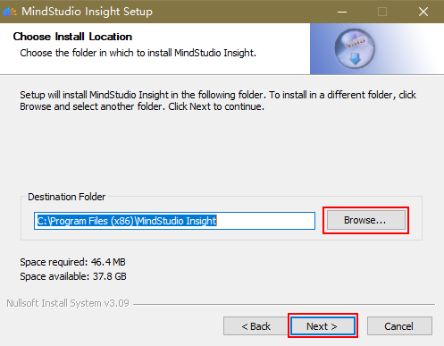

    > [!NOTE]NOTE 
    > The default installation directory is **C:\\Program Files \(x86\)\\MindStudio Insight**. If you select another directory, right-click the directory and choose **Properties** \> **Security** from the shortcut menu. On the **Security** tab page, modify the user permission to prevent other users from modifying the running file.

5. Select MindStudio Insight and click **Install**, as shown in [**Figure 4** Selecting components to be installed](#selecting-components-to-be-installed).

    **Figure 4** Selecting components to be installed<a id="selecting-components-to-be-installed"></a> 
    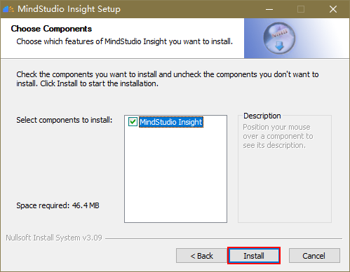

6. After MindStudio Insight is installed, click **Finish**, as shown in [**Figure 5** Installation completed](#installation-completed).<a id="6"></a>

    **Figure 5** Installation completed<a id="installation-completed"></a> 
    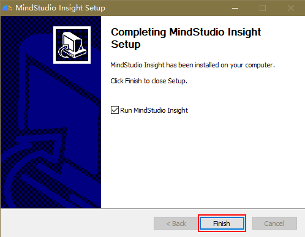

7. Start MindStudio Insight.

    - If you select **Run MindStudio Insight** in step [6](#6), MindStudio Insight will be automatically started after you click **Finish**.
    - If **Run MindStudio Insight** is not selected, you can double-click the MindStudio Insight shortcut icon on the desktop or **MindStudio-Insight.exe** in the installation directory to start MindStudio Insight after the installation is complete.

    > [!NOTE]NOTE  
    > If the "Missing Dependencies" error message is displayed when you run MindStudio Insight after the installation is complete, see [Error Message "Missing Dependencies" Is Displayed When MindStudio Insight Is Running](./FAQ.md#error-message-missing-dependencies-is-displayed-when-mindstudio-insight-is-running).

### Installation (Linux)

#### Overview

In the Linux environment, MindStudio Insight can be used in local mode or forwarding mode.

- Local mode

    In local mode, the server running the Linux OS is directly connected to an external monitor. The tool GUI is displayed on the OS desktop, which is similar to the scenario where a local Windows host is connected to a monitor. In this scenario, there is no delay of the tool GUI.

- Forwarding mode

    If no Linux server is available locally, you can connect to a remote Linux server and use X11, VNC, or xRDP to forward the desktop or software GUI on the remote Linux server to the local PC. For example, the application GUI on the Linux server is displayed on the local Windows desktop. You can use the forwarding capability of MindStudio Insight to implement GUI forwarding on the Linux server, which is convenient for developers. However, compared with the local mode, the forwarding mode is affected by network performance and may cause network delay. As a result, suspension may occur during tool installation and use.

This document describes the X11 and VNC forwarding modes. Developers can select one forwarding mode according to the actual situation. For details, see [**Table 1** Forwarding modes](#forwarding-modes). To install and use MindStudio Insight in forwarding mode, install the forwarding mode and software dependencies first. For details, see [Installing Dependencies](#installing-dependencies).

> [!NOTE]NOTE  
> The VNC forwarding mode is recommended, which provides a smoother experience.

**Table 1** Forwarding modes <a id="forwarding-modes"></a>

|Forwarding Mode|Network Delay|Security|Remarks|
|--|--|--|--|
|X11|Relatively high|The underlying layer is based on the SSH.|It is mostly used in local area networks with good network conditions.|
|VNC|Relatively low|By default, the TCP protocol is used. You can use SSH to ensure secure access.|It is more widely used and can be used on cross-city networks and VPN networks.|

**Preparing the Environment**

[**Table 2** Environment requirements for installing MindStudio Insight](#environment-requirements-for-installing-mindstudio-insight) describes the environment requirements for installing MindStudio Insight in the Linux OS.

**Table 2** Environment requirements for installing MindStudio Insight <a id="environment-requirements-for-installing-mindstudio-insight"></a>

|Type|Limitation|
|--|--|
|Hardware|- Memory: at least 4 GB (8 GB or above recommended)<br> - Minimum disk space: 6 GB|
|System requirement|- The glibc version must be 2.27 or later.<br> - The OS provides a built-in GUI desktop or supports X11 or VNC forwarding.|
|Supported OSs|OSs that use APT as the package management software:<br> - Ubuntu 18.04-x86_64/aarch64<br> - Ubuntu 20.04-x86_64/aarch64<br> - Ubuntu 22.04-x86_64/aarch64<br> - CentOS 8.2-x86_64/aarch64<br> - Debian 10.0<br> - Debian 10.8<br> OSs that use Yum or DNF as the package management software:<br> - EulerOS 2.8-aarch64<br> - EulerOS 2.12-aarch64<br> - OpenEuler 20.03-x86_64/aarch64<br> - OpenEuler 22.03 LTS-x86_64/aarch64<br> - OpenEuler 22.03 LTS<br> - OpenEuler 22.03 LTS SP4<br> - HCE 2.0<br> - CUlinux 3.0<br> - Kylin V10 SP3<br> - Euler 2.13(ARM)<br> - HCE 2.0.2503(x86)<br> - Tlinux 3.1 - kernel version 5.4<br> - BClinux 21.10 U4<br> - TencentOS Server 4.4_x86|

> [!NOTE]NOTE 
> When installing and using MindStudio Insight on a passthrough VM running the veLinux 5.15 system, you are advised to use the JupyterLab plugin to install MindStudio Insight. For details about how to install the JupyterLab plugin, see section "[Installation (JupyterLab Plugin)](#installation-(jupyterlab-plugin))".

#### Installing Dependencies

**Dependency List**

In the Linux environment, install related dependencies before installing MindStudio Insight. For details, see [**Table 1** Dependency list](#dependency-list).

> [!NOTE]NOTE  
> If the profile data in the multi-card scenario is imported to MindStudio Insight, run the `pip install pandas` command to install the Python pandas library.

**Table 1** Dependency list <a id="dependency-list"></a>

<table><thead>
  <tr>
    <th>Dependency</th>
    <th>Description</th>
  </tr></thead>
<tbody>
  <tr>
    <td>libwebkit2gtk-4.0-dev</td>
    <td>In the Ubuntu OS, this dependency is mandatory and indicates the library on which MindStudio Insight depends.</td>
  </tr>
  <tr>
    <td>gtk3-devel webkit2gtk4.1-devel</td>
    <td>In the CentOS, this dependency is mandatory and indicates the library on which MindStudio Insight depends.</td>
  </tr>
  <tr>
    <td>gtk3-devel webkit2gtk3-devel</td>
    <td>In the EulerOS and openEuler, this dependency is mandatory and indicates the library on which MindStudio Insight depends.</td>
  </tr>
  <tr>
    <td>xterm</td>
    <td>Dependency file used by MindStudio Insight for X11 forwarding. This dependency is mandatory for all systems when X11 forwarding is selected.</td>
  </tr>
  <tr>
    <td>x11-apps</td>
    <td>Dependency file used by MindStudio Insight for X11 forwarding in the Ubuntu OS. This dependency is mandatory when X11 forwarding is selected.</td>
  </tr>
  <tr>
    <td>xorg-x11-xauth</td>
    <td>Dependency file used by MindStudio Insight to forward data through X11 in CentOS, EulerOS, and openEuler. This dependency is mandatory when X11 forwarding is selected.</td>
  </tr>
  <tr>
    <td>xfce4</td>
    <td>Dependency file used by MindStudio Insight to forward data through VNC in Ubuntu, CentOS, and openEuler. This dependency is mandatory when VNC forwarding is selected.</td>
  </tr>
  <tr>
    <td>gnome-desktop</td>
    <td>Dependency file used by MindStudio Insight to forward data through VNC in EulerOS. This dependency is mandatory when VNC forwarding is selected.</td>
  </tr>
  <tr>
    <td>click</td>
    <td rowspan="13">Dependencies required for compiling and installing Python.<br>The version requirements are as follows:<br>xlsxwriter&gt;=3.0.6<br>numpy&lt;=1.26.4</td>
  </tr>
  <tr>
    <td>tabulate</td>
  </tr>
  <tr>
    <td>networkx</td>
  </tr>
  <tr>
    <td>jinja2</td>
  </tr>
  <tr>
    <td>PyYaml</td>
  </tr>
  <tr>
    <td>tqdm</td>
  </tr>
  <tr>
    <td>prettytable</td>
  </tr>
  <tr>
    <td>ijson</td>
  </tr>
  <tr>
    <td>xlsxwriter</td>
  </tr>
  <tr>
    <td>sqlalchemy</td>
  </tr>
  <tr>
    <td>numpy</td>
  </tr>
  <tr>
    <td>pandas</td>
  </tr>
  <tr>
    <td>psutil</td>
  </tr>
</tbody></table>

**Installing Dependencies**

1. Run the following commands to install Python dependencies:

    ```python
    pip3 install click
    pip3 install tabulate
    pip3 install networkx
    pip3 install jinja2
    pip3 install PyYaml
    pip3 install tqdm
    pip3 install prettytable
    pip3 install ijson
    pip3 install xlsxwriter
    pip3 install sqlalchemy
    pip3 install numpy
    pip3 install pandas
    pip3 install psutil
    ```

2. Configure the forwarding method and install dependencies required by the MindStudio Insight software package. You are advised to configure VNC and X11 for forwarding.

#### Configuring VNC for Forwarding

Starting MindStudio Insight through VNC forwarding provides a smoother experience. Therefore, you are advised to use the VNC forwarding to use MindStudio Insight.

> [!NOTE]NOTE
>
> - MindStudio Insight cannot be started through VNC in EulerOS 2.12.
> - This section is for reference only. For details about how to install VNC, see the [official VNC documentation](https://docs.redhat.com/en/documentation/red_hat_enterprise_linux/6/html/deployment_guide/chap-tigervnc#s2-starting-vncserver).

**Installing Dependencies**

1. Run the following command to install the libraries required for running MindStudio Insight:
    - For Ubuntu and other OSs that use APT as the package management software

        ```shell
        sudo apt install -y libwebkit2gtk-4.0-dev
        ```

    - For CentOS, EulerOS, openEuler, and other OSs that use Yum or DNF as the package management software

        1. Run the following command to query the **webkit2gtk** library file:

            ```shell
            sudo yum search webkit2gtk
            ```

            The command output is as follows:

            ```tex
            = Name and Summary match: webkit2gtk =====================================================================================
            webkit2gtk3-devel.aarch64 : Development files for webkit2gtk3
            webkit2gtk3-help.noarch : Documentation files for webkit2gtk3
            webkit2gtk3-jsc.aarch64 : JavaScript engine from webkit2gtk3
            webkit2gtk3-jsc-devel.aarch64 : Development files for JavaScript engine from webkit2gtk3
            ========================================================================================== Name match: webkit2gtk ===========================================================================================
            webkit2gtk3.aarch64 : GTK+ Web content engine library
            ========================================================================================= Summary match: webkit2gtk =========================================================================================
            libproxy-webkitgtk4.aarch64 : plugin for webkit2gtk3
            ```

        2. Run the following command to install the **webkit2gtk** library based on the command output:

            ```shell
            sudo yum install -y ${dependency_name}
            ```

            In the preceding command, `dependency_name` indicates the name of the dependency file. You can determine the name by referring to the command output. For example, if **webkit2gtk3-devel** is displayed in the command output, the dependency file name is **webkit2gtk3-devel**. If **webkit2gtk3-devel** is not displayed in the command output, **webkit2gtk3** needs to be found, and the dependency file name is **webkit2gtk3**.

        > [!NOTE]NOTE  
        > EulerOS 2.12 is developed based on openEuler 22.03 LTS SP1. You need to configure the openEuler 22.03 LTS SP1 source and then run the installation command. For details about how to configure the openEuler source, see [openEuler source configuration](https://mirrors.huaweicloud.com/mirrorDetail/5ebe3408c8ac54047fe607f0?mirrorName=openeuler&catalog=os).

2. Run the following command as the **root** user to install the desktop dependencies forwarded by MindStudio Insight through VNC:
    - For Ubuntu and other OSs that use APT as the package management software

        ```shell
        apt-get install -y xfce4 xfce4-goodies
        ```

    - For CentOS, EulerOS, openEuler, and other OSs that use YUM or DNF as the package management software
        1. Run the following command to check whether **xfce** exists:

            ```shell
            yum search xfce
            ```

            If the command output contains **xfce** information, run the following command to install **xfce**:

            ```shell
            yum install -y xfce4*
            ```

            If the command output is "No matches found", go to [2](#2_b).

        2. Run the following command to check whether **gnome** exists:<a id="2_b"></a>

            ```shell
            yum search gnome
            ```

            If the command output contains **gnome** information, run the following command to install **gnome**:

            ```shell
            yum install -y gnome* 
            ```

3. Run the following command to install the VNC server:
    - For Ubuntu and other OSs that use APT as the package management software

        ```shell
        apt-get install -y tightvncserver
        ```

    - For CentOS, EulerOS, openEuler, and other OSs that use Yum or DNF as the package management software

        ```shell
        yum install -y tigervnc-server
        ```

**Setting the VNC Server**

1. Run the following command to set the password for the first VNC connection:

    ```shell
    vncserver
    ```

2. If the following information is displayed, enter the password as prompted:

    ```shell
    You will require a password to access your desktops.
    Password: Enter the password.
    Verify: Enter the password again.
    ```

3. After the password is entered, the following information is displayed:<a id="3"></a>

    ```tex
    Would you like to enter a view-only password (y/n)? 
    ```

    Enter **n** as prompted. If the following information is displayed, the startup script and default configuration are created. The value of `x` in the first line indicates the display sequence number.

    ```tex
    New 'localhost.localdomain:x' desktop is localhost.localdomain:x
    Creating default startup script /home/xxx/.vnc/xstartup
    Creating default config /home/xxx/.vnc/config
    Starting applications specified in /home/xxx/.vnc/xstartup
    Log file is /home/xxx/.vnc/localhost.localdomain:3.log
    ```

4. Run the following command to stop the enabled VNC server:

    ```shell
    vncserver -kill :x
    ```

    > [!NOTE]NOTE  
    > The value of *x* here is the same as that in the first line of the command output in [3](#3).

5. Run the `vi ~/.vnc/xstartup` command to open the **xstartup** startup script and add a line of text to the end of the script. For details about the text to be added, see [**Table 1** Text content](#text-content).

    **Table 1** Text content <a id="text-content"></a>

    |Dependencies Installed|Text|
    |--|--|
    |xfce|startxfce4 &|
    |gnome|gnome-session &|

6. Run the `:wq!` command to save the script and exit.

**Starting the VNC Server**

Run the following command to start the VNC server:

```shell
vncserver -localhost -geometry 1920x1080
```

> [!NOTE]NOTE  
>
> - **localhost**: starts the VNC service on the local host. This parameter must be used together with [Port Forwarding](#port-forwarding). If the network environment is secure, you can directly perform the step of [Connecting to the VNC Server Locally](#connecting-to-the-vnc-server-locally) without using localhost or port forwarding. (This method is not recommended.)
> - **geometry 1920 × 1080**: sets the VNC desktop resolution to 1920 × 1080 pixels. The resolution can be adjusted based on the resolution of the monitor.

**Port Forwarding** <a id="port-forwarding"></a>

Forward the Linux local host service to the Windows local port through the SSH channel.

1. Start the remote login tool and choose **Tools** \> **MobaSSHTunnel \(port forwarding\)**. MobaXterm is used as an example.
2. Click **New SSH Tunnel** to create SSH configuration.

    **Figure 1** Creating SSH configuration 
    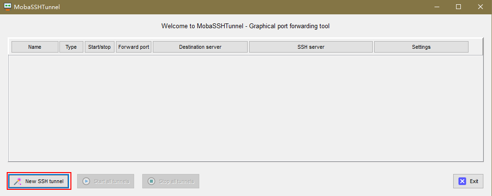

3. Select **Local port forwarding** and configure the information on the page by referring to [**Table 2** Configuring the Local port forwarding page information](#configuring-the-local-port-forwarding-page-information).

    **Figure 2** Local port forwarding 
    

    **Table 2** Configuring the Local port forwarding page information <a id="configuring-the-local-port-forwarding-page-information"></a>

    |Parameter|Description|Example|
    |--|--|--|
    |Remote server|Address of the Linux server.|127.0.0.1|
    |Remote port|Port of the Linux server. The value is 5900 plus the value of *x* (display sequence number) in the VNC server.|5901|
    |SSH server|IP address or URL used for SSH connection.|192.168.25.38|
    |SSH login|Username/password pair for SSH login.|-|
    |SSH port|Port used for SSH login, which is 22 in most cases.|22|
    |Forwarded port|Port forwarded to the local Windows. The value can be the same as that of the remote port.|5901|

4. Click **Save**. The SSH configuration is complete.
5. In the **MobaSSHTunnel** dialog box, select the configured SSH tunnel and click  to enable port forwarding.

    If the SSH login parameter in the SSH configuration is set to a username, a dialog box is displayed when the SSH tunnel is started for the first time. Enter the password of the user to start the SSH tunnel.

**Connecting to the VNC Server Locally** <a id="connecting-to-the-vnc-server-locally"></a>

1. On the MobaXterm home page, click **Session**. The **Session settings** page is displayed.
2. Click **VNC** and set **Remote hostname or IP address** and **Port** based on the actual situation.

    > [!NOTE]NOTE  
    > - If port forwarding is used, <parmname class="+ topic/keyword pr-d/parmname " id="parmname14997123523015">Remote hostname or IP address</parmname> is **127.0.0.1** and <parmname class="+ topic/keyword pr-d/parmname " id="parmname59977351301">Port</parmname> is **Forwarded port**.
    > - If port forwarding is not used, <parmname class="+ topic/keyword pr-d/parmname " id="parmname699711358300">Remote hostname or IP address</parmname> is the actual IP address of the remote Linux OS, and <parmname class="+ topic/keyword pr-d/parmname " id="parmname18997133513302">Port</parmname> is 5900 plus the value of *x* (display sequence number) in the VNC server settings.

    **Figure 3** Configuring the VNC 
    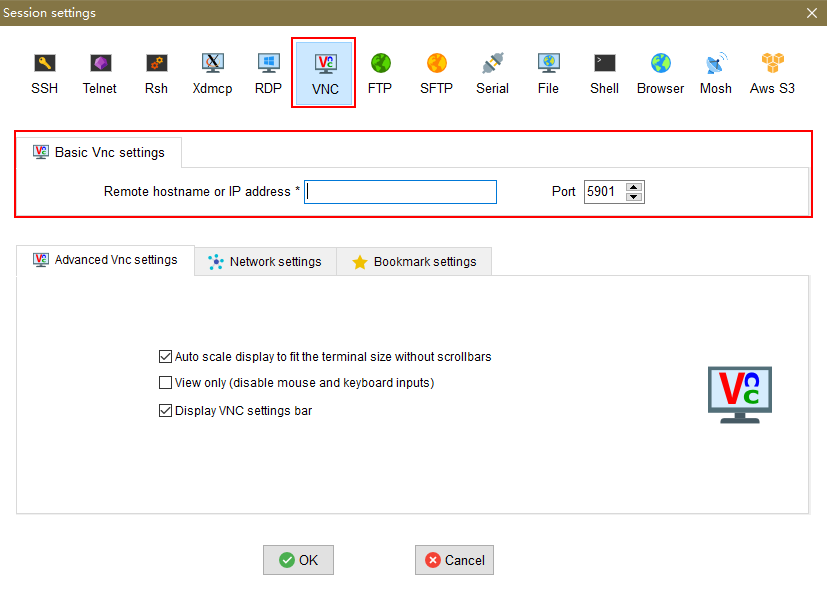

3. After the configuration is complete, click **OK**. In the dialog box that is displayed, enter the VNC password to forward the desktop to the local PC for subsequent operations.

    **Figure 4** Desktop 
    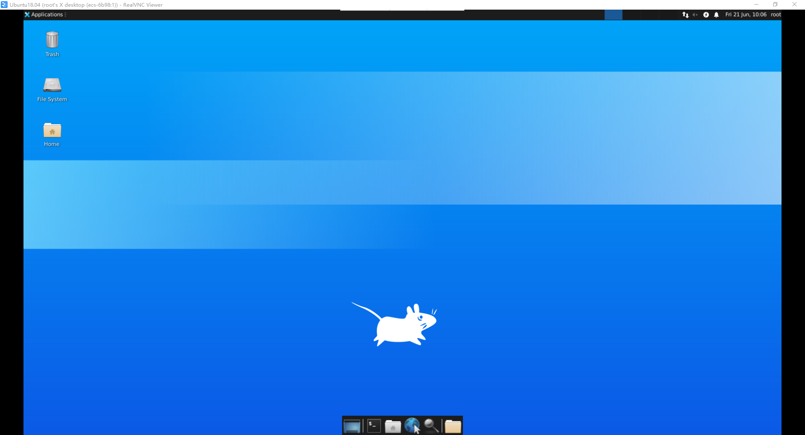

#### Installing X11 for Forwarding

**Prerequisites**

Ensure that the source is available. Run the following command as the **root** user to check whether the source is valid:

- For Ubuntu and other OSs that use APT as the package management software

    ```shell
    apt-get update
    ```

- For CentOS, EulerOS, openEuler, and other OSs that use Yum or DNF as the package management software

    ```shell
    yum makecache
    ```

> [!NOTE]NOTE  
> If a message is displayed during the installation of openEuler and its derivative OSs, indicating that the required dependencies cannot be found, the possible cause is that the dependencies are missing in the configured source. In this case, you can configure a new source by referring to [here](https://www.hiascend.com/forum/thread-02101178181671140059-1-1.html) and reinstall the dependencies.

**Procedure**

1. Run the following command to install the libraries required for running MindStudio Insight:
    - For Ubuntu and other OSs that use APT as the package management software

        ```shell
        sudo apt install -y libwebkit2gtk-4.0-dev
        ```

    - For CentOS, EulerOS, openEuler, and other OSs that use Yum or DNF as the package management software

        1. Run the following command to query the **webkit2gtk** library:

            ```shell
            sudo yum search webkit2gtk
            ```

            The command output is as follows:

            ```tex
            = Name and Summary match: webkit2gtk =====================================================================================
            webkit2gtk3-devel.aarch64 : Development files for webkit2gtk3
            webkit2gtk3-help.noarch : Documentation files for webkit2gtk3
            webkit2gtk3-jsc.aarch64 : JavaScript engine from webkit2gtk3
            webkit2gtk3-jsc-devel.aarch64 : Development files for JavaScript engine from webkit2gtk3
            ========================================================================================== Name match: webkit2gtk ===========================================================================================
            webkit2gtk3.aarch64 : GTK+ Web content engine library
            ========================================================================================= Summary match: webkit2gtk =========================================================================================
            libproxy-webkitgtk4.aarch64 : plugin for webkit2gtk3
            ```

        2. Run the following command to install the **webkit2gtk** library based on the command output:

            ```shell
            sudo yum install -y ${dependency_name}
            ```

            `dependency_name` indicates the name of the dependency file. You can determine the name based on the command output. For example, if **webkit2gtk3-devel** is displayed in the command output, the dependency file name is **webkit2gtk3-devel**. If **webkit2gtk3-devel** is not displayed in the command output, **webkit2gtk3** needs to be found, and the dependency file name is **webkit2gtk3**.

        > [!NOTE]NOTE  
        > EulerOS 2.12 is developed based on openEuler 22.03 LTS SP1. You need to configure the openEuler 22.03 LTS SP1 source and then run the installation command. For details about how to configure the openEuler source, see [openEuler source configuration](https://mirrors.huaweicloud.com/mirrorDetail/5ebe3408c8ac54047fe607f0?mirrorName=openeuler&catalog=os).

2. Run the following command to install the dependency files required by MindStudio Insight to use X11 forwarding:
    - For Ubuntu and other OSs that use APT as the package management software

        ```shell
        sudo apt-get install -y xterm x11-apps
        ```

    - For CentOS, EulerOS, openEuler, and other OSs that use Yum or DNF as the package management software

        ```shell
        sudo yum install -y xterm xorg-x11-xauth
        ```

#### Install MindStudio Insight

1. Upload the software package to the target environment as the MindStudio Insight installation user.
2. In the directory where the software package is stored, run the following command to decompress the MindStudio Insight software package:
    - Software package for the AArch64 architecture

        ```shell
        unzip MindStudio-Insight_{version}_linux-aarch64.zip
        ```

    - Software package for the x86_64 architecture

        ```shell
        unzip MindStudio-Insight_{version}_linux-x86_64.zip
        ```

3. Run the following command to start MindStudio Insight:

    ```shell
    ./MindStudio-Insight
    ```

    > [!NOTE]NOTE  
    > - If you are running MindStudio Insight on EulerOS and click  on the toolbar in the upper left corner of the page, the dialog box for importing is not displayed, you can fix the issue by referring to "[The Data Import Dialog Box Cannot Be Displayed When MindStudio Insight Is Running on EulerOS](./FAQ.md#the-data-import-dialog-box-cannot-be-displayed-when-mindstudio-insight-is-running-on-euleros)".
    > - When MindStudio Insight is running in X11 forwarding mode, if the pasted information in the text box is not as expected, the entered information may be incorrect. For details about the solution, see "[The Information in the Text Box Is Incorrectly Pasted When MindStudio Insight Is Running in X11 Forwarding Mode](./FAQ.md#the-information-in-the-text-box-is-incorrectly-pasted-when-mindstudio-insight-is-running-in-x11-forwarding-mode)".

### Installation (macOS)

**Preparing the Environment**

Prepare macOS Ventura 13.5 or later.

**Procedure**

1. Double-click the **MindStudio-Insight\__***\{version\}_\_***darwin-***_\{arch\}_***.dmg** software package. In the displayed license agreement dialog box, click **Agree**, as shown in [**Figure 1** License agreement](#license-agreement).

    **Figure 1** License agreement <a id="license-agreement"></a> 
    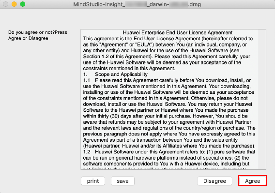

2. In the displayed **Installer** dialog box, drag the MindStudio Insight application to the **Applications** folder, as shown in [**Figure 2** Dragging the application to the folder](#dragging-the-application-to-the-folder).

    **Figure 2** Dragging the application to the folder <a id="dragging-the-application-to-the-folder"></a> 
    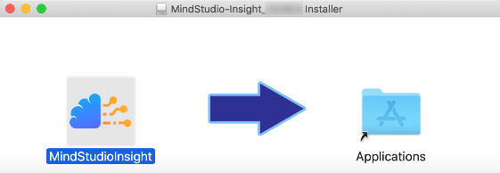

3. Double-click the MindStudio Insight application to open MindStudio Insight.

    > [!NOTE]NOTE  
    > - The MindStudio Insight application applicable to the macOS may fail to be started on some macOS systems.<br> If a dialog box indicating that MindStudio Insight cannot be started is displayed when MindStudio Insight is running, click **OK** in the dialog box. Then, choose **System Settings** \> **Privacy & Security** \> **Security**, select **App Store & Known Developers**, and click **Open Anyway** in the **"MindStudio Insight" was blocked to protect your Mac** dialog box to grant the execute permission, and double-click the MindStudio Insight application again. If the dialog box indicating that MindStudio Insight cannot be opened is displayed, click **Done** to open MindStudio Insight.
    > - To open multiple MindStudio Insight tools on macOS at the same time, run the `open -n /Applications/MindStudio Insight.app` command in the CLI. However, you are not advised to open the same data in two MindStudio Insight windows at the same time to avoid data parsing problems.

### Installation (JupyterLab Plugin) <a id="installation-(jupyterlab-plugin)"></a>

**Introduction**

In the Linux environment, MindStudio Insight can be integrated into JupyterLab as a plugin to provide a more intuitive and interactive user interface. [**Table 1** Advantages of the JupyterLab plugin](#advantages-of-the-jupyterlab-plugin) describes the advantages of the JupyterLab plugin.

**Table 1** Advantages of the JupyterLab plugin<a id="advantages-of-the-jupyterlab-plugin"></a>

|Advantage|Description|
|--|--|
|Seamless integration|The MindStudio Insight tool can be directly run in the Jupyter environment without switching platforms or copying data from the server. This enables data to be used immediately after being collected.|
|Quick boot|The MindStudio Insight tool can be quickly started through the CLI or GUI of JupyterLab.|
|Smooth running|In Linux environments, launching MindStudio Insight through the JupyterLab interface effectively resolves runtime lag issues compared to packet-based communication, delivering a significantly improved operational experience.|
|Remote connection|You can remotely start MindStudio Insight and use a local browser to remotely connect to the service for visualized analysis, which alleviates the difficulties in uploading and downloading training or inference data of models.|

**Preparing the Environment**

1. Run the following command to install JupyterLab in the Linux OS. For details about the environment requirements, see [**Table 2** Environment requirements](#environment-requirements).

    ```shell
    pip install jupyterlab
    ```

    **Table 2** Environment requirements<a id="environment-requirements"></a>

    |Type|Requirement|
    |--|--|
    |Supported OSs|Linux|
    |Dependencies|Version: Python 3.8 or later<br>To open cluster data, install the Python dependencies by referring to section "[Installing Dependencies](#installing-dependencies)".|
    |JupyterLab|Version: JupyterLab 4.0 or later, but earlier than 5.0|

2. After the installation is complete, check the JupyterLab version.

    ```shell
    jupyter --version
    ```

3. (Optional) Use conda to manage the environment.

    Run the following commands to create and activate a virtual environment:

    ```shell
    conda create -n {your_env_name} python={python version} jupyterlab={jupyterlab version}  
    conda activate {your_env_name} # Activate the virtual environment.
    ```

**Procedure**

1. Install the MindStudio Insight plugin package.

    ```shell
    pip install mindstudio_insight_jupyterlab-{version}-py3-none-{platform}.whl
    ```

    > [!NOTE]NOTE  
    > Before installing the plugin package, check the umask setting of the current user. The recommended setting is 0027. For details, see the [Security Statement](./security_statement.md).

2. Check whether MindStudio Insight is successfully installed.

    ```shell
    jupyter labextension list
    ```

    If the following information is displayed, the installation is successful:

    ```tex
    mindstudio_insight_jupyterlab v{version} enabled  X (python, mindstudio_insight_jupyterlab)
    ```

3. Enable the JupyterLab service and open the MindStudio Insight tool.<a id="jupyter_3"></a>

    - If you are not the **root** user, run the following command:

        ```shell
        jupyter lab
        ```

    - If you are the **root** user, run the following command:

        ```shell
        jupyter lab --allow-root
        ```

    > [!NOTE]NOTE  
    > You are advised to run commands as a non-root user. If you need to run commands as the **root** user, strictly follow the instructions for the **root** user. Otherwise, security risks may occur.

    After the JupyterLab service is enabled, enter "http://\{_your\_server\_ip_\}:\{_your\_server\_port_\}/lab" in the address box of the browser to open the JupyterLab home page, as shown in [**Figure 1** JupyterLab home page](#jupyterlab-home-page). Click the MindStudio Insight icon to open the MindStudio Insight tool.

    **Figure 1** JupyterLab home page <a id="jupyterlab-home-page"></a> 
    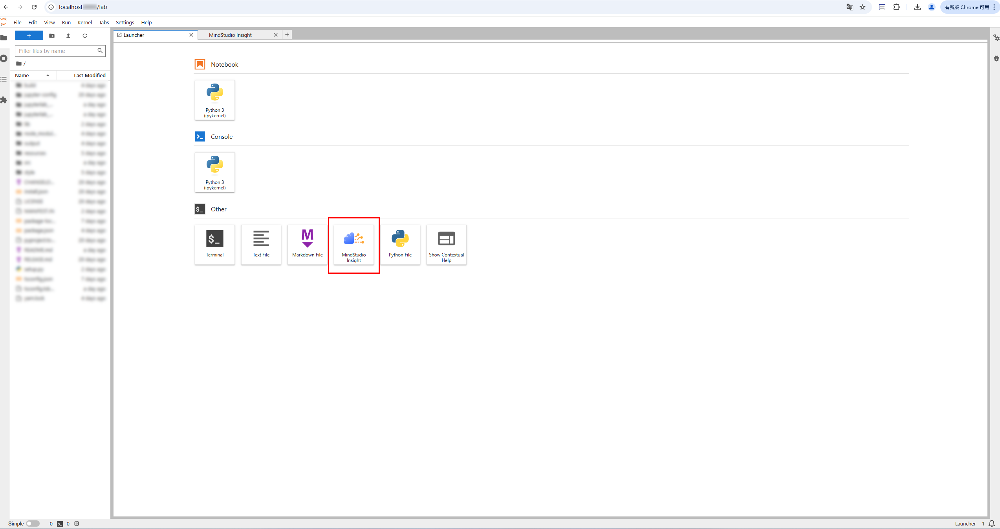

4. If the MindStudio Insight icon is not displayed on the JupyterLab home page, run the following command to check whether the MindStudio Insight plugin is enabled:

    ```shell
    jupyter server extension list 
    ```

    - If the following information is displayed, the plugin has been enabled:

        ```tex
        mindstudio_insight_jupyterlab enabled
            - Validating mindstudio_insight_jupyterlab...
              mindstudio_insight_jupyterlab  OK
        ```

    - If the plugin is not enabled, run the following command to enable it:

        ```shell
        jupyter server extension enable mindstudio_insight_jupyterlab
        ```

5. After the MindStudio Insight plugin is enabled, repeat step [3](#jupyter_3) to open the MindStudio Insight tool.

    **Precautions**  

    - If the browser is not installed on the local PC or the foundation model performance tuning data and JupyterLab are stored on the server, enable the service and load the data on the server, and then use the local browser to access and view the data. To enable the JupyterLab service, perform the following steps:
        1. Create a JupyterLab configuration file. The configuration here is the official JupyterLab configuration, which is irrelevant to the MindStudio Insight plugin.

            ```shell
            jupyter lab --generate-config
            ```

        2. Go to the **jupyter** directory and open the **jupyter\_lab\_config.py** configuration file.
        3. Modify the configuration file. Search for the keywords **c.ServerApp.ip** and **c.ServerApp.open\_browser**, delete the comment tags (#) at the beginning of the lines where the keywords are located, modify the parameters in the configuration file, and save the file for the configuration file to take effect.

            ```tex
            # Modify the parameters to make them take effect (remove the comments in the configuration file).
            c.ServerApp.ip = '0.0.0.0'
            c.ServerApp.open_browser = False
            ```

        4. After the configuration is complete, restart the JupyterLab service and open the MindStudio Insight tool by referring to [3](#jupyter_3).

    - If the cloud platform you are using has integrated the JupyterLab service and you need to use MindStudio Insight on the cloud platform, you can install the Jupyter proxy service plugin **jupyter-server-proxy** on the cloud platform to use MindStudio Insight.<br>
    If the Jupyter proxy service plugin cannot be installed on the cloud platform and ports 9000 to 9099 are not enabled on the public network, the MindStudio Insight tool cannot be used.
        1. Install the Jupyter proxy service plugin.

            ```shell
            pip install jupyter-server-proxy
            ```

        2. Restart the JupyterLab service and open the MindStudio Insight tool by referring to [3](#jupyter_3).

    - On the JupyterLab home page, you can click the MindStudio Insight icon for multiple times to open multiple MindStudio Insight tab pages, which can be used at the same time.

    - Pay attention to the security risks when using the MindStudio Insight tool installed using the JupyterLab plugin. For details, see [Security Statement](./security_statement.md).

### Installation (Plugin Development)

MindStudio Insight supports plugin development. Developers can develop and install plugin packages to implement independent development functions.

**Developing a Plugin**

Developers can develop plugins. For details, see [Plugin Development Guide](https://gitcode.com/ascend/mstt/blob/poc/plugins/mindstudio-insight-plugins/document/%E6%8F%92%E4%BB%B6%E5%BC%80%E5%8F%91%E6%8C%87%E5%8D%97.md#%E6%8F%92%E4%BB%B6%E5%BC%80%E5%8F%91%E6%8C%87%E5%8D%97).

The plugin package must meet the following requirements:

1. The plugin package must be a ZIP package.
2. The plugin package must contain the following files:

    - **config.json** configuration file
    - Frontend product: The file must be a ZIP package, which contains the frontend asset directory and its files, and the **index.html** file.
    - Backend product: The file must be a ZIP package, which contains the dynamic libraries required by the plugin and a single dynamic library file of the corresponding platform and architecture. The key value of the backend product in the **config.json** configuration file is "**backend\_***\{_platform_\}\_\{_machine_\}*", where *platform* indicates the platform name and *machine* indicates the architecture name. For example, in the Linux x86 environment, the key value of the backend product is **backend\_linux\_x86\_64**.

    The **config.json** configuration file must meet the following requirements:

    ```json
    {
        "pluginName": "*Plugin Name*",
        "frontend":"Frontend product name",                      # ZIP package
        "backend_{platform}_{machine}":"Backend product name",  # ZIP package or dynamic library
    }
    ```

    In the command, *platform* indicates the platform name, and *machine* indicates the architecture name.

3. The number of files in the plugin package cannot exceed 1000, and the size of a single file cannot exceed 200 MB.
4. The plugin package must be owned by the current user and have the read and write permissions. Link files and files containing links are not supported.

> [!NOTE]NOTE  
> MindStudio Insight supports the loading of any plugin in the .so format. You must verify the integrity of the required plugin package to ensure that the package is from a secure and reliable source, thereby avoiding potential security risks such as community poisoning and malicious code injection.

**Installing a Plugin**

Go to the installation directory of MindStudio Insight and run the following command to install the developed plugin package. **plugin package path** indicates the path of the plugin package.

```shell
python resources/profiler/plugin_install.py install --path="plugin package path"
```

**Using a Plugin**

After the installation is complete, open MindStudio Insight and import data.

If the wakeup logic is developed independently, use the plugin package based on the actual situation.

## Upgrading MindStudio Insight

To upgrade MindStudio Insight, uninstall the existing one, obtain the latest MindStudio Insight software package, and install it.

Uninstall MindStudio Insight by referring to [Uninstalling MindStudio Insight](#uninstalling-mindstudio-insight) and install the latest MindStudio Insight software package.

## Uninstalling MindStudio Insight

### Uninstallation (Windows)

1. Go to the MindStudio Insight installation directory and double-click **Uninstall.exe**. The uninstallation page is displayed. Click **Uninstall**, as shown in [**Figure 1** MindStudio Insight uninstallation page](#mindstudio-insight-uninstallation-page).

    **Figure 1** MindStudio Insight uninstallation page<a id="mindstudio-insight-uninstallation-page"></a> 
    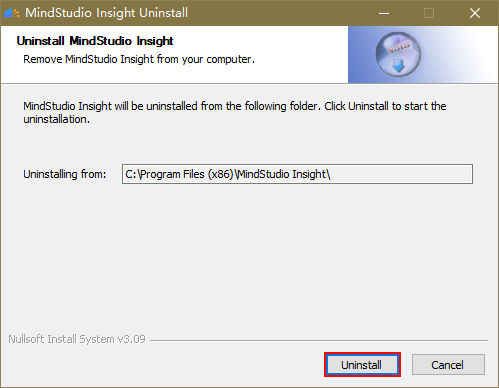

2. Click **Next**.

    **Figure 2** Uninstallation     
    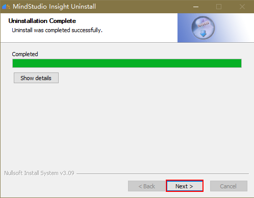

3. Select **Remove cache data** to clear cache data and click **Uninstall**.

    **Figure 3** Clearing cache data 
    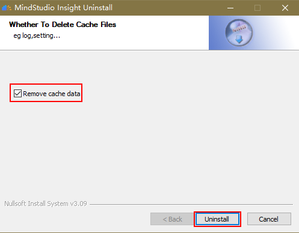

4. The uninstallation is complete.

    **Figure 4** Uninstallation completed 
    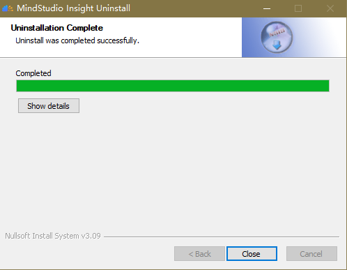

### Uninstallation (Linux)

In the Linux OS, you can uninstall MindStudio Insight in either of the following ways:

- Method 1: Directly delete the decompressed MindStudio Insight software package. This operation does not delete log files.
- Method 2: Use the command line to uninstall MindStudio Insight.
    1. Run the following command to uninstall MindStudio Insight:

        ```shell
        rm -rf MindStudio-Insight resources
        ```

    2. Run the following command to delete the log files of MindStudio Insight:

        ```shell
        rm -rf ${HOME}/.mindstudio_insight
        ```

### Uninstallation (macOS)

1. Access the **Applications** and find MindStudio Insight.
2. Right-click the MindStudio Insight application. The menu bar is displayed.
3. Click **Move** to Trash to uninstall the application.

### Uninstallation (JupyterLab Plugin)

Uninstall the MindStudio Insight plugin package.

```shell
pip uninstall mindstudio_insight_jupyterlab
```
