# **MindStudio Insight Operator Tuning**

## Overview

MindStudio Insight provides the instruction pipeline view, operator source view, and operator runtime load analysis view to visualize the key performance metrics of operators running on the Ascend AI Processor, helping developers quickly locate software and hardware performance bottlenecks and improve operator performance analysis efficiency.

## Preparations

**Environment Setup**

Install MindStudio Insight first. For details, see [MindStudio Insight Installation Guide](./mindstudio_insight_install_guide.md).

**Data preparation**

Import profile data in the correct format. For details about the data, see [Data Description](#data-description). For details about how to import data, see [Importing Data](./basic_operations.md#importing-data).

## Data Description

**Data file**

For details about the profile data files that can be imported in the operator tuning scenario, see [**Table 1** Importable profile data](#importable-profile-data).

**Table 1** Importable profile data

<table><thead>
  <tr>
    <th>File Name</th>
    <th>Description</th>
    <th>How to Obtain</th>
    <th>GUI</th>
  </tr></thead>
<tbody>
  <tr>
    <td>trace.json</td>
    <td>Operator instruction pipeline trace file for visualization</td>
    <td>For details, see <a href="https://gitcode.com/Ascend/msopprof/blob/master/docs/en/msopprof_simulator_user_guide.md">msopprof simulator User Guide</a>.</td>
    <td>Timeline</td>
  </tr>
  <tr>
    <td rowspan="3">visualize_data.bin</td>
    <td>Instruction pipeline data file for visualization</td>
    <td>For details, see the <a href="https://gitcode.com/Ascend/msopprof/blob/master/docs/en/msopprof_user_guide.md">msopprof User Guide</a> and <a href="https://gitcode.com/Ascend/msopprof/blob/master/docs/en/msopprof_simulator_user_guide.md">msopprof simulator User Guide</a>.</td>
    <td>Timeline</td>
  </tr>
  <tr>
    <td>Data file for visualizing basic operator information, computing unit load, and Roofline bottleneck analysis information.</td>
    <td>For details, see the <a href="https://gitcode.com/Ascend/msopprof/blob/master/docs/en/msopprof_user_guide.md">msopprof User Guide</a>.</td>
    <td>Details</td>
  </tr>
  <tr>
    <td>Data file for visualizing information such as simulation hotspot functions.</td>
    <td>For details, see the <a href="https://gitcode.com/Ascend/msopprof/blob/master/docs/en/msopprof_user_guide.md">msopprof User Guide</a> and <a href="https://gitcode.com/Ascend/msopprof/blob/master/docs/en/msopprof_simulator_user_guide.md">msopprof simulator User Guide</a>.</td>
    <td>Source</td>
  </tr>
  <tr>
    <td>visualize_data.bin</td>
    <td>L2 cache access data file of user kernel functions for visualization</td>
    <td>For details, see the <a href="https://gitcode.com/Ascend/msopprof/blob/master/docs/en/msopprof_user_guide.md">msopprof User Guide</a>.</td>
    <td>Cache</td>
  </tr>
</tbody>
</table>

**Constraints**

- In the operator tuning scenario, to import a JSON file into MindStudio Insight, the file must contain the `profilingType:op` field before the first square bracket. Otherwise, the file cannot be imported.
- You can import JSON files by folder. A folder can contain multiple subfolders, but each subfolder can contain no more than one JSON file. Different JSON files must be placed in different subfolders.
- The size of a single JSON file to be imported cannot exceed 1 GB.
- Only one binary (.bin) file can be imported at a time. The .bin files cannot be imported by folder.
- The size of a single .bin file to be imported cannot exceed 500 MB.
- Only <term>Ascend 950PR/Ascend 950DT</term> are supported. The msopprof mode can be used to collect instruction pipeline trace files for visualization, with data displayed on **Timeline**.

## Timeline

### Function

During operator performance tuning, MindStudio Insight displays the detailed execution status of underlying instructions on **Timeline**, laid out along the time axis to clearly show, for each core of the AI processor, the call sequence and time consumption of instructions on each pipe. By analyzing the timeline, you can quickly locate performance bottlenecks by viewing instruction details and duration.

By examining the duration and intervals at each layer of the **Timeline** interface, you can identify performance bottlenecks in the corresponding instructions and pipes, such as instruction execution bottlenecks or particularly time-consuming instructions.

### GUI Description

**GUI**

The **Timeline** interface consists of three parts: toolbar (area 1), graphical display (area 2), and data pane (area 3), as shown in [**Figure 1** Timeline interface](#timeline-interface).

**Figure 1** Timeline interface

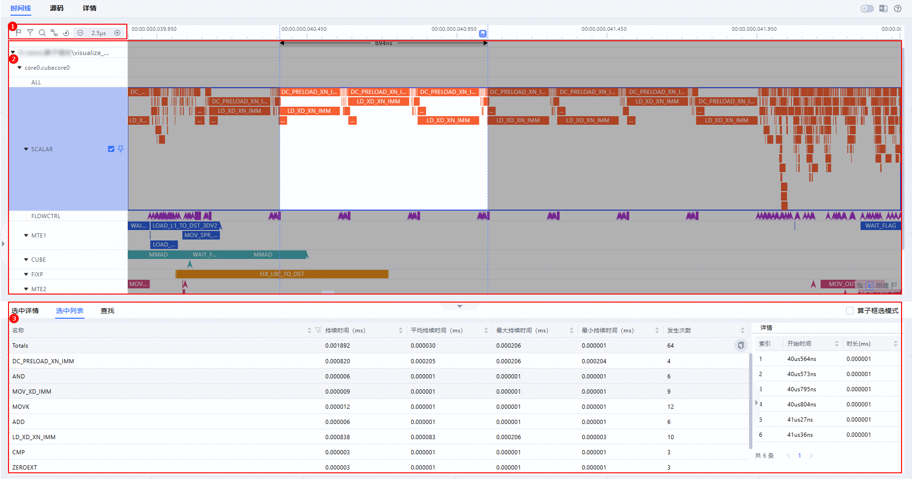

- Area 1: toolbar, which contains common shortcut keys. From left to right, the shortcut keys are **Marker List**, **Filter** (rank or unit), **Search**, **Flow Events**, **Reset** (page restoration), **Timeline Zoom Out**, and **Timeline Zoom In**.
- Area 2: graphical display. The left pane displays the layer information of each core. The first layer is **Core**, and the second layer is **Pipe**. The **Timeline** interface is displayed on the right by line, including the execution sequence and duration of each instruction. For details about units, see [Unit Information](#unit-information).
- Area 3: data pane, which displays statistics or instruction details. To view the details of a single instruction, you can select **Slice Detail**. To view a list of instructions from a selected area in a unit, you can select **Slice List**.

**Unit Information**

|Unit|Description|
|--|--|
|ALL|Instructions in this pathway apply to all pipes.|
|SCALAR|Scalar unit.|
|FLOWCTRL|Control flow instruction.|
|MTE1|Data transfer pipeline, from L1 to {L0A/L0B, UBUF}.|
|CUBE|Matrix multiplication unit.|
|FIXP|Pipeline of data transfer from FIXPIPE L0C to OUT/L1  Only the profile data exported from the <term>Atlas A2 training products/Atlas A2 inference products</term> can be displayed.|
|MTE2|Data transfer pipeline, from {DDR/GM, L2} to {L1, L0A/B, UBUF}.|
|VECTOR|Vector unit.|
|MTE3|Data transfer pipeline, from UBUF to {DDR/GM, L2, L1}, or from L1 to {DDR/L2}.|
|CACHEMISS|Missed iCache.|
|USEMASK|Custom instrumentation range.|
|MTE Throughput|Memory throughput information.  `- GM_TO_L1`: throughput of data transferred from GM to L1. ` - GM_TO_TOTAL`: total throughput of GM output data.  `- GM_TO_UB`: throughput of data transferred from GM to UB.  `- L1_TO_GM`: throughput of data transferred from L1 to GM.  `- TOTAL_TO_GM`: total throughput of GM input data.  `- UB_TO_GM`: throughput of data transferred from UB to GM.|

### Usage Description

#### Basic Functions

**Zooming In and Out on the GUI**

You can zoom in or out the **Timeline** interface, or move it left and right. The operations are as follows:

- Click any position in the tree chart or graphical pane on the **Timeline** interface and press **W** (zoom in) or **S** (zoom out) key to zoom. The maximum zoom-in temporal resolution is 1 ns.
- Click any position in the tree chart or graphical pane on the **Timeline** interface and press **A** (move left), **D** (move right), left arrow (move left), or right arrow (move right) key to move it left or right, or press up arrow (move up) or down arrow (move down) key to move it upward or downward.
- In the graphical pane, hold down **Alt** and click the left mouse button to zoom in a selected area.
- Click  (zoom in) or  (zoom out) on the toolbar in the upper left corner.
- Click  on the toolbar in the upper left corner to restore the **Timeline** interface in the graphical pane.
- Move the pointer to any position in the tree chart or graphical pane on the **Timeline** interface, and hold down **Ctrl** and scroll the mouse wheel to zoom in or out.
- In the graphical pane, hold down **Ctrl** and click the left mouse button to drag the unit chart left or right.

    > [!NOTE]NOTE  
    > On macOS, you need to press the Command key and scroll the mouse wheel to zoom in or out, and press the Command key and left mouse button to drag the unit chart left or right.

- In the graphical pane, right-click to zoom in or out. For details, see [**Table 1** Right-click menu](#right-click-menu).

    **Table 1** Right-click menu

    |Menu|Description|Operation|
    |--|--|--|
    |Fit to screen|Enlarges a single instruction to the maximum width of the visible range of the screen. If no instruction is selected, this parameter is not displayed.|Select an instruction and right-click it. In the displayed menu, click **Fit to screen** to zoom in the selected instruction to the maximum width that can be displayed on the screen.|
    |Zoom into selection|Zooms in on the selected area to the maximum width of the visible range of the screen. If no area is selected, this parameter is not displayed.|Select an area and right-click it. In the displayed menu, click **Zoom into selection** to enlarge the selected area to the maximum width of the visible range of the screen.|
    |Undo Zoom(0)|Undoes the zoom. The number in the parentheses changes with the number of zoom operations. The initial value is **0**.|On the zoomed-in **Timeline** interface, right-click to display a shortcut menu. Click **Undo Zoom(0)** to cancel the zooming. The page is zoomed out once, and the number in the brackets decreases by one accordingly.|
    |Reset Zoom|Resets the zoom to restore the chart to the initial state.|On the zoomed-in **Timeline** interface, right-click and choose **Reset Zoom** from the shortcut menu. The chart is reset to the initial state.|

**Instruction Search**

MindStudio Insight supports instruction search on the **Timeline** interface.

- Click  in the toolbar in the upper left corner. In the displayed text box, enter the instruction to search for and press **Enter** to view the matching instructions. The total number of matching instructions is displayed, as shown in [**Figure 1** Total number of matching instructions](#total-number-of-matching-instructions). In this example, the total number of instructions whose names contain "mov" is 11,754.

    **Figure 1** Total number of matching instructions

    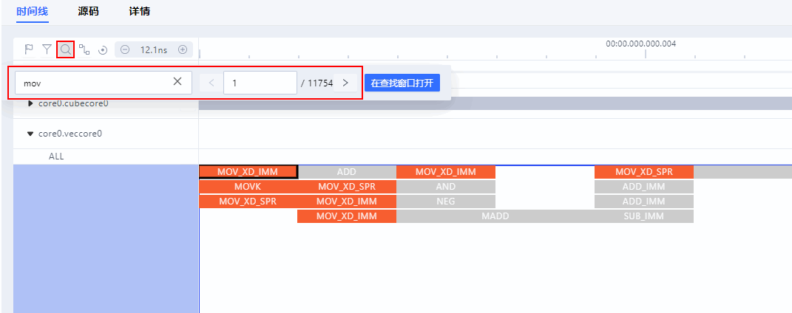

- Click  in the toolbar in the upper left corner of the interface. You can click  and 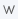 on the left to enable the **Match case** and **Match whole words only** functions, as shown in [**Figure 2** Match case and Match whole words only](#match-case-and-match-whole-words-only).

    Click  to enable **Match case**. Enter the information to search for and press **Enter** to view matching instructions.

    Click  to enable **Match whole words only**. Enter the information to search for and press Enter. The instructions whose names are the same as the search item will be matched, regardless of the case.

    If both  and  are selected, **Match case** and **Match whole words only** are both enabled. Enter the instruction name in the text box and press **Enter** to view the matching instructions.

    **Figure 2** Match case and Match whole words only

    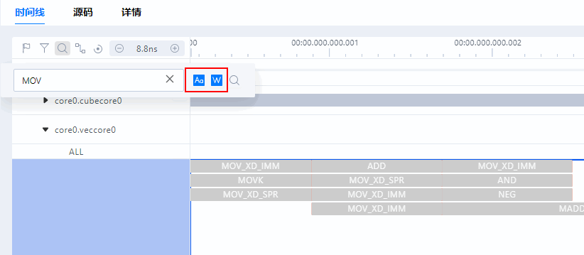

- Click the switch button next to the search box to view the previous or next matching instruction. You can also enter a number next to the text box to search for the corresponding instruction. The instruction is selected and displayed in the middle of the page, as shown in [**Figure 3** Locating an instruction](#locating-an-instruction).

    **Figure 3** Locating an instruction

    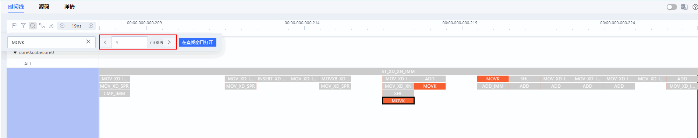

- Click **Open in Find Pane** next to the search box. The **Find** pane is displayed in the lower part, showing the information about the search term, as shown in [**Figure 4** Open in Find Pane](#open-in-find-pane). For details about the fields, see [**Table 2** Fields](#fields). Click **Click** in the **Click to Timeline** column to locate the instruction in the **Timeline** interface.

    **Figure 4** Open in Find Pane

    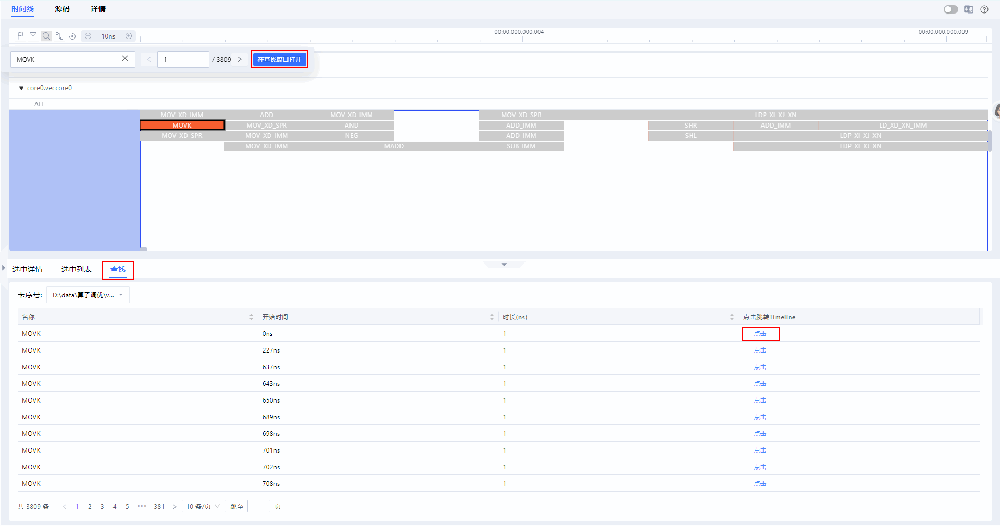

    **Table 2** Fields

    |Field|Description|
    |--|--|
    |Rank ID|Rank ID. You can select a data file to view.|
    |Name|Instruction name.|
    |Start Time|Start time of instruction execution.|
    |Duration (ns)|Total duration of instruction execution.|
    |Click To Timeline|Click **Click To Timeline** to locate the instruction in the **Timeline** interface.|

#### Displaying Profile Data

**Setting and Viewing Markers**

- Region marker

  On the **Timeline** interface, select a region and click or press **K** to mark and save the selected region, as shown in [**Figure 1** Region marker](#region-marker-4).

  **Figure 1** Region marker 

  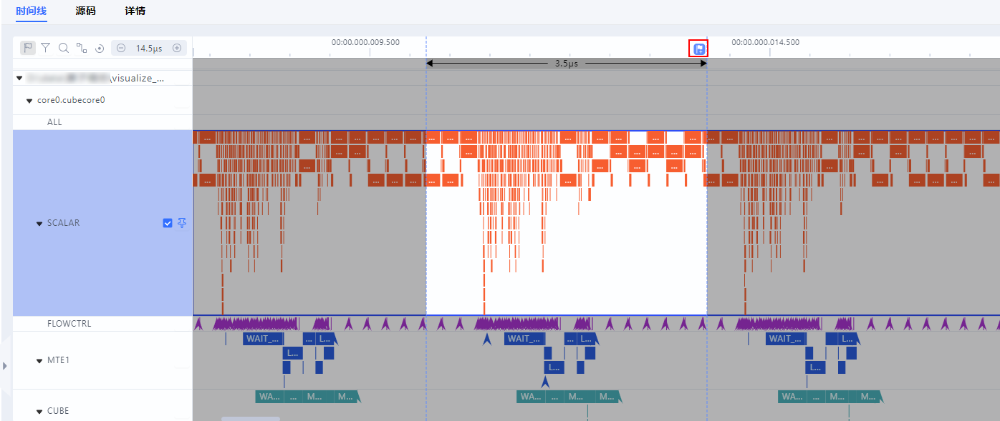

  You can double-click a marker to set the attributes of the marker pair, including the name and color of the marker pair, and delete the marker pair, as shown in [**Figure 2** Modifying the attributes of a marker pair](#modifying-the-attributes-of-a-marker-pair).

  **Figure 2** Modifying the attributes of a marker pair 

  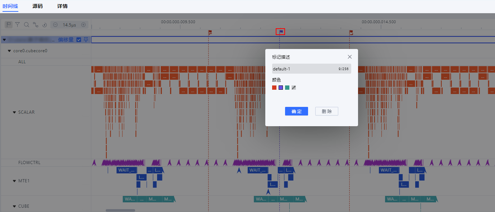

- Single-point marker

  Click anywhere in an empty unit at the top or press **K** to generate a single-point marker, as shown in [**Figure 3** Single-point marker](#single-point-marker). Double-click a marker to set its attributes. You can modify the marker name and color, and delete the marker.

  **Figure 3** Single-point marker 

  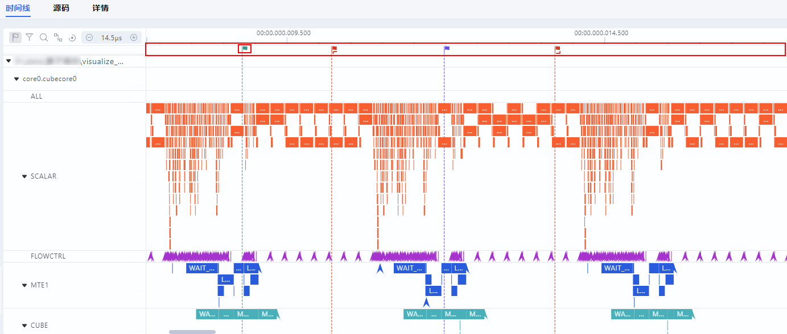

- Marker management

  Click  on the toolbar in the upper left corner. All the marker information is displayed, as shown in [**Figure 4** Viewing marker information](#viewing-marker-information).

  **Figure 4** Viewing marker information 

  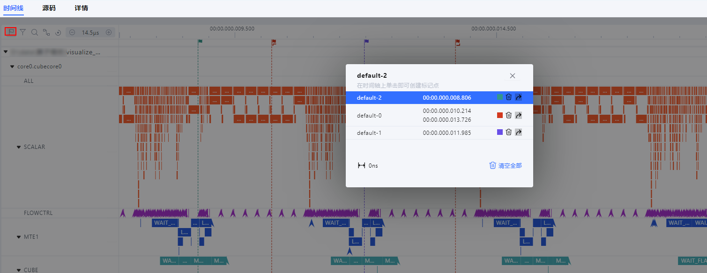

  - You can click the  icon of a marker to delete the marker.
  - Click **Clear** in the lower part of the dialog box to delete all markers.
  - Click a region marker. The **Slice Detail** interface in the lower part displays the duration information of the region.
  - If a marker is not displayed on the current visualization page, click  icon corresponding to the marker to go to the marker page.
  - Click the color icon corresponding to a marker to set the color to manage markers by category.

**Synchronous connection between instructions**

- MindStudio Insight supports the display of synchronous connections (from SET_FLAG to WAIT_FLAG) between instructions. You can click an instruction with a connection to display the connection associated with the instruction. Even if the pipe at the start or end point of the connection is collapsed, the connection will not disappear, as shown in [**Figure 5** Instruction connections](#instruction-connections)

    **Figure 5** Instruction connections

    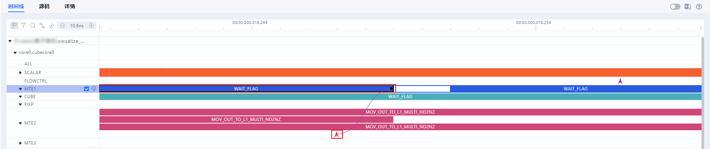

- MindStudio Insight supports the function of displaying all connections. You can click  on the toolbar in the upper left corner of the page and select one or more connection types in the displayed dialog box. All connections between the corresponding pipes are displayed in the **Timeline** interface, as shown in [**Figure 6** All connections](#all-connections)

    > [!NOTE]NOTE  
    > A maximum of 10 flow types can be selected.

    **Figure 6** All connections

    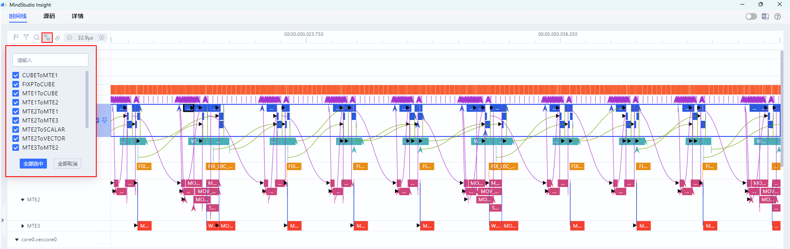

- The SET_FLAG and WAIT_FLAG instructions can be hidden.

    In the operator display area, right-click and choose Hide SET/WAIT Events from the shortcut menu to hide the SET_FLAG and WAIT_FLAG instructions. The instructions and connections disappear at the same time, as shown in [**Figure 7** Hiding SET/WAIT events](#hiding-set/wait-events).

    **Figure 7** Hiding SET/WAIT events 

    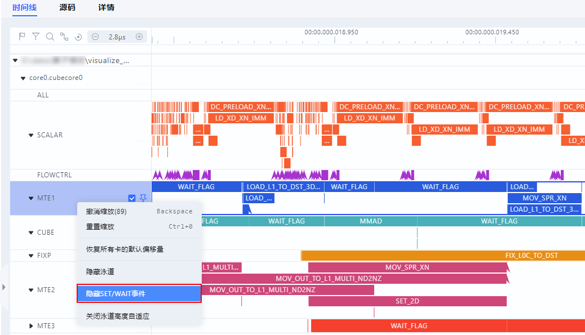

    After the SET/WAIT events are hidden, right-click and choose Show SET/WAIT Events from the shortcut menu. The hidden SET_FLAG and WAIT_FLAG instructions are displayed. You can perform operations based on the connection function to display the instruction connections, as shown in [**Figure 8** Displaying SET/WAIT events](#displaying-set-wait-events).

    **Figure 8** Displaying SET/WAIT events

    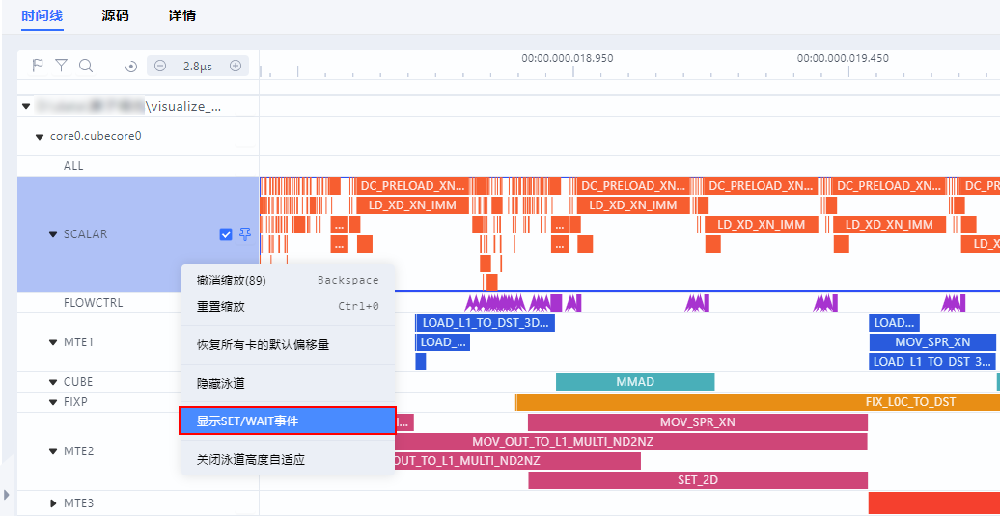

#### Displaying Page Optimization

**Hide**

For details about how to hide units in the operator tuning scenario, see [Unit Hiding](./system_tuning.md#page-tuning-example).

**Unit height adaptation**

For details about how to adapt the unit height in the operator tuning scenario, see [Adaptive Unit Height](./system_tuning.md#page-tuning-example).

#### Displaying Statistics

MindStudio Insight allows you to view instruction statistics and details about a single instruction.

- You can use the left mouse button to select some instructions in a single pipe-level unit or across multiple core units. After selecting some instructions, you can view the instruction statistics in the slice list displayed in the lower part, as shown in [**Figure 1** Slice List](#slice-list). For details about the fields, see [**Table 1** Fields in the slice list](#fields-in-the-slice-list).

    When you move the cursor to the **Slice List** interface and click , the content displayed in the slice list is copied and can be pasted to an Excel file for analysis.

    Click an instruction in the **Slice List** column. All instructions with the same name as this instruction are displayed in the **More** list on the right. Click a row in the **More** list to locate the instruction in the **Timeline** interface, and go to the **Slice Detail** interface, where you can view the details about the instruction.

    **Figure 1** Slice List

    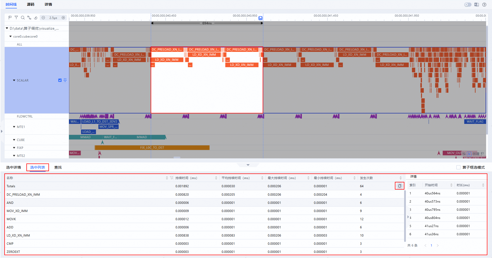

    **Table 1** Fields in the Slice List

    |Field|Description|
    |--|--|
    |Name|Instruction name.|
    |Wall Duration|Total duration of instruction execution.|
    |Average Wall Duration|Average instruction execution time.|
    |Max Wall Duration|Maximum operator execution duration.|
    |Min Wall Duration|Minimum operator execution duration.|
    |Occurrences|Number of times that an instruction is called.|
    |Index|Sequence number.|
    |Start Time|Timestamp in the graphical pane.|
    |Duration (ms)|Execution duration.|

- When you select a single instruction, the details of the instruction are displayed in the lower part, as shown in [**Figure 2** Slice Detail](#slice-detail). For details about the fields, see [**Table 2** Fields in Slice Detail](#fields-in-slice-detail).

    Select a single instruction and press **M** to select the **Timeline** area to which the instruction belongs. Press **M** again to cancel the selection.

    **Figure 2** Slice Detail

    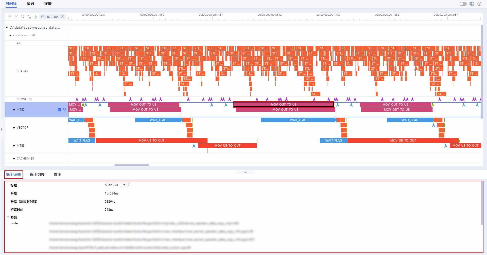

    **Table 2** Fields in Slice Detail

    |Field|Description|
    |--|--|
    |Title|Name.|
    |Start|Start time.|
    |Start (Raw Timestamp)|Original start time of data collection.|
    |Wall Duration|Total duration.|
    |Args|Operator parameters, including:  `- code`: code call stack. `- detail`: instruction source. `- pc_addr`: PC address.|

## Source

### Function

The **Source** interface displays the operator instruction heatmap, and allows you to view the mapping between operator source and instruction sets and the duration. During Ascend C operator development, developers can analyze the performance.

### GUI Description

The Source interface consists of three parts: filter bar (area 1), source file code attribute table (area 2), and instruction table (area 3), as shown in [**Figure 1** Source interface](#source-interface).

**Figure 1** Source interface

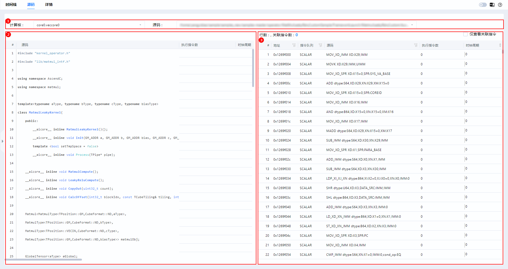

- Area 1: filter bar. You can filter the content to be viewed by **Core** and **Source**.
- Area 2: source file code attribute table, which displays the code line, execution duration, and execution times of each line of code. For details about the fields in the table, see [**Table 1** Fields in the source file code attribute table](#fields-in-the-source-file-code-attribute-table).

    **Table 1** Fields in the source file code attribute table

    |Field|Description|Example|
    |--|--|--|
    |#|Line number.|100|
    |Source|Source file code.|-|
    |Instructions Executed|Number of codes in the line executed on each core.|100|
    |Cycles|Number of cycles (clock cycles) consumed when the codes in the line are executed on each core.|100|
    |GPR Count|Number of times the general-purpose register is used when the codes in the line are executed on each core. This parameter is displayed only when the data collected by the msopprof simulator is used.|10|
    |L2Cache Hit Rate|L2 cache hit rate of the line of code executed on all cores. This parameter can be displayed only when the data collected by msopprof is used.|100%|
    |Process Bytes|Sum of the data volume processed by the line of code on each core, in bytes.|2048|

- Area 3: instruction table. You can view the instruction records, including the address, content, number, and times. For details about the fields in the table, see [**Table 2** Fields in the instruction table](#fields-in-the-instruction-table).

    **Table 2** Fields in the instruction table

    |Field|Description|Example|
    |--|--|--|
    |#|Sequence number.|100|
    |Address|Offset address of the instruction.|0x1122a828|
    |Pipe|Pipe (instruction queue) where the instruction is located.|MTE2|
    |Source|Instruction content.|BAR PIPE:ALL|
    |Instructions Executed|Number of instructions in the line executed on each core.|100|
    |GPR Count|Number of times the general-purpose register is used when the instructions in the line are executed on each core. This parameter can be displayed only when the data collected by msopprof simulator is used.|10|
    |GPR Status|Graphical display of register dependency information. It consists of multiple columns of straight lines with arrows. Each column represents a register. The solid arrow on the left indicates write, the hollow arrow on the right indicates read, and the vertical line indicates that the current register is still in use. When you hover the pointer over a register, the register information is displayed.  This parameter can be displayed only when the data exported from the <term>Ascend 950PR/Ascend 950DT</term> is used.|-|
    |Cycles|Number of cycles (clock cycles) consumed when the instructions in the line are executed on each core.|100|
    |L2Cache Hit Rate|L2 cache hit rate of the instruction executed on all cores. This parameter can be displayed only when the data collected by msopprof is used.|72%|
    |Process Bytes|Data volume processed by the instruction on each core, in bytes.|2048|
    |UB Read Conflict|Read conflicts of vector instructions on the UB Bank. This parameter can be displayed only when the data collected by msopprof simulator is used.|1|
    |UB Write Conflict|Write conflicts of vector instructions on the UB Bank. This parameter can be displayed only when the data collected by msopprof simulator is used.|0|
    |Vector Utilization Percentage|Utilization of the vector computing unit, in percentage. This parameter is displayed only when the data collected by the msopprof simulator is used.|35.29|

### Usage Description

**Source code search**

In the code attribute table area of the source file, press Ctrl+F on the keyboard to display the search box. In the search box, enter the required keyword and select the case-sensitive matching function as required. Press Enter to search for the keyword. The matched keyword is highlighted, as shown in [**Figure 1** Searching for source](#searching-for-source). The functions of the icons in the search box are described in [**Table 1** Icon description](#icon-description).

> [!NOTE]NOTE  
> In macOS, press **Command+F** on the keyboard to display the search box.

**Figure 1** Searching for source 

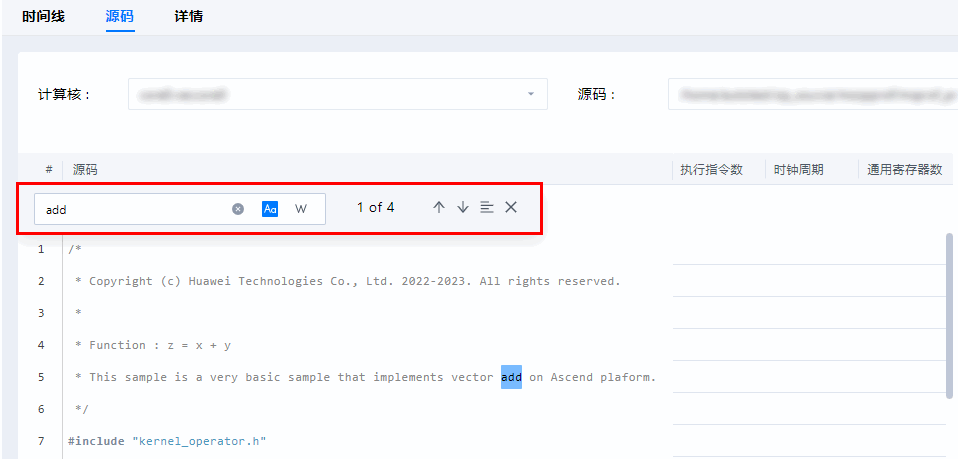

**Table 1** Icon description 

|Icon|Function|
|--|--|
||Indicates the **Match case** function. After this icon is selected, the entered keyword can be found, and the search is case-sensitive.|
||Indicates the **Match whole words only** function. After this icon is selected, keywords that match exactly can be found.|
||Scrolls up the search results.|
||Scrolls down the search results.|
||Allows you to drag select a source area. After clicking this icon, you can select the source area by clicking the left mouse button. Then, you can search for the source in the selected area.|
||Allows you to close the search box and exit the search function. Alternatively, press **Esc** to exit.|

**Viewing associated instructions**

Click any line of code in the source file code attributes. The code related to the line is highlighted in the instructions. The number of lines (Line) and the total number of related instructions (Related Instructions Count) of the selected code are displayed above the instruction table, as shown in [**Figure 2** Viewing associated instructions](#viewing-associated-instructions). The code is located in line 10 and has 112 related instructions.

**Figure 2** Viewing associated instructions
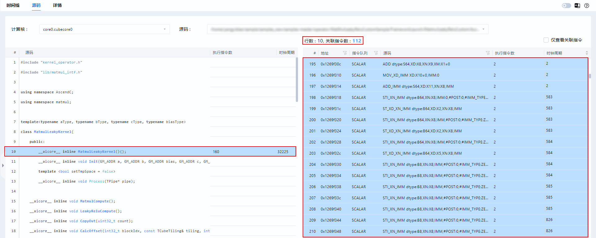

If you select View only associated instructions in the instruction table, only the instructions associated with the code in the line are displayed, as shown in [**Figure 3** Filtering associated instructions](#filtering-associated-instructions).

**Figure 3** Filtering associated instructions
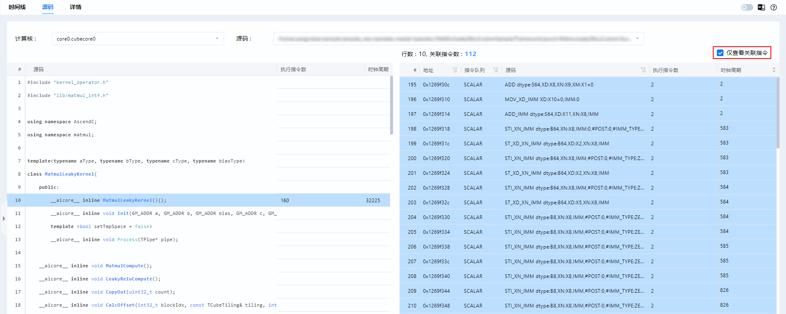

**Viewing associated code**

Click any line in the instruction table. The associated code is highlighted in the source file code attribute table, and all instructions associated with the code are highlighted in the instruction table, as shown in [**Figure 4** Viewing associated code](#viewing-associated-code).

**Figure 4** Viewing associated code
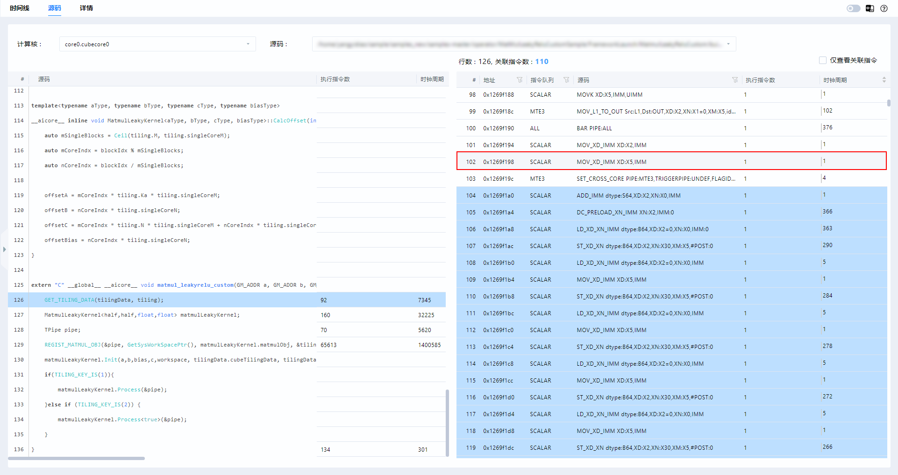

> [!NOTE]NOTE  
> If there are multiple lines of associated codes, only the uppermost codes are highlighted.

**Filtering the instruction table**

In the instruction table, click  next to each field in the table header to filter the content to be viewed, as shown in [**Figure 5** Filtering the instruction table](#filtering-the-instruction-table).

**Figure 5** Filtering the instruction table 
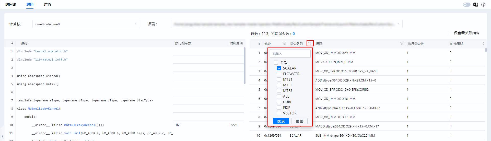

## Details

### Function

The **Details** interface displays **Base Info**, **Compute Workload Analysis**, **Core Occupancy**, **Roofline**, and **Memory Workload Analysis**. The analysis results are displayed in charts and data panes.

### GUI Description

The Details interface contains Base Info (area 1), Core Occupancy (area 2), Roofline (area 3), and Compute Workload Analysis. (area 4) and Memory Workload Analysis (area 5), as shown in [**Figure 1** Details interface](#details-interface).

**Figure 1** Details interface
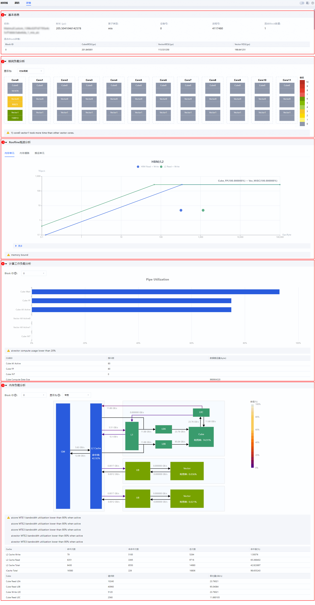

**Base Info**

**Table 1** Description of basic information fields 

**Table 1** Basic information fields 

|Field|Description|
|--|--|
|Name|Operator name.|
|Duration (μs)|Total operator duration.|
|Op Type|Operator type. The options are **mix**, **vector**, **cube**, and **AiCore**.|
|Device Id|Device ID.|
|Pid|Process ID.|
|Block Dim|Number of sub blocks. This parameter is used when the operator type is **vector**, **cube**, or **AiCore**.|
|Mix Block Dim|Number of sub blocks. This parameter is used when the operator type is **mix**.|
|Block Detail|Duration details of sub blocks. When the operator type is vector, cube, or AiCore, the value is the parameter name. For details about the parameters, see [**Table 2** Fields of Block Detail](#fields-of-block-detail).|
|Mix Block Detail|Duration details of sub blocks. When the operator type is mix, this parameter is used. For details about the fields, see [**Table 3** Fields of Mix Block Detail](#fields-of-Mix-block-detail)|

**Table 2** Fields of Block Detail

|Field|Description|
|--|--|
|Block ID|Sub block ID. This parameter is not available when the operator type is **AiCore**.|
|Core Type|Sub block type.|
|Duration (μs)|Duration of sub blocks.|

**Table 3** Fields of Mix Block Detail

|Field|Description|
|--|--|
|Block ID|Sub block ID.|
|Cube0 Duration (μs)|Duration of the cube core in AI Core.|
|Vector0 Duration (μs)|Duration of one vector core in AI Core.|
|Vector1 Duration (μs)|Duration of another vector core in AI Core.|

**Inter-Core Workload Analysis (Core Occupancy)**

Area 2 displays inter-core workload analysis (Core Occupancy), which analyzes the inter-core workload based on the number of clock cycles, total core throughput, and cache hit rate, as shown in [**Figure 2** Inter-core workload analysis](#inter-core-workload-analysis)

You can select **Cycles**, **Throughput**, or **Cache Hit Rate(%)** to display the core usage and view the analysis result, helping you locate and analyze exceptions.

**Figure 2** Inter-core workload analysis 

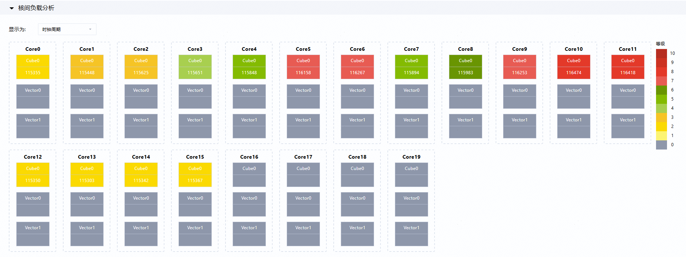

> [!NOTE]NOTE
>
> - This module is supported by the performance data exported from the <term>Atlas A3 training products/Atlas A3 inference products</term>, <term>Atlas A2 training products/Atlas A2 inference products</term>, and <term>Ascend 950PR/Ascend 950DT</term>.
> - The inter-core load balance is classified into 10 levels. Levels 4 to 6 indicate that the load balance is close to the average value, while levels 0 to 3 and 7 to 10 indicate that the load balance differs greatly from the average value.

**Roofline bottleneck analysis**

Area 3 is the Roofline analysis area. It displays the operator performance using the Roofline model and analyzes the results, providing a basis for performance tuning. In the Roofline model graph, the X axis represents the arithmetic intensity (Ops/Byte), which indicates the number of operations supported by each byte of memory. The Y axis represents the performance (TOPS/s), which indicates the number of trillion operations per second.

The Roofline model displays the instruction mix that contributes to peak performance. For example, Cube\_INT\(100.000000%\) + Vec\_FP16\(30.000000%\),Vec\_FP32\(70.000000%\) indicates that the Cube compute unit processes only int instructions, and the Vector compute unit processes 30% fp16 instructions and 70% fp32 instructions.

>[!NOTE]NOTE
>
> - This module is supported only by the <term>Ascend 950PR/Ascend 950DT</term>, <term>Atlas A3 training products/Atlas A3 inference products</term>, <term>Atlas A2 training products/Atlas A2 inference products</term>, and <term>Atlas inference products</term>.
> - When data of the <term>Ascend 950PR/Ascend 950DT</term> is imported, the instruction types are displayed in the Roofline model. You can filter the Roofline model based on the parameters in the figure.

- When the hardware product is <term>Ascend 950PR/Ascend 950DT</term>, <term>Atlas A3 training series products/Atlas A3 inference series products</term>, or <term>Atlas A2 training series products/Atlas A2 inference series products</term>, the Roofline performance model analysis covers the memory unit, memory pathway, and transfer unit.

    **Memory Unit**: displays the HBM/L2 and memory unit model, as shown in [**Figure 3** Memory unit](#memory-unit). For details about the parameters, see [**Table 4** Parameters of the memory unit](#parameters-of-the-memory-unit).

    **Figure 3** Memory unit

    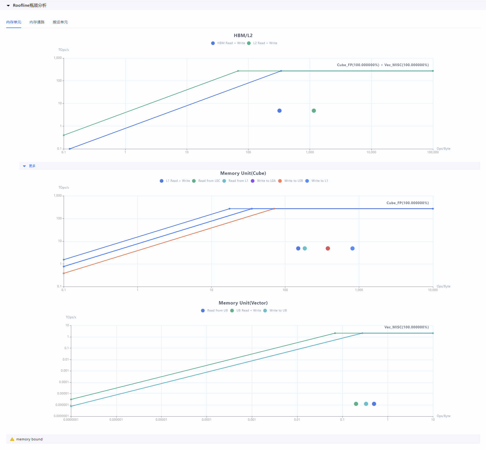

    **Table 4** Parameters of the memory unit

    |Parameter|Description|
    |--|--|
    |HBM Read + Write|Read and write of the high bandwidth memory unit.|
    |L2 Read + Write|Read and write of the L2 memory unit.|
    |L1 Read + Write|Read and write of the L1 memory unit.|
    |Write to L1|Write to the L1 memory unit.|
    |Read from L1|Read from the L1 memory unit.|
    |Write to L0A|Write to the L0A memory unit.|
    |Write to L0B|Write to the L0B memory unit.|
    |Read from L0C|Read from the L0C memory unit.|
    |UB Read + Write|Read and write of the UB memory unit.|
    |Read from UB|Read from the UB memory unit.|
    |Write to UB|Write to the UB memory unit.|
    |Vector Read UB|Read from the UB memory unit by the vector unit.|
    |Vector Write UB|Write to the UB memory unit by the vector unit.|

    **Memory Pathway**: displays the memory transfer pathway, as shown in [**Figure 4** Memory pathway](#memory-pathway). For details about the parameters, see [**Table 5** Memory pathway parameters](#memory-pathway-parameters).

    **Figure 4** Memory pathway

    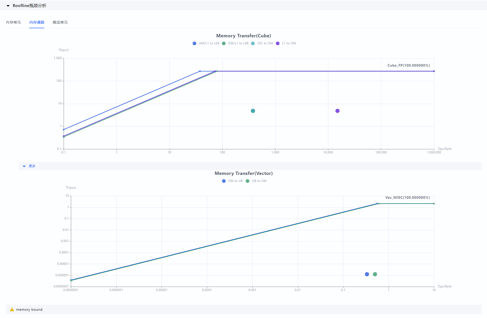

    **Table 5** Memory pathway parameters 

    |Parameter|Description|
    |--|--|
    |GM/L1 to L0A|Memory pathway from GM/L1 to L0A.|
    |GM/L1 to L0B|Memory pathway from GM/L1 to L0B.|
    |L0C to GM|Memory pathway from L0C to GM.|
    |L1 to GM|Memory pathway from L1 to GM.|
    |L0C to L1|Memory pathway from L0C to L1.|
    |GM to UB|Memory pathway from GM to UB.|
    |UB to GM|Memory pathway from UB to GM.|

    **Transfer Unit**: displays the pipeline model, as shown in [**Figure 5** Transfer unit](#transfer-unit). For details about the parameters, see [**Table 6** Parameters of the transfer unit](#parameters-of-the-transfer-unit).

    **Figure 5** Transfer unit 

  
    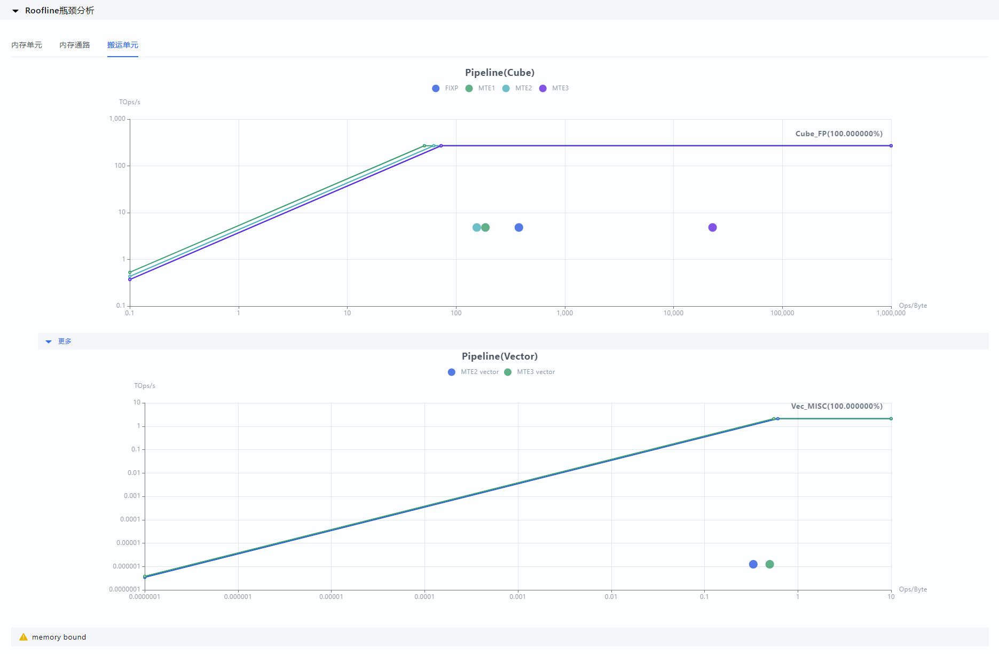

    **Table 6** Parameters of the transfer unit

    |Parameter|Description|
    |--|--|
    |MTE1|MTE1 pathway.|
    |MTE2|MTE2 pathway.|
    |MTE3|MTE3 pathway.|
    |FIXP|FIXP pathway.|
    |MTE2 vector|MTE2 pathway of the vector computing unit.|
    |MTE3 vector|MTE3 pathway of the vector computing unit.|

- If the hardware product is the <term class="- topic/term " id="term533237123919">Atlas inference series products</term>, only the memory unit is available, as shown in [**Figure 6** Memory unit model](#memory-unit-model). For details about the parameters, see [**Table 7** Parameters of the memory unit](#parameters-of-the-memory-unit).

    **Figure 6** Memory unit model

    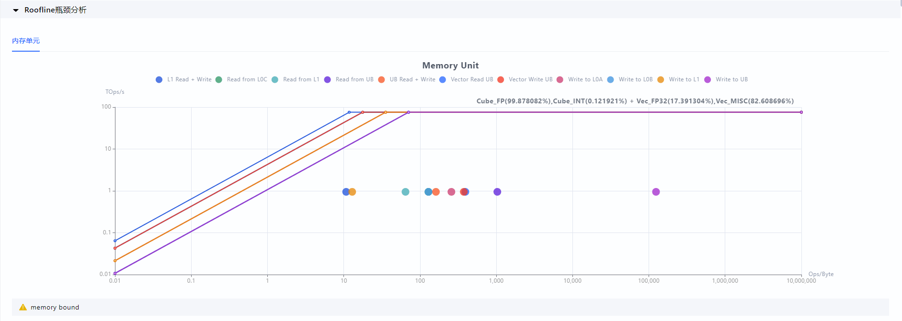

    **Table 7** Parameters of the memory unit

    |Parameter|Description|
    |--|--|
    |L1 Read + Write|Read and write of the L1 memory unit.|
    |Read from L0C|Read from the L0C memory unit.|
    |Read from L1|Read from the L1 memory unit.|
    |Read from UB|Read from the UB memory unit.|
    |UB Read + Write|Read and write of the UB memory unit.|
    |Vector Read UB|Read from the UB memory unit by the vector unit.|
    |Vector Write UB|Write to the UB memory unit by the vector unit.|
    |Write to L0A|Write to the L0A memory unit.|
    |Write to L0B|Write to the L0B memory unit.|
    |Write to L1|Write to the L1 memory unit.|
    |Write to UB|Write to the UB memory unit.|

**Compute Workload Analysis**

Area 4 is the compute workload analysis area. You can view the corresponding information in a bar chart and data pane, which helps developers analyze the information. As shown in [**Figure 7** Compute workload analysis](#compute-workload-analysis), the parameters are described in [**Table 8** Parameters for compute workload analysis](#parameters-for-compute-workload-analysis). The parameters in the bar chart and data pane are displayed based on the actual collected data. The content in the  icon is the compute workload analysis result of each block.

**Figure 7** Compute workload analysis 

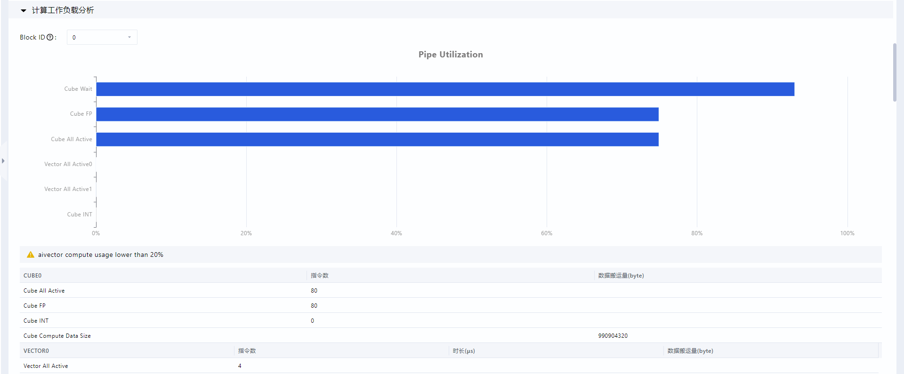

**Table 8** Parameters for compute workload analysis 

|Parameter|Description|
|--|--|
|Block ID|Sub block ID. You can switch the block ID to view the corresponding information. When the operator type is **AiCore**, this parameter is displayed as **NA**, and the multi-core average value is displayed.|
|Pipe Utilization|Pipe (instruction queue) visualization. It is displayed in a bar chart.  - X coordinate: Cycles percentage, which is calculated as follows: Cycles/Total cycles. **Cycles** indicates the clock cycles consumed by the instruction execution on the sub block.  - Y coordinate: operator instruction, which is provided in the data of the .bin file.|
|CUBE|Name of a cube instruction. This parameter is displayed when the operator type is **cube**.|
|CUBE0|Name of a cube instruction. This parameter is displayed when the operator type is **mix**.|
|VECTOR|Name of a vector instruction. This parameter is displayed when the operator type is vector.|
|VECTOR0|Name of a vector instruction. This parameter is displayed when the operator type is **mix**.|
|VECTOR1|Name of a vector instruction. This parameter is displayed when the operator type is **mix**.|
|AICORE|Name of an AI Core instruction. This parameter is displayed when the operator type is **AiCore**.|
|Instructions|Number of operator instructions.|
|Duration(μs)|Duration of operator instructions.|
|Data Volume(byte)|Operator instruction data volume.|

**Memory Workload Analysis**

Area 5 is the memory workload analysis area. It displays the corresponding information in the memory heatmap and data pane, as shown in [**Figure 8** Memory workload analysis](#memory-workload-analysis). For details about the parameter settings, see [**Table 9** Parameters](#parameters). The parameters in the memory heatmap and data pane are displayed based on the collected data. The peak value (%) on the right of the heatmap is the arrow color, and the value is the peak bandwidth ratio (maximum bandwidth ratio). The content in the  icon is the memory workload analysis result of each block.

**Figure 8** Memory workload analysis

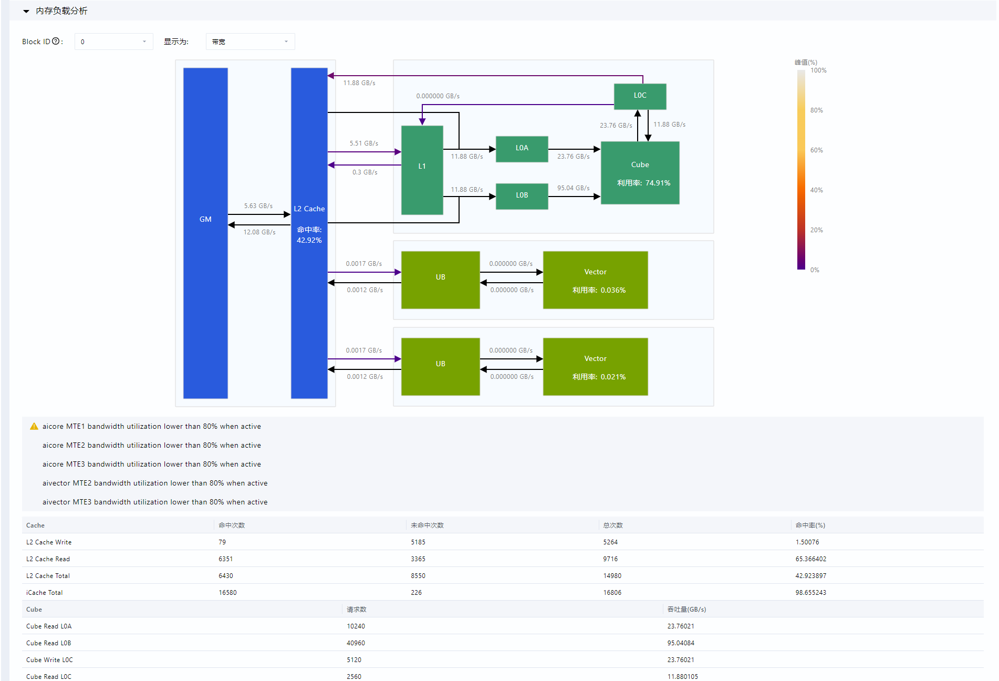

**Table 9** Parameter description

|Parameter|Description|
|--|--|
|Block ID|Sub block ID. You can select the sub block to be viewed from the **Block ID** drop-down list. When the operator type is **AiCore**, **Block ID** is displayed as **NA**, and the multi-core average value is displayed.|
|Show As|Optional. You can select the flow arrow content of the heatmap to display the number of requests or bandwidth. The arrow on the heatmap indicates the flow direction.  - Number of requests (Num of Request)  - Bandwidth (Bandwidth)|

The content displayed in the data pane varies according to the operator type. The content is the data parsing result based on the BIN file. The details are as follows:

- When the operator type is AiCore, the parameters in the table pane are described in [**Table 10** AiCore operator parameters](#aicore-operator-parameters).

    **Table 10** AiCore operator parameters

    |Parameter|Description|
    |--|--|
    |Cache|L2 cache.|
    |Cube|Cube computing unit.|
    |HBM|High bandwidth memory unit.|
    |L0A|L0A memory unit.|
    |L0B|L0B memory unit.|
    |L0C|L0C memory unit.|
    |L1|L1 memory unit.|
    |Pipe|Computing pathway.|
    |UB|UB memory unit.|
    |Vector|Vector computing unit.|
    |Requests|Number of operations.|
    |Throughput(GB/s)|Throughput, indicating the amount of data transferred per second by the pathway, in GB/s.|

- When the operator type is mix, the parameters in the table pane are described in [**Table 11** Parameters of the mix operator](#parameters-of-the-mix-operator)

    **Table 11** Parameters of the mix operator

    |Parameter|Description|
    |--|--|
    |Cache|L2 cache.|
    |Hit|Number of cache hits.|
    |Miss|Number of times that the cache is reallocated after a cache miss.|
    |Total|Total number of cache requests.|
    |Hit Rate (%)|Cache hit rate.|
    |Cube|Cube computing unit.|
    |HBM Cube|High bandwidth memory unit of the cube unit.|
    |HBM Vector Core0|High bandwidth memory unit of the vector unit of core 0 in AI Core.|
    |HBM Vector Core1|High bandwidth memory unit of the vector unit of core 1 in AI Core.|
    |Scalar|Scalar compute unit.|
    |Scalar Cube|Scalar compute unit of the Cube unit.|
    |Scalar Vector Core0|Scalar compute unit of the vector unit of core 0 in the AI Core.|
    |Scalar Vector Core1|Scalar compute unit of the vector unit of core 1 in the AI Core.|
    |L0A|L0A memory unit.|
    |L0B|L0B memory unit.|
    |L0C|L0C memory unit.|
    |L1|L1 memory unit.|
    |Requests|Number of operations.|
    |Throughput (GB/s)|Throughput, indicating the amount of data transferred per second by the pathway, in GB/s.|
    |Peak (%)|Ratio of the actual bandwidth to the theoretical bandwidth.|
    |Pipe Cube|Computing pathway of the cube unit.|
    |Pipe Vector Core0|Computing pathway of the vector unit of core 0 in AI Core.|
    |Pipe Vector Core1|Computing pathway of the vector unit of core 1 in AI Core.|
    |Instructions|Number of instructions.|
    |Cycle|Clock cycle consumed by the pathway.|
    |Time (us)|Running time of the Scalar Unit.|
    |Wait Cycles|Number of blocked cycles on the corresponding pipe.|
    |Active Rate(%)|Percentage of the running cycles to the total cycles.|
    |UB Core0|UB memory unit of core 0 in AI Core of the **mix** operator.|
    |UB Core1|UB memory unit of core 1 in AI Core of the **mix** operator.|
    |Vector Core0|Vector computing unit.|
    |Vector Core1|Vector computing unit.|

- If the operator type is vector, the parameters in the table are described in [**Table 12** Parameters of the vector operator](#parameters-of-the-vector-operator).

    **Table 12** Parameters of the vector operator

    |Parameter|Description|
    |--|--|
    |Cache|L2 cache.|
    |Hit|Number of cache hits.|
    |Miss|Number of times that the cache is reallocated after a cache miss.|
    |Total|Total number of cache requests.|
    |Hit Rate (%)|Cache hit rate.|
    |HBM|High bandwidth memory unit.|
    |Scalar|Scalar compute unit.|
    |Requests|Number of operations.|
    |Throughput (GB/s)|Throughput, indicating the amount of data transferred per second by the pathway, in GB/s.|
    |Pipe|Computing pathway.|
    |Instructions|Number of instructions.|
    |Cycle|Clock cycle consumed by the pathway.|
    |Time (us)|Running time of the Scalar Unit.|
    |Wait Cycles|Number of blocked cycles on the corresponding pipe.|
    |Active Rate (%)|Percentage of the running cycles to the total cycles.|
    |UB|UB memory unit.|
    |Vector|Vector computing unit.|
    |Peak (%)|Ratio of the actual bandwidth to the theoretical bandwidth.|

- If the operator type is cube, the parameters in the table pane are described in [**Table 13** Parameters of the cube operator](#parameters-of-the-cube-operator).

    **Table 13** Parameters of the cube operator

    |Parameter|Description|
    |--|--|
    |Cache|L2 cache.|
    |Hit|Number of cache hits.|
    |Miss|Number of times that the cache is reallocated after a cache miss.|
    |Total|Total number of cache requests.|
    |Hit Rate (%)|Cache hit rate.|
    |Cube|Cube computing unit.|
    |HBM|High bandwidth memory unit.|
    |Scalar|Scalar compute unit.|
    |L0A|L0A memory unit.|
    |L0B|L0B memory unit.|
    |L0C|L0C memory unit.|
    |L1|L1 memory unit.|
    |Requests|Number of operations.|
    |Throughput (GB/s)|Throughput, indicating the amount of data transferred per second by the pathway, in GB/s.|
    |Peak (%)|Ratio of the actual bandwidth to the theoretical bandwidth.|
    |Pipe|Computing pathway.|
    |Instructions|Number of instructions.|
    |Cycle|Clock cycle consumed by the pathway.|
    |Time (us)|Running time of the Scalar Unit.|
    |Wait Cycles|Number of blocked cycles on the corresponding pipe.|
    |Active Rate (%)|Percentage of the running cycles to the total cycles.|

### Usage Description

**Viewing Cycles**

In the Pipe Utilization bar chart area, move the pointer to the corresponding instruction bar chart. The actual cycles information is displayed. as shown in [**Figure 1** Viewing Cycles](#viewing-cycles).

**Figure 1** Viewing cycles

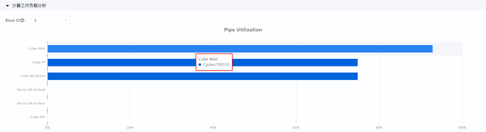

**Viewing Operator Performance in the Roofline Model Performance Diagram**

In the Roofline Bottleneck Analysis area, select a parameter point in the memory unit, memory pathway, or transfer unit view. The actual performance information of the memory unit is displayed in a floating window, as shown in [**Figure 2** Displaying operator performance metrics](#displaying-operator-performance-metrics). For details about the parameters, see [**Table 1** Performance metrics](#performance-metrics).

**Figure 2** Displaying operator performance metrics

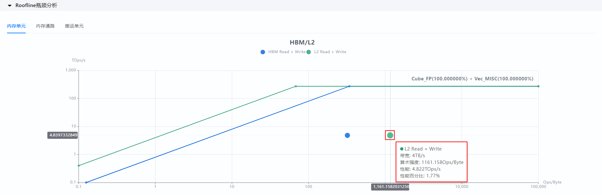

**Table 1** Performance metrics

|Metric|Description|
|--|--|
|Bandwidth|Indicates the upper limit of the hardware bandwidth.|
|Arithmetic Intensity|Corresponds to the X axis, indicating the number of operations supported by a unit of memory.|
|Performance|Corresponds to the Y axis, indicating the number of operations per unit time (trillions of operations per second).|
|Performance Ratio|Performance percentage = Actual operator performance/Optimal hardware performance|

**Comparing Performance Between Operators**

MindStudio Insight supports comparison of details between two operators, helping developers intuitively view the differences between two operators and facilitate analysis. Before comparing operator details, you need to set the baseline operator and the operator to be compared. For details, see [Data Comparison](./basic_operations.md#managing-data).

In operator comparison mode, the **Details** interface displays comparison data in terms of **Base Info**, **Core Occupancy**, **Compute Workload Analysis**, and **Memory Workload Analysis**. Only operators of the same type can be compared.

- **Base Info**: The basic information between operators is compared.
- **Core Occupancy**: Based on the comparison data, if the comparison data contains core occupancy data, the analysis result is displayed on the page. If the comparison data does not contain core occupancy data, the analysis result is not displayed on the page.
- **Roofline**: This module does not support comparison. If the comparison data contains this module, the content of this module is displayed in operator comparison mode.
- Compute Workload Analysis: The corresponding information is displayed in a bar chart and data pane. In the bar chart, blue indicates the comparison data, and green indicates the baseline data. The data pane displays the differences between operators. You can click View More in the Details column to view details about the baseline data and comparison data, as shown in [**Figure 3** Compute workload comparison](#compute-workload-comparison).

    **Figure 3** Compute workload comparison
    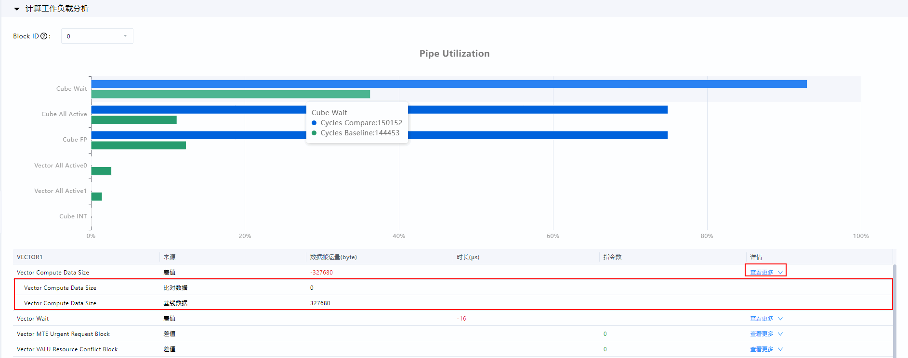

- Memory Workload Analysis: The corresponding information is displayed in a memory heatmap and data pane. In the heatmap, the data in the brackets is the baseline data, and the data outside the brackets is the comparison data. The data pane displays the differences between operators. You can click View More in the Details column to view details about the baseline data and comparison data, as shown in [**Figure 4** Memory workload comparison](#memory-workload-comparison).

    **Figure 4** Memory workload comparison
    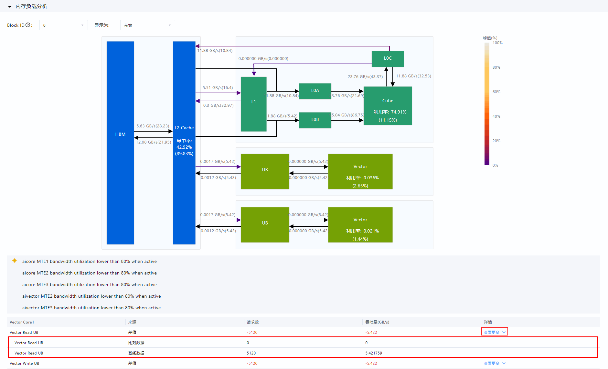

## Cache

### Function

The **Cache** interface displays the L2 cache access status of kernel functions in user programs, helping users optimize the cache hit rate.

### GUI Description

The Cache interface displays the L2 cache access status of the kernel function in the user program, as shown in [**Figure 1** Cache interface](#cache-interface). Click any graph on the **Cache** interface to zoom in.

Select a memory unit to display details about the memory unit, including the cache line index, number of events, and event proportion.

**Figure 1** Cache interface
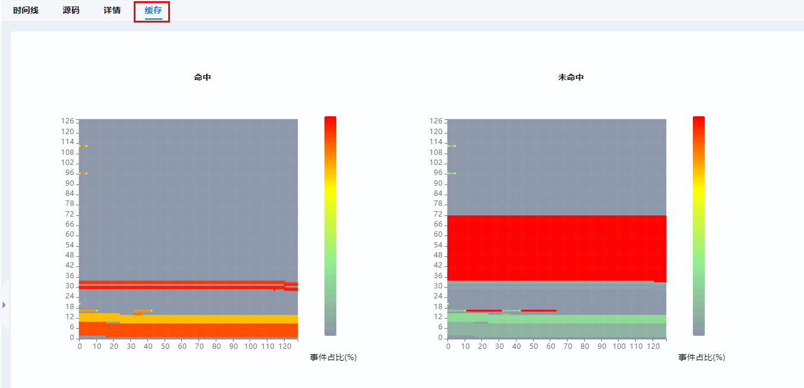

### Usage Description

**Event graphs support association with source.**

On the Cache interface, select the hit and miss event graphs and click to zoom in. In the zoomed-in event graph, right-click the selected memory cell and choose Show Instructions from the shortcut menu. The Source interface is displayed, and the related instruction line is highlighted, as shown in [**Figure 1** Instruction table](#instruction-table).

**Figure 1** Instruction table
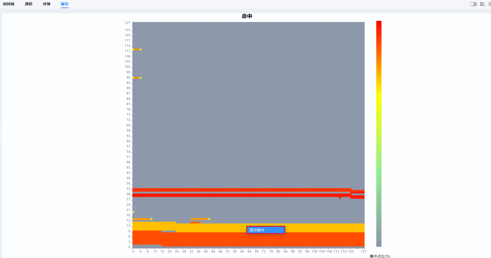

## Memory Trace Analysis (Triton)

### Function

The Memory Trace Analysis (Triton) interface displays the memory distribution, helping you understand the memory distribution in a specified time range and the memory distribution details at the corresponding time point, and analyze the UB (Unified Buffer) memory overflow.

### GUI Description

After the `memory_info.json` file in the specified directory is imported, the Memory Trace Analysis (Triton) interface is displayed, showing the memory distribution in the specified time range. There are three areas on the interface, as shown in [**Figure 1** Memory trace analysis](#memory-trace-analysis).

**Figure 1** Memory trace analysis

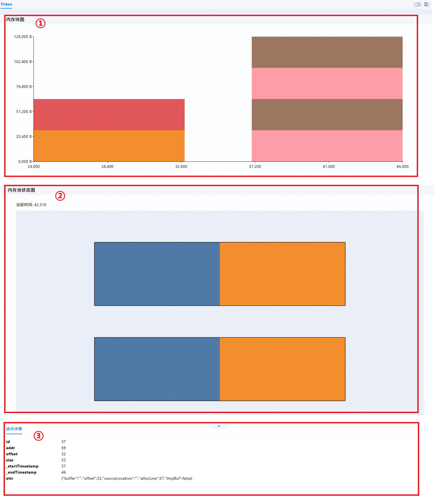

- Area 1: memory block chart, which displays the memory distribution in the current time range.
- Area 2: memory pool status chart. When you move the pointer to the memory block chart, a timeline is displayed. In the memory block chart area, click the timeline to display the slice memory pool status chart at the corresponding time point, showing the memory distribution at the time point.
- Area 3: details. You can click any block in the memory block chart or memory pool status chart to view the slice details of the block.

### Usage Description

Import the `memory_info.json` file in the specified directory. The memory block chart is displayed, as shown in [**Figure 2** Memory block diagram](#memory-block-diagram).

**Figure 2** Memory block diagram

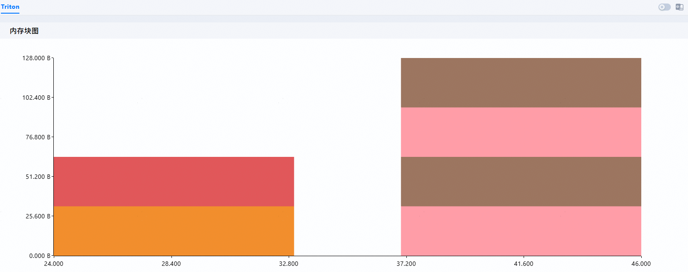

Click the graph block corresponding to any time node in [**Figure 2** Memory block diagram](#memory-block-diagram). The memory pool status diagram at the time node is displayed in the lower part, as shown in [**Figure 3** Memory pool status diagram](#memory-pool-status-diagram).

**Figure 3** Memory pool status diagram

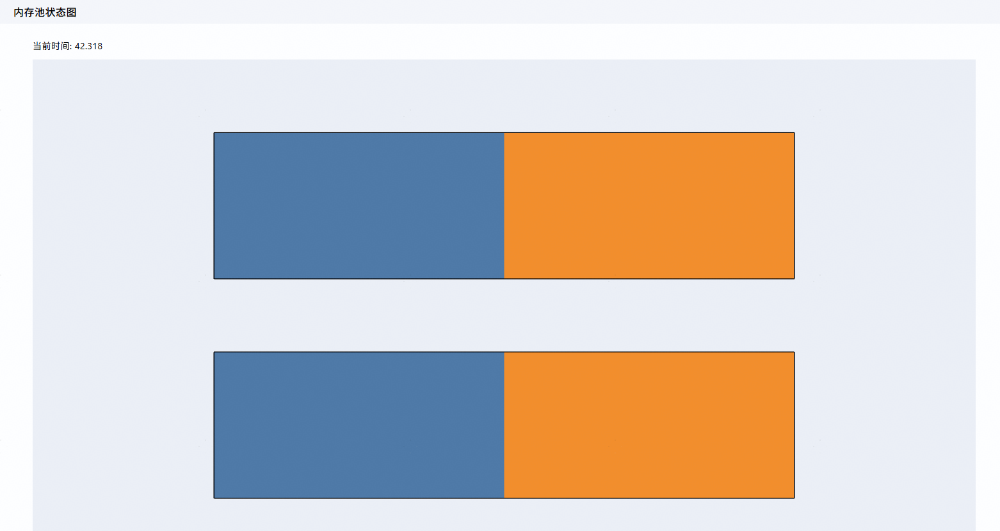

Click a color block in [**Figure 2** Memory block diagram](#memory-block-diagram) or [**Figure 3** Memory pool status diagram](#memory-pool-status-diagram). The details of the corresponding time slice are displayed in the lower area, as shown in [**Figure 4** Slice details of the selected time node](#slice-details-of-the-selected-time-node).

  > [!NOTE]NOTE
  > By default, the details of the selected time slice are not displayed. To view the details, click the **Expand** button in the middle of the upper part of the selected time slice area. To hide the details, click the **Collapse** button again.

**Figure 4** Details of the selected time slice

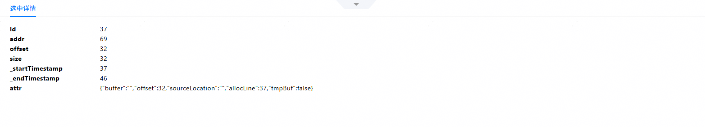
