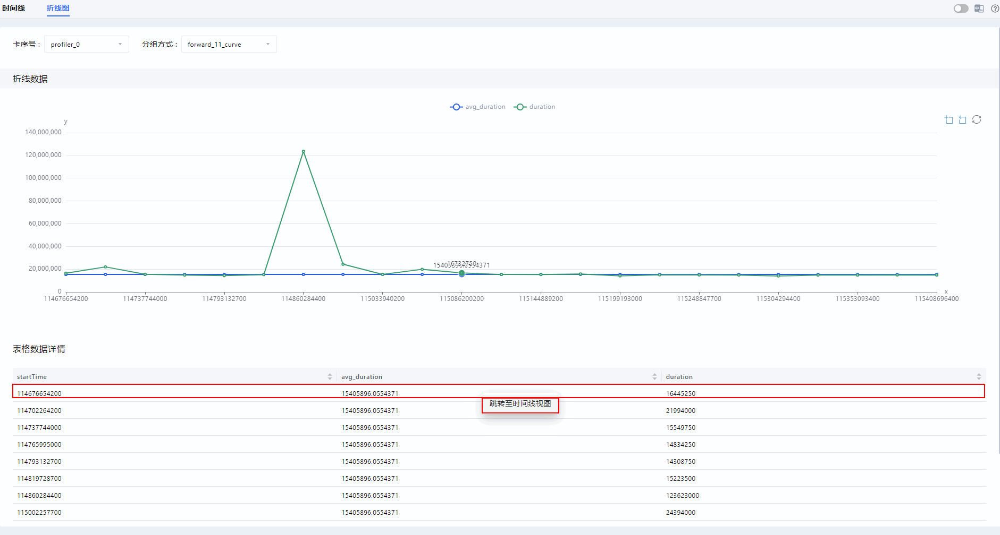
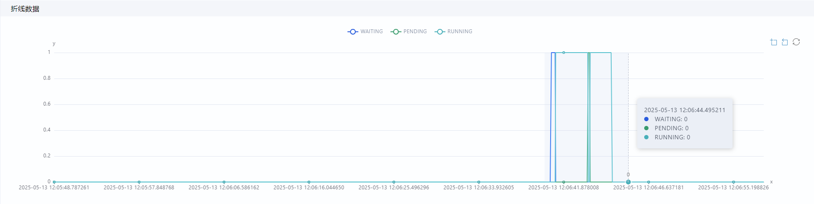

# **MindStudio Insight Serving Tuning**

## Overview

MindStudio Insight displays the end-to-end request execution in the timeline view, showing the duration of the request in each key phase and the status of the request. This helps users quickly identify service performance bottlenecks and adjust the profiling policy accordingly.

## Preparations

**Environment Preparation**

Install MindStudio Insight first. For details, see [MindStudio Insight Installation Guide](./mindstudio_insight_install_guide.md).

**Data preparation**

Import profile data in the correct format. For details about the data, see [Data Description](#data-description). For details about how to import data, see [Importing Data](./basic_operations.md#importing-data).

## Data Description

MindStudio Insight allows users to import profile data files and displays related content in graphics. In the serving tuning scenario, two types of data can be imported: SQLite database file (**profiler.db**) of the visualization curve and JSON file (**chrome\_tracing.json**) of the inference serving request trace data.

MindStudio Insight provides various import modes based on the file type. For details, see [**Table 1** Data import modes](#data-import-modes).

**Table 1** Data import modes 

|File Name|Import Mode|
|--|--|
|chrome_tracing.json|Single file.|
|profiler.db|- Single file.  - Batch import: To import the **profiler.db** files in multiple folders, you only need to select the parent directory.|
|DB files starting with **ms_service_**|Multiple DB files starting with **ms_service_** in the same folder can be imported. These files represent multiple process files and a general DB file. You only need to select the folder.|

**Precautions**

- The profile data of system tuning and serving tuning can be imported at the same time. You need to place the data of the two scenarios in the same folder and select the folder when importing the data.
- For details about how to obtain the data, see section "msServiceProfiler" \> "Serving Tuning" \> "[Data Parsing](https://www.hiascend.com/document/detail/zh/mindstudio/830/T&ITools/Profiling/atlasprofiling_16_0033.html)" in the *Profiling Tool Guide*.

## Timeline

### Function Description

During serving tuning, MindStudio Insight displays the end-to-end request execution in the timeline view, showing the duration of the request in each key phase and the status of the request. By analyzing the timeline, you can quickly identify service performance bottlenecks and adjust the tuning policy based on the symptom.

You can check the duration and interval at each level in the timeline view to determine whether performance problems exist in the corresponding key phase.

### GUI Description

**GUI Display**

The **Timeline** tab page consists of the toolbar (area 1), graphical display (area 2), and data pane (area 3), as shown in [**Figure 1** Timeline page](#timeline-page).

**Figure 1** Timeline page  

- Area 1: toolbar, which contains common shortcut keys. From left to right, the shortcut keys are **Marker List**, **Filter** (card or unit), **Search**, **Flow Events**, **Reset** (page restoration), **Timeline Zoom Out**, and **Timeline Zoom In**.
- Area 2: graphical display. The profile data collected by service is displayed on the left. The first level is the process, and the second level is the key phase information of the request. [Unit Information](#unit-information) describes the unit information. The timeline view is displayed on the right line by line, including the execution sequence and duration of each key phase.
- Area 3: data pane, which displays statistics or instruction details. If you select **Slice Detail**, the details of a single key phase are displayed. If you select **Slice List**, the key phase list information of the selected area in the unit is displayed.

**Unit Information**

**Table 1** Unit information

|Unit|Description|
|--|--|
|CPU Usage|Average CPU usage. This unit is displayed only when the host_system_usage_freq data collection function is enabled.|
|Memory Usage|System memory usage on the host. This unit is displayed only when the host_system_usage_freq data collection function is enabled.|
|NPU Usage|NPU memory usage. This unit is displayed only when the npu_memory_usage_freq data collection function is enabled.|
|KVCache|Usage of remaining KV cache over time.|
|BatchSchedule|Group batch time, in nanoseconds.|
|WAITING|Time when a request is in the **WAITING** state.|
|PENDING|Time when a request is in the **PENDING** state.|
|RUNNING|Time when a request is in the **RUNNING** state.|
|RUNNING2|Time when a request is in the **RUNNING2** state.|
|SWAPPED|Time when a batch enters the **SWAPPED** state.|
|RECOMPUTE|Time when a request is in the **RECOMPUTE** state.|
|SUSPENDED|Time when a batch enters the **SUSPENDED** state.|
|END|Time when a request is in the **END** state.|
|END_PRE|Time when a request is in the **END_PRE** state.|
|STOP|Time when a batch enters the **STOP** state.|
|PREFILL_HOLD|Time when a batch is in the **PREFILL_HOLD** state.|
|http|HTTP request lifetime data, covering the receipt, encoding, and decoding of the request.|
|batchFrameworkProcessing|Batch data, including the batch creation time, current batch type (prefill or decode), request RID, and steps.|
|preprocessBatch|Time consumed for parameter injection to batches during IBIS data distribution, in nanoseconds.|
|SerializeExecuteMessage|Time consumed for serialization during IBIS data distribution, in nanoseconds.|
|setInferBuffer|Time consumed for buffer setting during IBIS data distribution, in nanoseconds.|
|grpcWriteToSlave|Time consumed for gRPC read during IBIS data distribution, in nanoseconds.|
|deserializeExecuteRequestsForInfer|Time consumed for deserialization during IBIS data distribution, in nanoseconds.|
|convertTensorBatchToBackend|Time consumed for request conversion during IBIS data distribution, in nanoseconds.|
|getInputMetadata|Time consumed for metadata obtaining during IBIS data distribution, in nanoseconds.|
|beforemodelExec|Processing time before model execution, in nanoseconds.|
|modelExec|Model execution data, in nanoseconds, including the execution time, current batch type (prefill or decode), request RID, and steps.|
|instanceExecute|Model instance execution time, in nanoseconds.|
|Queue|Time when the request is enqueued.|
|PDcommunication|PD disaggregation communication time, in nanoseconds. This unit exists only in the PD disaggregation scenario.|
|forward|Forward propagation time of model inference, in nanoseconds.|
|operatorExecute|Python-side model API execution time, in nanoseconds.|
|processPythonExecResult|Time consumed for response conversion, serialization, and writing to the shared memory during data receiving, in nanoseconds.|
|deserializeExecuteResponse|Time consumed for deserialization during data receiving, in nanoseconds.|
|saveoutAndContinueBatching|Time consumed for parsing responses as outputs during data receiving, in nanoseconds.|
|continueBatching|Time consumed for enqueuing requests during data receiving, in nanoseconds.|
|sendExecuteMessage|Time consumed for sending execution information, in nanoseconds.|
|postprocess|Postprocessing time of model inference, in nanoseconds.|
|preprocess|Preprocessing time of model inference, in nanoseconds.|
|processBroadcastMessage|Time consumed for broadcasting communication information, in nanoseconds.|
|sample|Sampling time, in nanoseconds.|
|PullKVCache|KV cache transfer time between PD nodes, in nanoseconds. This unit exists only in the PD disaggregation scenario.|
|CANN|Operator execution time, in nanoseconds. This unit is displayed only when the acl_task_time data collection function is enabled.|
|dpBatch|DP domain information corresponding to each request during model inference.|
|RequestState|Request status changes during model inference.|

### Usage Description

For details about how to use the **Timeline** tab page in the serving tuning scenario, see "[Usage Description](./system_tuning.md#usage-description)" in the *MindStudio Insight System Tuning*.

**Slice Detail**

When you select a key phase block, the details about the key phase are displayed on the **Slice Detail** tab page in the lower part. If **res\_list** exists on the **Slice Detail** tab page, click any row in the **rid** list. The request details of the corresponding RID are displayed in the right pane of the **Slice Detail** tab page, as shown in [**Figure 1** Slice Detail](#slice-detail-12). For details about the fields, see [**Table 1** Slice Detail fields](#slice-detail-fields).

**Figure 1** Slice Detail  

**Table 1** Slice Detail fields 

|Chinese|Field|Description|
|--|--|--|
|Title|Title|Name.|
|Start|Start|Start time.|
| |Start(Raw Timestamp)|Original start time of data collection.|
|Duration|Wall Duration|Total duration.|
| |Args|Key phase parameters.|

**System View**

On the **System View** tab page, when you select **Stats System View**, the **Rank ID** selection box and serving data are displayed. You can select the rank to be viewed from the **Rank ID** selection box.

The serving data includes the **kvcache\_usage**, **batch\_info**, **request\_data**, and **forward\_info** tab pages, as shown in [**Figure 2** System View](#system-view).

When you select a serving data type, the corresponding details are displayed in the right area. For details about the fields, see [**Table 2** Servitization View fields](#servitization-view-fields). You can search for information by clicking  next to the field name.

**Figure 2** System View  

**Table 2** Servitization View fields 

|Chinese|Field|Description|
|--|--|--|
|**kvcache_usage**|-|-|
|rid|rid|Request ID.|
|name|name|Method that changes the graphics memory usage.|
|real_start_time_ms|real_start_time_ms|Time when the device memory usage changes, in milliseconds.|
|device_kvcache_left|device_kvcache_left|Number of left blocks in the graphics memory.|
|kvcache_usage_rate|kvcache_usage_rate|KV cache usage.|
|**batch_info**|-|-|
|name|name|Batch grouping or execution. **batchFrameworkProcessing** refers to batch grouping, while **modelExec** refers to batch execution.|
|res_list|res_list|Batch composition information.|
|start_time_ms|start_time_ms|Start time of batch grouping or batch execution, in milliseconds.|
|end_time_ms|end_time_ms|End time of batch grouping or batch execution, in milliseconds.|
|batch_size|batch_size|Number of requests in a batch.|
|batch_type|batch_type|Request status (`prefill` or `decode`) in a batch.|
|during_time_ms|during_time_ms|Execution time, in ms.|
|dp*_rid|dp*_rid|ID of the request contained in the DP domain. The asterisk (*) indicates the DP domain ID, and the value range is [0, n-1].|
|dp*_size|dp*_size|Batch size of the DP domain. The asterisk (*) indicates the DP domain ID, and the value range is [0, n-1].|
|dp*_forward_ms|dp*_forward_ms|The longest forward execution time in the DP domain, in milliseconds. The asterisk (*) indicates the DP domain ID, and the value range is [0, n-1].|
|**request_data**|-|-|
|http_rid|http_rid|HTTP request ID.|
|start_time_ms|start_time_ms|Request arrival time, in milliseconds.|
|recv_token_size|recv_token_size|Input token length of a request.|
|reply_token_size|reply_token_size|Output token length of a request.|
|execution_time_ms|execution_time_ms|End-to-end request duration, in ms.|
|queue_wait_time_ms|queue_wait_time_ms|The total waiting time of a request in the queue throughout the inference process includes both waiting and pending periods, measured in milliseconds.|
|first_token_latency|first_token_latency|Time to first token (TTFT), in milliseconds.|
|**forward_info**|-|-|
|name|name|Labels a forward event, indicating the model forward execution process.|
|relative_start_time(ms)|relative_start_time(ms)|Time elapsed since the initial forward on each device.|
|start_time(ms)|start_time(ms)|Forward start time.|
|end_time(ms)|end_time(ms)|Forward end time.|
|during_time(ms)|during_time(ms)|Execution duration of a forward event, in ms.|
|bubble_time(ms)|bubble_time(ms)|Bubble time between forward events, in ms.|
|batch_size|batch_size|Number of requests processed in a forward event.|
|batch_type|batch_type|Request status in a forward event.|
|forward_iter|forward_iter|Forward iteration number on each device.|
|dp_rank|dp_rank|DP information of the forward. The values for the same DP domain are the same.|
|prof_id|prof_id|Identifies different devices. This value is the same for the same device.|
|hostname|hostname|Identifies different hosts. This value is the same for the same host.|

**Generating Line Charts by Blocks**

The duration and bubble line charts of blocks are available in the serving tuning scenario, facilitating fault analysis.

On the **Timeline** tab page, right-click a block in any unit and choose **Generate Duration Line Chart By Block** or **Generate Bubble Line Chart By Block** from the shortcut menu. The **Curve** tab page is displayed, showing the curve (duration and average duration) and data details of the unit where the block is located, as shown in [**Figure 3** Generating a curve by block](#generating-a-curve-by-block).

**Figure 3** Generating a curve by block 

If you spot an anomaly in the curve, zoom into that area and click on the anomaly. Check the related information in the data details table below the curve. Right-click the data row and choose **Find in Timeline** from the shortcut menu. The **Timeline** page is displayed, as shown in [**Figure 4** Find in Timeline](#find-in-timeline-13).

**Figure 4** Find in Timeline  

## Curve

### Function Description

Data changes can be displayed in curves and data details tables, facilitating analysis. The **Curve** tab page is displayed only when the **profiler.db** file is imported.

### GUI Description

The **Curve** tab page consists of the parameter configuration area (area 1), curve data (area 2), and table data details (area 3), as shown in [**Figure 1** Curve page](#curve-page).

**Figure 1** Curve page  

- Area 1: parameter configuration area, including the card ID and grouping mode.
- Area 2: curve chart, showing data changes.
- Area 3: table data details, showing the detailed data of the SQLite database. The table supports sorting and pagination. You can click the table header of each column to display data in ascending, descending, or default order.

### Usage Description

**Zooming In and Out on a Curve**

MindStudio Insight allows you to left-click to drag select and zoom in on the selected part of the curve and right-click to zoom out on the curve. To improve the display performance, most points are hidden in the curve when the data volume is large. You can select a fine area to display all points or right-click the selected part to restore the original display effect.

In the curve, click and drag the mouse to the end point to be zoomed in and release the mouse. The selected region is zoomed in. If some points are still hidden, repeat the zoom-in operation to display the hidden points. [**Figure 1** Selected zoom-in region](#selected-zoom-in-region-14) shows the selected zoom-in region.

You can click to dim a legend on the top to hide the curve. You can also click the dimmed legend to show the curve.

**Figure 1** Selected zoom-in region  

> [!NOTE]NOTE
>
> - Click  in the upper right corner of the curve. If the button is dimmed, the curve is locked and cannot be zoomed in by clicking and dragging the mouse. You can click the button again or right-click the curve to restore the chart. The zoom-in function is enabled by default.
> - You can click  in the upper right corner of the curve to cancel the last zoom-in operation.
> - Click  in the upper right corner of the curve. The curve is restored to the initial state.
