# **MindStudio Insight System Tuning**

## Overview

MindStudio Insight allows you to import profile data files and provides the timeline view, memory usage, operator duration, and communication bottleneck analysis to help developers quickly locate model performance bottlenecks.

## Preparations

**Environment Setup**

Install MindStudio Insight first. For details, see [MindStudio Insight Installation Guide](./mindstudio_insight_install_guide.md).

**Data Preparation**

Import profile data in the correct format. For details about the data, see [Data Description](#data-description). For details about how to import data, see [Importing Data](./basic_operations.md#importing-data).

## Data Description

**Overview**

For details about how to collect profile data files, see "Quick Start of Profiling in PyTorch Training Scenarios", "Quick Start of Profiling in TensorFlow Training Scenarios", and "Common msprof Collection Commands" in the *Profiling Tool Guide*, and "Debugging and Tuning" \> "[Ascend Performance Tuning](https://www.mindspore.cn/tutorials/en/r2.7.0/debug/profiler.html)" in the *[MindSpore Tutorial](https://www.mindspore.cn/tutorials/en/r2.7.0/index.html)*.

Profile data is classified into single-rank scenario and cluster scenario. For details, see [**Table 1** Performance data scenario description](#performance-data-scenario-description).

**Table 1** Performance data scenario description 

|Scenario|Description|
|--|--|
|Single-rank scenario|You can import single-rank data into MindStudio Insight for analysis. When the single-rank data is imported, the **Timeline**, **Memory**, and **Operator** tab pages are displayed on MindStudio Insight.|
|Cluster scenario|- Clusters are classified into small clusters and large clusters based on the number of cards. The GUI display varies depending on the imported data.  - Simplified cluster data. Cluster data is simplified to display only data of large communication operators and some computing operators.|

**Precautions**

- If the imported text profile data contains DB files, MindStudio Insight preferentially parses the DB files. If you only need to visualize the TEXT data, search for and delete the DB files in the original profile data folder, and import the data again.
- The profile data of system tuning and serving tuning can be imported at the same time. You need to place the data of the two scenarios in the same folder and select the folder when importing the data.
- The **memory\_record.csv** and **operator\_memory.csv** files must exist in the same directory. The **Memory** tab page can be properly displayed only after the files are successfully imported.
- When a single rank is imported, the **Summary** and **Communication** tab pages are not displayed.
- When the MindSpore training/inference data is collected in graph mode, the compilation optimization level parameter **jit\_level** is set to **O2**, and the profile data collected by calling the **step** API is imported to MindStudio Insight, the **Communication** tab page is not displayed.
- For the **PROF***\_*XXX** directory where the profile data is not parsed, you need to use the export function of the msprof command line to parse and export the profile data file before using MindStudio Insight to display the data. For details about how to use the msprof command line to parse and export data, see "msprof Model Tuning Tool" \> "Offline Parsing" in the *Profiling Tool Guide*.
- You can import the operator dotting data file. For details about how to obtain the file, see "msprof\_tx" in "Ascend PyTorch Profiler" in the *Profiling Tool Guide*. After the file is imported, the dotting data is displayed on **Timeline**.
- When cluster data is imported, if the profile data file contains the **cluster\_analysis\_output** directory file, related information is displayed on the **Summary** and **Communication** tab pages based on the **cluster\_analysis\_output** directory file after the import is successful. If the profile data file does not contain the **cluster\_analysis\_output** directory file, the corresponding **cluster\_analysis\_output** directory file is generated when data is imported to MindStudio Insight.
- In the cluster scenario, if the profile data collected by Ascend PyTorch Profiler or MindSpore Profiler needs to be displayed using MindStudio Insight, you are advised to set **repeat** to **1**. The value **0** is not recommended. If **repeat** is greater than **1**, the collected profile data folder needs to be divided into **repeat** equal parts. The files need to be stored in different folders based on the timestamp in the folder name and re-imported. In this way, the data can be properly displayed.
- If the msprof-analyze tool has been installed in Linux when you use MindStudio Insight to analyze cluster data, check the tool version and upgrade it to the latest version. For details about how to install the msprof-analyze tool of the latest version, see [msprof-analyze](https://gitcode.com/ascend/mstt/blob/master/profiler/msprof_analyze/README.md#%E5%AE%89%E8%A3%85).
- A single JSON file containing ACLGraph graph construction process data can be imported.
- If both single-rank data and cluster data exist in the directory of the imported data, MindStudio Insight parses and displays only the cluster data.

**Single-rank scenario**

In the single-rank scenario, profile data can be classified into the following types:

- PyTorch training/inference data: The profile data directory whose name ends with **ascend\_pt** can be imported. For details about the profile data files, see [**Table 2** PyTorch training/inference profile data files](#pytorch-training-inference-profile-data-files).

    **Table 2** PyTorch training/inference profile data files 

    |File|Description|GUI|
    |--|--|--|
    |trace_view.json|Includes application layer data, CANN layer data, and low-level NPU data.|Timeline|
    |msprof_*.json|Indicates Timeline reports. If AI Core frequency data exists, the **AI Core Freq** layer is displayed.|Timeline|
    |operator_details.csv|Collects statistics on the duration of PyTorch operators on the host (delivery) and device (execution).|Timeline|
    |memory_record.csv|Indicates process-level memory allocation information.|Memory|
    |operator_memory.csv|Indicates operator memory allocation information.|Memory|
    |kernel_details.csv|Indicates information about all operators executed on the NPU.|Operator|
    |step_trace_time.csv|Indicates time statistics of computation and communication in a step.|Summary|
    |communication.json|Indicates the file that stores details about communication operators, such as communication duration and bandwidth.|Communication|
    |communication_matrix.json|Indicates the basic information file of small communication operators.|Communication|
    |ascend_pytorch_profiler_{*rank_id*}.db|Indicates the profile data file collected by Ascend PyTorch Profiler APIs.|Timeline  Memory  Operator  Summary  Communication|
    |analysis.db|Indicates data files collected in multi-rank or cluster scenarios involving communication.|Timeline  Memory  Operator  Summary  Communication|
    |Note: The asterisk (*) indicates the timestamp.|

- MindSpore training/inference data: MindSpore framework profile data can be imported. For details about how to obtain the data, see "Debugging and Tuning" > "\> Ascend Performance Tuning" in <https://www.mindspore.cn/tutorials/zh-CN/r2.7.0/index.html>.

    MindStudio Insight allows you to import the profile data directory whose name ends with **ascend\_ms**. For details about the profile data files, see [Table 3 MindSpore training/inference profile data files](#mindspore-training-inference-profile-data-files).

    **Table 3** MindSpore training/inference profile data files 

    |File|Description|GUI|
    |--|--|--|
    |msprof_*.json|Indicates Timeline reports. If AI Core frequency data exists, the **AI Core Freq** layer is displayed.|Timeline|
    |trace_view.json|Includes application layer data, CANN layer data, and low-level NPU data.|Timeline|
    |memory_record.csv|Indicates process-level memory allocation information.|Memory|
    |operator_memory.csv|Indicates operator memory allocation information.|Memory|
    |static_op_mem.csv|Indicates memory allocation information in static curve scenarios. If **static_op_mem.csv** exists, the **Memory** tab page displays the static curve mode.|Memory|
    |kernel_details.csv|Indicates information about all operators executed on the NPU.|Operator|
    |step_trace_time.csv|Indicates time statistics of computation and communication in a step.|Summary|
    |communication.json|Indicates the file that stores details about communication operators, such as communication duration and bandwidth.|Communication|
    |communication_matrix.json|Indicates the basic information file of small communication operators.|Communication|
    |Note: The asterisk (*) indicates the timestamp.|

- Offline inference data: The profile data in the **mindstudio\_profiler\_output** directory can be imported. For details about the profile data files, see [**Table 4** Offline inference profile data files](#offline-inference-profile-data-files).

    **Table 4** Offline inference profile data files

    |File|Description|GUI|
    |--|--|--|
    |msprof_*.json|Indicates Timeline reports.|Timeline|
    |fusion_op_*.csv|Indicates operator fusion summary in a model. This profile data file does not exist in single-operator scenarios.|Timeline|
    |api_statistic_*.csv|Indicates time spent by API execution at the CANN layer.|Timeline|
    |memory_record_*.csv|Indicates process-level memory allocation information.|Memory|
    |operator_memory_*.csv|Indicates operator memory allocation information.|Memory|
    |op_summary_*.csv|Indicates AI Core and AI CPU operator data.|Operator|
    |op_statistic_*.csv|Indicates the number of times that the AI Core and AI CPU operators are called and the time consumption.|Operator|
    |prof_rule_0_*.json|Indicates profiling suggestions.|Timeline Summary Communication|
    |step_trace_*.csv|Indicates step trace data. This profile data file does not exist in single-operator scenarios.|-|
    |step_trace_*.json|Indicates step trace data, which records the time required for each step. This profile data file does not exist in single-operator scenarios.|-|
    |task_time_*.csv|Indicates task scheduler data.|-|
    |msprof_*.db|Indicates a unified .db file. Currently, the data volume of this format is different from that of the data parsed by the TEXT format.|Timeline Memory Operator Summary Communication|
    |Note: The asterisk (*) indicates the timestamp.|

- npumonitor data: The profile data collected by npumonitor can be imported. For details about the collection mode, see [npumonitor Feature](https://gitcode.com/Ascend/msmonitor/blob/master/docs/en/npumonitor_instruct.md). For details about the profile data file, see [Table 5 Profile data file details](#profile-data-file-details).

    **Table 5** Profile data file details 

    |File|Description|GUI|
    |--|--|--|
    |msmonitor_{pid}\_{timestamp}\_{rank_id}.db|DB file collected by npumonitor|Timeline|

    > [!NOTE]NOTE
    >
    > - *pid* indicates the process ID, and *timestamp* indicates the timestamp. For cluster data, *rank\_id* is a non-negative integer and starts from 0. For single-device data, *rank\_id* is **-1**.
    > - MindStudio Insight supports the import of a single DB file collected by npumonitor. You can also import the upper-level directory of the DB files, which will be displayed in tile mode. If the data volume is large, you are advised to import a single DB file each time. Importing all files at once can lead to slow parsing and potential out-of-memory errors.

**Cluster Scenario**

- The cluster scenario, also called the multi-rank scenario, refers to the cluster data composed of multiple multi-rank data. Cluster data can be classified into small cluster data and large cluster data. When MindStudio Insight is used to import data in different cluster scenarios, the data is different, as shown in [**Table 6** Cluster scenario description](#Cluster-scenario-description).

    For a large cluster, importing all raw data collected by the performance tuning tool takes a long time. Therefore, you are not advised to directly import the raw data.

    **Table 6** Cluster scenario description 

    |Scenario|Rank Count|Importing Data|GUI|
    |--|--|--|--|
    |Small cluster|Up to 32 cards|All collected raw data can be imported.|Timeline Memory Operator Summary Communication|
    |Large cluster|More than 32 cards, thousands of cards, and tens of thousands of cards.|Use the cluster analysis capability of msprof-analyze in the mstt toolset to preprocess the raw profile data, obtain the communication group-based communication analysis and step duration analysis results, and import the preprocessed data.  For details about how to download and use the msprof-analyze tool, see [msprof-analyze](https://gitcode.com/Ascend/mstt/blob/master/profiler/msprof_analyze/README.md#msprof-analyze).  1. Save all directories whose names end with **ascend_pt** or **ascend_ms** to the same folder.  2. Use the msprof-analyze tool to generate the communication-related **cluster_analysis_output** directory. For details about the data files in this directory, see [**Table 7** Files in the cluster\_analysis\_output directory](#directory-files).  3. Copy the generated **cluster_analysis_output** directory to the local PC and import the directory to MindStudio Insight.  4. Go to the **Communication** tab page, analyze the data, import the corresponding small cluster data or single-rank data, and analyze the data again.|Summary Communication|

    **Table 7** Files in the cluster\_analysis\_output directory

    |File|Description|
    |--|--|
    |cluster_step_trace_time.csv|Generated when the data parsing mode is **communication_matrix**, **communication_time**, or **all**.|
    |cluster_communication_matrix.json|Generated when the data parsing mode is **communication_matrix** or **all**.|
    |cluster_communication.json|Generated when the data parsing mode is **communication_time** or **all**. The data is mainly the communication time data.|
    |cluster_analysis.db|Generated during the parsing of **analysis.db** or **ascend_pytorch_profiler_***{rank_id}***.db**.|

- The cluster data is simplified based on the **ascend\_pytorch\_profiler\_***\{*rank\_id*\}***.db** file. Large communication operators, key compute functions, and key framework functions are extracted to simplify the data, saving memory and enabling quick global analysis. After the simplified cluster data is imported, only the **Timeline** tab page is displayed in MindStudio Insight.

    The msprof-analyze tool in the MSTT tool set can be used to generate reduced cluster data by setting **-m filter_db**. For details about how to install the msprof-analyze tool, see [Installing msprof-analyze](https://gitcode.com/ascend/mstt/blob/master/profiler/msprof_analyze/README.md#%E5%AE%89%E8%A3%85). For details about how to set **-m filter_db**, see "filter_db" in [Table Structure Description of the Recipe Result and cluster_analysis.db Deliverable](https://gitcode.com/ascend/mstt/blob/pre-research/profiler/msprof_analyze/docs/recipe_output_format.md#filter_db). The cluster data reduction function supports only the unified DB scenario.

## Timeline

### Function Description

In the Ascend heterogeneous compute architecture, MindStudio Insight displays the running details of the host and device during training or inference in the timeline view, displays the API time consumption on the host and the task time consumption on the device, and associates the host with the device. This helps you quickly identify host or device bottlenecks. In addition, the tool provides various filtering categories and advice to support in-depth tuning.

Check the time consumption and interval at each layer in the timeline view to determine whether the corresponding component and operator have performance problems. For example, check whether there is a bottleneck in operator delivery, whether there is a time-consuming kernel, and whether there are redundant conversion operators.

> [!NOTE]NOTE  
> By default, the **Timeline** tab page displays a maximum of three minutes of data. If the imported data exceeds three minutes in duration, zooming out is not supported; only zooming in is available. To view other time ranges, pan left or right across the timeline.

### GUI Description

**GUI Display**

The **Timeline** tab page consists of the toolbar (area 1), timeline tree chart (area 2), graphical pane (area 3), and data pane (area 4), as shown in [Figure 1 Timeline page](#timeline-page).

**Figure 1** Timeline page

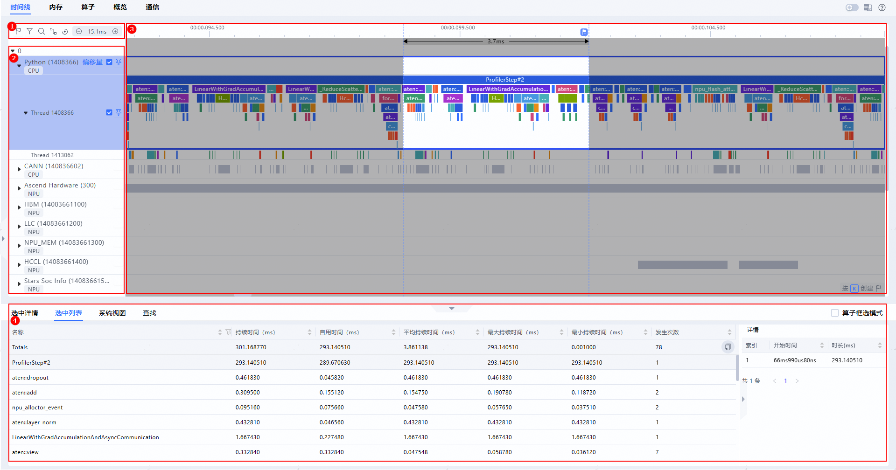

- Area 1: toolbar, which contains common shortcut keys. From left to right, the shortcut keys are **Marker List**, **Filter** (rank or unit), **Search**, **Flow Events**, **Reset** (page restoration), **Timeline Zoom Out**, and **Timeline Zoom In**.
- Area 2: timeline tree chart. The display in the TEXT scenario is different from that in the DB scenario. For details about the unit information, see [Unit Information](#unit-information).
  - TEXT scenario: displays the layer information of each device in the cluster scenario. The layer information is displayed by rank. The first layer is the rank ID, the second layer is the process or special layer, and the third layer is the thread name. The second layer includes the **Python** layer data (time consumption information of **PyTorch** and dotting data), **CANN** layer data (time consumption data of AscendCL, GE, and Runtime components), low-level **NPU** data (time consumption data and step trace data of each stream task flow under **Ascend Hardware**, communication data of **Communication** and **Overlap Analysis**, memory data, and other Ascend AI Processor system data), **AI Core Freq**, and other layers. The layer content varies with the imported data.
  - DB scenario: displays information about each host. The first layer is the host name, and the second layer is **Host** and **Rank ID**. The **Host** level displays **PyTorch** and **CANN** data by process and thread. The **Rank ID** level includes the bottom-layer **NPU** data (including time consumption data and step trace data of each stream task flow under **Ascend Hardware**, communication data of **Communication** and **Overlap Analysis**, memory data, and other Ascend AI Processor system data), **AI Core Freq**, and other layers. The content of the level under the rank varies with the imported data.

- Area 3: graphical pane, which displays data of a step. The graphical pane corresponds to the timeline tree chart, which graphically displays the timeline row by row, including the execution sequence and duration of upper-level application operators, components, and APIs.
- Area 4: data pane, which displays statistics or operator details. **Slice Detail** displays details about a selected operator. **Slice List** displays the operator list in the selected area of a unit. **System View** displays the summary information about a type of operators. **Find** displays the information about the searched operators.

**Unit Information**

The following table describes the unit information displayed on the **Timeline** tab page.

**Table 1** Unit information

<table class="tg"><thead>
  <tr>
    <th class="tg-0pky">Level-1 Unit Name</th>
    <th class="tg-0pky">Level-2 Unit Name</th>
    <th class="tg-0pky">Description</th>
  </tr></thead>
<tbody>
  <tr>
    <td class="tg-0pky">Process</td>
    <td class="tg-0pky">Thread</td>
    <td class="tg-0pky">This unit can be displayed only in DB files. TheThread unit contains the PyTorch, CANN, and MSTX units, which display the time consumed by upper-layer application threads in the PyTorch framework, time consumed by threads in the CANN framework, and dotting information, respectively.</td>
  </tr>
  <tr>
    <td class="tg-0pky">Python</td>
    <td class="tg-0pky">Thread</td>
    <td class="tg-0pky">Application layer data. Each sub-unit Thread contains the time consumed by the upper-layer application thread. The data is collected using PyTorch Profiler or msproftx. This unit can be displayed only in TEXT files.</td>
  </tr>
  <tr>
    <td class="tg-0pky">CANN</td>
    <td class="tg-0pky">Thread</td>
    <td class="tg-0pky">Data at the CANN layer. Each sub-unit Thread contains the time consumption data of AscendCL, GE, Runtime, and nodes (operators). For DB files, the level-2 unit name may contain **acl**, model, **node**, **hccl**, **runtime**, **op**, **queue**, **trace**, and **mstx**.</td>
  </tr>
  <tr>
    <td class="tg-0pky">MindSpore</td>
    <td class="tg-0pky">Thread</td>
    <td class="tg-0pky">In MindSpore, the time consumed by each phase of the current thread is displayed.</td>
  </tr>
  <tr>
    <td class="tg-0pky">Scope Layer</td>
    <td class="tg-0pky">Thread</td>
    <td class="tg-0pky">In MindSpore, the time consumed by each network layer of the current thread is displayed.</td>
  </tr>
  <tr>
    <td class="tg-0pky">Python GC</td>
    <td class="tg-0pky">Python GC</td>
    <td class="tg-0pky">In PyTorch, if the GC detection is enabled during profile data collection and a GC event occurs during collection, the GC event is recorded in the collected data and is displayed in the Python GC unit.</td>
  </tr>
  <tr>
    <td class="tg-0pky" rowspan="3">Ascend Hardware</td>
    <td class="tg-0pky">Stream &lt;id&gt;</td>
    <td class="tg-0pky">Low-level NPU data, task scheduling data, recording the execution duration of each task on different accelerators and AI Core performance metrics during AI task running.</td>
  </tr>
  <tr>
    <td class="tg-0pky">Stream &lt;id&gt; MSTX domain &lt;domainid&gt;</td>
    <td class="tg-0pky">MSTX device dotting data of stream id.</td>
  </tr>
  <tr>
    <td class="tg-0pky">Step Trace</td>
    <td class="tg-0pky">Step trace data. This unit is displayed only when the **step_trace_*.json** file exists.</td>
  </tr>
  <tr>
    <td class="tg-0pky">Low Power</td>
    <td class="tg-0pky">-</td>
    <td class="tg-0pky">Low-power data, including power consumption, bandwidth, frequency, temperature, and other metrics, is presented through dynamic frequency scaling curves to accurately identify frequency changes during operator execution. This unit displays only the profile data exported from the <term>Ascend 950PR/Ascend 950DT</term>.</td>
  </tr>
  <tr>
    <td class="tg-0pky">Biu Perf</td>
    <td class="tg-0pky">Group&lt;id&gt;-aiv&lt;id&gt;</td>
    <td class="tg-0pky">Execution time of instructions such as SU, VEC, CUBE, and MTE, and dotting data. This unit displays only the profile data exported from the <term>Ascend 950PR/Ascend 950DT</term>.</td>
  </tr>
  <tr>
    <td class="tg-0pky">UB</td>
    <td class="tg-0pky">UDMA/UNIC-Ports&lt;id&gt;</td>
    <td class="tg-0pky">Overall receive and transmit bandwidth of the UB for the UDMA and UNIC data types. This unit displays only the profile data exported from the <term>Ascend 950PR/Ascend 950DT</term>.</td>
  </tr>
  <tr>
    <td class="tg-0pky" rowspan="2">Block Detail</td>
    <td class="tg-0pky">AIC/AIV Earliest</td>
    <td class="tg-0pky">Time when each operator is executed on the earliest AI Core or AI Vector Core. If the operator is of the Mix type, it is executed on both the AIC and AIV. This unit displays only the profile data exported from the <term>Ascend 950PR/Ascend 950DT</term>.</td>
  </tr>
  <tr>
    <td class="tg-0pky">AIC/AIV Latest</td>
    <td class="tg-0pky">Time when each operator is executed on the latest AI Core or AI Vector Core. If the operator is of the Mix type, it is executed on both the AIC and AIV.</td>
  </tr>
  <tr>
    <td class="tg-0pky" rowspan="2">HBM</td>
    <td class="tg-0pky">HBM &lt;id&gt;/Read</td>
    <td class="tg-0pky">HBM read rate, in MB/s.</td>
  </tr>
  <tr>
    <td class="tg-0pky">HBM &lt;id&gt;/Write</td>
    <td class="tg-0pky">HBM write rate, in MB/s.</td>
  </tr>
  <tr>
    <td class="tg-0pky" rowspan="2">DDR</td>
    <td class="tg-0pky">Read</td>
    <td class="tg-0pky">DDR read rate.</td>
  </tr>
  <tr>
    <td class="tg-0pky">Write</td>
    <td class="tg-0pky">DDR write rate.</td>
  </tr>
  <tr>
    <td class="tg-0pky" rowspan="2">LLC</td>
    <td class="tg-0pky">LLC &lt;id&gt; Read/Hit Rate LLC &lt;id&gt; Write/Hit Rate</td>
    <td class="tg-0pky">L3 cache read/write speed data, L3 cache read and write throughputs.</td>
  </tr>
  <tr>
    <td class="tg-0pky">LLC &lt;id&gt; Read/Throughput LLC &lt;id&gt; Write/Throughput</td>
    <td class="tg-0pky">L3 cache read and write hit rates.</td>
  </tr>
  <tr>
    <td class="tg-0pky" rowspan="6">NPU_MEM</td>
    <td class="tg-0pky">APP/DDR</td>
    <td class="tg-0pky">Process-level DDR memory usage, in KB.</td>
  </tr>
  <tr>
    <td class="tg-0pky">APP/HBM</td>
    <td class="tg-0pky">Process-level on-chip memory usage, in KB.</td>
  </tr>
  <tr>
    <td class="tg-0pky">APP/MEMORY</td>
    <td class="tg-0pky">Sum of process-level DDR and on-chip memory usages, in KB.</td>
  </tr>
  <tr>
    <td class="tg-0pky">Device/DDR</td>
    <td class="tg-0pky">Device-level DDR memory usage, in KB.</td>
  </tr>
  <tr>
    <td class="tg-0pky">Device/HBM</td>
    <td class="tg-0pky">Device-level HBM usage, in KB.</td>
  </tr>
  <tr>
    <td class="tg-0pky">Device/MEMORY</td>
    <td class="tg-0pky">Device-level DDR and on-chip memory usage, in KB.</td>
  </tr>
  <tr>
    <td class="tg-0pky">CCU</td>
    <td class="tg-0pky">Communication</td>
    <td class="tg-0pky">Collective communication instruction data, start and end time of the CCU task, start and end time of the level-1 index instruction of the CCU task, and synchronization and data transfer duration. This unit displays only the profile data exported from the <term>Ascend 950PR/Ascend 950DT</term>.</td>
  </tr>
  <tr>
    <td class="tg-0pky" rowspan="2">Communication</td>
    <td class="tg-0pky">Group &lt;id&gt; Communication</td>
    <td class="tg-0pky">Communication operators in a communication group. A rank may exist in different communication groups, and a group identifies the behavior of the current rank in the current communication group.</td>
  </tr>
  <tr>
    <td class="tg-0pky">Plane &lt;id&gt;</td>
    <td class="tg-0pky">Collective communication operator information. Network plane ID. In terms of parallel scheduling and execution of multiple transmit and receive communication links, each plane is a concurrent communication dimension.</td>
  </tr>
  <tr>
    <td class="tg-0pky" rowspan="2">Stars Soc Info</td>
    <td class="tg-0pky">L2 Buffer Bw Level</td>
    <td class="tg-0pky">SoC transmission bandwidth information and L2 buffer bandwidth level information.</td>
  </tr>
  <tr>
    <td class="tg-0pky">Mata Bw Level</td>
    <td class="tg-0pky">Mata bandwidth level information.</td>
  </tr>
  <tr>
    <td class="tg-0pky" rowspan="4">acc_pmu</td>
    <td class="tg-0pky">Accelerator {accId}/readBwLevel</td>
    <td class="tg-0pky">Read bandwidth of the DVPP and DSA accelerators This unit is not supported by the <term>Ascend 950PR/Ascend 950DT</term>.</td>
  </tr>
  <tr>
    <td class="tg-0pky">Accelerator {accId}/readOstLevel</td>
    <td class="tg-0pky">Concurrent read operations of the DVPP and DSA accelerators</td>
  </tr>
  <tr>
    <td class="tg-0pky">Accelerator {accId}/writeBwLevel</td>
    <td class="tg-0pky">Write bandwidth of the DVPP and DSA accelerators</td>
  </tr>
  <tr>
    <td class="tg-0pky">Accelerator {accId}/writeOstLevel</td>
    <td class="tg-0pky">Concurrent write operations of the DVPP and DSA accelerators.</td>
  </tr>
  <tr>
    <td class="tg-0pky" rowspan="4">Overlap Analysis</td>
    <td class="tg-0pky">Communication</td>
    <td class="tg-0pky">Communication time.</td>
  </tr>
  <tr>
    <td class="tg-0pky">Communication(Not Overlapped)</td>
    <td class="tg-0pky">Not-overlapped communication time.</td>
  </tr>
  <tr>
    <td class="tg-0pky">Computing</td>
    <td class="tg-0pky">Computing time.</td>
  </tr>
  <tr>
    <td class="tg-0pky">Free</td>
    <td class="tg-0pky">Time when the device is neither computing nor communicating. When data is split by step, it is further divided into **Preparing** and **Free**. **Preparing** is used for data preprocessing, loading, and copying.</td>
  </tr>
  <tr>
    <td class="tg-0pky" rowspan="2">AI Core Utilization</td>
    <td class="tg-0pky">Average</td>
    <td class="tg-0pky">Average percentage of AI Core instructions. AI Core Utilization units can be displayed only in text files.</td>
  </tr>
  <tr>
    <td class="tg-0pky">Core &lt;id&gt;</td>
    <td class="tg-0pky">Percentage of total execution cycles (counting from the first operator instruction executed by the AI Core to the completion of the last instruction executed) of a task on the AI Core.</td>
  </tr>
  <tr>
    <td class="tg-0pky">AI Core Freq</td>
    <td class="tg-0pky">AI Core Freq</td>
    <td class="tg-0pky">Frequency changes of AI Cores during AI task running. This unit displays only the profile data exported from the <term>Atlas A2 training products/Atlas A2 inference products</term>.</td>
  </tr>
  <tr>
    <td class="tg-0pky" rowspan="4">SIO</td>
    <td class="tg-0pky">dat_rx, dat_tx</td>
    <td class="tg-0pky">Rx and Tx bandwidths of the data stream channel. SIO units can be displayed only in text files. This unit displays only the inter-die transmission bandwidth information of the <term>Atlas A2 training products/Atlas A2 inference products</term> and <term>Ascend 950PR/Ascend 950DT</term>.</td>
  </tr>
  <tr>
    <td class="tg-0pky">req_rx, req_tx</td>
    <td class="tg-0pky">Rx and Tx bandwidths of the request stream channel.</td>
  </tr>
  <tr>
    <td class="tg-0pky">rsp_rx, rsp_tx</td>
    <td class="tg-0pky">Rx and Tx bandwidths of the response stream channel.</td>
  </tr>
  <tr>
    <td class="tg-0pky">rsp_rx, rsp_tx</td>
    <td class="tg-0pky">Rx and Tx bandwidths of the monitor stream channel.</td>
  </tr>
  <tr>
    <td class="tg-0pky">QoS</td>
    <td class="tg-0pky">QoS &lt;id&gt;:OTHERS</td>
    <td class="tg-0pky">Device QoS bandwidth information.</td>
  </tr>
  <tr>
    <td class="tg-0pky">NIC</td>
    <td class="tg-0pky">Port &lt;id&gt;/Rx Port &lt;id&gt;/Tx</td>
    <td class="tg-0pky">Text scenario: network information on each time node DB scenario: bandwidth information The unit name varies according to the imported data.</td>
  </tr>
  <tr>
    <td class="tg-0pky">RoCE</td>
    <td class="tg-0pky">Port &lt;id&gt;/Rx Port &lt;id&gt;/Tx</td>
    <td class="tg-0pky">RoCE bandwidth. RoCE units can be displayed only in text files.</td>
  </tr>
  <tr>
    <td class="tg-0pky" rowspan="4">PCIe</td>
    <td class="tg-0pky">PCIe_cpl</td>
    <td class="tg-0pky">Completion packets that receives write requests, in (MB/s. `Tx` indicates transmit, and `Rx` indicates receive.</td>
  </tr>
  <tr>
    <td class="tg-0pky">PCIe_nonpost</td>
    <td class="tg-0pky">PCIe Non-Posted data transmission bandwidth, in MB/s. `Tx` indicates transmit, and `Rx` indicates receive.</td>
  </tr>
  <tr>
    <td class="tg-0pky">PCIe_nonpost_latency</td>
    <td class="tg-0pky">Transmission latency in PCIe Non-Posted mode, in μs. `Tx` indicates transmit, and `Rx` indicates receive. `PCIe_nonpost_latency` does not involve `Tx`. The value is fixed at `0`.</td>
  </tr>
  <tr>
    <td class="tg-0pky">PCIe_post</td>
    <td class="tg-0pky">PCIe Posted data transmission bandwidth, in MB/s. `Tx` indicates transmit, and `Rx` indicates receive. The unit name varies according to the imported data.</td>
  </tr>
  <tr>
    <td class="tg-0pky">HCCS</td>
    <td class="tg-0pky">txThroughput rxThroughput</td>
    <td class="tg-0pky">Transmit and receive bandwidths (MB/s) of HCCS collective communication.</td>
  </tr>
  <tr>
    <td class="tg-0pky" rowspan="4">biu_group</td>
    <td class="tg-0pky">Bandwidth Read</td>
    <td class="tg-0pky">Bandwidth for the bus interface unit (BIU) to read instructions. biu_group units can be displayed only in text files.</td>
  </tr>
  <tr>
    <td class="tg-0pky">Bandwidth Write</td>
    <td class="tg-0pky">Bandwidth for the BIU to write instructions.</td>
  </tr>
  <tr>
    <td class="tg-0pky">Latency Read</td>
    <td class="tg-0pky">Latency for the BIU to read instructions.</td>
  </tr>
  <tr>
    <td class="tg-0pky">Latency Write</td>
    <td class="tg-0pky">Latency for the BIU to write instructions.</td>
  </tr>
  <tr>
    <td class="tg-0pky" rowspan="4">aic_core_group</td>
    <td class="tg-0pky">Cube</td>
    <td class="tg-0pky">Cycle count and ratio of matrix operation instructions in the current sampling period. aic_core_group units can be displayed only in text files.</td>
  </tr>
  <tr>
    <td class="tg-0pky">Mte1</td>
    <td class="tg-0pky">Cycle count and ratio of L1-to-L0A/L0B transfer instructions in the current sampling period.</td>
  </tr>
  <tr>
    <td class="tg-0pky">Mte2</td>
    <td class="tg-0pky">Cycle count and ratio of on-chip memory to AI Core transfer instructions in the current sampling period.</td>
  </tr>
  <tr>
    <td class="tg-0pky">Mte3</td>
    <td class="tg-0pky">Cycle quantity and ratio of AI Core to on-chip memory movement instructions in the current sampling period.</td>
  </tr>
  <tr>
    <td class="tg-0pky" rowspan="5">aiv_core_group</td>
    <td class="tg-0pky">Mte1</td>
    <td class="tg-0pky">Cycle count and ratio of L1-to-L0A/L0B transfer instructions in the current sampling period. aiv_core_group units can be displayed only in text files.</td>
  </tr>
  <tr>
    <td class="tg-0pky">Mte2</td>
    <td class="tg-0pky">Cycle count and ratio of on-chip memory to AI Core transfer instructions in the current sampling period.</td>
  </tr>
  <tr>
    <td class="tg-0pky">Mte3</td>
    <td class="tg-0pky">Cycle quantity and ratio of AI Core to on-chip memory movement instructions in the current sampling period.</td>
  </tr>
  <tr>
    <td class="tg-0pky">Scalar</td>
    <td class="tg-0pky">Cycle count and ratio of scalar operation instructions in the current sampling period.</td>
  </tr>
  <tr>
    <td class="tg-0pky">Vector</td>
    <td class="tg-0pky">Cycle count and ratio of vector operation instructions in the current sampling period.</td>
  </tr>
  <tr>
    <td class="tg-0pky" rowspan="4">Stars Chip Trans</td>
    <td class="tg-0pky">PA Link Rx</td>
    <td class="tg-0pky">PA traffic receive level. When collective communication bandwidth is available, it is not recommended to refer to this field, as it provides only coarse-grained statistical data. Stars Chip Trans units are displayed only in text files and are not supported by the <term>Ascend 950PR/Ascend 950DT</term>.</td>
  </tr>
  <tr>
    <td class="tg-0pky">PA Link Tx</td>
    <td class="tg-0pky">PA traffic send level. When collective communication bandwidth is available, it is not recommended to refer to this field, as it provides only coarse-grained statistical data.</td>
  </tr>
  <tr>
    <td class="tg-0pky">PCIE Read Bandwidth</td>
    <td class="tg-0pky">PCIe read bandwidth. When PCIe bandwidth is available, it is not recommended to refer to this field, as it provides only coarse-grained statistical data.</td>
  </tr>
  <tr>
    <td class="tg-0pky">PCIE Write Bandwidth</td>
    <td class="tg-0pky">PCIe write bandwidth. When PCIe bandwidth is available, it is not recommended to refer to this field, as it provides only coarse-grained statistical data.</td>
  </tr>
  <tr>
    <td class="tg-0pky">CPU Usage</td>
    <td class="tg-0pky">CPU &lt;id&gt;</td>
    <td class="tg-0pky">CPU usage on the host.</td>
  </tr>
  <tr>
    <td class="tg-0pky">Memory Usage</td>
    <td class="tg-0pky">Memory Usage</td>
    <td class="tg-0pky">Memory usage on the host.</td>
  </tr>
  <tr>
    <td class="tg-0pky">Disk Usage</td>
    <td class="tg-0pky">Disk Usage</td>
    <td class="tg-0pky">Drive I/O usage on the host.</td>
  </tr>
  <tr>
    <td class="tg-0pky">Network Usage</td>
    <td class="tg-0pky">Network Usage</td>
    <td class="tg-0pky">Network I/O usage on the host.</td>
  </tr>
  <tr>
    <td class="tg-0pky">OS Runtime API</td>
    <td class="tg-0pky">Thread</td>
    <td class="tg-0pky">Syscall and pthreadcall data on the host. This unit can be displayed only in text files.</td>
  </tr>
</tbody></table>

### Usage Description

#### Basic Functions

**Zooming In and Out on the GUI**

The **Timeline** tab page supports zooming in, zooming out, and moving left and right. The operations are as follows:

- Click any position in the tree chart or graphical pane on the **Timeline** tab page and press **W** (zoom in) or **S** (zoom out) on the keyboard. The maximum zoom-in precision is 1 ns.
- Click any position in the tree chart or graphical pane on the **Timeline** tab page and press **A** (move left), **D** (move right), left arrow (move left), or right arrow (move right) keys on the keyboard to move leftward or rightward, or press up arrow (move up) or down arrow (move down) on the keyboard to move upward or downward.
- In the graphical pane, hold down **Alt** and use the left mouse button to select an area. The selected area is zoomed in.
- Click  (zoom in) and  (zoom out) on the toolbar in the upper left corner of the page to zoom in or out.
- Click  on the toolbar in the upper left corner of the page to restore the graphical pane to display all timeline views.
- Move the pointer to any position in the tree chart or graphical pane on the **Timeline** tab page, and hold down **Ctrl** and scroll the mouse wheel to zoom in or out.
- In the graphical pane, hold down **Ctrl** and click the left mouse button to drag the unit chart leftward or rightward.

    > [!NOTE]NOTE  
    > On macOS, you need to press the Command key on the keyboard and scroll the mouse wheel to zoom in or out, and press the Command key and left mouse button to drag the lane chart left or right.

- In the graphical pane, right-click to zoom in or out. For details, see [**Table 1** Right-click menu functions](#right-click-menu-functions).

    **Table 1** Right-click menu functions 

    |Menu|Description|Operation|
    |--|--|--|
    |Fit to screen|Enlarges a single operator to the maximum width of the visible range of the screen. If no operator is selected, this parameter is not displayed.|Select an operator and right-click it. In the displayed menu, click **Fit to screen** to enlarge the selected operator to fit the maximum visible width of the screen.|
    |Zoom into selection|Zooms in on the selected area to the maximum width of the visible range of the screen. If no area is selected, this parameter is not displayed.|Select an area and right-click it. In the displayed menu, click **Zoom into selection** to enlarge the selected area to the maximum width of the visible range of the screen.|
    |Undo Zoom(0)|Undoes the zoom. The number in the parentheses changes with the number of zoom operations. The initial value is **0**.|On the zoomed-in **Timeline** page, right-click to display a shortcut menu. Click **Undo Zoom(0)** to cancel the zooming. The page is zoomed out once, and the number in the brackets decreases by one accordingly.|
    |Reset Zoom|Resets the zoom to restore the chart to the initial state.|On the zoomed-in Timeline page, right-click and choose **Reset Zoom** from the shortcut menu. The chart is reset to the initial state.|

**Search**

On the **Timeline** tab page, you can search for operators and APIs by name.

- Click  on the toolbar in the upper left corner of the page. In the text box that is displayed, enter the content to be searched for and press **Enter**. The corresponding operators or APIs are matched. The total number of matched operators and APIs is displayed. The matched operators or APIs are highlighted, as shown in [**Figure 1** Searching for operators](#searching-for-operators). The total number of operators and APIs related to npu is **3104**.

    Click the switch button next to the search box to view the previous or next matched operator or API. Alternatively, enter a number next to the text box to search for the corresponding operator or API. The operator or API is selected.

    **Figure 1** Searching for operators  
    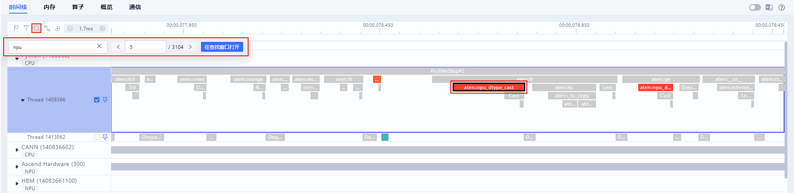

- Click  on the toolbar in the upper left corner of the page and click  and  on the left of the search box to enable case-sensitive matching and full-word matching, respectively.
  - Click  to enable case-sensitive matching. In the displayed dialog box, enter the content to be searched for and press **Enter**. Operators or APIs whose names contain the search item are matched, as shown in [**Figure 2** Enabling case-sensitive matching or full-word matching](#enabling-case-sensitive-matching-or-full-word-matching).

      **Figure 2** Enabling case-sensitive matching or whole word matching  
        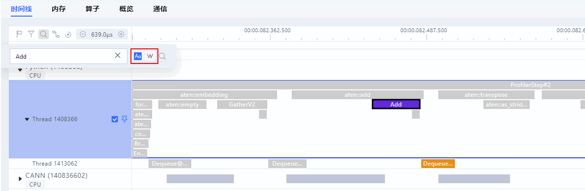

  - Click  to enable whole word matching. In the displayed text box, enter the search term and press **Enter**. The system will match operators or APIs with names corresponding to the search term, ignoring case, as shown in [**Figure 2** Enabling case-sensitive matching or whole word matching](#enabling-case-sensitive-matching-or-full-word-matching).
  - When both  and  are selected, the **Match case** and **Words** functions are enabled. In the text box that is displayed, enter the search content and press **Enter**. The operator or API whose name is the same as the search item is matched.

- Click **Open in Find Window** next to the search box. The **Find** tab page is displayed in the lower part of the page, showing the information about the search term, as shown in [**Figure 3** Open in the Find Window](#open-in-the-find-window). For details about the fields, see [Table 2 Fields on the Find tab page](#fields-on-the-find-tab-page). Click **Click** in the **Click to Timeline** column to go to the specific location of the operator or API in the timeline view.

    **Figure 3** Open in the Find Window 
    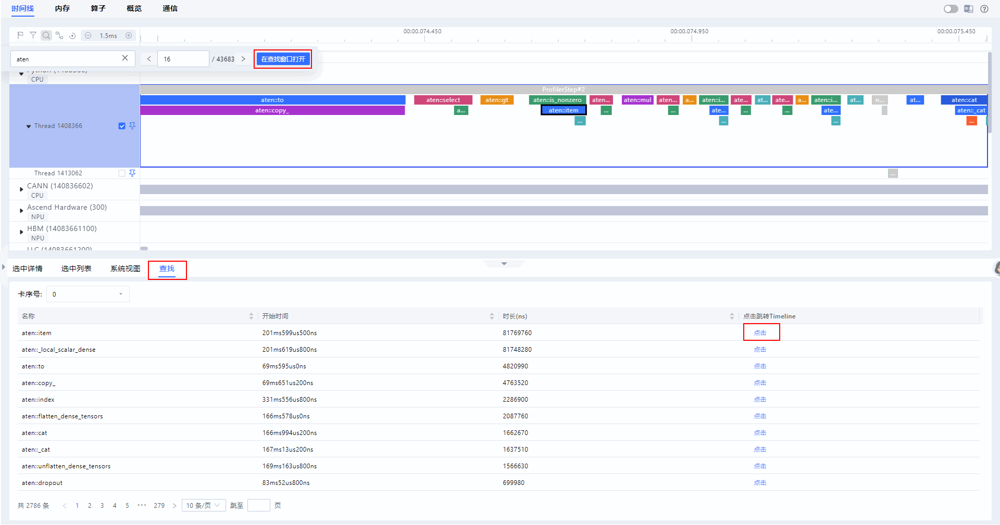

    **Table 2** Fields on the Find tab page 

    |Field|Description|
    |--|--|
    |Rank ID|Rank ID. You can select the rank to be viewed.|
    |Name|Operator name.|
    |Start Time|Start time of operator execution.|
    |Duration(ns)|Total time of running the operator.|
    |Click To Timeline|Click **Click** to go to the specific location of the operator or API in the timeline view.|

#### Displaying Profile Data

**Previewing on the GUI**

- In a thread-level unit, if a unit contains multiple rows of data, the data distribution in the unit is displayed in thumbnail mode without expanding the unit, as shown by 1 in [**Figure 1** Timeline preview](#timeline-preview).
- If the process-level unit is not expanded, the data distribution within the thread-level unit is visualized by filling the process-level unit in gray, based on the data along the timeline at the thread level, as shown by 2 in [**Figure 1** Timeline preview](#timeline-preview).

    **Figure 1** Timeline preview
    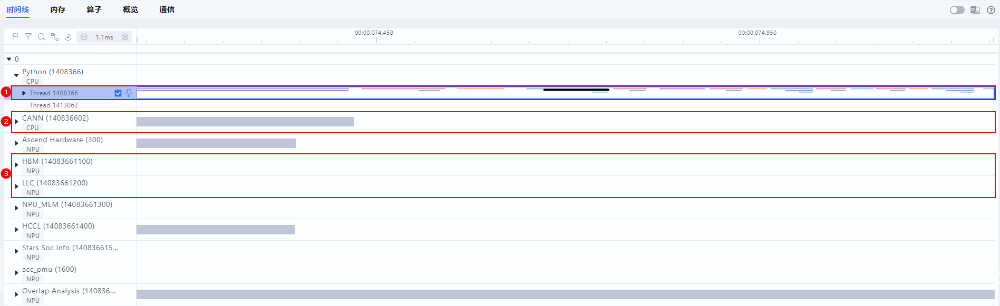

    > [!NOTE]NOTE  
    > CPU, Memory, and Network usage data, that is, numeric events, are displayed in bar charts on the timeline and cannot be previewed, as shown by 3 in [**Figure 1** Timeline preview](#timeline-preview).

**Displaying Data in the Cluster Scenario**

You can import and display cluster data to MindStudio Insight without manually merging multiple single-rank data. MindStudio Insight supports multiple hosts and cards in the training scenario and multiple cards in the inference scenario. It can automatically identify all **trace\_view.json** and **msprof\*******.json** files in the imported folder. [**Figure 2** Timeline data in the cluster scenario](#timeline-data-in-the-cluster-scenario) uses 16 cards as an example.

**Figure 2** Timeline data in the cluster scenario  
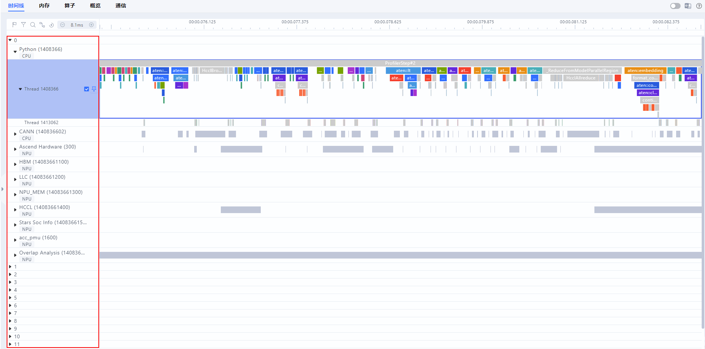

In a cluster scenario, you can hover the pointer over the rank number to quickly locate the file directory corresponding to the rank data. For example, if you hover the pointer over **0**, the file directory corresponding to the rank is displayed, as shown in [Figure 3 Locating a folder](#locating-a-folder).

**Figure 3** Locating a folder  
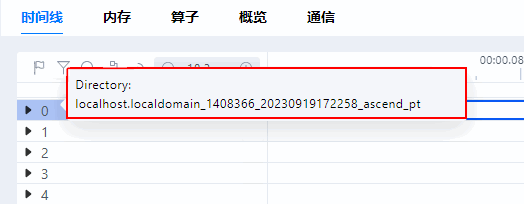

**Displaying and Comparing Data by Rank/Unit**

When cluster data is imported, a large amount of timeline information is displayed. To help users compare and analyze data, data can be filtered and displayed by rank or/and unit in MindStudio Insight.

> [!NOTE]NOTE  
> When filtering data by rank and unit, you can select the rank and unit in sequence to display the filtering information.

- Display by rank: displays only one rank. Click  in the upper left corner of the page, select **Rank Filter**, click the text box, and select **1** from the drop-down list. The timeline information of rank 1 is displayed, as shown in [**Figure 4** Rank filtering](#rank-filtering).

    **Figure 4** Rank filtering 
    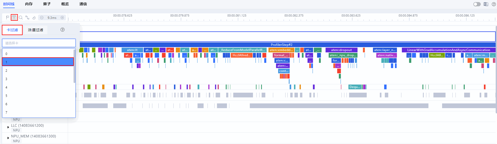

- Display by unit: [**Figure 5** Unit filtering](#unit-filtering) displays only the **Overlap Analysis** unit of a rank as an example. Click  on the toolbar in the upper left corner of the page, select **Units Filter**, click the text box, and select **Overlap Analysis** from the drop-down list box.

    **Figure 5** Unit filtering   
    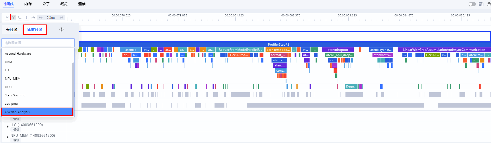

**Pinning and Comparing Data by Unit**

- MindStudio Insight supports fixing and pinning units. You can drag the collapsed units to freely sort them, facilitating comparison with other levels of the same type.

    > [!NOTE]NOTE  
    > If the level-2 and level-3 units in the pinned rank are also pinned, you can only drag and drop the rank-level units. Similarly, if the level-3 units in the pinned level-2 units are also pinned, you can only drag and drop the level-2 units.

    For example, click  next to a level-3 unit name in cards 0, 1, and 2 to pin the unit name. Click  again to unpin the unit name, as shown in [**Figure 6** Pinning and comparing](#pinning-and-comparing).

    **Figure 6** Pinning and comparing  
    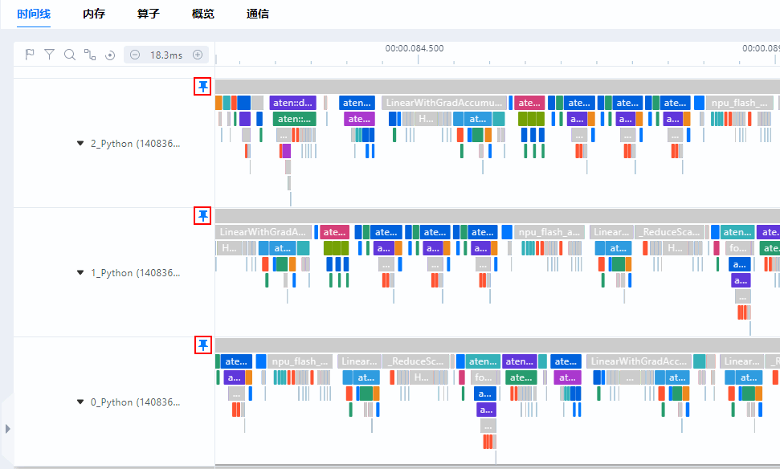

- MindStudio Insight also allows you to pin the communication units in the same communication group by one click.

    Right-click the **Group** sub-unit under the **Communication** unit and choose **Pin (Same Group** *group name***)** from the shortcut menu to pin all units in the communication group. This makes it easier to view and compare the units, as shown in [**Figure 7** Pinning the communication unit](#pinning-the-communication-unit).

    **Figure 7** Pinning the communication unit   
    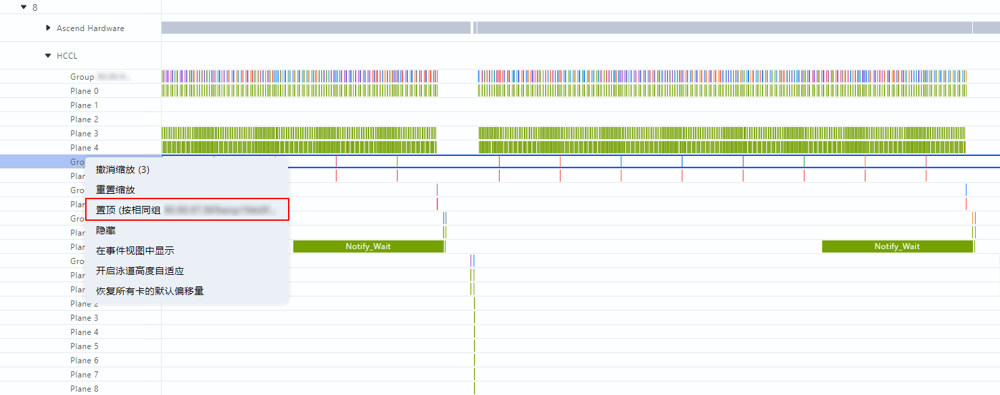

    Right-click a pinned unit and choose **Unpin (Same Group** *group name***)** or **Unpin (all)** from the shortcut menu to unpin the unit, as shown in [**Figure 8** Unpinning](#unpinning). Click **Unpin (Same Group** *group name***)** to unpin all units in the communication group, and click **Unpin (all)** to unpin all pinned units.

    **Figure 8** Unpinning 
    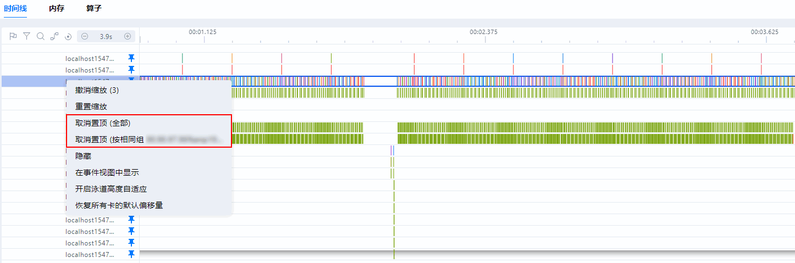

**Aligning Single Rank and Unit Timeline**

> [!NOTE]NOTE  
> In the single-rank, cluster, and multi-model scenarios, the relative positions of timelines are automatically aligned. If automatic alignment is not required, right-click anywhere, choose **Recover cards default offset** from the shortcut menu to restore the default offsets of all cards and models, and manually align the relative positions.

- Manually aligning the relative positions to the start position

    In the **Offset** dialog box, click  (**Align to Start**). The offset of the leftmost thread data in the rank from the initial position (00:00.000) of the timeline is displayed in the **Timestamp Offset\(ns\)** text box. Then press **Enter**. The **Timeline** tab page aligns the thread data with the initial position of the timeline.

    As shown in [**Figure 9** Initial position offset](#initial-position-offset), the offset between the leftmost thread data in rank 0 and the initial position of the timeline is 7293500 ns.

    **Figure 9** Initial position offset   
    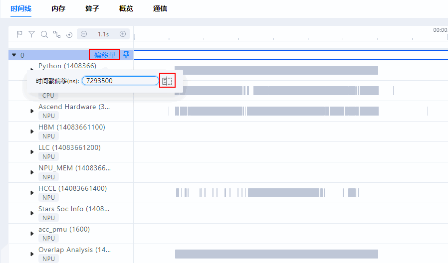

- Manually setting the offset

    In the multi-host multi-rank scenario, the time on the host may be inaccurate. As a result, the relative positions of timelines of multiple cards may be inaccurate. MindStudio Insight supports time calibration in the single-rank dimension, as shown in [**Figure 10** Single-rank time adjustment](#single-device-time-adjustment). You can set the offset to move the timeline of a single rank leftward or rightward to calibrate the time. The unit of the offset is ns. A negative value indicates rightward movement, and a positive value indicates leftward movement.

    **Figure 10** Single-rank time adjustment   
    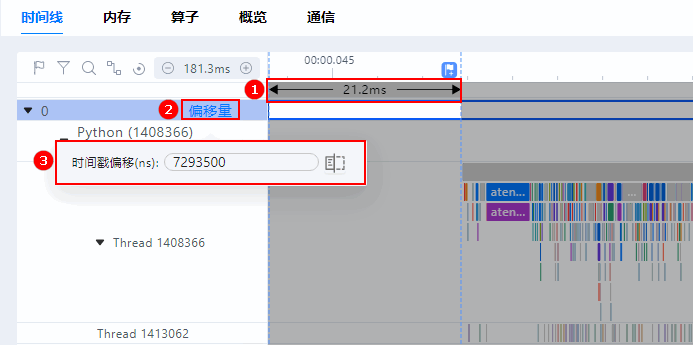

    To calibrate time more flexibly, MindStudio Insight also supports time calibration by unit, as shown in [**Figure 11** Unit time adjustment](#Unit-time-adjustment). On the **Timeline** tab page, expand the rank, click **Offset** next to the required level-2 unit name, enter a value in the text box, and press **Enter** to adjust the unit time. In the DB scenario, you need to expand the host name and adjust the time on the level-2 units under host and each rank.

    **Figure 11** Unit time adjustment   
    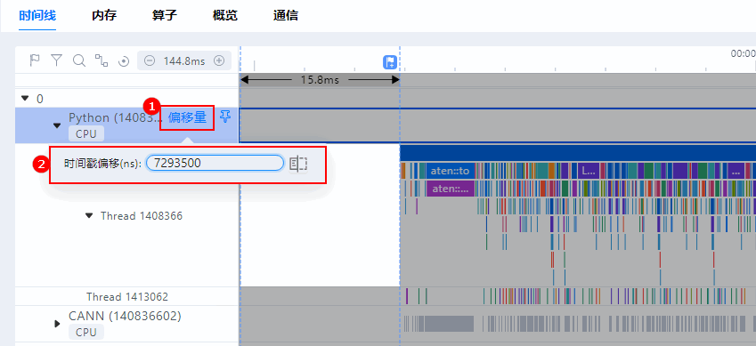

**Displaying Multiple Hosts and Cards**

When multiple hosts and cards are imported, data can be displayed by host in MindStudio Insight, as shown in [Figure 12 Displaying multiple hosts and cards](#Displaying-multiple-hosts-and-cards).

- In the figure, **1** indicates the host name, which consists of **hostName** and **hostUid**.
- In the figure, **2** indicates the rank layer, which displays the corresponding unit based on the rank sequence number of the current host.
- In the figure, **3** indicates the parameter configuration item. In the multi-host multi-rank scenario, you need to select **Host Name** and then select **Rank ID** under the host for configuration.

    If the imported DB file contains the **HOST\_INFO** table, this configuration item is displayed on the **System View** tab page (when **Stats System View** or **Expert System View** is selected) and the **Find** tab page on the **Timeline** tab page.

> [!NOTE]NOTE  
> This function can be displayed only in the unified DB scenario.

**Figure 12** Displaying multiple hosts and cards   
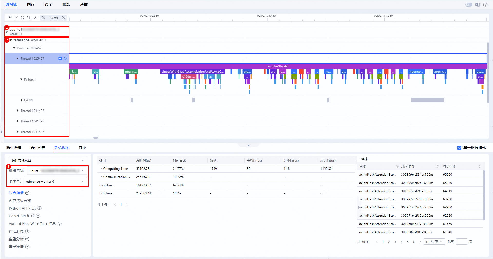

**Setting and Viewing Markers**

- Region marker

    On the **Timeline** tab page, select a region and click  or press **K** to mark and save the selected region, as shown in [Figure 13 Region marker](#Region-marker).

    **Figure 13** Region marker   
    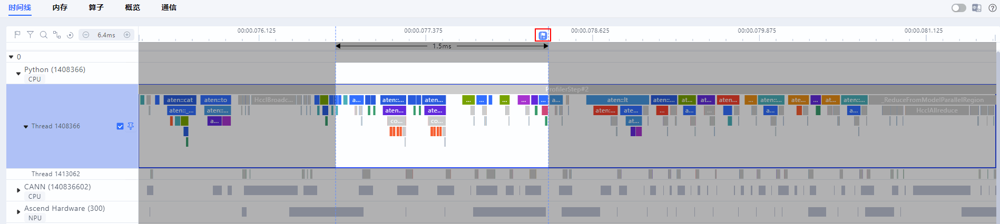

    Double-click a marker to set the marker pair attributes. You can modify the marker pair name and color, and delete the marker pair, as shown in [Figure 14 Modifying marker pair attributes](#Modifying-marker-pair-attributes).

    **Figure 14** Modifying marker pair attributes   
    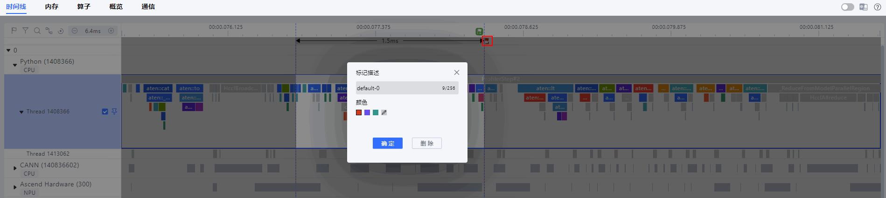

- Single-point marker

    Click anywhere in the uppermost empty unit or press **K** to generate a single-point marker, as shown in [**Figure 15** Single-point marker](#Single-point-marker).

    **Figure 15** Single-point marker 
    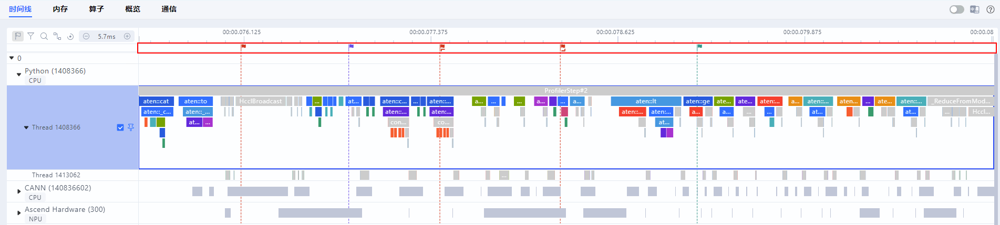

    Double-click a marker to set its attributes. You can modify the marker name and color, and delete the marker.

- Marker management

    Click  on the toolbar in the upper left corner to show all marker information, as shown in [**Figure 16** Viewing mark information](#Viewing-mark-information).

    **Figure 16** Viewing mark information 
    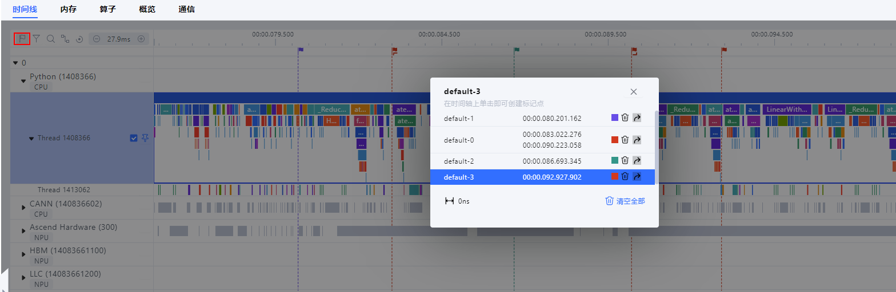

  - Click the  icon corresponding to a marker to delete the marker.
  - Click **Clear** in the lower part of the dialog box to delete all markers.
  - Click a region marker. The **Slice Detail** tab page in the lower part of the page displays the duration information of the region.
  - If a marker is not displayed on the current visualization page, click the  icon corresponding to the marker to go to the marker page.
  - Click the color icon corresponding to a marker to set the color to facilitate marker category management.

**Displaying Operator Flows**

- MindStudio Insight displays the operator flows. You can click an operator with a flow to display the flow associated with the operator. Even if the process at the start point or end point of the flow is folded, the flow does not disappear. In addition, you can locate other operators associated with the operator and view their details.
    1. Click an operator with a flow to display the flow.
    2. Right-click and choose the option for going to the flowed operator from the shortcut menu. In the operator list, click the operator name or connection mode under the source or target to go to the corresponding operator. The operator is automatically highlighted, and the operator details are displayed on the **Slice Detail** tab page. See [**Figure 17** Operator flows](#operator-flows).

        **Figure 17** Operator flows
        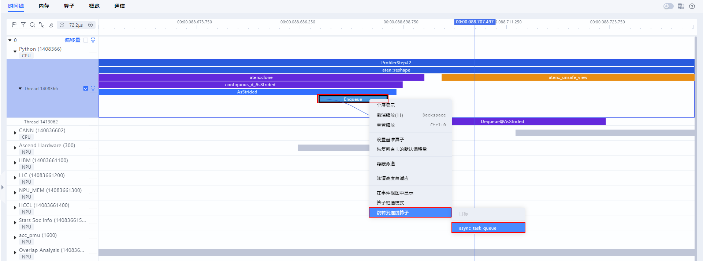

        > [!NOTE]NOTE
        >
        > - If the processes at the start point and end point of a flow are collapsed, the flow disappears.
        > - In MindStudio Insight, flows are connected only to the first operator delivered in the same batch. In the Ascend hardware unit, if you click an operator and find that the associated flow is connected to another operator, the two operators are delivered in the same batch.

- MindStudio Insight supports full flows. You can click  on the toolbar in the upper left corner of the page. In the dialog box that is displayed, you can select one or more flow types. Alternatively, you can search for a flow type by keyword in the search box and select the corresponding flow type. All flows of the corresponding type are displayed in the graphical pane, as shown in [**Figure 18** Full flows](#Full-flows).

    > [!NOTE]NOTE  
    > A maximum of 10 flow types can be selected.

    **Figure 18** Full flows
    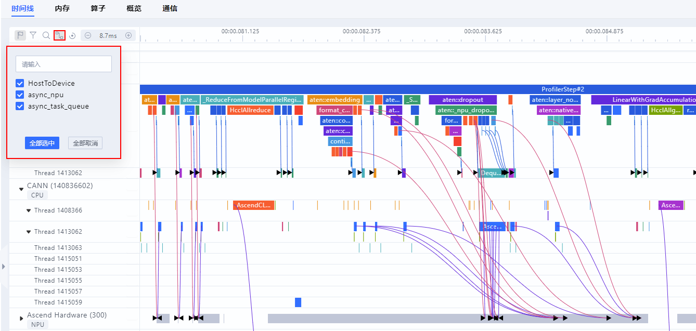

    The mappings between the application-layer operators and the NPU operators delivered and executed through flows are as follows:

  - HostToDevice
    - Delivery and execution mappings from CANN-layer nodes (operators) to NPU operators on Ascend Hardware (host to device).
    - Delivery and execution mappings from CANN-layer nodes (operators) to communication operators (host to device).

  - async\_npu
    - Delivery and execution mappings from application-layer operators to NPU operators on Ascend Hardware.
    - Delivery and execution mappings from application-layer operators to communication operators.

  - async\_task\_queue: mappings from enqueue to dequeue at the application layer, which is used only in the PyTorch scenario.
  - fwdbwd: mappings from the forward API to the backward API, which is used only in the PyTorch scenario.
  - MSTX: delivery and execution mappings from dotting data to NPU operators on Ascend Hardware.

    > [!NOTE]NOTE
    >
    > - Whether mappings between layers are displayed depends on whether the data is collected in a specific scenario.
    > - The flow between layers is associated with whether the layers are expanded. If a flow type is selected and the corresponding layer is not expanded, the flow of this type is not displayed.

**Selectively Analyzing Multi-Rank Data**

When data of more than 16 cards is imported to MindStudio Insight, you can selectively analyze the data on the **Timeline** tab page. You can perform one-click global analysis or partial analysis.

- One-click global analysis: On the **Timeline** tab page, click **Start Global Analysis** to analyze all rank data, as shown in [**Figure 19** Global analysis](#Global-analysis). After all rank data is analyzed, the **Start Global Analysis** button disappears.

    **Figure 19** Global analysis 
    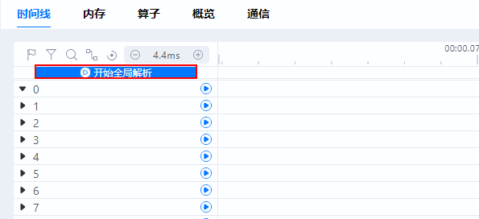

- Partial analysis: If you only need to analyze the data of some cards, click  next to the rank number to analyze the data of the selected rank, as shown in [**Figure 20** Single-rank analysis](#Single-rank-analysis). After the rank data is analyzed, the button disappears, as shown in rank 0 and rank 1 in the figure.

    **Figure 20** Single-rank analysis 
    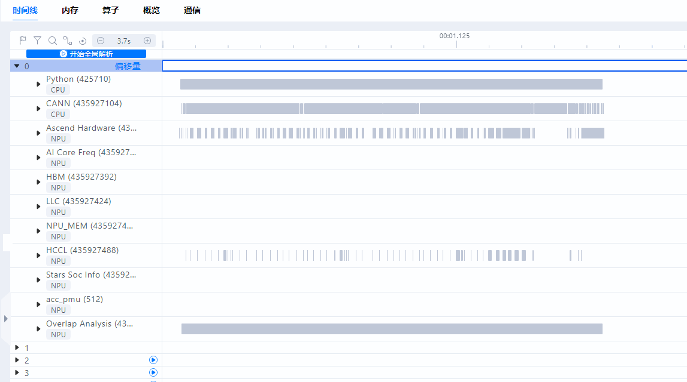

    If a large number of cards are imported, you can use the rank filter function to locate the cards whose data needs to be analyzed. On the toolbar of the **Timeline** tab page, click , select **Rank Filter**, click the text box next to it, and select the rank to be displayed from the drop-down list box. The corresponding information is displayed on the **Timeline** tab page. Click  next to the rank number to analyse the data. As shown in [**Figure 21** Filtering, displaying, and analyzing](#Filtering-displaying-and-analyzing), cards 2, 5, and 7 are selected for analysis.

    **Figure 21** Filtering, displaying, and parsing 
    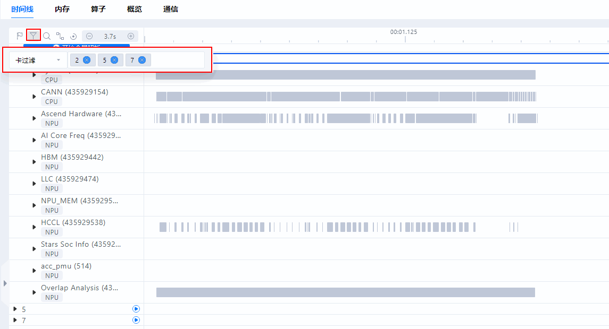

    > [!NOTE]NOTE  
    > In the partial analysis scenario, click **Start Global Analysis**. All rank data is parsed.

- Rank parsing in the same communication group: After a rank is parsed, right-click the **Group** sub-unit in the communication group and choose **Parse Cards of Related Group** from the shortcut menu. All cards related to the communication group of the unit are parsed, as shown in [**Figure 22** Parsing cards in the related communication group](#parsing-cards-in-the-related-communication-group). After the parsing is complete, the shortcut menu changes to **Parsed All Cards of Related Group** and is dimmed.

    **Figure 22** Parsing cards in the related communication group 
    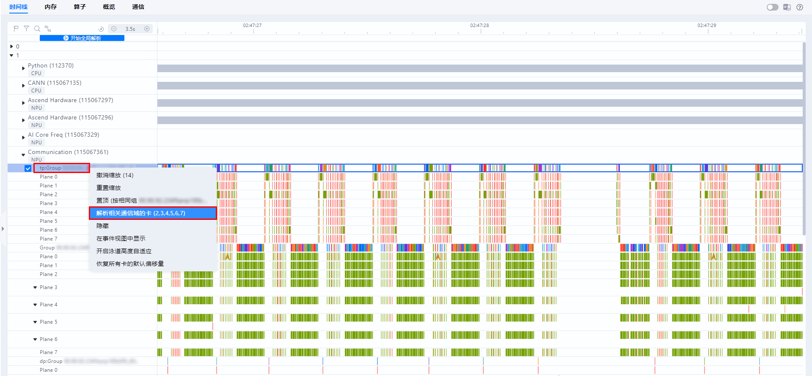

**Aligning Custom Operator Time**

MindStudio Insight supports aligning the time of selected operators using the shortcut keys, which facilitates operator information comparison.

- **Aligning the operator time**
    1. On the **Timeline** tab page, right-click an operator and choose **Set base slice** from the shortcut menu to set the selected operator as the base slice, as shown in [**Figure 23** Setting the base slice](#setting-the-base-slice).

        **Figure 23** Setting the base slice 
        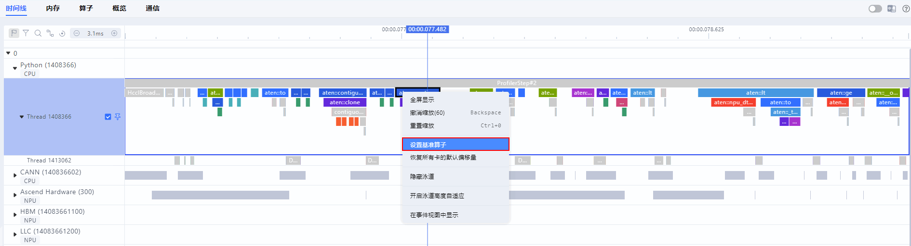

    2. Select the operator in the level-2 unit that is different from the base slice.
    3. Press **L** (left alignment) to align the selected operator with the left boundary of the base slice, as shown in [**Figure 24** Aligning the left boundary of the operator](#Aligning-the-left-boundary-of-the-operator).

        **Figure 24** Aligning the left boundary of the operator 
        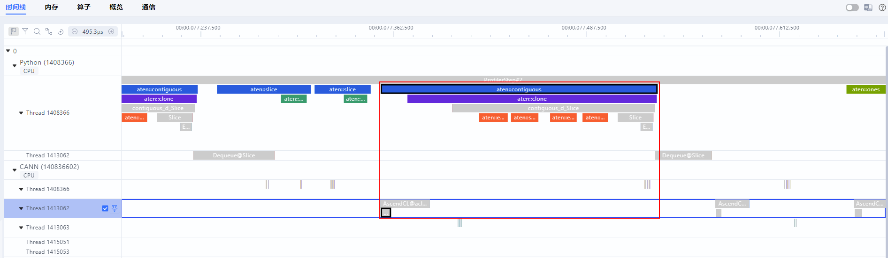

        Press **R** (right alignment) to align the selected operator with the right boundary of the base slice, as shown in [**Figure 25** Aligning the right boundary of the operator](#Aligning-the-right-boundary-of-the-operator).

        **Figure 25** Aligning the right boundary of the operator 
        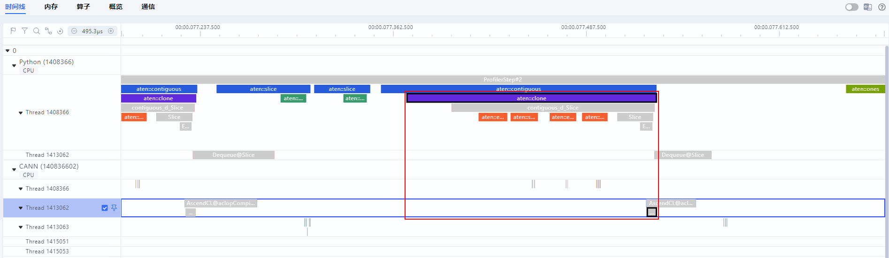

        > [!NOTE]NOTE  
        > Regardless of whether the selected operator is left-aligned or right-aligned, the operator in the **NPU** unit whose device is the same as that of the selected operator also shifts.

- **Clearing base slice**

    Right-click any position in the unit and choose **Clear base slice** from the shortcut menu to cancel the base slice, as shown in [**Figure 26** Clearing the base slice](#clearing-the-base-slice).

    **Figure 26** Clearing the base slice 
    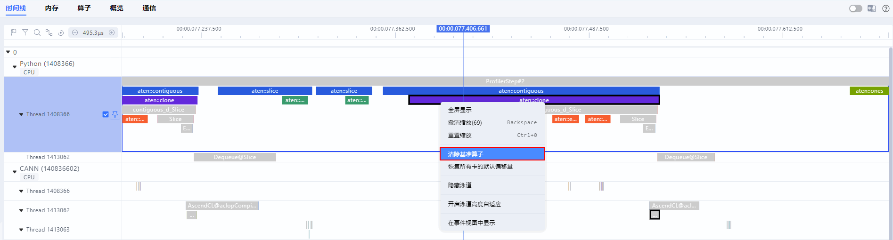

- **Recovering cards default offset**

    If the operator time alignment operation has been performed, right-click any position in the unit and choose **Recover cards default offset** from the shortcut menu to restore the default offset, as shown in [**Figure 27** Recovering cards default offset](#recovering-cards-default-offset).

    **Figure 27** Recovering cards default offset 
    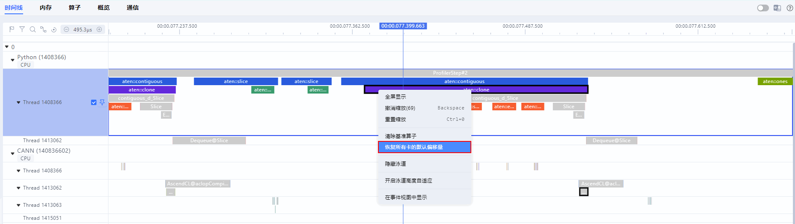

#### Displaying Page Optimization

**Hide**

On the **Timeline** tab page, you can hide or expand a unit.

- Hiding units

    On the **Timeline** tab page, hover the pointer over the unit to be hidden, select one or more units, or drag select multiple units. Automatically select the selected unit, right-click the unit, and choose **Hide** from the shortcut menu to hide the unit. The *x***units hidden** row is displayed under the layer, as shown in [**Figure 1** Hide](#Hide). *x* indicates the number of hidden units.

    **Figure 1** Hide  
    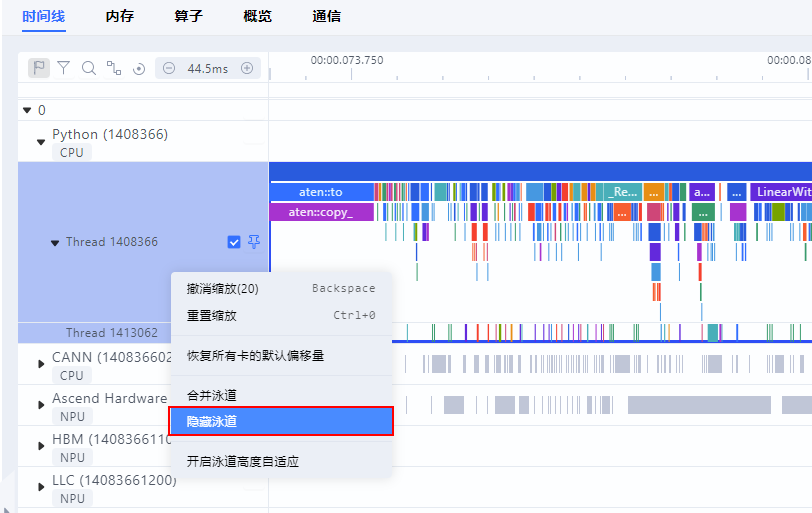

- Displaying all hidden units

    Right-click the **units hidden** row that contains hidden units and choose **Show All** from the shortcut menu to display all hidden units at the selected level.

    If hidden units exist at both the parent and child layers, right-click the **units hidden** row of the parent layer and choose **Show All** from the shortcut menu to display all hidden units at the parent layer, as shown in [**Figure 2** Showing hidden units](#Showing-hidden-units).

    **Figure 2** Showing hidden units  
    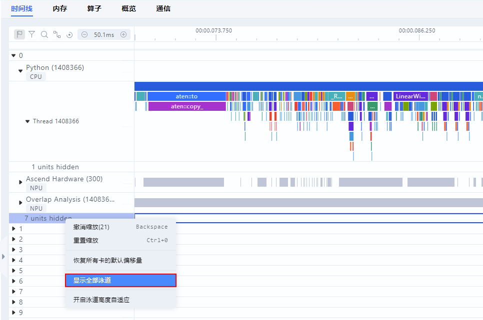

**Hiding Python Call Stacks**

If data imported to MindStudio Insight contains Python call stack information, you can hide or display the Python call stack information in the unit on the **Timeline** tab page for analysis personnel to view.

> [!NOTE]NOTE  
> If the unit does not contain Python call stack information, the unit does not have the **Hide python call stack** function.

- **Hide python call stack**: Right-click a unit where the Python call stack needs to be hidden and choose **Hide python call stack** from the shortcut menu to hide the Python call stack in the unit, as shown in [**Figure 3** Hide python call stack](#Hide-python-call-stack).

    **Figure 3** Hide python call stack  
    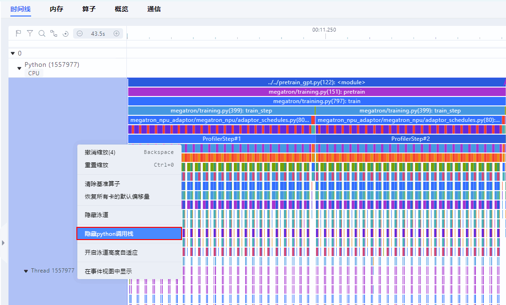

- **Show python call stack**: Right-click a unit where the Python call stack is hidden and choose **Show python call stack** from the shortcut menu to display the hidden Python call stack, as shown in [**Figure 4** Show python call stack](#Show-python-call-stack).

    **Figure 4** Show python call stack  
    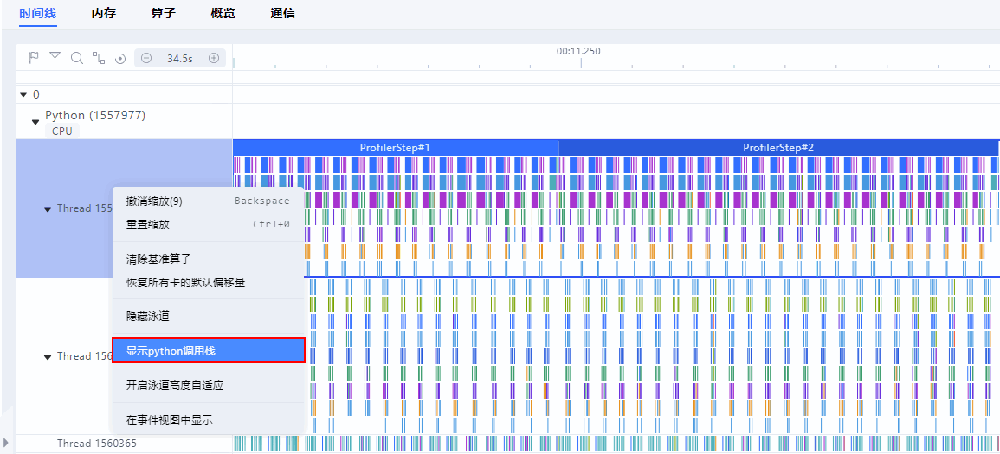

**Expanding All Units**

On the **Timeline** tab page, you can right-click to expand or collapse all units.

- Expand all units: Right-click the unit to be expanded and choose **Expand all** from the shortcut menu to expand all sub-units under the selected unit. As shown in [**Figure 5** Expand all](#Expand-all), all units of rank 0 are expanded.

    If the selected unit and sub-units are already expanded, the **Expand all** option is not displayed in the shortcut menu.

    **Figure 5** Expand all  
    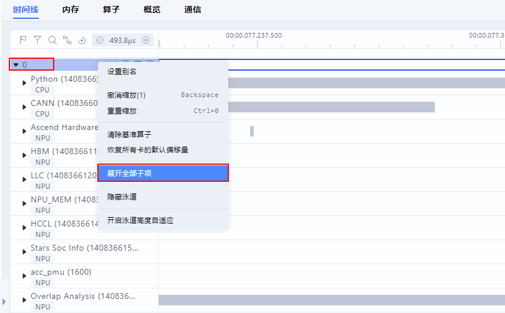

- Collapse all units: Right-click an expanded unit and choose **Collapse all** from the shortcut menu to collapse all sub-units under the selected unit. As shown in [**Figure 6** Collapse all](#Collapse-all), all units of rank 0 are collapsed.

    **Figure 6** Collapse all  
    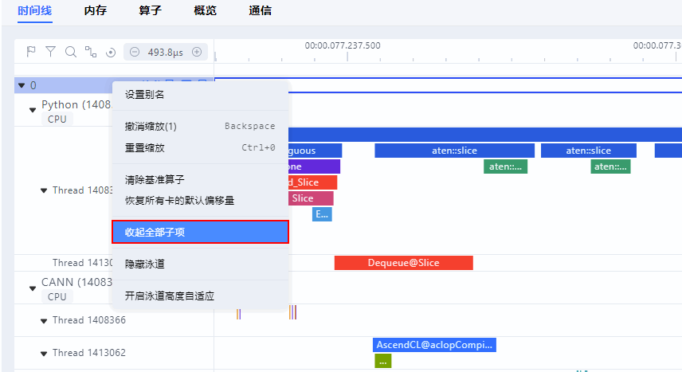

**Supporting Auto Unit Height**

On the **Timeline** tab page, you can right-click to enable or disable the auto unit height function.

- Enable auto unit height: Right-click the expanded unit and choose **Enable auto unit height** from the shortcut menu. The unit height is automatically adjusted to adapt to the current page, as shown in [**Figure 7** Enable auto unit height](#Enable-auto-unit-height).

    **Figure 7** Enable auto unit height  
    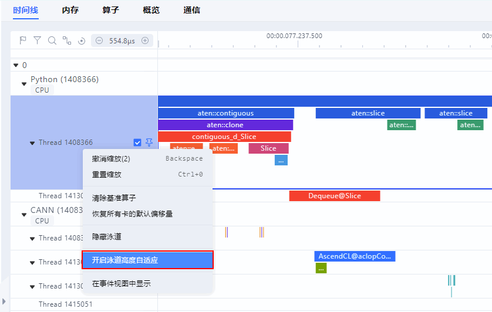

- Disable auto unit height: Right-click a unit where the auto unit height function is enabled and choose **Disable auto unit height** from the shortcut menu. The auto unit height function is disabled, and the unit height is restored to the initial height, as shown in [**Figure 8** Disable auto unit height](#disable-auto-unit-height).

    **Figure 8** Disable auto unit height  
    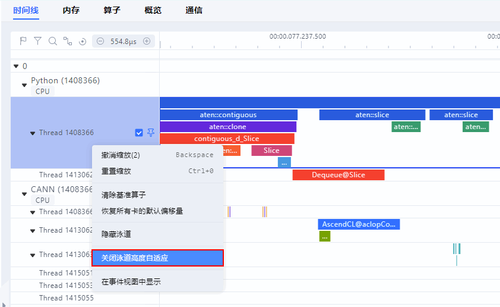

**Locking the Selected Area**

- Locking the selected area

    On the **Timeline** tab page, select some operators on a unit by drawing a rectangle, right-click the selected area, and choose **Lock selection area** from the shortcut menu. Operators in the selected area can be searched, and the flows of operators whose flow start or end point is in the selected area are displayed, as shown in [**Figure 9** Lock selection area](#Lock-selection-area). You can also select an area across multiple units at the single-rank level and lock the area.

    **Figure 9** Lock selection area 
    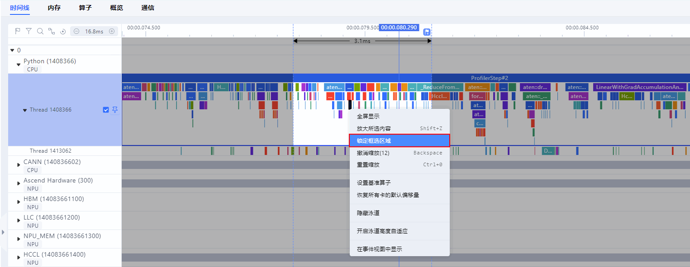

- Unlocking the selected area

    To cancel the selection, right-click the area and choose **Unlock selection area** from the shortcut menu, as shown in [**Figure 10** Unlock selection area](#Unlock-selection-area).

    **Figure 10** Unlock selection area 
    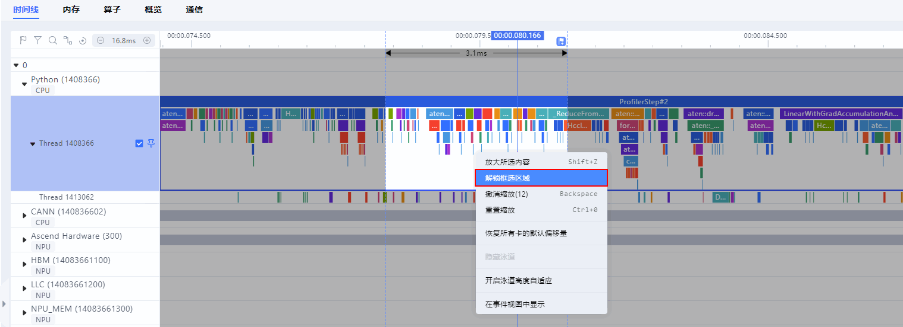

**Merging Stream Units**

On the **Timeline** page, you can merge multiple Stream units for data analysis.

- Merging units

    On the same rank, select multiple Stream units to be merged, right-click the selected units, and choose **Merge Units** from the shortcut menu. The selected units are merged into a new unit, as shown in [**Figure 11** Merge Units](#Merge-Units). After the Stream units are merged, the flow function, operator search function, and operator redirection function can be used properly.

    **Figure 11** Merge Units 
    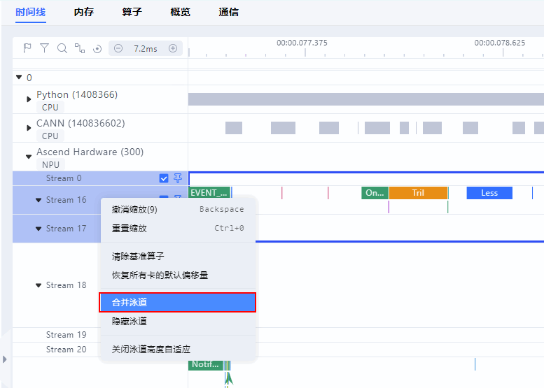

- Unmerging units

    To unmerge Stream units, right-click the merged Stream units and choose **Unmerge Units** from the shortcut menu, as shown in [**Figure 12** Unmerge Units](#Unmerge-Units).

    **Figure 12** Unmerge Units 
    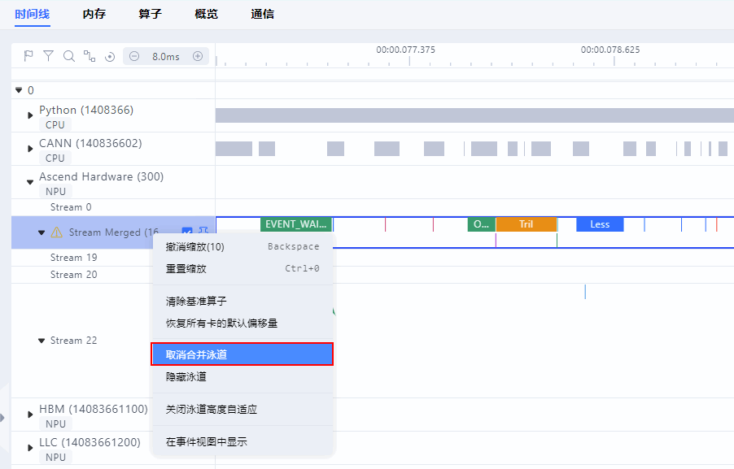

#### Displaying System Functions

**Statistics**

MindStudio Insight allows you to view operator statistics and details about a single operator.

- After you selecting some operators in a single level-3 unit or selecting some operators across multiple units at the single-rank level, the operator statistics are displayed on the **Slice List** tab page in the lower part, as shown in [**Figure 1** Slice List](#slice-list). For details about the fields, see [**Table 1** Fields on the Slice List tab page](#fields-on-the-slice-list-tab-page).

    You can move the cursor to the **Slice List** tab page and click  in the upper right corner of the table to copy the content displayed in the **Slice List** tab page and paste the content to an Excel file for analysis.

    > [!NOTE]NOTE
    > When operators are selected across multiple units under a single rank, the selected parts of the HBM, LLC, NPU\_MEM, Stars Soc Info, and acc\_pmu histogram units are not counted on the **Slice List** tab page.

    Click an operator in the**Slice List** column. All operators with the same name as the operator are displayed in the **More**list on the right. Click a row in the **More**list to locate the operator in the timeline view, and go to the **Slice Detail** page, where you can view the details about the operator.

    **Figure 1** Slice List

    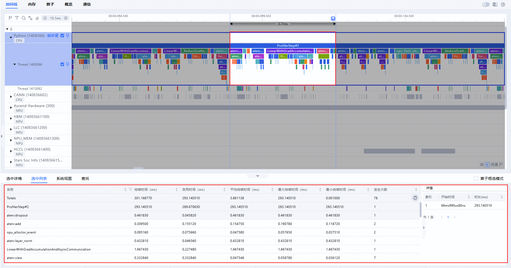

    **Table 1** Fields on the Slice List tab page

    |Field|Description|
    |--|--|
    |Name|Operator name.|
    |Wall Duration|Total duration of operator execution.|
    |Self Time|Operator execution time (excluding the time of the called sub-operator).|
    |Average Wall Duration|Average operator execution time.|
    |Max Wall Duration|Maximum operator execution duration.|
    |Min Wall Duration|Minimum operator execution duration.|
    |Occurrences|Number of operator calls.|
    |Index|Sequence number.|
    |Start Time|Timestamp in the graphical pane.|
    |Duration(ms)|Execution duration.|

    Select a level-3 unit. You can select operators by depth in the unit. The operators in the selected area are displayed on the **Slice List** tab page, as shown in [Figure 2 Operator Selection Mode](#Operator-Selection-Mode).

    1. Select and expand a level-3 unit, right-click any position, and select **Operator Selection Mode** to enable the function of selecting operators by depth.

        You can also select **Operator Selection Mode** on the right of the title bar in the data pane in the lower part of the **Timeline** tab page to enable the function of selecting operators by depth.

    2. In the expanded level-3 unit, select some operators in any position. The operator list in the selected area is displayed on the **Selected List** tab page.
    3. Right-click and deselect **Operator Selection Mode**, or deselect it on the right of the title bar in the data pane to disable the function of selecting operators by depth.

        **Figure 2** Operator Selection Mode 

        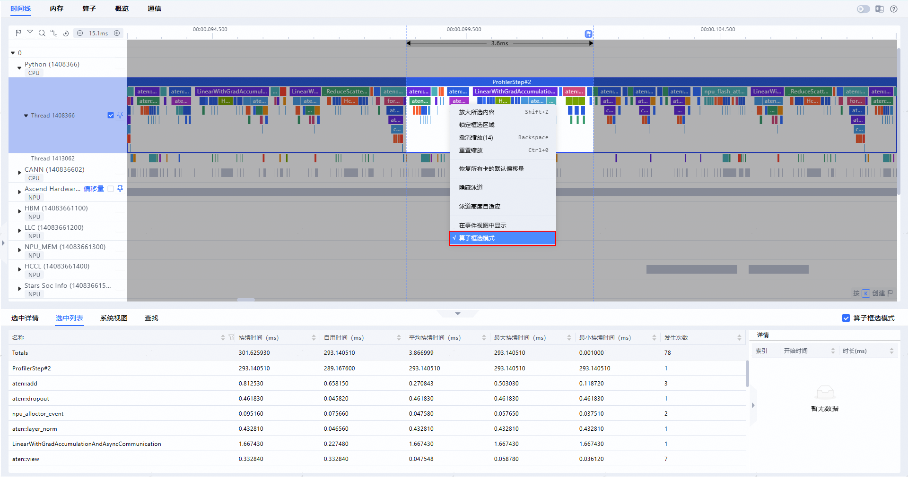

- If you select a single operator, you can view the operator details in the **Slice Detail** area, as shown in [Figure 3 Slice Detail](#Slice-Detail). [Table 2 Slice Detail fields](#Slice-Detail-fields) describes the fields.

    Select a single operator and press **M** to select the **Timeline** area to which the operator belongs. Press **M** again to cancel the selection.

    **Figure 3** Slice Detail 

    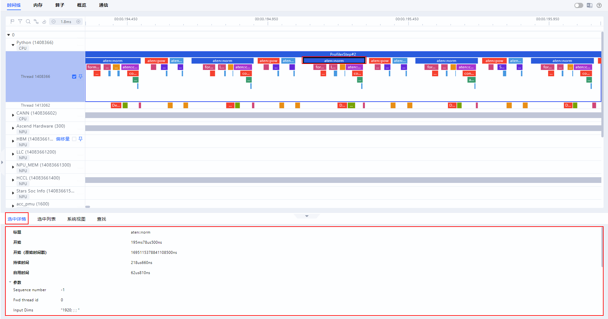

    **Table 2** Slice Detail fields 

    |Field|Description|
    |--|--|
    |Title|Name.|
    |Start|Start time.|
    |Start(Raw Timestamp)|Original start time of data collection.|
    |Wall Duration|Total duration.|
    |Self Time|Total time (excluding sub-classes).|
    |Input Shapes|Input shape of the operator. When **task-time** is set to **l0** during data collection, this field is not collected and is displayed as **N/A**. This field is available only for operators collected on the NPU accelerator core.|
    |Input Data Types|Input data type of the operator. When **task-time** is set to **l0** during data collection, this field is not collected and is displayed as **N/A**. This field is available only for operators collected on the NPU accelerator core.|
    |Input Formats|Input format of the operator. When **task-time** is set to **l0** during data collection, this field is not collected and is displayed as **N/A**. This field is available only for operators collected on the NPU accelerator core.|
    |Output Shapes|Output shape of the operator. When **task-time** is set to **l0** during data collection, this field is not collected and is displayed as **N/A**. This field is available only for operators collected on the NPU accelerator core.|
    |Output Data Types|Output data type of the operator. When **task-time** is set to **l0** during data collection, this field is not collected and is displayed as **N/A**. This field is available only for operators collected on the NPU accelerator core.|
    |Output Formats|Output format of the operator. When **task-time** is set to **l0** during data collection, this field is not collected and is displayed as **N/A**. This field is available only for operators collected on the NPU accelerator core.|
    |Attr Info|Operator attributes. When **task-time** is set to **l0** or **l1** during data collection, this field is not collected and is displayed as **N/A**. This field is available only when **aclnn** is enabled and **task-time** is set to **l2**.|
    |Args|Operator parameters.|

**System View**

The **System View** tab page contains the **Stats System View**, **Expert System View**, and **Events View**.

- **Stats System View** displays the comprehensive metric information, memory overview, API type information, and operator details. For details, see [Stats System View](#stats-system-view).
- **Expert System View** displays the abnormal metric information in the unit and expert suggestions on various APIs and operators. For details, see [Expert System View](#expert-system-view).
- **Events View** displays details about all operators in the selected unit. For details, see [Event View](#event-view).

The information on the **System View** tab page can display only the information about the selected area. The procedure is as follows:

1. On the **Timeline** tab page, use the left mouse button to select some areas of the unit.
2. Right-click the mouse and choose a menu as required for analysis, as shown in [**Table 3** Time range analysis](#time-range-analysis) and [**Figure 4** Time range analysis](#time-range-analysis-1).

    **Table 3** Time range analysis 

    |Menu|Description|
    |--|--|
    |Time Range Analysis|Navigates to the **System View** tab page. The **System View** tab page will display the selected time range along with the information within that period.|
    |Time Range Analysis and Zoom in|Zooms the selected area to fit the current screen, and navigates to the **System View** tab page.|
    |Apply Time Range Analysis|After you select an operator or right-click an operator in the selected area, the **Apply Time Range Analysis** menu is displayed. After you select this menu, the **System View** tab page is displayed, showing the time range of the operator and the information about the time range.|

    **Figure 4** Time range analysis

    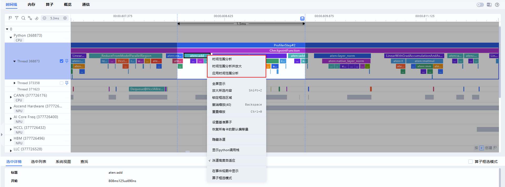

3. After this function is enabled, you can right-click a unit and choose **Remove Time Range Analysis** from the shortcut menu to disable this function.

**Stats System View**

On the **System View** tab page, when you select **Stats System View**, the tab page contains **Rank ID**, **Overall Metrics**, **Memcpy Overall**, summary statistics of five types of operators, and **Kernel Details** (details about the operators on the NPU). You can select the rank to be viewed from the **Rank ID** selection box. In the DB scenario, select **Host Name** and **Rank ID** in sequence.

- Overall Metrics

  The **Overall Metrics** tab page displays the overall information about all operators, as shown in [**Figure 5** Overall Metrics](#overall-metrics). For details about the fields, see [**Table 4** Overall Metrics fields](#overall-metrics-fields). When you select a sub-layer in the **Computing Time** column, you can click any operator in the **More** area to go to the specific location of the operator in the timeline view.

  **Figure 5** Overall Metrics

  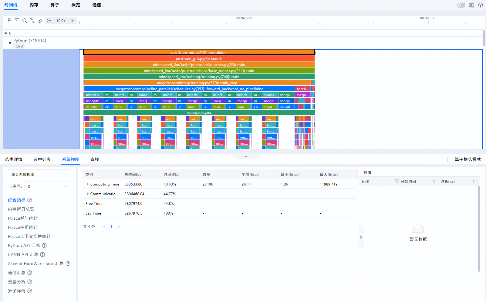

  **Table 4** Overall Metrics fields 

  |Field|Description|
  |--|--|
  |Category|Category.  Multi-level information can be displayed.  Parent layers: **Computing Time**, **Communication(Not Overlapped) Time**, **Free Time**, and **E2E Time**.  Child layers: **Computing Time** is further divided into the disassembling results of computing stream operators such as Flash Attention, Conv, Matmul, Cube, and Vector. **Forward** and **Backward** are used to distinguish the forward and backward propagation.  The child layers of **Communication(Not Overlapped) Time** are the grouping and disassembling results of each communication group. The waiting time and transmission time are the intersection results of the not-overlapped communication.|
  |Total Time(us)|Total time of the category.|
  |Time Ratio|Duration percentage of the category.|
  |Number|Number of operators of the category.|
  |Avg(us)|Average time of the category.|
  |Min(us)|Minimum time of the category.|
  |Max(us)|Maximum time of the category.|
  |Details|When you select a child layer from the **Computing Time** list, this area displays details about all operators at the selected layer. You can click any operator to go to the specific location of the operator in the timeline view.|

- Memcpy Overview

  > [!NOTE]NOTE
  > The memory copy data can be collected only when the `profiler_level` parameter is set to `Level2`. For details, see [Ascend PyToch profiling data collection](https://www.hiascend.com/document/detail/zh/mindstudio/830/T&ITools/Profiling/atlasprofiling_16_0121.html#ZH-CN_TOPIC_0000002504198570__zh-cn_topic_0000002534478481_section2015623185118).

  The **Memcpy Overall** tab page displays details about the memory copy operator, as shown in [**Figure 6** Memcpy Overview](#memcpy-overview). For details about the fields, see [**Table 5** Memcpy Overview fields](#memcpy-overview-fields). When you select a category, you can click any memory copy operator in the **More** area to go to the specific location of the operator in the timeline view.

  **Figure 6** Memcpy Overview

  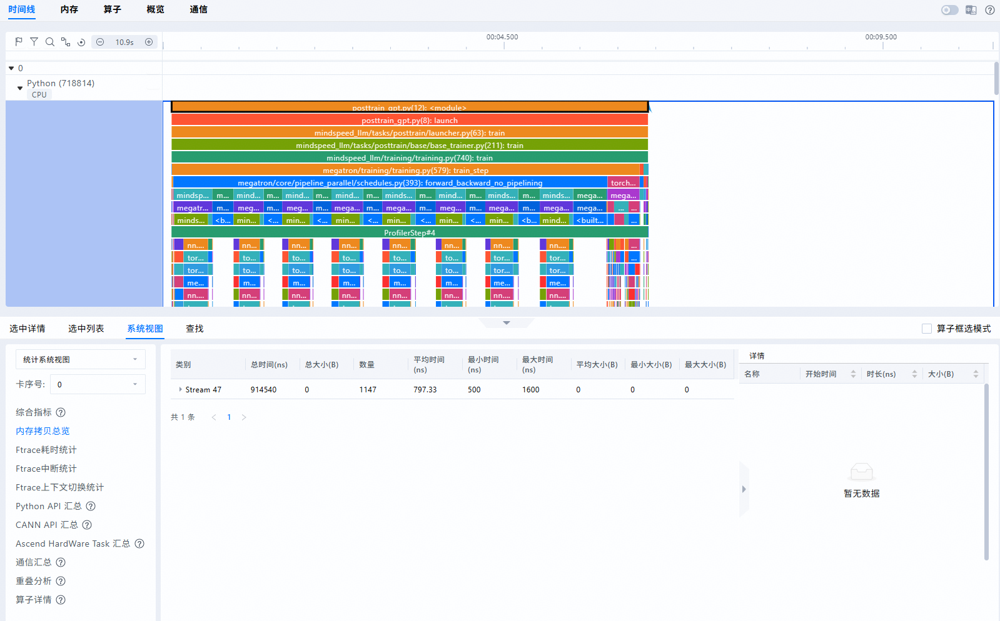

  **Table 5** Memcpy Overview Fields

  |Field|Description|
  |--|--|
  |Category|Category of memory copy statistics.|
  |Total Time(us)|Total time of the category.|
  |Total Size(B)|Total size of memory copy data of the category.|
  |Number|Number of memory copy operators of the category.|
  |Avg Time(us)|Average time of memory copy of the category.|
  |Min Time(us)|Minimum time of memory copy of the category.|
  |Max Time(us)|Maximum time of memory copy of the category.|
  |Avg Size(B)|Average data volume of memory copy of the category.|
  |Min Size(B)|Minimum data volume of memory copy of the category.|
  |Max Size(B)|Maximum data volume of memory copy of the category.|
  |Details|Details about all operators of the selected memory copy data. You can click any operator to go to the location of the operator in the timeline view.|

- Operator type

  The operator types include **Python API Summary**, **CANN API Summary**, **Ascend HardWare Task Summary**, **Communication Summary**, and **Overlap Analysis**, as shown in [**Figure 7** Operator summary tab page](#operator-summary-tab-page). For details about the fields, see [**Table 6** Stats System View fields](#stats-system-view-fields).

  **Figure 7** Operator summary tab page

  

  **Table 6** Stats System View fields 

  |Field|Description|
  |--|--|
  |Name|Name.|
  |Time(%)|Total time ratio = Total time of the category/Total time of all categories  When the statistical type is **Overlap Analysis**, **Time (%)** = **Total Time (us)**/**(Total Communication(Not Overlapped)** + **Total Computing** + **Total Free**)|
  |Total Time(us)|Total time of the category.|
  |Num Calls|Number of calls.|
  |Avg(us)|Average time of the category.|
  |Min(us)|Minimum time of the category.|
  |Max(us)|Maximum time of the category.|

- Kernel Details

  The **Kernel Details** area displays the details of the operator on the NPU, as shown in [Figure 8 Kernel Details](#kernel-details). For details about the fields, see [**Table 7** Kernel Details fields](#kernel-details-fields). Click **Click** in the **Click to Timeline** column to go to the specific location of the operator in the timeline view. Area 4 (data pane) displays the details of the operator. You can click  next to a field name in the operator details table to perform fuzzy search on the related field.

  **Figure 8** Kernel Details

  

  **Table 7** Kernel Details fields 

  |Field|Description|
  |--|--|
  |Name|Operator name.|
  |Type|Operator type.|
  |Accelerator Core|Computing core type.|
  |Start Time|Start time of the task.|
  |Duration(us)|Duration of the task.|
  |Wait Time(us)|Interval between the end time of the previous task and the start time of the current task, in microseconds.|
  |Task ID|Task ID.|
  |Block Num|Number of task running splits, which corresponds to the number of cores during task running. In MindStudio Insight 8.3.0 and earlier versions, this field is displayed as **Block Dim**.|
  |Input Shapes|Input shape of the operator.|
  |Input Data Types|Input data type of the operator.|
  |Input Formats|Input format of the operator.|
  |Output Shapes|Output shape of the operator.|
  |Output Data Types|Output data type of the operator.|
  |Output Formats|Output format of the operator.|
  |Click To Timeline|Click **Click**to go to the specific location of the operator in the timeline view. The details about the operator are displayed in area 4 (data pane).|

- Ftrace Time Consuming

  **Ftrace Time Consuming** obtains the operator data of all processes from the slice table and calculates the time consumed by the operator based on the **Runnable**, Running, and **Sleeping** fields, as shown in [**Figure 9** Ftrace Time Consuming](#ftrace-time-consuming).

  **Figure 9** Ftrace Time Consuming 
  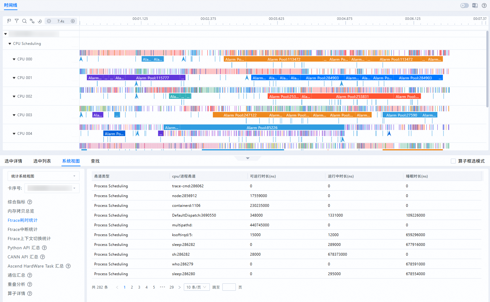

  **Table 8** Ftrace Time Consuming fields 

  |Field|Description|
  |--|--|
  |Process|Process type.|
  |Thread|CPU/Process name.|
  |Runnable(ns)|Total time consumed by a process in the runnable state.|
  |Running(ns)|Total time consumed by a process in the running state.|
  |Sleeping(ns)|Total time consumed by a process in the sleeping state.|

-  

  **Ftrace IRQ** obtains the IRQ and soft IRQ data of all CPUs from the slice table, determines the location of the process where the interrupt occurs based on the extended information about the interrupt, and collects statistics on the total time consumed and number of hard and soft interrupts of each CPU process, as shown in [**Figure 9** Ftrace IRQ fields](#ftrace-irq-fields).

  **Figure 10** Ftrace IRQ 
  

  **Table 9** Ftrace IRQ fields 

  |Field|Description|
  |--|--|
  |Process|Process type.|
  |Thread|CPU/Process name.|
  |Soft IRQ Count|Number of soft interrupts of a process.|
  |Soft IRQ Duration(ns)|Total execution duration of soft interrupts of a process.|
  |Hard IRQ Count|Number of hard interrupts of a process.|
  |Hard IRQ Duration(ns)|Total execution duration of hard interrupts of a process.|

- Ftrace Sched

  **Ftrace Sched** collects statistics on the number of context switch events in the CPU process in Slice, saves some content to the **ftrace_analysis** table in the database, and sends a message to notify the frontend that data analysis is complete, as shown in [**Figure 11** Ftrace Sched](#ftrace-sched).

  **Figure 11** Ftrace Sched 
  

  **Table 10** Ftrace Sched fields 

  |Field|Description|
  |--|--|
  |Process|Process type.|
  |Thread|CPU/Process name.|
  |Context Switch Count|Number of context switches.|

**Expert System View**

On the **System View** tab page, when you select **Expert System View**, the **Rank ID** selection box, **Expert Analysis**, and six advice system tabs are displayed. You can select the rank to be viewed from the **Rank ID** selection box. In the DB scenario, select **Host Name** and **Rank ID** in sequence.

The **Expert Analysis** tab page displays the abnormal metrics in the unit.

There are six types of expert advice systems: **Affinity API**, **Affinity Optimizer**, **AICPU Operators**, **ACLNN Operators**, **Operators Fusion**, and **Operators Dispatc**h, as shown in [**Figure 9** Expert System View](#expert-system-view). For details about the fields, see [**Table 8** Expert System View fields](#expert-system-view-fields).

If you select any advice system, the details about the advice system are displayed in the right pane. Click **Click** in the **Click to Timeline** column to go to the specific location of the operator in the timeline view. The **Slice Detail** tab page in area 4 (data pane) displays the details about the operator.

**Figure 9** Expert System View 
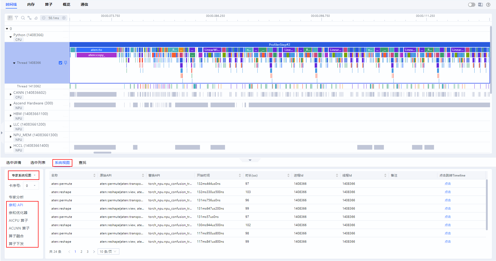

**Table 8** Expert System View fields 

|Field|Description|
|--|--|
|Name|Operator name. This parameter is unavailable when the advice system is **Affinity Optimizer**.|
|Origin API|Used to fuse the API sequence. This parameter is available only when the advice system is **Affinity API**.|
|Replacement API|Equivalent to **Affinity API**. This parameter is available only when the advice system is **Affinity API**.|
|Origin Optimizer|Used to fuse the optimizer. This parameter is available only when the advice system is **Affinity Optimizer**.|
|Replacement Optimizer|Optimizer that can be replaced. This parameter is available only when the advice system is **Affinity Optimizer**.|
|Origin Operators|Operators that can be fused. This parameter is available only when the advice system is **Operators Fusion**.|
|Fused Operator|An operator that has been fused at the CANN layer. This parameter is available only when the advice system is **Operators Fusion**.|
|Start Time|Start time of the task.|
|Duration(us)|Duration of the task.|
|Process Id|Process ID.|
|Thread Id|Thread ID.|
|Notes|Prompt information. This parameter is unavailable when the advice system is **Affinity Optimizer**.|
|Click To Timeline|Click **Click** to go to the specific location of the operator in the timeline view. The details about the operator are displayed in area 4 (data pane).|

**Events View**

On the **Timeline** tab page, operator information can be displayed in the event view.

On the **Timeline** tab page, right-click the required unit and choose **Show in Events View** from the shortcut menu. The **System View** tab page is displayed. By default, **Events View** is selected in the left pane. The details about all operators of the unit are displayed in the right pane, as shown in [**Figure 10** Events View](#events-view). For details about the fields, see [**Table 9** Events View fields](#events-view-fields).

**Figure 10** Events View 
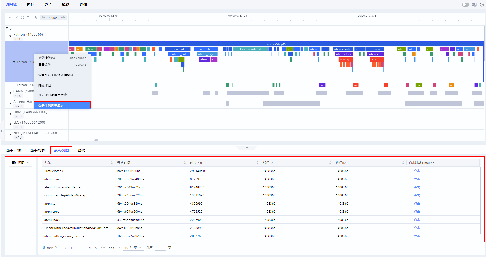

**Table 9** Events View fields 

|Field|Description|
|--|--|
|Name|Operator name.|
|Start|Operator execution start time.|
|Duration(ns)|Total time of running the operator.|
|TID|Thread ID. This field is available when you select the **Python** and **CANN** units and their sub-units.|
|PID|Process ID. This field is available when you select the **Python** and **CANN** units and their sub-units.|
|Stream Name|Name of the stream task flow in the **Ascend Hardware** unit. This field is available only when you select the **Ascend Hardware** unit and its sub-units.|
|Group Name|Name of the communication operator cluster. This field is available only when you select the **Communication** unit and its **Group** sub-units.|
|Analysis Type|Analysis operator type. This field is available only when you select the **Overlap Analysis** unit or its sub-units.|
|Rank ID|Rank ID of the operator. This field is available when you select the **Ascend Hardware**, **Communication**, and **Overlap Analysis** units and their sub-units.|
|Click To Timeline|Click **Click** to go to the specific position of the operator in the timeline view. The operator details are displayed on the **Slice Detail** tab page.|

> [!NOTE]NOTE
>
> - This function is not supported at the rank level.
> - This function is not supported in the **HBM**, **LLC**, **NPU\_MEM**, **Stars Soc Info**, and **acc\_pmu** histogram units.
> - This function is not supported in the **Plane** sub-unit of the **Communication** unit.

## Memory

### Function Description

The **Memory** tab page displays the memory information collected during the collection process. You can view the overall memory trend in the memory curve. You can also select and zoom in on the peak area in the curve and combine the operator memory information to accurately locate the operator with high memory consumption.

**Precautions**

For more than 3 million data records, the Largest Triangle Three Buckets (LTTB) algorithm is used to perform downsampling to improve the memory curve rendering performance. Therefore, when the data volume is large, only the sampling result is displayed. When the chart is zoomed in to a small range, all data points can be displayed.

### GUI Description

**GUI Display (Dynamic Curve Scenario)**

The **Memory** tab page consists of the parameter configuration area (area 1), operator memory curve (area 2), and memory allocation/release details table (area 3), as shown in [**Figure 1** Memory dynamic curve](#memory-dynamic-curve).

**Figure 1** Memory dynamic curve 

- Area 1: parameter configuration area.
  - **Rank ID**: You can switch the options to view the memory information of different cards. The entire page is refreshed in real time after the switch.
  - **Group By**: You can switch different dimensions to display memory information. The dimensions include **Overall**, **Stream**, and **Component**.
  - **Host Name**: This parameter is available only when the imported DB file contains the **HOST\_INFO** table.

- Area 2: operator memory curve. The **Region Marker** box above the curve displays the region marker names in the timeline. These marks are displayed in the corresponding regions on the memory curve based on the configured colors. If you delete a marker from the region mark box, the marker is removed from the memory curve, but is not deleted from the timeline.
  - The **Operator Allocated** curve indicates the change trend of the allocated memory collected when the operator allocates or releases memory, that is, the total allocated memory of all operators. The collected memory data is allocated by PyTorch and Graph Engine (GE).
  - The **Operator Reserved** curve indicates the change trend of the reserved memory collected when the operator allocates or releases memory, that is, the total reserved memory of all operators. The collected memory data is allocated by PyTorch and GE.
  - The **Operator Activated** curve indicates the total memory held, including the memory that is reused by other streams but is not released. The collected memory data is allocated by streams in PyTorch. If no stream information is available, no **Operator Activated** curve is displayed.
  - The **APP Reserved** curve indicates the memory trend reserved by the entire process.
  - When **Group By** is set to **Component**, the curve displays the memory usage of PyTorch operators and GE.

- Area 3: memory allocation/release details table, which displays the memory information of each operator. The table supports searching, sorting, pagination, and redirection. You can click the table header of each column to display data in ascending, descending, or default order. You can click  in the upper right corner of the table to copy the content displayed in the table and paste the content to an Excel file for analysis.

**GUI Display (Static Curve Scenario)**

The **Memory** tab page consists of the parameter configuration area (area 1), operator memory curve (area 2), and memory allocation/release details table (area 3), as shown in [**Figure 2** Memory static curve](#memory-static-curve).

**Figure 2** Memory static curve 
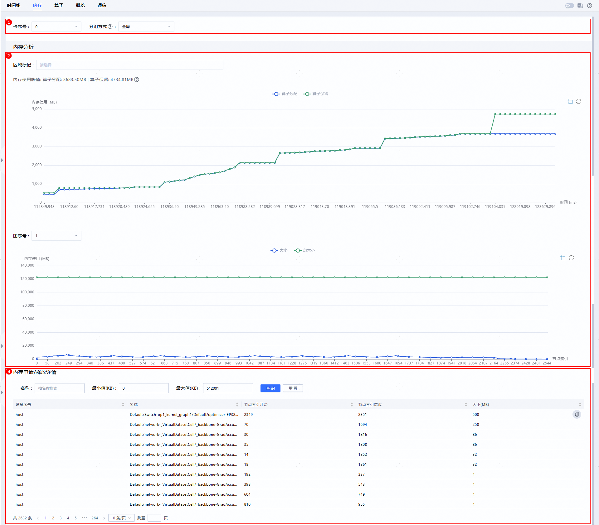

- Area 1: parameter configuration area. You can set **Rank ID** and **Group By** to view the memory information of different cards. After the setting, the entire page is refreshed immediately.
- Area 2: operator memory curve, which consists of a dynamic curve and a static curve. The static curve exists only in the MindSpore data scenario.
    1. Dynamic curve: The **Region Marker** box above the curve displays the region marker names in the timeline. These marks are displayed in the corresponding regions on the memory curve based on the configured colors. If you delete a marker from the region mark box, the marker is removed from the memory curve, but is not deleted from the timeline.
        - The **Operator Allocated** curve indicates the change trend of the allocated memory collected when the operator allocates or releases memory, that is, the total allocated memory of all operators. The collected memory data is allocated by PyTorch and Graph Engine (GE).
        - The **Operator Reserved** curve indicates the change trend of the reserved memory collected when the operator allocates or releases memory, that is, the total reserved memory of all operators. The collected memory data is allocated by PyTorch and GE.
        - The **Operator Activated** curve indicates the total memory held, including the memory that is reused by other streams but is not released. The collected memory data is allocated by streams in PyTorch.
        - The **APP Reserved** curve indicates the memory trend reserved by the entire process.

    2. Static curve:

        This chart exists only in the MindSpore data scenario. You can switch **Graph ID** to view the memory allocation of the selected rank.

        - **Size**: size of the memory dynamically allocated by index.
        - **Total Size**: maximum memory size that is automatically preset.

- Area 3: memory allocation/release details table, which displays the memory information of each operator in the static curve. The table supports searching, sorting, pagination, and redirection. You can click the table header of each column to display data in ascending, descending, or default order. You can click  in the upper right corner of the table to copy the content displayed in the table and paste the content to an Excel file for analysis.

### Usage Description

**Switching Ranks**

MindStudio Insight allows you to switch **Rank ID** to view the memory information of different ranks. Click the **Rank ID** text box in the upper part of the page and select the rank number to be viewed from the drop-down list. After the switching, the operator memory curve and memory allocation/release details table of the corresponding rank are displayed, as shown in [**Figure 1** Switching ranks](#switching-ranks)

**Figure 1** Switching ranks 
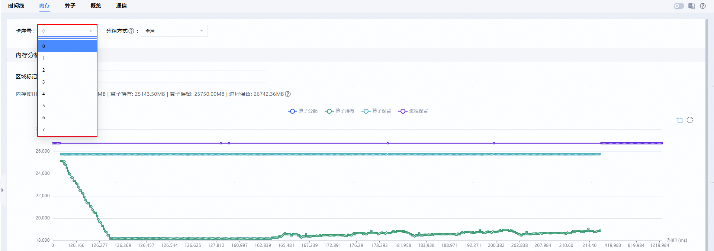

Switching the Display Dimension

MindStudio Insight allows you to switch **Group By** to view the operator memory curve in different dimensions. Click the **Group By** text box in the upper part of the page and select the dimension to be viewed from the drop-down list, as shown in [**Figure 2** Switching the dimension](#switching-the-dimension). This function is supported only in the dynamic curve scenario.

- Global: collects statistics on the memory size of operators in the reserved, allocated, and held states, and the total reserved memory size of PyTorch.
- Stream: collects statistics on the operator memory size in the reserved, allocated, and held states by stream.
- Component: collects statistics on the memory size of PyTorch operators in the reserved, allocated, and held states, and the memory size of GE in the reserved, allocated, and held states.

**Figure 2** Switching the dimension
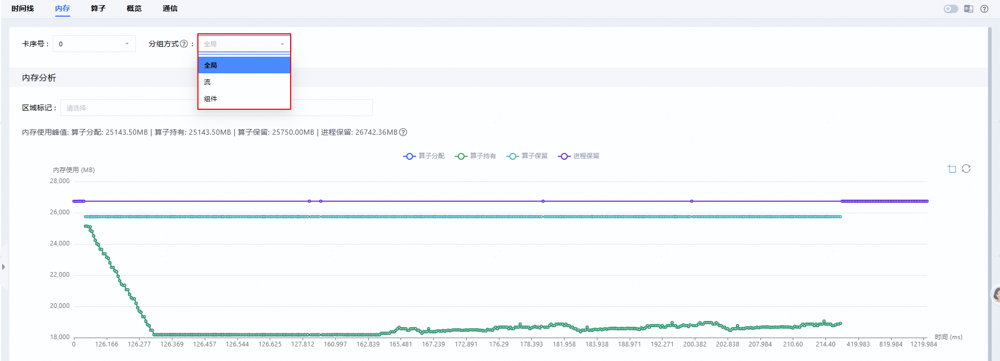

**Zooming In and Out on a Memory Curve**

MindStudio Insight allows you to left-click to drag select and zoom in on the selected part of the curve and right-click to zoom out on the curve. To improve the display performance, most points are hidden in the curve when the data volume is large. You can select a fine area to display all points or right-click the selected part to restore the original display effect.

In the curve, click and drag the mouse to the end point to be zoomed in and release the mouse. The selected region is zoomed in. If some points are still hidden, repeat the zoom-in operation to display the hidden points. [**Figure 3** Selected zoom-in region](#selected-zoom-in-region) shows the selected zoom-in region.

**Figure 3** Selected zoom-in region
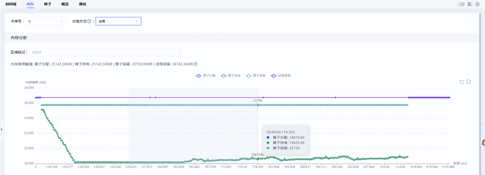

> [!NOTE]NOTE
>
> - Click  in the upper right corner of the curve. If the button is dimmed, the curve is locked and cannot be zoomed in by clicking and dragging the mouse. You can click the button again or right-click the curve to restore the chart. The zoom-in function is enabled by default.
> - Click  in the upper right corner of the curve. The curve is restored to the initial state.

**Searching for Operators**

In the memory allocation/release details table, operators can be searched in dynamic and static curve scenarios. The procedure is as follows:

> [!NOTE]NOTE
>
> - In the MindSpore static curve scenario, the memory allocation/release details table of operators in the static curve is displayed. In other scenarios, the memory allocation/release details table of operators in the dynamic curve is displayed.
> - When **Group By** is set to **Component**, the operator search function is not supported.

- Dynamic Curve

    In the table header, click  next to a parameter name to search for related information. You can enter an operator name in the **Name** column for fuzzy search. Other parameters such as **Size** and **Duration** support range search, as shown in [**Figure 4** Searching for operators](#searching-for-operators-1). For details about the parameters, see [**Table 1** Dynamic curve fields](#dynamic-curve-fields)

    If you select **Only show allocated or released within the selected interval** above the table, the operators are those allocated or released within the selected interval in the curve.

    **Figure 4** Searching for operators
    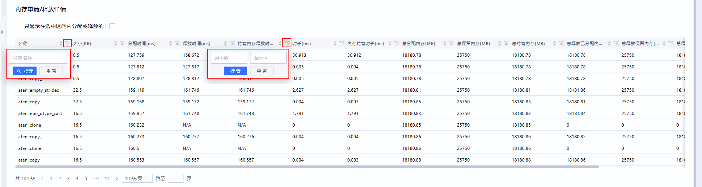

    **Table 1** Dynamic curve fields

  |Field|Description|
  |--|--|
  |Name|Operator name.|
  |Size(KB)|Size of the memory to be allocated, in KB.|
  |Allocation Time(ms)|Tensor memory allocation time, which is calculated from the time when the collection starts, in milliseconds.|
  |Release Time(ms)|Tensor memory release time, which is calculated from the time when the collection starts, in milliseconds.|
  |Duration(ms)|Memory holding time.|
  |Active Release Time(ms)|Time when the memory is actually returned to the memory pool.|
  |Active Duration(ms)|Actual memory usage duration.|
  |Allocation Total Allocated(MB)|Total memory allocated by PyTorch and GE during operator memory allocation.|
  |Allocation Total Reserved(MB)|Total memory reserved by PyTorch and GE during operator memory allocation.|
  |Allocation Total Active(MB)|Total memory allocated to the current stream during operator memory allocation (including the memory that is reused by other streams but is not released).|
  |Release Total Allocated(MB)|Size of the memory used by PyTorch and GE in the memory pool after the operator memory is released.|
  |Release Total Reserved(MB)|Size of the memory occupied by PyTorch and GE in the memory pool after the operator memory is released.|
  |Release Total Active(MB)|Total memory reused by other streams in the PyTorch and GE memory after the operator memory is released.|
  |Stream|Memory address of an AscendCL stream, which is used to mark different AscendCL streams.|
  |Operation|Click **Show in Timeline** to view the corresponding operator on the timeline page.|

- Static Curve

    In the filter bar, enter the operator name and the range of the memory occupied by the operator (minimum and maximum values), and click **Query**. You can also click **Reset** to reset the search criteria. By default, the minimum and maximum memory sizes occupied by the operators in the selected rank are displayed in the filter bar. You can adjust them according to the actual situation. As shown in [**Figure 5** Searching for operators (static curve)](#searching-for-operators-static-curve), search for operators whose names contain data and whose memory size ranges from 0 KB to 35 KB. [Table 2 Static curve fields](#static-curve-fields) describes the fields in the table.

    **Figure 5** Searching for operators (static curve)
    ")

    **Table 2** Static curve fields 

  |Field|Description|
  |--|--|
  |Device ID|Sequence number of the device that allocates memory. The default value is **host**.|
  |Name|Operator name.|
  |Node Index Start|Search start node.|
  |Node Index End|Search end node.  The value **4294967295** is the final end node of the index. In the static curve, the value of this node is the actual end node plus 1. For example, if the actual end node is 32, the index of the node in the horizontal coordinate in the static curve is 33, and the end value of the node index in the table is **4294967295**.|
  |Size(MB)|Size of the memory to be allocated, in MB.|
  |Operation|Click **Show in Timeline** to view the corresponding operator on the timeline page.|

- When **Group By** is set to **Component**, the operator search function is not supported. [**Figure 6** Component-level memory allocation/release details](#component-level-memory-application-release-details) shows the page. [**Table 3** Field description](#field-description) describes the fields.

    **Figure 6** Component-level memory application/release details 
    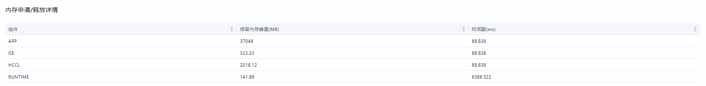

    **Table 3** Field description 

  |Field|Description|
  |--|--|
  |Component|Component name.|
  |Peak Memory Reserved(MB)|Peak size of the memory occupied by a component, in MB. Only components whose peak memory usage is greater than or equal to 100 MB are displayed.|
  |Timestamp(ms)|Time when the memory usage of a component reaches the peak value, in milliseconds.|

**Highlighting**

When **Group By** is set to **Overall** and you move the pointer to a data record in the table (the curve is zoomed in to display all operators in the table), if the point (including the allocation time and release time) corresponding to the data record is displayed above the curve, the corresponding point on the curve is highlighted. This helps you quickly locate the operator.

Move the pointer to the red box in the table. The operator position is highlighted in the curve, as shown in [**Figure 7** Highlighting an operator](#highlighting-an-operator).

**Figure 7** Highlighting an operator
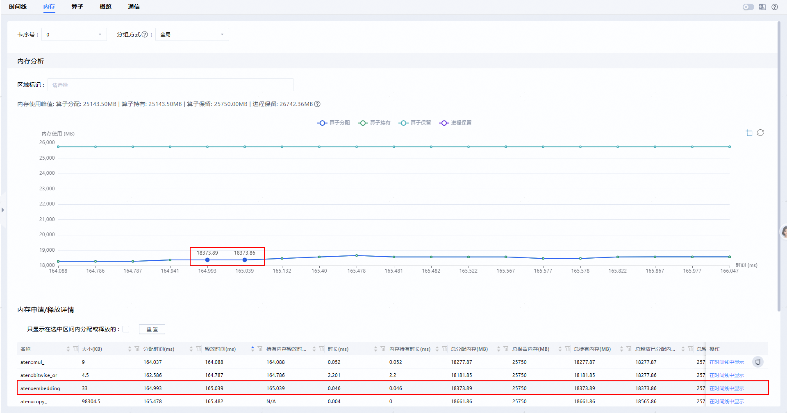

**Comparing the Performance of Ranks**

MindStudio Insight allows you to compare the memory performance of ranks. For details about how to set the comparison data, see [Data Comparison](./basic_operations.md#managing-data).

In inter-rank performance comparison mode, the value of **Rank ID** is fixed and cannot be switched. **Group By** can be set only to **Global** or **Component**. The operator memory curve displays the memory changes of two ranks, so that you can view the memory comparison trend between the two ranks. The memory allocation/release details table displays the data difference between two ranks. When **Group By** is set to **Global**, you can search for operators by name and memory size. The minimum memory size can be a negative value, and the search criteria are limited to the comparison result, as shown in [**Figure 8** Performance comparison](#performance-comparison).

You can click **See more** in the **Details** column of the memory allocation/release details table to view the baseline data and comparison data details.

**Figure 8** Performance comparison
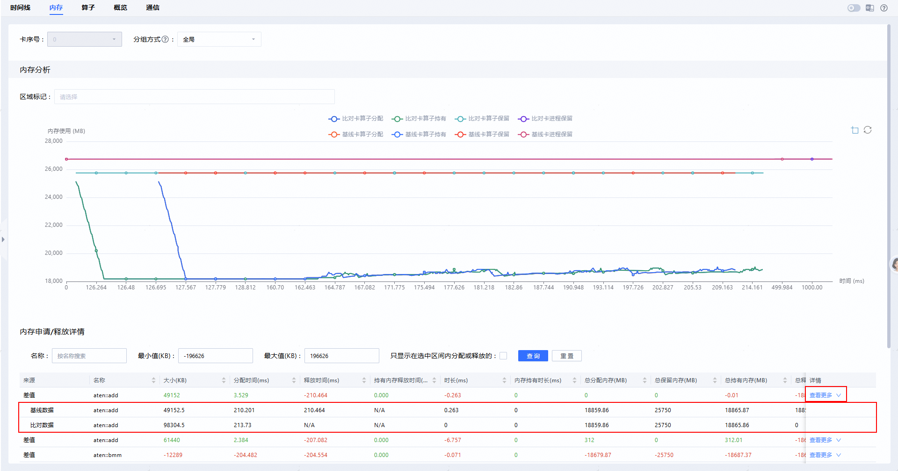

## Operator

### Function Description

The **Operator** view analyzes the duration of computing and communication operators, helping developers quickly locate performance bottlenecks.

### GUI Description

The **Operator** tab page consists of the parameter configuration area (area 1), duration percentage pie chart (area 2), and duration statistics and details table (area 3), as shown in [**Figure 1** Operator](#operator).

**Figure 1** Operator
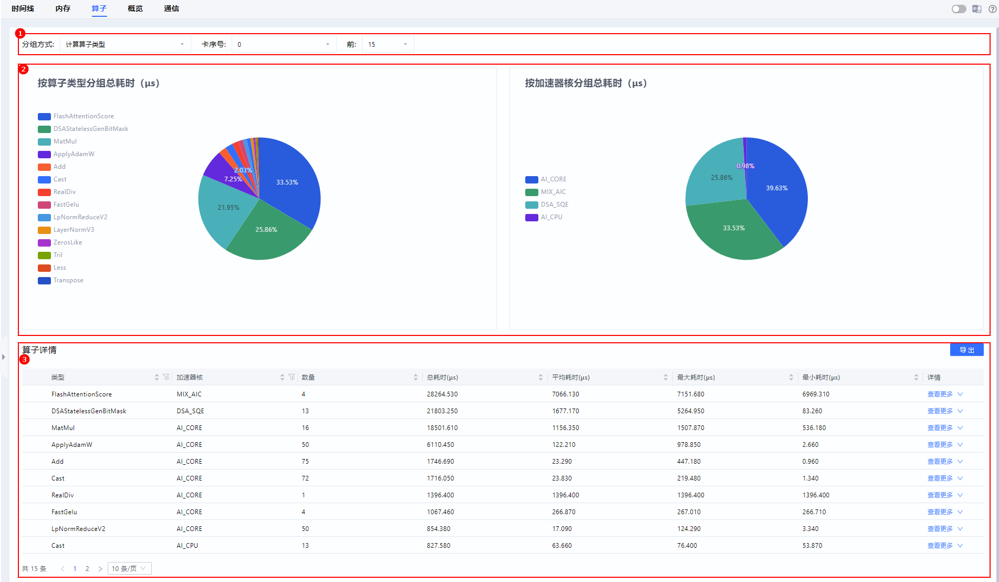

- Area 1: parameter configuration area. [**Table 1** Parameter configuration](#parameter-configuration) describes the parameters.

    **Table 1** Parameter configuration 

  |Parameter|Description|
  |--|--|
  |Group by|- **Computing Operator**: displays details about all computing operators, helping developers locate time-consuming computing operators.  - **Computing Operator Type**: collects statistics on computing operators of the same type, calculates the total time, maximum time, and average time, and allows you to view details about computing operators of a specific type, helping developers quickly identify performance bottlenecks of computing operators of a specific type, such as AI CPU operators.  - **Computing Operator Name and Input Shape**: collects statistics on operators of the same type and input shape, calculates the total time, maximum time, and average time, and allows you to view details about operators of a specific type, helping developers quickly identify performance bottlenecks of operators of a specific type with a specific input.  - **Communication Operator**: displays details about all communication operators, helping developers locate time-consuming communication operators.  - **Communication Operator Type**: collects statistics on communication operators of the same type, calculates the total time, maximum time, and average time, and allows you to view details about communication operators of a specific type, helping developers quickly identify performance bottlenecks of communication operators of a specific type.|
  |Rank ID|Operator profile data can be displayed by a single rank.|
  |Top|You can set **Top** to display the top *N* records with the longest total duration. The default value is **15**. If you select **Custom**, you can customize the number of records.|
  |Host Name|This parameter is available only when the imported DB file contains the **HOST_INFO** table.|

- Area 2: duration percentage pie chart.
  - When **Group By** is set to **Computing Operator**, **Computing Operator Type**, or **Computing Operator Name and Input Shape**, two pie charts are displayed. The left pie chart shows the duration percentage of different computing operator types. This view is affected by the **Top** configuration in area 1 and displays only the percentage of top *N* or all computing operators or computing operator types. The right pie chart shows the duration percentage of top *N* or all computing operators or computing operator types by accelerator core, such as AI Core and AI CPU.
  - If **Group By** is set to **Communication Operator or Communication Operator Type**, a pie chart is displayed, showing the time consumption of different communication operator types. This view is affected by the **Top** configuration in area 1 and displays only the time consumption of top *N* or all communication operators or communication operator types.

- Area 3: duration statistics and details data table, which displays operator statistics or details. You can click **See more** to view details. You can also click **Export** in the upper right corner of the table to export all data in the operator details table to a .csv file.

### Usage Description

**Computing Operator**

This page is displayed when **Group By** is set to **Computing Operator**. You can view details about a single computing operator to quickly locate performance problems, as shown in [Figure 1 Computing Operator](#computing-operator). [**Table 1** Computing Operator fields](#computing-operator-fields) describes the fields in **Operator Details**. You can click  next to a field to perform fuzzy search on the field.

**Figure 1** Computing Operator 
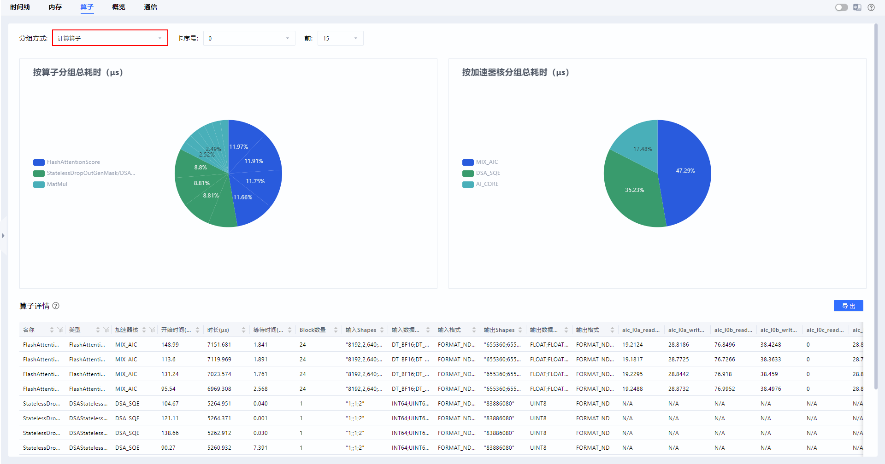

**Table 1** Computing Operator fields 

|Field|Description|
|--|--|
|Name|Operator name.|
|Type|Operator type.|
|Accelerator Core|AI accelerator core type, including AI Core and AI CPU.|
|Start Time(ms)|Operator execution start time.|
|Duration(μs)|Execution duration of the current operator.|
|Wait Time(μs)|Waiting time for executing the operator.|
|Block Num|Number of running splits, which corresponds to the number of cores during task running. In MindStudio Insight 8.3.0 and earlier versions, this field is displayed as **Block Dim**.|
|Input Shapes|Operator input shape.|
|Input Data Types|Input data type of the operator.|
|Input Formats|Input format of the operator.|
|Output Shapes|Operator output shape.|
|Output Data Types|Output data type of the operator.|
|Output Formats|Output format of the operator.|

> [!NOTE]NOTE  
> If the performance file imported by MindStudio Insight contains the collected register values, parameters such as **aicore_time** and **aic_total_cycles** are displayed in the computing operator details. For details about the parameters, see "Profile Data File Reference" \> "[op_summary (Operator Details)](https://www.hiascend.com/document/detail/en/mindstudio/830/T&ITools/Profiling/atlasprofiling_16_0151.html)" in the Profiling Tool Guide.

**Computing Operator Type**

This page is displayed when **Group By** is set to **Computing Operator Type**. You can view the duration percentage and detailed data of different computing operator types to quickly locate performance problems, as shown in [**Figure 2** Computing Operator Type](#computing-operator-type). [Table 2 Computing Operator Type fields](#computing-operator-type-fields) describes the fields in the **Operator Details** area. You can click  next to the field to perform fuzzy search on the related field.

**Figure 2** Computing Operator Type
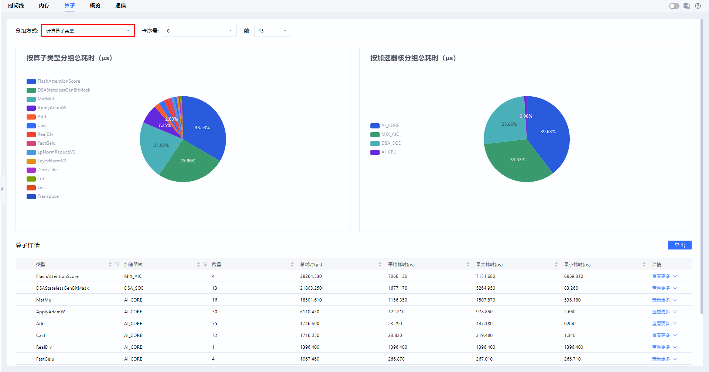

**Table 2** Computing Operator Type fields 

|Field|Description |
|--|--|
|Type|Operator type.|
|Accelerator Core|AI accelerator core type, including AI Core and AI CPU.|
|Count|Number of operator executions.|
|Total Time(μs)|Total operator execution time.|
|Avg Time(μs)|Average operator execution time.|
|Max Time(μs)|Maximum operator execution time.|
|Min Time(μs)|Minimum operator execution time.|
|Details|Click **See more** in the **Details** column to display details about a single computing operator. For details, see [**Table 1** Computing Operator fields](#computing-operator-fields).|

**Computing Operator Name and Input Shape**

This page is displayed when **Group By** is set to **Computing Operator Name and Input Shape**. You can view the time consumption proportion and detailed data of computing operators of different types under a specific input shape to quickly find operator performance problems, as shown in [**Figure 3** Computing Operator Name and Input Shape](#computing-operator-name-and-input-shape). For details about the fields in **Operator Details**, see [**Table 3** Computing Operator Name and Input Shape fields](#computing-operator-name-and-input-shape-fields). You can click  next to a field to perform fuzzy search on the field.

**Figure 3** Computing Operator Name and Input Shape
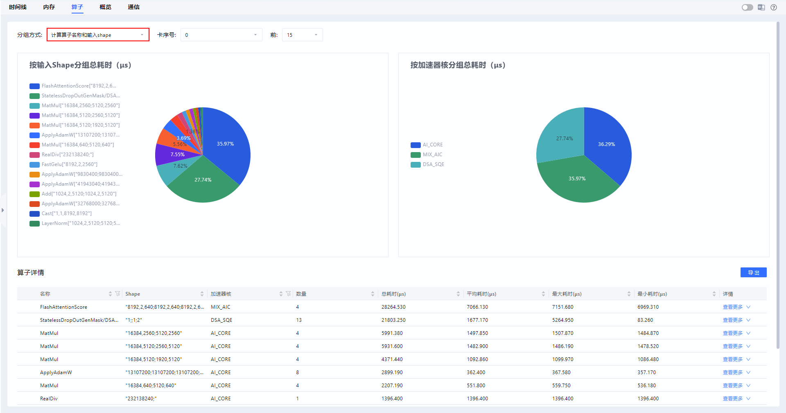

**Table 3** Computing Operator Name and Input Shape fields

|Field|Description|
|--|--|
|Name|Operator name.|
|Shape|Shape|Operator input shape.|
|Accelerator Core|AI accelerator core type, including AI Core and AI CPU.|
|Count|Number of operator executions.|
|Total Time(μs)|Total operator execution time.|
|Avg Time(μs)|Average operator execution time.|
|Max Time(μs)|Maximum operator execution time.|
|Min Time(μs)|Minimum operator execution time.|
|Details|Click **See more** in the **Details** column to display details about a single operator. For details, see [**Table 1** Computing Operator fields](#computing-operator-fields).|

**Communication Operator**

This page is displayed when **Group By** is set to **Communication Operator**. You can view details about a single communication operator to quickly locate performance problems, as shown in [**Figure 4** Communication Operator](#communication-operator). [**Table 4** Communication Operator fields](#communication-operator-fields) describes the fields in **Operator Details**. You can click  next to a field to perform fuzzy search on the field.

**Figure 4** Communication Operator 
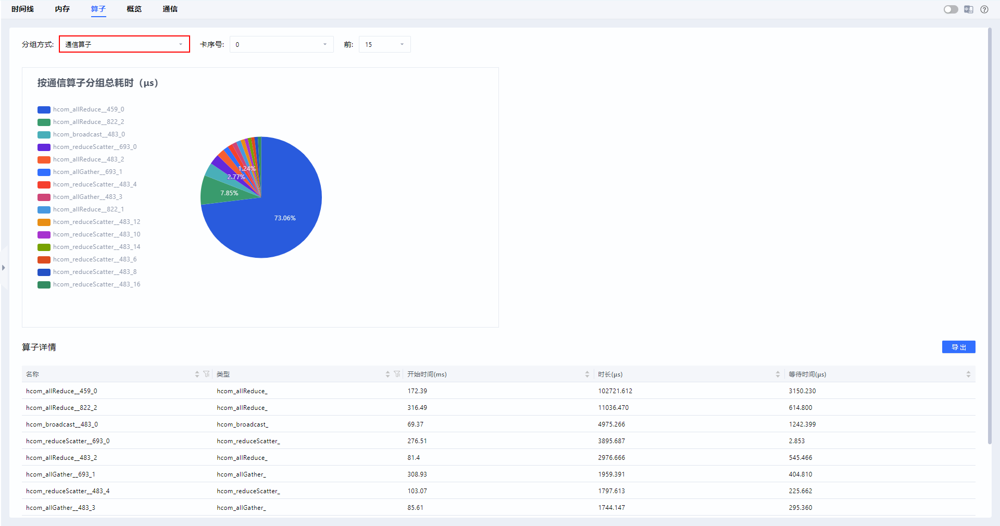

**Table 4** Communication Operator fields 

|Field|Description|
|--|--|
|Name|Communication operator name.|
|Type|Communication operator type.|
|Start Time(ms)|Start time of communication operator execution.|
|Duration(μs)|Execution duration of the current communication operator.|
|Wait Time(μs)|Waiting time for executing the communication operator.|

**Communication Operator Type**

This page is displayed when **Group By** is set to **Communication Operator Type**. You can view the duration percentage and detailed data of different communication operator types to quickly locate performance problems, as shown in [**Figure 5** Communication Operator Type](#communication-operator-type). [**Table 5** Communication Operator Type fields](#communication-operator-type-fields) describes the fields in the **Operator Details** area. You can click  next to the field to perform fuzzy search on the related field.

**Figure 5** Communication Operator Type 
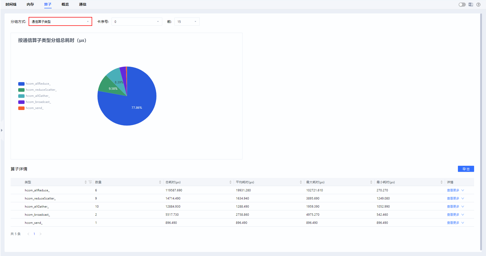

**Table 5** Communication Operator Type fields 

|Field|Description |
|--|--|
|Type|Communication operator type.|
|Count|Number of communication operator executions.|
|Total Time(μs)|Total execution time of the communication operator.|
|Avg Time(μs)|Average execution time of the communication operator.|
|Max Time(μs)|Maximum execution time of the communication operator.|
|Min Time(μs)|Minimum execution time of the communication operator.|
|Details|Click **See more** in the **Details** column to display details about a single communication operator. For details, see [**Table 4** Communication Operator fields](#communication-operator-fields).|

**Comparing Data Between Two Ranks**

MindStudio Insight allows developers to compare the operator performance between two ranks to intuitively and clearly view the differences between them. For details about how to set baseline data and comparison data, see [Data Comparison](./basic_operations.md#managing-data).

In inter-rank comparison mode, the **Operator** page does not display the duration percentage pie chart. Only the operator details table is displayed. The value of **Rank ID** is fixed and cannot be switched. **Group By** can be selected as required. Top *N* data records can be displayed.

The operator details table displays the difference between two ranks. You can click **See more** in the **Details** column to view the baseline data and comparison data details, as shown in [**Figure 6** Operator comparison](#operator-comparison). For details about the fields, see the field description corresponding to each value of **Group By**. The following figure shows the data comparison details when **Group By** is set to **Computing Operator Type**.

**Figure 6** Operator comparison
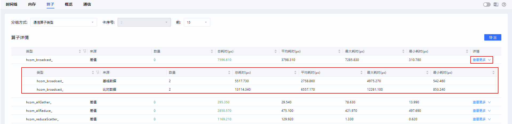

## Summary

### Function Description

The **Summary** tab page provides the communication group identification, division, and time breakdown and analysis functions. Communication groups can be automatically identified or configured by users. Users can compare the duration of stages, computation, and communication in a communication group to analyze whether the division in the same communication group is even and whether there are slow cards and slow links, helping developers quickly identify problems.

**Precautions**

- To ensure that the communication time can be correctly split by communication group (TP-communication time, PP-communication time, MP-communication time, DP-communication time, and CP-communication time in the performance metrics), ensure that the parallel strategy parameter value is the same as the parallel parameter configuration during actual model training or inference. You can confirm the parallel parameters with the model developers.
- If a .db file is imported, the **Communication Detail (Rank ***ID***)** area is not displayed.
- Rule for setting the parallel strategy: Parallel strategy value = PP Size × TP Size × CP Size × DP Size ≥ Number of cards imported.
- If data that has been imported is imported to MindStudio Insight, the parallel strategy value is remembered and the previously set parallel strategy value is displayed by default.
- When **CP Size** is set to 1, the **DP + PP** and **DP + PP + TP** parallel dimensions are displayed, and **Context Parallel Size** is not displayed in each dimension.

### GUI Description

The **Summary** tab page consists of **Base Info** (area 1), **Parallel Strategy Analysis** (area 2), and **MoE Expert Load Balancing Analysis** (area 3), as shown in [**Figure 1** Summary](#summary).

**Figure 1** Summary 
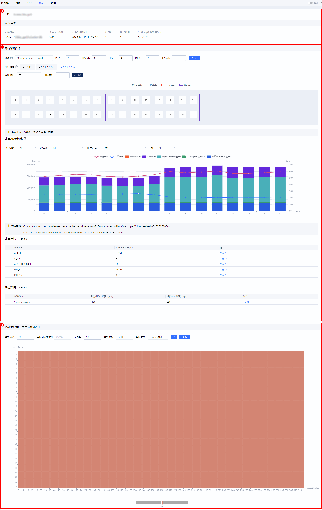

**Base Info**

Area 1: **Cluster** and **Base Info**. When cluster data is imported, you can select a cluster from the drop-down list. The basic information includes the device count, step count, report size, and profiling session duration.

**Parallel Strategy Analysis**

Area 2: **Parallel Strategy Analysis**, which includes the parallel strategy overview, **Computation/Communication Overview**, **Computing Details** (**Rank ID**), **Communication Details** (**Rank ID**), and parallel pipeline chart.

- The parallel strategy overview includes parallel strategy settings, parallel strategy charts, and advice, as shown in [**Figure 2** Parallel Strategy Overview](#parallel-strategy-overview). [**Table 1** Parallel strategy parameters](#parallel-strategy-parameters) describes the parameters for parallel strategies. After the parallel strategy is set, you can select **DP + PP**, **DP + PP + CP**, **DP + PP + TP**, or **DP + PP + CP + TP** to display the parallel strategy chart. You can select a target index in the graph to view its details. You can also right-click the target index and choose **Copy Attribute** from the shortcut menu to copy the details and paste it to the local PC for analysis.

    If the communication time can be correctly split by communication group, the advice is displayed.

    **Figure 2** Parallel strategy overview <
    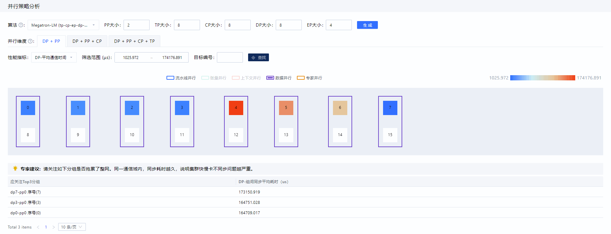

    **Table 1** Parallel strategy parameters 

    |Field|Description|
    |--|--|
    |Algorithm|- **Megatron-LM (tp-cp-ep-dp-pp)**: This arrangement is based on Megatron-Core. The priority order is TP > CP > DP > PP, with EP spanning above DP without participating in or affecting the priority (requiring that DP must be exactly divisible by EP). PP is located after DP and is most used for cross-node communication, which requires low bandwidth.  - **Megatron-LM (tp-cp-pp-ep-dp)**: This arrangement is also based on Megatron-Core and is rarely used. The priority order is TP > CP > PP > DP. It is used in scenarios where PP requires relatively high bandwidth.  - **MindSpeed (tp-cp-ep-dp-pp)**: This arrangement is based on MindSpeed-Core. The priority order is TP > CP > DP > PP. The EP spans across CP and DP and does not participate in or affect the priority (requiring that CP × DP must be exactly divisible by EP).  - **MindIE-LLM (tp-dp-ep-pp-moetp)**: This arrangement is based on MindIE-LLM (DeepSeek V3 uses a similar arrangement). For non-MoE layers, the priority order is TP > DP > PP. For MoE layers, the priority order is MOE_TP > EP > PP. When **MOE_TP=1**, an MoE EP solution that spans the same stage of PP is formed.  - **vLLM (tp-pp-dp-ep)**: This arrangement is based on vLLM. The priority order is TP > PP > DP. The EP spans TP and DP and does not participate in or affect the priority (requiring that TP × DP must be exactly divided by EP). An MoE EP solution is formed (that is, EP must be exactly divisible by TP). When the **vLLM (tp-pp-dp-ep)** algorithm is selected, PP size × TP size × DP size ≥ Number of imported cards.|
    |PP Size|Pipeline parallel size. You can set it to a value ranging from 1 to 10000.  **Pipeline Parallel** distributes different layers of a model to different cards for execution. When one rank executes the current batch of data, another rank can process the next batch of data.|
    |TP Size|Tensor parallel size. You can set it to a value ranging from 1 to 10000.  **Tensor Parallel** is a technique that divides model parameters into multiple parts and distributes them to different cards for computation.|
    |CP Size|Context parallel size. You can set it to a value ranging from 1 to 10000.  **Context Parallel** divides training samples into different batches based on the sequence length and dimension and allocates the batches to different cards for computation. **Context Parallel** (CP) splits the network input and all activations, which is an improved version of **Sequence Parallelism** (SP).|
    |DP Size|Data parallel size. You can set it to a value ranging from 1 to 10000.  **Data Parallel** divides the training dataset into multiple batches and allocates the batches to different cards for calculation.|
    |EP Size|Expert parallel size. You can set it to a value ranging from 1 to 10000.  **Expert Parallel** is a parallel method designed for Mixture of Experts (MoE) models. Experts are allocated to different computing cards. Each rank processes some training samples, and each rank can contain one or more experts.  - When the **Megatron-LM** algorithm is selected, the EP size must be less than or equal to the DP size, and the DP size must be exactly divisible by the EP size.  - When the **MindSpeed** algorithm is selected, DP x CP must be exactly divisible by EP.|
    |MoE-TP Size|This parameter is available only when the **MindIE-LLM (tp-dp-ep-pp-moetp)** algorithm is used.  TP size of the MoE layer in the inference parallel strategy, which is different from the TP of the non-MoE layer. You can set it to a value ranging from 1 to 10000. The values must meet the following requirements:  - PP Size × TP Size × DP Size = Number of imported cards  - TP Size × DP Size = MoE-TP Size × EP Size|
    |Performance Metric|You can display the parallel strategy chart by performance metrics. The available performance metric parameters vary according to the selected domain dimension.  If **None** is selected, no performance metric is displayed. That is, the rank information on the parallel strategy chart is in the default state.  If you select other parameters, **Visible Range (μs)** and color bar of the parameter are displayed next to the check box. The filter range is the minimum and maximum values of the parameter. The rank on the parallel policy graph is rendered and filled with colors according to the corresponding values. You can view the performance of each rank.|
    |Target Index|Enter the target index in the selected dimension to accurately locate the required number.|
    |Advice|The built-in expert analysis function of MindStudio Insight analyzes data, provides suggestions, and lists the top 3 groups and slow ranks, making it easier for developers to spot performance issues.|

- **Computation/Communication Overview** displays the step time consumption data of computing or communication operators in a bar chart and the time consumption proportion data of computing or communication operators in a curve. **Advice** provides suggestions based on the analysis of the computation time, communication time (not overlapped), and free time of each rank in the computation and communication groups, helping developers quickly analyze the data, as shown in [**Figure 3** Computation/Communication Overview](#computation-communication-overview). For details about the parameters, see [**Table 2** Computation/Communication Overview parameters](#computation-communication-overview-parameters).

    The curve and advice are displayed in the **Computation/Communication Overview** area when **DP + PP + CP + TP** or **DP + PP + TP** is selected.

    **Figure 3** Computation/Communication Overview <
    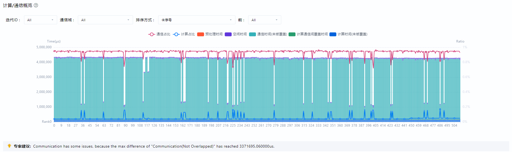

    **Table 2** Computation/Communication Overview parameters 

  |Field|Description|
  |--|--|
  |Step|Step ID. You can select a specific step or all steps from the drop-down list.|
  |Rank Group|Node ID. You can select one, multiple, or all nodes from the drop-down list.|
  |Order By|Set **Order By** to different dimensions.  - DP + PP + CP + TP and DP + PP + TP  **Rank ID**: rank ID.  **Computing(Not Overlapped)**: **Computing(Not Overlapped)** = **Computing** – **Computing_Communication Overlapped**.  **Computing_Communication Overlapped**: communication duration overlapped by computing.  **Communication(Not Overlapped)**: **Communication(Not Overlapped)** = **Communication** – **Computing_Communication Overlapped**.  **Free**: time when the device is not in communication or computing. The free time here is not included in the preparing time.  **Preparing**: time from the start of a step to the running of the first computing or communication operator. During this time, operations such as data loading and copying are performed. In the **Overlap Analysis** unit of **Timeline**, the time is considered as **Free**.  **Computing Ratio**: ratio of the computing time to the total time. Total time = **Computing(Not Overlapped)** + **Computing_Communication Overlapped** + **Communication(Not Overlapped)** + **Free** + **Preparing**.  **Communication Ratio**: ratio of the communication time to the total time.  - **DP + PP + CP Dimension**: **Order By** can be set to **Rank ID**, **Max Computing**, **Max Communication**, **Max Free**, and **Max Total Time (Computing + Communication (Not Overlapped) + Free)**. The maximum value of each parameter is the maximum value in each TP communication group.  - **DP + PP Dimension**: **Order By** can be set to **Rank ID**, **Max Computing**, **Max Communication**, **Max Free**, **Max Total Time (Computing + Communication (Not Overlapped) + Free)**, and **Max Communication(Not Overlapped)**. The maximum value of each parameter is the maximum value in the communication group of each **DP + PP + CP Dimension**.|
  |Top|You can set **Top** to display the top *N* records of **Order By**.|
  |Time(μs)|Time(μs)|The vertical coordinate on the left indicates the duration, in microseconds. The calculation formula is as follows:  **Total** = **Computing(Not Overlapped)** + **Computing_Communication Overlapped** + **Communication(Not Overlapped)** + **Free** + **Preparing**. **Preparing** indicates the data preprocessing time.|
  |Ratio|Ratio|The vertical coordinate on the right indicates the duration percentage, including the following information:  - **Computing Ratio**: **Computing Ratio** = **Total Computing**/**Time**.  - **Communication Ratio**: **Communication Ratio** = **Communication(Not Overlapped)**/**Time**.|
  |Advice|The analysis and suggestions of slow ranks based on the communication time under each parallel dimension help you to locate slow ranks.|

- **Computing Detail (Rank *ID*)**: When **DP + PP + CP + TP** and **DP + PP + TP** are selected, click the bar chart of a node in the **Computation/Communication Overview** area. The total time consumption and usage of the accelerator core of the node are displayed. Click **Details**to view the details about the computing operator, as shown in [**Figure 4** Computing operator details](#computing-operator-details). For details about the fields, see [**Table 3** Computing details](#computing-details). You can click  in the upper right corner of the table to copy the content displayed in the table and paste the content to an Excel file for analysis.

    **Figure 4** Computing operator details 
    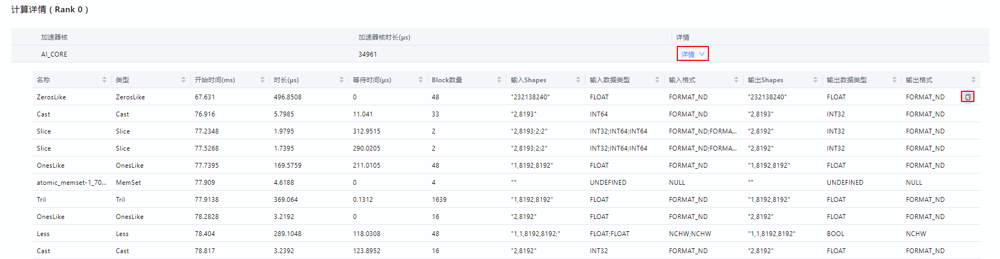

    **Table 3** Computing details 

  |Field|Description|
  |--|--|
  |Accelerator Core|AI accelerator core type, including AI Core and AI CPU.|
  |Accelerator Core Durations(μs)|Total duration of the accelerator core.|
  |Name|Operator name.|
  |Type|Operator type.|
  |Start Time(ms)|Operator execution start time.|
  |Duration(μs)|Execution duration of the current operator.|
  |Wait Time(μs)|Waiting time for executing the operator.|
  |Block Num|Number of running splits, which corresponds to the number of cores during task running. In MindStudio Insight 8.3.0 and earlier versions, this field is displayed as **Block Dim**.|
  |Input Shapes|Operator input shape.|
  |Input Data Types|Input data type of the operator.|
  |Input Formats|Input format of the operator.|
  |Output Shapes|Operator output shape.|
  |Output Data Types|Output data type of the operator.|
  |Output Formats|Output format of the operator.|

- **Communication Detail (Rank *ID*)**: When **DP + PP + CP + TP** and **DP + PP + TP** are selected, click the bar chart of a node in the **Computation/Communication Overview** area. The total duration of the communication operator on the node (including communication duration overlapped and not overlapped) is displayed. Click **Details** to view the details about the communication operator, as shown in [**Figure 5** Communication operator details](#communication-operator-details). For details about the fields, see [**Table 4** Communication details](#communication-details). You can click  in the upper right corner of the table to copy the content displayed in the table and paste the content to an Excel file for analysis.

    **Figure 5** Communication operator details
    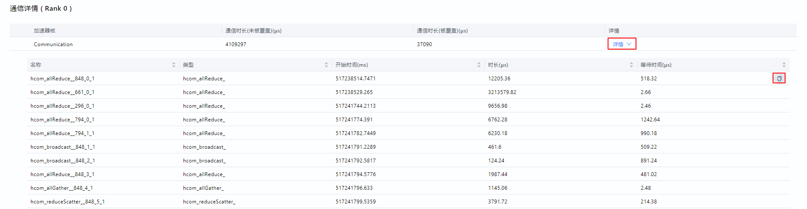

    **Table 4** Communication details 

  |Field|Description|
  |--|--|
  |Accelerator Core|AI accelerator core type, including AI Core and AI CPU.|
  |Communication(Not Overlapped) Durations(μs)|Not overlapped communication time, which refers to the pure communication duration.|
  |Communication(Overlapped) Durations(μs)|Overlapped communication duration.|
  |Name|Communication operator name.|
  |Type|Communication operator type.|
  |Start Time(ms)|Start time of communication operator execution.|
  |Duration(μs)|Execution duration of the current communication operator.|
  |Wait Time(μs)|Waiting time for executing the communication operator.|

- When **DP + PP + CP + TP** or **DP + PP + TP** is selected, click a single rank icon in the parallel strategy chart, and a flow is displayed. Click the pipeline parallelism flow, and the pipeline parallelism chart is displayed, as shown in [**Figure 6** Pipeline parallelism chart](#pipeline-parallelism-chart).

    On the pipeline parallelism chart, you can drag either side of the slider below the graph to zoom in or zoom out. You can also move the slider leftward or rightward using the mouse, or press **Shift** + left or right arrow key to move the parallel graph leftward or rightward.

    **Figure 6** Pipeline parallelism chart 
    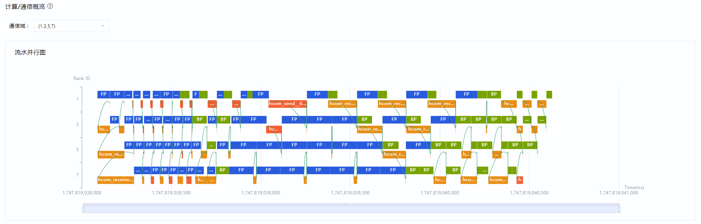

**MoE Expert Load Balancing Analysis**

Area 3: MoE expert load balancing analysis, which displays the expert activation heatmap and expert load balancing heatmap.

You can select **Profiling** or **Dump** for **Data Version** in the parameter configuration area. The two data types are statistical information of MoE models in different dimensions.

If **Profiling** is selected, the expert distribution heatmap is displayed. The heatmap is based on Profiling and collects statistics on the time consumed by the GroupedMatmul operator in each MoE layer. Since the GroupedMatmul operator is the core of MoE model computation, its performance directly affects how quickly experts respond.

If **Dump** is selected, the MoE model expert load balancing heatmap is displayed. The heatmap is based on Dump and collects statistics on the number of tokens processed by each expert in each MoE layer. You can select **Dump unbalanced** or **Dump Balance** and click  to import the corresponding file. The MoE model expert load balancing heatmap is displayed, as shown in [**Figure 7** MoE expert load balancing analysis](#moe-model-load-balancing-analysis). For details about the parameters, see [**Table 5** Parameters for MoE expert load balancing analysis](#parameters-for-moe-expert-load-balancing-analysis). For details about how to collect data files before and after dump balancing, see "Features" \> "[Load Balancing](https://www.hiascend.com/document/detail/zh/mindie/230/mindiellm/llmdev/mindie_llm0480.html)" in the *MindIE LLM Development Guide*.

**Figure 7** MoE expert load balancing analysis
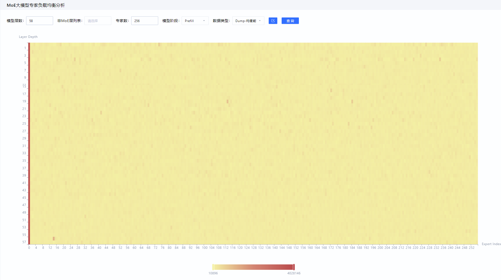

**Table 5** Parameters for MoE expert load balancing analysis 

|Field|Description|
|--|--|
|Model Layer Num|You can set it to a value ranging from 1 to 500.|
|Dense Layer List|Select one or more layers.|
|Expert Num|You can set it to a value ranging from 1 to 500.|
|Model Stage|Two phases of model inference: Prefill and Decode|
|Data Version|The value can be **Profiling**, **Dump unbalanced**, or **Dump balanced**.|

### Usage Description

**Displaying the Parallel Policy**

The **Summary** tab page supports the management of parallel strategy settings, which can be distinguished based on the imported profile data.

- If the profile data contains the collected parallel strategy parameter values, the values can be automatically read and filled in the page. The page information is automatically updated based on the input values. If you need to reset the parallel parameter values, enter the correct values and click **Generate**. In the dialog box that is displayed, confirm the information and click **Confirm**. The page information is updated accordingly.
- If the profile data does not contain the collected parallel strategy parameter values, enter the correct values of **PP Size**, **TP Size**, **CP Size**, **DP Size**, **MoE-TP Size**, and **EP Size** as required and click **Generate**. The page information is updated accordingly.

Configure the parallel strategy as follows: **PP Size** = **4**, **TP Size** = **4**, **CP Size** = **4**, **DP Size** = **8**, and **EP Size** = **4**. Click **Generate**. The parallel strategy chart is updated based on the input values, as shown in [**Figure 1** Data parallel strategy](#data-parallel-strategy).

When selecting different dimensions, you can select pipeline parallelism, tensor parallelism, context parallelism, data parallelism, or expert parallelism as required. The parallel strategy chart displays the division policy check box based on the selected options. When you click the check box, the page below is updated accordingly.

You can also select **Performance Metric** and **Visible Range** to color the target in the parallel strategy chart. Select **Target Index** and click **Find** to quickly locate the target index.

You can set the selected performance metric of any target index as the minimum or maximum filter value to quickly locate and analyze issues. In all dimensions, select a performance metric, right-click a target index in the parallel strategy chart, and choose the minimum or maximum filter value setting from the shortcut menu. The rendering color of the chart and the filter range change accordingly.

**Figure 1** Data parallel strategy
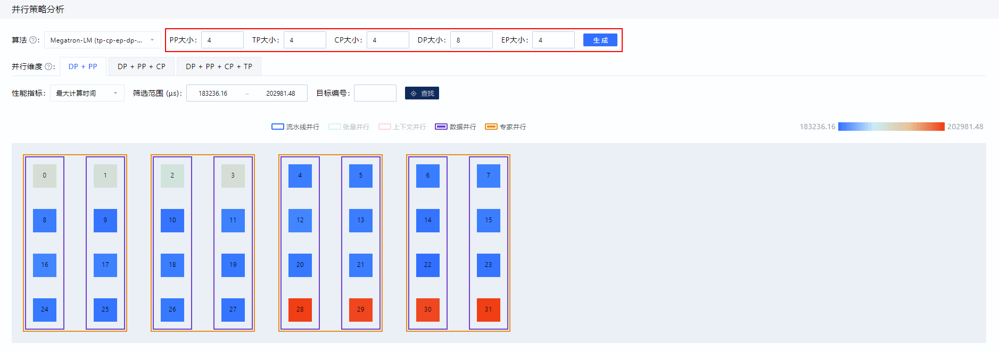

**Supporting Page Information Linkage**

- Flow linkage

    After the parallel strategy is set, if **DP + PP + CP + TP** is selected, you can click the target index in the strategy chart display area to show the related flow. When you click the flow, the lower part of the page changes accordingly, as shown in [**Figure 2** Linkage](#linkage). This function facilitates developers to view data differences.

    You can also click the target index in the **DP + PP + TP** or **DP + PP + CP + TP** dimension to display flows. Right-click a flow and choose the option for viewing communication duration analysis. Then, the communication page is displayed, showing details about the communication group to which the target index belongs.

    In the DP + PP + CP + TP area, click the tensor parallel flow related to rank 0 in the strategy chart. The **Computation/Communication Overview**, **Computing Detail (Rank** *ID***)**, and **Communication Detail (Rank** *ID***)** areas are updated. **Computation/Communications Overview** displays details about the communication groups (0, 1, 2, 3) related to rank 0. **Computing Detail (Rank ***ID***)** and **Communication Detail (Rank ***ID***)** display the computing details and communication details of the corresponding rank, respectively. When you click the bar chart of any rank in the **Computation/Communication Overview** area, the computing details and communication details of the corresponding rank are displayed.

    **Figure 2** Linkage
    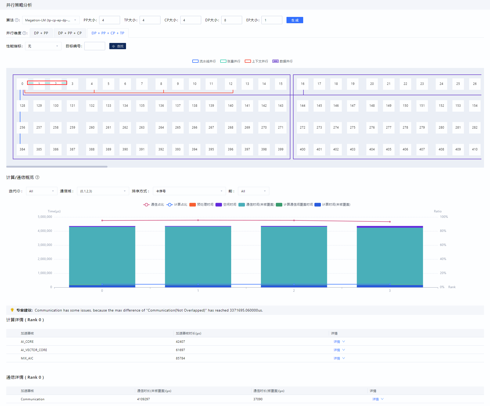

- Box selection linkage

    Select any dimension. When pipeline parallelism, tensor parallelism, context parallelism, or data parallelism is selected, the parallel strategy chart displays the division strategy according to the selected option. The box selection area is displayed. Click the box, and the lower part of the page changes accordingly, as shown in [**Figure 3** Box selection linkage](#box-selection-linkage).

    In the **DP + PP + CP** dimension, select **Pipeline Parallelism**. The parallel strategy chart is updated, and the box is displayed. Click the **Pipeline Parallelism** box, and the **Computation/Communication Overview** is updated.

    **Figure 3** Box selection linkage 
    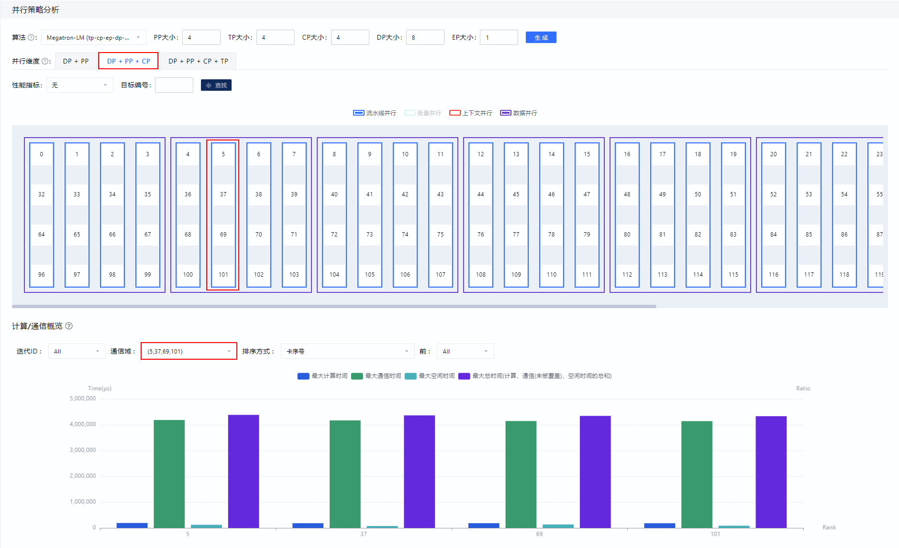

**Displaying Parallel Policies in Different Dimensions**

On the **Summary** page, after the parallel strategy value is set, you can select **DP + PP**, **DP + PP + CP**, **DP + PP + TP**, or**DP + PP + CP + TP** to display the parallel strategy chart.

You can select a dimension tab on the parallel strategy graph to expand the corresponding dimension, or right-click a target index to expand or collapse each dimension.

- Expand: In the **DP + PP** or **DP + PP + CP** dimension, right-click a target index and choose **Expand** from the shortcut menu.
- Collapse: In the **DP + PP**, **DP + PP + CP**, **DP + PP + TP**, or **DP + PP + CP + TP** dimension, right-click a target index and choose **Collapse** from the shortcut menu.

The details of each dimension are as follows.

- DP + PP

    If the **DP + PP** dimension is selected, you can select **Pipeline Parallelism** and **Data Parallelism**. When you click a box in the strategy chart, the **Computation/Communication Overview** bar chart changes accordingly. When you select performance metrics, the strategy chart is rendered accordingly to facilitate analysis, as shown in [**Figure 4** DP + PP dimension](#dp-+-pppdimension). You can set the visible range corresponding to a performance metric and enter the required index in the **Target Index** text box to accurately locate the target.

    You can click the icon of a data type on the top of the bar chart to hide or display the corresponding data in the bar chart.

    **Figure 4** DP + PP dimension 
    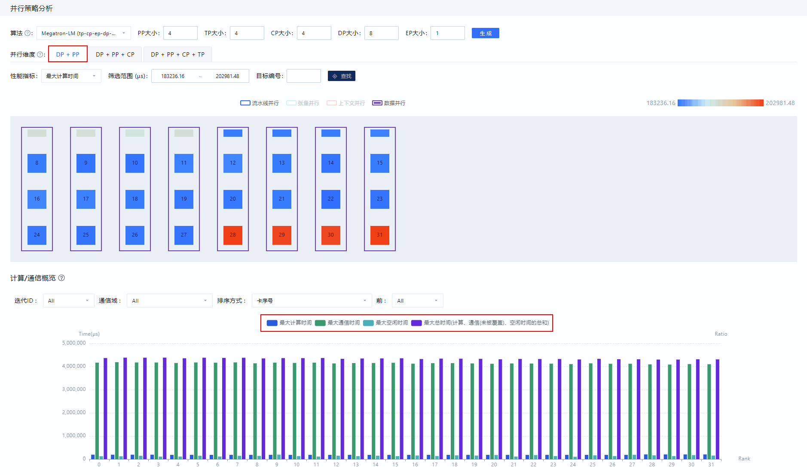

- DP + PP + CP

    When **Algorithm** is set to **Megatron-LM\(tp-cp-ep-dp-pp\)**, **Megatron-LM\(tp-cp-pp-ep-dp\)**, or **MindSpeed\(tp-cp-ep-dp-pp\)**, the **DP + PP + CP** dimension is displayed. You can select **Pipeline Parallelism**, **Context Parallelism**, and **Data Parallelism**. Click the check box in the strategy chart, and the **Computation/Communication Overview** bar chart changes accordingly. When you select performance metrics, the strategy chart is rendered accordingly to facilitate analysis, as shown in [**Figure 5** DP + PP + CP dimension](#dp-+-PP-+-CP-dimension). You can set the visible range corresponding to a performance metric and enter the required index in the **Target Index** text box to accurately locate the target.

    You can click the icon of a data type on the top of the bar chart to hide or display the corresponding data in the bar chart.

    **Figure 5** DP + PP + CP dimension 
    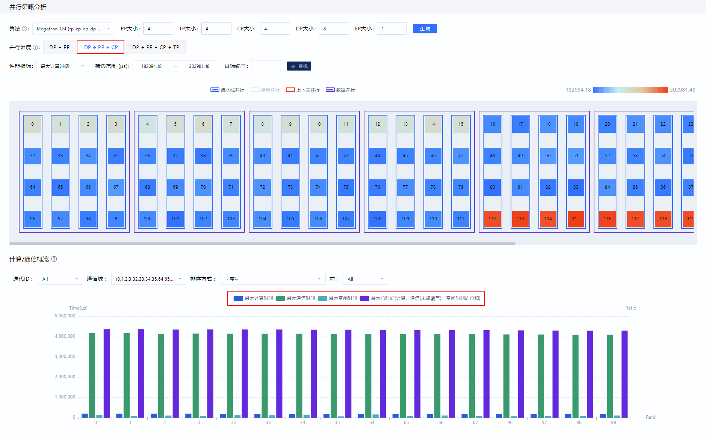

- DP + PP + TP

    When **Algorithm** is set to **MindIE-LLM\(tp-dp-ep-pp-moetp\)** or**vLLM\(tp-pp-dp-ep\)**, the **DP + PP + TP** dimension is displayed. You can select **Pipeline Parallelism**, **Tensor Parallelism**, **Data Parallelism**, and **Expert Parallelism**. Click the check box in the strategy chart, and the **Computation/Communication Overview** bar chart changes accordingly. When you select performance metrics, the strategy chart is rendered accordingly to facilitate analysis, as shown in [**Figure 6** DP + PP + TP dimension](#dp-+-pp-+-tp-dimension). You can set the visible range corresponding to a performance metric and enter the required index in the **Target Index** text box to accurately locate the target.

    You can click a rank and select the corresponding flow to display **Computation/Communication Overview**, **Computing Detail**, and **Communication Detail** under the strategy chart. You can also click a data type icon on the top of the bar chart to hide or display the data in the bar chart.

    **Figure 6** DP + PP + TP dimension <
    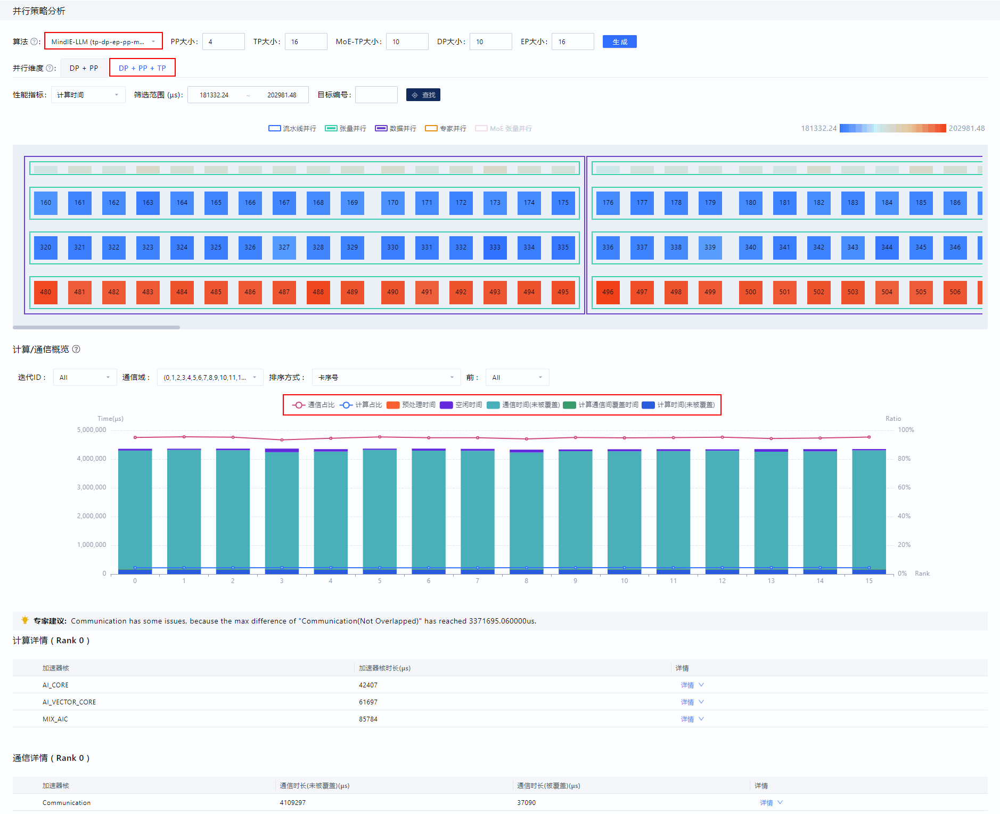

- DP + PP + CP + TP

    When **Algorithm** is set to **Megatron-LM\(tp-cp-ep-dp-pp\)**, **Megatron-LM\(tp-cp-pp-ep-dp\)**, or **MindSpeed\(tp-cp-ep-dp-pp\)**, the **DP + PP + CP + TP** dimension is displayed. You can select **Pipeline Parallelism**, **Tensor Parallelism**, **Context Parallelism**, and **Data Parallelism**. Click the check box in the strategy chart, and the **Computation/Communication Overview** bar chart changes accordingly. When you select performance metrics, the strategy chart is rendered accordingly to facilitate analysis, as shown in [**Figure 7** DP + PP + CP + TP dimension](#dp-+-pp-+-cp-+-tp-dimension). You can set the visible range corresponding to a performance metric and enter the required index in the **Target Index** text box to accurately locate the target.

    You can click a rank and select the corresponding flow to display **Computation/Communication Overview**, **Computing Detail**, and **Communication Detail** under the strategy chart. You can also click a data type icon on the top of the bar chart to hide or display the data in the bar chart.

    **Figure 7** DP + PP + CP + TP dimension 
    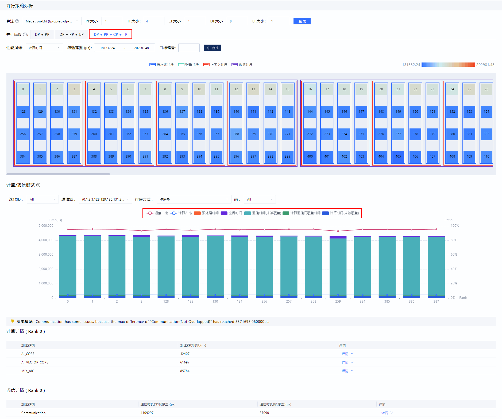

**Comparing Cluster Data**

MindStudio Insight allows developers to compare cluster data to intuitively and clearly view the data differences. For details about how to set baseline data and comparison data, see [Data Comparison](./basic_operations.md#managing-data).

In comparison mode, the **Base Info** area on the **Summary** tab page displays the comparison data and baseline data information.

In the **Parallel Strategy Analysis** area, the parallel strategy configuration parameters must be set according to the rules. The number of imported cards is determined by the maximum number of devices in the comparison data or baseline data. When you select the target index in the parallel strategy chart, the details displayed indicate the comparison data and the data in the brackets indicates the difference.

In the bar chart details in the **Computation/Communication Overview** area, the difference between the comparison data and baseline data is displayed, as shown in [**Figure 8** Comparison mode on the overview page](#comparison-mode-on-the-overview-page).

**Figure 8** Comparison mode on the overview page 
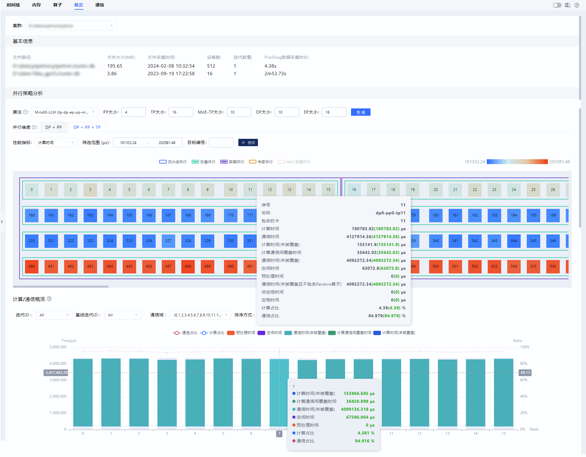

**Showing Expert Distribution Heatmap and Load Balancing Heatmap**

In the **MoE Expert Load Balancing Analysis** area, you can choose to display the expert distribution heatmap and the expert load balancing heatmap.

- Expert distribution heatmap

    If the imported profile data contains expert distribution heatmap data, set **Data Version** to **Profiling**, set other related parameters, and click **Search**. The expert distribution heatmap is displayed.

- Expert load balancing heatmap

    To import the balanced or unbalanced dump data, set **Data Version** to **Dump balanced** or **Dump unbalanced** and click  to import the corresponding file to display the MoE expert load balancing heatmap, as shown in [**Figure 9** MoE expert load balancing analysis](#moe-expert-load-balancing-analysis). After the file is imported successfully, the default values of the parameters are automatically set.

The vertical coordinate indicates the total number of model layers (MoE layers + non-MoE layers), and the horizontal coordinate indicates the expert sequence number. When you select a cell in the chart, the details of the cell are displayed, including the expert index, ID, layer ID, rank ID, and access traffic.

You can hold down **Ctrl** and scroll the mouse wheel to zoom in or out the heatmap.

**Figure 9** MoE expert load balancing analysis
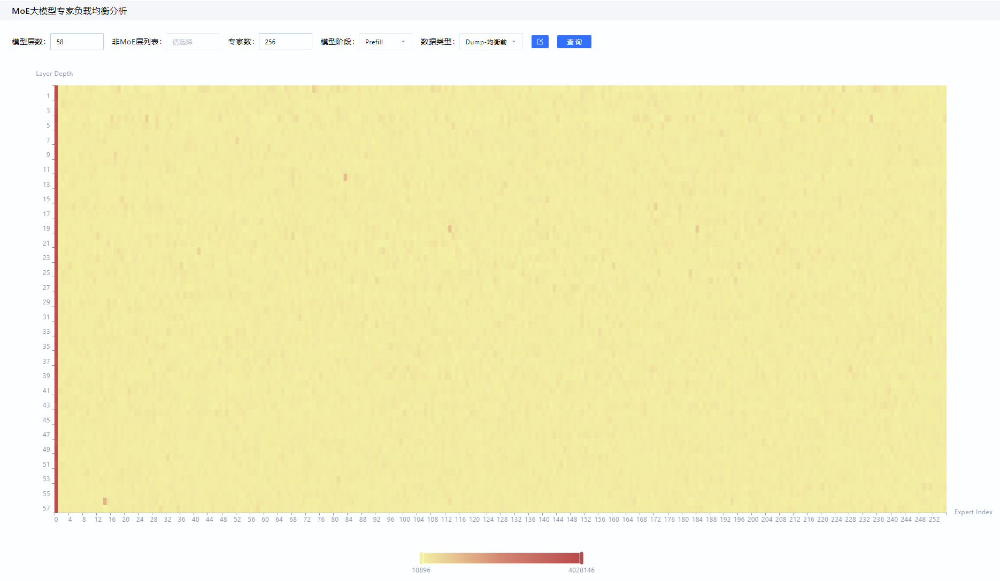

## Communication

### Function Description

The **Communication** tab page displays the network link performance across the cluster and the communication performance of all nodes. By analyzing the overlapped duration between cluster communication and computation, slow hosts or nodes in the cluster training can be identified.

### GUI Description

The **Communication** tab page displays cluster communication performance from two dimensions: network-wide link display and node-based display. The data is displayed in two parts: **Communication Matrix** and **Communication Duration Analysis**.

**Communication Matrix**

The **Communication Matrix** tab page displays information about communication operators in a specified step communication group, including the bandwidth, communication duration, transmission size, and link mode, as shown in [**Figure 1** Communication Matrix](#communication-matrix). For details about the parameters, see [**Table 1** Communication Matrix fields](#communication-matrix-fields).

**Figure 1** Communication Matrix
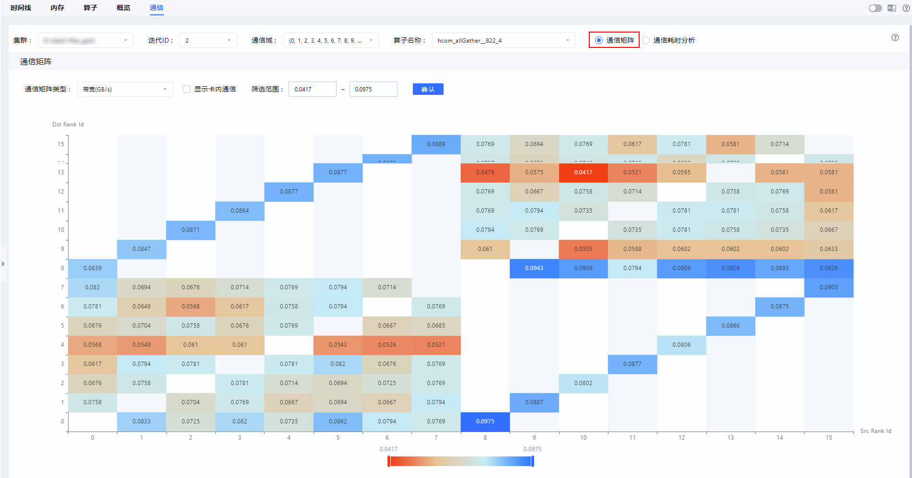

**Table 1** Communication Matrix fields 

| |Field|Description|
|--|--|--|
| |Cluster|Cluster name. You can select a cluster from the drop-down list when importing cluster data.|
| |Step|Step ID. You can select a step from the drop-down list.|
| |Communication Group|Communication group. You can select one, multiple, or all nodes from the drop-down list. The nodes are displayed on the vertical coordinate.|
| |Operator Name|Communication operator name. You can select **Total Op info** or a type of operator from the drop-down list.  The data of communication operators are grouped by type, like "allreduce-total" for easier viewing. When you select the **top**, **bottom**, or **middle** type, move the pointer to the communication matrix heatmap and click a cell to see the specific communication operator name.  - **Total Op info**: data of all communication operators in the selected Step and communication group.  - **total**: average bandwidth of the communication operators (total transmission volume of a type of communication operators/total transmission time). You are advised to view this type first.  - **top**: communication operators with the highest bandwidth. Top *N* indicates the **N** highest bandwidths.  - **middle**: communication operators with the median bandwidth.  - **bottom**: communication operators with the lowest bandwidth. Bottom *N* indicates the **N** lowest bandwidths.|
| |Matrix Model|Communication matrix heatmap.|
| |Communication Matrix Type|Communication matrix type.  - **Bandwidth (GB/s)**: bandwidth (GB/s).  - **Transit Size(MB)**: communication size.  - **Transport Type**: link type.  - **Transit Time(ms)**: communication duration.|
| |Show Inner Communication|Communication data in the rank. This option is not selected by default.|
| |Visible Range|Visible range of data. By default, all data is displayed. You can manually set the data display range.|
|Src Rank Id|Src Rank Id|Source Rank ID. The horizontal coordinate is the ID of the source rank in the link information.|
|Dst Rank Id|Dst Rank Id|Destination Rank ID. The vertical coordinate is the ID of the destination rank in the link information.|

**Communication Duration Analysis**

**Communication Duration Analysis** displays the communication performance of nodes, including the communication operator thumbnail, communication duration, data analysis, and advice, as shown in [**Figure 2** Communication Duration Analysis](#Communication-Duration-Analysis). For details about the parameters, see [**Table 2** Communication Duration Analysis fields](#Communication-Duration-Analysis-fields).

**Figure 2** Communication Duration Analysis 
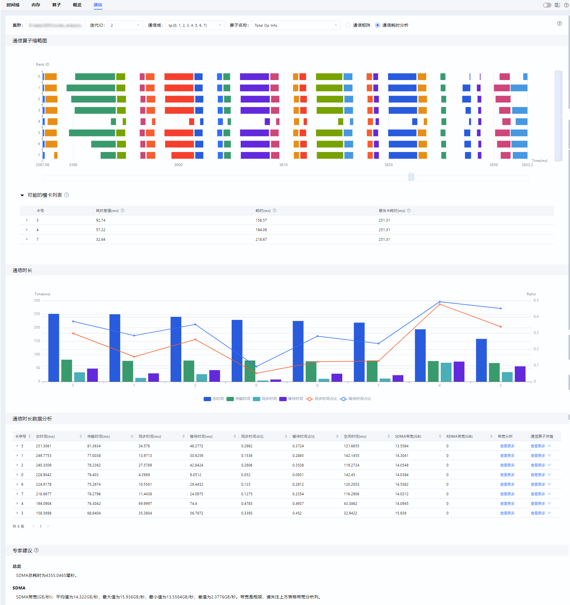

**Table 2** Communication Duration Analysis fields 

|Field|Description|
|--|--|
|Cluster|Cluster name. You can select a cluster from the drop-down list when importing cluster data.|
|Step|(Mandatory) Step ID. You can select a step from the drop-down list.|
|Communication Group|(Mandatory) Communication group. You can select or search for one, multiple, or all nodes from the drop-down list. The nodes are displayed on the vertical coordinate.  |
|Operator Name|(Mandatory) Communication operator name. You can select **Total Op Info** or a specific operator from the drop-down list. **Total Op Info** indicates the sum of all communication operator data in the selected **Step** and communication group.  |
|Communication Matrix| (Mandatory) Communication matrix. Either this parameter or **Communication Duration Analysis** must be set.|
|Communication Duration Analysis|(Mandatory) Communication duration analysis. Either this parameter or **Communication Matrix** must be set.|
|Communication|Execution sequence and time of communication operators. The slow rank information is displayed below the thumbnail. For details, see [Quickly Analyzing and Locating Abnormal Communication Operators](#quickly-analyzing-and-locating-abnormal-communication-operators).|
|Rank ID|Vertical coordinate in the communication operator thumbnail, which indicates Rank ID.|
|Time(ms)|Horizontal coordinate of the communication operator thumbnail, which indicates the operator running time, in milliseconds.|
|Visualized Communication Time|Visualized communication duration chart.|
|Time(ms)|Vertical coordinate on the left of the communication duration chart, which indicates the duration, in milliseconds.|
|Ratio|Vertical coordinate on the right of the communication duration chart, which indicates the duration percentage.|
|Data Analysis of Communication Time|Operator communication duration data analysis. You can move the cursor to the table and click  to copy the content displayed in the table and paste it to an Excel file for analysis.|
|Rank ID|Rank ID.|
|Elapsed Time(ms)|Total time of all communication operator events.|
|Transit Time(ms)|Communication duration, which indicates the communication duration of the communication operator, which is the total duration of communication operators on SDMA links (communication within a server) and RDMA links (communication between servers). If the communication duration is too long, a link may be faulty.|
|Synchronization Time(ms)|Synchronization duration, which is required for synchronization between nodes before the first communication between cards. This parameter is used to determine whether the long waiting time is caused by a slow node or a slow link.|
|Wait Time(ms)|Waiting duration. Synchronization is performed before two nodes communicate with each other to ensure that communication is established after the two nodes are synchronized.|
|Synchronization Time Ratio|Synchronization duration ratio. **Synchronization Time Ratio** = **Synchronization Time**/(**Synchronization Time** + **Transit Time**). A larger synchronization duration ratio before communication indicates a lower communication efficiency, which may be caused by slow cards.|
|Wait Time Ratio|Wait time ratio of a communication operator. **Wait Time Ratio** = **Wait Time**/(**Wait Time** + **Transit Time**). A larger wait time ratio indicates that the wait time of the node accounts for a larger proportion of the total communication duration, and the communication efficiency is lower.|
|Idle Time(ms)|Duration for communication operator delivery. **Idle Time** = **Elapsed Time** – **Transit Time** – **Wait Time**|
|SDMA BW(GB)|SDMA bandwidth.|
|RDMA BW(GB)|RDMA bandwidth.|
|Bandwidth Analysis|Bandwidth analysis. Click **See more** to view the bandwidth details of the specified operator on the corresponding node, as shown in [**Figure 3** Bandwidth analysis](#bandwidth-analysis).|
|Communication Operators Details|Details about the communication operator. This parameter is displayed only when **Operator Name** is set to **Total Op info**. Click **See more** to view the link details of the communication operator on the corresponding node, as shown in [**Figure 4** Communication operator details](#communication-operator-details-1).|
|Advice|Advice on the imported data upon analysis. It analyzes the bandwidth, byte alignment, communication retransmission, and communication packets, and provides suggestions, as shown in [**Figure 5** Advice](#advice).|

**Figure 3** Bandwidth analysis 
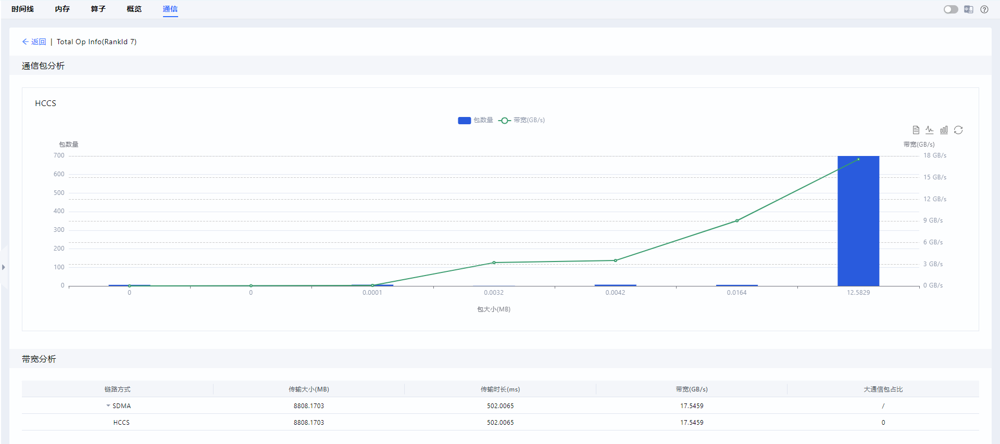

The bandwidth analysis page displays the communication performance of network-wide links, including the communication duration, traffic, bandwidth, and link type. [**Table 3** bandwidth analysis fields](#bandwidth-analysis-fields) describes the fields on the bandwidth analysis page.

**Table 3** Bandwidth analysis fields 

|Field|Description|
|--|--|
|Packet Number|Number of communication packets.|
|Packet Size(MB)|Size of a communication packet.|
|Transport Type|Link mode.|
|SDMA|SDMA links (communication links between devices in a node), including HCCS, PCIe, and SIO links.|
|RDMA|RDMA links (inter-node device communication links).|
|Transit Size(MB)|Size of communication packets within one communication process.|
|Transit Time(ms)|Duration of one communication process.|
|Bandwidth(GB/s)|Bandwidth. The bandwidth equals the traffic divided by the communication duration. Empirical bandwidth reference values: **RDMA_Bandwidth** = **12.5**; **HCCS_Bandwidth** = **18**; and **PCIe_Bandwidth** = **20**.|
|Large Packet Ratio|Ratio of large communication packets. It is the ratio of packets whose sizes are big enough to enable the communication link to reach the empirical bandwidth.|

**Figure 4** Communication operator details 
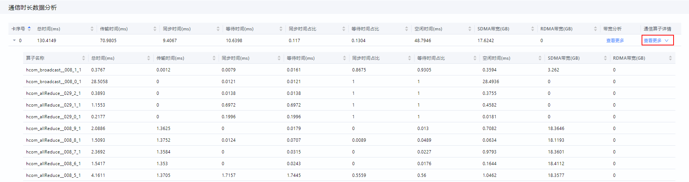

This column displays communication performance by operator, including the communication duration, waiting duration, and synchronization duration of the communication operator. [**Table 4** Communication operator detail fields](#communication-operator-detail-fields) describes the fields in the figure.

**Table 4** Communication operator detail fields

|Field|Description|
|--|--|
|Operator Name|Communication operator name.|
|Elapsed Time(ms)|Total duration of all events of the communication operators, in milliseconds.|
|Transit Time(ms)|Communication duration, in milliseconds. The communication duration is calculated based on the total duration of the communication operators of the SDMA and RDMA links.|
|Synchronization Time(ms)|Synchronization duration, in milliseconds. It is the waiting time before the first data transmission.|
|Wait Time(ms)|Wait duration (ms). Synchronization is performed before two ranks communicate with each other.|
|Synchronization Time Ratio|Synchronization duration ratio. The calculation formula is **Synchronization Time**/(**Synchronization Time** + **Transit Time**).|
|Wait Time Ratio|Waiting duration ratio. The calculation formula is **Wait Time**/(**Wait Time** + **Transit Time**).|
|Idle Time(ms)|Duration for communication operator delivery. **Idle Time** = **Elapsed Time** – **Transit Time** – **Wait Time**|
|SDMA BW(GB)|SDMA bandwidth.|
|RDMA BW(GB)|RDMA bandwidth.|
|Operation|Click **Show in Timeline** to view the corresponding communication operator on the timeline page. Click **Show in Thumbnail** to view the operator in the communication operator thumbnail.|

The advice provides data analysis including bandwidth description, byte alignment analysis, communication retransmission analysis, and communication packet analysis, and suggestions. You can further locate the slow rank and specific operator based on the advice in the parallel strategy analysis on the overview page.

- Bandwidth description: displays the maximum, minimum, and average values of the SDMA and RDMA bandwidths and the differences between the maximum and minimum values in the overview, SDMA, and RDMA dimensions, helping developers quickly identify exceptions.
- Byte, retransmission, and packet analysis: collect statistics on byte alignment data of communication operators, communication retransmission analysis data, communication packet data, and communication bandwidth preemption data, and provides suggestions for developers.

**Figure 5** Advice 
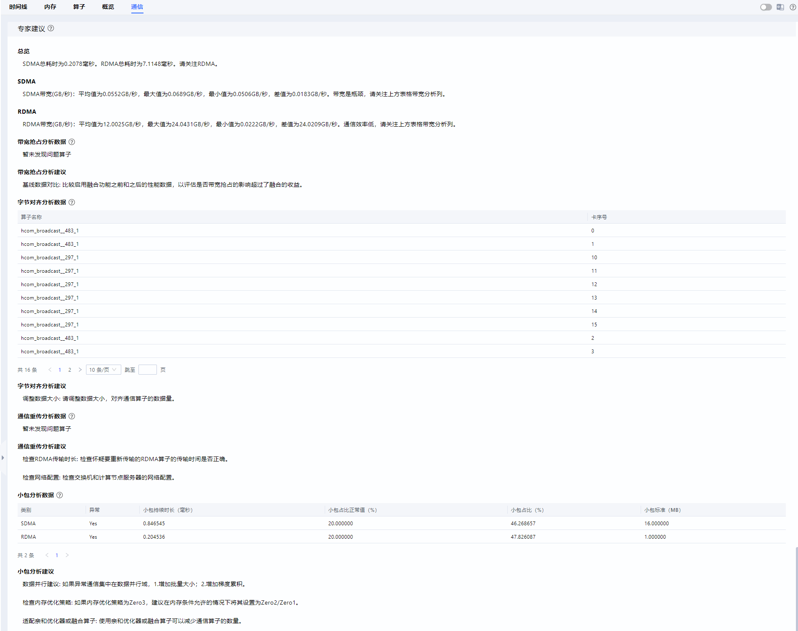

### Usage Description

**Displaying and Zooming In on Communication Operator Thumbnails**

- The **Communication** tab page supports the display of communication operator thumbnails.
  - On the **Communication** tab page, select the required information from the drop-down lists in the upper part of the page. The corresponding communication operator thumbnail is displayed.
  - Click a single operator in the communication operator thumbnail. The rank ID, operator name, start time, and elapsed time of the operator are displayed, as shown in [**Figure 1** Communication operator thumbnail](#communication-operator-thumbnail). For details about the fields in the figure, see [**Table 1** Operator fields displayed in the hover box](#operator-fields-displayed-in-the-hover-box).

     **Figure 1** Communication operator thumbnail
        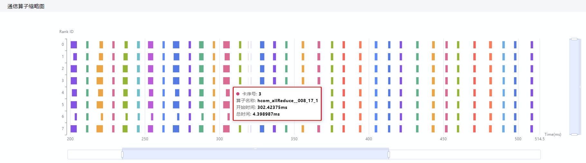

    **Table 1** Operator fields displayed in the hover box 

      |Field|Description|
      |--|--|
      |Rank ID|Rank ID of the communication operator.|
      |Operator Name|Communication operator name.|
      |Start Time|Start time of the communication operator.|
      |Elapsed Time|Total execution duration of the communication operator.|

- You can zoom in or out on, move left or right, and move up or down an communication operator thumbnail. The operations are as follows:
  - Drag the slider below the thumbnail or the slider on the right to zoom in or out.
  - Move the pointer to any position of the communication operator thumbnail and hold down **Ctrl** and scroll the mouse wheel to zoom in or out.
  - Drag the slider below the communication operator thumbnail to move the thumbnail leftward or rightward.
  - If the communication operator thumbnail is not displayed in the default state, you can hold down **Shift** and press the left or right arrow key to move the thumbnail leftward or rightward.
  - Drag the slider on the right of the communication operator thumbnail to move the thumbnail upward or downward to view the operator.

**Supporting Communication Operator Linkage**

On the **Communication** tab page, the operators in the communication operator thumbnail can be found in the timeline view.

On the **Communication** tab page, right-click a single operator in the communication operator thumbnail display area and choose **Find in Timeline** from the shortcut menu. The operator is displayed in the timeline view, as shown in [**Figure 2** Find in Timeline](#find-in-timeline).

**Figure 2** Find in Timeline
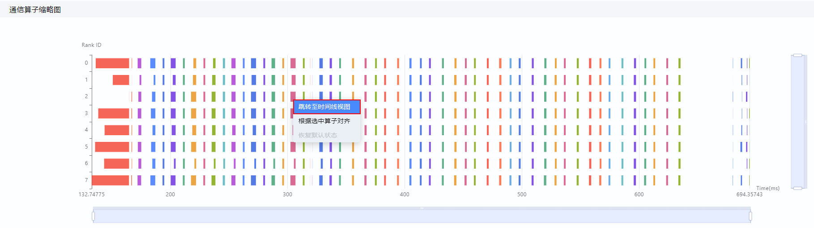

On the **Timeline** tab page, right-click a communication operator and choose **Find in Communication** from the shortcut menu. The communication operator thumbnail is displayed on the **Communication** tab page. The filter box automatically matches the operator information, as shown in [**Figure 3** Find in Communication](#find-in-communication).

> [!NOTE]NOTE  
> The communication operator in the **Plane** unit does not support the **Find in Communication** function. The communication operator thumbnail on the **Communication** tab page cannot be displayed.

**Figure 3** Find in Communication  
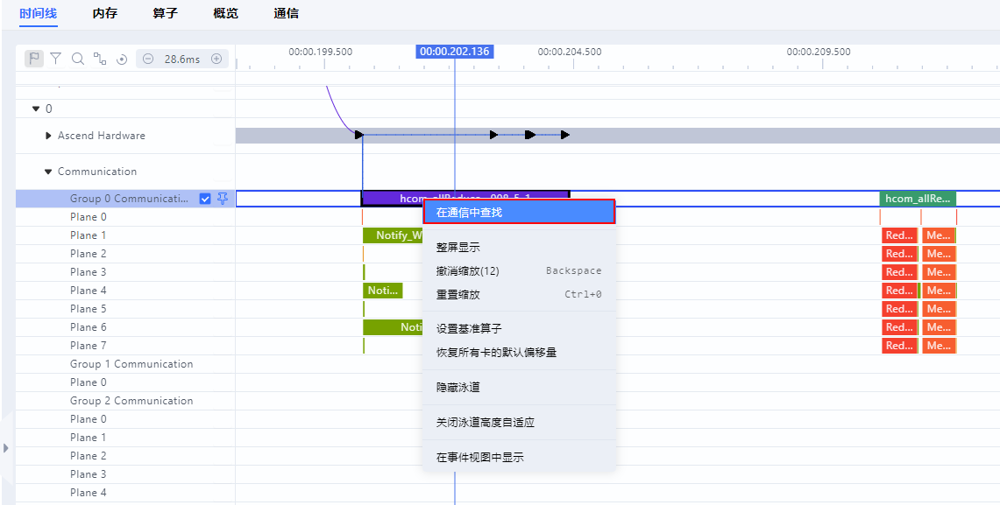

**Aligning Communication Operators by One Click**

In the communication operator thumbnail of the same communication group, you can align the names of communication operators by one click to view the communication status of the same operator in each rank.

On the **Communication** tab page, select the required communication group. In the communication operator thumbnail display area, right-click a single operator and choose **Align according to selected operator** from the shortcut menu. The operators with the same name in the communication group are aligned by time. The alignment policy is to align the tail time with the last operator, as shown in [**Figure 4** Operator alignment](#operator-alignment).

To cancel operator alignment, right-click any operator and choose **Restore default state** from the shortcut menu. The initial communication operator thumbnail is displayed.

**Figure 4** Operator alignment
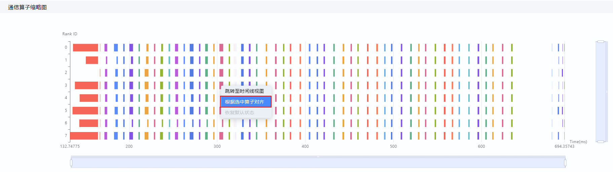

**Filtering the Data Visible Range**

When **Communication Matrix** is selected, enter a visible range next to **Visible Range** and click **Confirm**. The communication matrix model graph is dynamically refreshed based on the selected range, as shown in [**Figure 5** Visible Range](#visible-range).

**Figure 5** Visible Range
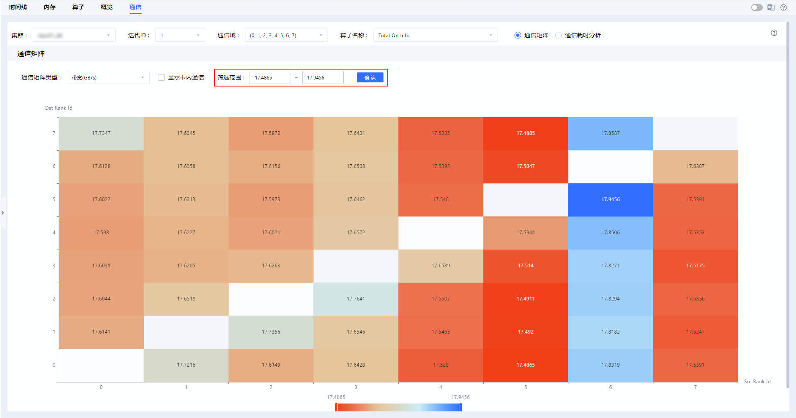

**Quickly Analyzing and Locating Abnormal Communication Operators** 

When **Communication Duration Analysis** is selected, you can quickly analyze and locate abnormal operators through the communication operator thumbnail.

MindStudio Insight automatically checks if slow ranks and abnormal operator exist. It can display the top 3 slowest ranks and top 3 most abnormal operators on the communication operator thumbnail, as shown in [**Figure 6** Slow rank list](#slow-rank-list). [**Table 2** Fields in the slow rank list](#fields-in-the-slow-rank-list) describes the fields about slow ranks and abnormal operators. You can analyze and optimize operator performance based on the information.

**Figure 6** Slow rank list 
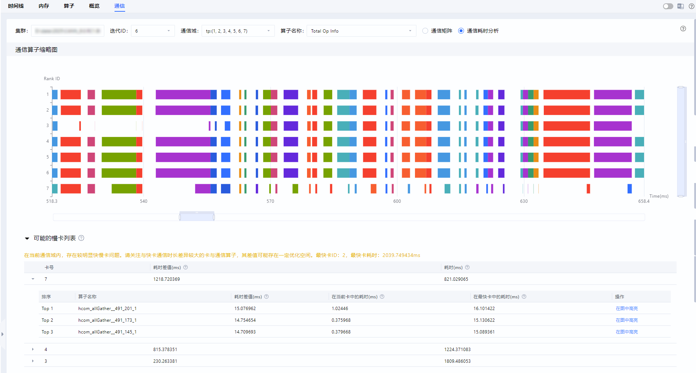

> [!NOTE]NOTE
>
> - When **Operator Name** is set to **Total Op Info**, the slow rank and abnormal operator list can be displayed in the **Communication** thumbnail. Otherwise, the list is not displayed.
> - The communication analysis is not supported for the communication group that contains the P2P or alltoallv operator, and the slow rank and abnormal operator list is not displayed.

**Table 2** Fields in the slow rank list 

|Field|Description|
|--|--|
|**Slow rank parameters**|
|Rank ID|ID of the slow rank.|
|Elapsed Time Difference(ms)|Time difference = Time taken by the fastest rank - Time taken by the current rank (unit: ms) The communication time difference indicates the communication time that can be reduced to some extent.|
|Elapsed Time(ms)|Total time consumed by the communication operators on the current rank.|
|**Abnormal operator parameters**|
|Index|Top ranking of abnormal operators.|
|Operator Name|Name of the abnormal operator.|
|Elapsed Time Difference(ms)|Time difference = Time taken by the communication operator on the fastest rank - Time taken by the communication operator on the current rank (unit: ms) The time difference indicates the communication time that can be reduced to some extent.|
|Elapsed Time on Current Rank(ms)|Time taken by the communication operator on the current rank.|
|Elapsed Time on Fastest Rank(ms)|Time taken by the communication operator on the fastest rank.|
|Operation|Action|You can click **Find in Communication** to highlight the operator in the communication operator thumbnail.|

**Comparing Cluster Data**

MindStudio Insight allows developers to compare cluster data to intuitively and clearly view the data differences. For details about how to set baseline data and comparison data, see [Data Comparison](./basic_operations.md#managing-data).

- Communication Matrix

    In comparison mode, if you select **Communication Matrix**, the differences in the communication matrix model graph are displayed. If you select any model box, the comparison data and baseline data are displayed, as shown in [**Figure 7** Communication matrix comparison mode](#communication-matrix-comparison-mode).

    **Figure 7** Communication matrix comparison mode
    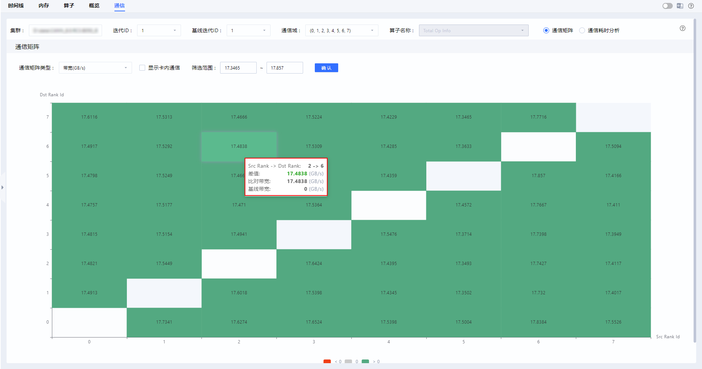

- Communication Duration Analysis

    In comparison mode, if you select **Communication Duration Analysis**, the **Communication** tab page displays the comparison step ID and baseline step ID. **Communication Group** displays the union set of the comparison data and baseline data, and **Operator Name** is fixed to **Total Op Info**.

    In the communication operator thumbnail, select the corresponding operator to display the details of the comparison data and baseline data. In the communication duration bar chart, select a bar chart to display the difference between the comparison data and baseline data, as shown in [**Figure 8** Communication in comparison mode](#communication-in-comparison-mode).

    **Figure 8** Communication in comparison mode
    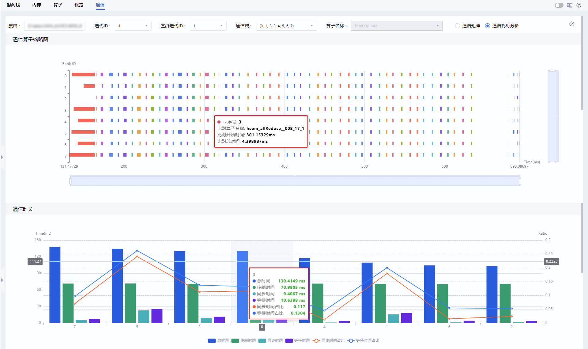

    In the **Data Analysis of Communication Time** area, no **Bandwidth Analysis** parameter is displayed, but the difference between the comparison data and the baseline data is displayed. Click **see more** in the **Details** column to display the details about the comparison data and baseline data, as shown in [**Figure 9** Comparison details in the Data Analysis of Communication Time area](#comparison-details-in-the-data-analysis-of-communication-time-area).

    **Figure 9** Comparison details in the Data Analysis of Communication Time area 
    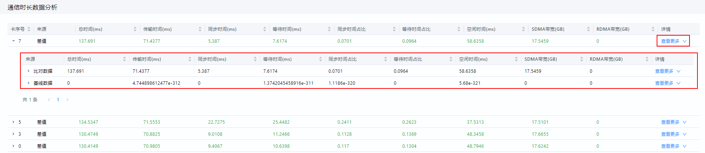

## Reinforcement Learning (RL)

### Function Description

**Introduction**

The **RL** tab page displays the pipeline of each phase in the RL process, enabling developers to fully understand the running status, identify issues, and improve RL performance.

**Precautions**

- The **Task Trace Timeline** area is displayed only when control flow data collected using mstx is imported. For details about how to collect data using mstx, see "Sampling and Parsing msprof\_tx" in section "[Ascend PyTorch Profiling Tool](https://www.hiascend.com/document/detail/zh/mindstudio/830/T&ITools/Profiling/atlasprofiling_16_0121.html)" in the *Profiling Tool Guide*.
- When importing profile data of Volcano Engine Reinforcement Learning for LLMs (VerL) and MindSpeed, keep their files in different folders. Do not mix them together during import.

### GUI Description

The **RL** page consists of the parameter configuration area (area 1) and the task trace timeline (area 2), as shown in [**Figure 1** RL](#rl).

**Figure 1** RL 
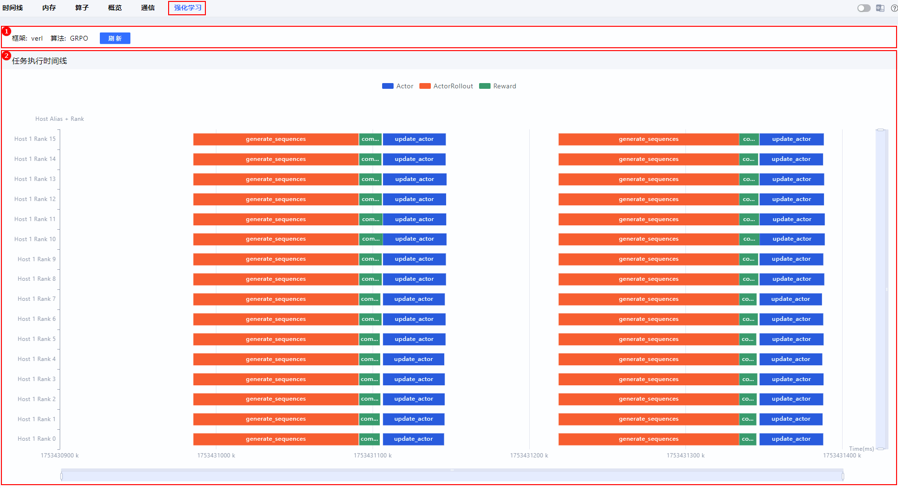

- Area 1: In the parameter configuration area, the **Framework** and **Algorithm** of the imported data are automatically identified and displayed. If the data of more than 16 ranks is imported, the data may not be completely displayed on the **RL** tab page. You can click **Refresh**to parse all data and refresh the task trace timeline.
- Area 2: The **Task Trace Timeline** area displays the execution time of each task on each rank. The horizontal coordinate is the timeline, and the vertical coordinate is the rank ID of each device. Different colors represent different tasks. Forward and backward micro batch marks are available in blue blocks, helping locate fine-grained performance issues during training.

    You can zoom in or out and move the timeline by dragging the sliders at the right and bottom of the timeline, or by holding down **Ctrl** and scrolling the mouse wheel.

## Host Bound Issue Analysis Cases

In a foundation model system, the CPU is responsible for task delivery, and the NPU is responsible for task execution. In actual inference or training processes, host bound issues are common. To address the host bound issues, it is typically necessary to analyze CPU scheduling problems by collecting Linux kernel ftrace data. However, there is currently a lack of tools that can uniformly visualize Linux kernel ftrace data alongside profile data, making it difficult to analyze host bound issues.

MindStudio Insight provides a complete set of data collection and conversion scripts. It can collect Linux kernel ftrace data and convert it into the supported JSON file format. Additionally, this tool allows you to import both the converted Linux kernel ftrace data and profile data, displaying them on the same interface for joint analysis. This improves the efficiency of locating host bound issues.

For details about how to analyze host bound issues, see [Host Bound Issue Analysis Cases](https://gitcode.com/Ascend/msinsight/blob/master/scripts/ftrace_tools/ReadMe.md).
