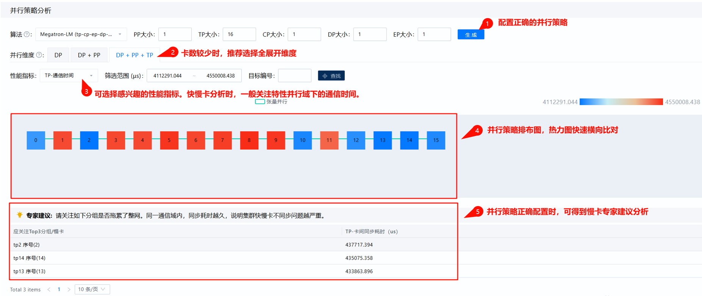
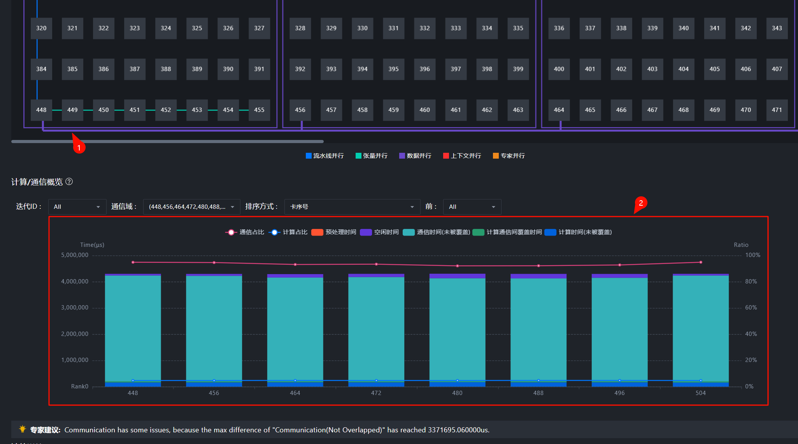
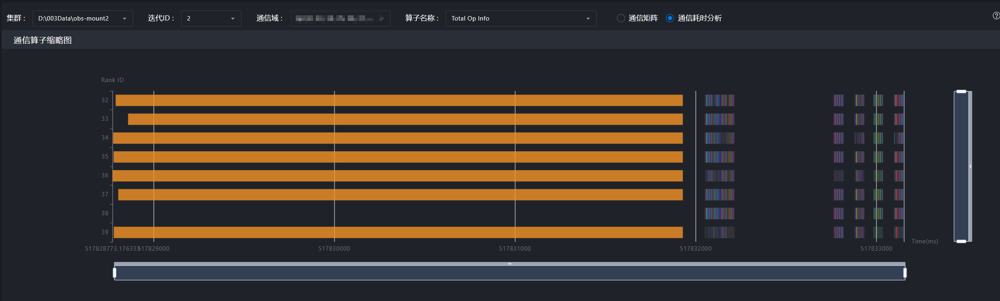
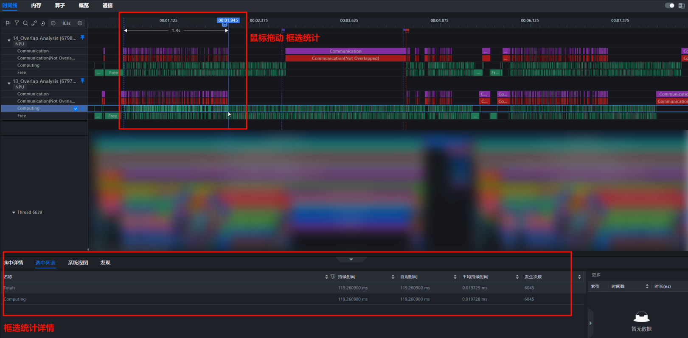

# 基于 MindStudio Insight 定位集群快慢卡问题

## 案例背景

在分布式训练或多卡推理场景中，集群整体性能通常受最慢的 Rank 影响。当部分 Rank 的计算、通信或 Host 侧下发节奏明显慢于其他 Rank 时，快卡会在同步点等待慢卡，表现为通信等待时间升高、Step 耗时变长、集群吞吐下降。

快慢卡问题的根因可能来自负载不均、通信链路异常、Host 侧下发瓶颈、并行策略配置不匹配或输入数据分布差异。单独查看某一张卡的 Timeline 往往只能看到局部现象，需要结合概览（Summary）、通信（Communication）和时间线（Timeline）逐层缩小范围。

本案例以“Summary 发现卡间性能差异 → Communication 定位等待/同步异常 → Timeline 对比快慢卡 → 判断慢卡负载偏高”为主线，介绍使用 MindStudio Insight 定位集群快慢卡问题的分析方法。

## 分析方法论

集群快慢卡问题建议按照“先看全局、再拆通信域、最后到 Timeline 定点验证”的顺序分析：

1. **在概览界面定位异常 Rank**：通过热力图、耗时占比和折叠视图快速发现计算、通信、调度或空闲时间明显异常的 Rank。
2. **在概览、通信界面确认同步等待**：查看通信耗时、等待或同步时间、传输时间占比，判断性能劣化是否与特定通信域或通信算子相关。
3. **跳转到时间线界面对比快慢卡**：选择同一 Step 内的快卡和慢卡，置顶关键泳道，对比计算、通信和空泡分布。
4. **框选统计和下发追溯**：对异常时间段执行框选统计，比较硬件任务数量、算子耗时和下发链路，定位是否存在负载不均或 Host 侧瓶颈。
5. **结合模型逻辑验证根因**：回到并行策略、数据划分、算子分布和业务代码，确认异常负载是否符合预期，以及是否可以规避。

## 数据准备

分析前需要导入集群场景性能数据。若数据目录中包含 `cluster_analysis_output`，MindStudio Insight 会读取其中的集群分析结果；若不包含该目录，工具会在导入时生成相应的集群分析结果。

进行分析前建议确认以下信息：

- 性能数据覆盖了问题发生的 Step 或时间段。
- 并行策略参数与模型实际训练或推理配置一致，例如 DP、TP、PP 等维度配置。
- Rank 与物理节点、设备之间的映射关系明确，便于后续判断慢卡是否集中在某个节点或通信域。
- 如果是大规模集群数据，优先使用折叠视图或精简数据进行全局定位，避免直接在全量数据中逐卡排查。

## 步骤一：在概览界面识别异常 Rank

导入集群数据后，先进入概览（Summary）界面观察集群整体性能。概览界面适合快速横向比较不同 Rank 的计算、通信和调度耗时。

**图 1**  概览界面

重点关注以下现象：

- 某些 Rank 的 **计算时间占比明显高于其他 Rank**。
- 某些 Rank 的 **空闲时间或调度时间占比较高**，说明可能存在 Host 侧下发瓶颈。
- 某些通信域下的 **平均通信时间波动较大**，说明可能存在通信不同步。
- 热力图中少数 Rank 的颜色明显偏离其他 Rank，说明该指标存在离群点。

当出现通信时间波动时，需要区分“慢卡”和“等待慢卡的快卡”：

- 慢卡通常表现为计算或下发耗时偏高，自身通信时间占比不一定最高。
- 快卡可能较早完成计算，但在集合通信同步点等待慢卡，因此等待或同步时间升高。

因此，不能仅凭通信算子总耗时最长就直接判断该 Rank 是根因 Rank，需要结合计算、空闲和等待时间一起分析。

## 步骤二：在概览、通信界面确认异常通信域

进入通信（Communication）界面后，围绕异常 Step 或异常 Rank 查看通信矩阵和通信耗时分析。

建议按以下顺序分析：

1. 概览页面查看全网链路展示，确认是否存在慢链路或慢节点。
2. 点击通信域连线，观察计算/通信概览中的传输时间、等待或同步时间占比。
3. 右键通信域连线，进入特定通信域的通信耗时分析。
4. 对比同一通信域内不同 Rank 的通信时间。

**图 2**  按通信域拆解后的计算/通信概览

**图 3**  通信耗时分析

若某个通信域中大部分 Rank 的等待或同步时间升高，而少数 Rank 的计算或下发耗时偏高，通常说明该通信域内存在快慢卡问题。此时可以从通信界面跳转到时间线界面，定位异常通信算子所在的具体时间范围。

## 步骤三：在时间线界面对比快卡和慢卡

在 Timeline 中选择同一 Step 的快卡和慢卡进行对比。建议将以下泳道置顶，便于横向观察：

- `Overlap Analysis` 泳道：观察计算与通信任务是否充分重叠。
- `Communication` 泳道：观察通信算子、Notify Wait 等同步等待事件。
- `Ascend Hardware` 相关泳道：观察硬件任务数量和执行时长。
- Host 侧 API 或下发相关泳道：观察算子下发节奏，是否存在明显空泡。

**图 4**  置顶对比慢卡与快卡的 Overlap Analysis 泳道

对比时重点观察：

- 慢卡是否存在更多计算算子或更长的计算任务。
- 快卡是否在通信同步点出现长时间等待。
- 慢卡的 Host 侧下发是否出现明显间隙，导致 Device 侧空泡。
- 同一时间段内，不同 Rank 的硬件任务数量是否存在明显差异。

如果慢卡在异常 Step 中承载了更多计算算子，或某些算子执行时间显著长于其他 Rank，则优先怀疑负载不均。如果各 Rank 计算负载接近，但某些 Rank 的下发间隙更大，则优先排查 Host Bound 或调度问题。

## 步骤四：框选统计定位负载差异

在 Timeline 中对异常时间段执行框选统计，分别统计快卡和慢卡的硬件任务数量、算子耗时和通信等待时间。

**图 5**  框选统计

典型判断方式如下：

- **负载不均**：慢卡算子数量更多，或关键计算算子耗时显著更长；快卡主要表现为等待同步。
- **Host 侧下发瓶颈**：慢卡 Device 侧存在空泡，Host 侧 API 或下发链路之间存在明显间隔。
- **通信链路异常**：计算负载接近，但特定 Rank 或通信域的传输时间明显更长。
- **并行策略不匹配**：异常 Rank 分布与 DP、TP、PP 等并行域划分相关，且异常集中在某一通信域或某类并行组内。

如果工具支持 async_npu 下发连线，可以进一步从硬件任务追溯到对应的 Python API，确认异常任务来自哪段模型代码或数据处理逻辑。

## 分析结论示例

在本案例中，概览界面显示某些 Rank 的计算耗时和空闲时间占比高于其他 Rank；通信界面显示对应通信域存在较高等待或同步时间；Timeline 对比后发现慢卡在异常 Step 内承载了更多计算算子，快卡则在集合通信同步点等待。

因此，该问题属于典型快慢卡问题，直接原因是卡间负载不均，慢卡计算完成时间晚于其他 Rank，导致集群整体 Step 时间被慢卡拉长。

## 优化建议

针对负载不均导致的快慢卡问题，可从以下方向优化：

- 检查数据划分逻辑，避免某些 Rank 长期处理更大 batch、更长序列或更复杂样本。
- 检查模型并行策略，确认 DP、TP、PP 等配置与实际训练或推理任务一致。
- 对负载明显偏高的算子，和模型开发人员确认是否存在条件分支、动态 shape、冗余计算或不均衡专家路由。
- 若异常集中在 Host 侧下发，参考 Host Bound 问题定位方法继续分析 CPU 调度和算子下发链路。
- 若异常集中在通信链路，继续在通信界面分析具体通信域、通信算子和链路传输效率。

优化后建议重新采集相同场景下的 Profiling 数据，对比优化前后的 Summary、Communication 和 Timeline，确认慢卡计算耗时下降、等待或同步时间缩短，且各 Rank 的 Step 节奏趋于一致。

## 参考信息

- [系统调优](../user_guide/system_tuning.md)
- [通用泳道和界面介绍](./Timeline_Common_Lanes_and_Interface.md)
- [快慢卡问题定位方法](https://www.hiascend.com/document/detail/zh/mindstudio/830/practicalcases/GeneralPerformanceIssue/toolsample6_019.html?framework=mindspore)
- [概览（Summary）-集群性能分析](https://www.hiascend.com/document/detail/zh/mindstudio/830/practicalcases/GeneralPerformanceIssue/toolsample6_031.html?framework=mindspore)
- [快慢卡定位Timeline操作案例](https://www.hiascend.com/document/detail/zh/mindstudio/830/practicalcases/GeneralPerformanceIssue/toolsample6_034.html?framework=mindspore)
