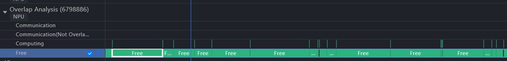
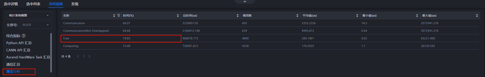
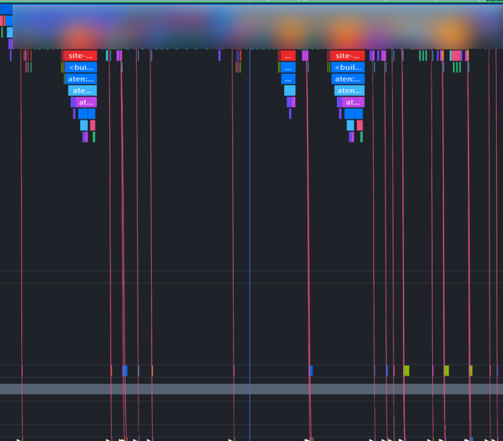
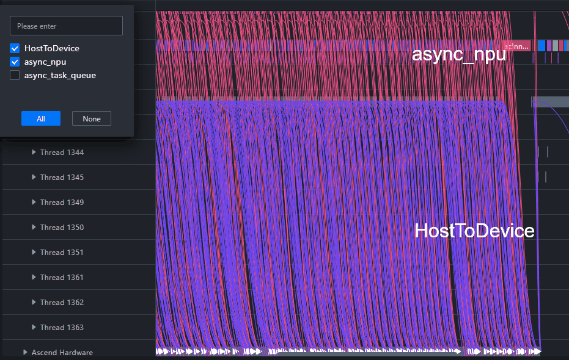
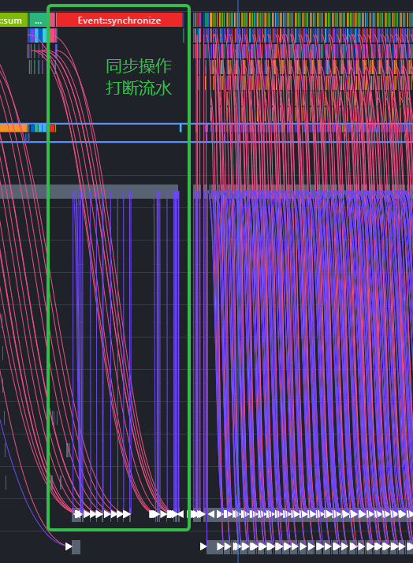

# 单卡 Top-Down 算子下发瓶颈分析

## 案例背景

在单卡训练或推理场景中，Device 侧计算性能不仅取决于算子本身耗时，也取决于 Host 侧是否能持续、及时地下发任务。如果 Host 侧下发速度不足，Device 侧流水线会出现空泡，AI Core 无法持续执行计算任务，最终表现为整体 Step 耗时升高、算力利用率下降。

单卡性能问题建议采用 Top-Down 思路分析：先从总体耗时占比判断问题属于计算、通信还是空闲，再进入 Timeline 和系统视图查看具体细节。本案例以下发瓶颈为例，介绍如何从 Overlap Analysis 的总体占比出发，逐步定位到算子下发链路和可能的 Host 侧根因。

## 分析方法论

单卡 Top-Down 分析建议按照以下顺序展开：

1. **先看总体占比**：在 Overlap Analysis 或统计视图中观察 Computing、Communication 和 Free Time 占比。
2. **判断瓶颈类型**：Computing 占比高优先分析计算算子；Communication 占比高优先分析通信或同步；Free Time 占比高优先分析下发、调度或数据搬运。
3. **展开 Timeline 细节**：在异常时间段查看 Host 侧 API、NPU Runtime、Ascend Hardware 等泳道之间的间隔。
4. **结合系统视图定位算子**：在 Stats System View 或详情表格中搜索异常算子，查看算子耗时、开始时间和下发关系。
5. **追溯下发链路**：勾选 async_npu 下发连线，关联 NPU 层任务与 Python API，判断是否存在频繁 HostToDevice 拷贝、同步等待或 Host 侧下发慢。

算子下发链路通常可以分为 ACLOP 和 ACLNN 两类。分析时不需要先判断算子类型，而是先确认 Device 空泡是否与 Host 侧下发间隔对应，再根据 Timeline 中的调用链路识别具体下发路径。

- **ACLOP 算子下发链路**：Python 层（`<built-in ...>`） -> Python 层具体算子（`aten::...`） -> Python 层 Enqueue -> Python 层 Dequeue -> CANN 层 `aclopCompileAndExecute` -> CANN 层 launch -> Ascend Hardware 层执行算子。
- **ACLNN 算子下发链路**：Python 层（`<built-in ...>`） -> Python 层具体算子（`aten::...`） -> Python 层 Enqueue -> Python 层 Dequeue -> CANN 层算子 -> CANN 层 `Node@launch` -> Ascend Hardware 层执行算子。ACLNN 路径中的 CANN 层算子名称通常以 `aclnn` 开头。

## 步骤一：通过 Overlap Analysis 判断空闲占比

导入单卡 Profiling 数据后，先进入 Timeline，查看 Overlap Analysis 泳道或底部统计视图。该视图可以将单卡运行过程拆解为计算、通信和空闲三类时间，适合作为 Top-Down 分析入口。

当 Free Time 占比明显高于 Computing 和 Communication 时，说明 Device 侧存在大量未执行计算或通信任务的时间。理想情况下，Free Time 占比应尽量控制在较低水平，例如约 10% 以内；如果 Free Time 长时间占主导，通常需要优先排查 Host 侧下发或同步等待问题。

**图 1**  下发瓶颈典型表现

**图 2**  Free Time 占比较高

判断时重点观察：

- Free Time 是否持续成片出现，而不是仅在 Step 边界短暂出现。
- Computing 是否被频繁打断，无法形成连续计算流水。
- Communication 占比是否较低，排除通信等待主导的可能。
- 空闲区间是否与 Host 侧 API 调用、数据搬运或同步操作相邻。

## 步骤二：展开 Timeline 观察下发间隔

确认 Free Time 异常后，在 Timeline 中放大异常 Step 或异常时间段，展开 Host 侧和 Device 侧相关泳道。下发瓶颈常见现象是 Device 侧硬件任务之间存在明显间隔，Host 侧 API 或 Runtime 调用无法及时衔接后续硬件任务。

此时建议重点查看以下泳道：

- Python API 或框架层调用泳道：观察上层接口是否频繁触发同步或数据搬运。
- NPU Runtime / acl 相关泳道：观察 Host 侧下发是否连续。
- Ascend Hardware 相关泳道：观察 Device 侧任务之间是否存在空泡。
- Overlap Analysis 泳道：确认空泡与 Computing、Communication 的对应关系。

**图 3**  展开 Timeline 查看下发细节

如果 Timeline 中 HostToDevice 连线接近垂直且频繁出现，说明 Host 侧和 Device 侧之间存在密集的数据搬运或同步关系，可能打断异步流水。此类场景需要进一步确认是否存在不必要的 Tensor 拷贝、频繁同步、数据预处理阻塞或动态图逻辑导致的下发开销。若空泡前后还伴随 Python API 或 Runtime 调用间隔变长，则可以继续追踪该时间段内的下发链路，判断问题发生在上层 API、Runtime 下发还是 Device 执行前等待。

## 步骤三：结合系统视图定位具体算子

如果空闲区间集中出现在某类算子前后，可以进入系统视图中的 Stats System View 或算子详情表格，搜索对应算子或 API，查看其开始时间、持续时间和上下游关系。

分析时可重点关注：

- 异常算子是否在多个 Step 中重复出现。
- 异常算子前是否存在较长 Host 侧等待或数据搬运。
- 算子下发是否被小粒度 API 调用拆得过细，导致 Host 侧频繁调度。
- 是否存在大量短小算子，造成下发开销相对计算耗时过高。

通过系统视图可以将 Timeline 中看到的空泡进一步关联到可搜索、可排序的算子列表，便于定位最值得优先优化的算子或 API。

## 步骤四：使用 async_npu 下发连线追溯 Python API

为了确认 Device 侧任务由哪个 Python API 触发，可以在 Timeline 中勾选 async_npu 下发连线。该连线能够帮助开发者关联 NPU 层硬件任务与 Host 侧调用路径，从而判断下发瓶颈是否来自某段业务代码。

**图 4**  async_npu 下发连线

**图 5**  HostToDevice 频繁穿插

图 5 中 HostToDevice 连线在计算任务之间频繁出现，表示 Step 内存在多次 Host 到 Device 的数据搬运。这类搬运会占用下发窗口，并可能使后续计算任务无法提前排队。

**图 6**  Python 侧同步操作打断流水

图 6 中 Python 侧同步或阻塞操作与 Device 侧空泡相邻，说明 Host 侧在等待结果或执行同步逻辑时，Device 侧后续任务没有及时下发。常见触发点包括取标量、打印 Device Tensor、同步拷贝数据或在动态图分支中等待 Device 结果。

使用下发连线时重点观察：

- 同一 Python API 是否触发了大量零散硬件任务。
- HostToDevice 数据搬运是否频繁穿插在计算任务之间。
- 下发链路中是否存在同步 API，使后续任务无法异步排队。
- 异常 API 是否与数据转换、打印、取值、控制流或动态图分支相关。

如果确认某段 Python API 导致频繁 HostToDevice 拷贝或同步等待，应回到模型代码检查是否可以减少数据搬运、合并小算子、避免不必要同步，或将部分逻辑迁移到 Device 侧执行。

## 分析结论示例

在本案例中，Top-Down 分析首先发现 Overlap Analysis 中 Free Time 占比明显高于 Computing 和 Communication，说明瓶颈不是计算算子本身，也不是通信主导，而是 Device 侧存在大量空闲。进一步放大 Timeline 后，可以看到硬件任务之间存在明显下发间隔，并且 HostToDevice 连线频繁出现。通过 async_npu 下发连线追溯后，异常任务可以关联到具体 Python API。

因此，该问题属于典型单卡下发瓶颈。直接原因是 Host 侧频繁数据搬运或同步操作打断异步流水，导致 Device 侧无法持续执行计算任务。

## 优化建议

针对算子下发瓶颈，可从以下方向优化：

- 减少训练或推理主循环中的 HostToDevice 数据搬运，避免在 Step 内频繁创建或拷贝 Device Tensor。
- 避免不必要的同步操作，例如频繁取标量、打印 Device Tensor、阻塞式数据读取等。
- 合并过细的小算子或小粒度 API 调用，降低 Host 侧调度和下发开销。
- 检查数据预处理和输入流水，避免 Host 侧准备数据阻塞 Device 侧计算。
- 对动态图控制流或条件分支进行梳理，减少每个 Step 内不稳定的下发路径。

优化后建议重新采集 Profiling 数据，对比优化前后的 Overlap Analysis：Free Time 占比应下降，Computing 占比应提升，Timeline 中硬件任务之间的空泡应减少。

## 参考信息

- [系统调优](../user_guide/system_tuning.md)
- [通用泳道和界面介绍](./Timeline_Common_Lanes_and_Interface.md)
- [观察下发瓶颈](https://www.hiascend.com/document/detail/zh/mindstudio/830/practicalcases/GeneralPerformanceIssue/toolsample6_022.html?framework=mindspore#ZH-CN_TOPIC_0000002535807019__section1664916388559)
- [Issue #324：添加案例专项文档](https://gitcode.com/Ascend/msinsight/issues/324)
