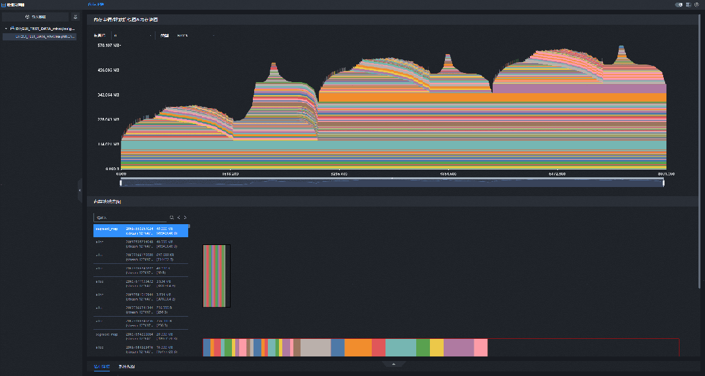
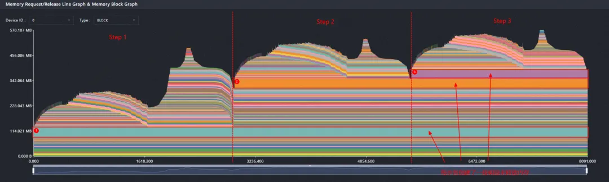
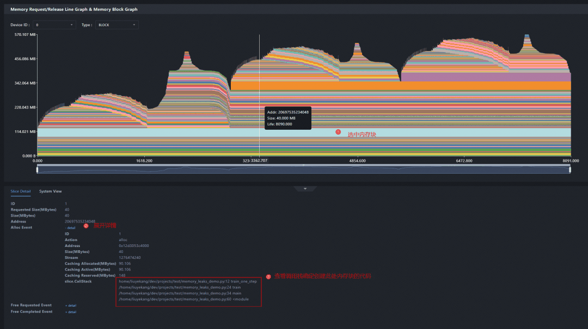
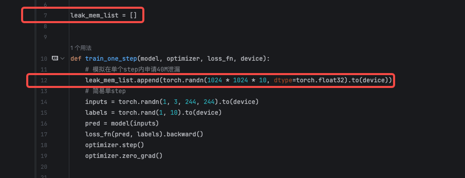
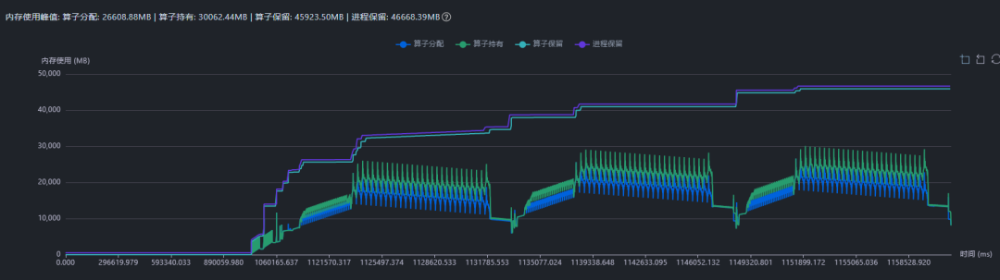
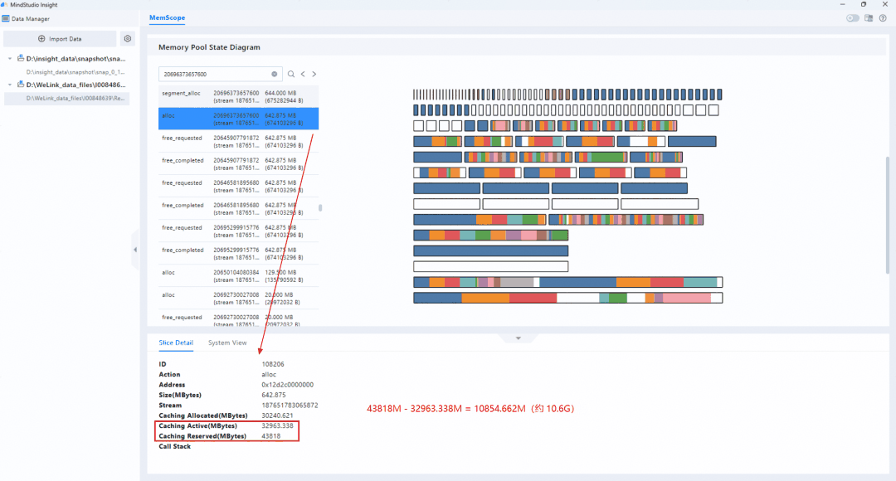

# 基于 PyTorch Snapshot 数据分析内存问题

## 案例背景

在强化学习、多模态训练等场景中，训练过程通常包含多个任务阶段，不同阶段的输入形态、序列长度和算子组合差异较大，Device 侧内存变化也更复杂。此类问题如果只观察整体内存曲线，通常只能看到内存持续增长、峰值偏高或保留内存较大，难以直接判断是内存泄漏、瞬时峰值还是内存碎片。

PyTorch Snapshot 数据可以记录内存申请、释放事件以及采集结束时刻的内存池状态。将 Snapshot 数据导入 MindStudio Insight 后，可以结合内存块生命周期图、内存池状态图和调用栈信息，进一步分析内存问题的发生阶段、异常内存块、分配来源和内存池碎片情况。

**图 1**  内存块生命周期图与内存池状态图联动展示<a id="内存块生命周期图与内存池状态图联动展示"></a>


## 分析方法论

基于 Snapshot 数据分析内存问题时，建议按照“先定界、再定位、后验证”的顺序展开：

1. **先看整体趋势**：观察内存申请/释放曲线，判断问题属于持续增长、单点峰值，还是保留内存长期明显高于实际分配内存。
2. **再缩小异常区间**：通过趋势图缩放条框选异常 Step 或异常时间段，聚焦该区间内的内存块和内存事件。
3. **定位异常对象**：查看区间未释放内存块、大块内存、`segment_alloc` 等关键事件，判断异常内存是否持续保留或是否触发内存池扩容。
4. **回溯代码路径**：选中异常内存块或内存事件，查看调用栈，定位触发申请的 Python 代码位置。
5. **结合业务逻辑验证根因**：回到训练逻辑检查 Tensor 生命周期、全局容器持有、输入长度波动、缓存释放时机等因素，验证可疑根因是否成立。

分析过程中需要区分以下两类常见现象：

- **内存泄漏**：内存块在多个 Step 后仍未释放，内存占用随训练过程持续增长，最终可能触发 OOM。
- **内存碎片**：实际分配内存不一定持续增长，但保留内存明显高于实际分配内存，内存池中存在较多无法被复用的空闲区域，可能导致后续频繁扩容或训练效率下降。

## Snapshot 数据采集

在待分析代码执行前启用内存历史记录，在问题场景运行结束后导出 Snapshot 文件。示例代码如下：

```python
import torch
import torch_npu

# 启用内存历史记录，记录 Python 调用栈，便于后续回溯内存申请来源。
torch_npu.npu.memory._record_memory_history(stacks="python")

# 执行待分析的训练或推理代码。
train()

# 导出 Snapshot 数据。
torch_npu.npu.memory._dump_snapshot("memory_snapshot.pickle")
```

采集完成后，将 `memory_snapshot.pickle` 导入 MindStudio Insight，在内存详情（PyTorch Snapshot）界面进行分析。

## 案例一：定位训练过程中的内存泄漏

### 问题现象

某模型 Demo 长时间训练后出现 OOM。仅从现象看，可能是单个 Step 峰值过高，也可能是训练过程中存在未释放的 Tensor 持续累积，需要进一步分析内存块生命周期。

### 分析过程

1. 将 Snapshot 数据导入 MindStudio Insight，进入内存详情（PyTorch Snapshot）界面。
2. 查看内存块生命周期图，观察每个 Step 中内存申请和释放的变化。
3. 发现每个 Step 都产生一段明显的内存块，但这些内存块在 Step 结束后仍然保留，没有随训练过程释放。

    **图 2**  训练过程中存在明显未释放内存块<a id="训练过程中存在明显未释放内存块"></a>
    

4. 框选异常 Step，查看区间未释放内存块，确认未释放内存块随 Step 增加而累积。

5. 选中未释放内存块查看调用栈，定位创建该 Tensor 的代码位置。

    **图 3**  未释放内存块对应的代码调用栈<a id="未释放内存块对应的代码调用栈"></a>
    

6. 回到代码检查 Tensor 生命周期，发现该 Tensor 被全局容器持续持有，Step 结束后仍存在引用，导致内存无法释放。

    

### 分析结论

该问题属于典型内存泄漏。根因不是单次训练峰值过高，而是无用 Tensor 被长期持有，导致 Device 侧内存随 Step 持续增长，最终触发 OOM。

### 优化建议

- 删除不再使用的全局 Tensor 容器，或在 Step 结束后及时清理容器中的 Tensor。
- 对需要跨 Step 保存的数据，优先保存必要的标量、CPU 数据或压缩后的结果，避免长期持有 Device Tensor。
- 修复后重新采集 Snapshot，确认相同 Step 区间内未释放内存块不再持续累积。

## 案例二：定位强化学习场景中的内存碎片

### 问题现象

强化学习训练多模态模型时，训练效率较慢。初步查看 Profiling 数据后，没有发现明显快慢卡现象，也未观察到与卡间通信直接相关的异常。

继续查看内存曲线，发现训练过程中保留内存明显高于实际分配内存，且稳定后没有明显持续泄漏。此时需要判断是否存在较多内存碎片，导致内存池中有空闲空间但难以被后续申请复用。

### 分析过程

1. 先基于 Profiling 数据观察内存曲线。如果 `Reserved` 明显高于 `Allocated`，且 `Allocated` 未持续增长，优先怀疑内存池中存在碎片，而不是内存泄漏。

    

2. 采集 Snapshot 数据并导入 MindStudio Insight，进入内存详情（PyTorch Snapshot）界面。
3. 在内存块生命周期图中定位触发内存池扩容的时间点，重点关注 `segment_alloc` 相关事件。查看在一个 Step 的最后一个 `segment alloc` 事件。
4. 单击异常事件，联动查看内存池状态图。
5. 在内存池状态图中观察内存段内部的空闲区域。如果存在大量分散空闲块，或存在大块空闲区域但仍触发新的 `segment_alloc`，说明内存池复用效率较低。发现在一个 Step 的最后一个 `segment alloc` 事件时已出现了约 10.6G的差距

    **图 4**  内存池状态图中存在未被复用的空闲内存<a id="内存池状态图中存在未被复用的空闲内存"></a>
    

6. 结合训练输入和业务逻辑继续分析，发现训练数据中存在个别极端长序列。这类输入会在单个 Step 中将显存峰值顶高，后续虽然实际使用下降，但内存池中遗留的碎片难以及时复用。

### 分析结论

该问题属于内存碎片导致的训练效率下降。根因不是持续泄漏，而是输入序列长度波动过大，导致显存峰值被极端样本拉高，后续 Step 中保留内存与实际分配内存长期存在较大差距，内存池复用效率下降。

### 优化建议

- 优化变长序列处理逻辑，减少极端长序列对单个 Step 显存峰值的影响。
- 调整 batch 组织方式，将长度相近的样本放入同一 batch，降低同一训练阶段的内存波动。
- 对尾部拼接、padding 等逻辑进行检查，避免不必要的大块临时 Tensor。
- 优化后重新采集 Profiling 和 Snapshot 数据，确认 `Reserved` 与 `Allocated` 的差距缩小，内存池状态图中的碎片减少。

## 总结

Snapshot 数据适合在内存问题已经初步定界后做深入分析。定位内存泄漏时，应重点关注跨 Step 持续保留的内存块，并通过调用栈回溯申请来源；定位内存碎片时，应重点关注 `Reserved` 与 `Allocated` 的差距、`segment_alloc` 事件以及内存池状态图中的空闲块分布。

完整的分析闭环是：先通过整体趋势判断问题类型，再通过异常区间缩放定位关键事件，随后结合调用栈和内存池状态图找到可疑代码路径，最后回到业务逻辑验证并优化。

## 参考信息

- [MindStudio Insight 内存调优](../user_guide/memory_tuning.md)
- [Issue #324：添加案例专项文档](https://gitcode.com/Ascend/msinsight/issues/324)
