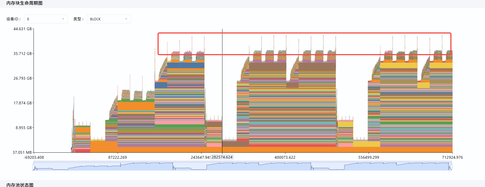
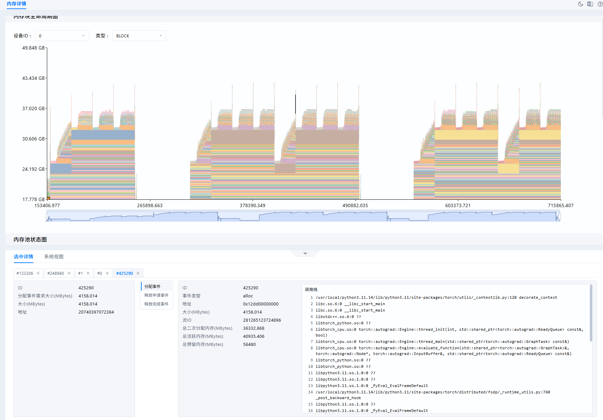
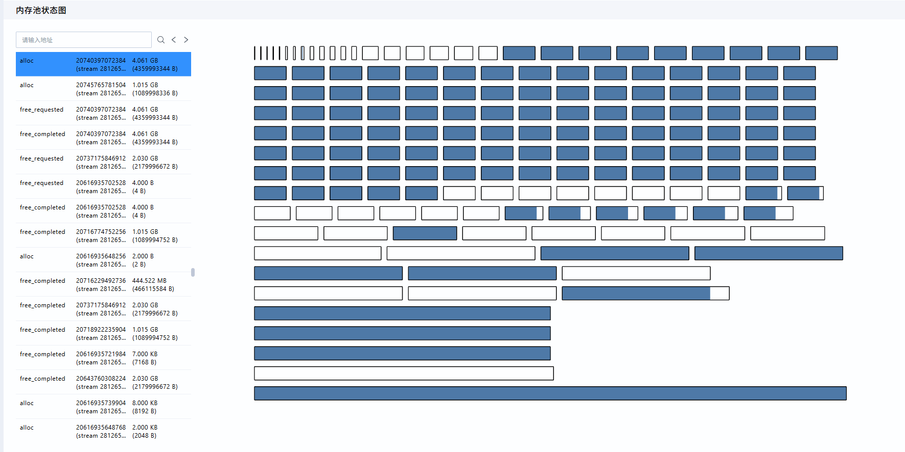
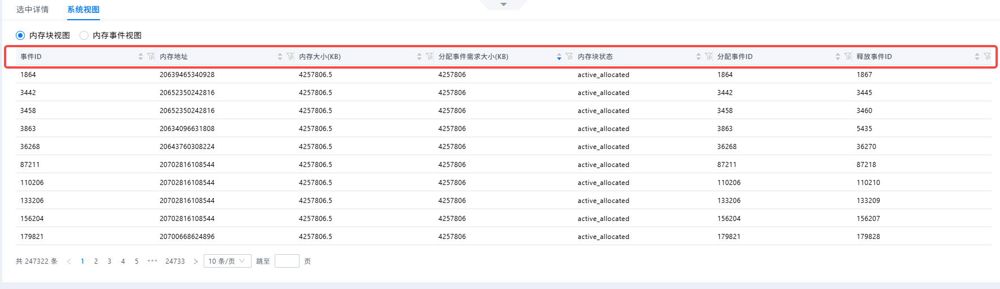
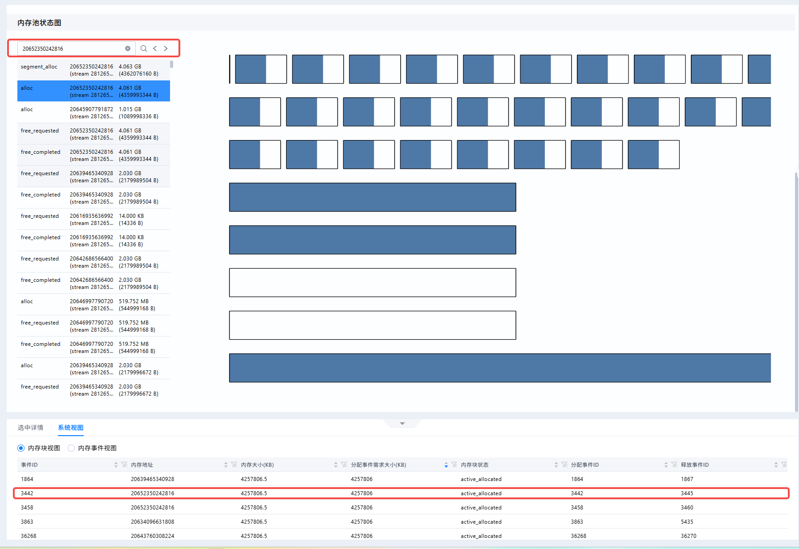
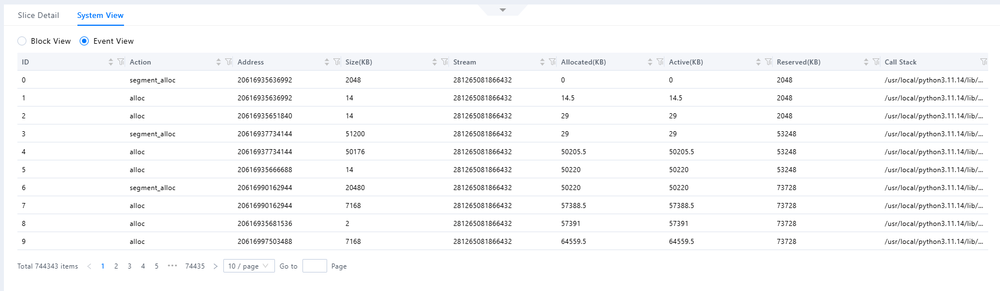

# verl场景下Snapshot数据采集和分析案例

## 问题背景

verl训练任务在PPO/RLHF等场景中，显存压力通常集中在rollout生成、actor更新、reference logprob计算、critic更新、reward model推理、checkpoint保存等阶段。为了定位峰值显存来源、观察显存是否随step持续增长、对比不同rank之间的显存分配差异，可以使用verl内置的`torch_memory` profiler采集PyTorch memory snapshot。

本文介绍verl场景下snapshot数据的采集方法，并给出基于MindStudio Insight的分析案例。

## 定位思路

1. 优先使用最小化采集参数验证snapshot链路可用。
2. 单卡场景采集rank 0，并控制采集步数，降低运行开销。
3. 多卡场景优先采集代表性rank；只有需要观察所有rank差异时，才开启all-rank采集。
4. 采集完成后检查输出目录，确认snapshot文件生成且非空。
5. 后续使用MindStudio Insight分析工具进行问题分析。

## Snapshot数据采集

### 采集参数说明

verl中开启memory snapshot采集的核心参数如下：

| 参数 | 说明 |
| --- | --- |
| `global_profiler.tool` | 选择verl的PyTorch显存采集工具。 |
| `global_profiler.save_path` | snapshot文件输出目录。 |
| `actor_rollout_ref.actor.profiler.enable` | 开启actor侧profiler集成。 |
| `actor_rollout_ref.actor.profiler.ranks` | 指定采集的rank数组，适合单rank或少量rank采集。 |
| `actor_rollout_ref.actor.profiler.all_ranks` | 采集所有rank，文件量和运行开销较大。 |
| `trainer.device` | 指定训练任务使用的设备类型，例如`cuda`或`npu`。 |
| `global_profiler.steps` | 控制采集的step范围。每次采集完成后会删除已有的memory history历史记录，避免不同采集窗口的数据相互混入。 |
| `global_profiler.global_tool_config.torch_memory.trace_alloc_max_entries` | 保留的显存分配记录数量。值越大，snapshot越完整，但额外开销越高。 |
| `global_profiler.global_tool_config.torch_memory.stack_depth` | 记录的调用栈深度。值越大，越有利于归因，但额外开销越高。 |

### 单卡采集命令

单卡任务只需要采集rank 0。以下命令以`verl.trainer.main_ppo`为入口，用户可将其中的数据集、模型和训练参数替换为实际任务配置。

```bash
python3 -m verl.trainer.main_ppo \
    algorithm.adv_estimator=grpo \
    data.train_files=/home/chenyan/verl_data/train.parquet \
    data.val_files=/home/chenyan/verl_data/test.parquet \
    data.train_batch_size=16 \
    data.max_prompt_length=512 \
    data.max_response_length=128 \
    data.filter_overlong_prompts=True \
    data.truncation=error \
    actor_rollout_ref.model.path=/data/models/Qwen/Qwen2.5-7B-Instruct \
    actor_rollout_ref.actor.ppo_mini_batch_size=8 \
    actor_rollout_ref.actor.ppo_micro_batch_size_per_gpu=2 \
    actor_rollout_ref.rollout.log_prob_micro_batch_size_per_gpu=4 \
    actor_rollout_ref.rollout.tensor_model_parallel_size=1 \
    actor_rollout_ref.rollout.name=vllm \
    actor_rollout_ref.rollout.gpu_memory_utilization=0.2 \
    actor_rollout_ref.rollout.n=4 \
    actor_rollout_ref.ref.log_prob_micro_batch_size_per_gpu=4 \
    trainer.n_gpus_per_node=1 \
    trainer.nnodes=1 \
    trainer.total_epochs=1 \
    trainer.default_local_dir=/home/chenyan/verl_outputs \
    trainer.device=npu \
    global_profiler.tool=torch_memory \
    actor_rollout_ref.actor.profiler.ranks='[0]' \
    actor_rollout_ref.actor.profiler.enable=True \
    global_profiler.steps=[1,2,3,4,5,6,7,8,9,10] \
    global_profiler.save_path=/home/chenyan/verl_outputs/mem_snapshots_single \
    global_profiler.global_tool_config.torch_memory.trace_alloc_max_entries=100000 \
    global_profiler.global_tool_config.torch_memory.stack_depth=32
```

### 多卡指定rank采集命令

多卡任务建议先采集少量代表性rank，例如rank 0和rank 1，用于对比actor执行过程中的显存分配差异。以下命令以单机4卡为例。

```bash
python3 -m verl.trainer.main_ppo \
    algorithm.adv_estimator=grpo \
    data.train_files=/home/chenyan/verl_data/train.parquet \
    data.val_files=/home/chenyan/verl_data/test.parquet \
    data.train_batch_size=16 \
    data.max_prompt_length=512 \
    data.max_response_length=128 \
    data.filter_overlong_prompts=True \
    data.truncation=error \
    actor_rollout_ref.model.path=/data/models/Qwen/Qwen2.5-7B-Instruct \
    actor_rollout_ref.actor.ppo_mini_batch_size=8 \
    actor_rollout_ref.actor.ppo_micro_batch_size_per_gpu=2 \
    actor_rollout_ref.rollout.log_prob_micro_batch_size_per_gpu=4 \
    actor_rollout_ref.rollout.tensor_model_parallel_size=4 \
    actor_rollout_ref.rollout.name=vllm \
    actor_rollout_ref.rollout.gpu_memory_utilization=0.2 \
    actor_rollout_ref.rollout.n=4 \
    actor_rollout_ref.ref.log_prob_micro_batch_size_per_gpu=4 \
    trainer.n_gpus_per_node=4 \
    trainer.nnodes=1 \
    trainer.total_epochs=1 \
    trainer.default_local_dir=/home/chenyan/verl_outputs \
    trainer.device=npu \
    global_profiler.tool=torch_memory \
    actor_rollout_ref.actor.profiler.ranks='[0,1]' \
    actor_rollout_ref.actor.profiler.enable=True \
    global_profiler.steps=[1,2,3,4,5,6,7,8,9,10] \
    global_profiler.save_path=/home/chenyan/verl_outputs/mem_snapshots_selected_ranks \
    global_profiler.global_tool_config.torch_memory.trace_alloc_max_entries=100000 \
    global_profiler.global_tool_config.torch_memory.stack_depth=32
```

### 多卡全rank采集命令

如果需要比较所有rank的峰值显存、分配栈或step间增长差异，可以开启全rank采集。该模式会生成更多snapshot文件，并带来更高运行开销，建议只在较短训练窗口内使用。

```bash
python3 -m verl.trainer.main_ppo \
    algorithm.adv_estimator=grpo \
    data.train_files=/home/chenyan/verl_data/train.parquet \
    data.val_files=/home/chenyan/verl_data/test.parquet \
    data.train_batch_size=16 \
    data.max_prompt_length=512 \
    data.max_response_length=128 \
    data.filter_overlong_prompts=True \
    data.truncation=error \
    actor_rollout_ref.model.path=/data/models/Qwen/Qwen2.5-7B-Instruct \
    actor_rollout_ref.actor.ppo_mini_batch_size=8 \
    actor_rollout_ref.actor.ppo_micro_batch_size_per_gpu=2 \
    actor_rollout_ref.rollout.log_prob_micro_batch_size_per_gpu=4 \
    actor_rollout_ref.rollout.tensor_model_parallel_size=4 \
    actor_rollout_ref.rollout.name=vllm \
    actor_rollout_ref.rollout.gpu_memory_utilization=0.2 \
    actor_rollout_ref.rollout.n=4 \
    actor_rollout_ref.ref.log_prob_micro_batch_size_per_gpu=4 \
    trainer.n_gpus_per_node=4 \
    trainer.nnodes=1 \
    trainer.total_epochs=1 \
    trainer.default_local_dir=/home/chenyan/verl_outputs \
    trainer.device=npu \
    global_profiler.tool=torch_memory \
    actor_rollout_ref.actor.profiler.all_ranks=True \
    actor_rollout_ref.actor.profiler.enable=True \
    global_profiler.steps=[1,2,3,4,5,6,7,8,9,10] \
    global_profiler.save_path=/home/chenyan/verl_outputs/mem_snapshots_all_ranks \
    global_profiler.global_tool_config.torch_memory.trace_alloc_max_entries=100000 \
    global_profiler.global_tool_config.torch_memory.stack_depth=32
```

### 采集结果整理

采集完成后，verl会在`global_profiler.save_path`指定的输出目录下按step创建子目录。每个step目录内部直接保存所有已配置采集rank在该step采集到的snapshot文件，文件名格式为`torch_memory_rank{卡号}_pid{进程号}.pickle`：

```text
mem_snapshots_selected_ranks/
├── step1/
│   ├── torch_memory_rank0_pid12345.pickle
│   └── torch_memory_rank1_pid12346.pickle
├── step2/
│   ├── torch_memory_rank0_pid12345.pickle
│   └── torch_memory_rank1_pid12346.pickle
└── step3/
    ├── torch_memory_rank0_pid12345.pickle
    └── torch_memory_rank1_pid12346.pickle
```

对比不同rank时，应在同一个step目录下比较各rank的数据。对比不同实验时，需要记录模型路径、batch size、prompt/response长度、rollout并行度、FSDP/TP/PP配置和采集参数。

## Snapshot分析案例

### 软件安装

下载MindStudio Insight工具并安装，请参见[MindStudio Insight安装指南](../install_guide/mindstudio_insight_install_guide.md)。

### 导入数据

1. 打开MindStudio Insight。
2. 导入snapshot数据文件。
3. 打开“内存详情”中的“PyTorch Snapshot 数据内存详情（内存快照）”界面。

### 内存块生命周期图分析

在“内存块生命周期图”中，优先观察Operator Allocated曲线在step 3采集窗口内的变化趋势：

1. 如果图持续上升且没有回落，说明采集窗口内可能存在Tensor持续保留或跨阶段未释放的情况。
2. 如果图呈现周期性上升和回落，说明显存主要随forward、backward、optimizer step等阶段正常申请和释放。
3. 如果图在某一时间点出现大幅跃升，需要点击对应位置的内存块或事件，进一步在“内存池状态图”和“内存详情表”中查看对应调用栈。



该样例中，图呈现周期性上升和回落，说明内存申请和释放正常进行。





但是存在一些短促的大内存申请，如果有内存瓶颈问题，可以点击选中这些块，在详情和内存池状态图中具体分析。

### 内存池状态图分析

在“内存池状态图”中，选择生命周期图中的块或者左侧的事件列表后，可以查看内存池中各Segment的拆分状态。内存池状态可按如下思路观察：

1. 查看每个Segment中`active_allocated`和`inactive`块的比例，判断预留内存中有多少仍被Tensor占用。
2. 查看大块`inactive`是否被切分为多个小块，判断是否存在明显碎片化。
3. 如果存在OOM事件，应定位OOM发生时的内存池状态，判断是否是Reserved较高但可用连续块不足导致的分配失败。

当前案例数据内存分配和释放正常，不做具体分析。

### 内存块视图分析

在“内存块视图”中，可以通过数据表格的表头进行联合排序，从而更加精确的定位问题出现的内存块

当前样例中，我通过对`分配事件需求大小`进行排序，可以更快的找到大内存块的分配事件。



并且可以复制此次事件的内存地址，在内存池状态图中的事件列表进行搜索，找到这次事件发生时的内存状态进行分析



如果需要进一步确认大块内存对应的业务阶段，可在“内存块生命周期图”中找到对应内存块，并结合选中详情中的调用栈继续分析。

### 内存事件视图分析

在“内存事件视图”中，重点查看`Action`、`Size(KBytes)`、`Allocated(KBytes)`、`Active(KBytes)`、`Reserved(KBytes)`和`Call Stack`字段。这里也可以像“内存块视图”进行表格的联合筛选，提高定位问题的效率。



### 案例结论

基于该snapshot数据，可以得到如下结论：

1. 当前snapshot未记录到OOM事件。
2. 在内存生命周期中，图呈现周期性上升和回落，说明内存申请和释放正常进行。
3. 若要继续定位显存峰值来源，可在MindStudio Insight中点击最大内存块或峰值时间点，沿调用栈继续确认其出现的阶段和原因。
