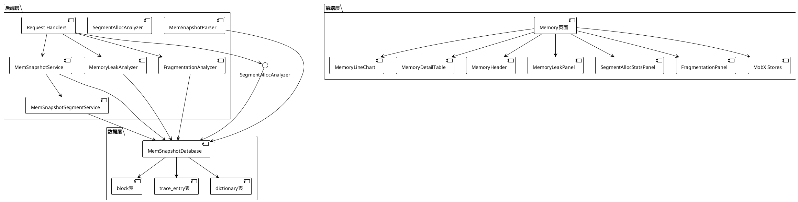
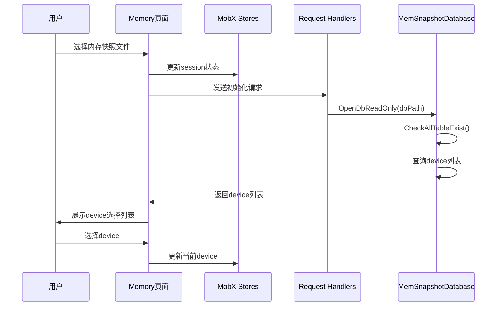
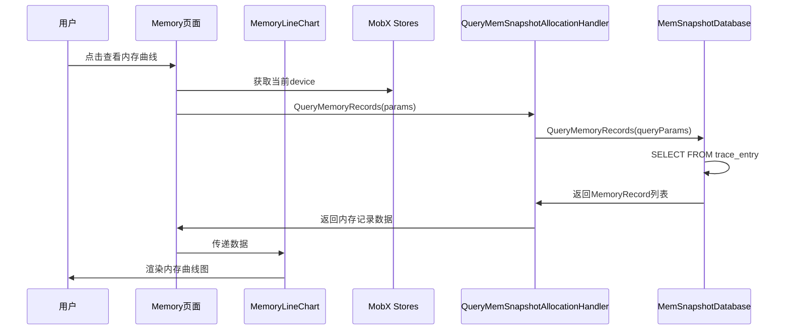
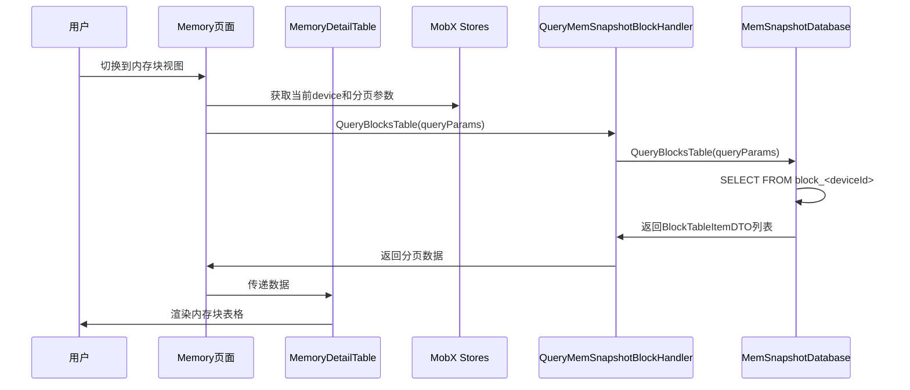
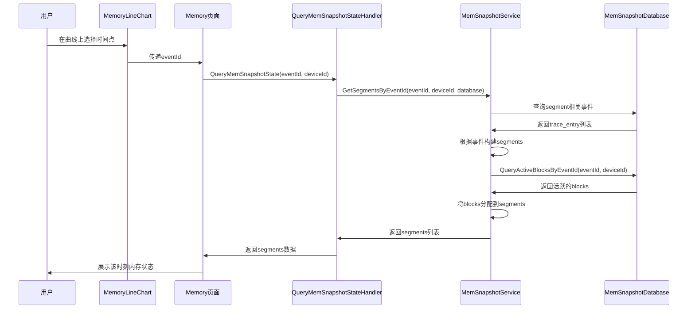
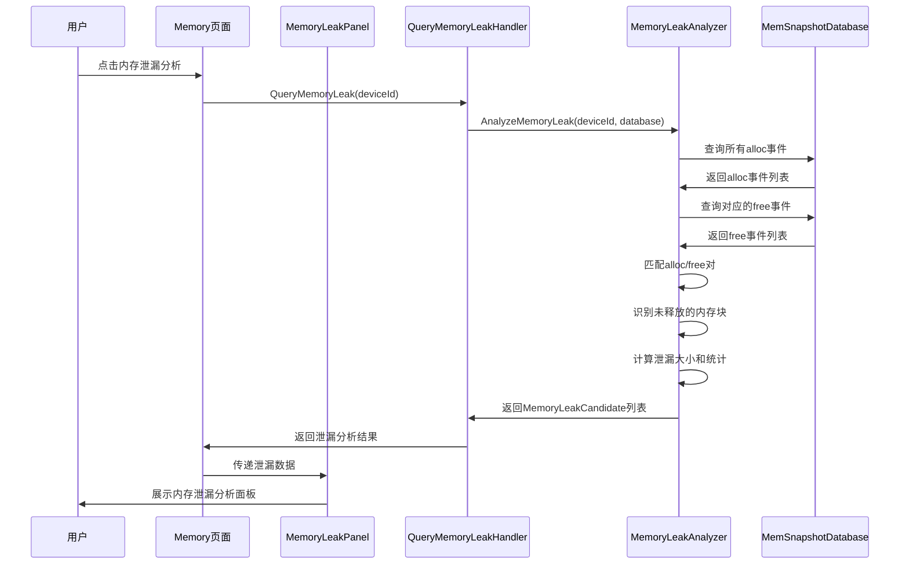
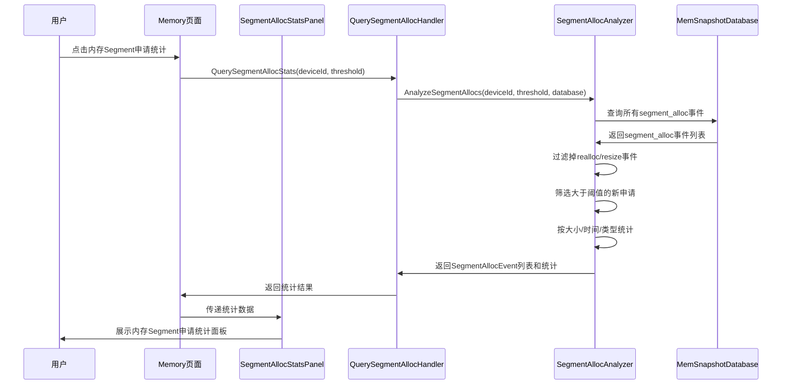
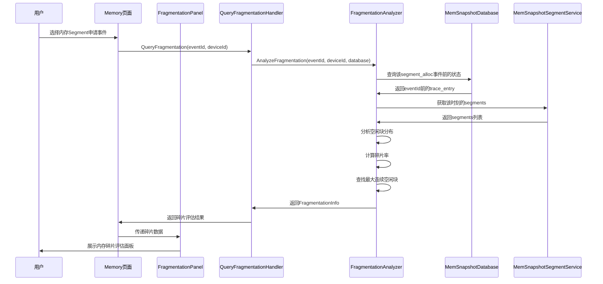

# 支持内存快照展示和分析

状态 (Status): Draft
作者 (Authors): @leo920320
创建日期 (Created): 2026-05-07
更新日期 (Updated): 2026-05-07
相关 Issue/PR: #TBD

---

# 1. 概述

## 1.1 简介

本提案旨在设计和实现MindStudio Insight的snapshot分析支持功能，针对昇腾平台内存分析场景，解决大文件分析效率问题。本方案采用C++后端和React前端架构，使用SQLite数据库存储，支持高效的内存快照分析，包括内存曲线展示、内存块详情查询、事件追踪等功能。

## 1.2 动机

在深度学习训练和推理过程中，内存分析是性能优化的关键环节。当前存在以下痛点：

1. **大文件分析需求**：昇腾平台的内存快照数据量大，需要高效的分析工具
2. **多维度分析**：需要从多个维度（内存总量、内存块、事件等）进行分析
3. **可视化需求**：需要直观的可视化展示来帮助开发者理解内存使用情况
4. **定位问题困难**：需要能够快速定位内存泄漏、内存碎片等问题

为解决上述问题，需要在MindStudio Insight中设计和实现snapshot分析功能，提供完整的内存分析能力。

## 1.3 目标

### 目标

- 支持昇腾平台内存快照数据的高效分析
- 提供内存总量曲线展示（allocated/reserved/active）
- 提供内存块详情查询和展示
- 提供内存事件追踪功能
- 支持多设备（device）的内存分析
- 提供分页、过滤、排序等数据查询能力
- 提供内存泄漏分析功能，识别采集周期内申请未释放的内存
- 提供内存Segment申请事件统计功能
- 提供内存Segment申请前的内存碎片评估功能

### 非目标

- 不改变内存快照的数据采集方式
- 不提供实时内存监控功能（仅分析已采集的快照数据）
- 本次不涉及PyTorch原生snapshot格式的支持
- 不提供自动化内存优化建议

# 2. 用例分析

## 2.1 主要用例

### 用例1：内存总量曲线分析

- **功能点**：展示内存使用量随时间的变化曲线，包括allocated、reserved、active三种指标
- **性能要求**：曲线渲染时间 < 10秒（十万级数据点）
- **交互要求**：支持时间轴缩放、数据点悬停查看详情

### 用例2：内存块详情查询

- **功能点**：查询内存块的详细信息，包括地址、大小、状态、分配/释放事件等
- **性能要求**：分页查询响应时间 < 10秒
- **交互要求**：支持按状态、大小等条件过滤、排序、搜索

### 用例3：内存事件追踪

- **功能点**：查看所有内存操作事件（alloc/free/segment_alloc等）的详细列表
- **性能要求**：分页查询响应时间 < 10秒
- **交互要求**：支持按事件类型、大小等条件过滤、排序

### 用例4：多设备内存分析

- **功能点**：支持选择不同的device查看其内存使用情况
- **性能要求**：device切换响应时间 < 10秒

### 用例5：时间点内存状态分析

- **功能点**：查看指定时间点（事件ID）的内存状态，包括活跃的segments和blocks
- **性能要求**：状态查询时间 < 10秒

### 用例6：内存泄漏分析

- **功能点**：分析采集周期内申请但未释放的内存，识别潜在的内存泄漏点
- **性能要求**：泄漏分析时间 < 5秒
- **交互要求**：支持按泄漏大小、泄漏对象类型等维度排序和筛选

### 用例7：内存Segment申请事件统计

- **功能点**：统计分析新申请的内存Segment事件（排除已申请或预留内存的再分配）
- **性能要求**：统计分析时间 < 10秒
- **交互要求**：支持配置"大Segment"的阈值，按大小、时间等维度统计展示

### 用例8：内存Segment申请前的内存碎片评估

- **功能点**：在内存Segment申请事件发生前，评估当时的内存碎片情况
- **性能要求**：碎片评估时间 < 10秒
- **交互要求**：展示碎片率、碎片分布、最大连续空闲块等指标

## 2.2 DFX要求

### 兼容性

- 支持昇腾平台生成的内存快照数据
- 支持主流Linux发行版（Ubuntu 20.04+, CentOS 8+）和Windows 10+
- 兼容多device场景

### 可维护性

- 提供完善的日志记录
- 模块化设计，便于扩展
- 提供详细的错误提示

### 可测试性

- 提供标准测试数据集
- 支持自动化回归测试
- 提供性能基准测试

### 可靠性

- 使用SQLite数据库，数据持久化可靠
- 支持大文件分析，不会因为数据量大而崩溃
- 完善的异常处理机制

# 3. 方案设计

## 3.1 总体方案

### 3.1.1 系统架构

整体采用前后端分离架构，后端使用C++，前端使用React + TypeScript：

```plain
┌─────────────────────────────────────────────────────────────┐
│                      前端层 (React)                          │
│  ┌─────────────┐  ┌─────────────┐  ┌─────────────────────┐  │
│  │ Memory页面  │  │ 内存曲线图   │  │ 内存详情表格          │ │
│  └─────────────┘  └─────────────┘  └─────────────────────┘  │
│  ┌─────────────┐  ┌─────────────┐                           │
│  │ MobX Store  │  │ 请求工具    │                            │
│  └─────────────┘  └─────────────┘                           │
└─────────────────────────────────────────────────────────────┘
                              │
                              ▼ WebSocket
┌─────────────────────────────────────────────────────────────┐
│                    后端层 (C++)                              │
│  ┌─────────────┐  ┌─────────────┐  ┌─────────────────────┐  │
│  │ 请求处理器   │  │ 服务层      │   │ Segment服务         │  │
│  └─────────────┘  └─────────────┘  └─────────────────────┘  │
└─────────────────────────────────────────────────────────────┘
                              │
                              ▼
┌─────────────────────────────────────────────────────────────┐
│                    数据层 (SQLite)                           │
│  ┌─────────────┐  ┌─────────────┐  ┌─────────────────────┐  │
│  │ block表     │  │trace_entry表│  │ dictionary表        │   │
│  └─────────────┘  └─────────────┘  └─────────────────────┘  │
└─────────────────────────────────────────────────────────────┘
```

### 3.1.2 核心组件

以下是系统的核心组件UML组件图：



**组件描述**：

**后端组件**：

1. **MemSnapshotDatabase**：数据库访问层，封装了所有SQLite数据库操作，提供查询block、trace_entry、memory_record等数据的接口
2. **MemSnapshotService**：核心服务层，提供内存快照的高级查询功能，如获取指定时间点的segments状态
3. **MemSnapshotSegmentService**：Segment专项服务，继承自MemSnapshotService，专门处理内存段（Segment）相关的构建和查询逻辑
4. **MemoryLeakAnalyzer**：内存泄漏分析器，负责分析采集周期内申请但未释放的内存，识别潜在的内存泄漏点
5. **SegmentAllocAnalyzer**：内存Segment申请分析器，负责统计新申请的内存Segment事件（排除已申请或预留内存的再分配）
6. **FragmentationAnalyzer**：内存碎片分析器，负责在内存Segment申请前评估当时的内存碎片情况
7. **Request Handlers**：HTTP请求处理器，处理前端的API请求，包括QueryMemSnapshotAllocationHandler、QueryMemSnapshotBlockHandler、QueryMemoryLeakHandler等
8. **MemSnapshotParser**：解析器，负责解析原始内存快照数据并导入到SQLite数据库中

**前端组件**：

1. **Memory页面**：主页面组件，整合所有内存分析功能，作为用户交互的入口
2. **MemoryLineChart**：内存曲线图组件，使用ECharts渲染allocated/reserved/active三条曲线
3. **MemoryDetailTable**：内存详情表格组件，支持分页、过滤、排序功能，展示block或event列表
4. **MemoryHeader**：页面头部组件，提供device选择、数据类型切换等功能
5. **MemoryLeakPanel**：内存泄漏分析面板，展示潜在的内存泄漏点和统计信息
6. **SegmentAllocStatsPanel**：内存Segment申请统计面板，展示内存Segment申请事件的统计分析
7. **FragmentationPanel**：内存碎片评估面板，展示内存Segment申请前的内存碎片情况
8. **MobX Stores**：状态管理层，包括memoryStore、sessionStore等，管理应用状态

**数据结构**：

1. **TraceEntry**：内存事件数据结构，记录alloc、free、segment_alloc等操作的详细信息
2. **Block**：内存块数据结构，记录内存块的地址、大小、状态、分配/释放事件ID等
3. **Segment**：内存段数据结构，记录大的内存段信息及其包含的blocks
4. **MemoryRecord**：内存记录数据结构，记录某一时刻的allocated/reserved/active值
5. **MemoryLeakCandidate**：内存泄漏候选数据结构，记录潜在的内存泄漏信息（地址、大小、类型、分配时间等）
6. **SegmentAllocEvent**：内存Segment申请事件数据结构，记录新申请的内存Segment事件信息
7. **FragmentationInfo**：内存碎片信息数据结构，记录碎片率、碎片分布、最大连续空闲块等指标

### 3.1.3 核心流程

#### 数据加载流程



---

#### 内存曲线查询流程



---

#### 内存块查询流程



---

#### 时间点内存状态查询流程



---

#### 内存泄漏分析流程



---

#### 内存Segment申请事件统计流程



---

#### 内存Segment申请前的内存碎片评估流程



## 3.2 技术选型

### 3.2.1 已实现的技术方案

| 层级 | 技术选型 | 说明 |
|------|----------|------|
| 后端语言 | C++ | 高性能，适合处理大数据 |
| 前端框架 | React + TypeScript | 类型安全，生态丰富 |
| 状态管理 | MobX | 简单易用，适合中型应用 |
| 数据库 | SQLite | 嵌入式数据库，适合桌面应用 |
| 可视化 | ECharts/自定义组件 | 灵活的图表展示 |

### 3.2.2 核心技术选择理由

1. **SQLite数据库**：
   - 优点：嵌入式、零配置、事务支持、成熟稳定
   - 适用场景：桌面应用、需要持久化存储的场景
   - 实现：数据存储在block和trace_entry表中，支持多device（表名加deviceId后缀）

2. **分页查询**：
   - 实现：后端支持分页、过滤、排序参数
   - 优点：避免一次性加载大量数据，提升响应速度

3. **字典表**：
   - 实现：使用dictionary表存储枚举值映射
   - 优点：节省存储空间，便于国际化

## 3.3 数据模型设计

### 3.3.1 主要数据表结构

**block表**（记录内存块信息）：

- id: 内存块ID
- address: 内存地址
- size: 大小
- requested_size: 请求大小
- state: 状态（inactive/active_allocated/active_pending_free）
- alloc_event_id: 分配事件ID
- free_event_id: 释放事件ID

**trace_entry表**（记录内存事件）：

- id: 事件ID
- action: 事件类型（segment_map/segment_unmap/segment_alloc/segment_free/alloc/free_requested/free_completed/workspace_snapshot）
- address: 地址
- size: 大小
- stream: stream ID
- allocated: 分配总量
- active: 活跃总量
- reserved: 保留总量
- callstack: 调用栈

**dictionary表**（字典映射表）：

- table_name: 表名
- column_name: 列名
- int_val: 整数值
- real_val: 实际值

### 3.3.2 事件类型定义

```cpp
const std::string TRACE_ENTRY_ACTION_SEG_MAP = "segment_map";
const std::string TRACE_ENTRY_ACTION_SEG_UNMAP = "segment_unmap";
const std::string TRACE_ENTRY_ACTION_SEG_ALLOC = "segment_alloc";
const std::string TRACE_ENTRY_ACTION_SEG_FREE = "segment_free";
const std::string TRACE_ENTRY_ACTION_ALLOC = "alloc";
const std::string TRACE_ENTRY_ACTION_FREE_REQUESTED = "free_requested";
const std::string TRACE_ENTRY_ACTION_FREE_COMPLETED = "free_completed";
const std::string TRACE_ENTRY_ACTION_WORKSPACE = "workspace_snapshot";
```

### 3.3.3 内存块状态定义

```cpp
const std::string BLOCK_STATE_INACTIVE = "inactive";
const std::string BLOCK_STATE_ACTIVE_ALLOC = "active_allocated";
const std::string BLOCK_STATE_ACTIVE_PENDING_FREE = "active_pending_free";
```

### 3.3.4 新增数据结构定义

**MemoryLeakCandidate**（内存泄漏候选对象）：

- id: 候选ID
- address: 内存地址
- size: 泄漏大小
- allocTime: 分配时间
- allocEventId: 分配事件ID
- objectType: 对象类型（从callstack或元数据推断）
- callstack: 分配调用栈
- confidence: 泄漏置信度（0-100）

**SegmentAllocEvent**（内存Segment申请事件）：

- eventId: 事件ID
- address: 内存地址
- size: 申请大小
- timestamp: 时间戳
- isNewAlloc: 是否新申请（true排除realloc）
- streamId: stream ID
- callstack: 调用栈

**FragmentationInfo**（内存碎片信息）：

- eventId: 对应的alloc事件ID
- fragmentationRate: 碎片率（0-100%）
- totalFreeSize: 总空闲大小
- freeBlockCount: 空闲块数量
- largestFreeBlock: 最大连续空闲块大小
- largestFreeBlockAddress: 最大空闲块地址
- freeBlockSizeDistribution: 空闲块大小分布（分位数统计）

## 3.4 安全隐私与DFX设计

### 3.4.1 安全设计

1. **数据安全**
   - 数据存储在本地SQLite文件中，不上传
   - 数据库文件权限控制
   - 支持只读方式打开数据库

2. **访问控制**
   - 文件系统权限检查
   - 工作区隔离

### 3.4.2 可维护性设计

1. **日志管理**
   - 详细的操作日志记录
   - 各模块有独立的LOG_TAG
   - 错误日志和堆栈信息

2. **模块化设计**
   - 数据库层、服务层、请求处理层分离
   - 清晰的接口定义
   - 便于单元测试

3. **异常处理**
   - 完善的异常捕获和处理机制
   - 返回有意义的错误信息

### 3.4.3 可靠性设计

1. **数据库事务**
   - 使用SQLite事务保证数据一致性
   - 只读模式打开，避免数据损坏

2. **多device支持**
   - 表名按deviceId后缀区分
   - 支持查询device列表

3. **懒加载**
   - block_id_range等数据懒查询
   - 提升初始化速度

## 3.5 API接口设计

### 3.5.1 主要API接口

#### 查询内存记录（内存曲线）

- **接口**：QueryMemSnapshotAllocation
- **功能**：查询内存使用量随时间的变化
- **参数**：
  - deviceId: 设备ID
  - 分页参数
- **返回**：MemoryRecord列表（allocated/reserved/active）

#### 查询内存块列表

- **接口**：QueryMemSnapshotBlock
- **功能**：分页查询内存块信息
- **参数**：
  - deviceId: 设备ID
  - 分页参数
  - 过滤条件
  - 排序参数
- **返回**：BlockTableItemDTO列表

#### 查询内存事件列表

- **接口**：QueryMemSnapshotEvent
- **功能**：分页查询内存事件
- **参数**：
  - deviceId: 设备ID
  - 分页参数
  - 过滤条件
  - 排序参数
- **返回**：TraceEntryTableItemDTO列表

#### 查询指定时间点的内存状态

- **接口**：QueryMemSnapshotState
- **功能**：查询指定事件ID时的内存状态
- **参数**：
  - eventId: 事件ID
  - deviceId: 设备ID
- **返回**：Segment列表

#### 查询详情

- **接口**：QueryMemSnapshotDetail
- **功能**：查询单个block或event的详细信息
- **参数**：
  - type: 类型（block/event）
  - id: ID
  - deviceId: 设备ID
- **返回**：详细信息

#### 内存泄漏分析

- **接口**：QueryMemoryLeak
- **功能**：分析采集周期内申请但未释放的内存，识别潜在的内存泄漏点
- **参数**：
  - deviceId: 设备ID
  - minSize: 最小泄漏大小（可选，默认0）
- **返回**：
  - MemoryLeakCandidate列表（泄漏候选对象）
  - 泄漏统计信息（总泄漏大小、泄漏次数、按类型统计等）

#### 内存Segment申请事件统计

- **接口**：QuerySegmentAllocStats
- **功能**：统计分析新申请的内存Segment事件（排除已申请或预留内存的再分配）
- **参数**：
  - deviceId: 设备ID
  - threshold: 大Segment阈值（字节，默认1MB）
  - groupBy: 分组维度（size/time/type，默认size）
- **返回**：
  - SegmentAllocEvent列表（Segment申请事件）
  - 统计信息（总申请次数、总申请大小、分布统计等）

#### 内存Segment申请前的内存碎片评估

- **接口**：QueryFragmentation
- **功能**：在内存Segment申请事件发生前，评估当时的内存碎片情况
- **参数**：
  - eventId: 内存Segment申请事件ID
  - deviceId: 设备ID
- **返回**：
  - FragmentationInfo（碎片信息）
  - 碎片率、碎片分布、最大连续空闲块等指标

# 4. 测试设计

## 4.1 单元测试

- 测试数据库查询功能
- 测试服务层逻辑
- 测试Segment构建逻辑
- 测试边界条件
- 测试MemoryLeakAnalyzer的泄漏识别逻辑
- 测试SegmentAllocAnalyzer的Segment筛选和统计逻辑
- 测试FragmentationAnalyzer的碎片评估算法

## 4.2 集成测试

- 测试完整的查询流程
- 测试前后端交互
- 测试多device场景
- 测试大数据库性能
- 测试内存泄漏分析的完整流程
- 测试内存Segment申请统计的完整流程
- 测试内存碎片评估的完整流程

## 4.3 端到端测试

- 测试完整的用户操作流程
- 测试内存曲线展示
- 测试内存块查询
- 测试时间点状态查询
- 测试内存泄漏分析的端到端功能
- 测试内存Segment申请统计的端到端功能
- 测试内存碎片评估的端到端功能

## 4.4 性能测试

- 测试大表查询性能
- 测试分页查询响应时间
- 测试前端渲染性能
- 测试内存泄漏分析的性能（目标<5秒）
- 测试内存Segment申请统计的性能（目标<3秒）
- 测试内存碎片评估的性能（目标<4秒）

# 5. 缺点和风险

## 6.1 潜在风险

1. **大数据库性能**
   - 风险：数据量非常大时，查询性能可能下降
   - 应对：已实现分页查询，可考虑添加索引优化

2. **SQLite并发**
   - 风险：SQLite并发写入能力有限
   - 应对：使用只读模式打开，使用recursive_mutex保护

3. **数据格式变更**
   - 风险：未来数据格式可能变更
   - 应对：版本兼容设计，字典表支持枚举变更

## 6.2 对现有用户的影响

- 功能已实现并集成，用户可以直接使用
- 不影响其他功能

# 7. 未解决问题

1. 是否需要支持PyTorch原生snapshot格式？
2. 是否需要添加自动化内存泄漏检测功能？
3. 是否需要添加更多可视化视图（内存碎片图等）？
4. 性能是否需要进一步优化？

---

## 附录

### 参考资料

- SQLite官方文档：<https://www.sqlite.org/docs.html>
- React官方文档：<https://react.dev/>
- MobX官方文档：<https://mobx.js.org/>

### 术语表

- **Snapshot**：内存快照，记录内存使用状态
- **Block**：内存块，记录内存分配的基本单位
- **Segment**：内存段，大的内存分配区域
- **Trace Entry**：内存事件，记录alloc、free等操作
- **SQLite**：嵌入式SQL数据库引擎

### 文档更新计划

- 2026-05-07：初始版本创建
- 后续根据评审意见更新

- **
