# Communication部分设计文档

## 1. 文档目标与范围

本文说明 `cluster/communication` 页面相关的数据来源、接口命令和前后端代码入口，面向需要维护通信矩阵、通信耗时、算子列表、带宽和分布图的开发者。

- 支持 TEXT 与 DB 两种数据场景。
- 页面中的截图仅作为辅助，关键接口、路径和数据映射以正文为准。

## 2. 接口与数据映射关系

### 2.1 原始数据（ATT 处理后文件）

#### text 场景

#### db 场景

### 2.2 处理后 DB 数据内容

#### text 场景

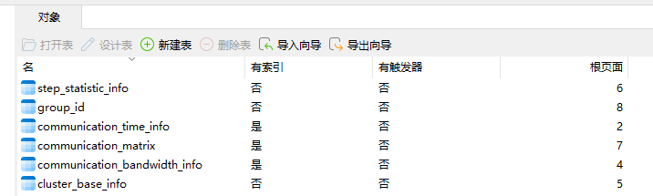

#### db 场景

### 2.3 页面接口总览

| 页面数据 | URL 请求 | db 数据类型 | text 数据类型 | 说明 |
| --- | --- | --- | --- | --- |
| 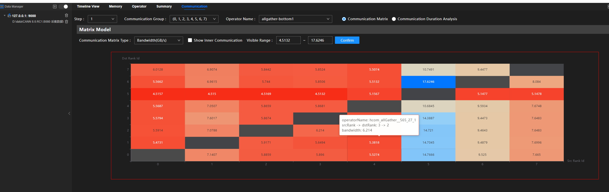 | `communication/matrix/bandwidthInfo` |  | 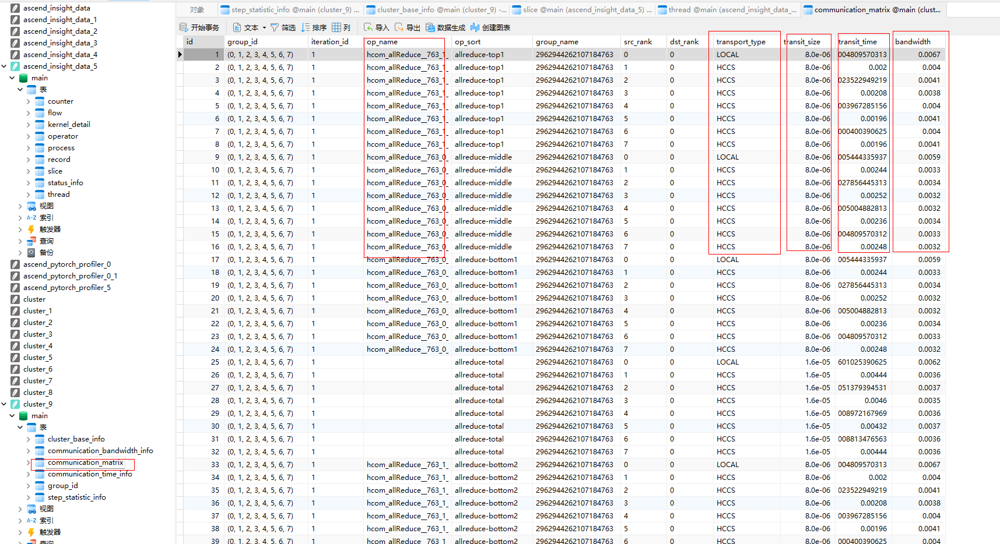  | 矩阵带宽详情。 |
|  | `communication/duration/iterations` |  | 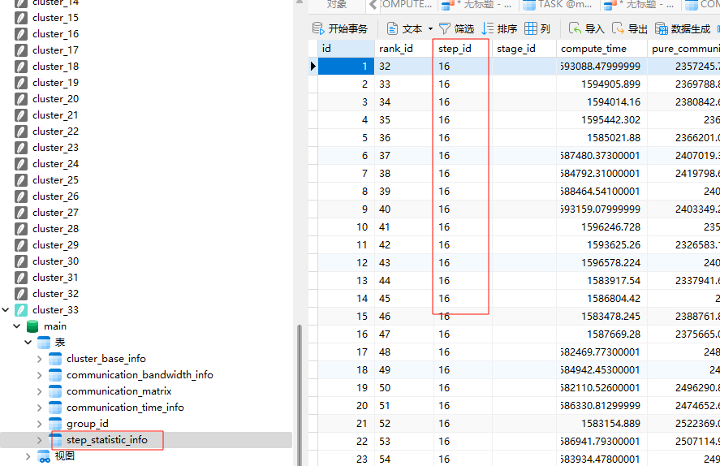 | 迭代列表与通信耗时范围。 |
|  | `communication/matrix/group` | 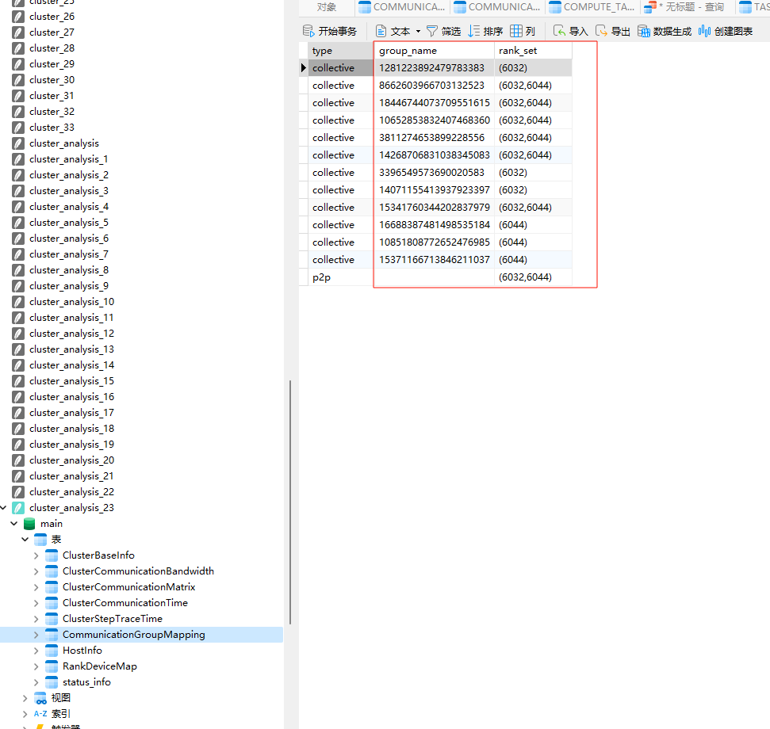 |  底层数据来源于： | 通信矩阵分组信息。 |
|  | `communication/matrix/sortOpNames` |  | 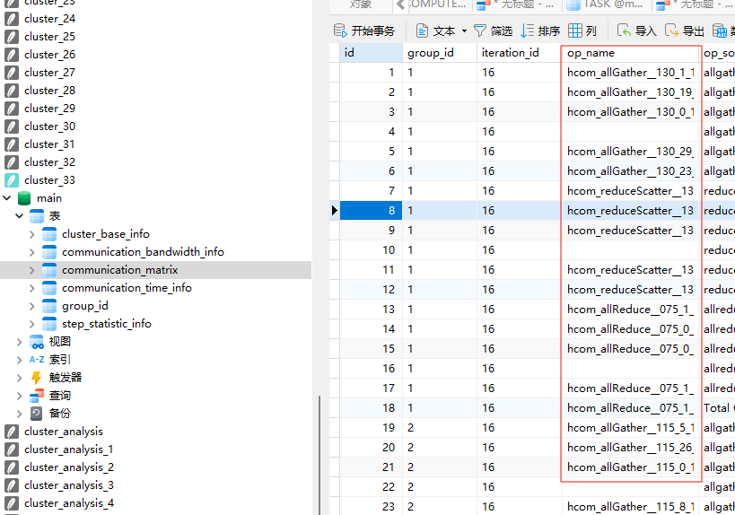 底层数据： | 算子名排序与聚合结果；DB 场景是否支持需以源码实现为准。 |
| 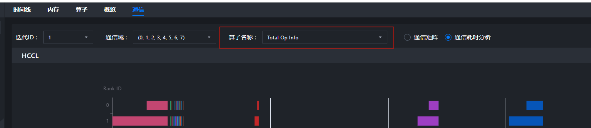 | `communication/duration/operatorNames` | 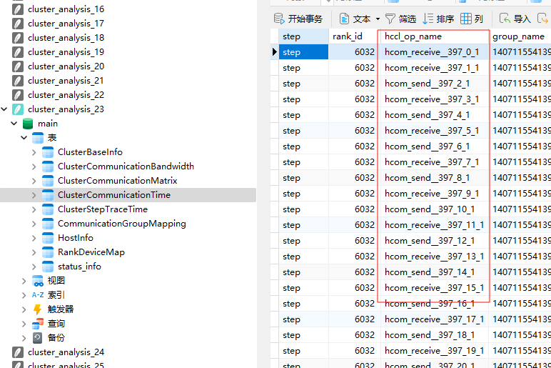 | 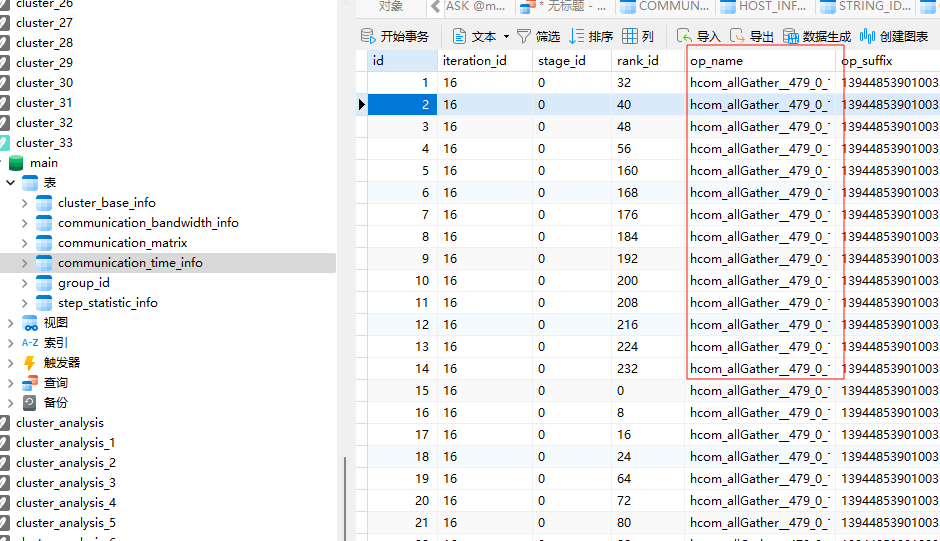 数据：  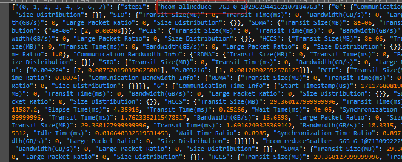 | 通信耗时视图中的算子名列表。 |
| 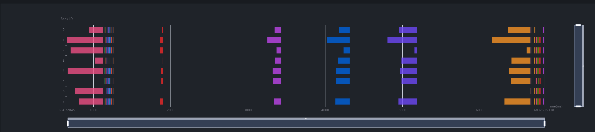 | `communication/operatorLists` |  | 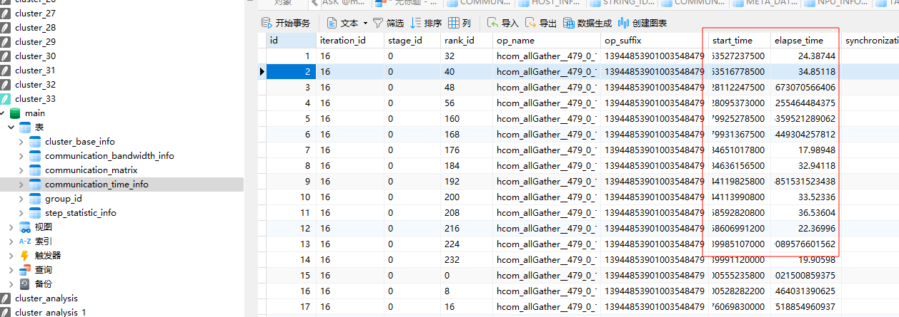 数据： | 算子列表视图。 |
|  | `communication/duration/list` |  |   | 通信耗时明细列表，专家建议由数据计算得到。 |
|  | `communication/operatorDetails` |  |  | 算子详情。 |
|  | `communication/distribution` | 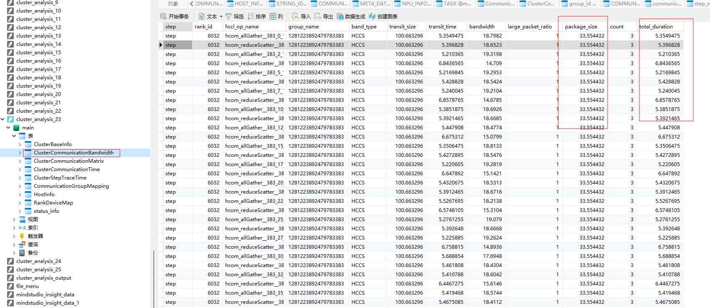 | 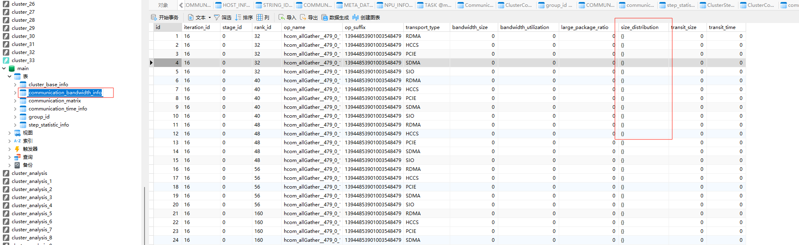 | 通信分布图。 |
| 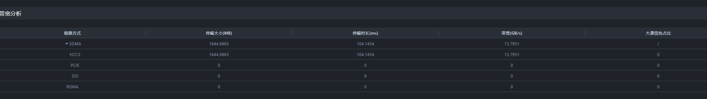 | `communication/bandwidth` | 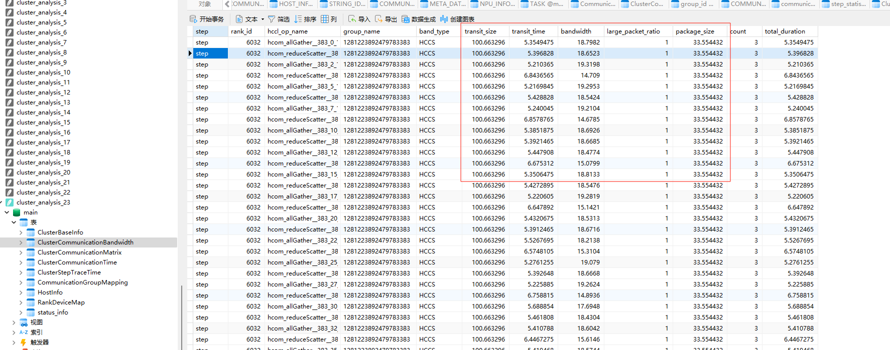 | 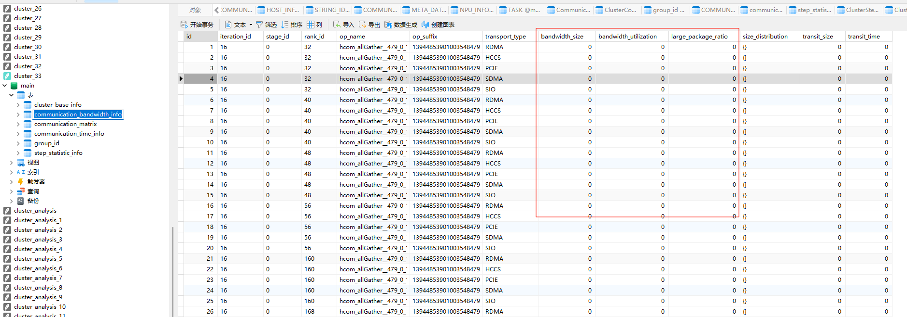 | 带宽分析。 |

### 2.4 代码入口

- 前端请求封装：`modules/cluster/src/utils/RequestUtils.ts`
- 后端命令常量：`server/src/modules/defs/ProtocolDefs.h`
- 后端插件：`server/src/modules/communication/CommunicationPlugin.h`
- 插件注册：`server/src/modules/Plugins.cpp`
- 协议测试：`server/src/test/modules/communication/protocol/CommunicationProtocolUtilTest.cpp`
- 请求样例：`server/src/test/test_data/request.csv`

### 2.5 说明

- `text` 与 `db` 仅表示数据来源不同，页面能力和接口命名保持一致。
- 表格中的图片仍保留，用于辅助快速定位 UI，但不作为唯一信息来源。
- `sortOpNames` 的 DB 场景支持情况、专家建议的具体算法、每个接口的完整响应字段，需以源码和测试结果为准。
