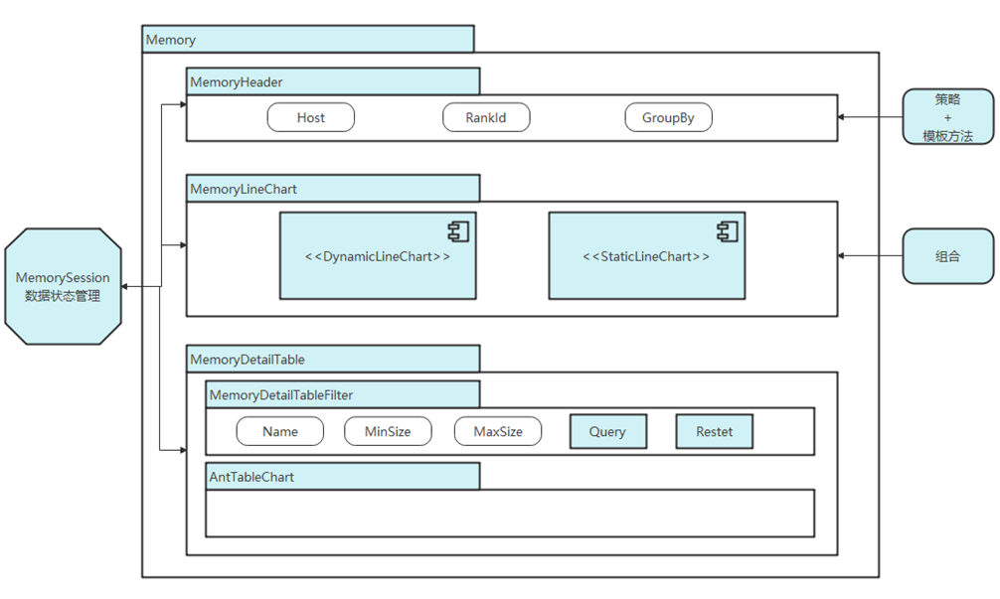
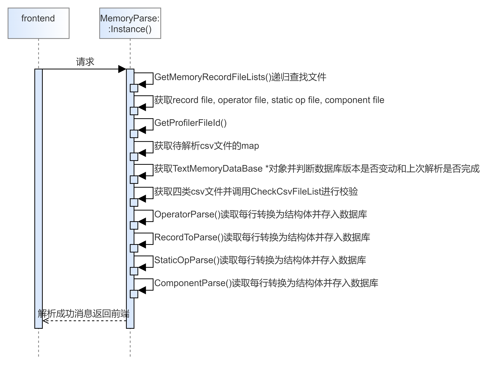
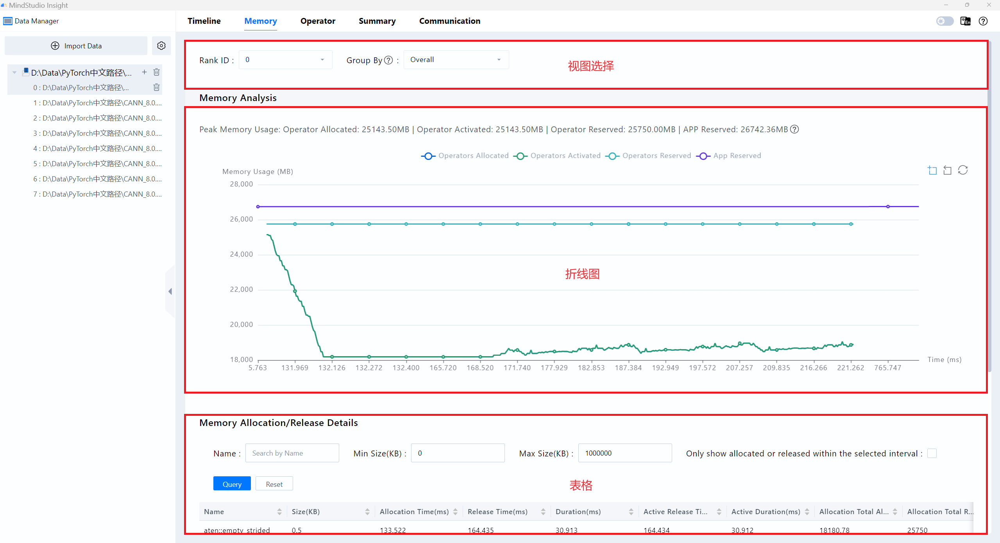

# Memory部分设计文档

## 1. 文档目标与范围

本文说明 Memory 页面前后端的数据流、主要视图、数据来源和查询能力，面向需要维护内存调优、对比和筛选能力的开发者。

- 支持 TEXT 与 DB 两类数据场景。
- 支持动态图、静态图和组件级视图。
- 文档中的截图仅辅助说明，关键数据来源与 handler 以正文和源码为准。

## 2. Memory前端逻辑

Memory 界面主要由三部分组成：视图选择、折线图和表格。

- 视图选择：选择 `rankId`、分组方式；DB 场景下还可选择 `hostName`。
- 折线图：展示内存随时间变化的趋势，动态图与静态图的图表数量不同，但使用相同的数据组织方式。
- 表格：展示 CSV/DB 对应的明细数据，支持名称、size 等条件筛选；组件视图不支持查询。

相关界面示意：

**Memory界面优化主要思路**

**Memory界面主体架构**

**Memory界面Header具体实现**

**Memory界面折线图具体实现**

**Memory界面底部表格具体实现**

## 3. Memory界面后端代码逻辑

### 3.1 文件解析

MindStudio Insight 的文件解析入口是 `ImportActionHandler`。不同数据格式会调用不同解析器：

- TEXT：`Memory::MemoryParse::Instance().Parse()`
- DB：`FullDb::FullDbParser::Instance().Parse()`

**TEXT 文件解析顺序图**

TEXT 格式解析后会写入数据库；DB 格式解析基本保持原样。

### 3.2 数据查询

查询请求从前端发起后，经后端 handler 和 database 层返回结果：

**数据查询顺序图**

- `server/src/modules/memory/protocol`：负责 JSON 与 request/response 结构体转换。
- `server/src/modules/memory/database`：负责查询 `TextMemoryDataBase` 和 `DbMemoryDataBase`。
- `server/src/modules/memory/handler`：负责具体业务查询和比对逻辑。

当前文档中可确认支持的 handler 包括：

- `QueryMemoryOperatorHandler`：动态图表格
- `QueryMemoryStaticOperatorListHandler`：静态图表格
- `QueryMemoryViewHandler`：动态图折线图
- `QueryMemoryStaticOperatorGraphHandler`：静态图折线图
- `QueryMemoryComponentHandler`：组件级表格

### 3.3 说明

`TinyMock` 仅作为内部接口查看工具的补充，不应作为文档唯一来源。若需补充具体请求字段，应优先以源码中的 protocol 定义和测试样例为准。

## 4. 业务流程

**Memory业务流程图**

### 4.1 视图选择

视图选择部分可以在下拉框中选择 `rankId` 和分组方式；DB 格式数据还可以选择 `hostName`。`hostName` 与 `rankId` 的组合可定位单卡。

分组方式包括：

- 全局
- 流
- 组件

### 4.2 数据来源

- 动态图：折线图来自 `memory_record.csv`，表格来自 `operator_memory.csv`。
- 静态图：折线图来自 `memory_record.csv` 和 `static_op_mem.csv`，表格来自 `static_op_mem.csv`。
- 组件视图：折线图来自 `memory_record.csv`，表格来自 `npu_module_mem.csv`。

### 4.3 折线图

图例由 `std::vector<std::string> legends` 表示，折线由 `std::vector<std::vector<std::string>> lines` 表示。`lines[index]` 对应一条横坐标位置的完整数据，和 `legends` 的顺序一一对应。

### 4.4 表格与筛选

表格支持：

- 名称模糊查询
- size 上下界筛选
- 时间范围框选联动
- 排序

动态图框选后展示时间范围；静态图对应 node index 范围。勾选“Only show allocated or released within the selected interval”后，仅显示选中区间内申请或释放相关的算子。

### 4.5 对比功能

文档中的对比功能截图保留为参考：

具体比对算法、字段语义与异常处理，以 `QueryMemory*Handler` 的源码和测试为准。

## 5. 验证方法

- 导入 TEXT 和 DB 数据，检查视图选择、折线图和表格是否可用。
- 验证名称、size、框选、排序和对比功能是否符合预期。
- 验证动态图、静态图和组件视图是否使用对应数据源。
- 对新增字段或筛选项，先更新 parser / database / handler，再同步前端列配置和文案。
