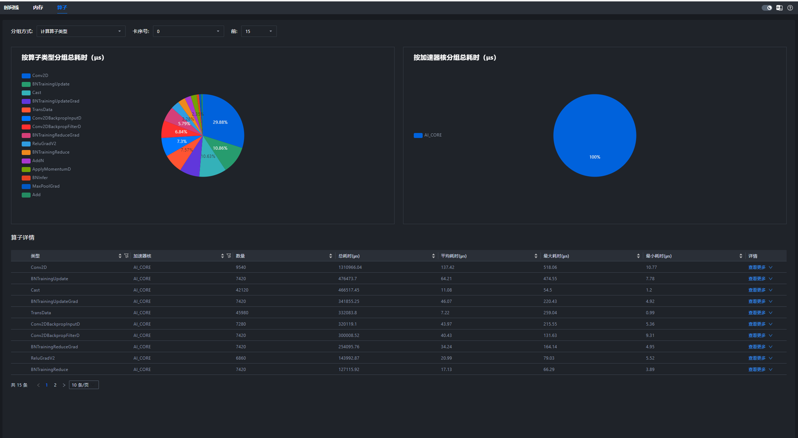
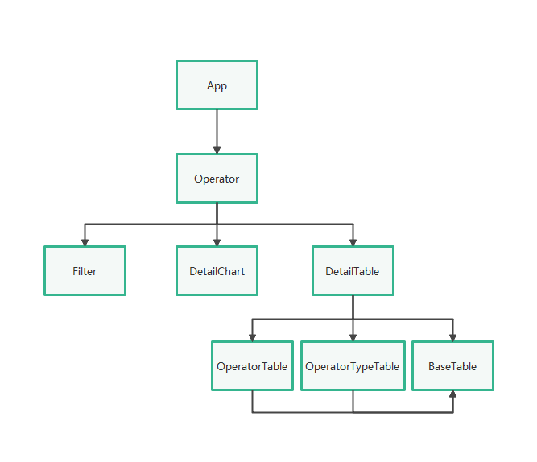
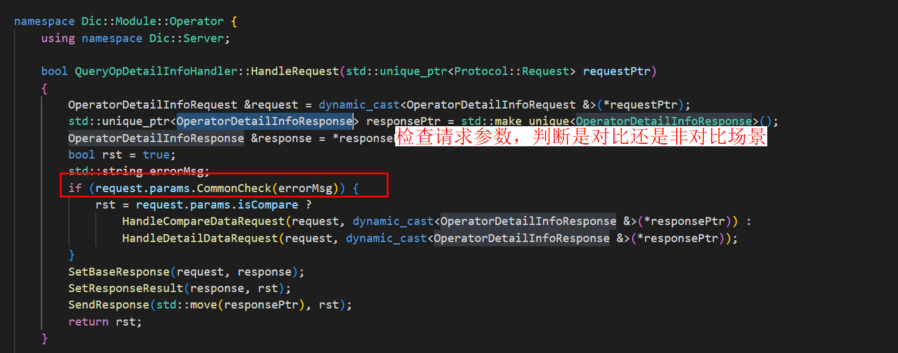
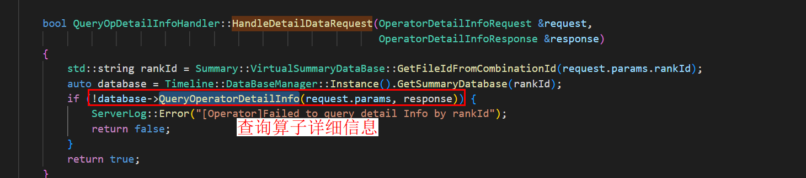
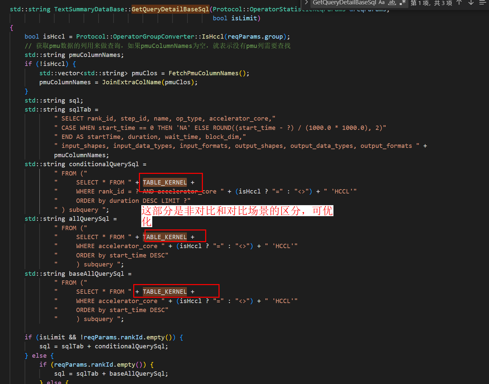
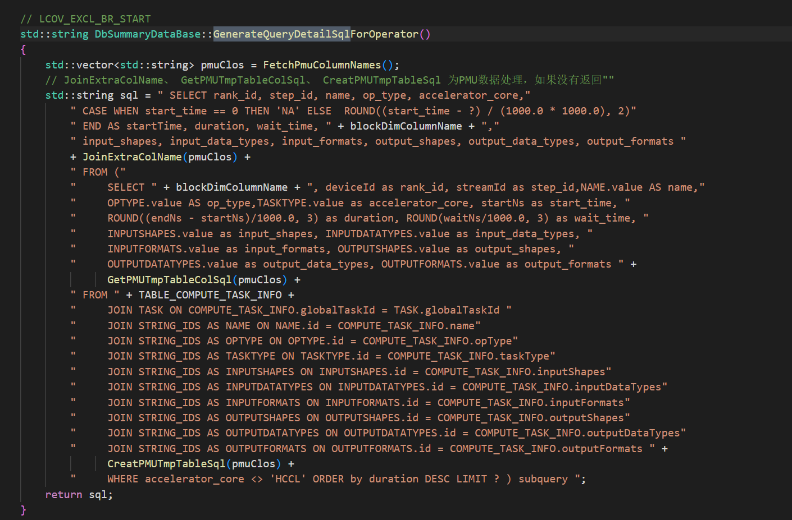

# Operator部分设计文档

## 1. 文档目标与范围

本文说明 Operator 页面前后端的请求链路、数据查询场景和表格展示逻辑，面向需要维护算子详情、筛选和比对能力的开发者。

- 支持 TEXT 和 DB 两种数据场景。
- 页面由过滤条件、饼图和详情表格组成。

## 2. Operator界面前端代码逻辑

Operator 界面前端主要分为三个部分：上方过滤条件、中间饼图、下方详情表格。

对应代码块：

- `Filter.tsx`
- `DetailChart.tsx`
- `DetailTable.tsx`
- `BaseTable`

其余需要关注的代码：

- `modules/operator/src/connection/handler.ts`
- `modules/operator/src/components/RequestUtils.ts`
- `modules/operator/src/components/TableColumnConfig.tsx`

相关界面示意：

**Operator界面**



**主体逻辑结构图**



## 3. Operator界面后端代码逻辑

以 `QueryOpDetailInfoHandler` 为例，算子详情请求的处理链路如下：

1. 前端发送 `operator/details` 请求。
2. `ProtocolDefs.h` 中定义 `REQ_RES_OPERATOR_DETAIL_INFO = "operator/details"`。
3. `OperatorModule.cpp` 根据请求字符串注册并分发到对应 handler。
4. `QueryOpDetailInfoHandler` 负责查询数据库并组装结果。
5. `OperatorProtocol.cpp` 负责请求/响应结构与 JSON 的转换。
6. 返回前端后，详情表和饼图根据响应数据刷新。

**QueryOpDetailInfoHandler处理逻辑**



**查询数据库拿到参数**



### 3.1 前置信息（周边组件功能支撑）

当前文档可确认的周边支撑只有数据库管理入口：

```c++
auto database = Timeline::DataBaseManager::Instance().GetSummaryDatabase(rankId);
```

**database管理**


`KernelParser`、`dbManager` 和全量 DB 结构的完整说明需以源码为准；若后续确认，可补充到此处。

### 3.2 TEXT 和 DB 数据库

#### TEXT 场景

当 `type=TEXT` 时，数据存储在 `kernelTable` 中，查询通常可直接通过 SQL 完成。

**TEXT 场景示意**



`pmuColumnNames` 是查询算子详细信息时的表头，主要承载寄存器相关信息。

#### DB 场景

`type=DB` 时需要多表联查。

**DB 场景示意**



### 3.3 返回数据

返回数据会在后端转换为 JSON 再回传前端。

**返回数据并转换成 JSON 给前端**


## 4. 开发与验证建议

### 4.1 新增接口或筛选项时

- 先确认数据来源是 TEXT 还是 DB。
- 后端先补查询逻辑，再补 protocol 响应字段。
- 前端同步更新表格列配置与 i18n 文案。
- 如果涉及排序、分页或比对，需要同步补测试。

### 4.2 验证方法

- 导入算子调优数据，检查过滤条件、饼图和详情表格是否正常显示。
- 验证 TEXT 与 DB 场景下的详情查询结果是否一致。
- 验证新增列或筛选项时，前端与后端字段名是否保持一致。
