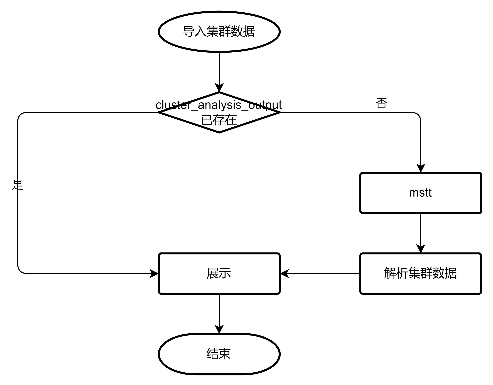
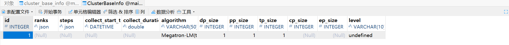

# Summary 设计文档

## 1. 文档目标与范围

本文说明 `cluster/summary` 页面相关的数据来源、分析工具、接口命令和展示逻辑，面向需要维护集群概览、并行策略、通信域性能和单卡详情的开发者。

- 支持 TEXT 与 DB 两种集群数据场景。
- 当前文档主要覆盖 PyTorch 训练 profiler 数据导入后的 Summary 展示。
- 页面截图用于辅助理解，关键接口、数据来源和维护注意事项以正文表格为准。

## 2. 数据来源与预处理

### 2.1 原始集群数据

Summary 页面依赖集群分析后的汇总数据。原始数据来自 PyTorch 训练 profiling 结果。

#### TEXT 场景

典型目录结构如下：

```text
localhost.localdomain_139247_20230628101435_ascend_pt
├── profiler_info.json
├── profiler_metadata.json
└── ASCEND_PROFILER_OUTPUT
    ├── communication.json
    └── communication_matrix.json
```

其中：

- `communication.json`：为多卡或集群等存在通信的场景提供通信耗时可视化数据基础。
- `communication_matrix.json`：提供通信小算子基本信息。
- 生成上述文件通常需要配置 `experimental_config` 中的 `profiler_level` 为 `torch_npu.profiler.ProfilerLevel.Level1` 或 `torch_npu.profiler.ProfilerLevel.Level2`。

#### DB 场景

典型目录结构如下：

```text
localhost.localdomain_139247_20230628101435_ascend_pt
├── profiler_info.json
├── profiler_metadata.json
└── ASCEND_PROFILER_OUTPUT
    └── analysis.db
```

当 `export_type=torch_npu.profiler.ExportType.Db` 时，`ASCEND_PROFILER_OUTPUT` 下生成 `.db` 文件，其他 JSON/CSV 文件通常不再生成。

采集方式参考：[昇腾 Profiling 采集文档](https://www.hiascend.com/document/detail/zh/mindstudio/82RC1/T&ITools/Profiling/atlasprofiling_16_0090.html)。

### 2.2 mstt 集群分析工具

Summary 和 Communication 页面依赖 mstt 集群分析工具的处理结果。工具说明参考：[mstt 集群分析工具](https://gitcode.com/Ascend/mstt/blob/master/profiler/msprof_analyze/README.md)。

| 平台 | 启动方式 |
| --- | --- |
| Windows | `cluster_analysis.exe -d . -m mode` |
| Linux | `python3 cluster_analysis.py -d . -m mode` |
| macOS | `cluster_analysis -d . -m mode` |

Linux 通常通过 Python 启动，是因为多数 Linux 发行版默认带 Python 解释器；Windows 和 macOS 为降低用户未安装 Python 的风险，通常使用 PyInstaller 将 Python 解释器和分析脚本打包成可执行文件。

DB 格式数据通常还会附加：

```shell
--data_simplification
```

`mode` 选项包括：

| mode | 说明 |
| --- | --- |
| `all` | 处理全部集群分析数据 |
| `communication_time` | 处理通信耗时相关数据 |
| `communication_matrix` | 处理通信矩阵相关数据 |

### 2.3 mstt 输出件

#### TEXT 输出

```text
cluster_analysis_output
├── cluster_step_trace_time.csv
├── cluster_communication_matrix.json
├── cluster_communication.json
└── communication_group.json
```

TEXT 数据解析过程：


- `mode == communication_matrix` 时，主要处理 `cluster_communication_matrix.json`、`cluster_step_trace_time.csv`、`communication_group.json`。
- `mode == communication_time` 时，主要处理 `cluster_communication.json`。

#### DB 输出

```text
cluster_analysis_output
└── cluster_analysis.db
```

DB 数据解析过程：



## 3. Summary 页面数据展示

### 3.1 页面能力总览

| 页面区域 | 接口命令 | TEXT 数据来源 | DB 数据来源 | 说明 |
| --- | --- | --- | --- | --- |
| 基本信息 | `summary/queryTopData` | `cluster_base_info` 表 | `ClusterBaseInfo` 表 | 展示集群任务、卡数、通信等顶部概要信息。 |
| 并行策略生成 | `summary/set/parallelStrategy` | 用户配置或文件读取的并行策略参数 | 用户配置或文件读取的并行策略参数 | 根据 TP/CP/EP/DP/PP 等参数生成并行策略。 |
| 并行策略展示 | `parallelism/arrangement/all` | 无固定数据表 | 无固定数据表 | 根据并行策略参数计算并展示卡组关系。 |
| 通信域内卡时间占比 | `parallelism/performance/data` | `step_statistic_info` 表，数据来自 `cluster_step_trace_time.csv` | `ClusterStepTraceTime` 表 | 展示通信域内不同卡的耗时占比。 |
| 详情 | `summary/statistic` | 单卡信息 | 单卡信息 | 展示单卡维度统计详情。 |

### 3.2 基本信息

基本信息区域用于展示集群数据解析后的顶部概要信息。

- 接口命令：`summary/queryTopData`
- TEXT 数据来源：`cluster_base_info` 表
- DB 数据来源：`ClusterBaseInfo` 表

TEXT 数据来源示意：


DB 数据来源示意：



### 3.3 并行策略生成

并行策略生成区域用于根据用户输入或文件读取的参数生成并行策略。


- 接口命令：`summary/set/parallelStrategy`
- 数据来源：用户配置或从文件中读取的并行策略参数

维护时需要关注：

1. 前端输入参数名称与后端协议字段是否一致。
2. TP、CP、EP、DP、PP 的默认值、取值范围和约束关系是否明确。
3. 参数变更后是否同步影响并行策略展示接口。

### 3.4 并行策略展示

并行策略展示用于将卡组关系可视化。常见缩写含义如下：

| 缩写 | 含义 |
| --- | --- |
| TP | tensor parallel |
| CP | context parallel |
| EP | expert parallel |
| DP | data parallel |
| PP | pipeline parallel |

以 16 卡数据为例，若 Algorithm 选择 `TP-CP-EP-DP-PP`，且 `TP=2`、`CP=2`、`EP=1`、`DP=2`、`PP=2`，则分组过程如下：

1. 初始时 0~15 卡各自为一组。
2. 因为 `TP=2`，相邻组两两做 TP 并行，例如 0-1、2-3，以此类推，分组变为 8 组。两个组 TP 并行在显示上用一个框包围。
3. 因为 `CP=2`，相邻组两两做 CP 并行，例如 0-1 组和 2-3 组做 CP 并行，分组变为 4 组。两个组 CP 并行在显示上用两个框分开。
4. 因为 `EP=1`，分组不变化。
5. 因为 `DP=2`，相邻组两两做 DP 并行，分组变为 2 组。两个组 DP 并行在显示上用两个框分开。
6. 因为 `PP=2`，相邻组两两做 PP 并行，最终分组变为 1 组。两个组 PP 并行在显示上用一个框包围。

展示示意：


- 接口命令：`parallelism/arrangement/all`
- 数据来源：由并行策略参数计算生成，无固定数据表

### 3.5 通信域内卡时间占比展示

通信域内卡时间占比用于展示指定通信域中不同卡的耗时占比，辅助定位慢卡或通信不均衡问题。

页面示意：


- 接口命令：`parallelism/performance/data`
- TEXT 数据来源：`step_statistic_info` 表，底层数据来自 `cluster_step_trace_time.csv`
- DB 数据来源：`ClusterStepTraceTime` 表

TEXT 数据来源示意：


维护时需要关注：

1. TEXT 与 DB 场景下字段名称和单位是否保持一致。
2. 通信域、rank、step 或 iteration 等筛选条件是否与前端请求保持一致。
3. 慢卡、慢链路等专家建议如依赖该数据，应同步验证 Summary 和 Communication 两侧展示。

### 3.6 详情

详情区域展示单卡维度统计信息。


- 接口命令：`summary/statistic`
- 数据来源：单卡信息

当前文档未展开 `summary/statistic` 的完整请求/响应字段。若后续补充，应优先从前端请求封装、后端协议定义和测试用例中确认字段名称、类型和默认值。

## 4. 代码入口

维护 Summary 页面时，可优先从以下位置确认实现。具体路径可能随代码演进变化，修改文档时需以仓库源码为准。

| 方向 | 代码入口 | 说明 |
| --- | --- | --- |
| 前端模块 | `modules/cluster` | Summary 与 Communication 同属 cluster 前端模块。 |
| 前端请求封装 | `modules/cluster/src/utils/RequestUtils.ts` | 可确认 Summary、Communication、parallelism 相关请求命令。 |
| 后端命令常量 | `server/src/modules/defs/ProtocolDefs.h` | 可确认请求命令字符串。 |
| 后端 Summary 模块 | `server/src/modules/summary` | 可确认 Summary handler、protocol、database/process 逻辑。 |
| 后端插件注册 | `server/src/modules/Plugins.cpp` | 可确认 Summary 插件是否注册。 |
| Communication 关联文档 | `Communication.md` | Summary 与 Communication 均依赖集群分析结果，数据来源存在关联。 |

## 5. 新增或修改 Summary 能力的开发步骤

1. **确认数据场景**：先确认变更是否同时影响 TEXT 和 DB 场景。
2. **确认数据来源**：明确字段来自 `cluster_analysis_output` 的 CSV/JSON、`cluster_analysis.db`，还是用户输入参数。
3. **补充后端查询或计算逻辑**：在 Summary 相关 handler/process/database 中补充查询、计算和异常处理。
4. **补充协议字段**：更新 request/response 结构、JSON 转换逻辑和命令常量。
5. **同步前端展示**：更新请求封装、页面组件、表格/图表字段和 i18n 文案。
6. **验证 TEXT 与 DB 一致性**：同一页面能力应尽量保证两类数据场景下字段含义、单位和排序一致。
7. **同步文档**：若新增接口、字段、数据源或交互，应同步更新本文和相关用户指南。

## 6. 验证方法

### 6.1 静态验证

- 检查本文引用的图片路径是否存在。
- 检查接口命令是否能在前端请求封装或后端协议定义中找到。
- 检查 TEXT/DB 数据来源表名是否与解析逻辑一致。
- 检查外部链接是否仍可访问。

### 6.2 功能验证

建议至少覆盖以下场景：

1. 导入 TEXT 集群数据，验证基本信息、并行策略、通信域时间占比和详情展示。
2. 导入 DB 集群数据，验证同样页面能力是否正常展示。
3. 修改 TP/CP/EP/DP/PP 参数，验证并行策略生成和展示结果。
4. 验证通信域内卡时间占比在不同 rank、step 或 iteration 条件下是否符合预期。
5. 验证异常场景：缺少 `cluster_analysis_output`、缺少关键表、空数据、字段缺失或数据格式错误。

## 7. 待确认事项

以下内容当前未在本文中展开，后续应在源码或测试中确认后再补充：

- `summary/queryTopData`、`summary/set/parallelStrategy`、`parallelism/arrangement/all`、`parallelism/performance/data`、`summary/statistic` 的完整请求/响应字段。
- Summary 模块后端 handler、protocol、database/process 的精确类名和调用链。
- 并行策略参数的完整约束关系、默认值和异常返回格式。
- 慢卡、慢链路等专家建议与 Summary 页面数据之间的精确依赖关系。
