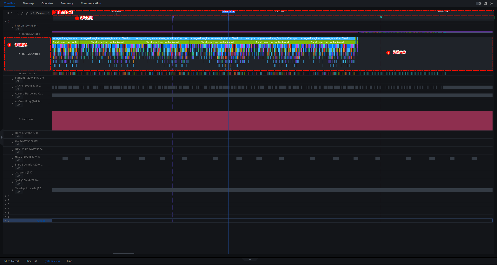
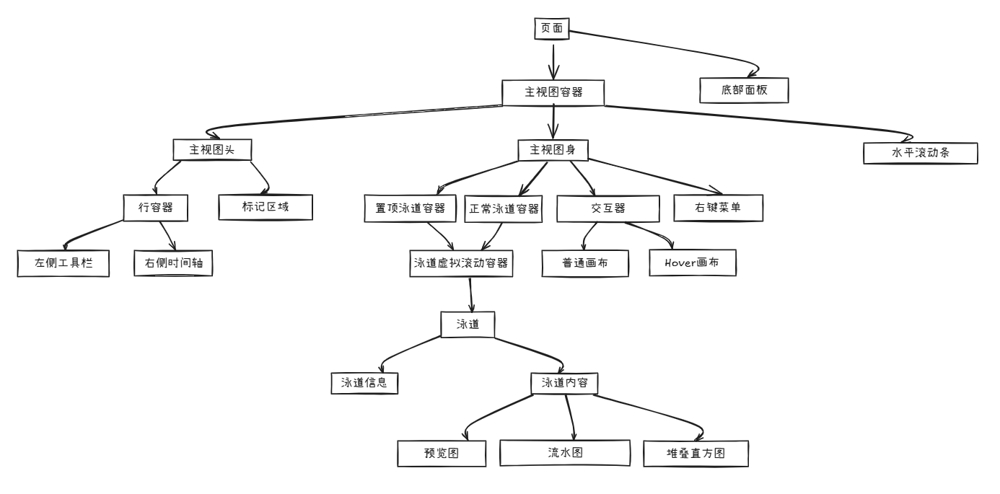
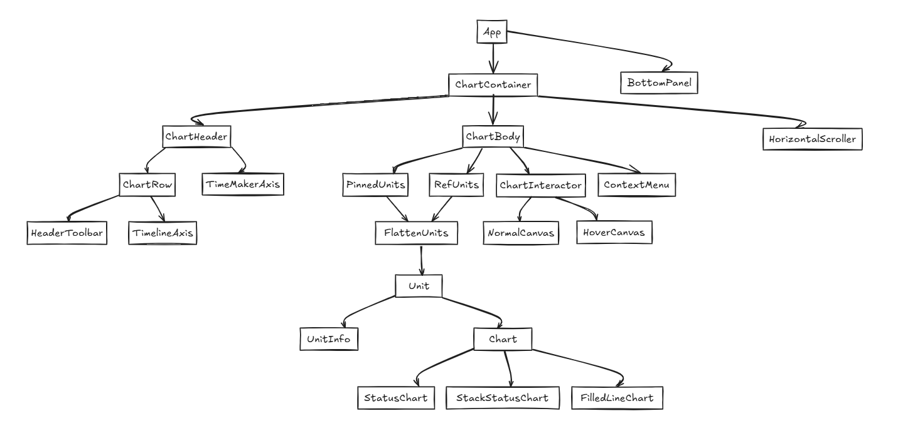
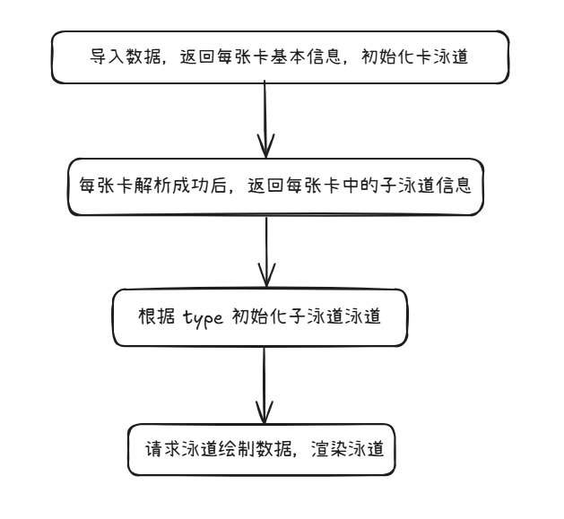
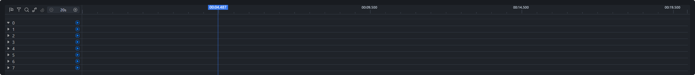
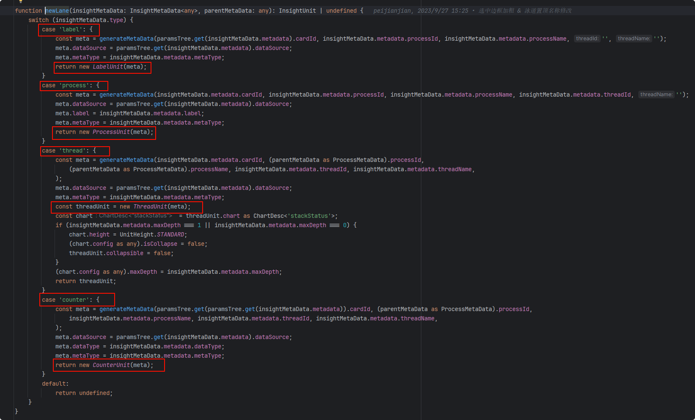
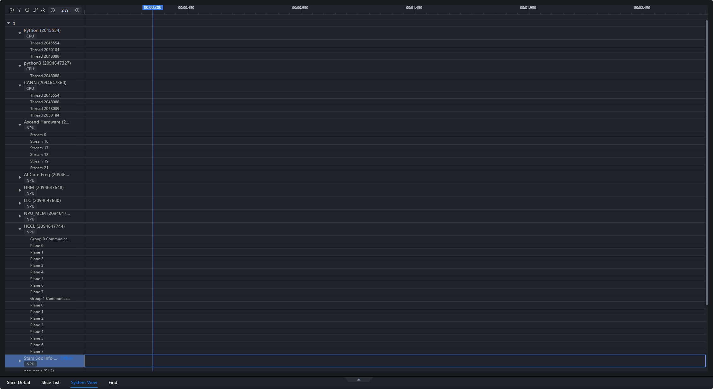

# 泳道绘制

## 1、概述

Timeline 中泳道绘制涉及以下几个区域，分别是：

**① 时间轴区域**、**② 标记区域**、**泳道区域**（每条泳道包含 **③ 泳道信息**、**④ 泳道内容**）。



## 2、组件关系





## 3、时间轴区域

**组件：**

```jsx
<TimelineAxis />
```

**绘制频率：** 使用自定义的渲染引擎 renderEngine 持续重绘

**绘制内容：** 根据 session.domain 中的 _domainStart 和_domainEnd 计算

## 4、标记（插旗）区域

**组件：**

```jsx
<TimeMarkerAxis />
```

**绘制时机：**
依赖以下参数的变化：
width（区域宽度）、domainStart、domainEnd、 session.timelineMarker.refreshTrigger（触发标志）、 session.selectedRange

**绘制内容：**

1. 点击插旗：通过点击绘制的插旗，使用 ref=canvas 的画布绘制
2. Hover插旗：鼠标 hover 显示的插旗，使用 ref=flagCursor 的画布绘制
3. 插旗虚线：插旗下方连接的虚线，使用 ref=vertical 的画布绘制

## 5、泳道区域

### 5.1 泳道信息

**组件：**

```jsx
<UnitInfo />
```

**内容：**

1. 配置组件
2. 置顶组件
3. 泳道名称

### 5.2 泳道内容

**组件：**

```jsx
<Chart />
```

#### 5.2.1 泳道类型

在 AscendUnit.tsx 中定义了泳道类，以下为每种类型的泳道对应渲染的图表类型，目前使用到的图表类型有三种：
**StatusChart、StackStatusChart、FilledLineChart**

| 泳道类型    | 图表类型             |
|---------|------------------|
| Root    | -                |
| Card    | -                |
| Process | StatusChart      |
| Thread  | StackStatusChart |
| Counter | FilledLineChart  |
| Label   | -                |

#### 5.2.2 数据接口

| 接口                       | 描述       |
|--------------------------|----------|
| import/action            | 导入文件路径   |
| parse/success            | 数据解析成功   |
| unit/threadTracesSummary | 获取线程预览数据 |
| unit/threadTraces        | 获取线程数据   |
| unit/counter             | 获取直方图数据  |

#### 5.2.3 总体流程



1. 导入数据（import/action）：获取到所有卡的基础信息，遍历数据实例化每张卡泳道 new CardUnit，并储存在 session.units 中；

   

2. 单卡解析成功（parse/success）：每张卡解析成功后，后端会返回该卡解析成功的事件，事件中包含该卡的详情数据（如子泳道数据 children、metadata等）。遍历 children，根据数据类型 type 实例化不同类型泳道，并将子泳道补充到 session.units 对应的父泳道中；

   

   

3. 当展开泳道时，会请求该泳道的内容（绘制）数据，不同泳道使用不同接口：

   | 泳道类型       | 接口                       | 描述       |
   |------------|--------------------------|----------|
   | Label 泳道   | -                        | -        |
   | Process 泳道 | unit/threadTracesSummary | 获取线程预览数据 |
   | Thread 泳道  | unit/threadTraces        | 获取线程数据   |
   | Counter 泳道 | unit/counter             | 获取直方图数据  |

### 5.3 泳道遮罩

在所有泳道内容区域中，有 NormalCanvas 和 HoverCanvas 两个画布，用于跨泳道内容的绘制，其中 HoverCanvas 用于鼠标移动过程中的所需内容绘制。

这两个画布中定义鼠标事件、键盘事件通过 useImperativeHandle 向外暴露，实际绑定在 ChartContainer 组件上。

[画布](./figures/track-render/content-4.png)

## 6、交互

### 6.1 置顶

置顶交互位于泳道信息区，由 `UnitInfo` 相关组件承载。用户对某条泳道执行置顶后，该泳道需要在滚动或展开其他泳道时保持可见，便于对照其他泳道内容。

开发时需要关注：

- 置顶状态是否与泳道 ID 绑定。
- 父子泳道展开或折叠后，置顶泳道是否仍能正确定位。
- 置顶泳道的数据请求与普通泳道保持一致，不应绕过 `unit/threadTracesSummary`、`unit/threadTraces`、`unit/counter` 等接口。

### 6.2 框选

框选用于在图形区域选择一个时间范围。框选范围会影响表格、详情或其他模块联动，相关状态通常与 `session.selectedRange` 相关。

开发时需要关注：

- 框选开始时间和结束时间是否落在当前 `session.domain` 范围内。
- 框选范围变化后，相关图表是否重新绘制。
- 不同图表类型（`StatusChart`、`StackStatusChart`、`FilledLineChart`）对框选范围的处理是否一致。

### 6.3 缩放

缩放通过改变时间域范围驱动图形重新绘制。时间轴区域根据 `session.domain` 中的 `_domainStart` 和 `_domainEnd` 计算刻度，泳道内容也需要使用同一时间域完成坐标换算。

开发时需要关注：

- 缩放后时间轴、标记区域、泳道内容使用同一时间域。
- 大数据量场景下避免在每次重绘中重复执行高成本计算。
- 需要重新请求数据时，应优先复用已有缓存或按当前时间范围请求。

### 6.4 跳转

跳转用于定位目标时间点、目标切片或目标算子。跳转后应更新可视区域，并确保目标对象在当前视图范围内可见。

开发时需要关注：

- 跳转目标是否有明确的时间戳或切片 ID。
- 跳转后 `domainStart` / `domainEnd` 与选中状态是否同步更新。
- 若目标数据尚未加载，需要先触发对应泳道数据请求，再执行定位。

## 7、开发与验证建议

### 7.1 关键代码入口

- 泳道类定义：`modules/timeline/src/insight/units/AscendUnit.tsx`
- 泳道信息组件：`modules/timeline/src/components/ChartContainer/Units/UnitInfo.tsx`
- 图表类型：`StatusChart`、`StackStatusChart`、`FilledLineChart`
- 数据缓存：`modules/timeline/src/cache/simplecache.ts`

具体路径随代码演进可能调整，维护本文时需以仓库源码为准。

### 7.2 新增泳道开发步骤

1. 在泳道定义中补充新的 Unit 类型和必要元数据。
2. 明确新泳道使用的图表类型。
3. 后端补充或复用数据接口。
4. 前端在展开泳道时触发对应数据请求。
5. 验证置顶、框选、缩放、hover、跳转等交互是否受影响。

### 7.3 验证方法

- 导入包含 Timeline 数据的 TEXT 或 DB 数据。
- 展开 Card、Process、Thread、Counter 等不同类型泳道。
- 验证 `import/action`、`parse/success`、`unit/threadTracesSummary`、`unit/threadTraces`、`unit/counter` 的请求链路。
- 验证置顶、框选、缩放、跳转、hover 是否正常。
